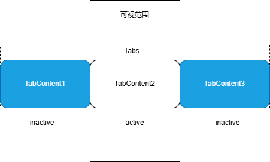
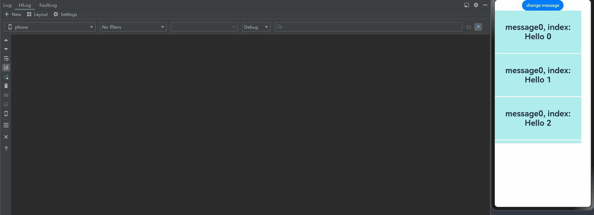
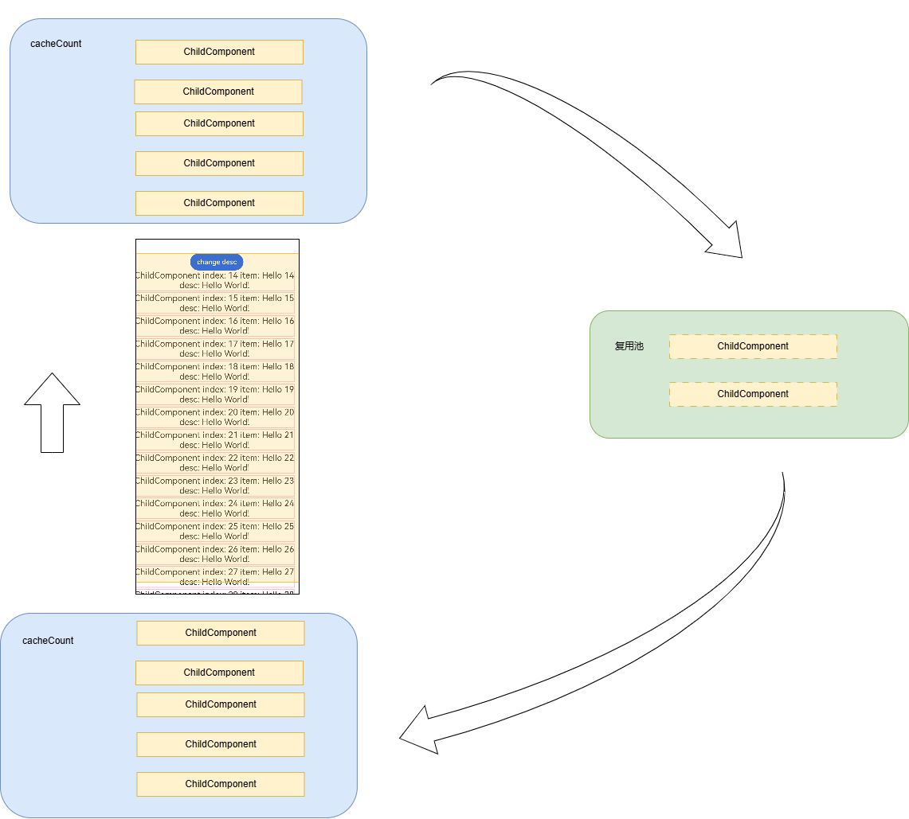
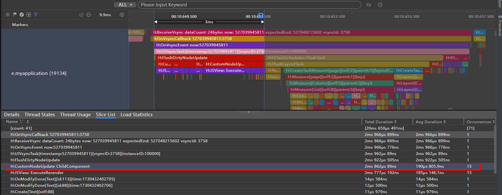
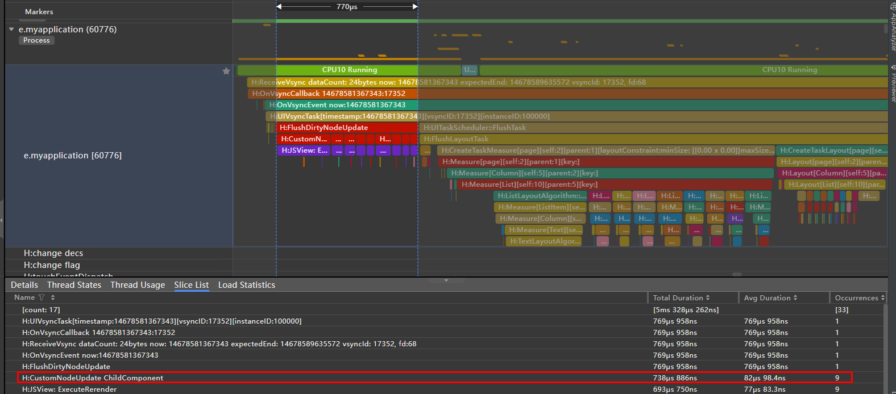
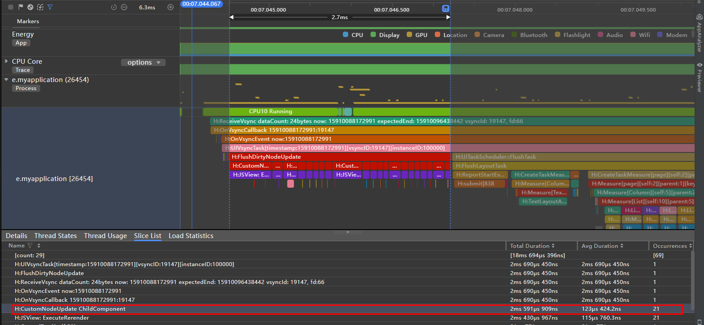

# 自定义组件冻结功能

自定义组件冻结功能专为优化复杂UI页面的性能而设计，尤其适用于包含多个页面栈、长列表或宫格布局的场景。在这些情况下，当状态变量绑定了多个UI组件，其变化可能触发大量UI组件的刷新，进而导致界面卡顿和响应延迟。为了提升这类负载UI界面的刷新性能，开发者可以选择尝试使用自定义组件冻结功能。

组件冻结的工作原理是：
1. 开发者通过设置freezeWhenInactive属性，即可激活组件冻结机制。
2. 启用后，系统将仅对处于激活状态的自定义组件进行更新，这使得UI框架可以尽量缩小更新范围，仅限于用户可见范围内（激活状态）的自定义组件，从而提高复杂UI场景下的刷新效率。
3. 当之前处于inactive状态的自定义组件重新变为active状态时，状态管理框架会对其执行必要的刷新操作，确保UI的正确展示。

简而言之，组件冻结旨在优化复杂界面下的UI刷新性能。在存在多个不可见自定义组件的情况下，如多页面栈、长列表或宫格，通过组件冻结可以实现按需刷新，即仅刷新当前可见的自定义组件，而将不可见自定义组件的刷新延迟至它们变为可见时。

需要注意，组件active/inactive并不等同于其可见性。组件冻结目前仅适用于以下场景：

1. 页面路由：当前栈顶页面为active状态，非栈顶不可见页面为inactive状态。
2. TabContent：只有当前显示的TabContent中的自定义组件处于active状态，其余则为inactive。
3. LazyForEach：仅当前显示的LazyForEach中的自定义组件为active状态，而缓存节点的组件则为inactive状态。
4. Navigation：当前显示的NavDestination中的自定义组件为active状态，而其他未显示的NavDestination组件则为inactive状态。 
5. 组件复用：进入复用池的组件为inactive状态，从复用池上树的节点为active状态。
其他场景，如堆叠布局（Stack）下的被遮罩的组件，这些组件尽管不可见，但并不被视为inactive状态，因此不在组件冻结的适用范围内。


在阅读本文档前，开发者需要了解自定义组件基本语法。建议提前阅读：[自定义组件](./arkts-create-custom-components.md)。

> **说明：**
>
> 从API version 11开始，支持自定义组件冻结功能。

## 当前支持的场景

### 页面路由

当页面1调用router.pushUrl接口跳转到页面2时，页面1为隐藏不可见状态，此时如果更新页面1中的状态变量，不会触发页面1刷新。
图示如下：


页面1：

```ts
import { router } from '@kit.ArkUI';

@Entry
@Component({ freezeWhenInactive: true })
struct Page1 {
  @StorageLink('PropA') @Watch("first") storageLink: number = 47;

  first() {
    console.info("first page " + `${this.storageLink}`)
  }

  build() {
    Column() {
      Text(`From fist Page ${this.storageLink}`).fontSize(50)
      Button('first page storageLink + 1').fontSize(30)
        .onClick(() => {
          this.storageLink += 1
        })
      Button('go to next page').fontSize(30)
        .onClick(() => {
          router.pushUrl({ url: 'pages/Page2' })
        })
    }
  }
}
```

页面2：

```ts
import { router } from '@kit.ArkUI';

@Entry
@Component({ freezeWhenInactive: true })
struct Page2 {
  @StorageLink('PropA') @Watch("second") storageLink2: number = 1;

  second() {
    console.info("second page: " + `${this.storageLink2}`)
  }

  build() {
    Column() {

      Text(`second Page ${this.storageLink2}`).fontSize(50)
      Button('Change Divider.strokeWidth')
        .onClick(() => {
          router.back()
        })

      Button('second page storageLink2 + 2').fontSize(30)
        .onClick(() => {
          this.storageLink2 += 2
        })

    }
  }
}
```

在上面的示例中：

1.点击页面1中的Button “first page storageLink + 1”，storageLink状态变量改变，@Watch中注册的方法first会被调用。

2.通过router.pushUrl({url: 'pages/second'})，跳转到页面2，页面1隐藏，状态由active变为inactive。

3.点击页面2中的Button “this.storageLink2 += 2”，只回调页面2@Watch中注册的方法second，因为页面1的状态变量此时已被冻结。

4.点击“back”，页面2被销毁，页面1的状态由inactive变为active，重新刷新在inactive时被冻结的状态变量，页面1@Watch中注册的方法first被再次调用。


### TabContent

- 对Tabs中当前不可见的TabContent进行冻结，不会触发组件的更新。

- 需要注意的是：在首次渲染的时候，Tab只会创建当前正在显示的TabContent，当切换全部的TabContent后，TabContent才会被全部创建。

图示如下：


```ts
@Entry
@Component
struct TabContentTest {
  @State @Watch("onMessageUpdated") message: number = 0;
  private data: number[] = [0, 1]

  onMessageUpdated() {
    console.info(`TabContent message callback func ${this.message}`)
  }

  build() {
    Row() {
      Column() {
        Button('change message').onClick(() => {
          this.message++
        })

        Tabs() {
          ForEach(this.data, (item: number) => {
            TabContent() {
              FreezeChild({ message: this.message, index: item })
            }.tabBar(`tab${item}`)
          }, (item: number) => item.toString())
        }
      }
      .width('100%')
    }
    .height('100%')
  }
}

@Component({ freezeWhenInactive: true })
struct FreezeChild {
  @Link @Watch("onMessageUpdated") message: number
  private index: number = 0

  onMessageUpdated() {
    console.info(`FreezeChild message callback func ${this.message}, index: ${this.index}`)
  }

  build() {
    Text("message" + `${this.message}, index: ${this.index}`)
      .fontSize(50)
      .fontWeight(FontWeight.Bold)
  }
}
```

在上面的示例中：

1.点击“change message”更改message的值，当前正在显示的TabContent组件中的@Watch中注册的方法onMessageUpdated被触发。

2.点击“two”切换到另外的TabContent，TabContent状态由inactive变为active，对应的@Watch中注册的方法onMessageUpdated被触发。 

3.再次点击“change message”更改message的值，仅当前显示的TabContent子组件中的@Watch中注册的方法onMessageUpdated被触发。


### LazyForEach

- 对LazyForEach中缓存的自定义组件进行冻结，不会触发组件的更新。

```ts
// 用于处理数据监听的IDataSource的基本实现
class BasicDataSource implements IDataSource {
  private listeners: DataChangeListener[] = [];
  private originDataArray: string[] = [];

  public totalCount(): number {
    return 0;
  }

  public getData(index: number): string {
    return this.originDataArray[index];
  }

  // 该方法为框架侧调用，为LazyForEach组件向其数据源处添加listener监听
  registerDataChangeListener(listener: DataChangeListener): void {
    if (this.listeners.indexOf(listener) < 0) {
      console.info('add listener');
      this.listeners.push(listener);
    }
  }

  // 该方法为框架侧调用，为对应的LazyForEach组件在数据源处去除listener监听
  unregisterDataChangeListener(listener: DataChangeListener): void {
    const pos = this.listeners.indexOf(listener);
    if (pos >= 0) {
      console.info('remove listener');
      this.listeners.splice(pos, 1);
    }
  }

  // 通知LazyForEach组件需要重载所有子组件
  notifyDataReload(): void {
    this.listeners.forEach(listener => {
      listener.onDataReloaded();
    })
  }

  // 通知LazyForEach组件需要在index对应索引处添加子组件
  notifyDataAdd(index: number): void {
    this.listeners.forEach(listener => {
      listener.onDataAdd(index);
    })
  }

  // 通知LazyForEach组件在index对应索引处数据有变化，需要重建该子组件
  notifyDataChange(index: number): void {
    this.listeners.forEach(listener => {
      listener.onDataChange(index);
    })
  }

  // 通知LazyForEach组件需要在index对应索引处删除该子组件
  notifyDataDelete(index: number): void {
    this.listeners.forEach(listener => {
      listener.onDataDelete(index);
    })
  }
}

class MyDataSource extends BasicDataSource {
  private dataArray: string[] = [];

  public totalCount(): number {
    return this.dataArray.length;
  }

  public getData(index: number): string {
    return this.dataArray[index];
  }

  public addData(index: number, data: string): void {
    this.dataArray.splice(index, 0, data);
    this.notifyDataAdd(index);
  }

  public pushData(data: string): void {
    this.dataArray.push(data);
    this.notifyDataAdd(this.dataArray.length - 1);
  }
}

@Entry
@Component
struct LforEachTest {
  private data: MyDataSource = new MyDataSource();
  @State @Watch("onMessageUpdated") message: number = 0;

  onMessageUpdated() {
    console.info(`LazyforEach message callback func ${this.message}`)
  }

  aboutToAppear() {
    for (let i = 0; i <= 20; i++) {
      this.data.pushData(`Hello ${i}`)
    }
  }

  build() {
    Column() {
      Button('change message').onClick(() => {
        this.message++
      })
      List({ space: 3 }) {
        LazyForEach(this.data, (item: string) => {
          ListItem() {
            FreezeChild({ message: this.message, index: item })
          }
        }, (item: string) => item)
      }.cachedCount(5).height(500)
    }

  }
}

@Component({ freezeWhenInactive: true })
struct FreezeChild {
  @Link @Watch("onMessageUpdated") message: number;
  private index: string = "";

  aboutToAppear() {
    console.info(`FreezeChild aboutToAppear index: ${this.index}`)
  }

  onMessageUpdated() {
    console.info(`FreezeChild message callback func ${this.message}, index: ${this.index}`)
  }

  build() {
    Text("message" + `${this.message}, index: ${this.index}`)
      .width('90%')
      .height(160)
      .backgroundColor(0xAFEEEE)
      .textAlign(TextAlign.Center)
      .fontSize(30)
      .fontWeight(FontWeight.Bold)
  }
}
```

在上面的示例中：

1.点击“change message”更改message的值，当前正在显示的ListItem中的子组件@Watch中注册的方法onMessageUpdated被触发。缓存节点@Watch中注册的方法不会被触发。（如果不加组件冻结，当前正在显示的ListItem和cachecount缓存节点@Watch中注册的方法onMessageUpdated都会触发watch回调。）

2.List区域外的ListItem滑动到List区域内，状态由inactive变为active，对应的@Watch中注册的方法onMessageUpdated被触发。

3.再次点击“change message”更改message的值，仅有当前显示的ListItem中的子组件@Watch中注册的方法onMessageUpdated被触发。



### Navigation

- 当NavDestination不可见时，会对其子自定义组件设置成非激活态，不会触发组件的刷新。当返回该页面时，其子自定义组件重新恢复成激活态，触发@Watch回调进行刷新。

- 在下面例子中，NavigationContentMsgStack会被设置成非激活态，将不再响应状态变量的变化，也不会触发组件刷新。

```ts
@Entry
@Component
struct MyNavigationTestStack {
  @Provide('pageInfo') pageInfo: NavPathStack = new NavPathStack();
  @State @Watch("info") message: number = 0;
  @State logNumber: number = 0;

  info() {
    console.info(`freeze-test MyNavigation message callback ${this.message}`);
  }

  @Builder
  PageMap(name: string) {
    if (name === 'pageOne') {
      pageOneStack({ message: this.message, logNumber: this.logNumber })
    } else if (name === 'pageTwo') {
      pageTwoStack({ message: this.message, logNumber: this.logNumber })
    } else if (name === 'pageThree') {
      pageThreeStack({ message: this.message, logNumber: this.logNumber })
    }
  }

  build() {
    Column() {
      Button('change message')
        .onClick(() => {
          this.message++;
        })
      Navigation(this.pageInfo) {
        Column() {
          Button('Next Page', { stateEffect: true, type: ButtonType.Capsule })
            .width('80%')
            .height(40)
            .margin(20)
            .onClick(() => {
              this.pageInfo.pushPath({ name: 'pageOne' }); //将name指定的NavDestination页面信息入栈
            })
        }
      }.title('NavIndex')
      .navDestination(this.PageMap)
      .mode(NavigationMode.Stack)
    }
  }
}

@Component
struct pageOneStack {
  @Consume('pageInfo') pageInfo: NavPathStack;
  @State index: number = 1;
  @Link message: number;
  @Link logNumber: number;

  build() {
    NavDestination() {
      Column() {
        NavigationContentMsgStack({ message: this.message, index: this.index, logNumber: this.logNumber })
        Text("cur stack size:" + `${this.pageInfo.size()}`)
          .fontSize(30)
          .fontWeight(FontWeight.Bold)
        Button('Next Page', { stateEffect: true, type: ButtonType.Capsule })
          .width('80%')
          .height(40)
          .margin(20)
          .onClick(() => {
            this.pageInfo.pushPathByName('pageTwo', null);
          })
        Button('Back Page', { stateEffect: true, type: ButtonType.Capsule })
          .width('80%')
          .height(40)
          .margin(20)
          .onClick(() => {
            this.pageInfo.pop();
          })
      }.width('100%').height('100%')
    }.title('pageOne')
    .onBackPressed(() => {
      this.pageInfo.pop();
      return true;
    })
  }
}

@Component
struct pageTwoStack {
  @Consume('pageInfo') pageInfo: NavPathStack;
  @State index: number = 2;
  @Link message: number;
  @Link logNumber: number;

  build() {
    NavDestination() {
      Column() {
        NavigationContentMsgStack({ message: this.message, index: this.index, logNumber: this.logNumber })
        Text("cur stack size:" + `${this.pageInfo.size()}`)
          .fontSize(30)
          .fontWeight(FontWeight.Bold)
        Button('Next Page', { stateEffect: true, type: ButtonType.Capsule })
          .width('80%')
          .height(40)
          .margin(20)
          .onClick(() => {
            this.pageInfo.pushPathByName('pageThree', null);
          })
        Button('Back Page', { stateEffect: true, type: ButtonType.Capsule })
          .width('80%')
          .height(40)
          .margin(20)
          .onClick(() => {
            this.pageInfo.pop();
          })
      }.width('100%').height('100%')
    }.title('pageTwo')
    .onBackPressed(() => {
      this.pageInfo.pop();
      return true;
    })
  }
}

@Component
struct pageThreeStack {
  @Consume('pageInfo') pageInfo: NavPathStack;
  @State index: number = 3;
  @Link message: number;
  @Link logNumber: number;

  build() {
    NavDestination() {
      Column() {
        NavigationContentMsgStack({ message: this.message, index: this.index, logNumber: this.logNumber })
        Text("cur stack size:" + `${this.pageInfo.size()}`)
          .fontSize(30)
          .fontWeight(FontWeight.Bold)
        Button('Next Page', { stateEffect: true, type: ButtonType.Capsule })
          .width('80%')
          .height(40)
          .margin(20)
          .onClick(() => {
            this.pageInfo.pushPathByName('pageOne', null);
          })
        Button('Back Page', { stateEffect: true, type: ButtonType.Capsule })
          .width('80%')
          .height(40)
          .margin(20)
          .onClick(() => {
            this.pageInfo.pop();
          })
      }.width('100%').height('100%')
    }.title('pageThree')
    .onBackPressed(() => {
      this.pageInfo.pop();
      return true;
    })
  }
}

@Component({ freezeWhenInactive: true })
struct NavigationContentMsgStack {
  @Link @Watch("info") message: number;
  @Link index: number;
  @Link logNumber: number;

  info() {
    console.info(`freeze-test NavigationContent message callback ${this.message}`);
    console.info(`freeze-test ---- called by content ${this.index}`);
    this.logNumber++;
  }

  build() {
    Column() {
      Text("msg:" + `${this.message}`)
        .fontSize(30)
        .fontWeight(FontWeight.Bold)
      Text("log number:" + `${this.logNumber}`)
        .fontSize(30)
        .fontWeight(FontWeight.Bold)
    }
  }
}
```

在上面的示例中：

1.点击“change message”更改message的值，当前正在显示的MyNavigationTestStack组件中的@Watch中注册的方法info被触发。

2.点击“Next Page”切换到PageOne，创建pageOneStack节点。

3.再次点击“change message”更改message的值，仅pageOneStack中的NavigationContentMsgStack子组件中的@Watch中注册的方法info被触发。

4.再次点击“Next Page”切换到PageTwo，创建pageTwoStack节点。

5.再次点击“change message”更改message的值，仅pageTwoStack中的NavigationContentMsgStack子组件中的@Watch中注册的方法info被触发。

6.再次点击“Next Page”切换到PageThree，创建pageThreeStack节点。

7.再次点击“change message”更改message的值，仅pageThreeStack中的NavigationContentMsgStack子组件中的@Watch中注册的方法info被触发。

8.点击“Back Page”回到PageTwo，此时，仅pageTwoStack中的NavigationContentMsgStack子组件中的@Watch中注册的方法info被触发。

9.再次点击“Back Page”回到PageOne，此时，仅pageOneStack中的NavigationContentMsgStack子组件中的@Watch中注册的方法info被触发。

10.再次点击“Back Page”回到初始页，此时，无任何触发。


### 组件复用

<!--RP1-->[组件复用](../performance/component-recycle.md)<!--RP1End-->通过重利用缓存池中已存在的节点，而非创建新节点，来优化UI性能并提升应用流畅度。复用池中的节点尽管未在UI组件树上展示，但是状态变量的更改仍会触发UI刷新。为了解决复用池中组件异常刷新问题，可以使用组件冻结避免复用池中的组件刷新。

#### 组件复用、if和组件冻结混用场景
下面是组件复用、if组件和组件冻结混合使用场景的例子，if组件绑定的状态变量变化成false时，触发子组件`ChildComponent`的下树，由于`ChildComponent`被标记了组件复用，所以不会被销毁，而是进入复用池，这个时候如果同时开启了组件冻结，则可以使在复用池里不再刷新。
具体流程如下：
1. 点击`change flag`，改变`flag`为false：
    -  被标记\@Reusable的`ChildComponent`组件在下树时，不会被销毁，而是进入复用池，触发aboutToRecycle生命周期，同时设置状态为inactive。
    - `ChildComponent`同时也开启了组件冻结，当其状态为inactive时，不会响应任何状态变量变化带来的UI刷新。
2. 点击`change desc`，触发`Page`的成员变量`desc`的变化。
    - `desc`是\@State装饰的，其变化会通知给其子组件`ChildComponent`\@Link装饰的`desc`。
    - 但因为`ChildComponent`是inactive状态，且开启了组件冻结，所以这次变化并不会触发`@Watch('descChange')`的回调，以及`ChildComponent`UI刷新。如果没有开启组件冻结，当前`@Watch('descChange')`会立即回调，且复用池内的`ChildComponent`组件也会对应刷新。
3. 再次点击`change flag`，改变`flag`为true：
    - `ChildComponent`从复用池中重新加入到组件树上。
    - 回调aboutToReuse生命周期，将当前最新的`count`值同步给子组件。`desc`是通过@State->@Link同步的，所以无需开发者手动在aboutToReuse中赋值。
    - 设置ChildComponent为active状态，并且刷新在inactive时没有刷新的组件，在当前例子中，就是Text(ChildComponent desc: ${this.desc})。


```ts
@Reusable
@Component({freezeWhenInactive: true})
struct ChildComponent {
  @Link @Watch('descChange') desc: string;
  @State count: number = 0;
  descChange() {
    console.info(`ChildComponent messageChange ${this.desc}`);
  }

  aboutToReuse(params: Record<string, ESObject>): void {
    this.count = params.count as number;
  }

  aboutToRecycle(): void {
    console.info(`ChildComponent has been recycled`);
  }
  build() {
    Column() {
      Text(`ChildComponent desc: ${this.desc}`)
        .fontSize(20)
      Text(`ChildComponent count ${this.count}`)
        .fontSize(20)
    }.border({width: 2, color: Color.Pink})
  }
}

@Entry
@Component
struct Page {
  @State desc: string = 'Hello World';
  @State flag: boolean = true;
  @State count: number = 0;
  build() {
    Column() {
      Button(`change desc`).onClick(() => {
        this.desc += '!';
      })
      Button(`change flag`).onClick(() => {
        this.count++;
        this.flag =! this.flag;
      })
      if (this.flag) {
        ChildComponent({desc: this.desc, count: this.count})
      }
    }
    .height('100%')
  }
}
```
#### LazyForEach、组件复用和组件冻结混用场景
在数据很多的长列表滑动场景下，开发者会使用LazyForEach来按需创建组件，同时配合组件复用降低在滑动过程中因创建和销毁组件带来的开销。
但是开发者如果根据其复用类型不同，设置了<!--RP2-->[reuseId](../performance/component-recycle.md#接口说明)<!--RP2End-->，或者为了保证滑动性能设置了较大的cacheCount，这就可能使复用池或者LazyForEach缓存较多的节点。
在这种情况下，如果开发者触发List下所有子节点的刷新，就会带来节点刷新数量过大的问题，这个时候，可以考虑搭配组件冻结使用。

如下面例子：
1. 滑动到index为14的位置，当前屏幕上可见区域内有15个`ChildComponent`。
2. 在滑动过程中：
    - 列表上端的`ChildComponent`滑出可视区域外，此时先进入LazyForEach的缓存区域内，被设置inactive。在滑出LazyForEach区域外后，因为标记了组件复用，所以并不会被析构，会进入复用池，此时再次被设置inactive。
    - 列表下端LazyForEach的缓存节点会进入List范围内，此时会试图请求创建新的节点进入LazyForEach的缓存，发现有可复用的节点时，从复用池中拿出已有节点，触发aboutToReuse生命周期回调，此时因为节点进入的是LazyForEach的缓存区域，所以其状态依旧是inactive。
3. 点击`change desc`，触发`Page`的成员变量`desc`的变化。
    - `desc`是\@State装饰的，其变化会通知给其子组件`ChildComponent`\@Link装饰的`desc`。
    - 非可视区域内的`ChildComponent`是inactive状态，且开启了组件冻结，所以这次变化只触发可视区域内的15个节点的`@Watch('descChange')`回调，并只刷新对应可视区域内的15个节点。LazyForEach和复用池中的节点并不会刷新，也不会触发\@Watch回调。
    
图示如下：

可通过trace观察，仅触发了15个`ChildComponent`节点的刷新。

完整示例如下：
```ts
import { hiTraceMeter } from '@kit.PerformanceAnalysisKit';
// 用于处理数据监听的IDataSource的基本实现
class BasicDataSource implements IDataSource {
  private listeners: DataChangeListener[] = [];
  private originDataArray: string[] = [];

  public totalCount(): number {
    return 0;
  }

  public getData(index: number): string {
    return this.originDataArray[index];
  }

  // 该方法为框架侧调用，为LazyForEach组件向其数据源处添加listener监听
  registerDataChangeListener(listener: DataChangeListener): void {
    if (this.listeners.indexOf(listener) < 0) {
      console.info('add listener');
      this.listeners.push(listener);
    }
  }

  // 该方法为框架侧调用，为对应的LazyForEach组件在数据源处去除listener监听
  unregisterDataChangeListener(listener: DataChangeListener): void {
    const pos = this.listeners.indexOf(listener);
    if (pos >= 0) {
      console.info('remove listener');
      this.listeners.splice(pos, 1);
    }
  }

  // 通知LazyForEach组件需要重载所有子组件
  notifyDataReload(): void {
    this.listeners.forEach(listener => {
      listener.onDataReloaded();
    })
  }

  // 通知LazyForEach组件需要在index对应索引处添加子组件
  notifyDataAdd(index: number): void {
    this.listeners.forEach(listener => {
      listener.onDataAdd(index);
    })
  }

  // 通知LazyForEach组件在index对应索引处数据有变化，需要重建该子组件
  notifyDataChange(index: number): void {
    this.listeners.forEach(listener => {
      listener.onDataChange(index);
    })
  }

  // 通知LazyForEach组件需要在index对应索引处删除该子组件
  notifyDataDelete(index: number): void {
    this.listeners.forEach(listener => {
      listener.onDataDelete(index);
    })
  }

  // 通知LazyForEach组件将from索引和to索引处的子组件进行交换
  notifyDataMove(from: number, to: number): void {
    this.listeners.forEach(listener => {
      listener.onDataMove(from, to);
    })
  }
}

class MyDataSource extends BasicDataSource {
  private dataArray: string[] = [];

  public totalCount(): number {
    return this.dataArray.length;
  }

  public getData(index: number): string {
    return this.dataArray[index];
  }

  public addData(index: number, data: string): void {
    this.dataArray.splice(index, 0, data);
    this.notifyDataAdd(index);
  }

  public pushData(data: string): void {
    this.dataArray.push(data);
    this.notifyDataAdd(this.dataArray.length - 1);
  }
}

@Reusable
@Component({freezeWhenInactive: true})
struct ChildComponent {
  @Link @Watch('descChange') desc: string;
  @State item: string = '';
  @State index: number = 0;
  descChange() {
    console.info(`ChildComponent messageChange ${this.desc}`);
  }

  aboutToReuse(params: Record<string, ESObject>): void {
    this.item = params.item;
    this.index = params.index;
  }

  aboutToRecycle(): void {
    console.info(`ChildComponent has been recycled`);
  }
  build() {
    Column() {
      Text(`ChildComponent index: ${this.index} item: ${this.item}`)
        .fontSize(20)
      Text(`desc: ${this.desc}`)
        .fontSize(20)
    }.border({width: 2, color: Color.Pink})
  }
}

@Entry
@Component
struct Page {
  @State desc: string = 'Hello World';
  private data: MyDataSource = new MyDataSource();

  aboutToAppear() {
    for (let i = 0; i < 50; i++) {
      this.data.pushData(`Hello ${i}`);
    }
  }

  build() {
    Column() {
      Button(`change desc`).onClick(() => {
        hiTraceMeter.startTrace('change decs', 1);
        this.desc += '!';
        hiTraceMeter.finishTrace('change decs', 1);
      })
      List({ space: 3 }) {
        LazyForEach(this.data, (item: string, index: number) => {
          ListItem() {
            ChildComponent({index: index, item: item, desc: this.desc}).reuseId(index % 10 < 5 ? "1": "0")
          }
        }, (item: string) => item)
      }.cachedCount(5)
    }
    .height('100%')
  }
}
```
#### LazyForEach、if、组件复用和组件冻结混用场景

下面的场景中展示了LazyForEach、if、组件复用和组件冻结混用场景。在同一个父自定义组件下，可复用的节点可能通过不同的方式进入复用池，比如：
- 通过滑动从LazyForEach的缓存区域下树，进入复用池。
- if条件切换通知子节点下树，进入复用池。

在下面的例子中：
1. 当滑动到index为14的位置，屏幕上可见区域内有10个`ChildComponent`，9个是LazyForEach的子节点，1个是if的子节点。
2. 点击`change flag`，if的条件变成false，其子节点`ChildComponent`进入复用池。当前屏幕显示9个节点。
3. 此时不管是通过LazyForEach还是if下树的节点都会进入`Page`节点下的复用池。
4. 点击`change desc`，仅更新屏幕上的9个`ChildComponent`节点，具体可参考下面的trace。
5. 再次点击`change flag`，if的条件变成true，`ChildComponent`从复用池中重新加入到组件树上，其状态变成active。
6. 再次点击`change desc`，从复用池中通过if和LazyForEach上树的节点都可正常刷新。

开启组件冻结trace：



没有开启组件冻结trace：




完整例子如下：
```
import { hiTraceMeter } from '@kit.PerformanceAnalysisKit';
class BasicDataSource implements IDataSource {
  private listeners: DataChangeListener[] = [];
  private originDataArray: string[] = [];

  public totalCount(): number {
    return 0;
  }

  public getData(index: number): string {
    return this.originDataArray[index];
  }

  // 该方法为框架侧调用，为LazyForEach组件向其数据源处添加listener监听
  registerDataChangeListener(listener: DataChangeListener): void {
    if (this.listeners.indexOf(listener) < 0) {
      console.info('add listener');
      this.listeners.push(listener);
    }
  }

  // 该方法为框架侧调用，为对应的LazyForEach组件在数据源处去除listener监听
  unregisterDataChangeListener(listener: DataChangeListener): void {
    const pos = this.listeners.indexOf(listener);
    if (pos >= 0) {
      console.info('remove listener');
      this.listeners.splice(pos, 1);
    }
  }

  // 通知LazyForEach组件需要重载所有子组件
  notifyDataReload(): void {
    this.listeners.forEach(listener => {
      listener.onDataReloaded();
    })
  }

  // 通知LazyForEach组件需要在index对应索引处添加子组件
  notifyDataAdd(index: number): void {
    this.listeners.forEach(listener => {
      listener.onDataAdd(index);
    })
  }

  // 通知LazyForEach组件在index对应索引处数据有变化，需要重建该子组件
  notifyDataChange(index: number): void {
    this.listeners.forEach(listener => {
      listener.onDataChange(index);
    })
  }

  // 通知LazyForEach组件需要在index对应索引处删除该子组件
  notifyDataDelete(index: number): void {
    this.listeners.forEach(listener => {
      listener.onDataDelete(index);
    })
  }

  // 通知LazyForEach组件将from索引和to索引处的子组件进行交换
  notifyDataMove(from: number, to: number): void {
    this.listeners.forEach(listener => {
      listener.onDataMove(from, to);
    })
  }
}

class MyDataSource extends BasicDataSource {
  private dataArray: string[] = [];

  public totalCount(): number {
    return this.dataArray.length;
  }

  public getData(index: number): string {
    return this.dataArray[index];
  }

  public addData(index: number, data: string): void {
    this.dataArray.splice(index, 0, data);
    this.notifyDataAdd(index);
  }

  public pushData(data: string): void {
    this.dataArray.push(data);
    this.notifyDataAdd(this.dataArray.length - 1);
  }
}

@Reusable
@Component({freezeWhenInactive: true})
struct ChildComponent {
  @Link @Watch('descChange') desc: string;
  @State item: string = '';
  @State index: number = 0;
  descChange() {
    console.info(`ChildComponent messageChange ${this.desc}`);
  }

  aboutToReuse(params: Record<string, ESObject>): void {
    this.item = params.item;
    this.index = params.index;
  }

  aboutToRecycle(): void {
    console.info(`ChildComponent has been recycled`);
  }
  build() {
    Column() {
      Text(`ChildComponent index: ${this.index} item: ${this.item}`)
        .fontSize(20)
      Text(`desc: ${this.desc}`)
        .fontSize(20)
    }.border({width: 2, color: Color.Pink})
  }
}

@Entry
@Component
struct Page {
  @State desc: string = 'Hello World';
  @State flag: boolean = true;
  private data: MyDataSource = new MyDataSource();

  aboutToAppear() {
    for (let i = 0; i < 50; i++) {
      this.data.pushData(`Hello ${i}`);
    }
  }

  build() {
    Column() {
      Button(`change desc`).onClick(() => {
        hiTraceMeter.startTrace('change decs', 1);
        this.desc += '!';
        hiTraceMeter.finishTrace('change decs', 1);
      })

      Button(`change flag`).onClick(() => {
        hiTraceMeter.startTrace('change flag', 1);
        this.flag = !this.flag;
        hiTraceMeter.finishTrace('change flag', 1);
      })

      List({ space: 3 }) {
        LazyForEach(this.data, (item: string, index: number) => {
          ListItem() {
            ChildComponent({index: index, item: item, desc: this.desc}).reuseId(index % 10 < 5 ? "1": "0")
          }
        }, (item: string) => item)
      }
      .cachedCount(5)
      .height('60%')

      if (this.flag) {
        ChildComponent({index: -1, item: 'Hello', desc: this.desc}).reuseId( "1")
      }
    }
    .height('100%')
  }
}
```

## 限制条件
如下面的例子所示，FreezeBuildNode中使用了自定义节点[BuilderNode](../reference/apis-arkui/js-apis-arkui-builderNode.md)。BuilderNode可以通过命令式动态挂载组件，而组件冻结又是强依赖父子关系来通知是否开启组件冻结。如果父组件使用组件冻结，且组件树的中间层级上又启用了BuilderNode，则BuilderNode的子组件将无法被冻结。

```
import { BuilderNode, FrameNode, NodeController, UIContext } from '@kit.ArkUI';

// 定义一个Params类，用于传递参数
class Params {
  index: number = 0;

  constructor(index: number) {
    this.index = index;
  }
}

// 定义一个buildNodeChild组件，它包含一个message属性和一个index属性
@Component
struct buildNodeChild {
  @StorageProp("buildNodeTest") @Watch("onMessageUpdated") message: string = "hello world";
  @State index: number = 0;

  // 当message更新时，调用此方法
  onMessageUpdated() {
    console.log(`FreezeBuildNode builderNodeChild message callback func ${this.message},index：${this.index}`);
  }

  build() {
    Text(`buildNode Child message: ${this.message}`).fontSize(30)
  }
}

// 定义一个buildText函数，它接收一个Params参数并构建一个Column组件
@Builder
function buildText(params: Params) {
  Column() {
    buildNodeChild({ index: params.index })
  }
}

// 定义一个TextNodeController类，继承自NodeController
class TextNodeController extends NodeController {
  private textNode: BuilderNode<[Params]> | null = null;
  private index: number = 0;

  // 构造函数接收一个index参数
  constructor(index: number) {
    super();
    this.index = index;
  }

  // 创建并返回一个FrameNode
  makeNode(context: UIContext): FrameNode | null {
    this.textNode = new BuilderNode(context);
    this.textNode.build(wrapBuilder<[Params]>(buildText), new Params(this.index));
    return this.textNode.getFrameNode();
  }
}

// 定义一个Index组件，它包含一个message属性和一个data数组
@Entry
@Component
struct Index {
  @StorageLink("buildNodeTest") message: string = "hello";
  private data: number[] = [0, 1];

  build() {
    Row() {
      Column() {
        Button("change").fontSize(30)
          .onClick(() => {
            this.message += 'a';
          })

        Tabs() {
          ForEach(this.data, (item: number) => {
            TabContent() {
              FreezeBuildNode({ index: item })
            }.tabBar(`tab${item}`)
          }, (item: number) => item.toString())
        }
      }
    }
    .width('100%')
    .height('100%')
  }
}

// 定义一个FreezeBuildNode组件，它包含一个message属性和一个index属性
@Component({ freezeWhenInactive: true })
struct FreezeBuildNode {
  @StorageProp("buildNodeTest") @Watch("onMessageUpdated") message: string = "1111";
  @State index: number = 0;

  // 当message更新时，调用此方法
  onMessageUpdated() {
    console.log(`FreezeBuildNode message callback func ${this.message}, index: ${this.index}`);
  }

  build() {
    NodeContainer(new TextNodeController(this.index))
      .width('100%')
      .height('100%')
      .backgroundColor('#FFF0F0F0')
  }
}
```

在上面的示例中：

点击Button("change")。改变message的值，当前正在显示的TabContent组件中的@Watch中注册的方法onMessageUpdated被触发。未显示的TabContent中的BuilderNode节点下组件的@Watch方法onMessageUpdated也被触发，并没有被冻结。


