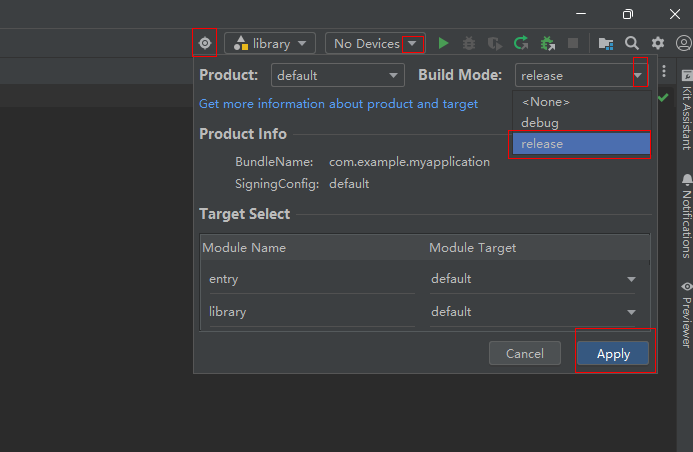

# 集成态HSP

集成态HSP是应用内HSP的中间编译产物，用于解决使用方的bundleName和签名之间的强耦合问题。
> **说明：** 
> HSP只能给bundleName一样的工程使用，集成态HSP可以给不同的bundleName的工程集成使用。

## 使用场景
集团内部有多个应用，多个应用中都有一个相同的动态共享包。为了节约开发成本并实现代码和资源的共享，多个应用可以共用一个基建HSP（集成态HSP）。

## 约束限制
- 集成态HSP只支持[Stage模型](application-package-structure-stage.md)。
- 集成态HSP需要API12及以上版本，需要在工程级的[build-profile.json5文件](https://developer.huawei.com/consumer/cn/doc/harmonyos-guides/ide-hvigor-build-profile-app)中，将useNormalizedOHMUrl字段设置为true。

## 开发使用说明
1. 创建方-集成态HSP-工程配置：配置工程级的build-profile.json5文件，将useNormalizedOHMUrl字段设置为true。

    ```json
    // created_party_project/build-profile.json5
    {
      "app": {
        "products": [
          {
            "name": "default",
            "signingConfig": "default",
            "compatibleSdkVersion": "5.0.0(12)",
            "runtimeOS": "HarmonyOS",
            "buildOption": {
              "strictMode": {
                "useNormalizedOHMUrl": true
              }
            }
            // ...
          }
        ]
        // ...
      }
    }
    ```
2. 创建方-集成态HSP-模块配置：修改模块级构建配置文件build-profile.json5，将integratedHsp配置项设置为true，指定构建的HSP模块为集成态HSP。

    ```json
    // created_party_project/library/build-profile.json5
    {
      "apiType": "stageMode",
      "buildOption": {
        "arkOptions": {
          "integratedHsp": true
        }
      }
    }
    ```

3. 创建方-集成态HSP-打包配置（tgz包）。

    (1) 配置项目签名信息，详情请参见[应用/服务签名](https://developer.huawei.com/consumer/cn/doc/harmonyos-guides/ide-signing)

    (2) 配置release模式；

    

    (3) 选择library目录，执行Build -> Make Module 'library'。

4. 使用方-创建目录并拷贝文件：在entry目录下新建libs目录，将集成态打包产物tgz包拷贝到libs目录下。

5. 使用方-工程依赖配置：在使用方主模块的oh-package.json5配置文件中添加依赖。

    ```json
    // user_project/entry/oh-package.json5
      "dependencies": {
        "hsp": "./libs/library-default.tgz"
      }
    ```

6. 使用方-工程配置：在工程级的build-profile.json5文件中，将useNormalizedOHMUrl字段设置为true。
    ```json
    // user_project/build-profile.json5
    {
      "app": {
        "products": [
          {
            "name": "default",
            "signingConfig": "default",
            "compatibleSdkVersion": "5.0.0(12)",
            "runtimeOS": "HarmonyOS",
            "buildOption": {
              "strictMode": {
                "useNormalizedOHMUrl": true
              }
            }
          }
        ]
      }
    }
    ```
    > **说明：** 
    > 安装和运行应用前，必须配置项目签名信息，详见[应用/服务签名](https://developer.huawei.com/consumer/cn/doc/harmonyos-guides/ide-signing)。