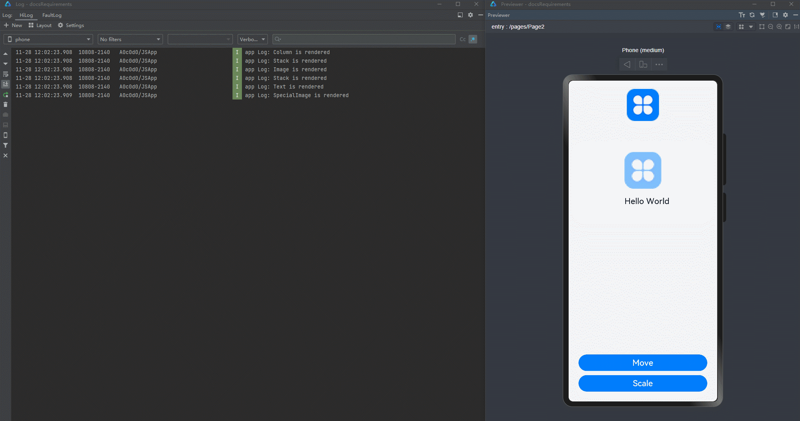
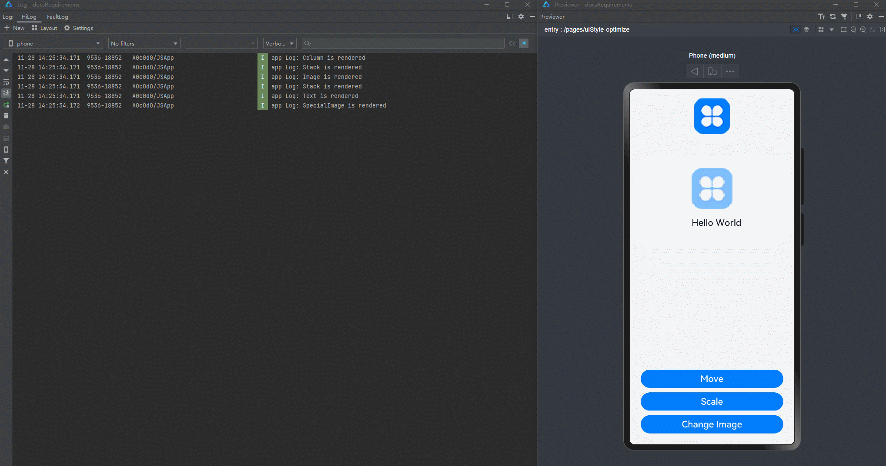
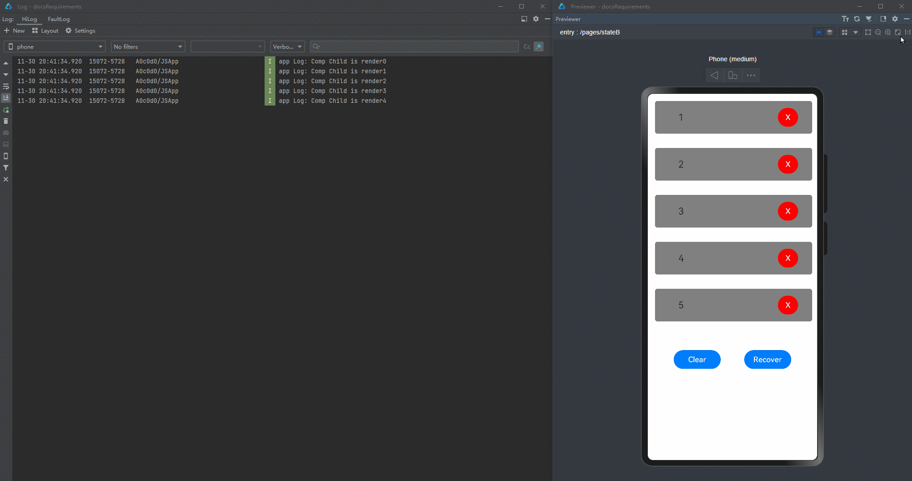
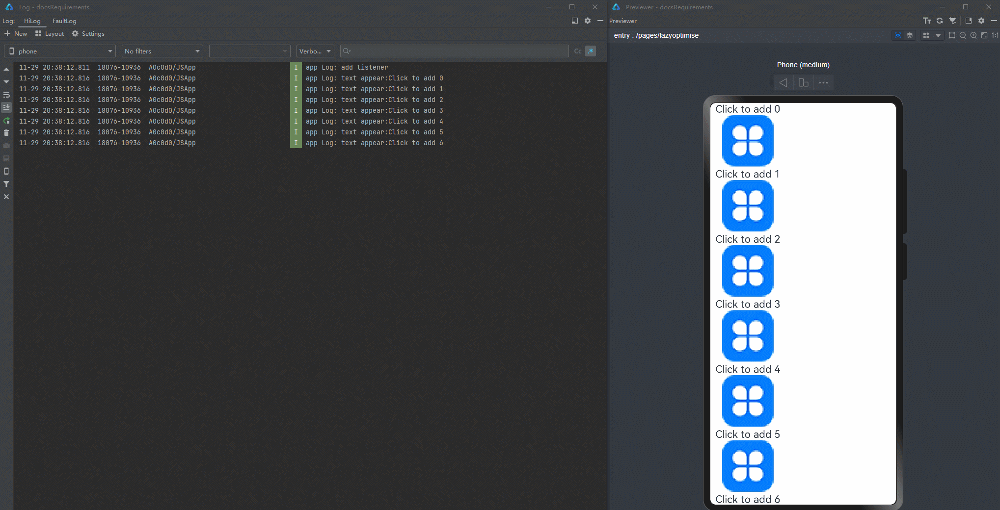

# 状态管理合理使用开发指导

由于对状态管理当前的特性并不了解，许多开发者在使用状态管理进行开发时会遇到UI不刷新、刷新性能差的情况。对此，本篇将从两个方向，对一共五个典型场景进行分析，同时提供相应的正例和反例，帮助开发者学习如何合理使用状态管理进行开发。

## 合理使用属性

### 将简单属性数组合并成对象数组

在开发过程中，我们经常会需要设置多个组件的同一种属性，比如Text组件的内容、组件的宽度、高度等样式信息等。将这些属性保存在一个数组中，配合ForEach进行使用是一种简单且方便的方法。

```typescript
@Entry
@Component
struct Index {
  @State items: string[] = [];
  @State ids: string[] = [];
  @State age: number[] = [];
  @State gender: string[] = [];

  aboutToAppear() {
    this.items.push("Head");
    this.items.push("List");
    for (let i = 0; i < 20; i++) {
      this.ids.push("id: " + Math.floor(Math.random() * 1000));
      this.age.push(Math.floor(Math.random() * 100 % 40));
      this.gender.push(Math.floor(Math.random() * 100) % 2 == 0 ? "Male" : "Female");
    }
  }

  isRenderText(index: number) : number {
    console.log(`index ${index} is rendered`);
    return 1;
  }

  build() {
    Row() {
      Column() {
        ForEach(this.items, (item: string) => {
          if (item == "Head") {
            Text("Personal Info")
              .fontSize(40)
          } else if (item == "List") {
            List() {
              ForEach(this.ids, (id: string, index) => {
                ListItem() {
                  Row() {
                    Text(id)
                      .fontSize(20)
                      .margin({
                        left: 30,
                        right: 5
                      })
                    Text("age: " + this.age[index as number])
                      .fontSize(20)
                      .margin({
                        left: 5,
                        right: 5
                      })
                      .position({x: 100})
                      .opacity(this.isRenderText(index))
                      .onClick(() => {
                        this.age[index]++;
                      })
                    Text("gender: " + this.gender[index as number])
                      .margin({
                        left: 5,
                        right: 5
                      })
                      .position({x: 180})
                      .fontSize(20)
                  }
                }
                .margin({
                  top: 5,
                  bottom: 5
                })
              })
            }
          }
        })
      }
    }
  }
}
```

上述代码运行效果如下。


页面内通过ForEach显示了20条信息，当点击某一条信息中age的Text组件时，可以通过日志发现其他的19条信息中age的Text组件也进行了刷新(这体现在日志上，所有的age的Text组件都打出了日志)，但实际上其他19条信息的age的数值并没有改变，也就是说其他19个Text组件并不需要刷新。

这是因为当前状态管理的一个特性。假设存在一个被@State修饰的number类型的数组Num[]，其中有20个元素，值分别为0到19。这20个元素分别绑定了一个Text组件，当改变其中一个元素，例如第0号元素的值从0改成1，除了0号元素绑定的Text组件会刷新之外，其他的19个Text组件也会刷新，即使1到19号元素的值并没有改变。

这个特性普遍的出现在简单类型数组的场景中，当数组中的元素够多时，会对UI的刷新性能有很大的负面影响。这种“不需要刷新的组件被刷新”的现象即是“冗余刷新”，当“冗余刷新”的节点过多时，UI的刷新效率会大幅度降低，因此需要减少“冗余刷新”，也就是做到**精准控制组件的更新范围**。

为了减少由简单的属性相关的数组引起的“冗余刷新”，需要将属性数组转变为对象数组，配合自定义组件，实现精准控制更新范围。下面为修改后的代码。

```typescript
@Observed
class InfoList extends Array<Info> {
};
@Observed
class Info {
  ids: number;
  age: number;
  gender: string;

  constructor() {
    this.ids = Math.floor(Math.random() * 1000);
    this.age = Math.floor(Math.random() * 100 % 40);
    this.gender = Math.floor(Math.random() * 100) % 2 == 0 ? "Male" : "Female";
  }
}
@Component
struct Information {
  @ObjectLink info: Info;
  @State index: number = 0;
  isRenderText(index: number) : number {
    console.log(`index ${index} is rendered`);
    return 1;
  }

  build() {
    Row() {
      Text("id: " + this.info.ids)
        .fontSize(20)
        .margin({
          left: 30,
          right: 5
        })
      Text("age: " + this.info.age)
        .fontSize(20)
        .margin({
          left: 5,
          right: 5
        })
        .position({x: 100})
        .opacity(this.isRenderText(this.index))
        .onClick(() => {
          this.info.age++;
        })
      Text("gender: " + this.info.gender)
        .margin({
          left: 5,
          right: 5
        })
        .position({x: 180})
        .fontSize(20)
    }
  }
}
@Entry
@Component
struct Page {
  @State infoList: InfoList = new InfoList();
  @State items: string[] = [];
  aboutToAppear() {
    this.items.push("Head");
    this.items.push("List");
    for (let i = 0; i < 20; i++) {
      this.infoList.push(new Info());
    }
  }

  build() {
    Row() {
      Column() {
        ForEach(this.items, (item: string) => {
          if (item == "Head") {
            Text("Personal Info")
              .fontSize(40)
          } else if (item == "List") {
            List() {
              ForEach(this.infoList, (info: Info, index) => {
                ListItem() {
                  Information({
                    // in low version, DevEco may throw a warning, but it does not matter.
                    // you can still compile and run.
                    info: info,
                    index: index
                  })
                }
                .margin({
                  top: 5,
                  bottom: 5
                })
              })
            }
          }
        })
      }
    }
  }
}
```

上述代码的运行效果如下。


修改后的代码使用对象数组代替了原有的多个属性数组，能够避免数组的“冗余刷新”的情况。这是因为对于数组来说，对象内的变化是无法感知的，数组只能观测数组项层级的变化，例如新增数据项，修改数据项（普通数组是直接修改数据项的值，在对象数组的场景下是整个对象被重新赋值，改变某个数据项对象中的属性不会被观测到）、删除数据项等。这意味着当改变对象内的某个属性时，对于数组来说，对象是没有变化的，也就不会去刷新。在当前状态管理的观测能力中，除了数组嵌套对象的场景外，对象嵌套对象的场景也是无法观测到变化的，这一部分内容将在[将复杂对象拆分成多个小对象的集合](#将复杂大对象拆分成多个小对象的集合)中讲到。同时修改代码时使用了自定义组件与ForEach的结合，这一部分内容将在[在ForEach中使用自定义组件搭配对象数组](#在foreach中使用自定义组件搭配对象数组)讲到。

### 将复杂大对象拆分成多个小对象的集合

> **说明：**
>
> 从API version 11开始，推荐优先使用[@Track装饰器](arkts-track.md)解决该场景的问题。

在开发过程中，我们有时会定义一个大的对象，其中包含了很多样式相关的属性，并且在父子组件间传递这个对象，将其中的属性绑定在组件上。

```typescript
@Observed
class UIStyle {
  translateX: number = 0;
  translateY: number = 0;
  scaleX: number = 0.3;
  scaleY: number = 0.3;
  width: number = 336;
  height: number = 178;
  posX: number = 10;
  posY: number = 50;
  alpha: number = 0.5;
  borderRadius: number = 24;
  imageWidth: number = 78;
  imageHeight: number = 78;
  translateImageX: number = 0;
  translateImageY: number = 0;
  fontSize: number = 20;
}
@Component
struct SpecialImage {
  @ObjectLink uiStyle: UIStyle;
  private isRenderSpecialImage() : number { // function to show whether the component is rendered
    console.log("SpecialImage is rendered");
    return 1;
  }
  build() {
    Image($r('app.media.icon'))
      .width(this.uiStyle.imageWidth)
      .height(this.uiStyle.imageHeight)
      .margin({ top: 20 })
      .translate({
        x: this.uiStyle.translateImageX,
        y: this.uiStyle.translateImageY
      })
      .opacity(this.isRenderSpecialImage()) // if the Image is rendered, it will call the function
  }
}
@Component
struct CompA {
  @ObjectLink uiStyle: UIStyle
  // the following functions are used to show whether the component is called to be rendered
  private isRenderColumn() : number {
    console.log("Column is rendered");
    return 1;
  }
  private isRenderStack() : number {
    console.log("Stack is rendered");
    return 1;
  }
  private isRenderImage() : number {
    console.log("Image is rendered");
    return 1;
  }
  private isRenderText() : number {
    console.log("Text is rendered");
    return 1;
  }
  build() {
    Column() {
      SpecialImage({
        // in low version, Dev Eco may throw a warning
        // But you can still build and run the code
        uiStyle: this.uiStyle
      })
      Stack() {
        Column() {
            Image($r('app.media.icon'))
              .opacity(this.uiStyle.alpha)
              .scale({
                x: this.uiStyle.scaleX,
                y: this.uiStyle.scaleY
              })
              .padding(this.isRenderImage())
              .width(300)
              .height(300)
        }
        .width('100%')
        .position({ y: -80 })
        Stack() {
          Text("Hello World")
            .fontColor("#182431")
            .fontWeight(FontWeight.Medium)
            .fontSize(this.uiStyle.fontSize)
            .opacity(this.isRenderText())
            .margin({ top: 12 })
        }
        .opacity(this.isRenderStack())
        .position({
          x: this.uiStyle.posX,
          y: this.uiStyle.posY
        })
        .width('100%')
        .height('100%')
      }
      .margin({ top: 50 })
      .borderRadius(this.uiStyle.borderRadius)
      .opacity(this.isRenderStack())
      .backgroundColor("#FFFFFF")
      .width(this.uiStyle.width)
      .height(this.uiStyle.height)
      .translate({
        x: this.uiStyle.translateX,
        y: this.uiStyle.translateY
      })
      Column() {
        Button("Move")
          .width(312)
          .fontSize(20)
          .backgroundColor("#FF007DFF")
          .margin({ bottom: 10 })
          .onClick(() => {
            animateTo({
              duration: 500
            },() => {
              this.uiStyle.translateY = (this.uiStyle.translateY + 180) % 250;
            })
          })
        Button("Scale")
          .borderRadius(20)
          .backgroundColor("#FF007DFF")
          .fontSize(20)
          .width(312)
          .onClick(() => {
            this.uiStyle.scaleX = (this.uiStyle.scaleX + 0.6) % 0.8;
          })
      }
      .position({
        y:666
      })
      .height('100%')
      .width('100%')

    }
    .opacity(this.isRenderColumn())
    .width('100%')
    .height('100%')

  }
}
@Entry
@Component
struct Page {
  @State uiStyle: UIStyle = new UIStyle();
  build() {
    Stack() {
      CompA({
        // in low version, Dev Eco may throw a warning
        // But you can still build and run the code
        uiStyle: this.uiStyle
      })
    }
    .backgroundColor("#F1F3F5")
  }
}
```

上述代码的运行效果如下。



在上面的示例中，UIStyle定义了多个属性，并且这些属性分别被多个组件关联。当点击任意一个按钮更改其中的某些属性时，会导致所有这些关联uiStyle的组件进行刷新，虽然它们其实并不需要进行刷新（因为组件的属性都没有改变）。通过定义的一系列isRender函数，可以观察到这些组件的刷新。当点击“move”按钮进行平移动画时，由于translateY的值的多次改变，会导致每一次都存在“冗余刷新”的问题，这对应用的性能有着很大的负面影响。

这是因为当前状态管理的一个刷新机制，假设定义了一个有20个属性的类，创建类的对象实例，将20个属性绑定到组件上，这时修改其中的某个属性，除了这个属性关联的组件会刷新之外，其他的19个属性关联的组件也都会刷新，即使这些属性本身并没有发生变化。

这个机制会导致在使用一个复杂大对象与多个组件关联时，刷新性能的下降。对此，推荐将一个复杂大对象拆分成多个小对象的集合，在保留原有代码结构的基础上，减少“冗余刷新”，实现精准控制组件的更新范围。

```typescript
@Observed
class NeedRenderImage { // properties only used in the same component can be divided into the same new divided class
  public translateImageX: number = 0;
  public translateImageY: number = 0;
  public imageWidth:number = 78;
  public imageHeight:number = 78;
}
@Observed
class NeedRenderScale { // properties usually used together can be divided into the same new divided class
  public scaleX: number = 0.3;
  public scaleY: number = 0.3;
}
@Observed
class NeedRenderAlpha { // properties that may be used in different places can be divided into the same new divided class
  public alpha: number = 0.5;
}
@Observed
class NeedRenderSize { // properties usually used together can be divided into the same new divided class
  public width: number = 336;
  public height: number = 178;
}
@Observed
class NeedRenderPos { // properties usually used together can be divided into the same new divided class
  public posX: number = 10;
  public posY: number = 50;
}
@Observed
class NeedRenderBorderRadius { // properties that may be used in different places can be divided into the same new divided class
  public borderRadius: number = 24;
}
@Observed
class NeedRenderFontSize { // properties that may be used in different places can be divided into the same new divided class
  public fontSize: number = 20;
}
@Observed
class NeedRenderTranslate { // properties usually used together can be divided into the same new divided class
  public translateX: number = 0;
  public translateY: number = 0;
}
@Observed
class UIStyle {
  // define new variable instead of using old one
  needRenderTranslate: NeedRenderTranslate = new NeedRenderTranslate();
  needRenderFontSize: NeedRenderFontSize = new NeedRenderFontSize();
  needRenderBorderRadius: NeedRenderBorderRadius = new NeedRenderBorderRadius();
  needRenderPos: NeedRenderPos = new NeedRenderPos();
  needRenderSize: NeedRenderSize = new NeedRenderSize();
  needRenderAlpha: NeedRenderAlpha = new NeedRenderAlpha();
  needRenderScale: NeedRenderScale = new NeedRenderScale();
  needRenderImage: NeedRenderImage = new NeedRenderImage();
}
@Component
struct SpecialImage {
  @ObjectLink uiStyle : UIStyle;
  @ObjectLink needRenderImage: NeedRenderImage // receive the new class from its parent component
  private isRenderSpecialImage() : number { // function to show whether the component is rendered
    console.log("SpecialImage is rendered");
    return 1;
  }
  build() {
    Image($r('app.media.icon'))
      .width(this.needRenderImage.imageWidth) // !! use this.needRenderImage.xxx rather than this.uiStyle.needRenderImage.xxx !!
      .height(this.needRenderImage.imageHeight)
      .margin({top:20})
      .translate({
        x: this.needRenderImage.translateImageX,
        y: this.needRenderImage.translateImageY
      })
      .opacity(this.isRenderSpecialImage()) // if the Image is rendered, it will call the function
  }
}
@Component
struct CompA {
  @ObjectLink uiStyle: UIStyle;
  @ObjectLink needRenderTranslate: NeedRenderTranslate; // receive the new class from its parent component
  @ObjectLink needRenderFontSize: NeedRenderFontSize;
  @ObjectLink needRenderBorderRadius: NeedRenderBorderRadius;
  @ObjectLink needRenderPos: NeedRenderPos;
  @ObjectLink needRenderSize: NeedRenderSize;
  @ObjectLink needRenderAlpha: NeedRenderAlpha;
  @ObjectLink needRenderScale: NeedRenderScale;
  // the following functions are used to show whether the component is called to be rendered
  private isRenderColumn() : number {
    console.log("Column is rendered");
    return 1;
  }
  private isRenderStack() : number {
    console.log("Stack is rendered");
    return 1;
  }
  private isRenderImage() : number {
    console.log("Image is rendered");
    return 1;
  }
  private isRenderText() : number {
    console.log("Text is rendered");
    return 1;
  }
  build() {
    Column() {
      SpecialImage({
        // in low version, Dev Eco may throw a warning
        // But you can still build and run the code
        uiStyle: this.uiStyle,
        needRenderImage: this.uiStyle.needRenderImage //send it to its child
      })
      Stack() {
        Column() {
          Image($r('app.media.icon'))
            .opacity(this.needRenderAlpha.alpha)
            .scale({
              x: this.needRenderScale.scaleX, // use this.needRenderXxx.xxx rather than this.uiStyle.needRenderXxx.xxx
              y: this.needRenderScale.scaleY
            })
            .padding(this.isRenderImage())
            .width(300)
            .height(300)
        }
        .width('100%')
        .position({ y: -80 })

        Stack() {
          Text("Hello World")
            .fontColor("#182431")
            .fontWeight(FontWeight.Medium)
            .fontSize(this.needRenderFontSize.fontSize)
            .opacity(this.isRenderText())
            .margin({ top: 12 })
        }
        .opacity(this.isRenderStack())
        .position({
          x: this.needRenderPos.posX,
          y: this.needRenderPos.posY
        })
        .width('100%')
        .height('100%')
      }
      .margin({ top: 50 })
      .borderRadius(this.needRenderBorderRadius.borderRadius)
      .opacity(this.isRenderStack())
      .backgroundColor("#FFFFFF")
      .width(this.needRenderSize.width)
      .height(this.needRenderSize.height)
      .translate({
        x: this.needRenderTranslate.translateX,
        y: this.needRenderTranslate.translateY
      })

      Column() {
        Button("Move")
          .width(312)
          .fontSize(20)
          .backgroundColor("#FF007DFF")
          .margin({ bottom: 10 })
          .onClick(() => {
            animateTo({
              duration: 500
            }, () => {
              this.needRenderTranslate.translateY = (this.needRenderTranslate.translateY + 180) % 250;
            })
          })
        Button("Scale")
          .borderRadius(20)
          .backgroundColor("#FF007DFF")
          .fontSize(20)
          .width(312)
          .margin({ bottom: 10 })
          .onClick(() => {
            this.needRenderScale.scaleX = (this.needRenderScale.scaleX + 0.6) % 0.8;
          })
        Button("Change Image")
          .borderRadius(20)
          .backgroundColor("#FF007DFF")
          .fontSize(20)
          .width(312)
          .onClick(() => { // in the parent component, still use this.uiStyle.needRenderXxx.xxx to change the properties
            this.uiStyle.needRenderImage.imageWidth = (this.uiStyle.needRenderImage.imageWidth + 30) % 160;
            this.uiStyle.needRenderImage.imageHeight = (this.uiStyle.needRenderImage.imageHeight + 30) % 160;
          })
      }
      .position({
        y: 616
      })
      .height('100%')
      .width('100%')
    }
    .opacity(this.isRenderColumn())
    .width('100%')
    .height('100%')
  }
}
@Entry
@Component
struct Page {
  @State uiStyle: UIStyle = new UIStyle();
  build() {
    Stack() {
      CompA({
        // in low version, Dev Eco may throw a warning
        // But you can still build and run the code
        uiStyle: this.uiStyle,
        needRenderTranslate: this.uiStyle.needRenderTranslate, //send all the new class child need
        needRenderFontSize: this.uiStyle.needRenderFontSize,
        needRenderBorderRadius: this.uiStyle.needRenderBorderRadius,
        needRenderPos: this.uiStyle.needRenderPos,
        needRenderSize: this.uiStyle.needRenderSize,
        needRenderAlpha: this.uiStyle.needRenderAlpha,
        needRenderScale: this.uiStyle.needRenderScale
      })
    }
    .backgroundColor("#F1F3F5")
  }
}
```

上述代码的运行效果如下。

修改后的代码将原来的大类中的十五个属性拆成了八个小类，并且在绑定的组件上也做了相应的适配。属性拆分遵循以下几点原则：

- 只作用在同一个组件上的多个属性可以被拆分进同一个新类，即示例中的NeedRenderImage。适用于组件经常被不关联的属性改变而引起刷新的场景，这个时候就要考虑拆分属性，或者重新考虑ViewModel设计是否合理。
- 经常被同时使用的属性可以被拆分进同一个新类，即示例中的NeedRenderScale、NeedRenderTranslate、NeedRenderPos、NeedRenderSize。适用于属性经常成对出现，或者被作用在同一个样式上的情况，例如.translate、.position、.scale等（这些样式通常会接收一个对象作为参数）。
- 可能被用在多个组件上或相对较独立的属性应该被单独拆分进一个新类，即示例中的NeedRenderAlpha，NeedRenderBorderRadius、NeedRenderFontSize。适用于一个属性作用在多个组件上或者与其他属性没有联系的情况，例如.opacity、.borderRadius等（这些样式通常相对独立）。

属性拆分的原理和属性合并类似，都是在嵌套场景下，状态管理无法观测二层以上的属性变化，所以不会因为二层的数据变化导致一层关联的其他属性被刷新，同时利用@Observed和@ObjectLink在父子节点间传递二层的对象，从而在子组件中正常的观测二层的数据变化，实现精准刷新。关于属性拆分的详细内容，可以查看[精准控制组件的更新范围](../performance/precisely-control-render-scope.md)。

使用@Track装饰器则无需做属性拆分，也能达到同样控制组件更新范围的作用。

```ts
@Observed
class UIStyle {
  @Track translateX: number = 0;
  @Track translateY: number = 0;
  @Track scaleX: number = 0.3;
  @Track scaleY: number = 0.3;
  @Track width: number = 336;
  @Track height: number = 178;
  @Track posX: number = 10;
  @Track posY: number = 50;
  @Track alpha: number = 0.5;
  @Track borderRadius: number = 24;
  @Track imageWidth: number = 78;
  @Track imageHeight: number = 78;
  @Track translateImageX: number = 0;
  @Track translateImageY: number = 0;
  @Track fontSize: number = 20;
}
@Component
struct SpecialImage {
  @ObjectLink uiStyle: UIStyle;
  private isRenderSpecialImage() : number { // function to show whether the component is rendered
    console.log("SpecialImage is rendered");
    return 1;
  }
  build() {
    Image($r('app.media.icon'))
      .width(this.uiStyle.imageWidth)
      .height(this.uiStyle.imageHeight)
      .margin({ top: 20 })
      .translate({
        x: this.uiStyle.translateImageX,
        y: this.uiStyle.translateImageY
      })
      .opacity(this.isRenderSpecialImage()) // if the Image is rendered, it will call the function
  }
}
@Component
struct CompA {
  @ObjectLink uiStyle: UIStyle
  // the following functions are used to show whether the component is called to be rendered
  private isRenderColumn() : number {
    console.log("Column is rendered");
    return 1;
  }
  private isRenderStack() : number {
    console.log("Stack is rendered");
    return 1;
  }
  private isRenderImage() : number {
    console.log("Image is rendered");
    return 1;
  }
  private isRenderText() : number {
    console.log("Text is rendered");
    return 1;
  }
  build() {
    Column() {
      SpecialImage({
        // in low version, Dev Eco may throw a warning
        // But you can still build and run the code
        uiStyle: this.uiStyle
      })
      Stack() {
        Column() {
            Image($r('app.media.icon'))
              .opacity(this.uiStyle.alpha)
              .scale({
                x: this.uiStyle.scaleX,
                y: this.uiStyle.scaleY
              })
              .padding(this.isRenderImage())
              .width(300)
              .height(300)
        }
        .width('100%')
        .position({ y: -80 })
        Stack() {
          Text("Hello World")
            .fontColor("#182431")
            .fontWeight(FontWeight.Medium)
            .fontSize(this.uiStyle.fontSize)
            .opacity(this.isRenderText())
            .margin({ top: 12 })
        }
        .opacity(this.isRenderStack())
        .position({
          x: this.uiStyle.posX,
          y: this.uiStyle.posY
        })
        .width('100%')
        .height('100%')
      }
      .margin({ top: 50 })
      .borderRadius(this.uiStyle.borderRadius)
      .opacity(this.isRenderStack())
      .backgroundColor("#FFFFFF")
      .width(this.uiStyle.width)
      .height(this.uiStyle.height)
      .translate({
        x: this.uiStyle.translateX,
        y: this.uiStyle.translateY
      })
      Column() {
        Button("Move")
          .width(312)
          .fontSize(20)
          .backgroundColor("#FF007DFF")
          .margin({ bottom: 10 })
          .onClick(() => {
            animateTo({
              duration: 500
            },() => {
              this.uiStyle.translateY = (this.uiStyle.translateY + 180) % 250;
            })
          })
        Button("Scale")
          .borderRadius(20)
          .backgroundColor("#FF007DFF")
          .fontSize(20)
          .width(312)
          .onClick(() => {
            this.uiStyle.scaleX = (this.uiStyle.scaleX + 0.6) % 0.8;
          })
      }
      .position({
        y:666
      })
      .height('100%')
      .width('100%')

    }
    .opacity(this.isRenderColumn())
    .width('100%')
    .height('100%')

  }
}
@Entry
@Component
struct Page {
  @State uiStyle: UIStyle = new UIStyle();
  build() {
    Stack() {
      CompA({
        // in low version, Dev Eco may throw a warning
        // But you can still build and run the code
        uiStyle: this.uiStyle
      })
    }
    .backgroundColor("#F1F3F5")
  }
}
```


### 使用@Observed装饰或被声明为状态变量的类对象绑定组件

在开发过程中，会有“重置数据”的场景，将一个新创建的对象赋值给原有的状态变量，实现数据的刷新。如果不注意新创建对象的类型，可能会出现UI不刷新的现象。

```typescript
@Observed
class Child {
  count: number;
  constructor(count: number) {
    this.count = count
  }
}
@Observed
class ChildList extends Array<Child> {
};
@Observed
class Ancestor {
  childList: ChildList;
  constructor(childList: ChildList) {
    this.childList = childList;
  }
  public loadData() {
    let tempList = [new Child(1), new Child(2), new Child(3), new Child(4), new Child(5)];
    this.childList = tempList;
  }

  public clearData() {
    this.childList = []
  }
}
@Component
struct CompChild {
  @Link childList: ChildList;
  @ObjectLink child: Child;

  build() {
    Row() {
      Text(this.child.count+'')
        .height(70)
        .fontSize(20)
        .borderRadius({
          topLeft: 6,
          topRight: 6
        })
        .margin({left: 50})
      Button('X')
        .backgroundColor(Color.Red)
        .onClick(()=>{
          let index = this.childList.findIndex((item) => {
            return item.count === this.child.count
          })
          if (index !== -1) {
            this.childList.splice(index, 1);
          }
        })
        .margin({
          left: 200,
          right:30
        })
    }
    .margin({
      top:15,
      left: 15,
      right:10,
      bottom:15
    })
    .borderRadius(6)
    .backgroundColor(Color.Grey)
  }
}
@Component
struct CompList {
  @ObjectLink@Watch('changeChildList') childList: ChildList;

  changeChildList() {
    console.log('CompList ChildList change');
  }

  isRenderCompChild(index: number) : number {
    console.log("Comp Child is render" + index);
    return 1;
  }

  build() {
    Column() {
      List() {
        ForEach(this.childList, (item: Child, index) => {
          ListItem() {
            // in low version, Dev Eco may throw a warning
            // But you can still build and run the code
            CompChild({
              childList: this.childList,
              child: item
            })
              .opacity(this.isRenderCompChild(index))
          }

        })
      }
      .height('70%')
    }
  }
}
@Component
struct CompAncestor {
  @ObjectLink ancestor: Ancestor;

  build() {
    Column() {
      // in low version, Dev Eco may throw a warning
      // But you can still build and run the code
      CompList({ childList: this.ancestor.childList })
      Row() {
        Button("Clear")
          .onClick(() => {
            this.ancestor.clearData()
          })
          .width(100)
          .margin({right: 50})
        Button("Recover")
          .onClick(() => {
            this.ancestor.loadData()
          })
          .width(100)
      }
    }
  }
}
@Entry
@Component
struct Page {
  @State childList: ChildList = [new Child(1), new Child(2), new Child(3), new Child(4),new Child(5)];
  @State ancestor: Ancestor = new Ancestor(this.childList)

  build() {
    Column() {
      // in low version, Dev Eco may throw a warning
      // But you can still build and run the code
      CompAncestor({ ancestor: this.ancestor})
    }
  }
}
```

上述代码运行效果如下。



上述代码维护了一个ChildList类型的数据源，点击"X"按钮删除一些数据后再点击Recover进行恢复ChildList，发现再次点击"X"按钮进行删除时，UI并没有刷新，同时也没有打印出“CompList ChildList change”的日志。

代码中对数据源childList重新赋值时，是通过Ancestor对象的方法loadData。

```typescript
  public loadData() {
    let tempList = [new Child(1), new Child(2), new Child(3), new Child(4), new Child(5)];
    this.childList = tempList;
  }
```

在loadData方法中，创建了一个临时的Child类型的数组tempList，并且将Ancestor对象的成员变量的childList指向了tempList。但是这里创建的Child[]类型的数组tempList其实并没有能被观测的能力（也就说它的变化无法主动触发UI刷新）。当它被赋值给childList之后，触发了ForEach的刷新，使得界面完成了重建，但是再次点击删除时，由于此时的childList已经指向了新的tempList代表的数组，并且这个数组并没有被观测的能力，是个静态的量，所以它的更改不会被观测到，也就不会引起UI的刷新。实际上这个时候childList里的数据已经减少了，只是UI没有刷新。

有些开发者会注意到，在Page中初始化定义childList的时候，也是以这样一种方法去进行初始化的。

```typescript
@State childList: ChildList = [new Child(1), new Child(2), new Child(3), new Child(4),new Child(5)];
@State ancestor: Ancestor = new Ancestor(this.childList)
```

但是由于这里的childList实际上是被@State装饰了，根据当前状态管理的观测能力，尽管右边赋值的是一个Child[]类型的数据，它并没有被@Observed装饰，这里的childList却依然具备了被观测的能力，所以能够正常的触发UI的刷新。当去掉childList的@State的装饰器后，不去重置数据源，也无法通过点击“X”按钮触发刷新。

因此，需要将具有观测能力的类对象绑定组件，来确保当改变这些类对象的内容时，UI能够正常的刷新。

```typescript
@Observed
class Child {
  count: number;
  constructor(count: number) {
    this.count = count
  }
}
@Observed
class ChildList extends Array<Child> {
};
@Observed
class Ancestor {
  childList: ChildList;
  constructor(childList: ChildList) {
    this.childList = childList;
  }
  public loadData() {
    let tempList = new ChildList();
    for (let i = 1; i < 6; i ++) {
      tempList.push(new Child(i));
    }
    this.childList = tempList;
  }

  public clearData() {
    this.childList = []
  }
}
@Component
struct CompChild {
  @Link childList: ChildList;
  @ObjectLink child: Child;

  build() {
    Row() {
      Text(this.child.count+'')
        .height(70)
        .fontSize(20)
        .borderRadius({
          topLeft: 6,
          topRight: 6
        })
        .margin({left: 50})
      Button('X')
        .backgroundColor(Color.Red)
        .onClick(()=>{
          let index = this.childList.findIndex((item) => {
            return item.count === this.child.count
          })
          if (index !== -1) {
            this.childList.splice(index, 1);
          }
        })
        .margin({
          left: 200,
          right:30
        })
    }
    .margin({
      top:15,
      left: 15,
      right:10,
      bottom:15
    })
    .borderRadius(6)
    .backgroundColor(Color.Grey)
  }
}
@Component
struct CompList {
  @ObjectLink@Watch('changeChildList') childList: ChildList;

  changeChildList() {
    console.log('CompList ChildList change');
  }

  isRenderCompChild(index: number) : number {
    console.log("Comp Child is render" + index);
    return 1;
  }

  build() {
    Column() {
      List() {
        ForEach(this.childList, (item: Child, index) => {
          ListItem() {
            // in low version, Dev Eco may throw a warning
            // But you can still build and run the code
            CompChild({
              childList: this.childList,
              child: item
            })
              .opacity(this.isRenderCompChild(index))
          }

        })
      }
      .height('70%')
    }
  }
}
@Component
struct CompAncestor {
  @ObjectLink ancestor: Ancestor;

  build() {
    Column() {
      // in low version, Dev Eco may throw a warning
      // But you can still build and run the code
      CompList({ childList: this.ancestor.childList })
      Row() {
        Button("Clear")
          .onClick(() => {
            this.ancestor.clearData()
          })
          .width(100)
          .margin({right: 50})
        Button("Recover")
          .onClick(() => {
            this.ancestor.loadData()
          })
          .width(100)
      }
    }
  }
}
@Entry
@Component
struct Page {
  @State childList: ChildList = [new Child(1), new Child(2), new Child(3), new Child(4),new Child(5)];
  @State ancestor: Ancestor = new Ancestor(this.childList)

  build() {
    Column() {
      // in low version, Dev Eco may throw a warning
      // But you can still build and run the code
      CompAncestor({ ancestor: this.ancestor})
    }
  }
}
```

上述代码运行效果如下。


核心的修改点是将原本Child[]类型的tempList修改为具有被观测能力的ChildList类。

```typescript
public loadData() {
    let tempList = new ChildList();
    for (let i = 1; i < 6; i ++) {
      tempList.push(new Child(i));
    }
    this.childList = tempList;
  }
```

ChildList类型在定义的时候使用了@Observed进行装饰，所以用new创建的对象tempList具有被观测的能力，因此在点击“X”按钮删除其中一条内容时，变量childList就能够观测到变化，所以触发了ForEach的刷新，最终UI渲染刷新。

## 合理使用ForEach/LazyForEach

### 减少使用LazyForEach的重建机制刷新UI

开发过程中通常会将LazyForEach和状态变量结合起来使用。

```typescript
class BasicDataSource implements IDataSource {
  private listeners: DataChangeListener[] = [];
  private originDataArray: StringData[] = [];

  public totalCount(): number {
    return 0;
  }

  public getData(index: number): StringData {
    return this.originDataArray[index];
  }

  registerDataChangeListener(listener: DataChangeListener): void {
    if (this.listeners.indexOf(listener) < 0) {
      console.info('add listener');
      this.listeners.push(listener);
    }
  }

  unregisterDataChangeListener(listener: DataChangeListener): void {
    const pos = this.listeners.indexOf(listener);
    if (pos >= 0) {
      console.info('remove listener');
      this.listeners.splice(pos, 1);
    }
  }

  notifyDataReload(): void {
    this.listeners.forEach(listener => {
      listener.onDataReloaded();
    })
  }

  notifyDataAdd(index: number): void {
    this.listeners.forEach(listener => {
      listener.onDataAdd(index);
    })
  }

  notifyDataChange(index: number): void {
    this.listeners.forEach(listener => {
      listener.onDataChange(index);
    })
  }

  notifyDataDelete(index: number): void {
    this.listeners.forEach(listener => {
      listener.onDataDelete(index);
    })
  }

  notifyDataMove(from: number, to: number): void {
    this.listeners.forEach(listener => {
      listener.onDataMove(from, to);
    })
  }
}

class MyDataSource extends BasicDataSource {
  private dataArray: StringData[] = [];

  public totalCount(): number {
    return this.dataArray.length;
  }

  public getData(index: number): StringData {
    return this.dataArray[index];
  }

  public addData(index: number, data: StringData): void {
    this.dataArray.splice(index, 0, data);
    this.notifyDataAdd(index);
  }

  public pushData(data: StringData): void {
    this.dataArray.push(data);
    this.notifyDataAdd(this.dataArray.length - 1);
  }

  public reloadData(): void {
    this.notifyDataReload();
  }
}

class StringData {
  message: string;
  imgSrc: Resource;
  constructor(message: string, imgSrc: Resource) {
    this.message = message;
    this.imgSrc = imgSrc;
  }
}

@Entry
@Component
struct MyComponent {
  private data: MyDataSource = new MyDataSource();

  aboutToAppear() {
    for (let i = 0; i <= 9; i++) {
      this.data.pushData(new StringData(`Click to add ${i}`, $r('app.media.icon')));
    }
  }

  build() {
    List({ space: 3 }) {
      LazyForEach(this.data, (item: StringData, index: number) => {
        ListItem() {
          Column() {
            Text(item.message).fontSize(20)
              .onAppear(() => {
                console.info("text appear:" + item.message);
              })
            Image(item.imgSrc)
              .width(100)
              .height(100)
              .onAppear(() => {
                console.info("image appear");
              })
          }.margin({ left: 10, right: 10 })
        }
        .onClick(() => {
          item.message += '0';
          this.data.reloadData();
        })
      }, (item: StringData, index: number) => JSON.stringify(item))
    }.cachedCount(5)
  }
}
```

上述代码运行效果如下。


可以观察到在点击更改message之后，图片“闪烁”了一下，同时输出了组件的onAppear日志，这说明组件进行了重建。这是因为在更改message之后，导致LazyForEach中这一项的key值发生了变化，使得LazyForEach在reloadData的时候将这一项ListItem进行了重建。Text组件仅仅更改显示的内容却发生了重建，而不是更新。而尽管Image组件没有需要重新绘制的内容，但是因为触发LazyForEach的重建，会使得同样位于ListItem下的Image组件重新创建。

当前LazyForEach与状态变量都能触发UI的刷新，两者的性能开销是不一样的。使用LazyForEach刷新会对组件进行重建，如果包含了多个组件，则会产生比较大的性能开销。使用状态变量刷新会对组件进行刷新，具体到状态变量关联的组件上，相对于LazyForEach的重建来说，范围更小更精确。因此，推荐使用状态变量来触发LazyForEach中的组件刷新，这就需要使用自定义组件。

```typescript
class BasicDataSource implements IDataSource {
  private listeners: DataChangeListener[] = [];
  private originDataArray: StringData[] = [];

  public totalCount(): number {
    return 0;
  }

  public getData(index: number): StringData {
    return this.originDataArray[index];
  }

  registerDataChangeListener(listener: DataChangeListener): void {
    if (this.listeners.indexOf(listener) < 0) {
      console.info('add listener');
      this.listeners.push(listener);
    }
  }

  unregisterDataChangeListener(listener: DataChangeListener): void {
    const pos = this.listeners.indexOf(listener);
    if (pos >= 0) {
      console.info('remove listener');
      this.listeners.splice(pos, 1);
    }
  }

  notifyDataReload(): void {
    this.listeners.forEach(listener => {
      listener.onDataReloaded();
    })
  }

  notifyDataAdd(index: number): void {
    this.listeners.forEach(listener => {
      listener.onDataAdd(index);
    })
  }

  notifyDataChange(index: number): void {
    this.listeners.forEach(listener => {
      listener.onDataChange(index);
    })
  }

  notifyDataDelete(index: number): void {
    this.listeners.forEach(listener => {
      listener.onDataDelete(index);
    })
  }

  notifyDataMove(from: number, to: number): void {
    this.listeners.forEach(listener => {
      listener.onDataMove(from, to);
    })
  }
}

class MyDataSource extends BasicDataSource {
  private dataArray: StringData[] = [];

  public totalCount(): number {
    return this.dataArray.length;
  }

  public getData(index: number): StringData {
    return this.dataArray[index];
  }

  public addData(index: number, data: StringData): void {
    this.dataArray.splice(index, 0, data);
    this.notifyDataAdd(index);
  }

  public pushData(data: StringData): void {
    this.dataArray.push(data);
    this.notifyDataAdd(this.dataArray.length - 1);
  }
}

@Observed
class StringData {
  @Track message: string;
  @Track imgSrc: Resource;
  constructor(message: string, imgSrc: Resource) {
    this.message = message;
    this.imgSrc = imgSrc;
  }
}

@Entry
@Component
struct MyComponent {
  @State data: MyDataSource = new MyDataSource();

  aboutToAppear() {
    for (let i = 0; i <= 9; i++) {
      this.data.pushData(new StringData(`Click to add ${i}`, $r('app.media.icon')));
    }
  }

  build() {
    List({ space: 3 }) {
      LazyForEach(this.data, (item: StringData, index: number) => {
        ListItem() {
          // in low version, Dev Eco may throw a warning
          // But you can still build and run the code
          ChildComponent({data: item})
        }
        .onClick(() => {
          item.message += '0';
        })
      }, (item: StringData, index: number) => index.toString())
    }.cachedCount(5)
  }
}

@Component
struct ChildComponent {
  @ObjectLink data: StringData
  build() {
    Column() {
      Text(this.data.message).fontSize(20)
        .onAppear(() => {
          console.info("text appear:" + this.data.message)
        })
      Image(this.data.imgSrc)
        .width(100)
        .height(100)
    }.margin({ left: 10, right: 10 })
  }
}
```

上述代码运行效果如下。



可以观察到UI能够正常刷新，图片没有“闪烁”，且没有输出日志信息，说明没有对Text组件和Image组件进行重建。

这是因为使用自定义组件之后，可以通过@Observed和@ObjectLink配合去直接更改自定义组件内的状态变量实现刷新，而不需要利用LazyForEach进行重建。使用[@Track装饰器](arkts-track.md)分别装饰StringData类型中的message和imgSrc属性可以使更新范围进一步缩小到指定的Text组件。

### 在ForEach中使用自定义组件搭配对象数组

开发过程中经常会使用对象数组和ForEach结合起来使用，但是写法不当的话会出现UI不刷新的情况。

```typescript
@Observed
class StyleList extends Array<TextStyle> {
};
@Observed
class TextStyle {
  fontSize: number;

  constructor(fontSize: number) {
    this.fontSize = fontSize;
  }
}
@Entry
@Component
struct Page {
  @State styleList: StyleList = new StyleList();
  aboutToAppear() {
    for (let i = 15; i < 50; i++)
    this.styleList.push(new TextStyle(i));
  }
  build() {
    Column() {
      Text("Font Size List")
        .fontSize(50)
        .onClick(() => {
          for (let i = 0; i < this.styleList.length; i++) {
            this.styleList[i].fontSize++;
          }
          console.log("change font size");
        })
      List() {
        ForEach(this.styleList, (item: TextStyle) => {
          ListItem() {
            Text("Hello World")
              .fontSize(item.fontSize)
          }
        })
      }
    }
  }
}
```

上述代码运行效果如下。


由于ForEach中生成的item是一个常量，因此当点击改变item中的内容时，没有办法观测到UI刷新，尽管日志表面item中的值已经改变了(这体现在打印了“change font size”的日志)。因此，需要使用自定义组件，配合@ObjectLink来实现观测的能力。

```typescript
@Observed
class StyleList extends Array<TextStyle> {
};
@Observed
class TextStyle {
  fontSize: number;

  constructor(fontSize: number) {
    this.fontSize = fontSize;
  }
}
@Component
struct TextComponent {
  @ObjectLink textStyle: TextStyle;
  build() {
    Text("Hello World")
      .fontSize(this.textStyle.fontSize)
  }
}
@Entry
@Component
struct Page {
  @State styleList: StyleList = new StyleList();
  aboutToAppear() {
    for (let i = 15; i < 50; i++)
      this.styleList.push(new TextStyle(i));
  }
  build() {
    Column() {
      Text("Font Size List")
        .fontSize(50)
        .onClick(() => {
          for (let i = 0; i < this.styleList.length; i++) {
            this.styleList[i].fontSize++;
          }
          console.log("change font size");
        })
      List() {
        ForEach(this.styleList, (item: TextStyle) => {
          ListItem() {
            // in low version, Dev Eco may throw a warning
            // But you can still build and run the code
            TextComponent({ textStyle: item})
          }
        })
      }
    }
  }
}
```

上述代码的运行效果如下。


使用@ObjectLink接受传入的item后，使得TextComponent组件内的textStyle变量具有了被观测的能力。在父组件更改styleList中的值时，由于@ObjectLink是引用传递，所以会观测到styleList每一个数据项的地址指向的对应item的fontSize的值被改变，因此触发UI的刷新。

这是一个较为实用的使用状态管理进行刷新的开发方式。


<!--no_check-->