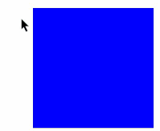

# Class (CursorController)

提供光标样式设置的能力。

> **说明：**
>
> - 本模块首批接口从API version 12开始支持。后续版本如有新增内容，则采用上角标单独标记该内容的起始版本。
>
> - 以下API需先使用UIContext中的[getCursorController()](arkts-apis-uicontext-uicontext.md#getcursorcontroller12)方法获取CursorController实例，再通过此实例调用对应方法。

## restoreDefault

restoreDefault(): void

恢复默认的光标样式。

**原子化服务API：** 从API version 12开始，该接口支持在原子化服务中使用。

**系统能力：** SystemCapability.ArkUI.ArkUI.Full

**示例：**

当光标移出绿框时，通过CursorController的restoreDefault方法恢复默认光标样式。

```ts
import { pointer } from '@kit.InputKit';
import { UIContext, CursorController } from '@kit.ArkUI';

@Entry
@Component
struct CursorControlExample {
  @State text: string = '';
  cursorCustom: CursorController = this.getUIContext().getCursorController();

  build() {
    Column() {
      Row().height(200).width(200).backgroundColor(Color.Green).position({x: 150 ,y:70})
        .onHover((flag) => {
          if (flag) {
            this.cursorCustom.setCursor(pointer.PointerStyle.EAST);
          } else {
            console.info("restoreDefault");
            this.cursorCustom.restoreDefault();
          }
        })
    }.width('100%')
  }
}
```


## setCursor

setCursor(value: PointerStyle): void

更改当前的鼠标光标样式。

**原子化服务API：** 从API version 12开始，该接口支持在原子化服务中使用。

**系统能力：** SystemCapability.ArkUI.ArkUI.Full

**参数：**

| 参数名     | 类型                                       | 必填   | 说明      |
| ------- | ---------------------------------------- | ---- | ------- |
| value | [PointerStyle](arkts-apis-uicontext-t.md#pointerstyle) | 是    | 光标样式。 |

**示例：**

当光标进入蓝框时，通过CursorController的setCursor方法修改光标样式为PointerStyle.WEST。

```ts
import { pointer } from '@kit.InputKit';
import { UIContext, CursorController } from '@kit.ArkUI';

@Entry
@Component
struct CursorControlExample {
  @State text: string = '';
  cursorCustom: CursorController = this.getUIContext().getCursorController();

  build() {
    Column() {
      Row().height(200).width(200).backgroundColor(Color.Blue).position({x: 100 ,y:70})
        .onHover((flag) => {
          if (flag) {
            this.cursorCustom.setCursor(pointer.PointerStyle.WEST);
          } else {
            this.cursorCustom.restoreDefault();
          }
        })
    }.width('100%')
  }
}
```

