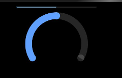

# progress

进度条，用于显示内容加载或操作处理进度。

> **说明：**
>
> 该组件从从API version 4 开始支持。后续版本如有新增内容，则采用上角标单独标记该内容的起始版本。


## 子组件

不支持。


## 属性

| 名称 | 类型 | 默认值 | 必填 | 描述 |
| -------- | -------- | -------- | -------- | -------- |
| type | string | horizontal | 否 | 设置进度条的类型，该属性不支持动态修改，可选值为：<br/>-&nbsp;horizontal：线性进度条；<br/>-&nbsp;arc：弧形进度条。 |
| id | string | - | 否 | 组件的唯一标识。 |
| style | string | - | 否 | 组件的样式声明。 |
| class | string | - | 否 | 组件的样式类，用于引用样式表。 |
| ref | string | - | 否 | 用来指定指向子元素的引用信息，该引用将注册到父组件的$refs&nbsp;属性对象上。 |

不同类型的进度条还支持不同的属性：

- 类型为horizontal时，支持如下属性：
    | 名称 | 类型 | 默认值 | 必填 | 描述 |
  | -------- | -------- | -------- | -------- | -------- |
  | percent | number | 0 | 否 | 当前进度。取值范围为0-100。 |

- 类型为arc时，支持如下属性：
    | 名称 | 类型 | 默认值 | 必填 | 描述 |
  | -------- | -------- | -------- | -------- | -------- |
  | percent | number | 0 | 否 | 当前进度。取值范围为0-100。 |


## 事件

| 名称 | 参数 | 描述 |
| -------- | -------- | -------- |
| click | - | 点击动作触发该事件。 |
| longpress | - | 长按动作触发该事件。 |
| swipe<sup>5+</sup> | [SwipeEvent](js-common-events.md) | 组件上快速滑动后触发。 |


## 样式

- type为horizontal，支持如下样式：

  | 名称         | 类型           | 默认值                                         | 必填 | 描述               |
  | ------------ | -------------- | ---------------------------------------------- | ---- | ------------------ |
  | color        | &lt;color&gt;  | \#6b9ac7                                       | 否   | 设置进度条的颜色。 |
  | stroke-width | &lt;length&gt; | 32<sup>1-4&nbsp;</sup>\|&nbsp;4<sup>5+</sup>px | 否   | 设置进度条的宽度。 |

- type为arc，支持如下样式：

  | 名称             | 类型           | 默认值 | 必填 | 描述                                                         |
  | ---------------- | -------------- | ------ | ---- | ------------------------------------------------------------ |
  | color            | &lt;color&gt;  | -      | 否   | 弧形进度条的颜色。                                           |
  | background-color | &lt;color&gt;  | -      | 否   | 弧形进度条的背景色。                                         |
  | stroke-width     | &lt;length&gt; | -      | 否   | 弧形进度条的宽度。<br/>进度条宽度越大，进度条越靠近圆心。即进度条始终在半径区域内。 |
  | start-angle      | &lt;deg&gt;    | 240    | 否   | 弧形进度条起始角度，以时钟0点为基线。范围为0到360（顺时针）。 |
  | total-angle      | &lt;deg&gt;    | 240    | 否   | 弧形进度条总长度，范围为-360到360，负数标识起点到终点为逆时针。 |
  | center-x         | &lt;length&gt; | -      | 否   | 弧形进度条中心位置，（坐标原点为组件左上角顶点）。该样式需要和center-y和radius一起。 |
  | center-y         | &lt;length&gt; | -      | 否   | 弧形进度条中心位置，（坐标原点为组件左上角顶点）。该样式需要和center-x和radius一起。 |
  | radius           | &lt;length&gt; | -      | 否   | 弧形进度条半径，该样式需要和center-x和center-y一起。         |

除上述样式之外，还支持如下样式：

| 名称 | 类型 | 默认值 | 必填 | 描述 |
| -------- | -------- | -------- | -------- | -------- |
| width | &lt;length&gt;&nbsp;\|&nbsp;&lt;percentage&gt;<sup>5+</sup> | - | 否 | 设置组件自身的宽度。<br/>未设置时组件宽度默认为0。 |
| height | &lt;length&gt;&nbsp;\|&nbsp;&lt;percentage&gt;<sup>5+</sup> | - | 否 | 设置组件自身的高度。<br/>未设置时组件高度默认为0。 |
| padding | &lt;length&gt; | 0 | 否 | 使用简写属性设置所有的内边距属性。<br/>&nbsp;&nbsp;该属性可以有1到4个值：<br/>-&nbsp;指定一个值时，该值指定四个边的内边距。<br/>-&nbsp;指定两个值时，第一个值指定上下两边的内边距，第二个指定左右两边的内边距。<br/>-&nbsp;指定三个值时，第一个指定上边的内边距，第二个指定左右两边的内边距，第三个指定下边的内边距。<br/>-&nbsp;指定四个值时分别为上、右、下、左边的内边距（顺时针顺序）。 |
| padding-[left\|top\|right\|bottom] | &lt;length&gt; | 0 | 否 | 设置左、上、右、下内边距属性。 |
| margin | &lt;length&gt;&nbsp;\|&nbsp;&lt;percentage&gt;<sup>5+</sup> | 0 | 否 | 使用简写属性设置所有的外边距属性，该属性可以有1到4个值。<br>-&nbsp;只有一个值时，这个值会被指定给全部的四个边。<br/>-&nbsp;两个值时，第一个值被匹配给上和下，第二个值被匹配给左和右。<br/>-&nbsp;三个值时，第一个值被匹配给上,&nbsp;第二个值被匹配给左和右，第三个值被匹配给下。<br/>-&nbsp;四个值时，会依次按上、右、下、左的顺序匹配&nbsp;(即顺时针顺序)。 |
| margin-[left\|top\|right\|bottom] | &lt;length&gt;&nbsp;\|&nbsp;&lt;percentage&gt;<sup>5+</sup> | 0 | 否 | 设置左、上、右、下外边距属性。 |
| border-width | &lt;length&gt; | 0 | 否 | 使用简写属性设置元素的所有边框宽度。 |
| border-color | &lt;color&gt; | black | 否 | 使用简写属性设置元素的所有边框颜色。 |
| border-radius | &lt;length&gt; | - | 否 | border-radius属性是设置元素的外边框圆角半径。 |
| display | string | flex | 否 | 确定一个元素所产生的框的类型，可选值为：<br/>-&nbsp;flex：弹性布局。<br/>-&nbsp;none：不渲染此元素。 |
| [left\|top] | &lt;length&gt;&nbsp;\|&nbsp;&lt;percentage&gt;<sup>6+</sup> | - | 否 | left\|top确定元素的偏移位置。<br/>-&nbsp;left属性规定元素的左边缘。该属性定义了定位元素左外边距边界与其包含块左边界之间的偏移。<br/>-&nbsp;top属性规定元素的顶部边缘。该属性定义了一个定位元素的上外边距边界与其包含块上边界之间的偏移。 |

## 示例

```html
<!-- xxx.hml -->
<div class="container">
  <progress type="horizontal" percent="{{horizontalVal}}" style="height: 10%;width: 40%;" onclick = "changeHorizontal"></progress>
  <progress type="arc" class="min-progress" percent="{{arcVal}}" on:click="changeArc"></progress>
</div>
```

```css
/* xxx.css */
.container {
  flex-direction: column;
  height: 100%;
  width: 100%;
  align-items: center;
}
.min-progress {
  width: 300px;
  height: 300px;
}
```

```javascript
// xxx.js
export default {
  data: {
    arcVal: 0,
    horizontalVal: 0
  },
  changeArc() {
    this.arcVal+= 10;
  },
  changeHorizontal() {
    this.horizontalVal+= 10;
  }
}
```

