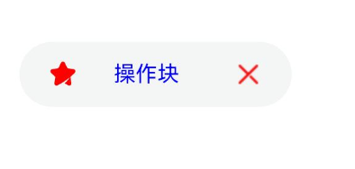
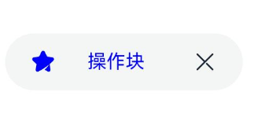
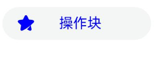
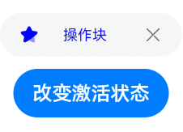
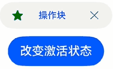

# Chip

操作块，用于搜索框历史记录或者邮件发送列表等场景。

> **说明：**
>
> 该组件从API Version 11开始支持。后续版本如有新增内容，则采用上角标单独标记该内容的起始版本。

## 导入模块

```ts
import { Chip, ChipOptions, ChipSize } from '@kit.ArkUI';
```

## 子组件

无

## Chip

Chip({options:ChipOptions}): void

**装饰器类型：**@Builder

**原子化服务API：** 从API version 12开始，该接口支持在原子化服务中使用。

**系统能力：** SystemCapability.ArkUI.ArkUI.Full

**参数**：

| 名称    | 类型                        | 必填 | 装饰器类型 | 说明                 |
| ------- | --------------------------- | ---- | ---------- | -------------------- |
| options | [ChipOptions](#chipoptions) | 是   | @Builder   | 定义chip组件的参数。 |

## ChipOptions

ChipOptions定义chip的样式及具体式样参数。

**系统能力：** SystemCapability.ArkUI.ArkUI.Full

| 名称            | 类型                                                         | 必填 | 说明                                                         |
| --------------- | ------------------------------------------------------------ | ---- | ------------------------------------------------------------ |
| size            | [ChipSize](#chipsize) \| [SizeOptions](ts-types.md#sizeoptions) | 否   | 操作块尺寸。<br/>默认值：ChipSize：ChipSize.NORMAL，<br/>   SizeOptions类型参数不支持百分比设置。<br>**原子化服务API：** 从API version 12开始，该接口支持在原子化服务中使用。 |
| enabled         | boolean                                                      | 否   | 操作块是否可选中。<br>默认值：true。<br>**原子化服务API：** 从API version 12开始，该接口支持在原子化服务中使用。 |
| activated      | boolean                                        | 否   | 操作块是否为激活态。<br>默认值：false。<br>**原子化服务API：** 从API version 12开始，该接口支持在原子化服务中使用。                      |
| prefixIcon      | [PrefixIconOptions](#prefixiconoptions)                      | 否   | 前缀图标属性。<br>**原子化服务API：** 从API version 12开始，该接口支持在原子化服务中使用。 |
| prefixSymbol   | [ChipSymbolGlyphOptions](#chipsymbolglyphoptions12)              | 否   | 前缀图标属性，symbol类型。<br>**原子化服务API：** 从API version 12开始，该接口支持在原子化服务中使用。 |
| label           | [LabelOptions](#labeloptions)                                | 是   | 文本属性。<br>**原子化服务API：** 从API version 12开始，该接口支持在原子化服务中使用。   |
| suffixIcon      | [SuffixIconOptions](#suffixiconoptions)                      | 否   | 后缀图标属性。<br>**原子化服务API：** 从API version 12开始，该接口支持在原子化服务中使用。 |
| suffixSymbol    | [ChipSymbolGlyphOptions](#chipsymbolglyphoptions12)              | 否   | 后缀图标属性，symbol类型。<br>**原子化服务API：** 从API version 12开始，该接口支持在原子化服务中使用。 |
| suffixSymbolOptions<sup>14+</sup> | [ChipSuffixSymbolGlyphOptions](#chipsuffixsymbolglyphoptions14) | 否 | symbol类型后缀图标属性的无障碍朗读功能属性。<br>**原子化服务API：** 从API version 14开始，该接口支持在原子化服务中使用。|
| backgroundColor | [ResourceColor](ts-types.md#resourcecolor)                   | 否   | 操作块背景颜色。<br/>默认值：$r('sys.color.ohos_id_color_button_normal')。<br>**原子化服务API：** 从API version 12开始，该接口支持在原子化服务中使用。 |
| activatedBackgroundColor | [ResourceColor](ts-types.md#resourcecolor)          | 否   | 操作块激活时的背景颜色。<br/>默认值：$r('sys.color.ohos_id_color_emphasize')。<br>**原子化服务API：** 从API version 12开始，该接口支持在原子化服务中使用。 |
| borderRadius    | [Dimension](ts-types.md#dimension10)                         | 否   | 操作块背景圆角半径大小，不支持百分比。<br/>默认值：$r('sys.float.ohos_id_corner_radius_button')。<br>**原子化服务API：** 从API version 12开始，该接口支持在原子化服务中使用。 |
| allowClose      | boolean                                                      | 否   | 删除图标是否显示。<br/>默认值：true。<br>**原子化服务API：** 从API version 12开始，该接口支持在原子化服务中使用。 |
| onClose         | ()=>void                                                     | 否   | 默认删除图标点击事件。<br>**原子化服务API：** 从API version 12开始，该接口支持在原子化服务中使用。 |
| onClicked      | Callback\<void> | 否   | 操作块点击事件。<br>**原子化服务API：** 从API version 12开始，该接口支持在原子化服务中使用。                                       |
| direction | [Direction](ts-appendix-enums.md#direction) | 否 | 布局方向。<br/>默认值：Direction.Auto。<br>**原子化服务API：** 从API version 12开始，该接口支持在原子化服务中使用。 |
| closeOptions<sup>14+</sup> | [CloseOptions](#closeoptions14) | 否 | 默认删除图标的无障碍朗读功能属性。<br>**原子化服务API：** 从API version 14开始，该接口支持在原子化服务中使用。 |
| accessibilityDescription<sup>14+</sup> | [ResourceStr](ts-types.md#resourcestr) | 否 | Chip组件无障碍描述。<br>**原子化服务API：** 从API version 14开始，该接口支持在原子化服务中使用。|
| accessibilityLevel<sup>14+</sup> | string | 否 | Chip组件无障碍重要性。<br>默认值："auto"。<br>**原子化服务API：** 从API version 14开始，该接口支持在原子化服务中使用。 |
| accessibilitySelectedType<sup>14+</sup> | [AccessibilitySelectedType](#accessibilityselectedtype14) | 否 | Chip组件选中态类型。<br>**原子化服务API：** 从API version 14开始，该接口支持在原子化服务中使用。|

> **说明：**
>
> 1.suffixSymbol有传入参数时，suffixIcon和allowClose不生效；suffixSymbol没有传入参数、suffixIcon有传入参数时，allowClose不生效；suffixSymbol和suffixIcon都没有传入参数时，allowClose决定是否显示删除图标。
>
> 2.backgroundColor和activatedBackgroundColor赋值undefined时，显示默认背景颜色，赋值非法值时，背景色透明。
>
> 3.prefixSymbol/suffixSymbol的fontColor默认值，normalFontColor: `[$r('sys.color.ohos_id_color_primary')]`、activatedFontColor: `[$r('sys.color.ohos_id_color_text_primary_contrary')]`。fontColor默认值为16。
>
> 4.prefixIcon的fillColor默认值：`$r('sys.color.ohos_id_color_secondary')`，suffixIcon的fillColor默认值：`$r('sys.color.ohos_id_color_primary')`。fillColor对颜色的解析与Image组件保持一致。
>
> 5.prefixIcon的activatedFillColor默认值：`$r('sys.color.ohos_id_color_text_primary_contrary')`，suffixIcon的activatedFillColor默认值：`$r('sys.color.ohos_id_color_text_primary_contrary')`。activatedFillColor对颜色的解析与Image组件保持一致。

## ChipSize

ChipSize是chip可指定的尺寸类型，如普通型Chip。

**原子化服务API：** 从API version 12开始，该接口支持在原子化服务中使用。

**系统能力：** SystemCapability.ArkUI.ArkUI.Full

| 名称   | 值       | 说明               |
| ------ | -------- | ------------------ |
| NORMAL | "NORMAL" | normal尺寸操作块。 |
| SMALL  | "SMALL"  | small尺寸操作块。  |

## AccessibilitySelectedType<sup>14+</sup>

AccessibilitySelectedType是Chip可指定的选中态类型，如默认类型为AccessibilitySelectedType.CLICKED。

**原子化服务API：** 从API version 14开始，该接口支持在原子化服务中使用。

**系统能力：** SystemCapability.ArkUI.ArkUI.Full

| 名称 | 值 | 描述 |
| ---- | -- | ---- |
| CLICKED | 0 | Chip组件选中态默认类型。|
| CHECKED | 1 | Chip组件选中态复选类型。|
| SELECTED | 2 | Chip组件选中态单选类型。|

## IconCommonOptions

IconCommonOptions定义图标的共通属性。

**原子化服务API：** 从API version 12开始，该接口支持在原子化服务中使用。

**系统能力：** SystemCapability.ArkUI.ArkUI.Full

| 名称      | 类型                                       | 必填 | 说明                                                         |
| --------- | ------------------------------------------ | ---- | ------------------------------------------------------------ |
| src       | [ResourceStr](ts-types.md#resourcestr)     | 是   | 图标图片或图片地址引用。 |
| size      | [SizeOptions](ts-types.md#sizeoptions)     | 否   | 图标大小，不支持百分比。<br/>默认值：{width: 16,height: 16} |
| fillColor | [ResourceColor](ts-types.md#resourcecolor) | 否   | 图标填充颜色。 |
| activatedFillColor<sup>12+</sup> | [ResourceColor](ts-types.md#resourcecolor) | 否   | 操作块激活时图标填充颜色。                            |

> **说明：**
>
> 仅在图片格式为svg时，fillColor和activatedFillColor生效。
>

## PrefixIconOptions

PrefixIconOptions定义前缀图标的属性。

继承于[IconCommonOptions](#iconcommonoptions)。

**原子化服务API：** 从API version 12开始，该接口支持在原子化服务中使用。

**系统能力：** SystemCapability.ArkUI.ArkUI.Full

## SuffixIconOptions

SuffixIconOptions定义后缀图标的属性。

继承于[IconCommonOptions](#iconcommonoptions)。

**系统能力：** SystemCapability.ArkUI.ArkUI.Full

| 名称   | 类型       | 必填 | 说明               |
| ------ | ---------- | ---- | ------------------ |
| action | () => void | 否   | 后缀图标设定事件。<br>**原子化服务API：** 从API version 12开始，该接口支持在原子化服务中使用。 |
| accessibilityText<sup>14+</sup> | [ResourceStr](ts-types.md#resourcestr) | 否 | 后缀图标无障碍文本属性。<br>**原子化服务API：** 从API version 14开始，该接口支持在原子化服务中使用。|
| accessibilityDescription<sup>14+</sup> | [ResourceStr](ts-types.md#resourcestr) | 否 | 后缀图标无障碍描述。<br>**原子化服务API：** 从API version 14开始，该接口支持在原子化服务中使用。|
| accessibilityLevel<sup>14+</sup> | string | 否 | 后缀图标无障碍重要性。<br>默认值："auto"。<br>**原子化服务API：** 从API version 14开始，该接口支持在原子化服务中使用。|

## AccessibilityOptions<sup>14+</sup>

后缀图标的无障碍朗读功能属性。

**原子化服务API：** 从API version 14开始，该接口支持在原子化服务中使用。

**系统能力：** SystemCapability.ArkUI.ArkUI.Full

| 名称 | 类型 | 必填 | 说明 |
| ------ | ---------- | ---- | ------------------ |
| accessibilityText | [ResourceStr](ts-types.md#resourcestr) | 否 | 无障碍文本属性。|
| accessibilityDescription | [ResourceStr](ts-types.md#resourcestr) | 否 | 无障碍描述。|
| accessibilityLevel | string | 否 | 无障碍重要性。<br>默认值："auto"。|

## ChipSuffixSymbolGlyphOptions<sup>14+</sup>

symbol类型后缀图标属性的无障碍朗读功能属性类型。

**原子化服务API：** 从API version 14开始，该接口支持在原子化服务中使用。

**系统能力：** SystemCapability.ArkUI.ArkUI.Full

| 名称 | 类型 | 必填 | 说明 |
| ---- | ---- | --- | ---- |
| action | [VoidCallback](ts-types.md#voidcallback12) | 否 | 后缀图标响应事件。|
| normalAccessibility | [AccessibilityOptions](#accessibilityoptions14) | 否 | 非激活态无障碍朗读功能属性。|
| activatedAccessibility | [AccessibilityOptions](#accessibilityoptions14) | 否 | 激活态无障碍朗读功能属性。|

## ChipSymbolGlyphOptions<sup>12+</sup>

ChipSymbolGlyphOptions定义前缀图标和后缀图标的属性。

**原子化服务API：** 从API version 12开始，该接口支持在原子化服务中使用。

**系统能力：** SystemCapability.ArkUI.ArkUI.Full

| 名称   | 类型       | 必填 | 说明               |
| ------ | ---------- | ---- | ------------------ |
| normal | [SymbolGlyphModifier](ts-universal-attributes-attribute-modifier.md) | 否   | 图标设定事件。 |
| activated | [SymbolGlyphModifier](ts-universal-attributes-attribute-modifier.md) | 否   | 激活时图标设定事件。 |

> **说明：**
>
> 不支持通过symbolEffect修改动效类型和effectStrategy设置动效。
>

## LabelOptions

LabelOptions定义文本的属性。

**原子化服务API：** 从API version 12开始，该接口支持在原子化服务中使用。

**系统能力：** SystemCapability.ArkUI.ArkUI.Full

| 名称        | 类型                                       | 必填 | 说明                                                         |
| ----------- | ------------------------------------------ | ---- | ------------------------------------------------------------ |
| text        | string                                     | 是   | 文本文字内容。 |
| fontSize    | [Dimension](ts-types.md#dimension10)       | 否   | 文字字号，不支持百分比。<br/>默认值：$r('sys.float.ohos_id_text_size_button2') |
| fontColor   | [ResourceColor](ts-types.md#resourcecolor) | 否   | 文字颜色。<br/>默认值：$r('sys.color.ohos_id_color_text_primary') |
| activatedFontColor<sup>12+</sup>   | [ResourceColor](ts-types.md#resourcecolor) | 否   | 操作块激活时的文字颜色。<br/>默认值：$r('sys.color.ohos_id_color_text_primary_contrary') |
| fontFamily  | string                                     | 否   | 文字字体。<br/>默认值："HarmonyOS Sans" |
| labelMargin | [LabelMarginOptions](#labelmarginoptions)  | 否   | 文本与左右侧图标之间间距。 |
| localizedLabelMargin<sup>12+</sup> | [LocalizedLabelMarginOptions](#localizedlabelmarginoptions12) | 否 | 本地化文本与左右侧图标之间间距。<br/>默认值：{<br/>start:  LengthMetrics.vp(6), end: LengthMetrics.vp(6)<br/>} |

## CloseOptions<sup>14+</sup>

默认关闭图标的无障碍朗读功能属性，accessibilityText默认为"删除"。

继承于[AccessibilityOptions](#accessibilityoptions14)。

**原子化服务API：** 从API version 14开始，该接口支持在原子化服务中使用。

**系统能力：** SystemCapability.ArkUI.ArkUI.Full

## LabelMarginOptions

LabelMarginOptions定义文本与左右侧图标之间间距。

**原子化服务API：** 从API version 12开始，该接口支持在原子化服务中使用。

**系统能力：** SystemCapability.ArkUI.ArkUI.Full

| 名称  | 类型                                 | 必填 | 说明                                   |
| ----- | ------------------------------------ | ---- | -------------------------------------- |
| left  | [Dimension](ts-types.md#dimension10) | 否   | 文本与左侧图标之间间距，不支持百分比。 |
| right | [Dimension](ts-types.md#dimension10) | 否   | 文本与右侧图标之间间距，不支持百分比。 |

## LocalizedLabelMarginOptions<sup>12+</sup>

LocalizedLabelMarginOptions定义本地化文本与左右侧图标之间间距。

**原子化服务API：** 从API version 12开始，该接口支持在原子化服务中使用。

**系统能力：** SystemCapability.ArkUI.ArkUI.Full

| 名称  | 类型                                                         | 必填 | 说明                                   |
| ----- | ------------------------------------------------------------ | ---- | -------------------------------------- |
| start | [LengthMetrics](../js-apis-arkui-graphics.md#lengthmetrics12) | 否   | 文本与左侧图标之间间距，不支持百分比。 |
| end   | [LengthMetrics](../js-apis-arkui-graphics.md#lengthmetrics12) | 否   | 文本与右侧图标之间间距，不支持百分比。 |

## 示例

### 示例1（自定义后缀图标）

该示例通过配置suffixIcon实现自定义操作块的后缀图标。

```ts
import { Chip, ChipSize } from '@kit.ArkUI';

@Entry
@Component
struct Index {
  build() {
    Column({ space: 10 }) {
      Chip({
        prefixIcon: {
          src: $r('app.media.chips'),
          size: { width: 16, height: 16 },
          fillColor: Color.Red
        },
        label: {
          text: "操作块",
          fontSize: 12,
          fontColor: Color.Blue,
          fontFamily: "HarmonyOS Sans",
          labelMargin: { left: 20, right: 30 }
        },
        suffixIcon: {
          src: $r('app.media.close'),
          size: { width: 16, height: 16 },
          fillColor: Color.Red
        },
        size: ChipSize.NORMAL,
        allowClose: false,
        enabled: true,
        backgroundColor: $r('sys.color.ohos_id_color_button_normal'),
        borderRadius: $r('sys.float.ohos_id_corner_radius_button')
      })
    }
  }
}
```




### 示例2（设置默认后缀图标）

该示例通过配置allowClose为true显示后缀删除图标。

```ts
import { Chip, ChipSize } from '@kit.ArkUI';

@Entry
@Component
struct Index {
  build() {
    Column({ space: 10 }) {
      Chip({
        prefixIcon: {
          src: $r('app.media.chips'),
          size: { width: 16, height: 16 },
          fillColor: Color.Blue
        },
        label: {
          text: "操作块",
          fontSize: 12,
          fontColor: Color.Blue,
          fontFamily: "HarmonyOS Sans",
          labelMargin: { left: 20, right: 30 }
        },
        size: ChipSize.NORMAL,
        allowClose: true,
        enabled: true,
        backgroundColor: $r('sys.color.ohos_id_color_button_normal'),
        borderRadius: $r('sys.float.ohos_id_corner_radius_button')
      })
    }
  }
}
```




### 示例3（不显示后缀图标）

该示例通过配置allowClose为false不显示后缀删除图标。

```ts
import { Chip, ChipSize } from '@kit.ArkUI';

@Entry
@Component
struct Index {
  build() {
    Column({ space: 10 }) {
      Chip({
        prefixIcon: {
          src: $r('app.media.chips'),
          size: { width: 16, height: 16 },
          fillColor: Color.Blue
        },
        label: {
          text: "操作块",
          fontSize: 12,
          fontColor: Color.Blue,
          fontFamily: "HarmonyOS Sans",
          labelMargin: { left: 20, right: 30 }
        },
        size: ChipSize.SMALL,
        allowClose: false,
        enabled: true,
        backgroundColor: $r('sys.color.ohos_id_color_button_normal'),
        borderRadius: $r('sys.float.ohos_id_corner_radius_button'),
        onClose:()=>{
          console.log("chip on close")
      }
      })
    }
  }
}
```




### 示例4（激活态操作块）

该示例通过配置activated实现激活态操作块。

```ts
import { Chip, ChipSize } from '@kit.ArkUI';

@Entry
@Component
struct Index {
  @State isActivated: boolean = false

  build() {
    Column({ space: 10 }) {
      Chip({
        prefixIcon: {
          src: $r('app.media.chips'),
          size: { width: 16, height: 16 },
          fillColor: Color.Blue,
          activatedFillColor: $r('sys.color.ohos_id_color_text_primary_contrary')
        },
        label: {
          text: "操作块",
          fontSize: 12,
          fontColor: Color.Blue,
          activatedFontColor: $r('sys.color.ohos_id_color_text_primary_contrary'),
          fontFamily: "HarmonyOS Sans",
          labelMargin: { left: 20, right: 30 }
        },
        size: ChipSize.NORMAL,
        allowClose: true,
        enabled: true,
        activated: this.isActivated,
        backgroundColor: $r('sys.color.ohos_id_color_button_normal'),
        activatedBackgroundColor: $r('sys.color.ohos_id_color_emphasize'),
        borderRadius: $r('sys.float.ohos_id_corner_radius_button'),
        onClose:()=>{
          console.log("chip on close")
        },
        onClicked:()=>{
          console.log("chip on clicked")
        }
      })

      Button('改变激活状态').onClick(()=>{
        this.isActivated = !this.isActivated
      })
    }
  }
}
```




### 示例5（设置symbol类型图标）

Chip组件的前缀、后缀图标使用symbol类型资源展示。

```ts
import { Chip, ChipSize, SymbolGlyphModifier } from '@kit.ArkUI';

@Entry
@Component
struct Index {
  @State isActivated: boolean = false

  build() {
    Column({ space: 10 }) {
      Chip({
        prefixIcon: {
          src: $r('app.media.chips'),
          size: { width: 16, height: 16 },
          fillColor: Color.Blue,
          activatedFillColor: $r('sys.color.ohos_id_color_text_primary_contrary')
        },
		prefixSymbol: {
          normal: new SymbolGlyphModifier($r('sys.symbol.ohos_star')).fontSize(16).fontColor([Color.Green]),
          activated: new SymbolGlyphModifier($r('sys.symbol.ohos_star')).fontSize(16).fontColor([Color.Red]),
		},
        label: {
          text: "操作块",
          fontSize: 12,
          fontColor: Color.Blue,
          activatedFontColor: $r('sys.color.ohos_id_color_text_primary_contrary'),
          fontFamily: "HarmonyOS Sans",
          labelMargin: { left: 20, right: 30 },
        },
        size: ChipSize.NORMAL,
        allowClose: true,
        enabled: true,
        activated: this.isActivated,
        backgroundColor: $r('sys.color.ohos_id_color_button_normal'),
        activatedBackgroundColor: $r('sys.color.ohos_id_color_emphasize'),
        borderRadius: $r('sys.float.ohos_id_corner_radius_button'),
        onClose:()=>{
          console.log("chip on close")
        },
        onClicked:()=>{
          console.log("chip on clicked")
        }
      })

      Button('改变激活状态').onClick(()=>{
        this.isActivated = !this.isActivated
      })
    }
  }
}
```



### 示例6（设置镜像效果）

该示例通过配置direction实现Chip布局镜像化展示。

```ts

import { Chip, ChipSize,LengthMetrics } from '@kit.ArkUI';

@Entry
@Component
struct ChipPage {

  build() {
    Column() {
      Chip({
        direction: Direction.Rtl,
        prefixIcon: {
          src: $r('app.media.chips'),
          size: { width: 16, height: 16 },
          fillColor: Color.Red,
        },
        label: {
          text: "操作块",
          fontSize: 12,
          fontColor: Color.Blue,
          fontFamily: "HarmonyOS Sans",
          localizedLabelMargin: { start: LengthMetrics.vp(20), end: LengthMetrics.vp(20) },
        },
        suffixIcon: {
          src: $r('app.media.close'),
          size: { width: 16, height: 16 },
          fillColor: Color.Red,
        },
        size: ChipSize.NORMAL,
        allowClose: false,
        enabled: true,
        backgroundColor: $r('sys.color.ohos_id_color_button_normal'),
        borderRadius: $r('sys.float.ohos_id_corner_radius_button')
      })
    }.justifyContent(FlexAlign.Center)
    .width('100%')
    .height('100%')
  }
}
```


### 示例7（Image类型无障碍朗读）

该示例代码实现了Chip组件Image类型后缀图标的无障碍朗读功能。

```ts
// xxx.ets
import { Chip, SymbolGlyphModifier } from '@kit.ArkUI';

@Builder
function DefaultFunction(): void {
}

@Component
struct SectionGroup {
  @Prop
  @Require
  title: ResourceStr;
  @BuilderParam
  @Require
  content: () => void = DefaultFunction;

  build() {
    Column({ space: 4 }) {
      Text(this.title)
        .fontColor('#FF666666')
        .fontSize(12)
      Column({ space: 8 }) {
        this.content()
      }
    }
    .alignItems(HorizontalAlign.Start)
    .width('100%')
  }
}

@Component
struct SectionItem {
  @Prop
  @Require
  title: ResourceStr;
  @BuilderParam
  @Require
  content: () => void = DefaultFunction;

  build() {
    Column({ space: 12 }) {
      Text(this.title)
      this.content()
    }
    .backgroundColor('#FFFFFFFF')
    .borderRadius(12)
    .padding(12)
    .width('100%')
  }
}

@Entry
@Component
struct ChipExample2 {
  @State activated: boolean = false;

  build() {
    NavDestination() {
      Scroll() {
        SectionGroup({ title: '后缀图标播报' }) {
          SectionItem({ title: '自定义播报' }) {
            Chip({
              label: { text: '操作块' },
              suffixIcon: {
                src: $r('sys.media.ohos_ic_public_cut'),
                accessibilityText: '图标',
                accessibilityDescription: '新手提醒',
                action: () => {
                  this.getUIContext().getPromptAction().showToast({
                    message: '后缀图标被点击！'
                  });
                }
              },
              onClicked: () => {
                this.getUIContext().getPromptAction().showToast({
                  message: '操作块被点击！'
                });
              }
            })
          }
        }
      }
    }
  }
}
```

### 示例8（Symbol类型无障碍朗读）

该示例代码实现了Chip组件Symbol类型后缀图标的无障碍朗读功能。

```ts

import { Chip, SymbolGlyphModifier } from '@kit.ArkUI';

@Builder
function DefaultFunction(): void {
}

@Component
struct SectionGroup {
  @Prop
  @Require
  title: ResourceStr;
  @BuilderParam
  @Require
  content: () => void = DefaultFunction;

  build() {
    Column({ space: 4 }) {
      Text(this.title)
        .fontColor('#FF666666')
        .fontSize(12)
      Column({ space: 8 }) {
        this.content()
      }
    }
    .alignItems(HorizontalAlign.Start)
    .width('100%')
  }
}

@Component
struct SectionItem {
  @Prop
  @Require
  title: ResourceStr;
  @BuilderParam
  @Require
  content: () => void = DefaultFunction;

  build() {
    Column({ space: 12 }) {
      Text(this.title)
      this.content()
    }
    .backgroundColor('#FFFFFFFF')
    .borderRadius(12)
    .padding(12)
    .width('100%')
  }
}

@Entry
@Component
struct ChipExample2 {
  @State activated: boolean = false;

  build() {
    NavDestination() {
      Scroll() {
          SectionGroup({ title: '后缀Symbol播报' }) {
            SectionItem({ title: 'activatedAccessibility' }) {
              Chip({
                label: { text: '操作块' },
                activated: true,
                suffixSymbol: {
                  activated: new SymbolGlyphModifier($r('sys.symbol.media_sound'))
                    .fontSize(72),
                },
                suffixSymbolOptions: {
                  activatedAccessibility: {
                    accessibilityText: '音乐',
                    accessibilityDescription: '新手提醒'
                  },
                  action: () => {
                    this.getUIContext().getPromptAction().showToast({
                      message: '后缀Symbol被点击！'
                    });
                  }
                },
                onClicked: () => {
                  this.getUIContext().getPromptAction().showToast({
                    message: '操作块被点击！'
                  });
                }
              })
            }
            SectionItem({ title: 'normalAccessibility' }) {
              Chip({
                label: { text: '操作块' },
                suffixSymbol: {
                  normal: new SymbolGlyphModifier($r('sys.symbol.media_sound'))
                    .fontSize(72),
                },
                suffixSymbolOptions: {
                  normalAccessibility: {
                    accessibilityText: '音乐',
                    accessibilityDescription: '新手提醒'
                  },
                  action: () => {
                    this.getUIContext().getPromptAction().showToast({
                      message: '后缀Symbol被点击！'
                    });
                  }
                },
                onClicked: () => {
                  this.getUIContext().getPromptAction().showToast({
                    message: '操作块被点击！'
                  });
                }
              })
            }
          }
        }
      }
      .padding({
        top: 8,
        bottom: 8,
        left: 16,
        right: 16,
      })
    }
}
```