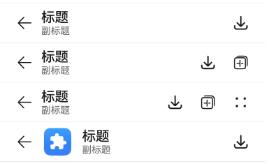
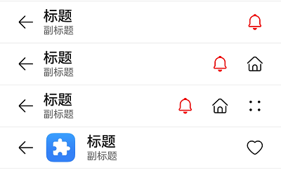

# ComposeTitleBar


一种普通标题栏，支持设置标题、头像（可选）和副标题（可选），可用于一级页面、二级及其以上界面配置返回键。


> **说明：**
>
> 该组件从API Version 10开始支持。后续版本如有新增内容，则采用上角标单独标记该内容的起始版本。


## 导入模块

```
import { ComposeTitleBar } from '@kit.ArkUI'
```


## 子组件

无

## 属性
不支持[通用属性](ts-universal-attributes-size.md)

## ComposeTitleBar

ComposeTitleBar({item?: ComposeTitleBarMenuItem, title: ResourceStr, subtitle?: ResourceStr, menuItems?: Array&lt;ComposeTitleBarMenuItem&gt;})

**装饰器类型：**\@Component

**原子化服务API：** 从API version 11开始，该接口支持在原子化服务中使用。

**系统能力：** SystemCapability.ArkUI.ArkUI.Full

| 名称 | 类型 | 必填 | 说明 |
| -------- | -------- | -------- | -------- |
| item | [ComposeTitleBarMenuItem](#composetitlebarmenuitem) | 否 | 用于左侧头像的单个菜单项目。 |
| title | [ResourceStr](ts-types.md#resourcestr) | 是 | 标题。 |
| subtitle | [ResourceStr](ts-types.md#resourcestr) | 否 | 副标题。 |
| menuItems | Array&lt;[ComposeTitleBarMenuItem](#composetitlebarmenuitem)&gt; | 否 | 右侧菜单项目列表。 |

> **说明：**
> 
> 入参对象不可为undefined，即`ComposeTitleBar(undefined)`。

## ComposeTitleBarMenuItem

**系统能力：** SystemCapability.ArkUI.ArkUI.Full

| 名称 | 类型 | 必填 | 说明 |
| -------- | -------- | -------- | -------- |
| value | [ResourceStr](ts-types.md#resourcestr) | 是 | 图标资源。<br/>**原子化服务API：** 从API version 11开始，该接口支持在原子化服务中使用。 |
| symbolStyle<sup>16+</sup> | [SymbolGlyphModifier](ts-universal-attributes-attribute-modifier.md) | 否 | Symbol图标资源，优先级大于value，item左侧头像不支持设置该属性。<br/>**原子化服务API：** 从API version 16开始，该接口支持在原子化服务中使用。 |
| label<sup>13+</sup> | [ResourceStr](ts-types.md#resourcestr) | 否 | 图标标签描述。<br/>**原子化服务API：** 从API version 13开始，该接口支持在原子化服务中使用。 |
| isEnabled | boolean | 否 | 是否启用，默认禁用。<br> isEnabled为true时，表示为启用。<br> isEnabled为false时，表示为禁用。<br>item属性不支持触发isEnabled属性。<br/>**原子化服务API：** 从API version 11开始，该接口支持在原子化服务中使用。 |
| action | ()&nbsp;=&gt;&nbsp;void | 否 | 触发时的动作闭包，item属性不支持触发action事件。<br/>**原子化服务API：** 从API version 11开始，该接口支持在原子化服务中使用。 |
| accessibilityLevel<sup>16+<sup>       | string  | 否 | 标题栏右侧自定义按钮无障碍重要性。用于控制当前项是否可被无障碍辅助服务所识别。<br/>支持的值为：<br/>"auto"：当前组件会转换'yes'。<br/>"yes"：当前组件可被无障碍辅助服务所识别。<br/>"no"：当前组件不可被无障碍辅助服务所识别。<br/>"no-hide-descendants"：当前组件及其所有子组件不可被无障碍辅助服务所识别。<br/>默认值："auto"。<br/>**原子化服务API：** 从API version 16开始，该接口支持在原子化服务中使用。 |
| accessibilityText<sup>16+<sup>        | ResourceStr | 否 | 标题栏右侧自定义按钮的无障碍文本属性。当组件不包含文本属性时，屏幕朗读选中此组件时不播报，使用者无法清楚地知道当前选中了什么组件。为了解决此场景，开发人员可为不包含文字信息的组件设置无障碍文本，当屏幕朗读选中此组件时播报无障碍文本的内容，帮助屏幕朗读的使用者清楚地知道自己选中了什么组件。<br/>默认值：有label默认值为当前项label属性内容，没有设置label时，默认值为“ ”。<br/>**原子化服务API：** 从API version 16开始，该接口支持在原子化服务中使用。                                     |
| accessibilityDescription<sup>16+<sup> | ResourceStr | 否 | 标题栏右侧自定义按钮的无障碍描述。此描述用于向用户详细解释当前组件，开发人员应为组件的这一属性提供较为详尽的文本说明，以协助用户理解即将执行的操作及其可能产生的后果。特别是当这些后果无法仅从组件的属性和无障碍文本中直接获知时。如果组件同时具备文本属性和无障碍说明属性，当组件被选中时，系统将首先播报组件的文本属性，随后播报无障碍说明属性的内容。<br/>默认值为“单指双击即可执行”。<br/>**原子化服务API：** 从API version 16开始，该接口支持在原子化服务中使用。           |

## 事件
不支持[通用事件](ts-universal-events-click.md)

## 示例

### 示例1（简单的标题栏）
该示例实现了简单的标题栏，带有返回箭头的标题栏和带有右侧菜单项目列表的标题栏。
```ts
import { ComposeTitleBar, promptAction, ComposeTitleBarMenuItem } from '@kit.ArkUI'

@Entry
@Component
struct Index {
  //定义右侧菜单项目列表
  private menuItems: Array<ComposeTitleBarMenuItem> = [
    {
      //菜单图片资源
      value: $r('sys.media.ohos_save_button_filled'),
      //启用图标
      isEnabled: true,
      //点击菜单时触发事件
      action: () => promptAction.showToast({ message: "show toast index 1" })
    },
    {
      value: $r('sys.media.ohos_ic_public_copy'),
      isEnabled: true,
      action: () => promptAction.showToast({ message: "show toast index 1" })
    },
    {
      value: $r('sys.media.ohos_ic_public_edit'),
      isEnabled: true,
      action: () => promptAction.showToast({ message: "show toast index 1" })
    },
    {
      value: $r('sys.media.ohos_ic_public_remove'),
      isEnabled: true,
      action: () => promptAction.showToast({ message: "show toast index 1" })
    },
  ]

  build() {
    Row() {
      Column() {
        //分割线
        Divider().height(2).color(0xCCCCCC)
        ComposeTitleBar({
          title: "标题",
          subtitle: "副标题",
          menuItems: this.menuItems.slice(0, 1),
        })
        Divider().height(2).color(0xCCCCCC)
        ComposeTitleBar({
          title: "标题",
          subtitle: "副标题",
          menuItems: this.menuItems.slice(0, 2),
        })
        Divider().height(2).color(0xCCCCCC)
        ComposeTitleBar({
          title: "标题",
          subtitle: "副标题",
          menuItems: this.menuItems,
        })
        Divider().height(2).color(0xCCCCCC)
        //定义带头像的标题栏
        ComposeTitleBar({
          menuItems: [{ isEnabled: true, value: $r('sys.media.ohos_save_button_filled'),
            action: () => promptAction.showToast({ message: "show toast index 1" })
          }],
          title: "标题",
          subtitle: "副标题",
          item: { isEnabled: true, value: $r('sys.media.ohos_app_icon') }
        })
        Divider().height(2).color(0xCCCCCC)
      }
    }.height('100%')
  }
}
```



### 示例2（右侧自定义按钮播报）
该示例通过设置标题栏右侧自定义按钮属性accessibilityText、accessibilityDescription、accessibilityLevel自定义屏幕朗读播报文本。
```ts
import { ComposeTitleBar, promptAction, ComposeTitleBarMenuItem } from '@kit.ArkUI'

@Entry
@Component
struct Index {
  //定义右侧菜单项目列表
  private menuItems: Array<ComposeTitleBarMenuItem> = [
    {
      //菜单图片资源
      value: $r('sys.media.ohos_save_button_filled'),
      //启用图标
      isEnabled: true,
      //点击菜单时触发事件
      action: () => promptAction.showToast({ message: "show toast index 1" }),
      //屏幕朗读播报文本，优先级比label高
      accessibilityText: '保存',
      //屏幕朗读是否可以聚焦到
      accessibilityLevel: 'yes',
      //屏幕朗读最后播报的描述文本
      accessibilityDescription: '点击操作保存图标'
    },
    {
      value: $r('sys.media.ohos_ic_public_copy'),
      isEnabled: true,
      action: () => promptAction.showToast({ message: "show toast index 1" }),
      accessibilityText: '复制',
      //此处为no，屏幕朗读不聚焦
      accessibilityLevel: 'no',
      accessibilityDescription: '点击操作复制图标'
    },
    {
      value: $r('sys.media.ohos_ic_public_edit'),
      isEnabled: true,
      action: () => promptAction.showToast({ message: "show toast index 1" }),
      accessibilityText: '编辑',
      accessibilityLevel: 'yes',
      accessibilityDescription: '点击操作编辑图标'
    },
    {
      value: $r('sys.media.ohos_ic_public_remove'),
      isEnabled: true,
      action: () => promptAction.showToast({ message: "show toast index 1" }),
      accessibilityText: '移除',
      accessibilityLevel: 'yes',
      accessibilityDescription: '点击操作移除图标'
    },
  ]

  build() {
    Row() {
      Column() {
        //分割线
        Divider().height(2).color(0xCCCCCC)
        ComposeTitleBar({
          title: "标题",
          subtitle: "副标题",
          menuItems: this.menuItems.slice(0, 1),
        })
        Divider().height(2).color(0xCCCCCC)
        ComposeTitleBar({
          title: "标题",
          subtitle: "副标题",
          menuItems: this.menuItems.slice(0, 2),
        })
        Divider().height(2).color(0xCCCCCC)
        ComposeTitleBar({
          title: "标题",
          subtitle: "副标题",
          menuItems: this.menuItems,
        })
        Divider().height(2).color(0xCCCCCC)
        //定义带头像的标题栏
        ComposeTitleBar({
          menuItems: [{ isEnabled: true, value: $r('sys.media.ohos_save_button_filled'),
            action: () => promptAction.showToast({ message: "show toast index 1" })
          }],
          title: "标题",
          subtitle: "副标题",
          item: { isEnabled: true, value: $r('sys.media.ohos_app_icon') }
        })
        Divider().height(2).color(0xCCCCCC)
      }
    }.height('100%')
  }
}
```


### 示例3（设置Symbol类型图标）

该示例通过设置ComposeTitleBarMenuItem的属性symbolStyle，展示了自定义Symbol类型图标。

```ts
import { ComposeTitleBar, promptAction, ComposeTitleBarMenuItem, SymbolGlyphModifier } from '@kit.ArkUI'

@Entry
@Component
struct Index {
  //定义右侧菜单项目列表
  private menuItems: Array<ComposeTitleBarMenuItem> = [
    {
      //菜单图片资源
      value: $r('sys.symbol.house'),
      //菜单symbol图标
      symbolStyle: new SymbolGlyphModifier($r('sys.symbol.bell')).fontColor([Color.Red]),
      //启用图标
      isEnabled: true,
      //点击菜单时触发事件
      action: () => promptAction.showToast({ message: "show toast index 1" })
    },
    {
      value: $r('sys.symbol.house'),
      isEnabled: true,
      action: () => promptAction.showToast({ message: "show toast index 1" })
    },
    {
      value: $r('sys.symbol.car'),
      symbolStyle: new SymbolGlyphModifier($r('sys.symbol.heart')).fontColor([Color.Pink]),
      isEnabled: true,
      action: () => promptAction.showToast({ message: "show toast index 1" })
    },
    {
      value: $r('sys.symbol.car'),
      isEnabled: true,
      action: () => promptAction.showToast({ message: "show toast index 1" })
    },
  ]

  build() {
    Row() {
      Column() {
        //分割线
        Divider().height(2).color(0xCCCCCC)
        ComposeTitleBar({
          title: "标题",
          subtitle: "副标题",
          menuItems: this.menuItems.slice(0, 1),
        })
        Divider().height(2).color(0xCCCCCC)
        ComposeTitleBar({
          title: "标题",
          subtitle: "副标题",
          menuItems: this.menuItems.slice(0, 2),
        })
        Divider().height(2).color(0xCCCCCC)
        ComposeTitleBar({
          title: "标题",
          subtitle: "副标题",
          menuItems: this.menuItems,
        })
        Divider().height(2).color(0xCCCCCC)
        //定义带头像的标题栏
        ComposeTitleBar({
          menuItems: [{ isEnabled: true, value: $r('sys.symbol.heart'),
            action: () => promptAction.showToast({ message: "show toast index 1" })
          }],
          title: "标题",
          subtitle: "副标题",
          item: { isEnabled: true, value: $r('sys.media.ohos_app_icon') }
        })
        Divider().height(2).color(0xCCCCCC)
      }
    }.height('100%')
  }
}
```

