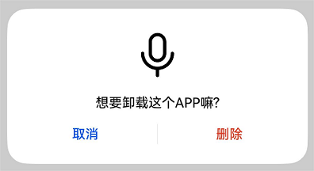
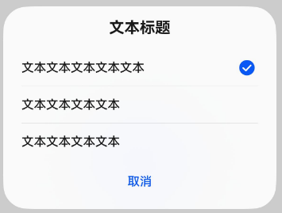
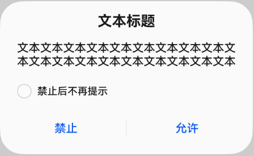
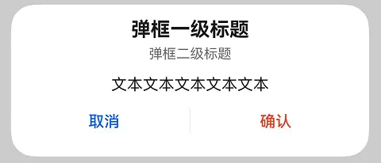
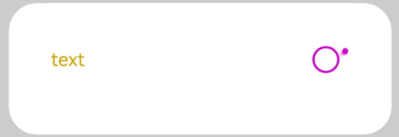
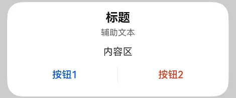
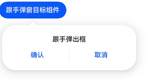

# DialogV2

弹出框是一种模态窗口，通常用于在保持当前的上下文环境时，临时展示用户需关注的信息或待处理的操作，用户在模态弹出框内完成上述交互任务。模态弹出框需要用户进行交互才能够退出模态模式。

该组件基于[状态管理V2](../../../ui/state-management/arkts-state-management-overview.md#状态管理v2)实现，相较于[状态管理V1](../../../ui/state-management/arkts-state-management-overview.md#状态管理v1)，状态管理V2增强了对数据对象的深度观察与管理能力，不再局限于组件层级。借助状态管理V2，开发者可以通过该组件更灵活地控制弹出框的数据和状态，实现更高效的用户界面刷新。

> **说明：**
>
> 该组件从API version 18开始支持。后续版本如有新增内容，则采用上角标单独标记该内容的起始版本。
> 
> 该组件不支持在Wearable设备上使用。

## 导入模块

    import { TipsDialogV2, SelectDialogV2, ConfirmDialogV2, AlertDialogV2, LoadingDialogV2, CustomContentDialogV2, PopoverDialogV2 } from '@kit.ArkUI';

## 子组件

无

## TipsDialogV2

TipsDialogV2({imageRes: ResourceStr | PixelMap, imageSize?: SizeOptions, imageBorderColor: ColorMetrics, imageBorderWidth: LengthMetrics, title?: ResourceStr, content?: ResourceStr, checkTips?: ResourceStr, checked?: boolean, onCheckedChange?: AdvancedDialogV2OnCheckedChange, primaryButton?: AdvancedDialogV2Button, secondaryButton?: AdvancedDialogV2Button})

提示弹出框，即为带图形确认框，必要时可通过图形化方式展现确认框。

**装饰器类型：**@ComponentV2

**原子化服务API：** 从API version 18开始，该接口支持在原子化服务中使用。

**系统能力：** SystemCapability.ArkUI.ArkUI.Full

| 名称               | 类型                                                                                                    | 必填 | 装饰器类型                | 说明                                                         |
|------------------|-------------------------------------------------------------------------------------------------------|----|----------------------|------------------------------------------------------------|
| imageRes         | [ResourceStr](ts-types.md#resourcestr) \| [PixelMap](../../apis-image-kit/arkts-apis-image-PixelMap.md) | 是  | @Param<br />@Require | 展示的图片。                                                     |
| imageSize        | [SizeOptions](ts-types.md#sizeoptions)                                                                | 否  | @Param               | 自定义图片尺寸。<br />默认值：64\*64vp                                 |
| imageBorderColor | [ColorMetrics](../js-apis-arkui-graphics.md#colormetrics12)                                                              | 否  | @Param               | 图片描边颜色。<br/>默认值：Color.Black                                |
| imageBorderWidth | [LengthMetrics](../js-apis-arkui-graphics.md#lengthmetrics12)                                                            | 否  | @Param               | 图片描边宽度。<br/>默认无描边效果。                                       |
| title            | [ResourceStr](ts-types.md#resourcestr)                                                                | 否  | @Param               | 提示弹出框标题。<br />默认不显示。<br/> **说明：** 标题超过两行会显示“...”。       |
| content          | [ResourceStr](ts-types.md#resourcestr)                                                                | 否  | @Param               | 提示弹出框内容。<br />默认不显示。                                       |
| checkTips        | [ResourceStr](ts-types.md#resourcestr)                                                                | 否  | @Param               | 选择框的提示内容。<br />默认不显示。                                      |
| checked          | boolean                                                                                               | 否  | @Param               | checked为true时，表示选择框已选中。checked为false时，表示选择框未选中。<br />默认值：false |
| onCheckedChange  | [AdvancedDialogV2OnCheckedChange](#advanceddialogv2oncheckedchange)                                   | 否  | @Param               | 选择框的选中状态改变事件。<br />默认无事件。                               |
| primaryButton    | [AdvancedDialogV2Button](#advanceddialogv2button)                                                     | 否  | @Param               | 提示框左侧按钮。<br />默认不显示。                                       |
| secondaryButton  | [AdvancedDialogV2Button](#advanceddialogv2button)                                                     | 否  | @Param               | 提示框右侧按钮。<br />默认不显示。                                       |

## AdvancedDialogV2OnCheckedChange

type AdvancedDialogV2OnCheckedChange = (checked: boolean) => void

选择框选中状态改变事件。

**原子化服务API：** 从API version 18开始，该接口支持在原子化服务中使用。

**系统能力：** SystemCapability.ArkUI.ArkUI.Full

| 参数名     | 类型      | 必填 | 说明                                                  |
| :------ |:--------| :- | :-------------------------------------------------- |
| checked | boolean | 是  | 表示选择框选中状态。<br />checked为true时，表示选择框已选中。checked为false时，表示选择框未选中。 |

## SelectDialogV2

SelectDialogV2({title: ResourceStr, content?: ResourceStr, selectedIndex?: number, confirm?: AdvancedDialogV2Button, radioContent: SheetInfo\[]})

选择类弹出框，弹框中以列表或网格的形式提供可选的内容。

**装饰器类型：**@ComponentV2

**原子化服务API：** 从API version 18开始，该接口支持在原子化服务中使用。

**系统能力：** SystemCapability.ArkUI.ArkUI.Full

| 名称            | 类型                                                       | 必填 | 装饰器类型               | 说明                                                                              |
| ------------- | -------------------------------------------------------- | -- |---------------------|---------------------------------------------------------------------------------|
| title         | [ResourceStr](ts-types.md#resourcestr)                   | 是  | @Param<br/>@Require | 选择弹出框标题。<br/> **说明：** 标题超过两行会显示“...”。                                                 |
| content       | [ResourceStr](ts-types.md#resourcestr)                   | 否  | @Param              | 选择弹出框内容。默认不显示。                                                                  |
| selectedIndex | number                                                   | 否  | @Param              | 选择弹出框的选中项。<br />默认值：-1，没有选中项。若设置数值不在取值范围，按没有选中项处理。  <br/>取值范围：小于选择弹出框的子项内容列表长度。 |
| confirm       | [AdvancedDialogV2Button](#advanceddialogv2button)        | 否  | @Param              | 选择弹出框底部按钮。<br />默认不显示。                                                          |
| radioContent  | [SheetInfo](ts-methods-action-sheet.md#sheetinfo对象说明)\[] | 是  | @Param<br/>@Require | 选择弹出框的子项内容列表，每个选择项支持设置文本和选中的回调事件。                                               |

## ConfirmDialogV2

ConfirmDialogV2({title: ResourceStr, content?: ResourceStr, checkTips?: ResourceStr, ischecked?: boolean, onCheckedChange: AdvancedDialogV2OnCheckedChange, primaryButton?: AdvancedDialogV2Button, secondaryButton?: AdvancedDialogV2Button})

信息确认类弹出框，操作未正确执行（如网络错误、电池电量过低），或未正确操作时（如指纹录入），反馈的错误或提示信息。

**装饰器类型：**@ComponentV2

**原子化服务API：** 从API version 18开始，该接口支持在原子化服务中使用。

**系统能力：** SystemCapability.ArkUI.ArkUI.Full

| 名称              | 类型                                                                  | 必填 | 装饰器类型  | 说明                                                         |
|-----------------| ------------------------------------------------------------------- | -- | ------ |------------------------------------------------------------|
| title           | [ResourceStr](ts-types.md#resourcestr)                              | 是  | @Param<br/>@Require | 确认弹出框标题。<br/> **说明：** 标题超过两行会显示“...”。                                                    |
| content         | [ResourceStr](ts-types.md#resourcestr)                              | 否  | @Param | 确认弹出框内容。<br />默认不显示。                                  |
| checkTips       | [ResourceStr](ts-types.md#resourcestr)                              | 否  | @Param | checkbox的提示内容。<br />默认不显示。                            |
| checked         | boolean                                                             | 否  | @Param | checked为true时，表示checkbox已选中，为false时，表示未选中。<br />默认值：false。 |
| onCheckedChange | [AdvancedDialogV2OnCheckedChange](#advanceddialogv2oncheckedchange) | 否  | @Param | checkbox的选中状态改变事件。<br />默认无事件。                        |
| primaryButton   | [AdvancedDialogV2Button](#advanceddialogv2button)                   | 否  | @Param | 确认框左侧按钮。<br />默认不显示。                                  |
| secondaryButton | [AdvancedDialogV2Button](#advanceddialogv2button)                   | 否  | @Param | 确认框右侧按钮。<br />默认不显示。                                  |

## AlertDialogV2

AlertDialogV2({primaryTitle?: ResourceStr, secondaryTitle?: ResourceStr, content: ResourceStr, primaryButton?: AdvancedDialogV2Button, secondaryButton?: AdvancedDialogV2Button})

操作确认类弹出框。当触发一个将产生严重后果的不可逆操作时，如删除、重置、取消编辑、停止等，会触发该类弹出框提示。

**装饰器类型：**@ComponentV2

**原子化服务API：** 从API version 18开始，该接口支持在原子化服务中使用。

**系统能力：** SystemCapability.ArkUI.ArkUI.Full

| 名称              | 类型                                                | 必填 | 装饰器类型                | 说明                   |
| --------------- | ------------------------------------------------- | -- | :------------------- | -------------------- |
| primaryTitle    | [ResourceStr](ts-types.md#resourcestr)            | 否  | @Param               | 确认框一级标题。<br />默认不显示。<br/>**说明：** 标题超过两行会显示“...”。  |
| secondaryTitle  | [ResourceStr](ts-types.md#resourcestr)            | 否  | @Param               | 确认框二级标题。<br />默认不显示。<br/>**说明：** 标题超过两行会显示“...”。       |
| content         | [ResourceStr](ts-types.md#resourcestr)            | 是  | @Param<br />@Require | 确认弹出框内容。<br />       |
| primaryButton   | [AdvancedDialogV2Button](#advanceddialogv2button) | 否  | @Param               | 确认框左侧按钮。<br />默认不显示。 |
| secondaryButton | [AdvancedDialogV2Button](#advanceddialogv2button) | 否  | @Param               | 确认框右侧按钮。<br />默认不显示。 |

## LoadingDialogV2

LoadingDialogV2({content?: ResourceStr})

进度加载类弹出框，操作正在执行时的提示信息。

**装饰器类型：**@ComponentV2

**原子化服务API：** 从API version 18开始，该接口支持在原子化服务中使用。

**系统能力：** SystemCapability.ArkUI.ArkUI.Full

| 名称      | 类型                                     | 必填 | 装饰器类型  | 说明                                               |
| ------- | -------------------------------------- | -- | :----- |--------------------------------------------------|
| content | [ResourceStr](ts-types.md#resourcestr) | 否  | @Param | 加载弹出框内容。<br />默认为空。<br/> **说明：** 内容超过十行会显示“...”。 |

## CustomContentDialogV2

CustomContentDialogV2({contentBuilder: () => void, primaryTitle?: ResourceStr, secondaryTitle?: ResourceStr, contentAreaPadding?: LocalizedPadding, buttons?: AdvancedDialogV2Button\[]})

自定义内容区弹出框，同时支持定义操作区按钮样式。

**装饰器类型：**@ComponentV2

**原子化服务API：** 从API version 18开始，该接口支持在原子化服务中使用。

**系统能力：** SystemCapability.ArkUI.ArkUI.Full

| 名称                 | 类型                                                   | 必填 | 装饰器类型         | 说明                       |
| ------------------ | ---------------------------------------------------- | -- | ------------- | ------------------------ |
| contentBuilder     | [CustomBuilder](ts-types.md#custombuilder8)          | 是  | @BuilderParam | 弹出框内容。                   |
| primaryTitle       | [ResourceStr](ts-types.md#resourcestr)               | 否  | @Param        | 弹出框标题。<br />默认不显示。<br/>**说明：** 标题超过两行会显示“...”。             |
| secondaryTitle     | [ResourceStr](ts-types.md#resourcestr)               | 否  | @Param        | 弹出框辅助文本。<br />默认不显示。<br/> **说明：** 辅助文本超过两行会显示“...”。          |
| contentAreaPadding | [LocalizedPadding](ts-types.md#localizedpadding12)     | 否  | @Param        | 弹出框内容区内边距。<br />默认不显示。         |
| buttons            | [AdvancedDialogV2Button](#advanceddialogv2button)\[] | 否  | @Param        | 弹出框操作区按钮，最多支持4个按钮。<br />默认不显示。 |

## PopoverDialogV2OnVisibleChange

type PopoverDialogV2OnVisibleChange = (visible: boolean) => void

跟手弹出框显示状态改变事件。

**原子化服务API：** 从API version 18开始，该接口支持在原子化服务中使用。

**系统能力：** SystemCapability.ArkUI.ArkUI.Full

| 参数名     | 类型      | 必填 | 说明                                                                    |
| :------ | :------ | :- |:----------------------------------------------------------------------|
| visible | boolean | 是  | 表示跟手弹出框显示状态。<br />值为true时跟手弹出框显示，为false时隐藏。                           |

## PopoverDialogV2

PopoverDialogV2({visible: boolean, \$visible: PopoverDialogV2OnVisibleChange, popover: PopoverDialogV2Options, targetBuilder: CustomBuilder})

跟手弹窗，基于目标组件位置弹出，上文中的TipsDialogV2、SelectDialogV2、ConfirmDialogV2、AlertDialogV2、LoadingDialogV2、CustomContentDialogV2都可作为弹窗内容。

**装饰器类型：**@ComponentV2

**原子化服务API：** 从API version 18开始，该接口支持在原子化服务中使用。

**系统能力：** SystemCapability.ArkUI.ArkUI.Full

| 名称            | 类型                                                                | 必填 | 装饰器类型               | 说明                                                 |
| ------------- |-------------------------------------------------------------------| -- |---------------------| -------------------------------------------------- |
| visible       | boolean                                                           | 是  | @Param<br/>@Require | 跟手弹出框显示状态。<br />值为true时跟手弹出框显示，为false时隐藏。                                         |
| \$visible     | [PopoverDialogV2OnVisibleChange](#popoverdialogv2onvisiblechange) | 否  | @Event              | 修改跟手弹出框显示状态时触发的回调函数，建议在visible后使用!!语法设置双向同步。<br />默认无事件。 |
| popover       | [PopoverDialogV2Options](#popoverdialogv2options)                 | 是  | @Param<br/>@Require | 配置跟手弹窗的参数。                                         |
| targetBuilder | [CustomBuilder](ts-types.md#custombuilder8)                       | 是  | @BuilderParam       | 跟手弹出框基于的目标组件。                                      |

## PopoverDialogV2Options

跟手弹窗参数，用于设置弹窗内容、位置属性等。

继承自[CustomPopupOptions](../arkui-ts/ts-universal-attributes-popup.md#custompopupoptions8类型说明)。

> **说明：**
>
> radius默认值为32vp。

**原子化服务API：** 从API version 18开始，该接口支持在原子化服务中使用。

**系统能力：** SystemCapability.ArkUI.ArkUI.Full

## AdvancedDialogV2ButtonAction

type AdvancedDialogV2ButtonAction = () => void

跟手弹出框显示状态改变事件。

**原子化服务API：** 从API version 18开始，该接口支持在原子化服务中使用。

**系统能力：** SystemCapability.ArkUI.ArkUI.Full

## AdvancedDialogV2Button

弹出框操作区按钮。

**装饰器类型：**@ObservedV2

**原子化服务API：** 从API version 18开始，该接口支持在原子化服务中使用。

**系统能力：** SystemCapability.ArkUI.ArkUI.Full

| 名称           | 类型                                                                     | 必填 | 装饰器类型  | 说明                                                                          |
|:-------------|:-----------------------------------------------------------------------|:---|:-------|:----------------------------------------------------------------------------|
| content      | [ResourceStr](ts-types.md#resourcestr)                                 | 是  | @Trace | 按钮的内容。                                                                      |
| action       | [AdvancedDialogV2ButtonAction](#advanceddialogv2buttonaction)          | 否  | @Trace | 按钮的点击事件。<br />默认无事件。                                                        |
| background   | [ColorMetrics](../js-apis-arkui-graphics.md#colormetrics12)                                | 否  | @Trace | 按钮的背景。<br />默认值跟随buttonStyle。                                               |
| fontColor    | [ColorMetrics](../js-apis-arkui-graphics.md#colormetrics12)                                | 否  | @Trace | 按钮的字体颜色。<br />默认值跟随buttonStyle。                                             |
| buttonStyle  | [ButtonStyleMode](ts-basic-components-button.md#buttonstylemode11枚举说明) | 否  | @Trace | 按钮的样式。<br />默认值：2in1设备为ButtonStyleMode.NORMAL，其他设备为ButtonStyleMode.TEXTUAL。 |
| role         | [ButtonRole](ts-basic-components-button.md#buttonrole12枚举说明)           | 否  | @Trace | 按钮的角色。<br />默认值：ButtonRole.NORMAL。                                          |
| defaultFocus | boolean                                                                | 否  | @Trace | 是否为默认焦点。<br/>true：按钮是默认焦点。<br/>false：按钮不是默认焦点。<br />默认值：false                         |
| enabled       | boolean                                                                | 否  | @Trace | 是否可用。<br/>true：按钮可用。<br/>false：按钮不可用。<br />默认值：true                                                         |

> **说明：**
>
> buttonStyle和role优先级高于fontColor和background。如果buttonStyle和role设置的是默认值，那么fontColor和background可生效。
>
> 若同时给多个按钮设置defaultFocus，那么默认焦点为设置defaultFocus按钮显示顺序的第一个。

### constructor

constructor(options: AdvancedDialogV2ButtonOptions)

AdvancedDialogV2Button的构造函数。

**原子化服务API：** 从API version 18开始，该接口支持在原子化服务中使用。

**系统能力：** SystemCapability.ArkUI.ArkUI.Full

**参数**：

| 参数名     | 类型                                                              | 必填 | 说明      |
|:--------| :-------------------------------------------------------------- | :- | :------ |
| options | [AdvancedDialogV2ButtonOptions](#advanceddialogv2buttonoptions) | 是  | 按钮配置信息。 |

## AdvancedDialogV2ButtonOptions

用于初始化AdvancedDialogV2Button对象。

**原子化服务API：** 从API version 18开始，该接口支持在原子化服务中使用。

**系统能力：** SystemCapability.ArkUI.ArkUI.Full

| 名称           | 类型                                                                     | 必填 | 说明                                                                          |
|:-------------|:-----------------------------------------------------------------------|:---|:----------------------------------------------------------------------------|
| content      | [ResourceStr](ts-types.md#resourcestr)                                 | 是  | 按钮的内容。                                                                      |
| action       | [AdvancedDialogV2ButtonAction](#advanceddialogv2buttonaction)          | 否  | 按钮的点击事件。<br />默认无事件。                                                        |
| background   | [ColorMetrics](../js-apis-arkui-graphics.md#colormetrics12)                              | 否  | 按钮的背景。<br /> 默认值跟随buttonStyle。                                              |
| fontColor    | [ColorMetrics](../js-apis-arkui-graphics.md#colormetrics12)                              | 否  | 按钮的字体颜色。<br />默认值跟随buttonStyle。                                             |
| buttonStyle  | [ButtonStyleMode](ts-basic-components-button.md#buttonstylemode11枚举说明) | 否  | 按钮的样式。<br />默认值：2in1设备为ButtonStyleMode.NORMAL，其他设备为ButtonStyleMode.TEXTUAL。 |
| role         | [ButtonRole](ts-basic-components-button.md#buttonrole12枚举说明)           | 否  | 按钮的角色。<br />默认值：ButtonRole.NORMAL。                                          |
| defaultFocus | boolean                                                                | 否  | 是否为默认焦点。<br/>true：按钮是默认焦点。<br/>false：按钮不是默认焦点。<br />默认值：false                         |
| enabled       | boolean                                                                | 否  | 是否可用。<br/>true：按钮可用。<br/>false：按钮不可用。<br />默认值：true                                                         |

## 示例

### 示例1（上图下文弹出框）

上图下文弹出框，包含imageRes、content等内容。

```ts
import { TipsDialogV2, AdvancedDialogV2Button, UIContext  } from '@kit.ArkUI';

@Entry
@ComponentV2
struct Index {
  @Local checked: boolean = false;

  @Builder
  dialogBuilder(): void {
    TipsDialogV2({
      imageRes: $r('sys.media.ohos_ic_public_voice'),
      content: '想要卸载这个APP嘛?',
      title: 'TipsDialogV2',
      checkTips: '不再提示',
      checked: this.checked,
      primaryButton: new AdvancedDialogV2Button({
        content: '取消',
        action: () => {
          console.info('Callback when the first button is clicked');
        },
      }),
      secondaryButton: new AdvancedDialogV2Button({
        content: '删除',
        role: ButtonRole.ERROR,
        action: () => {
          console.info('Callback when the second button is clicked');
        }
      }),
      onCheckedChange: (checked: boolean) => {
        console.info('Callback when the checkbox is clicked');
        this.checked = checked;
      }
    })
  }

  build() {
    Row() {
      Stack() {
        Column() {
          Button("打开TipsDialogV2弹窗")
            .width(96)
            .height(40)
            .onClick(() => {
              let uiContext: UIContext = this.getUIContext();
              uiContext.getPromptAction().openCustomDialog({
                builder: () => {
                  this.dialogBuilder();
                },
              });
            })
        }.margin({ bottom: 300 })
      }.align(Alignment.Bottom)
      .width('100%').height('100%')
    }
    .backgroundImageSize({ width: '100%', height: '100%' })
    .height('100%')
  }
}
```



### 示例2（纯列表弹出框）

纯列表弹出框，包含selectedIndex、radioContent等内容。

```ts
import { SelectDialogV2, AdvancedDialogV2Button ,UIContext  } from '@kit.ArkUI';

@Entry
@ComponentV2
struct Index {
  @Local radioIndex: number = 0;
  @Builder
  dialogBuilder(): void {
    SelectDialogV2({
      title: '文本标题',
      selectedIndex: this.radioIndex,
      confirm: new AdvancedDialogV2Button({
        content: '取消',
        action: () => {},
      }),
      radioContent: [
        {
          title: '文本文本文本文本文本',
          action: () => {
            this.radioIndex = 0
          }
        },
        {
          title: '文本文本文本文本',
          action: () => {
            this.radioIndex = 1
          }
        },
        {
          title: '文本文本文本文本',
          action: () => {
            this.radioIndex = 2
          }
        },
      ]
    })
  }
  build() {
    Row() {
      Stack() {
        Column() {
          Button("纯列表弹出框")
            .width(96)
            .height(40)
            .onClick(() => {
              let uiContext: UIContext = this.getUIContext();
              uiContext.getPromptAction().openCustomDialog({
                builder: () => {
                  this.dialogBuilder();
                }
              })
            })
        }.margin({ bottom: 300 })
      }.align(Alignment.Bottom)
      .width('100%').height('100%')
    }
    .backgroundImageSize({ width: '100%', height: '100%' })
    .height('100%')
  }
}
```



### 示例3（文本与勾选弹出框）

文本与勾选弹出框，包含content、checkTips等内容。

```ts
import { ConfirmDialogV2, AdvancedDialogV2Button, UIContext  } from '@kit.ArkUI';

@Entry
@ComponentV2
struct Index {
  @Local checked: boolean = false;

  @Builder
  dialogBuilder(): void {
    ConfirmDialogV2({
      title: '文本标题',
      content: '文本文本文本文本文本文本文本文本文本文本文本文本文本文本文本文本文本文本文本',
      checked: this.checked,
      checkTips: '禁止后不再提示',
      primaryButton: new AdvancedDialogV2Button({
        content: '禁止',
        action: () => {
          console.info('Callback when the primary button is clicked');
        },
      }),
      secondaryButton: new AdvancedDialogV2Button({
        content: '允许',
        action: () => {
          this.checked = false
          console.info('Callback when the second button is clicked');
        }
      }),
      onCheckedChange: (checked: boolean) => {
        console.info('Callback when the checkbox is clicked');
        this.checked = checked;
      },
    })
  }

  build() {
    Row() {
      Stack() {
        Column() {
          Button("打开ConfirmDialogV2弹窗")
            .width(96)
            .height(40)
            .onClick(() => {
              let uiContext: UIContext = this.getUIContext();
              uiContext.getPromptAction().openCustomDialog({
                builder: () => {
                  this.dialogBuilder();
                },
                alignment: DialogAlignment.Bottom
              });
            })
        }.margin({ bottom: 300 })
      }.align(Alignment.Bottom)
      .width('100%').height('100%')
    }
    .backgroundImageSize({ width: '100%', height: '100%' })
    .height('100%')
  }
}
```



### 示例4（纯文本弹出框）

纯文本弹出框，包含primaryTitle、secondaryTitle、content等内容。

```ts
import { AlertDialogV2, AdvancedDialogV2Button, UIContext  } from '@kit.ArkUI';

@Entry
@ComponentV2
struct Index {
  @Builder
  dialogBuilder(): void {
    AlertDialogV2({
      primaryTitle: '弹框一级标题',
      secondaryTitle: '弹框二级标题',
      content: '文本文本文本文本文本',
      primaryButton: new AdvancedDialogV2Button({
        content: '取消',
        action: () => {
          console.info('Callback when the primary button is clicked');
        },
      }),
      secondaryButton: new AdvancedDialogV2Button({
        content: '确认',
        role: ButtonRole.ERROR,
        action: () => {
          console.info('Callback when the second button is clicked');
        }
      }),
    })
  }

  build() {
    Row() {
      Stack() {
        Column() {
          Button("打开AlertDialogV2弹窗")
            .width(96)
            .height(40)
            .onClick(() => {
              let uiContext: UIContext = this.getUIContext();
              uiContext.getPromptAction().openCustomDialog({
                builder: () => {
                  this.dialogBuilder();
                }
              });
            })
        }.margin({ bottom: 300 })
      }.align(Alignment.Bottom)
      .width('100%').height('100%')
    }
    .backgroundImageSize({ width: '100%', height: '100%' })
    .height('100%')
  }
}
```



### 示例5（进度条弹出框）

进度条弹出框，包含content等内容。

```ts
import { LoadingDialogV2, UIContext  } from '@kit.ArkUI';

@Entry
@ComponentV2
struct Index {
  @Builder
  dialogBuilder(): void {
    LoadingDialogV2({
      content: '文本文本文本文本文本...',
    })
  }

  build() {
    Row() {
      Stack() {
        Column() {
          Button("打开LoadingDialogV2弹窗")
            .width(96)
            .height(40)
            .onClick(() => {
              let uiContext: UIContext = this.getUIContext();
              uiContext.getPromptAction().openCustomDialog({
                builder: () => {
                  this.dialogBuilder();
                }
              });
            })
        }.margin({ bottom: 300 })
      }.align(Alignment.Bottom)
      .width('100%').height('100%')
    }
    .backgroundImageSize({ width: '100%', height: '100%' })
    .height('100%')
  }
}
```


### 示例6（自定义主题风格弹出框）

自定义主题风格弹出框，包含content、theme等内容。

```ts
import { CustomColors, CustomTheme, LoadingDialogV2, UIContext  } from '@kit.ArkUI';

class CustomThemeImpl implements CustomTheme {
  colors?: CustomColors;

  constructor(colors: CustomColors) {
    this.colors = colors;
  }
}

class CustomThemeColors implements CustomColors {
  fontPrimary = '#ffd0a300';
  iconSecondary = '#ffd000cd';
}

@Entry
@ComponentV2
struct Index {
  @Builder
  dialogBuilder(): void {
    WithTheme({ theme: new CustomThemeImpl(new CustomThemeColors()) }) {
      LoadingDialogV2({
        content: '文本文本文本文本文本...',
      })
    }
  }

  build() {
    Row() {
      Stack() {
        Column() {
          Button("打开LoadingDialogV2弹窗")
            .width(96)
            .height(40)
            .onClick(() => {
              let uiContext: UIContext = this.getUIContext();
              uiContext.getPromptAction().openCustomDialog({
                builder: () => {
                  this.dialogBuilder();
                }
              });
            })
        }.margin({ bottom: 300 })
      }.align(Alignment.Bottom)
      .width('100%').height('100%')
    }
    .backgroundImageSize({ width: '100%', height: '100%' })
    .height('100%')
  }
}
```



### 示例7（自定义内容弹出框）

支持自定义内容弹出框，包含contentBuilder、buttons等内容。

```ts
import { CustomContentDialogV2, AdvancedDialogV2Button, UIContext  } from '@kit.ArkUI';

@Entry
@ComponentV2
struct Index {
  @Builder
  dialogBuilder(): void {
    CustomContentDialogV2({
      primaryTitle: '标题',
      secondaryTitle: '辅助文本',
      contentBuilder: () => {
        this.buildContent();
      },
      buttons: [
        new AdvancedDialogV2Button({
          content: '按钮1', buttonStyle: ButtonStyleMode.TEXTUAL,
          action: () => {
            console.info('Callback when the button is clicked');
          }
        }),
        new AdvancedDialogV2Button({
          content: '按钮2', buttonStyle: ButtonStyleMode.TEXTUAL, role: ButtonRole.ERROR,
        })
      ],
    })
  }

  build() {
    Column() {
      Button("打开CustomContentDialogV2弹窗")
        .onClick(() => {
            let uiContext: UIContext = this.getUIContext();
            uiContext.getPromptAction().openCustomDialog({
            builder: () => {
              this.dialogBuilder();
            }
          })
        })
    }
    .width('100%')
    .height('100%')
    .justifyContent(FlexAlign.Center)
  }

  @Builder
  buildContent(): void {
    Column() {
      Text('内容区')
    }
  }
}
```



### 示例8（跟手弹窗）

跟手弹窗（警告弹窗为例），包含visible、popover、targetBuilder等内容。

```ts
import { AlertDialogV2, PopoverDialogV2, PopoverDialogV2Options, AdvancedDialogV2Button} from '@kit.ArkUI';

@Entry
@ComponentV2
struct Index {
  @Local isShow: boolean = false;
  @Local popoverOptions: PopoverDialogV2Options = {
    builder: () => {
      this.dialogBuilder();
    }
  }

  @Builder dialogBuilder() {
    AlertDialogV2({
      content: '跟手弹出框',
      primaryButton: new AdvancedDialogV2Button({
        content: '取消',
        action: () => {
          this.isShow = false;
        },
      }),
      secondaryButton: new AdvancedDialogV2Button({
        content: '确认',
        action: () => {
          this.isShow = false;
        },
      }),
    });
  }

  @Builder buttonBuilder() {
    Button('跟手弹窗目标组件').onClick(() => {
      this.isShow = true;
    });
  }

  build() {
    Column() {
      PopoverDialogV2({
        visible: this.isShow!!,
        popover: this.popoverOptions,
        targetBuilder: () => {
          this.buttonBuilder();
        },
      })
    }
  }
}
```


