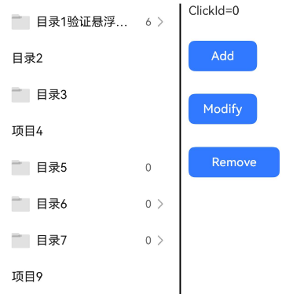

# @ohos.arkui.advanced.TreeView (树视图)


树视图作为一种分层显示的列表，适合显示嵌套结构。拥有父列表项和子列表项，可展开或折叠。


用于效率型应用，如备忘录、电子邮件、图库中的侧边导航栏中。


> **说明：**
>
> 该组件从API Version 10开始支持。后续版本如有新增内容，则采用上角标单独标记该内容的起始版本。


## 导入模块

```
import { TreeView } from "@kit.ArkUI"
```


## 子组件

无

## 属性
不支持[通用属性](ts-universal-attributes-size.md)。

## TreeView

TreeView({ treeController: TreeController })

**装饰器类型：**\@Component

**系统能力：** SystemCapability.ArkUI.ArkUI.Full


**参数：**


| 名称 | 参数类型 | 必填 | 说明 |
| -------- | -------- | -------- | -------- |
| treeController | [TreeController](#treecontroller) | 是 | 树视图节点信息。 |


## TreeController

树视图组件的控制器，可以将此对象绑定至树视图组件，然后通过它控制树的节点信息，同一个控制器不可以控制多个树视图组件。

**原子化服务API：** 从API version 11开始，该接口支持在原子化服务中使用。


### addNode


addNode(nodeParam?: NodeParam): void

点击某个节点后，调用该方法可以触发新增孩子节点。

**原子化服务API：** 从API version 11开始，该接口支持在原子化服务中使用。


**参数：**


| 名称 | 参数类型 | 必填 | 说明 |
| -------- | -------- | -------- | -------- |
| nodeParam | [NodeParam](#nodeparam) | 否 | 节点信息。 |


### removeNode

removeNode(): void

点击某个节点后，调用该方法可以触发删除该节点。

**原子化服务API：** 从API version 11开始，该接口支持在原子化服务中使用。


### modifyNode


modifyNode(): void

点击某个节点后，调用该方法可以触发修改该节点。

**原子化服务API：** 从API version 11开始，该接口支持在原子化服务中使用。


### buildDone

buildDone(): void

建立树视图。节点增加完毕后，必须调用该方法，触发树信息的保存。

**原子化服务API：** 从API version 11开始，该接口支持在原子化服务中使用。


### refreshNode

refreshNode(parentId: number, parentSubTitle: ResourceStr, currentSubtitle: ResourceStr): void

更新树视图。调用该方法，更新当前节点的信息。

**原子化服务API：** 从API version 11开始，该接口支持在原子化服务中使用。

**参数：**

| 名称 | 参数类型 | 必填 | 说明 |
| -------- | -------- | -------- | -------- |
| parentId | number | 是 | 父节点Id。 |
| parentSubTitle | [ResourceStr](ts-types.md#resourcestr) | 是 | 父节点副文本。 |
| currentSubtitle | [ResourceStr](ts-types.md#resourcestr) | 是 | 当前节点副文本。 |

## NodeParam

**原子化服务API：** 从API version 11开始，该接口支持在原子化服务中使用。

| 名称 | 类型 | 必填 | 说明 |
| -------- | -------- | -------- | -------- |
| parentNodeId | number | 否 | 父节点。 |
| currentNodeId | number | 否 | 当前子节点。 |
| isFolder | boolean | 否 | 是否是目录。默认值：false。true：是目录，false：不是目录。 |
| icon | [ResourceStr](ts-types.md#resourcestr) | 否 | 图标。 |
| selectedIcon | [ResourceStr](ts-types.md#resourcestr) | 否 | 选中图标。 |
| editIcon | [ResourceStr](ts-types.md#resourcestr) | 否 | 编辑图标。 |
| primaryTitle | [ResourceStr](ts-types.md#resourcestr) | 否 | 主标题。 |
| secondaryTitle | [ResourceStr](ts-types.md#resourcestr) | 否 | 副标题。 |
| container | ()&nbsp;=&gt;&nbsp;void | 否 | 绑定在节点上的右键子组件，子组件由@Builder修饰。 |


## TreeListenerManager

树视图组件的监听器，可以将此对象绑定至树视图组件，然后通过它监听树的节点的变化，同一个监听器不可以控制多个树视图组件。


### getInstance

getInstance(): [TreeListenerManager](#treelistenermanager)

获取监听管理器单例对象。

**原子化服务API：** 从API version 11开始，该接口支持在原子化服务中使用。


### getTreeListener

getTreeListener(): [TreeListener](#treelistener)

获取监听器。

**原子化服务API：** 从API version 11开始，该接口支持在原子化服务中使用。


## TreeListener

树视图组件的监听器，可以将此对象绑定至树视图组件，然后通过它监听树的节点的变化，同一个监听器不可以控制多个树视图组件。


### on

on(type: TreeListenType, callback: (callbackParam: CallbackParam) =&gt; void): void;

注册监听。

**原子化服务API：** 从API version 11开始，该接口支持在原子化服务中使用。

**参数：**

| 名称 | 参数类型 | 必填 | 说明 |
| -------- | -------- | -------- | -------- |
| type | [TreeListenType](#treelistentype) | 是 | 监听类型。 |
| callback | (callbackParam: [CallbackParam](#callbackparam)) =&gt; void | 是 | 节点信息。 |


### once

once(type: TreeListenType, callback: (callbackParam: CallbackParam) =&gt; void): void;

注册一次监听。

**原子化服务API：** 从API version 11开始，该接口支持在原子化服务中使用。


**参数：**

| 名称 | 参数类型 | 必填 | 说明 |
| -------- | -------- | -------- | -------- |
| type | [TreeListenType](#treelistentype) | 是 | 监听类型。 |
| callback | (callbackParam: [CallbackParam](#callbackparam)) =&gt; void | 是 | 节点信息。 |


### off


off(type: TreeListenType, callback?: (callbackParam: CallbackParam) =&gt; void): void;

取消监听。

**原子化服务API：** 从API version 11开始，该接口支持在原子化服务中使用。

**参数：**


| 名称 | 参数类型 | 必填 | 说明 |
| -------- | -------- | -------- | -------- |
| type | [TreeListenType](#treelistentype) | 是 | 监听类型。 |
| callback | (callbackParam: [CallbackParam](#callbackparam)) =&gt; void | 否 | 节点信息。 |

## TreeListenType

**原子化服务API：** 从API version 11开始，该接口支持在原子化服务中使用。

| 名称 | 说明 |
| -------- | -------- |
| NODE_CLICK | 监听节点点击事件。 |
| NODE_ADD | 监听节点增加事件。 |
| NODE_DELETE | 监听节点删除事件。 |
| NODE_MODIFY | 监听节点修改事件。 |
| NODE_MOVE | 监听节点移动事件。 |

## CallbackParam

**原子化服务API：** 从API version 11开始，该接口支持在原子化服务中使用。

| 名称 | 类型 | 必填 | 说明 |
| -------- | -------- | -------- | -------- |
| currentNodeId | number | 是 | 当前子节点。 |
| parentNodeId | number | 否 | 父节点。 |
| childIndex | number | 否 | 子索引。 |

## 事件
不支持[通用事件](ts-universal-events-click.md)。

## 示例

```ts
import { TreeController, TreeListener, TreeListenerManager, TreeListenType, NodeParam, TreeView, CallbackParam } from '@kit.ArkUI'

@Entry
@Component
struct TreeViewDemo {
  private treeController: TreeController = new TreeController();
  private treeListener: TreeListener = TreeListenerManager.getInstance().getTreeListener();
  @State clickNodeId: number = 0;

  aboutToDisappear(): void {
    this.treeListener.off(TreeListenType.NODE_CLICK, undefined);
    this.treeListener.off(TreeListenType.NODE_ADD, undefined);
    this.treeListener.off(TreeListenType.NODE_DELETE, undefined);
    this.treeListener.off(TreeListenType.NODE_MOVE, undefined);
  }

  @Builder menuBuilder1() {
    Flex({ direction: FlexDirection.Column, justifyContent: FlexAlign.Center, alignItems: ItemAlign.Center }) {
      Text('新增').fontSize(16).width(100).height(30).textAlign(TextAlign.Center)
        .onClick((event: ClickEvent) => {
          this.treeController.addNode();
        })
      Divider()
      Text('删除').fontSize(16).width(100).height(30).textAlign(TextAlign.Center)
        .onClick((event: ClickEvent) => {
          this.treeController.removeNode();
        })
      Divider()
      Text('重命名').fontSize(16).width(100).height(30).textAlign(TextAlign.Center)
        .onClick((event: ClickEvent) => {
          this.treeController.modifyNode();
        })
    }.width(100).border({width: 1, color: 0x80808a, radius: '16dp'})
  }

  aboutToAppear(): void {
    this.treeListener.on(TreeListenType.NODE_CLICK, (callbackParam: CallbackParam) => {
      this.clickNodeId = callbackParam.currentNodeId;
    })
    this.treeListener.on(TreeListenType.NODE_ADD, (callbackParam: CallbackParam) => {
      this.clickNodeId = callbackParam.currentNodeId;
    })
    this.treeListener.on(TreeListenType.NODE_DELETE, (callbackParam: CallbackParam) => {
      this.clickNodeId = callbackParam.currentNodeId;
    })
    this.treeListener.once(TreeListenType.NODE_MOVE, (callbackParam: CallbackParam) => {
      this.clickNodeId = callbackParam.currentNodeId;
    })

    let normalResource: Resource = $r('app.media.ic_public_collect_normal');
    let selectedResource: Resource = $r('app.media.ic_public_collect_selected');
    let editResource: Resource = $r('app.media.ic_public_collect_edit');
    let nodeParam: NodeParam = { parentNodeId:-1, currentNodeId: 1, isFolder: true, icon: normalResource, selectedIcon: selectedResource,
      editIcon: editResource, primaryTitle: "目录1验证悬浮框自适应效果是否OK",
      secondaryTitle: "6" };
    this.treeController
      .addNode(nodeParam)
      .addNode({parentNodeId:1, currentNodeId: 2, isFolder: false, primaryTitle: "项目1_1" })
      .addNode({ parentNodeId:-1, currentNodeId: 7, isFolder: true, primaryTitle: "目录2" })
      .addNode({ parentNodeId:-1, currentNodeId: 23, isFolder: true, icon: normalResource, selectedIcon: selectedResource,
        editIcon: editResource, primaryTitle: "目录3" })
      .addNode({ parentNodeId:-1, currentNodeId: 24, isFolder: false, primaryTitle: "项目4" })
      .addNode({ parentNodeId:-1, currentNodeId: 31, isFolder: true, icon: normalResource, selectedIcon: selectedResource,
        editIcon: editResource, primaryTitle: "目录5", secondaryTitle: "0" })
      .addNode({ parentNodeId:-1, currentNodeId: 32, isFolder: true, icon: normalResource, selectedIcon: selectedResource,
        editIcon: editResource, primaryTitle: "目录6", secondaryTitle: "0" })
      .addNode({ parentNodeId:32, currentNodeId: 35, isFolder: true, icon: normalResource, selectedIcon: selectedResource,
        editIcon: editResource, primaryTitle: "目录6-1", secondaryTitle: "0" })
      .addNode({ parentNodeId:-1, currentNodeId: 33, isFolder: true, icon: normalResource, selectedIcon: selectedResource,
        editIcon: editResource, primaryTitle: "目录7", secondaryTitle: "0" })
      .addNode({ parentNodeId:33, currentNodeId: 34, isFolder: false, primaryTitle: "项目8" })
      .addNode({ parentNodeId:-1, currentNodeId: 36, isFolder: false, primaryTitle: "项目9" })
      .buildDone();
    this.treeController.refreshNode(-1, "父节点", "子节点");
  }

  build() {
    Column(){
      SideBarContainer(SideBarContainerType.Embed)
      {
        TreeView({ treeController: this.treeController })
        Row() {
          Divider().vertical(true).strokeWidth(2).color(0x000000).lineCap(LineCapStyle.Round)
          Column({ space: 30 }) {
            Text('ClickNodeId=' + this.clickNodeId).fontSize('16fp')
            Button('Add', { type: ButtonType.Normal, stateEffect: true })
              .borderRadius(8).backgroundColor(0x317aff).width(90)
              .onClick((event: ClickEvent) => {
                this.treeController.addNode();
              })
            Button('Modify', { type: ButtonType.Normal, stateEffect: true })
              .borderRadius(8).backgroundColor(0x317aff).width(90)
              .onClick((event: ClickEvent) => {
                this.treeController.modifyNode();
              })
            Button('Remove', { type: ButtonType.Normal, stateEffect: true })
              .borderRadius(8).backgroundColor(0x317aff).width(120)
              .onClick((event: ClickEvent) => {
                this.treeController.removeNode();
              })
          }.height('100%').width('70%').alignItems(HorizontalAlign.Start).margin(10)
        }
      }
      .focusable(true)
      .showControlButton(false)
      .showSideBar(true)
    }
  }}
```


