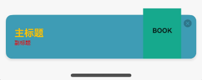

# @ohos.atomicservice.InterstitialDialogAction (弹框组件)

InterstitialDialogAction高级组件，用于元服务弹框提示跳转等场景

> **说明：**
>
> 该组件从API Version 12开始支持。后续版本如有新增内容，则采用上角标单独标记该内容的起始版本。

## 子组件

无

## InterstitialDialogAction

```
InterstitialDialogAction {
    private uiContext;
    private contentNode;
    private dialogParam;
    private bottomOffsetType?;
    constructor(dialogOptions: DialogOptions);
    openDialog(): void;
    closeDialog(): void;
}
```

**装饰器类型：**无

**系统能力：** SystemCapability.ArkUI.ArkUI.Full

**参数**：

| 名称 | 类型 | 必填 | 描述 |
| - | - | - | - |
| uiContext | UIContext | 是 | UI上下文实例。 |
| contentNode | ComponentContent\<object\> | 是 | 组件节点对象。 |
| dialogParam | [DialogParams](#DialogParams) | 是 | 设置弹框的一些属性。 |
| bottomOffsetType | [BottomOffset](#BottomOffset) | 否 | 设定弹框距离窗口底部的距离类型。 |
| constructor | (dialogOptions: [DialogOptions](#DialogOptions)) | 是 | InterstitialDialogAction类的构造方法。 |
| openDialog | void | 否 | 设置弹框打开的接口。 |
| closeDialog | void | 是 | 设置弹框关闭的接口。 |

## DialogParams

设置弹框必备的一些参数，包括弹框的特有属性以及默认关闭动作函数。

| 名称 | 类型 | 必填 | 描述 |
| - | - | - | - |
| dialogOptions | [DialogOptions](#DialogOptions) | 是 | 为弹框组件设置除了基础属性外的属性。 |
| defaultCloseAction | Callback\<void\> | 是 | 点击弹框以及关闭按钮后执行的默认关闭行为。 |

## DialogOptions

设置弹框除了基础属性外特有的属性。

| 名称| 类型 | 必填 | 描述 |
| - | - | - | - |
| uiContext | UIContext | 是 | UI上下文实例。 |
| title | ResourceStr | 否 | 弹框标题文本。 |
| subtitle | ResourceStr | 否 | 弹框副标题文本。 |
| titleColor | ResourceStr \| Color | 否 | 弹框标题文本颜色。 |
| subtitleColor | ResourceStr \| Color | 否 | 弹框副标题文本颜色。 |
| backgroundImage | Resource | 否 | 弹框背景图片。 |
| foregroundImage | Resource | 否 | 弹框前景图片。 |
| iconStyle | [IconStyle](#IconStyle) | 否 | 关闭按钮图标的样式（亮调或者暗调）。<br>默认值：IconStyle.Light |
| titlePosition | [TitlePosition](#TitlePosition) | 否 | 标题在弹框中的位置，在副标题的上方或者在副标题的下方。<br>默认值：TitlePosition.Top |
| onDialogClock | Callback\<void\>| 否 | 点击弹框任意位置后触发的用户自定义动作。 |
| onDialogClose | Callback\<void\> | 否 | 点击关闭按钮后触发的用户自定义动作。|

## IconStyle

枚举类型。设置关闭按钮的色调样式，默认设置关闭按钮为亮色。

| 名称 | 值 | 描述 |
| - | - | - |
| DARK | 0 | 设置关闭按钮为暗色调。 |
| LIGHT | 1 | 设置关闭按钮为亮色调。<br>默认值。 |

## TitlePosition

枚举类型。设置主副标题之间的上下相对位置，默认设置为主标题在副标题之上。

| 名称 | 值 | 描述 |
| - | - | - |
| TOP | 0 | 设置主标题位于副标题之上。<br>默认值。 |
| BOTTOM | 1 | 设置副标题位于主标题之上。 |

## BottomOffset

枚举类型。设置不同情景模式下弹框距离底部的距离，判断依据为是否存在菜单栏，默认显示为不存在菜单栏情况下的距离。

| 名称 | 值 | 描述 |
| - | - | - |
| OFFSET_FOR_BAR | 0 | 存在菜单栏情况下与窗口底部的距离。<br>默认值，设置后弹框距离底部88vp。 |
| OFFSET_FOR_NONE | 1 | 不存在菜单栏情况下与窗口底部的距离。<br>设置后弹框距离底部44vp。 |

## 示例

> **说明：**
>
> 示例中所用到的图片资源已上传到下方链接。<br>
> 背景图：<br>https://gitee.com/openharmony/docs/blob/02c296120377cbd16e5dcdc3c31a1197ecefc6e6/zh-cn/application-dev/reference/apis-arkui/arkui-ts/figures/InterstitialDialogActionBackgroundImg.png<br>
> 前景图：<br>https://gitee.com/openharmony/docs/blob/02c296120377cbd16e5dcdc3c31a1197ecefc6e6/zh-cn/application-dev/reference/apis-arkui/arkui-ts/figures/InterstitialDialogActionForegroundImg.png


### 示例1

所有可选属性均不设置，采用默认情形

```
import { UIContext } from '@ohos.arkui.UIContext';
import { getMyUiContext } from '../entryability/EntryAbility';
import { InterstitialDialogAction, IconStyle, TitlePosition, BottomOffset } from '@ohos.atomicservice.InterstitialDialogAction';

@Entry
@Component
struct Index {
  build() {
    Row() {
      Column() {
        Text("show dialog")
          .fontSize(50)
          .fontWeight(FontWeight.Bold)
          .onClick(() => {
            let ctx: UIContext | null = getMyUiContext();
            let interstitialDialogAction: InterstitialDialogAction = new InterstitialDialogAction({
              uiContext: ctx as UIContext
            });
            interstitialDialogAction.openDialog();
          })
      }
      .width('100%')
    }
    .height('100%')
  }
}
```



### 示例2

为可选属性设置相应值<br>
用两种不同参数类型分别为主标题、副标题设置颜色值<br>
关闭按钮设置为暗色调<br>
主副标题相对位置设置为主标题在副标题上方<br>
底部距离类型设置为不存在菜单栏情况下的距离<br>

```
import { UIContext } from '@ohos.arkui.UIContext';
import { getMyUiContext } from '../entryability/EntryAbility';
import { InterstitialDialogAction, IconStyle, TitlePosition, BottomOffset } from '@ohos.atomicservice.InterstitialDialogAction';

@Entry
@Component
struct Index {
  build() {
    Row() {
      Column() {
        Text("show dialog")
          .fontSize(50)
          .fontWeight(FontWeight.Bold)
          .onClick(() => {
            let ctx: UIContext | null = getMyUiContext();
            let interstitialDialogAction: InterstitialDialogAction = new InterstitialDialogAction({
              uiContext: ctx as UIContext,
              title: "主标题",
              subtitle: "副标题",
              titleColor: Color.Red,
              subtitleColor: 'rgb(0, 255, 0)',
              backgroundImage: $r('app.media.testBackgroundImg'),
              foregroundImage: $r('app.media.testForegroundImg'),
              iconStyle: IconStyle.DARK,
              titlePosition: TitlePosition.TOP,
              bottomOffsetType: BottomOffset.OFFSET_FOR_NONE,
              onDialogClick: () => { console.log('outer dialog click action') },
              onDialogClose: () => { console.log('outer close action') }
            });
            interstitialDialogAction.openDialog();
          })
      }
      .width('100%')
    }
    .height('100%')
  }
}
```


### 示例3

为可选属性设置相应值<br>
用两种不同参数类型分别为主标题、副标题设置颜色值<br>
关闭按钮设置为亮色调<br>
主副标题相对位置设置为主标题在副标题下方<br>
底部距离类型设置为存在菜单栏情况下的距离<br>

```
import { UIContext } from '@ohos.arkui.UIContext';
import { getMyUiContext } from '../entryability/EntryAbility';
import { InterstitialDialogAction, IconStyle, TitlePosition, BottomOffset } from '@ohos.atomicservice.InterstitialDialogAction';

@Entry
@Component
struct Index {
  build() {
    Row() {
      Column() {
        Text("show dialog")
          .fontSize(50)
          .fontWeight(FontWeight.Bold)
          .onClick(() => {
            let ctx: UIContext | null = getMyUiContext();
            let interstitialDialogAction: InterstitialDialogAction = new InterstitialDialogAction({
              uiContext: ctx as UIContext,
              title: "主标题",
              subtitle: "副标题",
              titleColor: Color.Red,
              subtitleColor: 'rgb(0, 255, 0)',
              backgroundImage: $r('app.media.testBackgroundImg'),
              foregroundImage: $r('app.media.testForegroundImg'),
              iconStyle: IconStyle.LIGHT,
              titlePosition: TitlePosition.BOTTOM,
              bottomOffsetType: BottomOffset.OFFSET_FOR_BAR,
              onDialogClick: () => { console.log('outer dialog click action') },
              onDialogClose: () => { console.log('outer close action') }
            });
            interstitialDialogAction.openDialog();
          })
      }
      .width('100%')
    }
    .height('100%')
  }
}
```


