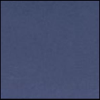
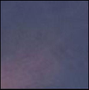
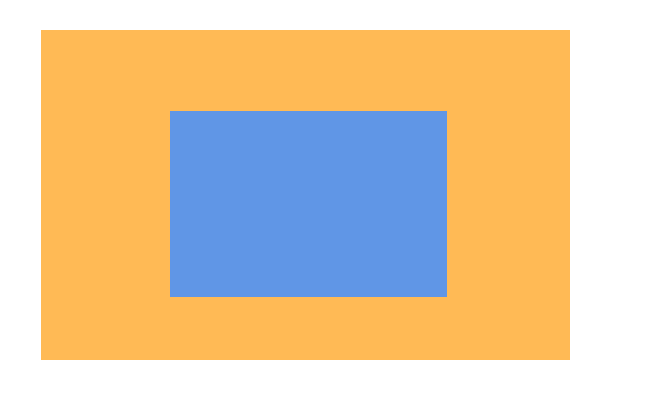

# 枚举说明

>**说明：**
>
>本模块首批接口从API version 7开始支持，后续版本的新增接口，采用上角标单独标记接口的起始版本。

## Color

**卡片能力：** 从API version 9开始，该接口支持在ArkTS卡片中使用。

**原子化服务API：** 从API version 11开始，该接口支持在原子化服务中使用。

**系统能力：** SystemCapability.ArkUI.ArkUI.Full

| 名称                     | 值            | 说明                                                         |
| ------------------------ | ------------- | ------------------------------------------------------------ |
| Black                    | 0x000000      |  |
| Blue                     | 0x0000ff      |  |
| Brown                    | 0xa52a2a      |  |
| Gray                     | 0x808080      |  |
| Grey                     | 0x808080      |  |
| Green                    | 0x008000      |  |
| Orange                   | 0xffa500      |  |
| Pink                     | 0xffc0cb      |  |
| Red                      | 0xff0000      |  |
| White                    | 0xffffff      |  |
| Yellow                   | 0xffff00      |  |
| Transparent9+ | rgba(0,0,0,0) | 透明色                                                       |

## ImageFit

**系统能力：** SystemCapability.ArkUI.ArkUI.Full

| 名称        | 值    | 说明                              |
| --------- | ----- | ------------------------------- |
| Fill      | 0  | 不保持宽高比进行放大缩小，使得图片充满显示边界，对齐方式为水平居中。 **卡片能力：** 从API version 9开始，该接口支持在ArkTS卡片中使用。 **原子化服务API：** 从API version 11开始，该接口支持在原子化服务中使用。  |
| Contain   | 1  | 保持宽高比进行缩小或者放大，使得图片完全显示在显示边界内，对齐方式为水平居中。 **卡片能力：** 从API version 9开始，该接口支持在ArkTS卡片中使用。 **原子化服务API：** 从API version 11开始，该接口支持在原子化服务中使用。  |
| Cover     | 2  | 保持宽高比进行缩小或者放大，使得图片两边都大于或等于显示边界，对齐方式为水平居中。 **卡片能力：** 从API version 9开始，该接口支持在ArkTS卡片中使用。 **原子化服务API：** 从API version 11开始，该接口支持在原子化服务中使用。  |
| Auto      | 3  | 图像会根据其自身尺寸和组件的尺寸进行适当缩放，以在保持比例的同时填充视图，对齐方式为水平居中。 **卡片能力：** 从API version 9开始，该接口支持在ArkTS卡片中使用。 **原子化服务API：** 从API version 11开始，该接口支持在原子化服务中使用。  |
| None      | 5  | 保持原有尺寸显示，对齐方式为水平居中。 **卡片能力：** 从API version 9开始，该接口支持在ArkTS卡片中使用。 **原子化服务API：** 从API version 11开始，该接口支持在原子化服务中使用。  |
| ScaleDown | 6  | 保持宽高比显示，图片缩小或者保持不变，对齐方式为水平居中。 **卡片能力：** 从API version 9开始，该接口支持在ArkTS卡片中使用。 **原子化服务API：** 从API version 11开始，该接口支持在原子化服务中使用。  |
| TOP_START12+ | 7  | 图像显示在Image组件的顶部起始端，保持原有尺寸显示。 **卡片能力：** 从API version 12开始，该接口支持在ArkTS卡片中使用。 **原子化服务API：** 从API version 12开始，该接口支持在原子化服务中使用。  |
| TOP12+       | 8  | 图像显示在Image组件的顶部横向居中，保持原有尺寸显示。 **卡片能力：** 从API version 12开始，该接口支持在ArkTS卡片中使用。 **原子化服务API：** 从API version 12开始，该接口支持在原子化服务中使用。   |
| TOP_END12+   | 9  | 图像显示在Image组件的顶部尾端，保持原有尺寸显示。 **卡片能力：** 从API version 12开始，该接口支持在ArkTS卡片中使用。 **原子化服务API：** 从API version 12开始，该接口支持在原子化服务中使用。  |
| START12+     | 10  | 图像显示在Image组件的起始端纵向居中，保持原有尺寸显示。 **卡片能力：** 从API version 12开始，该接口支持在ArkTS卡片中使用。 **原子化服务API：** 从API version 12开始，该接口支持在原子化服务中使用。  |
| CENTER12+    | 11  | 图像显示在Image组件的横向和纵向居中，保持原有尺寸显示。 **卡片能力：** 从API version 12开始，该接口支持在ArkTS卡片中使用。 **原子化服务API：** 从API version 12开始，该接口支持在原子化服务中使用。  |
| END12+       | 12  | 图像显示在Image组件的尾端纵向居中，保持原有尺寸显示。 **卡片能力：** 从API version 12开始，该接口支持在ArkTS卡片中使用。 **原子化服务API：** 从API version 12开始，该接口支持在原子化服务中使用。  |
| BOTTOM_START12+ | 13  | 图像显示在Image组件的底部起始端，保持原有尺寸显示。 **卡片能力：** 从API version 12开始，该接口支持在ArkTS卡片中使用。 **原子化服务API：** 从API version 12开始，该接口支持在原子化服务中使用。  |
| BOTTOM12+    | 14  | 图像显示在Image组件的底部横向居中，保持原有尺寸显示。 **卡片能力：** 从API version 12开始，该接口支持在ArkTS卡片中使用。 **原子化服务API：** 从API version 12开始，该接口支持在原子化服务中使用。  |
| BOTTOM_END12+| 15  | 图像显示在Image组件的底部尾端，保持原有尺寸显示。 **卡片能力：** 从API version 12开始，该接口支持在ArkTS卡片中使用。 **原子化服务API：** 从API version 12开始，该接口支持在原子化服务中使用。  |
| MATRIX15+| 16  | 配合[imageMatrix](ts-basic-components-image.md#imagematrix15)使用，使图像在Image组件自定义位置显示，保持原有尺寸显示。不支持svg图源。 **原子化服务API：** 从API version 15开始，该接口支持在原子化服务中使用。 |

## BorderStyle

**卡片能力：** 从API version 9开始，该接口支持在ArkTS卡片中使用。

**原子化服务API：** 从API version 11开始，该接口支持在原子化服务中使用。

**系统能力：** SystemCapability.ArkUI.ArkUI.Full

| 名称     | 说明                            |
| ------ | ----------------------------- |
| Dotted | 显示为一系列圆点，圆点半径为borderWidth的一半。 |
| Dashed | 显示为一系列短的方形虚线。                 |
| Solid  | 显示为一条实线。                      |

## LineJoinStyle

**卡片能力：** 从API version 9开始，该接口支持在ArkTS卡片中使用。

**原子化服务API：** 从API version 11开始，该接口支持在原子化服务中使用。

**系统能力：** SystemCapability.ArkUI.ArkUI.Full

| 名称    | 说明         |
| ----- | ---------- |
| Bevel | 使用斜角连接路径段。 |
| Miter | 使用尖角连接路径段。 |
| Round | 使用圆角连接路径段。 |

## TouchType

**原子化服务API：** 从API version 11开始，该接口支持在原子化服务中使用。

**系统能力：** SystemCapability.ArkUI.ArkUI.Full

| 名称     | 说明              |
| ------ | --------------- |
| Down   | 手指按下时触发。        |
| Up     | 手指抬起时触发。        |
| Move   | 手指按压态在屏幕上移动时触发。 |
| Cancel | 触摸事件取消时触发。      |

## MouseButton8+

**原子化服务API：** 从API version 11开始，该接口支持在原子化服务中使用。

**系统能力：** SystemCapability.ArkUI.ArkUI.Full

| 名称      | 说明       |
| ------- | -------- |
| Left    | 鼠标左键。    |
| Right   | 鼠标右键。    |
| Middle  | 鼠标中键。    |
| Back    | 鼠标左侧后退键。 |
| Forward | 鼠标左侧前进键。 |
| None    | 无按键。     |

## MouseAction8+

**系统能力：** SystemCapability.ArkUI.ArkUI.Full

| 名称      | 说明      |
| ------- | ------- |
| Press   | 鼠标按键按下。 **原子化服务API：** 从API version 11开始，该接口支持在原子化服务中使用。 |
| Release | 鼠标按键松开。 **原子化服务API：** 从API version 11开始，该接口支持在原子化服务中使用。 |
| Move    | 鼠标移动。 **原子化服务API：** 从API version 11开始，该接口支持在原子化服务中使用。   |
| Hover   | 鼠标悬浮。 **说明：** 该枚举值无效。 **原子化服务API：** 从API version 11开始，该接口支持在原子化服务中使用。   |
| CANCEL18+  | 鼠标按键被取消。 **原子化服务API：** 从API version 18开始，该接口支持在原子化服务中使用。 |

## ModifierKey10+

输入法修饰键类型。

**原子化服务API：** 从API version 11开始，该接口支持在原子化服务中使用。

**系统能力：** SystemCapability.ArkUI.ArkUI.Full

| 名称    | 说明           |
| ----- | ------------ |
| CTRL  | 表示键盘上Ctrl键。  |
| SHIFT | 表示键盘上Shift键。 |
| ALT   | 表示键盘上Alt键。   |

## FunctionKey10+

输入法功能键类型。

**系统能力：** SystemCapability.ArkUI.ArkUI.Full

| 名称   | 说明           |
| ---- | ------------ |
| ESC  | 表示键盘上ESC功能键。 **原子化服务API：** 从API version 11开始，该接口支持在原子化服务中使用。 |
| F1   | 表示键盘上F1功能键。 **原子化服务API：** 从API version 11开始，该接口支持在原子化服务中使用。  |
| F2   | 表示键盘上F2功能键。 **原子化服务API：** 从API version 11开始，该接口支持在原子化服务中使用。  |
| F3   | 表示键盘上F3功能键。 **原子化服务API：** 从API version 11开始，该接口支持在原子化服务中使用。  |
| F4   | 表示键盘上F4功能键。 **原子化服务API：** 从API version 11开始，该接口支持在原子化服务中使用。  |
| F5   | 表示键盘上F5功能键。 **原子化服务API：** 从API version 11开始，该接口支持在原子化服务中使用。  |
| F6   | 表示键盘上F6功能键。 **原子化服务API：** 从API version 11开始，该接口支持在原子化服务中使用。  |
| F7   | 表示键盘上F7功能键。 **原子化服务API：** 从API version 11开始，该接口支持在原子化服务中使用。  |
| F8   | 表示键盘上F8功能键。 **原子化服务API：** 从API version 11开始，该接口支持在原子化服务中使用。  |
| F9   | 表示键盘上F9功能键。 **原子化服务API：** 从API version 11开始，该接口支持在原子化服务中使用。  |
| F10  | 表示键盘上F10功能键。 **原子化服务API：** 从API version 11开始，该接口支持在原子化服务中使用。 |
| F11  | 表示键盘上F11功能键。 **原子化服务API：** 从API version 11开始，该接口支持在原子化服务中使用。 |
| F12  | 表示键盘上F12功能键。 **原子化服务API：** 从API version 11开始，该接口支持在原子化服务中使用。 |
| TAB12+  | 表示键盘上TAB功能键。  **原子化服务API：** 从API version 12开始，该接口支持在原子化服务中使用。|
| DPAD_UP12+   | 表示键盘上UP方向键。   **原子化服务API：** 从API version 12开始，该接口支持在原子化服务中使用。|
| DPAD_DOWN12+ | 表示键盘上DOWN方向键。  **原子化服务API：** 从API version 12开始，该接口支持在原子化服务中使用。|
| DPAD_LEFT12+ | 表示键盘上LEFT方向键。  **原子化服务API：** 从API version 12开始，该接口支持在原子化服务中使用。|
| DPAD_RIGHT12+ | 表示键盘上RIGHT方向键。  **原子化服务API：** 从API version 12开始，该接口支持在原子化服务中使用。|

## Curve

插值曲线，动效请参考<!--RP1-->[贝塞尔曲线](../../../../design/ux-design/animation-attributes.md)<!--RP1End-->。

**卡片能力：** 从API version 9开始，该接口支持在ArkTS卡片中使用。

**原子化服务API：** 从API version 11开始，该接口支持在原子化服务中使用。

**系统能力：** SystemCapability.ArkUI.ArkUI.Full

| 名称                  | 说明                                       |
| ------------------- | ---------------------------------------- |
| Linear              | 表示动画从头到尾的速度都是相同的。                        |
| Ease                | 表示动画以低速开始，然后加快，在结束前变慢，CubicBezier(0.25, 0.1, 0.25, 1.0)。 |
| EaseIn              | 表示动画以低速开始，CubicBezier(0.42, 0.0, 1.0, 1.0)。 |
| EaseOut             | 表示动画以低速结束，CubicBezier(0.0, 0.0, 0.58, 1.0)。 |
| EaseInOut           | 表示动画以低速开始和结束，CubicBezier(0.42, 0.0, 0.58, 1.0)。 |
| FastOutSlowIn       | 标准曲线，CubicBezier(0.4, 0.0, 0.2, 1.0)。   |
| LinearOutSlowIn     | 减速曲线，CubicBezier(0.0, 0.0, 0.2, 1.0)。   |
| FastOutLinearIn     | 加速曲线，CubicBezier(0.4, 0.0, 1.0, 1.0)。   |
| ExtremeDeceleration | 急缓曲线，CubicBezier(0.0, 0.0, 0.0, 1.0)。   |
| Sharp               | 锐利曲线，CubicBezier(0.33, 0.0, 0.67, 1.0)。 |
| Rhythm              | 节奏曲线，CubicBezier(0.7, 0.0, 0.2, 1.0)。   |
| Smooth              | 平滑曲线，CubicBezier(0.4, 0.0, 0.4, 1.0)。   |
| Friction            | 阻尼曲线，CubicBezier(0.2, 0.0, 0.2, 1.0)。    |

## AnimationStatus

**卡片能力：** 从API version 10开始，该接口支持在ArkTS卡片中使用。

**原子化服务API：** 从API version 11开始，该接口支持在原子化服务中使用。

**系统能力：** SystemCapability.ArkUI.ArkUI.Full

| 名称      | 说明        |
| ------- | --------- |
| Initial | 动画初始状态。   |
| Running | 动画处于播放状态。 |
| Paused  | 动画处于暂停状态。 |
| Stopped | 动画处于停止状态。 |

## FillMode

**卡片能力：** 从API version 10开始，该接口支持在ArkTS卡片中使用。

**原子化服务API：** 从API version 11开始，该接口支持在原子化服务中使用。

**系统能力：** SystemCapability.ArkUI.ArkUI.Full

| 名称        | 说明                                       |
| --------- | ---------------------------------------- |
| None      | 动画未执行时不会将任何样式应用于目标，动画播放完成之后恢复初始默认状态。     |
| Forwards  | 目标将保留动画执行期间最后一个关键帧的状态。                   |
| Backwards | 动画将在应用于目标时立即应用第一个关键帧中定义的值，并在delay期间保留此值。第一个关键帧取决于playMode，playMode为Normal或Alternate时为from的状态，playMode为Reverse或AlternateReverse时为to的状态。 |
| Both      | 动画将遵循Forwards和Backwards的规则，从而在两个方向上扩展动画属性。 |

## PlayMode

**卡片能力：** 从API version 9开始，该接口支持在ArkTS卡片中使用。

**原子化服务API：** 从API version 11开始，该接口支持在原子化服务中使用。

**系统能力：** SystemCapability.ArkUI.ArkUI.Full

| 名称               | 说明                                       |
| ---------------- | ---------------------------------------- |
| Normal           | 动画正向播放。                                 |
| Reverse          | 动画反向播放。                                  |
| Alternate        | 动画在奇数次（1、3、5...）正向播放，在偶数次（2、4、6...）反向播放。 |
| AlternateReverse | 动画在奇数次（1、3、5...）反向播放，在偶数次（2、4、6...）正向播放。 |

## KeyType

**原子化服务API：** 从API version 11开始，该接口支持在原子化服务中使用。

**系统能力：** SystemCapability.ArkUI.ArkUI.Full

| 名称   | 说明    |
| ---- | ----- |
| Down | 按键按下。 |
| Up   | 按键松开。 |

## KeySource

**原子化服务API：** 从API version 11开始，该接口支持在原子化服务中使用。

**系统能力：** SystemCapability.ArkUI.ArkUI.Full

| 名称       | 说明         |
| -------- | ---------- |
| Unknown  | 输入设备类型未知。  |
| Keyboard | 输入设备类型为键盘。 |
| JOYSTICK15+ | 输入设备类型为游戏手柄。 **原子化服务API：** 从API version 15开始，该接口支持在原子化服务中使用。|

## Edge

**系统能力：** SystemCapability.ArkUI.ArkUI.Full

| 名称                             | 说明                                                         |
| -------------------------------- | ------------------------------------------------------------ |
| Top                              | 竖直方向上边缘。 **原子化服务API：** 从API version 11开始，该接口支持在原子化服务中使用。 |
| Center(deprecated)    | 竖直方向居中位置。  从API version 9开始废弃。            |
| Bottom                           | 竖直方向下边缘。 **原子化服务API：** 从API version 11开始，该接口支持在原子化服务中使用。 |
| Baseline(deprecated)  | 交叉轴方向文本基线位置。  从API version 9开始废弃。      |
| Start                            | 水平方向起始位置。 **原子化服务API：** 从API version 11开始，该接口支持在原子化服务中使用。 |
| Middle(deprecated)    | 水平方向居中位置。  从API version 9开始废弃。            |
| End                              | 水平方向末尾位置。 **原子化服务API：** 从API version 11开始，该接口支持在原子化服务中使用。 |

## Week

**原子化服务API：** 从API version 11开始，该接口支持在原子化服务中使用。

**系统能力：** SystemCapability.ArkUI.ArkUI.Full

| 名称   | 说明   |
| ---- | ---- |
| Mon  | 星期一。  |
| Tue  | 星期二。  |
| Wed  | 星期三。  |
| Thur | 星期四。  |
| Fri  | 星期五。  |
| Sat  | 星期六。  |
| Sun  | 星期日。  |

## Direction

**卡片能力：** 从API version 9开始，该接口支持在ArkTS卡片中使用。

**原子化服务API：** 从API version 11开始，该接口支持在原子化服务中使用。

**系统能力：** SystemCapability.ArkUI.ArkUI.Full

| 名称   | 说明          |
| ---- | ----------- |
| Ltr  | 元素从左到右布局。   |
| Rtl  | 元素从右到左布局。   |
| Auto | 使用系统默认布局方向。 |

## BarState

**卡片能力：** 从API version 9开始，该接口支持在ArkTS卡片中使用。

**原子化服务API：** 从API version 11开始，该接口支持在原子化服务中使用。

**系统能力：** SystemCapability.ArkUI.ArkUI.Full

| 名称   | 说明                 |
| ---- | ------------------ |
| Off  | 不显示。               |
| On   | 常驻显示。              |
| Auto | 按需显示(触摸时显示，2s后消失)。 |

## TitleHeight9+

**原子化服务API：** 从API version 11开始，该接口支持在原子化服务中使用。

**系统能力：** SystemCapability.ArkUI.ArkUI.Full

| 名称          | 说明                         |
| ----------- | -------------------------- |
| MainOnly    | 只有主标题时标题栏的推荐高度（56vp）。      |
| MainWithSub | 同时有主标题和副标题时标题栏的推荐高度（82vp）。 |

## EdgeEffect

**卡片能力：** 从API version 9开始，该接口支持在ArkTS卡片中使用。

**原子化服务API：** 从API version 11开始，该接口支持在原子化服务中使用。

**系统能力：** SystemCapability.ArkUI.ArkUI.Full

| 名称     | 说明                                       |
| ------ | ---------------------------------------- |
| Spring | 弹性物理动效，滑动到边缘后可以根据初始速度或通过触摸事件继续滑动一段距离，松手后回弹。 |
| Fade   | 阴影效果，滑动到边缘后会有圆弧状的阴影。                     |
| None   | 滑动到边缘后无效果。                               |

## Alignment

**卡片能力：** 从API version 9开始，该接口支持在ArkTS卡片中使用。

**原子化服务API：** 从API version 11开始，该接口支持在原子化服务中使用。

**系统能力：** SystemCapability.ArkUI.ArkUI.Full

| 名称          | 说明       |
| ----------- | -------- |
| TopStart    | 顶部起始端。   |
| Top         | 顶部横向居中。  |
| TopEnd      | 顶部尾端。    |
| Start       | 起始端纵向居中。 |
| Center      | 横向和纵向居中。 |
| End         | 尾端纵向居中。  |
| BottomStart | 底部起始端。   |
| Bottom      | 底部横向居中。  |
| BottomEnd   | 底部尾端。    |

## TransitionType

**卡片能力：** 从API version 9开始，该接口支持在ArkTS卡片中使用。

**原子化服务API：** 从API version 11开始，该接口支持在原子化服务中使用。

**系统能力：** SystemCapability.ArkUI.ArkUI.Full

| 名称     | 说明                             |
| ------ | ------------------------------ |
| All    | 指定当前的Transition动效生效在组件的所有变化场景。 |
| Insert | 指定当前的Transition动效生效在组件的插入显示场景。 |
| Delete | 指定当前的Transition动效生效在组件的删除隐藏场景。 |

## RelateType

**原子化服务API：** 从API version 11开始，该接口支持在原子化服务中使用。

**系统能力：** SystemCapability.ArkUI.ArkUI.Full

| 名称   | 说明             |
| ---- | -------------- |
| FILL | 缩放当前子组件以填充满父组件。 |
| FIT  | 缩放当前子组件以自适应父组件。 |

## Visibility

**卡片能力：** 从API version 9开始，该接口支持在ArkTS卡片中使用。

**原子化服务API：** 从API version 11开始，该接口支持在原子化服务中使用。

**系统能力：** SystemCapability.ArkUI.ArkUI.Full

| 名称      | 说明               |
| ------- | ---------------- |
| Hidden  | 隐藏，但参与布局进行占位。    |
| Visible | 显示。              |
| None    | 隐藏，但不参与布局，不进行占位。 |

## LineCapStyle

**卡片能力：** 从API version 9开始，该接口支持在ArkTS卡片中使用。

**原子化服务API：** 从API version 11开始，该接口支持在原子化服务中使用。

**系统能力：** SystemCapability.ArkUI.ArkUI.Full

| 名称     | 说明                            |
| ------ | ----------------------------- |
| Butt   | 线条两端为平行线，不额外扩展。               |
| Round  | 在线条两端延伸半个圆，直径等于线宽。            |
| Square | 在线条两端延伸一个矩形，宽度等于线宽的一半，高度等于线宽。 |

## Axis

**卡片能力：** 从API version 9开始，该接口支持在ArkTS卡片中使用。

**原子化服务API：** 从API version 11开始，该接口支持在原子化服务中使用。

**系统能力：** SystemCapability.ArkUI.ArkUI.Full

| 名称         | 说明     |
| ---------- | ------ |
| Vertical   | 方向为纵向。 |
| Horizontal | 方向为横向。 |

## HorizontalAlign

**卡片能力：** 从API version 9开始，该接口支持在ArkTS卡片中使用。

**原子化服务API：** 从API version 11开始，该接口支持在原子化服务中使用。

**系统能力：** SystemCapability.ArkUI.ArkUI.Full

| 名称     | 说明           |
| ------ | ------------ |
| Start  | 按照语言方向起始端对齐。 |
| Center | 居中对齐，默认对齐方式。 |
| End    | 按照语言方向末端对齐。  |

## FlexAlign

**卡片能力：** 从API version 9开始，该接口支持在ArkTS卡片中使用。

**原子化服务API：** 从API version 11开始，该接口支持在原子化服务中使用。

**系统能力：** SystemCapability.ArkUI.ArkUI.Full

| 名称           | 说明                                       |
| ------------ | ---------------------------------------- |
| Start        | 元素在主轴方向首端对齐，第一个元素与行首对齐，同时后续的元素与前一个对齐。    |
| Center       | 元素在主轴方向中心对齐，第一个元素与行首的距离与最后一个元素与行尾距离相同。   |
| End          | 元素在主轴方向尾部对齐，最后一个元素与行尾对齐，其他元素与后一个对齐。      |
| SpaceBetween | Flex主轴方向均匀分配弹性元素，相邻元素之间距离相同。第一个元素与行首对齐，最后一个元素与行尾对齐。 |
| SpaceAround  | Flex主轴方向均匀分配弹性元素，相邻元素之间距离相同。第一个元素到行首的距离和最后一个元素到行尾的距离是相邻元素之间距离的一半。 |
| SpaceEvenly  | Flex主轴方向均匀分配弹性元素，相邻元素之间的距离、第一个元素与行首的间距、最后一个元素到行尾的间距都完全一样。 |

## ItemAlign

**卡片能力：** 从API version 9开始，该接口支持在ArkTS卡片中使用。

**原子化服务API：** 从API version 11开始，该接口支持在原子化服务中使用。

**系统能力：** SystemCapability.ArkUI.ArkUI.Full

| 名称       | 说明                                       |
| -------- | ---------------------------------------- |
| Auto     | 使用Flex容器中默认配置。                           |
| Start    | 元素在Flex容器中，交叉轴方向首部对齐。                    |
| Center   | 元素在Flex容器中，交叉轴方向居中对齐。                    |
| End      | 元素在Flex容器中，交叉轴方向底部对齐。                    |
| Stretch  | 元素在Flex容器中，交叉轴方向拉伸填充。容器为Flex且设置Wrap为FlexWrap.Wrap或FlexWrap.WrapReverse时，元素拉伸到与当前行/列交叉轴长度最长的元素尺寸。其余情况下，无论元素尺寸是否设置，均拉伸到容器尺寸。 |
| Baseline | 元素在Flex容器中，交叉轴方向文本基线对齐。                  |

## FlexDirection

**卡片能力：** 从API version 9开始，该接口支持在ArkTS卡片中使用。

**原子化服务API：** 从API version 11开始，该接口支持在原子化服务中使用。

**系统能力：** SystemCapability.ArkUI.ArkUI.Full

| 名称            | 说明               |
| ------------- | ---------------- |
| Row           | 主轴与行方向一致作为布局模式。  |
| RowReverse    | 与Row方向相反方向进行布局。  |
| Column        | 主轴与列方向一致作为布局模式。  |
| ColumnReverse | 与Column相反方向进行布局。 |

## FlexWrap

**卡片能力：** 从API version 9开始，该接口支持在ArkTS卡片中使用。

**原子化服务API：** 从API version 11开始，该接口支持在原子化服务中使用。

**系统能力：** SystemCapability.ArkUI.ArkUI.Full

| 名称          | 说明                          |
| ----------- | --------------------------- |
| NoWrap      | Flex容器的元素单行/列布局，子元素尽可能约束在容器内。当子元素有最小尺寸约束等设置时，Flex容器不会对其强制弹性压缩。  |
| Wrap        | Flex容器的元素多行/列排布，子项允许超出容器。   |
| WrapReverse | Flex容器的元素反向多行/列排布，子项允许超出容器。WrapReverse反向排布组件在行内的方向。 |

## VerticalAlign

**卡片能力：** 从API version 9开始，该接口支持在ArkTS卡片中使用。

**原子化服务API：** 从API version 11开始，该接口支持在原子化服务中使用。

**系统能力：** SystemCapability.ArkUI.ArkUI.Full

| 名称     | 说明           |
| ------ | ------------ |
| Top    | 顶部对齐。        |
| Center | 居中对齐，默认对齐方式。 |
| Bottom | 底部对齐。        |

## ImageRepeat

**卡片能力：** 从API version 9开始，该接口支持在ArkTS卡片中使用。

**原子化服务API：** 从API version 11开始，该接口支持在原子化服务中使用。

**系统能力：** SystemCapability.ArkUI.ArkUI.Full

| 名称       | 说明            |
| -------- | ------------- |
| X        | 只在水平轴上重复绘制图片。 |
| Y        | 只在竖直轴上重复绘制图片。 |
| XY       | 在两个轴上重复绘制图片。  |
| NoRepeat | 不重复绘制图片。      |

## ImageSize

**系统能力：** SystemCapability.ArkUI.ArkUI.Full

| 名称    | 值    | 说明                                  |
| ------- | -------------------------- | ----------------------------------- |
| Cover   | 1  | 保持宽高比进行缩小或者放大，使得图片两边都大于或等于显示边界。 **卡片能力：** 从API version 9开始，该接口支持在ArkTS卡片中使用。 **原子化服务API：** 从API version 11开始，该接口支持在原子化服务中使用。 |
| Contain | 2  | 保持宽高比进行缩小或者放大，使得图片完全显示在显示边界内。 **卡片能力：** 从API version 9开始，该接口支持在ArkTS卡片中使用。  **原子化服务API：** 从API version 11开始，该接口支持在原子化服务中使用。      |
| Auto    | 0  | 保持原图的比例不变。 **卡片能力：** 从API version 9开始，该接口支持在ArkTS卡片中使用。  **原子化服务API：** 从API version 11开始，该接口支持在原子化服务中使用。                         |
| FILL12+ | 3  | 不保持宽高比进行放大缩小，使得图片充满显示边界。 **原子化服务API：** 从API version 12开始，该接口支持在原子化服务中使用。|

## GradientDirection

**卡片能力：** 从API version 9开始，该接口支持在ArkTS卡片中使用。

**原子化服务API：** 从API version 11开始，该接口支持在原子化服务中使用。

**系统能力：** SystemCapability.ArkUI.ArkUI.Full

| 名称          | 说明    |
| ----------- | ----- |
| Left        | 从右向左。 |
| Top         | 从下向上。 |
| Right       | 从左向右。 |
| Bottom      | 从上向下。 |
| LeftTop     | 左上。   |
| LeftBottom  | 左下。   |
| RightTop    | 右上。   |
| RightBottom | 右下。   |
| None        | 无。    |

## SharedTransitionEffectType

**原子化服务API：** 从API version 11开始，该接口支持在原子化服务中使用。

**系统能力：** SystemCapability.ArkUI.ArkUI.Full

| 名称       | 说明                                       |
| -------- | ---------------------------------------- |
| Static   | 目标页面元素的位置保持不变，可以配置透明度动画。目前，只有为重定向到目标页面而配置的静态效果才会生效。 |
| Exchange | 将源页面元素移动到目标页面元素位置并适当缩放。                  |

## FontStyle

**卡片能力：** 从API version 9开始，该接口支持在ArkTS卡片中使用。

**原子化服务API：** 从API version 11开始，该接口支持在原子化服务中使用。

**系统能力：** SystemCapability.ArkUI.ArkUI.Full

| 名称     | 说明       |
| ------ | -------- |
| Normal | 标准的字体样式。 |
| Italic | 斜体的字体样式。 |

## FontWeight

**卡片能力：** 从API version 9开始，该接口支持在ArkTS卡片中使用。

**原子化服务API：** 从API version 11开始，该接口支持在原子化服务中使用。

**系统能力：** SystemCapability.ArkUI.ArkUI.Full

| 名称    |  值   |    说明   |
| ------- | ----- | ----------- |
| Lighter |  100  |   字体较细。 |
| Normal  |  400  |   字体粗细正常。 |
| Regular |  400  |   字体粗细正常。 |
| Medium  |  500  |   字体粗细适中。 |
| Bold    |  700  |   字体较粗。   |
| Bolder  |  900  |   字体非常粗。 |

## TextAlign

**原子化服务API：** 从API version 11开始，该接口支持在原子化服务中使用。

**系统能力：** SystemCapability.ArkUI.ArkUI.Full

| 名称                  | 说明                                                         |
| --------------------- | ------------------------------------------------------------ |
| Start                 | 水平对齐首部。 **卡片能力：** 从API version 9开始，该接口支持在ArkTS卡片中使用。 |
| Center                | 水平居中对齐。 **卡片能力：** 从API version 9开始，该接口支持在ArkTS卡片中使用。 |
| End                   | 水平对齐尾部。 **卡片能力：** 从API version 9开始，该接口支持在ArkTS卡片中使用。 |
| JUSTIFY10+ | 双端对齐。 **卡片能力：** 从API version 10开始，该接口支持在ArkTS卡片中使用。 |

## TextOverflow

**原子化服务API：** 从API version 11开始，该接口支持在原子化服务中使用。

**系统能力：** SystemCapability.ArkUI.ArkUI.Full

| 名称                    | 说明                  |
| --------------------- | ------------------- |
| None                  | 文本超长时按最大行截断显示。 **卡片能力：** 从API version 9开始，该接口支持在ArkTS卡片中使用。 |
| Clip                  | 文本超长时按最大行截断显示。 **卡片能力：** 从API version 9开始，该接口支持在ArkTS卡片中使用。 |
| Ellipsis              | 文本超长时显示不下的文本用省略号代替。 **卡片能力：** 从API version 9开始，该接口支持在ArkTS卡片中使用。 |
| MARQUEE10+ | 文本超长时以跑马灯的方式展示。 |

## TextDecorationType

**卡片能力：** 从API version 9开始，该接口支持在ArkTS卡片中使用。

**原子化服务API：** 从API version 11开始，该接口支持在原子化服务中使用。

**系统能力：** SystemCapability.ArkUI.ArkUI.Full

| 名称          | 说明        |
| ----------- | --------- |
| Underline   | 文字下划线修饰。  |
| LineThrough | 穿过文本的修饰线。 |
| Overline    | 文字上划线修饰。  |
| None        | 不使用文本装饰线。 |

## TextCase

**卡片能力：** 从API version 9开始，该接口支持在ArkTS卡片中使用。

**原子化服务API：** 从API version 11开始，该接口支持在原子化服务中使用。

**系统能力：** SystemCapability.ArkUI.ArkUI.Full

| 名称        | 说明         |
| --------- | ---------- |
| Normal    | 保持文本原有大小写。 |
| LowerCase | 文本采用全小写。   |
| UpperCase | 文本采用全大写。   |

## ResponseType8+

**原子化服务API：** 从API version 11开始，该接口支持在原子化服务中使用。

**系统能力：** SystemCapability.ArkUI.ArkUI.Full

| 名称         | 说明            |
| ---------- | ------------- |
| LongPress  | 通过长按触发菜单弹出。   |
| RightClick | 通过鼠标右键触发菜单弹出。 |

## HoverEffect8+

**原子化服务API：** 从API version 11开始，该接口支持在原子化服务中使用。

**系统能力：** SystemCapability.ArkUI.ArkUI.Full

| 名称        | 说明             |
| --------- | -------------- |
| Auto      | 使用组件的系统默认悬浮效果。 |
| Scale     | 放大缩小效果。        |
| Highlight | 背景淡入淡出的强调效果。   |
| None      | 不设置效果。         |

## Placement8+

**原子化服务API：** 从API version 11开始，该接口支持在原子化服务中使用。

**系统能力：** SystemCapability.ArkUI.ArkUI.Full

| 名称                     | 说明                                                         |
| ------------------------ | ------------------------------------------------------------ |
| Left                     | 气泡提示位于组件左侧，与组件左侧中心对齐。                   |
| Right                    | 气泡提示位于组件右侧，与组件右侧中心对齐。                   |
| Top                      | 气泡提示位于组件上侧，与组件上侧中心对齐。                   |
| Bottom                   | 气泡提示位于组件下侧，与组件下侧中心对齐。                   |
| TopLeft                  | 气泡提示位于组件上侧，从API Version 9开始，与组件左侧边缘对齐。 |
| TopRight                 | 气泡提示位于组件上侧，从API Version 9开始，与组件右侧边缘对齐。 |
| BottomLeft               | 气泡提示位于组件下侧，从API Version 9开始，与组件左侧边缘对齐。 |
| BottomRight              | 气泡提示位于组件下侧，从API Version 9开始，与组件右侧边缘对齐。 |
| LeftTop9+     | 气泡提示位于组件左侧，与组件上侧边缘对齐。                   |
| LeftBottom9+  | 气泡提示位于组件左侧，与组件下侧边缘对齐。                   |
| RightTop9+    | 气泡提示位于组件右侧，与组件上侧边缘对齐。                   |
| RightBottom9+ | 气泡提示位于组件右侧，与组件下侧边缘对齐。                   |

## CopyOptions9+

**系统能力：** SystemCapability.ArkUI.ArkUI.Full

| 名称          | 值 | 说明       |
| ----------- | --- | -------- |
| None        | 0 | 不支持复制。 **卡片能力：** 从API version 9开始，该接口支持在ArkTS卡片中使用。 **原子化服务API：** 从API version 11开始，该接口支持在原子化服务中使用。 |
| InApp       | 1 | 支持应用内复制。 **卡片能力：** 从API version 9开始，该接口支持在ArkTS卡片中使用。 **原子化服务API：** 从API version 11开始，该接口支持在原子化服务中使用。 |
| LocalDevice | 2 | 支持设备内复制。 **卡片能力：** 从API version 9开始，该接口支持在ArkTS卡片中使用。 **原子化服务API：** 从API version 11开始，该接口支持在原子化服务中使用。 |
| CROSS_DEVICE(deprecated) | 3 | 支持跨设备复制。 **卡片能力：** 从API version 11开始，该接口支持在ArkTS卡片中使用。 **说明：** 从API version 11开始支持，从API version 12开始废弃。 |

## HitTestMode9+

**原子化服务API：** 从API version 11开始，该接口支持在原子化服务中使用。

**系统能力：** SystemCapability.ArkUI.ArkUI.Full

| 名称          | 说明                                       |
| ----------- | ---------------------------------------- |
| Default     | 自身节点和子节点都响应触摸事件的命中测试，但会阻止被该节点屏蔽的其他节点的命中测试。 |
| Block       | 自身节点响应触摸事件的命中测试，但阻止被该节点屏蔽的子节点和其他节点的命中测试。 |
| Transparent | 自身节点和子节点响应触摸事件的命中测试，并允许对被该节点屏蔽的其他节点进行命中测试。 |
| None        | 自身节点不会响应触摸事件的命中测试，但子节点会对触摸事件进行命中测试。      |

## DialogButtonStyle10+

**系统能力：** SystemCapability.ArkUI.ArkUI.Full

**原子化服务API：** 从API version 11开始，该接口支持在原子化服务中使用。

**系统能力：** SystemCapability.ArkUI.ArkUI.Full

| 名称      | 值   | 说明                              |
| --------- | ---- | --------------------------------- |
| DEFAULT   | 0    | 白底蓝字（深色主题：白底=黑底）。 |
| HIGHLIGHT | 1    | 蓝底白字。                        |

## TextHeightAdaptivePolicy10+

**原子化服务API：** 从API version 11开始，该接口支持在原子化服务中使用。

**系统能力：** SystemCapability.ArkUI.ArkUI.Full

| 名称                      | 说明                       |
| ----------------------- | ------------------------ |
| MAX_LINES_FIRST         | 设置文本高度自适应方式为以MaxLines优先。 |
| MIN_FONT_SIZE_FIRST     | 设置文本高度自适应方式为以缩小字体优先。     |
| LAYOUT_CONSTRAINT_FIRST | 设置文本高度自适应方式为以布局约束（高度）优先。 |

## NestedScrollMode10+

**原子化服务API：** 从API version 11开始，该接口支持在原子化服务中使用。

**系统能力：** SystemCapability.ArkUI.ArkUI.Full

| 名称     | 说明                             |
| ------ | ------------------------------ |
| SELF_ONLY   | 只自身滚动，不与父组件联动。  |
| SELF_FIRST | 自身先滚动，自身滚动到边缘以后父组件滚动。父组件滚动到边缘以后，如果父组件有边缘效果，则父组件触发边缘效果，否则子组件触发边缘效果。        |
| PARENT_FIRST  | 父组件先滚动，父组件滚动到边缘以后自身滚动。自身滚动到边缘后，如果有边缘效果，会触发自身的边缘效果，否则触发父组件的边缘效果。 |
| PARALLEL  | 自身和父组件同时滚动，自身和父组件都到达边缘以后，如果自身有边缘效果，则自身触发边缘效果，否则父组件触发边缘效果。|

## ObscuredReasons10+

**原子化服务API：** 从API version 11开始，该接口支持在原子化服务中使用。

**系统能力：** SystemCapability.ArkUI.ArkUI.Full

| 名称        | 值 | 说明                     |
| ----------- | -- | ------------------------ |
| PLACEHOLDER | 0 |显示的数据为通用占位符。 |

## ColoringStrategy10+

智能取色枚举类型。

**系统能力：** SystemCapability.ArkUI.ArkUI.Full

| 名称     | 值 | 说明              |
| ------ | --- | --------------- |
| INVERT | invert | 设置前景色为控件背景色的反色。仅支持在[foregroundColor](ts-universal-attributes-foreground-color.md#foregroundcolor)中设置该枚举。 **原子化服务API：** 从API version 11开始，该接口支持在原子化服务中使用。 |
| AVERAGE11+ | average | 设置控件背景阴影色为控件背景阴影区域的平均色。仅支持在入参类型为ShadowOptions的[shadow](ts-universal-attributes-image-effect.md#shadow)中设置该枚举。 **原子化服务API：** 从API version 12开始，该接口支持在原子化服务中使用。 |
| PRIMARY11+ | primary | 设置控件背景阴影色为控件背景阴影区域的主色。仅支持在入参类型为ShadowOptions的[shadow](ts-universal-attributes-image-effect.md#shadow)中设置该枚举。 **原子化服务API：** 从API version 12开始，该接口支持在原子化服务中使用。 |

## ClickEffectLevel10+

**原子化服务API：** 从API version 11开始，该接口支持在原子化服务中使用。

**系统能力：** SystemCapability.ArkUI.ArkUI.Full

| 名称   | 说明               | 动效参数                          | 默认缩放比                     |
| ------ | --------------------------------- | --------------------------------- | --------------------------------- |
| LIGHT  | 小面积（轻盈） | 弹簧动效， 刚性：410，阻尼：38，初始速度：1 | 90% |
| MIDDLE | 中面积（稳定） | 弹簧动效， 刚性：350，阻尼：35，初始速度：0.5 | 95% |
| HEAVY  | 大面积（厚重） | 弹簧动效， 刚性：240，阻尼：28，初始速度：0 | 95% |

## CheckBoxShape11+

**卡片能力：** 从API version 11开始，该接口支持在ArkTS卡片中使用。

**原子化服务API：** 从API version 12开始，该接口支持在原子化服务中使用。

**系统能力：** SystemCapability.ArkUI.ArkUI.Full

| 名称           | 值   | 说明     |
| -------------- | ---- | -------- |
| CIRCLE         | 0    | 圆形     |
| ROUNDED_SQUARE | 1    | 圆角方形 |

## FoldStatus11+

**原子化服务API：** 从API version 12开始，该接口支持在原子化服务中使用。

**系统能力：** SystemCapability.ArkUI.ArkUI.Full

| 名称                      |值| 说明         |
| ----------------------  |----|---------- |
| FOLD_STATUS_UNKNOWN     |0|表示设备当前折叠状态未知。 |
| FOLD_STATUS_EXPANDED    |1| 表示设备当前折叠状态为完全展开。   |
| FOLD_STATUS_FOLDED      |2|表示设备当前折叠状态为折叠。   |
| FOLD_STATUS_HALF_FOLDED |3| 表示设备当前折叠状态为半折叠。半折叠指完全展开和折叠之间的状态。|

## TextContentStyle10+

**原子化服务API：** 从API version 11开始，该接口支持在原子化服务中使用。

**系统能力：** SystemCapability.ArkUI.ArkUI.Full

| 名称    | 说明                                                         |
| ------- | ------------------------------------------------------------ |
| DEFAULT | 默认风格，光标宽1.5vp，光标高度与文本选中底板高度和字体大小相关。 |
| INLINE  | 内联输入风格。文本选中底板高度与输入框高度相同。 内联输入是在有明显的编辑态/非编辑态的区分场景下使用，例如：文件列表视图中的重命名。 不支持showError属性。 内联模式下，不支持拖入文本。 |

## Nullable\<T>11+

type Nullable\<T> = T | undefined

开发者在使用该类型时候，该类型的对象可以是自定义类型，也可以是undefined。

**原子化服务API：** 从API version 12开始，该接口支持在原子化服务中使用。

**系统能力**：SystemCapability.ArkUI.ArkUI.Full

| 类型 | 说明                       |
| ---- | -------------------------- |
| T \| undefined | 该类型申明的对象可以是自定义类型，也可以是undefined。 |

## WordBreak11+

**系统能力：** SystemCapability.ArkUI.ArkUI.Full

| 名称  | 值 | 说明                                   |
| ----- | --- | -------------------------------------- |
| NORMAL  | 0 | CJK(中文、日文、韩文)文本可以在任意2个字符间断行，而Non-CJK文本（如英文等）只能在空白符处断行。 **原子化服务API：** 从API version 11开始，该接口支持在原子化服务中使用。 |
| BREAK_ALL | 1 | 对于Non-CJK的文本，可在任意2个字符间断行。对于CJK与NORMAL效果一致。 **原子化服务API：** 从API version 11开始，该接口支持在原子化服务中使用。 |
| BREAK_WORD | 2 | 与BREAK_ALL相同，对于Non-CJK的文本可在任意2个字符间断行，一行文本中有断行破发点（如空白符）时，优先按破发点换行，保障单词优先完整显示。若整一行文本均无断行破发点时，则在任意2个字符间断行。对于CJK与NORMAL效果一致。 **原子化服务API：** 从API version 11开始，该接口支持在原子化服务中使用。 |
| HYPHENATION18+ | 3 | 对于Non-CJK的文本，可以按照音节断行。对于CJK的文本，换行效果与NORMAL效果保持一致。 **原子化服务API：** 从API version 18开始，该接口支持在原子化服务中使用。 |

## LineBreakStrategy12+

**原子化服务API：** 从API version 12开始，该接口支持在原子化服务中使用。

**系统能力：** SystemCapability.ArkUI.ArkUI.Full

| 名称         | 值 | 说明                                                         |
| ------------ | --- | ------------------------------------------------------------ |
| GREEDY       | 0 | 使每一行尽量显示多的字符，直到这一行不能显示更多字符再进行折行。 |
| HIGH_QUALITY | 1 | 在BALANCED的基础上，尽可能填满行，在最后一行的权重上比较低，可能会出现最后一行留白比较多。 |
| BALANCED     | 2 | 尽可能保证在不拆词的情况下，使一个段落中每一行的宽度相同。   |

## TextSelectableMode12+

**原子化服务API：** 从API version 12开始，该接口支持在原子化服务中使用。

**系统能力：** SystemCapability.ArkUI.ArkUI.Full

| 名称         | 值 | 说明                                                         |
| ------------ | --- | ------------------------------------------------------------ |
| SELECTABLE_UNFOCUSABLE  | 0 | 文本可选择，但不可获焦，设置属性selection、bindSelectionMenu、copyOption不影响当前行为。 |
| SELECTABLE_FOCUSABLE | 1 | 文本可选择，可获焦并Touch后获得焦点。 |
| UNSELECTABLE     | 2 | 文本不可选择，不可获焦，设置属性selection、bindSelectionMenu、copyOption都不生效。  |

## AccessibilityHoverType12+

**原子化服务API：** 从API version 12开始，该接口支持在原子化服务中使用。

**系统能力：** SystemCapability.ArkUI.ArkUI.Full

| 名称         | 值 | 说明                                                         |
| ------------ | - | ------------------------------------------------------------ |
| HOVER_ENTER  | 0 | 手指按下时触发。         |
| HOVER_MOVE   | 1 | 触摸移动时触发。         |
| HOVER_EXIT   | 2 | 抬手触发。              |
| HOVER_CANCEL | 3 | 打断取消当前触发的事件。  |

## EllipsisMode11+

**原子化服务API：** 从API version 12开始，该接口支持在原子化服务中使用。

**系统能力：** SystemCapability.ArkUI.ArkUI.Full

| 名称  | 值 | 说明                                   |
| ----- | --- | -------------------------------------- |
| START  | 0 | 省略行首内容。|
| CENTER | 1 | 省略行中内容。|
| END | 2 | 省略行末内容。|

## ArrowPointPosition11+

**原子化服务API：** 从API version 12开始，该接口支持在原子化服务中使用。

**系统能力：** SystemCapability.ArkUI.ArkUI.Full

| 名称            | 值           | 说明                                     |
| ------------- | -------------------------------------- | -------------------------------------- |
| START | 'Start' | 水平方向：位于父组件最左侧，垂直方向：位于父组件最上侧。 |
| CENTER | 'Center' | 位于父组件居中位置。 |
| END | 'End' | 水平方向：位于父组件最右侧，垂直方向：位于父组件最下侧。 |

## OptionWidthMode11+

**原子化服务API：** 从API version 12开始，该接口支持在原子化服务中使用。

**系统能力：** SystemCapability.ArkUI.ArkUI.Full

| 名称        | 值       | 说明                           |
| ----------- | ------------------------------ | ------------------------------ |
| FIT_CONTENT | 'fit_content' | 设置该值时，下拉菜单宽度按默认2栅格显示。            |
| FIT_TRIGGER | 'fit_trigger' | 设置下拉菜单继承下拉按钮宽度。 |

## PixelRoundCalcPolicy11+

组件边界像素取整计算策略。

**卡片能力：** 从API version 11开始，该接口支持在ArkTS卡片中使用。

**原子化服务API：** 从API version 11开始，该接口支持在原子化服务中使用。

**系统能力：** SystemCapability.ArkUI.ArkUI.Full

| 名称     |值| 说明                            |
| ------ |----| ----------------------------- |
| NO_FORCE_ROUND |0| 不取整计算。|
| FORCE_CEIL |1| 取上整计算。|
| FORCE_FLOOR |2| 取下整计算。|

## TextDecorationStyle12+

**原子化服务API：** 从API version 12开始，该接口支持在原子化服务中使用。

**系统能力：** SystemCapability.ArkUI.ArkUI.Full

| 名称          | 值 | 说明        |
| ----------- | --- | --------- |
| SOLID   | 0 | 单实线（默认值）。  |
| DOUBLE | 1 | 双实线。 |
| DOTTED    | 2 | 点线。  |
| DASHED        | 3 | 虚线。 |
| WAVY        | 4 | 波浪线。 |

## EmbeddedType12+
枚举类型，用于指定EmbeddedComponent可拉起的提供方类型。

**原子化服务API：** 从API version 12开始，该接口支持在原子化服务中使用。

**系统能力：** SystemCapability.ArkUI.ArkUI.Full

| 名称                  | 值 | 说明                                                |
| --------------------- | - | ---------------------------------------------------- |
| EMBEDDED_UI_EXTENSION | 0 | 表示当前拉起的提供方类型为EmbeddedUIExtensionAbility。|

## MarqueeUpdateStrategy12+

**原子化服务API：** 从API version 12开始，该接口支持在原子化服务中使用。

**系统能力：** SystemCapability.ArkUI.ArkUI.Full

| 名称       | 值      | 说明                     |
| ---------- | ------------------------ | ------------------------ |
| DEFAULT | 0 | 跑马灯组件属性更新后， 从开始位置， 运行跑马灯效果。     |
| PRESERVE_POSITION  | 1 | 跑马灯组件属性更新后， 保持当前位置， 运行跑马灯效果。 |

## AppRotation12+

**原子化服务API：** 从API version 12开始，该接口支持在原子化服务中使用。

**系统能力：** SystemCapability.ArkUI.ArkUI.Full

| 名称     |值| 说明                            |
| ------ |----| ----------------------------- |
| ROTATION_0 |0| 应用方向为0度。|
| ROTATION_90 |1|应用方向为90度。|
| ROTATION_180 |2| 应用方向为180度。|
| ROTATION_270 |3| 应用方向为270度。|

## ScrollSource12+

滑动操作的来源。

**原子化服务API：** 从API version 12开始，该接口支持在原子化服务中使用。

**系统能力：** SystemCapability.ArkUI.ArkUI.Full

| 名称     |  值  | 说明                                       |
| ------ | ------ | ---------------------------------------- |
| DRAG   |  0  | 拖拽事件。 |
| FLING |  1  | 拖拽结束之后的惯性滑动。 |
| EDGE_EFFECT  |  2  | EdgeEffect.Spring的边缘滚动效果。 |
| OTHER_USER_INPUT  |  3  | 除拖拽外的其他用户输入，如鼠标滚轮、键盘事件等。 |
| SCROLL_BAR  |  4  | 滚动条的拖拽事件。 |
| SCROLL_BAR_FLING  |  5  | 滚动条拖拽结束后的带速度的惯性滑动。 |
| SCROLLER  |  6  | Scroller的不带动效方法。 |
| SCROLLER_ANIMATION  |  7  | Scroller的带动效方法。 |

## ImageSpanAlignment10+

**原子化服务API：** 从API version 11开始，该接口支持在原子化服务中使用。

**系统能力：** SystemCapability.ArkUI.ArkUI.Full

| 名称     | 说明                           |
| -------- | ------------------------------ |
| TOP      | 图片上边沿与行上边沿对齐。   |
| CENTER   | 图片中间与行中间对齐。       |
| BOTTOM   | 图片下边沿与行下边沿对齐。   |
| BASELINE | 图片下边沿与文本BaseLine对齐。 |

## XComponentType10+

**系统能力：** SystemCapability.ArkUI.ArkUI.Full

| 名称                             | 说明                                                         |
| -------------------------------- | ------------------------------------------------------------ |
| SURFACE                          | 用于EGL/OpenGLES和媒体数据写入，开发者定制的绘制内容单独展示到屏幕上。背景色设置为黑色时会走显示子系统（DSS）。 **原子化服务API：** 从API version 11开始，该接口支持在原子化服务中使用。 |
| COMPONENT(deprecated) | XComponent将变成一个容器组件，并可在其中执行非UI逻辑以动态加载显示内容。 **说明：** 从API version 12开始，该接口废弃，建议使用其他容器组件替代。 **原子化服务API：** 从API version 11开始，该接口支持在原子化服务中使用。 |
| TEXTURE                          | 用于EGL/OpenGLES和媒体数据写入，开发者定制的绘制内容会和XComponent组件的内容合成后展示到屏幕上。1、保持帧同步，保持在同一帧将图形处理器（GPU）纹理和ArkUI其他的绘制指令统一发给渲染服务(RenderService)。2、动效和系统组件统一。3、走图形处理器（GPU）合成，相比surface可能走显示子系统（DSS）功耗更高。 **原子化服务API：** 从API version 11开始，该接口支持在原子化服务中使用。 |
| NODE12+            | 用于Native UI节点的占位容器，开发者通过Native API 开发的页面组件可展示在此容器区域内。 **说明：** 该类型不再演进，推荐使用[ContentSlot](../../../ui/state-management/arkts-rendering-control-contentslot.md)占位组件管理Native API创建的组件，ContentSlot在内存和性能方面都优于NODE类型的XComponent。 **原子化服务API：** 从API version 12开始，该接口支持在原子化服务中使用。 |

## HoverModeAreaType14+

悬停态显示区域类型。

**原子化服务API：** 从API version 14开始，该接口支持在原子化服务中使用。

**系统能力**：SystemCapability.ArkUI.ArkUI.Full

| 名称     | 值    | 说明                            |
| ------ | ----------------------------- | ----------------------------- |
| TOP_SCREEN | 0 | 上半屏。|
| BOTTOM_SCREEN | 1 | 下半屏。|

## WidthBreakpoint13+

表示窗口不同宽度阈值下对应的宽度断点枚举值。通过[getWindowWidthBreakpoint](../js-apis-arkui-UIContext.md#getwindowwidthbreakpoint13)返回。

**原子化服务API：** 从API version 13开始，该接口支持在原子化服务中使用。

**系统能力：**  SystemCapability.ArkUI.ArkUI.Full

| 名称     | 值   | 说明                   |
| -------- | ---- | ---------------------- |
| WIDTH_XS | 0   | 窗口宽度小于320vp。 |
| WIDTH_SM | 1   | 窗口宽度大于等于320vp，且小于600vp。 |
| WIDTH_MD | 2   | 窗口宽度大于等于600vp，且小于840vp。 |
| WIDTH_LG | 3   | 窗口宽度大于等于840vp，且小于1440vp。 |
| WIDTH_XL | 4   | 窗口宽度大于等于1440vp。 |

## HeightBreakpoint13+

表示窗口不同高宽比阈值下对应的高度断点枚举值。通过[getWindowHeightBreakpoint](../js-apis-arkui-UIContext.md#getwindowheightbreakpoint13)返回。

**原子化服务API：** 从API version 13开始，该接口支持在原子化服务中使用。

**系统能力：**  SystemCapability.ArkUI.ArkUI.Full

| 名称     | 值   | 说明                   |
| -------- | ---- | ---------------------- |
| HEIGHT_SM | 0   | 窗口高宽比小于0.8。 |
| HEIGHT_MD | 1   | 窗口高宽比大于等于0.8，且小于1.2。 |
| HEIGHT_LG | 2   | 窗口高宽比大于等于1.2。 |

## AxisModel15+

定义焦点轴事件的轴类型。

**原子化服务API：** 从API version 15开始，该接口支持在原子化服务中使用。

**系统能力：**  SystemCapability.ArkUI.ArkUI.Full

| 名称    | 值   | 说明                               |
| ------- | ---- | ---------------------------------- |
| ABS_X  | 0    | 游戏手柄X轴。 |
| ABS_Y  | 1    | 游戏手柄Y轴。 |
| ABS_Z  | 2    | 游戏手柄Z轴。 |
| ABS_RZ | 3    | 游戏手柄RZ轴。 |
| ABS_GAS | 4    | 游戏手柄GAS轴。 |
| ABS_BRAKE | 5    | 游戏手柄BRAKE轴。 |
| ABS_HAT0X | 6    | 游戏手柄HAT0X轴。 |
| ABS_HAT0Y | 7    | 游戏手柄HAT0Y轴。 |

## PageFlipMode15+

表示鼠标滚轮翻页模式。

**卡片能力：** 从API version 15开始，该接口支持在ArkTS卡片中使用。

**原子化服务API：** 从API version 15开始，该接口支持在原子化服务中使用。

**系统能力：**  SystemCapability.ArkUI.ArkUI.Full

| 名称     | 值   | 说明                   |
| -------- | ---- | ---------------------- |
| CONTINUOUS | 0   | 连续翻页模式，鼠标滚轮连续滚动时连续翻多页。 |
| SINGLE | 1   | 单次翻页模式，在一次翻页动画结束前不响应滚轮事件。 |

## RenderFit10+

表示宽高动画过程中组件内容的填充方式。

**卡片能力：** 从API version 18开始，该接口支持在ArkTS卡片中使用。

**原子化服务API：** 从API version 11开始，该接口支持在原子化服务中使用。

**系统能力：**  SystemCapability.ArkUI.ArkUI.Full

| 名称                          | 值                          | 说明                                                                              |
| --------------------------- | -- | ---------------------------------------------------------------------------------- |
| CENTER                      | 0                           | 保持动画终态的内容大小，并且内容始终与组件保持中心对齐。                |
| TOP                         | 1                           | 保持动画终态的内容大小，并且内容始终与组件保持顶部中心对齐。              |
| BOTTOM                      | 2                           | 保持动画终态的内容大小，并且内容始终与组件保持底部中心对齐。              |
| LEFT                        | 3                           | 保持动画终态的内容大小，并且内容始终与组件保持左侧对齐。                |
| RIGHT                       | 4                           | 保持动画终态的内容大小，并且内容始终与组件保持右侧对齐。               |
| TOP_LEFT                    | 5                           | 保持动画终态的内容大小，并且内容始终与组件保持左上角对齐。               |
| TOP_RIGHT                   | 6                           | 保持动画终态的内容大小，并且内容始终与组件保持右上角对齐。              |
| BOTTOM_LEFT                 | 7                           | 保持动画终态的内容大小，并且内容始终与组件保持左下角对齐。               |
| BOTTOM_RIGHT                | 8                           | 保持动画终态的内容大小，并且内容始终与组件保持右下角对齐。               |
| RESIZE_FILL                 | 9                           | 不考虑动画终态内容的宽高比，并且内容始终缩放到组件的大小。               |
| RESIZE_CONTAIN              | 10                          | 保持动画终态内容的宽高比进行缩小或放大，使内容完整显示在组件内，且与组件保持中心对齐。    |
| RESIZE_CONTAIN_TOP_LEFT     | 11                          | 保持动画终态内容的宽高比进行缩小或放大，使内容完整显示在组件内。当组件宽方向有剩余时，内容与组件保持左侧对齐，当组件高方向有剩余时，内容与组件保持顶部对齐。    |
| RESIZE_CONTAIN_BOTTOM_RIGHT | 12                          | 保持动画终态内容的宽高比进行缩小或放大，使内容完整显示在组件内。当组件宽方向有剩余时，内容与组件保持右侧对齐，当组件高方向有剩余时，内容与组件保持底部对齐。    |
| RESIZE_COVER                | 13                          | 保持动画终态内容的宽高比进行缩小或放大，使内容两边都大于或等于组件两边，且与组件保持中心对齐，显示内容的中间部分。    |
| RESIZE_COVER_TOP_LEFT       | 14                          | 保持动画终态内容的宽高比进行缩小或放大，使内容的两边都恰好大于或等于组件两边。当内容宽方向有剩余时，内容与组件保持左侧对齐，显示内容的左侧部分。当内容高方向有剩余时，内容与组件保持顶部对齐，显示内容的顶侧部分。    |
| RESIZE_COVER_BOTTOM_RIGHT   | 15                          | 保持动画终态内容的宽高比进行缩小或放大，使内容的两边都恰好大于或等于组件两边。当内容宽方向有剩余时，内容与组件保持右侧对齐，显示内容的右侧部分。当内容高方向有剩余时，内容与组件保持底部对齐，显示内容的底侧部分。    |

> **说明：**
>
> - 示意图中，蓝色区域表示内容，橙黄色区域表示节点大小。
> - 不同的内容填充方式在宽高动画过程中效果不一致，开发者需要选择合适的内容填充方式以实现需要的动画效果。

## CrownAction18+

旋转表冠动作。

**原子化服务API：** 从API version 18开始，该接口支持在原子化服务中使用。

**系统能力：** SystemCapability.ArkUI.ArkUI.Full

|名称	            | 值 | 说明                                   |
|-------------------| -- | ------------------------------------- |
| BEGIN             | 0  | 表冠开始转动。                          |
| UPDATE	        | 1  | 表冠转动中。                            |
| END	            | 2  | 表冠停止转动。                          |

## CrownSensitivity18+

旋转表冠灵敏度。

**原子化服务API：** 从API version 18开始，该接口支持在原子化服务中使用。

**系统能力：** SystemCapability.ArkUI.ArkUI.Full

| 名称           | 值  | 说明                                      |
| -------------- | -- | ---------------------------------------- |
| LOW 	         | 0   | 低灵敏度。                                 |
| MEDIUM         | 1   | 中灵敏度。                                 |
| HIGH 	         | 2   | 高灵敏度。                                 |

## AxisAction17+

定义轴事件的轴动作类型。

**原子化服务API：** 从API version 17开始，该接口支持在原子化服务中使用。

**系统能力：**  SystemCapability.ArkUI.ArkUI.Full

| 名称    | 值   | 说明                               |
| ------- | ---- | ---------------------------------- |
| NONE   | 0    | 无轴事件。 |
| BEGIN  | 1    | 轴事件开始。 |
| UPDATE | 2    | 轴事件触发中。 |
| END    | 3    | 轴事件结束。 |
| CANCEL | 4    | 轴事件取消。 |

## InteractionHand15+

定义事件是由左手点击触发还是右手点击触发。

**原子化服务API：** 从API version 15开始，该接口支持在原子化服务中使用。

**系统能力：**  SystemCapability.ArkUI.ArkUI.Full

| 名称     | 值   | 说明                   |
| -------- | ---- | ---------------------- |
| NONE     | 0   | 未知。 |
| LEFT     | 1   | 左手。 |
| RIGHT    | 2   | 右手。 |

## FocusDrawLevel19+

定义节点获焦框的绘制层级。

**卡片能力：** 从API version 19开始，该接口支持在ArkTS卡片中使用。

**原子化服务API：** 从API version 19开始，该接口支持在原子化服务中使用。

**系统能力：** SystemCapability.ArkUI.ArkUI.Full

| 名称           | 值  | 说明                                      |
| -------------- | -- | ---------------------------------------- |
| SELF  	     | 0   | 获焦框绘制在节点自身层级。                                 |
| TOP            | 1   | 获焦框绘制在当前实例Z序的最上层。                                 |

## PixelRoundMode18+

指定像素取整模式。

**卡片能力：** 从API version 18开始，该接口支持在ArkTS卡片中使用。

**原子化服务API：** 从API version 18开始，该接口支持在原子化服务中使用。

**系统能力：** SystemCapability.ArkUI.ArkUI.Full

| 名称    |  值   | 说明                   |
| ------  |---- | -------------------- |
| PIXEL_ROUND_ON_LAYOUT_FINISH | 0 | 在组件测量大小和位置后进行像素取整，默认值为0。 |
| PIXEL_ROUND_AFTER_MEASURE |  1 | 在组件测量大小结束后进行像素取整。 |

>  **说明：**
> 在PIXEL_ROUND_AFTER_MEASURE模式下，组件会在测量时进行一次取整，也即最终大小与PIXEL_ROUND_ON_LAYOUT_FINISH会有1px的区别。

## EventQueryType19+

要查询的交互事件类型。

**原子化服务API：** 从API version 19开始，该接口支持在原子化服务中使用。

**系统能力：** SystemCapability.ArkUI.ArkUI.Full

| 名称 | 值 | 说明 |
| -------- | -------- | -------- |
| ON_CLICK  | 0 | 点击事件。 |

## DividerMode19+枚举说明

分割线模式。

**原子化服务API：** 从API version 19开始，该接口支持在原子化服务中使用。

**系统能力：** SystemCapability.ArkUI.ArkUI.Full

| 名称            | 值 | 说明                                       |
| ------------------ | - | ---------------------------------------- |
| FLOATING_ABOVE_MENU| 0 | 悬浮在Menu之上，默认值，不占用高度。      |
| EMBEDDED_IN_MENU   | 1 | 在Menu中展开，参与布局计算，占用高度。    |