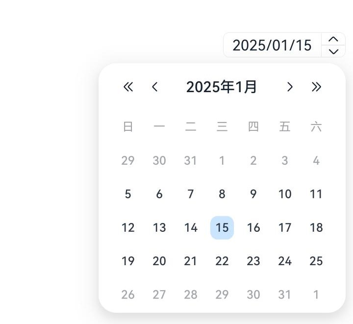

# CalendarPicker

日历选择器组件，提供下拉日历弹窗，可以让用户选择日期。

>  **说明：**
>
> - 该组件从API version 10开始支持。后续版本如有新增内容，则采用上角标单独标记该内容的起始版本。
>
> - 该组件不支持在Wearable设备上使用。


## 子组件

无

## 接口

CalendarPicker(options?: CalendarOptions)

日历选择器。

**原子化服务API：** 从API version 11开始，该接口支持在原子化服务中使用。

**系统能力：** SystemCapability.ArkUI.ArkUI.Full

**参数：** 

| 参数名  | 类型                                        | 必填 | 说明                       |
| ------- | ------------------------------------------- | ---- | -------------------------- |
| options | [CalendarOptions](#calendaroptions对象说明) | 否   | 配置日历选择器组件的参数。 |

## 属性

除支持[通用属性](ts-component-general-attributes.md)外，还支持以下属性：

### edgeAlign

edgeAlign(alignType: CalendarAlign, offset?: Offset)

设置选择器与入口组件的对齐方式。

**原子化服务API：** 从API version 11开始，该接口支持在原子化服务中使用。

**系统能力：** SystemCapability.ArkUI.ArkUI.Full

**参数：** 

| 参数名    | 类型                                    | 必填 | 说明                                                         |
| --------- | --------------------------------------- | ---- | ------------------------------------------------------------ |
| alignType | [CalendarAlign](#calendaralign枚举说明) | 是   | 对齐方式类型。<br/>默认值：CalendarAlign.END                 |
| offset    | [Offset](ts-types.md#offset)            | 否   | 按照对齐类型对齐后，选择器相对入口组件的偏移量。<br/>默认值：{dx: 0, dy: 0} |

### edgeAlign<sup>18+</sup>

edgeAlign(alignType: Optional\<CalendarAlign>, offset?: Offset)

设置选择器与入口组件的对齐方式。与[edgeAlign](#edgealign)相比，alignType参数新增了对undefined类型的支持。

**原子化服务API：** 从API version 18开始，该接口支持在原子化服务中使用。

**系统能力：** SystemCapability.ArkUI.ArkUI.Full

**参数：** 

| 参数名    | 类型                                                         | 必填 | 说明                                                         |
| --------- | ------------------------------------------------------------ | ---- | ------------------------------------------------------------ |
| alignType | [Optional](ts-universal-attributes-custom-property.md#optional12)\<[CalendarAlign](#calendaralign枚举说明)> | 是   | 对齐方式类型。<br/>当alignType的值为undefined时，默认值：CalendarAlign.END |
| offset    | [Offset](ts-types.md#offset)                                 | 否   | 按照对齐类型对齐后，选择器相对入口组件的偏移量。<br/>默认值：{dx: 0, dy: 0} |

### textStyle

textStyle(value: PickerTextStyle)

入口区的文本颜色、字号、字体粗细。

**原子化服务API：** 从API version 11开始，该接口支持在原子化服务中使用。

**系统能力：** SystemCapability.ArkUI.ArkUI.Full

**参数：** 

| 参数名 | 类型                                                         | 必填 | 说明                                                         |
| ------ | ------------------------------------------------------------ | ---- | ------------------------------------------------------------ |
| value  | [PickerTextStyle](./ts-basic-components-datepicker.md#pickertextstyle10类型说明) | 是   | 设置入口区的文本颜色、字号、字体粗细。<br/>默认值：<br/>{<br/>color: '#ff182431',<br/>font: {<br/>size: '16fp', <br/>weight: FontWeight.Regular<br/>}<br/>} |

### textStyle<sup>18+</sup>

textStyle(style: Optional\<PickerTextStyle>)

入口区的文本颜色、字号、字体粗细。与[textStyle](#textstyle)相比，style参数新增了对undefined类型的支持。

**原子化服务API：** 从API version 18开始，该接口支持在原子化服务中使用。

**系统能力：** SystemCapability.ArkUI.ArkUI.Full

**参数：** 

| 参数名 | 类型                                                         | 必填 | 说明                                                         |
| ------ | ------------------------------------------------------------ | ---- | ------------------------------------------------------------ |
| style  | [Optional](ts-universal-attributes-custom-property.md#optional12)\<[PickerTextStyle](./ts-basic-components-datepicker.md#pickertextstyle10类型说明)> | 是   | 设置入口区的文本颜色、字号、字体粗细。<br/>当style的值为undefined时，默认值：<br/>{<br/>color: '#ff182431',<br/>font: {<br/>size: '16fp', <br/>weight: FontWeight.Regular<br/>}<br/>} |

## 事件

除支持[通用事件](ts-component-general-events.md)，还支持以下事件：

### onChange

onChange(callback: Callback\<Date>)

选择日期时触发该事件。不能通过双向绑定的状态变量触发。

**原子化服务API：** 从API version 11开始，该接口支持在原子化服务中使用。

**系统能力：** SystemCapability.ArkUI.ArkUI.Full

**参数：** 

| 参数名 | 类型 | 必填 | 说明           |
| ------ | ---- | ---- | -------------- |
| callback | [Callback](ts-types.md#callback12)\<Date> | 是   | 选中的日期值。 |

### onChange<sup>18+</sup>

onChange(callback: Optional\<Callback\<Date>>)

选择日期时触发该事件。不能通过双向绑定的状态变量触发。与[onChange](#onchange)相比，callback参数新增了对undefined类型的支持。

**原子化服务API：** 从API version 18开始，该接口支持在原子化服务中使用。

**系统能力：** SystemCapability.ArkUI.ArkUI.Full

**参数：** 

| 参数名   | 类型                                                         | 必填 | 说明                                                         |
| -------- | ------------------------------------------------------------ | ---- | ------------------------------------------------------------ |
| callback | [Optional](ts-universal-attributes-custom-property.md#optional12)\<[Callback](ts-types.md#callback12)\<Date>> | 是   | 选中的日期值。<br>当callback的值为undefined时，不使用回调函数。 |

##  CalendarOptions对象说明

日历选择器组件的参数说明。

**原子化服务API：** 从API version 11开始，该接口支持在原子化服务中使用。

**系统能力：** SystemCapability.ArkUI.ArkUI.Full

| 名称      | 类型       | 必填        | 说明                            |
| ----------- | ---------- | ------| --------------------------------- |
| hintRadius | number \| [Resource](ts-types.md#resource) | 否    | 描述日期选中态底板样式。<br />取值范围：[0, 16]<br />单位：vp<br/>默认值：底板样式为圆形。<br />**说明：**<br />当hintRadius为0时，底板样式为直角矩形。当hintRadius的值在0到16之间时，底板样式为圆角矩形。当hintRadius大于或等于16时，底板样式为圆形。 |
| selected | Date | 否    | 设置选中项的日期。选中的日期未设置或日期格式不符合规范则为默认值。<br/>默认值：当前系统日期。 |
| start<sup>18+</sup> | Date | 否    | 设置开始日期。 |
| end<sup>18+</sup> | Date | 否    | 设置结束日期。 |

**start和end设置规则：**

| 场景   | 说明  |
| -------- |  ------------------------------------------------------------ |
| start日期晚于end日期    | start日期、end日期都设置无效，选中日期为默认值  |
| 选中日期早于start日期    | 选中日期为start日期  |
| 选中日期晚于end日期    | 选中日期为end日期  |
| start日期晚于当前系统日期，选中日期未设置    | 选中日期为start日期  |
| end日期早于当前系统日期，选中日期未设置    | 选中日期为end日期  |
| 日期格式不符合规范，如‘1999-13-32’ | start日期或end日期设置无效，选中日期取默认值  |

## CalendarAlign枚举说明

对齐方式类型。

**原子化服务API：** 从API version 11开始，该接口支持在原子化服务中使用。

**系统能力：** SystemCapability.ArkUI.ArkUI.Full

| 名称   | 说明                     |
| ------ | ------------------------ |
| START  | 设置选择器与入口组件左对齐的对齐方式。   |
| CENTER | 设置选择器与入口组件居中对齐的对齐方式。 |
| END    | 设置选择器与入口组件右对齐的对齐方式。   |

## 示例
### 示例1（设置下拉日历弹窗）

该示例实现了日历选择器组件，提供下拉日历弹窗。

```ts
// xxx.ets
@Entry
@Component
struct CalendarPickerExample {
  private selectedDate: Date = new Date('2024-03-05');

  build() {
    Column() {
      Column() {
        CalendarPicker({ hintRadius: 10, selected: this.selectedDate })
          .edgeAlign(CalendarAlign.END)
          .textStyle({ color: "#ff182431", font: { size: 20, weight: FontWeight.Normal } })
          .margin(10)
          .onChange((value) => {
            console.info("CalendarPicker onChange:" + JSON.stringify(value));
          })
      }.alignItems(HorizontalAlign.End).width("100%")

      Text('日历日期选择器').fontSize(30)
    }.width('100%').margin({ top: 350 })
  }
}
```


### 示例2（设置开始日期和结束日期）

该示例通过start和end设置日历选择器的开始日期和结束日期。

```ts
// xxx.ets
@Entry
@Component
struct CalendarPickerExample {
  private selectedDate: Date = new Date('2025-01-15');
  private startDate: Date = new Date('2025-01-05');
  private endDate: Date = new Date('2025-01-25');

  build() {
    Column() {
      Column() {
        CalendarPicker({ hintRadius: 10, selected: this.selectedDate, start: this.startDate, end: this.endDate })
          .edgeAlign(CalendarAlign.END)
          .textStyle({ color: "#ff182431", font: { size: 20, weight: FontWeight.Normal } })
          .margin(10)
          .onChange((value) => {
            console.info("CalendarPicker onChange:" + JSON.stringify(value));
          })
      }.alignItems(HorizontalAlign.End).width("100%")
    }.width('100%').margin({ top: 350 })
  }
}
```


