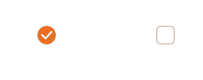
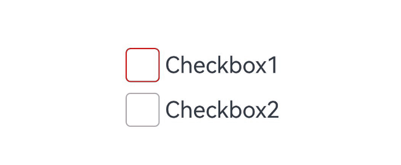
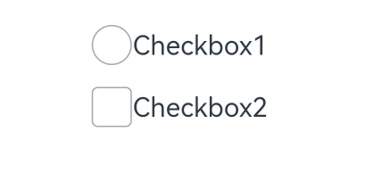

# Checkbox

提供多选框组件，通常用于某选项的打开或关闭。

>  **说明：**
>
>  API version 11开始，Checkbox默认样式由圆角方形变为圆形。
>
>  该组件从API Version 8开始支持。后续版本如有新增内容，则采用上角标单独标记该内容的起始版本。

## 子组件

无

## 接口

Checkbox(options?: CheckboxOptions)

多选框组件。

**卡片能力：** 从API version 9开始，该接口支持在ArkTS卡片中使用。

**原子化服务API：** 从API version 11开始，该接口支持在原子化服务中使用。

**系统能力：** SystemCapability.ArkUI.ArkUI.Full

**参数：** 

| 参数名  | 类型                                        | 必填 | 说明               |
| ------- | ------------------------------------------- | ---- | ------------------ |
| options | [CheckboxOptions](#checkboxoptions对象说明) | 否   | 配置复选框的参数。 |

## CheckboxOptions对象说明

**系统能力：** SystemCapability.ArkUI.ArkUI.Full

| 名称  | 类型 | 必填  | 说明 |
| --------| --------| ------ | -------- |
| name    | string | 否 | 用于指定多选框名称。 <br/>**卡片能力：** 从API version 9开始，该接口支持在ArkTS卡片中使用。<br/>**原子化服务API：** 从API version 11开始，该接口支持在原子化服务中使用。 |
| group   | string | 否 | 用于指定多选框所属群组的名称（即所属CheckboxGroup的名称）。<br/>**说明：** <br/>未配合使用[CheckboxGroup](ts-basic-components-checkboxgroup.md)组件时，此值无用。 <br/>**卡片能力：** 从API version 9开始，该接口支持在ArkTS卡片中使用。<br/>**原子化服务API：** 从API version 11开始，该接口支持在原子化服务中使用。 |
| indicatorBuilder<sup>12+</sup> | [CustomBuilder](ts-types.md#custombuilder8) | 否 | 配置多选框的选中样式为自定义组件。自定义组件与Checkbox组件为中心点对齐显示。indicatorBuilder设置为undefined/null时，默认为indicatorBuilder未设置状态。<br/>**原子化服务API：** 从API version 12开始，该接口支持在原子化服务中使用。|

## 属性

除支持[通用属性](ts-component-general-attributes.md)外，还支持以下属性：

### select

select(value: boolean)

设置多选框是否选中。

从API version 10开始，该属性支持[$$](../../../quick-start/arkts-two-way-sync.md)双向绑定变量。

**卡片能力：** 从API version 9开始，该接口支持在ArkTS卡片中使用。

**原子化服务API：** 从API version 11开始，该接口支持在原子化服务中使用。

**系统能力：** SystemCapability.ArkUI.ArkUI.Full

**参数：** 

| 参数名 | 类型    | 必填 | 说明                                                         |
| ------ | ------- | ---- | ------------------------------------------------------------ |
| value  | boolean | 是   | 多选框是否选中。<br/>默认值：false<br/>值为true时，多选框被选中。值为false时，多选框不被选中。 |

### select<sup>18+</sup>

select(isSelected: Optional\<boolean>)

设置多选框是否选中。与[select](#select)相比，isSelected参数新增了对undefined类型的支持。

该属性支持[$$](../../../quick-start/arkts-two-way-sync.md)双向绑定变量。

**卡片能力：** 从API version 18开始，该接口支持在ArkTS卡片中使用。

**原子化服务API：** 从API version 18开始，该接口支持在原子化服务中使用。

**系统能力：** SystemCapability.ArkUI.ArkUI.Full

**参数：** 

| 参数名     | 类型                                                         | 必填 | 说明                                                         |
| ---------- | ------------------------------------------------------------ | ---- | ------------------------------------------------------------ |
| isSelected | [Optional](ts-universal-attributes-custom-property.md#optional12)\<boolean> | 是   | 多选框是否选中。<br/>当isSelected的值为undefined时取默认值false。<br/>值为true时，多选框被选中。值为false时，多选框不被选中。 |

### selectedColor

selectedColor(value: ResourceColor)

设置多选框选中状态颜色。

**卡片能力：** 从API version 9开始，该接口支持在ArkTS卡片中使用。

**原子化服务API：** 从API version 11开始，该接口支持在原子化服务中使用。

**系统能力：** SystemCapability.ArkUI.ArkUI.Full

**参数：** 

| 参数名 | 类型                                       | 必填 | 说明                                                         |
| ------ | ------------------------------------------ | ---- | ------------------------------------------------------------ |
| value  | [ResourceColor](ts-types.md#resourcecolor) | 是   | 多选框选中状态颜色。<br/>默认值：$r('sys.color.ohos_id_color_text_primary_activated')。<br/>异常值按照默认值处理。 |

### selectedColor<sup>18+</sup>

selectedColor(resColor: Optional\<ResourceColor>)

设置多选框选中状态颜色。与[selectedColor](#selectedcolor)相比，resColor参数新增了对undefined类型的支持。

**卡片能力：** 从API version 18开始，该接口支持在ArkTS卡片中使用。

**原子化服务API：** 从API version 18开始，该接口支持在原子化服务中使用。

**系统能力：** SystemCapability.ArkUI.ArkUI.Full

**参数：** 

| 参数名   | 类型                                                         | 必填 | 说明                                                         |
| -------- | ------------------------------------------------------------ | ---- | ------------------------------------------------------------ |
| resColor | [Optional](ts-universal-attributes-custom-property.md#optional12)\<[ResourceColor](ts-types.md#resourcecolor)> | 是   | 多选框选中状态颜色。<br/>当resColor的值为undefined时，默认值：$r('sys.color.ohos_id_color_text_primary_activated')。<br/>异常值按照默认值处理。 |

### unselectedColor<sup>10+</sup>

unselectedColor(value: ResourceColor)

设置多选框非选中状态边框颜色。

**原子化服务API：** 从API version 11开始，该接口支持在原子化服务中使用。

**系统能力：** SystemCapability.ArkUI.ArkUI.Full

**参数：** 

| 参数名 | 类型                                       | 必填 | 说明                     |
| ------ | ------------------------------------------ | ---- | -------------------------- |
| value  | [ResourceColor](ts-types.md#resourcecolor) | 是   | 多选框非选中状态边框颜色。<br/>默认值：$r('sys.color.ohos_id_color_switch_outline_off')。 |

### unselectedColor<sup>18+</sup>

unselectedColor(resColor: Optional\<ResourceColor>)

设置多选框非选中状态边框颜色。与[unselectedColor](#unselectedcolor10)<sup>10+</sup>相比，resColor参数新增了对undefined类型的支持。

**原子化服务API：** 从API version 18开始，该接口支持在原子化服务中使用。

**系统能力：** SystemCapability.ArkUI.ArkUI.Full

**参数：** 

| 参数名   | 类型                                                         | 必填 | 说明                                                         |
| -------- | ------------------------------------------------------------ | ---- | ------------------------------------------------------------ |
| resColor | [Optional](ts-universal-attributes-custom-property.md#optional12)\<[ResourceColor](ts-types.md#resourcecolor)> | 是   | 多选框非选中状态边框颜色。<br/>当resColor的值为undefined时，默认值：$r('sys.color.ohos_id_color_switch_outline_off')。 |

### mark<sup>10+</sup>

mark(value: MarkStyle)

设置多选框内部图标样式。

**原子化服务API：** 从API version 11开始，该接口支持在原子化服务中使用。

**系统能力：** SystemCapability.ArkUI.ArkUI.Full

**参数：** 

| 参数名 | 类型                                         | 必填 | 说明                                                         |
| ------ | -------------------------------------------- | ---- | ------------------------------------------------------------ |
| value  | [MarkStyle](ts-types.md#markstyle10对象说明) | 是   | 多选框内部图标样式。 从API version 12开始，设置了indicatorBuilder时，按照indicatorBuilder中的内容显示。<br/>默认值：{<br/>strokeColor : `$r('sys.color.ohos_id_color_foreground_contrary')`,<br/>strokeWidth: `$r('sys.float.ohos_id_checkbox_stroke_width')`,<br/>size: '20vp'<br/>} |

### mark<sup>18+</sup>

mark(style: Optional\<MarkStyle>)

设置多选框内部图标样式。与[mark](#mark10)<sup>10+</sup>相比，style参数新增了对undefined类型的支持。

**原子化服务API：** 从API version 18开始，该接口支持在原子化服务中使用。

**系统能力：** SystemCapability.ArkUI.ArkUI.Full

**参数：** 

| 参数名 | 类型                                                         | 必填 | 说明                                                         |
| ------ | ------------------------------------------------------------ | ---- | ------------------------------------------------------------ |
| style  | [Optional](ts-universal-attributes-custom-property.md#optional12)\<[MarkStyle](ts-types.md#markstyle10对象说明)> | 是   | 多选框内部图标样式。 设置了indicatorBuilder时，按照indicatorBuilder中的内容显示。<br/>当style的值为undefined时，默认值：{<br/>strokeColor : `$r('sys.color.ohos_id_color_foreground_contrary')`,<br/>strokeWidth: `$r('sys.float.ohos_id_checkbox_stroke_width')`,<br/>size: '20vp'<br/>} |

### shape<sup>11+</sup>

shape(value: CheckBoxShape)

设置CheckBox组件形状, 包括圆形和圆角方形。

**卡片能力：** 从API version 11开始，该接口支持在ArkTS卡片中使用。

**原子化服务API：** 从API version 12开始，该接口支持在原子化服务中使用。

**系统能力：** SystemCapability.ArkUI.ArkUI.Full

**参数：** 

| 参数名 | 类型                                                  | 必填 | 说明                                                         |
| ------ | ----------------------------------------------------- | ---- | ------------------------------------------------------------ |
| value  | [CheckBoxShape](ts-appendix-enums.md#checkboxshape11) | 是   | CheckBox组件形状, 包括圆形和圆角方形。<br/>默认值：CheckBoxShape.CIRCLE |

### shape<sup>18+</sup>

shape(shape: Optional\<CheckBoxShape>)

设置CheckBox组件形状, 包括圆形和圆角方形。与[shape](#shape11)<sup>11+</sup>相比，shape参数新增了对undefined类型的支持。

**卡片能力：** 从API version 18开始，该接口支持在ArkTS卡片中使用。

**原子化服务API：** 从API version 18开始，该接口支持在原子化服务中使用。

**系统能力：** SystemCapability.ArkUI.ArkUI.Full

**参数：** 

| 参数名 | 类型                                                         | 必填 | 说明                                                         |
| ------ | ------------------------------------------------------------ | ---- | ------------------------------------------------------------ |
| shape  | [Optional](ts-universal-attributes-custom-property.md#optional12)\<[CheckBoxShape](ts-appendix-enums.md#checkboxshape11)> | 是   | CheckBox组件形状, 包括圆形和圆角方形。<br/>当shape的值为undefined时，默认值：CheckBoxShape.CIRCLE |

### contentModifier<sup>12+</sup>

contentModifier(modifier: ContentModifier\<CheckBoxConfiguration>)

定制CheckBox内容区的方法。

**原子化服务API：** 从API version 12开始，该接口支持在原子化服务中使用。

**系统能力：** SystemCapability.ArkUI.ArkUI.Full

**参数：**

| 参数名 | 类型                                          | 必填 | 说明                                             |
| ------ | --------------------------------------------- | ---- | ------------------------------------------------ |
| modifier  | [ContentModifier\<CheckBoxConfiguration>](#checkboxconfiguration12对象说明) | 是   | 在CheckBox组件上，定制内容区的方法。<br/>modifier: 内容修改器，开发者需要自定义class实现ContentModifier接口。 |

### contentModifier<sup>18+</sup>

contentModifier(modifier: Optional<ContentModifier\<CheckBoxConfiguration>>)

定制CheckBox内容区的方法。与[contentModifier](#contentmodifier12)<sup>12+</sup>相比，modifier参数新增了对undefined类型的支持。

**原子化服务API：** 从API version 18开始，该接口支持在原子化服务中使用。

**系统能力：** SystemCapability.ArkUI.ArkUI.Full

**参数：**

| 参数名   | 类型                                                         | 必填 | 说明                                                         |
| -------- | ------------------------------------------------------------ | ---- | ------------------------------------------------------------ |
| modifier | [Optional](ts-universal-attributes-custom-property.md#optional12)\<[ContentModifier\<CheckBoxConfiguration>](#checkboxconfiguration12对象说明)> | 是   | 在CheckBox组件上，定制内容区的方法。<br/>modifier: 内容修改器，开发者需要自定义class实现ContentModifier接口。<br/>当modifier的值为undefined时，不使用内容修改器。 |

## 事件

支持[通用事件](ts-component-general-events.md)外，还支持以下事件：

### onChange

onChange(callback: Optional\<OnCheckboxChangeCallback>)

当选中状态发生变化时，触发该回调。

**卡片能力：** 从API version 9开始，该接口支持在ArkTS卡片中使用。

**原子化服务API：** 从API version 11开始，该接口支持在原子化服务中使用。

**系统能力：** SystemCapability.ArkUI.ArkUI.Full

**参数：** 

| 参数名   | 类型                                                    | 必填 | 说明             |
| -------- | ------------------------------------------------------- | ---- | ---------------- |
| callback | [OnCheckboxChangeCallback](#oncheckboxchangecallback18) | 是   | 返回选中的状态。 |

### onChange<sup>18+</sup>

onChange(callback: Optional\<OnCheckboxChangeCallback>)

当选中状态发生变化时，触发该回调。与[onChange](#onchange)相比，callback参数新增了对undefined类型的支持。

**卡片能力：** 从API version 18开始，该接口支持在ArkTS卡片中使用。

**原子化服务API：** 从API version 18开始，该接口支持在原子化服务中使用。

**系统能力：** SystemCapability.ArkUI.ArkUI.Full

**参数：** 

| 参数名   | 类型                                                         | 必填 | 说明                                                         |
| -------- | ------------------------------------------------------------ | ---- | ------------------------------------------------------------ |
| callback | [Optional](ts-universal-attributes-custom-property.md#optional12)\<[OnCheckboxChangeCallback](#oncheckboxchangecallback18)> | 是   | 返回选中的状态。<br/>当callback的值为undefined时，不使用回调函数。 |

## OnCheckboxChangeCallback<sup>18+</sup>

type OnCheckboxChangeCallback  = (value: boolean) => void

选中的状态。

**卡片能力：** 从API version 18开始，该接口支持在ArkTS卡片中使用。

**原子化服务API：** 从API version 18开始，该接口支持在原子化服务中使用。

**系统能力：** SystemCapability.ArkUI.ArkUI.Full

**参数：** 

| 参数名 | 类型    | 必填 | 说明                                              |
| ------ | ------- | ---- | ------------------------------------------------- |
| value  | boolean | 是   | 返回true时，表示已选中。返回false时，表示未选中。 |

## CheckBoxConfiguration<sup>12+</sup>对象说明

开发者需要自定义class实现ContentModifier接口。

**原子化服务API：** 从API version 12开始，该接口支持在原子化服务中使用。

**系统能力：** SystemCapability.ArkUI.ArkUI.Full

| 名称 | 类型    |    只读    |    可选      |  说明              |
| ------ | ------ | ------ |-------------------------------- |-------------------------------- |
| name | string | 否 | 否 |当前多选框名称。 |
| selected | boolean| 否 | 否 | 指示多选框是否被选中。</br>如果select属性没有设置默认值是false。</br>如果设置select属性，此值与设置select属性的值相同。 |
| triggerChange |Callback\<boolean>| 否 | 否 |触发多选框选中状态变化。<br/>为true时，表示从未选中变为选中。为false时，表示从选中变为未选中。 |

## 示例

### 示例1（设置多选框形状）

该示例通过配置CheckBoxShape实现圆形和圆角方形多选框样式。

```ts
// xxx.ets
@Entry
@Component
struct CheckboxExample {
  build() {
    Flex({ justifyContent: FlexAlign.SpaceEvenly }) {
      Checkbox({ name: 'checkbox1', group: 'checkboxGroup' })
        .select(true)
        .selectedColor(0xed6f21)
        .shape(CheckBoxShape.CIRCLE)
        .onChange((value: boolean) => {
          console.info('Checkbox1 change is' + value)
        })
      Checkbox({ name: 'checkbox2', group: 'checkboxGroup' })
        .select(false)
        .selectedColor(0x39a2db)
        .shape(CheckBoxShape.ROUNDED_SQUARE)
        .onChange((value: boolean) => {
          console.info('Checkbox2 change is' + value)
        })
    }
  }
}
```




### 示例2（设置多选框颜色）

该示例通过配置mark实现自定义多选框的颜色。

```ts
// xxx.ets
@Entry
@Component
struct Index {

  build() {
    Row() {
      Column() {
        Flex({ justifyContent: FlexAlign.Center, alignItems: ItemAlign.Center }) {
          Checkbox({ name: 'checkbox1', group: 'checkboxGroup' })
            .selectedColor(0x39a2db)
            .shape(CheckBoxShape.ROUNDED_SQUARE)
            .onChange((value: boolean) => {
              console.info('Checkbox1 change is'+ value)
            })
            .mark({
              strokeColor:Color.Black,
              size: 50,
              strokeWidth: 5
            })
            .unselectedColor(Color.Red)
            .width(30)
            .height(30)
          Text('Checkbox1').fontSize(20)
        }
        Flex({ justifyContent: FlexAlign.Center, alignItems: ItemAlign.Center }) {
          Checkbox({ name: 'checkbox2', group: 'checkboxGroup' })
            .selectedColor(0x39a2db)
            .shape(CheckBoxShape.ROUNDED_SQUARE)
            .onChange((value: boolean) => {
              console.info('Checkbox2 change is' + value)
            })
            .width(30)
            .height(30)
          Text('Checkbox2').fontSize(20)
        }
      }
      .width('100%')
    }
    .height('100%')
  }
}
```




### 示例3（自定义多选框样式）
该示例实现了自定义复选框样式的功能，自定义样式实现了一个五边形复选框，如果选中，内部会出现红色三角图案，标题会显示选中字样，如果取消选中，红色三角图案消失，标题会显示非选中字样。

```ts
// xxx.ets
class MyCheckboxStyle implements ContentModifier<CheckBoxConfiguration> {
  selectedColor: Color = Color.White
  constructor(selectedColor: Color) {
    this.selectedColor = selectedColor;
  }
  applyContent() : WrappedBuilder<[CheckBoxConfiguration]>
  {
    return wrapBuilder(buildCheckbox)
  }
}

@Builder function buildCheckbox(config: CheckBoxConfiguration) {
  Column({space:10}) {
      Text(config.name  + (config.selected ? "（ 选中 ）" : "（ 非选中 ）")).margin({right : 70, top : 50})
      Text(config.enabled ? "enabled true" : "enabled false").margin({right : 110})
      Shape() {
        Path().width(100).height(100).commands('M100 0 L0 100 L50 200 L150 200 L200 100 Z').fillOpacity(0).strokeWidth(3).onClick(()=>{
          if (config.selected) {
            config.triggerChange(false)
          } else {
            config.triggerChange(true)
          }
        }).opacity(config.enabled ? 1 : 0.1)
        Path().width(10).height(10).commands('M50 0 L100 100 L0 100 Z')
          .visibility(config.selected ? Visibility.Visible : Visibility.Hidden)
          .fill(config.selected ? (config.contentModifier as MyCheckboxStyle).selectedColor : Color.Black)
          .stroke((config.contentModifier as MyCheckboxStyle).selectedColor)
          .margin({left:10,top:10})
          .opacity(config.enabled ? 1 : 0.1)
      }
      .width(300)
      .height(200)
      .viewPort({ x: 0, y: 0, width: 310, height: 310 })
      .strokeLineJoin(LineJoinStyle.Miter)
      .strokeMiterLimit(5)
      .margin({left:50})
  }
}

@Entry
@Component
struct Index {
  @State checkboxEnabled: boolean = true;
  build() {
    Column({ space: 100 }) {
        Checkbox({ name: '复选框状态', group: 'checkboxGroup' })
        .contentModifier(new MyCheckboxStyle(Color.Red))
        .onChange((value: boolean) => {
          console.info('Checkbox change is' + value)
        }).enabled(this.checkboxEnabled)

      Row() {
        Toggle({ type: ToggleType.Switch, isOn: true }).onChange((value: boolean) => {
          if (value) {
            this.checkboxEnabled = true
          } else {
            this.checkboxEnabled = false
          }
        })
      }.position({ x: 50, y: 130 })
    }.margin({top : 30})
  }
}
```


### 示例4（设置文本多选框样式）
该示例通过配置indicatorBuilder实现选中样式为Text。
```ts
// xxx.ets
@Entry
@Component
struct CheckboxExample {
  @Builder
  indicatorBuilder(value: number) {
    Column(){
      Text(value > 99 ? '99+': value.toString())
        .textAlign(TextAlign.Center)
        .fontSize(value > 99 ?  '16vp': '20vp')
        .fontWeight(FontWeight.Medium)
        .fontColor('#ffffffff')
    }
  }
  build() {
    Row() {
      Column() {
        Flex({ justifyContent: FlexAlign.Center, alignItems: ItemAlign.Center}) {
          Checkbox({ name: 'checkbox1', group: 'checkboxGroup', indicatorBuilder:()=>{this.indicatorBuilder(9)}})
            .shape(CheckBoxShape.CIRCLE)
            .onChange((value: boolean) => {
              console.info('Checkbox1 change is'+ value)
            })
            .mark({
              strokeColor:Color.Black,
              size: 50,
              strokeWidth: 5
            })
            .width(30)
            .height(30)
          Text('Checkbox1').fontSize(20)
        }.padding(15)
        Flex({ justifyContent: FlexAlign.Center, alignItems: ItemAlign.Center }) {
          Checkbox({ name: 'checkbox2', group: 'checkboxGroup', indicatorBuilder:()=>{this.indicatorBuilder(100)}})
            .shape(CheckBoxShape.ROUNDED_SQUARE)
            .onChange((value: boolean) => {
              console.info('Checkbox2 change is' + value)
            })
            .width(30)
            .height(30)
          Text('Checkbox2').fontSize(20)
        }
      }
      .width('100%')
    }
    .height('100%')
  }
}
```


