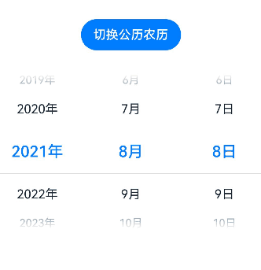
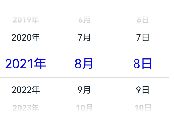
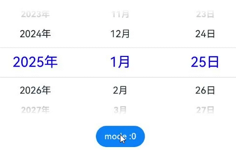

# DatePicker

日期选择器组件，用于根据指定日期范围创建日期滑动选择器。

>  **说明：**
>
> - 该组件从API version 8开始支持。后续版本如有新增内容，则采用上角标单独标记该内容的起始版本。
>
> - 该组件不建议开发者在动效过程中修改属性数据。


## 子组件

无


## 接口

DatePicker(options?: DatePickerOptions)

根据指定范围的Date创建可以选择日期的滑动选择器。

**原子化服务API：** 从API version 11开始，该接口支持在原子化服务中使用。

**系统能力：** SystemCapability.ArkUI.ArkUI.Full

**参数：**

| 参数名  | 类型                                            | 必填 | 说明                       |
| ------- | ----------------------------------------------- | ---- | -------------------------- |
| options | [DatePickerOptions](#datepickeroptions对象说明) | 否   | 配置日期选择器组件的参数。 |

## DatePickerOptions对象说明

日期选择器组件的参数说明。

**原子化服务API：** 从API version 11开始，该接口支持在原子化服务中使用。

**系统能力：** SystemCapability.ArkUI.ArkUI.Full

| 名称     | 类型 | 只读 | 可选 | 说明                                                         |
| -------- | ---- | ---- | ------------------------------------------------------------ | ------------------------------------------------------------ |
| start    | Date | 否  | 是  | 指定选择器的起始日期。<br/>默认值：Date('1970-1-1')          |
| end      | Date | 否  | 是  | 指定选择器的结束日期。<br/>默认值：Date('2100-12-31')        |
| selected | Date | 否  | 是  | 设置选中项的日期。<br/>默认值：当前系统日期<br />从API version 10开始，该参数支持[$$](../../../ui/state-management/arkts-two-way-sync.md)双向绑定变量。 |
| mode<sup>18+</sup> | [DatePickerMode](#datepickermode18枚举说明) | 否  | 是  | 设置[DatePicker](#datepicker)显示的日期选项列。<br/>默认值：DatePickerMode.DATE，日期列显示年、月、日三列。 小数值做取整处理。<br/>在DatePickerDialog中，当showTime=true时，此参数不生效，显示默认年月日三列。<br />**原子化服务API：** 从API version 18开始，该接口支持在原子化服务中使用。 |

>  **说明：**
>
>  Date的使用请参考[TimePickerOptions](ts-basic-components-timepicker.md)。  
>  在[DatePicker](#datepicker)组件滑动过程中修改DatePickerOptions中的属性（start、end、selected、mode），会导致这些属性无法生效。


## DatePickerMode<sup>18+</sup>枚举说明

设置要显示的日期选项列。

**原子化服务API：** 从API version 18开始，该类型支持在原子化服务中使用。

**系统能力：** SystemCapability.ArkUI.ArkUI.Full

| 名称 | 值 | 说明 |
| -------- | - |-------- |
| DATE | 0 | 日期列显示年、月、日三列。|
| YEAR_AND_MONTH | 1 | 日期列显示年、月二列。|
| MONTH_AND_DAY | 2 | 日期列显示月、日二列。<br/>此模式下，如果月份从12月变化到1月，年份不增加1年；如果月份从1月变化到12月，年份不减少1年；年份始终在当前设置的年份。|

**异常情形说明：**

| 异常情形   | 对应结果  |
| -------- |  ------------------------------------------------------------ |
| 起始日期晚于结束日期，选中日期未设置    | 起始日期、结束日期和选中日期都为默认值  |
| 起始日期晚于结束日期，选中日期早于起始日期默认值    | 起始日期、结束日期都为默认值，选中日期为起始日期默认值  |
| 起始日期晚于结束日期，选中日期晚于结束日期默认值    | 起始日期、结束日期都为默认值，选中日期为结束日期默认值  |
| 起始日期晚于结束日期，选中日期在起始日期与结束日期默认值范围内    | 起始日期、结束日期都为默认值，选中日期为设置的值 |
| 选中日期早于起始日期    | 选中日期为起始日期  |
| 选中日期晚于结束日期    | 选中日期为结束日期  |
| 起始日期晚于当前系统日期，选中日期未设置    | 选中日期为起始日期  |
| 结束日期早于当前系统日期，选中日期未设置    | 选中日期为结束日期  |
| 日期格式不符合规范，如‘1999-13-32’   | 取默认值  |
| 起始日期或结束日期早于系统有效范围    | 起始日期或结束日期取起始日期默认值 |
| 起始日期或结束日期晚于系统有效范围    | 起始日期或结束日期取结束日期默认值 |
| 起始日期与结束日期同时早于系统有效范围 | 起始日期与结束日期取系统有效范围最早日期 |
| 起始日期与结束日期同时晚于系统有效范围 | 起始日期与结束日期取系统有效范围最晚日期 |

系统日期范围：1900-1-31 ~ 2100-12-31

选中日期会在起始日期与结束日期异常处理完成后再进行异常情形判断处理

## 属性

除支持[通用属性](ts-component-general-attributes.md)外，还支持以下属性：

### lunar

lunar(value: boolean)

设置弹窗的日期是否显示农历。

**原子化服务API：** 从API version 11开始，该接口支持在原子化服务中使用。

**系统能力：** SystemCapability.ArkUI.ArkUI.Full

**参数：** 

| 参数名 | 类型    | 必填 | 说明                                                         |
| ------ | ------- | ---- | ------------------------------------------------------------ |
| value  | boolean | 是   | 日期是否显示农历。<br/>-&nbsp;true：展示农历。<br/>-&nbsp;false：不展示农历。<br/>默认值：false |

### lunar<sup>18+</sup>

lunar(isLunar: Optional\<boolean>)

设置弹窗的日期是否显示农历。与[lunar](#lunar)相比，isLunar参数新增了对undefined类型的支持。

**原子化服务API：** 从API version 18开始，该接口支持在原子化服务中使用。

**系统能力：** SystemCapability.ArkUI.ArkUI.Full

**参数：**

| 参数名 | 类型    | 必填 | 说明                                                         |
| ------ | ------- | ---- | ------------------------------------------------------------ |
| isLunar | [Optional](ts-universal-attributes-custom-property.md#optionalt12)\<boolean> | 是   | 日期是否显示农历。<br/>-&nbsp;true：展示农历。<br/>-&nbsp;false：不展示农历。<br/>当isLunar的值为undefined时，默认值：false |

### disappearTextStyle<sup>10+</sup>

disappearTextStyle(value: PickerTextStyle)

设置过渡项（以选中项为基准向上或向下的第二项）的文本样式。

**原子化服务API：** 从API version 11开始，该接口支持在原子化服务中使用。

**系统能力：** SystemCapability.ArkUI.ArkUI.Full

**参数：** 

| 参数名 | 类型                                          | 必填 | 说明                                                         |
| ------ | --------------------------------------------- | ---- | ------------------------------------------------------------ |
| value  | [PickerTextStyle](#pickertextstyle10类型说明) | 是   | 过渡项的文本颜色、字号、字体粗细。<br/>默认值：<br/>{<br/>color: '#ff182431',<br/>font: {<br/>size: '14fp', <br/>weight: FontWeight.Regular<br/>}<br/>} |

### disappearTextStyle<sup>18+</sup>

disappearTextStyle(style: Optional\<PickerTextStyle>)

设置过渡项的文本样式。与[disappearTextStyle](#disappeartextstyle10)<sup>10+</sup>相比，style参数新增了对undefined类型的支持。

**原子化服务API：** 从API version 18开始，该接口支持在原子化服务中使用。

**系统能力：** SystemCapability.ArkUI.ArkUI.Full

**参数：**

| 参数名 | 类型                                                         | 必填 | 说明                                                         |
| ------ | ------------------------------------------------------------ | ---- | ------------------------------------------------------------ |
| style  | [Optional](ts-universal-attributes-custom-property.md#optionalt12)\<[PickerTextStyle](#pickertextstyle10类型说明)> | 是   | 过渡项的文本颜色、字号、字体粗细。<br/>当style的值为undefined时，默认值：<br/>{<br/>color: '#ff182431',<br/>font: {<br/>size: '14fp', <br/>weight: FontWeight.Regular<br/>}<br/>} |

>  **说明：**
>
> 若选中项向上或向下的可视项数低于两项则无对应过渡项。

### textStyle<sup>10+</sup>

textStyle(value: PickerTextStyle)

设置一般项（以选中项为基准向上或向下的第一项）的文本样式。

**原子化服务API：** 从API version 11开始，该接口支持在原子化服务中使用。

**系统能力：** SystemCapability.ArkUI.ArkUI.Full

**参数：** 

| 参数名 | 类型                                          | 必填 | 说明                                                         |
| ------ | --------------------------------------------- | ---- | ------------------------------------------------------------ |
| value  | [PickerTextStyle](#pickertextstyle10类型说明) | 是   | 一般项的文本颜色、字号、字体粗细。<br/>默认值：<br/>{<br/>color: '#ff182431',<br/>font: {<br/>size: '16fp', <br/>weight: FontWeight.Regular<br/>}<br/>} |

### textStyle<sup>18+</sup>

textStyle(style: Optional\<PickerTextStyle>)

设置一般项的文本样式。与[textStyle](#textstyle10)<sup>10+</sup>相比，style参数新增了对undefined类型的支持。

**原子化服务API：** 从API version 18开始，该接口支持在原子化服务中使用。

**系统能力：** SystemCapability.ArkUI.ArkUI.Full

**参数：**

| 参数名 | 类型                                          | 必填 | 说明                                                         |
| ------ | --------------------------------------------- | ---- | ------------------------------------------------------------ |
| style | [Optional](ts-universal-attributes-custom-property.md#optionalt12)\<[PickerTextStyle](#pickertextstyle10类型说明)> | 是   | 一般项的文本颜色、字号、字体粗细。<br/>当style的值为undefined时，默认值：<br/>{<br/>color: '#ff182431',<br/>font: {<br/>size: '16fp', <br/>weight: FontWeight.Regular<br/>}<br/>} |

>  **说明：**
>
> 若选中项向上或向下可视项数低于一项则无对应一般项。

### selectedTextStyle<sup>10+</sup>

selectedTextStyle(value: PickerTextStyle)

设置选中项的文本样式。

**原子化服务API：** 从API version 11开始，该接口支持在原子化服务中使用。

**系统能力：** SystemCapability.ArkUI.ArkUI.Full

**参数：** 

| 参数名 | 类型                                          | 必填 | 说明                                                         |
| ------ | --------------------------------------------- | ---- | ------------------------------------------------------------ |
| value  | [PickerTextStyle](#pickertextstyle10类型说明) | 是   | 选中项的文本颜色、字号、字体粗细。<br/>默认值：<br/>{<br/>color: '#ff007dff',<br/>font: {<br/>size: '20fp', <br/>weight: FontWeight.Medium<br/>}<br/>} |

### selectedTextStyle<sup>18+</sup>

selectedTextStyle(style: Optional\<PickerTextStyle>)

设置选中项的文本样式。与[selectedTextStyle](#selectedtextstyle10)<sup>10+</sup>相比，style参数新增了对undefined类型的支持。

**原子化服务API：** 从API version 18开始，该接口支持在原子化服务中使用。

**系统能力：** SystemCapability.ArkUI.ArkUI.Full

**参数：**

| 参数名 | 类型                                                         | 必填 | 说明                                                         |
| ------ | ------------------------------------------------------------ | ---- | ------------------------------------------------------------ |
| style  | [Optional](ts-universal-attributes-custom-property.md#optionalt12)\<[PickerTextStyle](#pickertextstyle10类型说明)> | 是   | 选中项的文本颜色、字号、字体粗细。<br/>当style的值为undefined时，默认值：<br/>{<br/>color: '#ff007dff',<br/>font: {<br/>size: '20fp', <br/>weight: FontWeight.Medium<br/>}<br/>} |

### enableHapticFeedback<sup>18+</sup>

enableHapticFeedback(enable: Optional\<boolean>)

设置是否开启触控反馈。

**原子化服务API：** 从API version 18开始，该接口支持在原子化服务中使用。

**系统能力：** SystemCapability.ArkUI.ArkUI.Full

| 参数名 | 类型                                          | 必填  | 说明                                                                                  |
| ------ | --------------------------------------------- |-----|-------------------------------------------------------------------------------------|
| enable  | [Optional](ts-universal-attributes-custom-property.md#optionalt12)\<boolean> | 是   | 设置是否开启触控反馈。<br/>默认值：true，true表示开启触控反馈，false表示不开启触控反馈。|

>  **说明：**
>
>  开启触控反馈时，需要在工程的module.json5中配置requestPermissions字段开启振动权限，配置如下：
>  ```json
>  "requestPermissions": [
>  {
>   "name": "ohos.permission.VIBRATE",
>  }
>  ]
>  ```

### digitalCrownSensitivity<sup>18+</sup>
digitalCrownSensitivity(sensitivity: Optional\<CrownSensitivity>)

设置表冠灵敏度。

**原子化服务API：** 从API version 18开始，该接口支持在原子化服务中使用。

**系统能力：** SystemCapability.ArkUI.ArkUI.Full

| 参数名   | 类型                                     | 必填   | 说明                      |
| ----- | ---------------------------------------- | ---- | ------------------------- |
| sensitivity | [Optional](ts-universal-attributes-custom-property.md#optionalt12)\<[CrownSensitivity](ts-appendix-enums.md#crownsensitivity18)> | 是    | 表冠灵敏度。                     |

>  **说明：**
>
>  用于穿戴设备圆形屏幕使用。

## PickerTextStyle<sup>10+</sup>类型说明

选择器组件的文本样式。

**原子化服务API：** 从API version 11开始，该接口支持在原子化服务中使用。

| 名称   | 类型                                     | 只读 | 可选 | 说明                      |
| ----- | ---------------------------------------- | ---- | ------------------------- | ------------------------- |
| color | [ResourceColor](ts-types.md#resourcecolor) | 否   | 是   | 文本颜色。                     |
| font  | [Font](ts-types.md#font)                 | 否   | 是   | 文本样式。 |

## 事件

除支持[通用事件](ts-component-general-events.md)外，还支持以下事件：

### onChange<sup>(deprecated)</sup>

onChange(callback: (value: DatePickerResult) => void)

选择日期时触发该事件。不能通过双向绑定的状态变量触发。

从API version 8 开始支持，从 API version 10 开始废弃，建议使用[onDateChange](#ondatechange10)。

**系统能力：** SystemCapability.ArkUI.ArkUI.Full

**参数：**

| 参数名 | 类型                                          | 必填 | 说明             |
| ------ | --------------------------------------------- | ---- | ---------------- |
| value  | [DatePickerResult](#datepickerresult对象说明) | 是   | 返回选中的时间。 |

### onDateChange<sup>10+</sup>

onDateChange(callback: (value: Date) => void)

选择日期时触发该事件。不能通过双向绑定的状态变量触发。

**原子化服务API：** 从API version 11开始，该接口支持在原子化服务中使用。

**系统能力：** SystemCapability.ArkUI.ArkUI.Full

**参数：** 

| 参数名 | 类型 | 必填 | 说明                                                         |
| ------ | ---- | ---- | ------------------------------------------------------------ |
| value  | Date | 是   | 返回选中的时间，年月日为选中的日期，时分取决于当前系统时间的时分，秒恒为00。 |

### onDateChange<sup>18+</sup>

onDateChange(callback: Optional\<Callback\<Date>>)

选择日期时触发该事件。与[onDateChange](#ondatechange10)<sup>10+</sup>相比，callback参数新增了对undefined类型的支持。

**原子化服务API：** 从API version 18开始，该接口支持在原子化服务中使用。

**系统能力：** SystemCapability.ArkUI.ArkUI.Full

**参数：**

| 参数名   | 类型                                                         | 必填 | 说明                                                         |
| -------- | ------------------------------------------------------------ | ---- | ------------------------------------------------------------ |
| callback | [Optional](ts-universal-attributes-custom-property.md#optionalt12)\<[Callback](ts-types.md#callback12)\<Date>> | 是   | 返回选中的时间，年月日为选中的日期，时分取决于当前系统时间的时分，秒恒为00。<br/>当callback的值为undefined时，不使用回调函数。 |

## DatePickerResult对象说明

日期选择器返回的时间格式。

**原子化服务API：** 从API version 11开始，该接口支持在原子化服务中使用。

**系统能力：** SystemCapability.ArkUI.ArkUI.Full

| 名称  | 类型   | 只读 | 可选 | 说明                                       |
| ----- | ------ | ---- | ---- | ------------------------------------------ |
| year  | number | 否   | 否   | 选中日期的年。<br/>取值范围：与start、end有关，如果没有设置start、end，则取start、end默认值[1970， 2100]。                             |
| month | number | 否   | 否   | 选中日期的月的索引值，索引从0开始，0表示1月，11表示12月。<br/>取值范围：与start、end有关，如果没有设置start、end，取值范围为[0， 11]。 |
| day   | number | 否   | 否   | 选中日期的日。<br/>取值范围：与start、end有关，如果没有设置start、end，取值范围为[1， 31]。                             |

## 示例

### 示例1（切换公历农历）

该示例实现了日期选择器组件，点击按钮可以切换公历农历。


```ts
// xxx.ets
@Entry
@Component
struct DatePickerExample {
  @State isLunar: boolean = false;
  private selectedDate: Date = new Date('2021-08-08');

  build() {
    Column() {
      Button('切换公历农历')
        .margin({ top: 30, bottom: 30 })
        .onClick(() => {
          this.isLunar = !this.isLunar;
        })
      DatePicker({
        start: new Date('1970-1-1'),
        end: new Date('2100-1-1'),
        selected: this.selectedDate
      })
        .lunar(this.isLunar)
        .onDateChange((value: Date) => {
          this.selectedDate = value;
          console.info('select current date is: ' + value.toString());
        })

    }.width('100%')
  }
}
```



### 示例2（设置文本样式）

该示例通过配置[disappearTextStyle](#disappeartextstyle10)、[textStyle](#textstyle10)、[selectedTextStyle](#selectedtextstyle10)设置文本样式。

```ts
// xxx.ets
@Entry
@Component
struct DatePickerExample {
  private selectedDate: Date = new Date('2021-08-08');

  build() {
    Column() {
      DatePicker({
        start: new Date('1970-1-1'),
        end: new Date('2100-1-1'),
        selected: this.selectedDate
      })
        .disappearTextStyle({ color: Color.Gray, font: { size: '16fp', weight: FontWeight.Bold } })
        .textStyle({ color: '#ff182431', font: { size: '18fp', weight: FontWeight.Normal } })
        .selectedTextStyle({ color: '#ff0000FF', font: { size: '26fp', weight: FontWeight.Regular, family: "HarmonyOS Sans", style: FontStyle.Normal } })
        .onDateChange((value: Date) => {
          this.selectedDate = value;
          console.info('select current date is: ' + value.toString());
        })

    }.width('100%')
  }
}
```



### 示例3（设置显示年、月和月、日列）

该示例通过配置mode参数实现显示年、月和月、日列。

```ts
// xxx.ets
@Entry
@Component
struct DatePickerExample {
  @State isLunar: boolean = false;
  private selectedDate: Date = new Date('2025-01-15');
  @State datePickerModeList: (DatePickerMode)[] = [
    DatePickerMode.DATE,
    DatePickerMode.YEAR_AND_MONTH,
    DatePickerMode.MONTH_AND_DAY,
  ];
  @State datePickerModeIndex: number = 0;

  build() {
    Column() {
      Button('切换公历农历')
        .margin({ top: 30, bottom: 30 })
        .onClick(() => {
          this.isLunar = !this.isLunar;
        })
      DatePicker({
        start: new Date('1970-1-1'),
        end: new Date('2100-1-1'),
        selected: this.selectedDate,
        mode:this.datePickerModeList[this.datePickerModeIndex]
      })
        .lunar(this.isLunar)
        .onDateChange((value: Date) => {
          this.selectedDate = value;
          console.info('select current date is: ' + value.toString());
        })

      Button('mode :' + this.datePickerModeIndex).margin({ top: 20 })
        .onClick(() => {
          this.datePickerModeIndex++;
          if(this.datePickerModeIndex >= this.datePickerModeList.length){
            this.datePickerModeIndex = 0;
          }
        })
    }.width('100%')
  }
}
```

