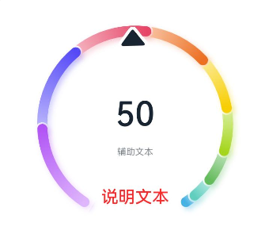
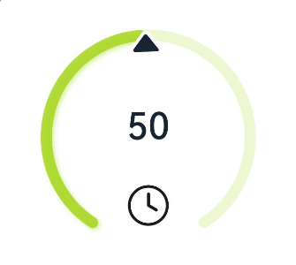
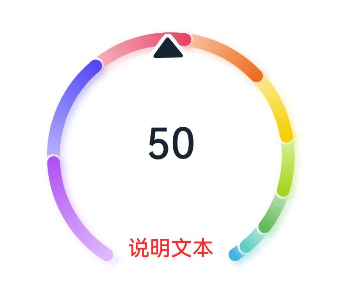
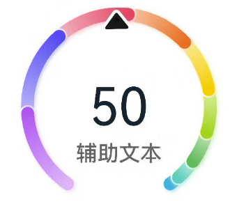
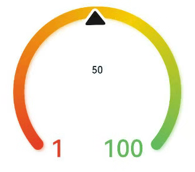
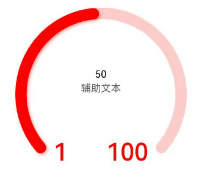
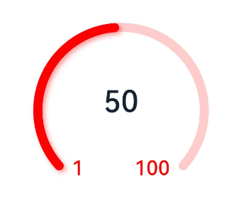
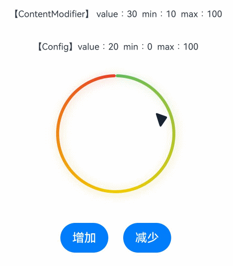
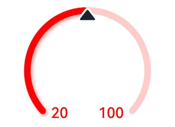

# Gauge

数据量规图表组件，用于将数据展示为环形图表。


>  **说明：**
>
>  该组件从API Version 8开始支持。后续版本如有新增内容，则采用上角标单独标记该内容的起始版本。


## 子组件

可以包含单个子组件。

> **说明：**
>
> 建议使用文本组件构建当前数值文本和辅助文本。
>
> 若子组件宽高为百分比形式，则基准范围为以外圆环做为内切圆的矩形。


## 接口

Gauge(options:{value: number, min?: number, max?: number})

创建数据量规图表组件。

**卡片能力：** 从API version 9开始，该接口支持在ArkTS卡片中使用。

**原子化服务API：** 从API version 11开始，该接口支持在原子化服务中使用。

**系统能力：** SystemCapability.ArkUI.ArkUI.Full

**参数：**

| 参数名 | 类型 | 必填 | 说明 |
| -------- | -------- | -------- | -------- |
| value | number | 是 | 量规图的当前数据值，即图中指针指向位置。用于组件创建时量规图初始值的预置。<br/>**说明：** <br/>value不在min和max范围内时使用min作为默认值。 |
| min | number | 否 | 当前数据段最小值。<br/>默认值：0 |
| max | number | 否 | 当前数据段最大值。<br/>默认值：100<br/>**说明：** <br/>max小于min时使用默认值0和100。<br/>max和min支持负数。 |

## 属性

除支持[通用属性](ts-universal-attributes-size.md)外，还支持以下属性：

### value

value(value: number)

设置量规图的数据值。

**卡片能力：** 从API version 9开始，该接口支持在ArkTS卡片中使用。

**原子化服务API：** 从API version 11开始，该接口支持在原子化服务中使用。

**系统能力：** SystemCapability.ArkUI.ArkUI.Full

**参数：** 

| 参数名 | 类型   | 必填 | 说明                                                         |
| ------ | ------ | ---- | ------------------------------------------------------------ |
| value  | number | 是   | 量规图的数据值，可用于动态修改量规图的数据值。<br/>默认值：0 |

### startAngle

startAngle(angle: number)

设置起始角度位置。

**卡片能力：** 从API version 9开始，该接口支持在ArkTS卡片中使用。

**原子化服务API：** 从API version 11开始，该接口支持在原子化服务中使用。

**系统能力：** SystemCapability.ArkUI.ArkUI.Full

**参数：** 

| 参数名 | 类型   | 必填 | 说明                                                         |
| ------ | ------ | ---- | ------------------------------------------------------------ |
| angle  | number | 是   | 起始角度位置，时钟0点为0度，顺时针方向为正角度。<br/>默认值：0 |

### endAngle

endAngle(angle: number)

设置终止角度位置。起始角度位置和终止角度位置差过小时，会绘制出异常图像，请取合理的起始角度位置和终止角度位置。建议使用单色环改变Gauge的value参数实现数据值的调节，可通过定时器setTimeout进行数值的延迟加载。

**卡片能力：** 从API version 9开始，该接口支持在ArkTS卡片中使用。

**原子化服务API：** 从API version 11开始，该接口支持在原子化服务中使用。

**系统能力：** SystemCapability.ArkUI.ArkUI.Full

**参数：** 

| 参数名 | 类型   | 必填 | 说明                                                         |
| ------ | ------ | ---- | ------------------------------------------------------------ |
| angle  | number | 是   | 终止角度位置，时钟0点为0度，顺时针方向为正角度。<br/>默认值：360 |

### colors

colors(colors: ResourceColor | LinearGradient | Array<[ResourceColor | LinearGradient, number]>)

设置量规图的颜色。

从API version 11开始，该接口使用以下规则：

参数类型为ResourceColor，则圆环类型为单色环。

参数类型为LinearGradient，则圆环类型为渐变环。

参数类型为数组，则圆环类型为分段渐变环，第一个参数为颜色值，若设置为非颜色类型，则置为"0xFFE84026"。第二个参数为颜色所占比重，若设置为负数或是非数值类型，则将比重置为0。

分段渐变环最大显示段数为9段，若多于9段，则多于部分不显示。

**卡片能力：** 从API version 9开始，该接口支持在ArkTS卡片中使用。

**原子化服务API：** 从API version 11开始，该接口支持在原子化服务中使用。

**系统能力：** SystemCapability.ArkUI.ArkUI.Full

**参数：** 

| 参数名 | 类型                                                         | 必填 | 说明                                                         |
| ------ | ------------------------------------------------------------ | ---- | ------------------------------------------------------------ |
| colors | [ResourceColor<sup>11+</sup>](ts-types.md#resourcecolor)&nbsp;\|&nbsp;[LinearGradient<sup>11+</sup>](ts-basic-components-datapanel.md#lineargradient10)&nbsp;\|&nbsp;Array&lt;[[ResourceColor](ts-types.md#resourcecolor)&nbsp;\|&nbsp;[LinearGradient<sup>11+</sup>](ts-basic-components-datapanel.md#lineargradient10)&nbsp;\,&nbsp;number]&gt; | 是   | 量规图的颜色，支持分段颜色设置。<br/>API version 9 默认值：Color.Black<br/>API version 11默认值：<br/>若不传颜色，或者数组为空，无法确定圆环类型及颜色，则圆环颜色为"0xFF64BB5C"、"0xFFF7CE00"、"0xFFE84026"的渐变环。<br/>若传入颜色，但颜色值有误，则该颜色为"0xFFE84026"。<br/>若对应颜色的比重为0，则该颜色在圆环中不显示。若所有颜色比重均为0，圆环不显示。 |

### strokeWidth

strokeWidth(length: Length)

设置环形量规图的环形厚度。

**卡片能力：** 从API version 9开始，该接口支持在ArkTS卡片中使用。

**原子化服务API：** 从API version 11开始，该接口支持在原子化服务中使用。

**系统能力：** SystemCapability.ArkUI.ArkUI.Full

**参数：** 

| 参数名 | 类型                         | 必填 | 说明                                                         |
| ------ | ---------------------------- | ---- | ------------------------------------------------------------ |
| length | [Length](ts-types.md#length) | 是   | 环形量规图的环形厚度。<br/>默认值：4<br/>单位：vp<br/>**说明：** <br/>设置小于0的值时，按默认值显示。<br/>不支持百分比。 |

### description<sup>11+</sup>

description(value: CustomBuilder)

设置说明内容。

**原子化服务API：** 从API version 12开始，该接口支持在原子化服务中使用。

**系统能力：** SystemCapability.ArkUI.ArkUI.Full

**参数：** 

| 参数名 | 类型                                        | 必填 | 说明                                                         |
| ------ | ------------------------------------------- | ---- | ------------------------------------------------------------ |
| value  | [CustomBuilder](ts-types.md#custombuilder8) | 是   | 说明内容。<br/>**说明：** <br/>@Builder中的内容由开发者自定义，建议使用文本或者图片。<br/>若自定义部分的宽高为百分比形式，则基准范围为圆环直径的44.4%*25.4%的矩形（图片为28.6%*28.6%），距离圆环底部0vp，左右居中。<br/>设置null则不显示内容。<br/>不设置则依赖是否设置数据最大最小值。<br/>若设置最大最小值或者只设置其中一个，则显示最大最小值。<br/>若未设置最大最小值，则不显示内容。<br/>最大最小值显示在圆环底部，位置不可移动，若圆环开口角度设置不恰当，存在圆环遮挡文字的情况。 |

### trackShadow<sup>11+</sup>

trackShadow(value: GaugeShadowOptions)

设置阴影样式。

**原子化服务API：** 从API version 12开始，该接口支持在原子化服务中使用。

**系统能力：** SystemCapability.ArkUI.ArkUI.Full

**参数：** 

| 参数名 | 类型                                                | 必填 | 说明                                                         |
| ------ | --------------------------------------------------- | ---- | ------------------------------------------------------------ |
| value  | [GaugeShadowOptions](#gaugeshadowoptions11对象说明) | 是   | 阴影样式。<br/>**说明：** <br/>阴影颜色与圆环颜色一致。<br/>设置null为不开启投影。 |

### indicator<sup>11+</sup>

indicator(value: GaugeIndicatorOptions)

设置指针样式。

**原子化服务API：** 从API version 12开始，该接口支持在原子化服务中使用。

**系统能力：** SystemCapability.ArkUI.ArkUI.Full

**参数：** 

| 参数名 | 类型                                                      | 必填 | 说明                                                  |
| ------ | --------------------------------------------------------- | ---- | ----------------------------------------------------- |
| value  | [GaugeIndicatorOptions](#gaugeindicatoroptions11对象说明) | 是   | 指针样式。<br/>**说明：** <br/>设置null则不显示指针。 |

### privacySensitive<sup>12+</sup>

privacySensitive(isPrivacySensitiveMode: Optional\<boolean\>)

设置隐私敏感。

**卡片能力：** 从API version 12开始，该接口支持在ArkTS卡片中使用。

**原子化服务API：** 从API version 12开始，该接口支持在原子化服务中使用。

**系统能力：** SystemCapability.ArkUI.ArkUI.Full

**参数：** 

| 参数名 | 类型                                                      | 必填 | 说明                                                  |
| ------ | --------------------------------------------------------- | ---- | ----------------------------------------------------- |
| isPrivacySensitiveMode  | [Optional\<boolean\>] | 是   | 设置隐私敏感，隐私模式下Gauge指针指向0位置，最大值最小值文本将被遮罩，量程显示灰色或者底色。<br/>**说明：** <br/>设置null则不敏感。<br/>[需要卡片框架支持。](./ts-universal-attributes-obscured.md) |

### contentModifier<sup>12+</sup>

contentModifier(modifier: ContentModifier\<GaugeConfiguration>)

定制Slider内容区的方法。

**原子化服务API：** 从API version 12开始，该接口支持在原子化服务中使用。

**系统能力：** SystemCapability.ArkUI.ArkUI.Full

**参数：**

| 参数名 | 类型                                          | 必填 | 说明                                             |
| ------ | --------------------------------------------- | ---- | ------------------------------------------------ |
| modifier  | [ContentModifier\<GaugeConfiguration>](#gaugeconfiguration12对象说明) | 是   | 在Gauge组件上，定制内容区的方法。<br/>modifier: 内容修改器，开发者需要自定义class实现ContentModifier接口。 |

## GaugeShadowOptions<sup>11+</sup>对象说明

GaugeShadowOptions继承自[MultiShadowOptions](ts-types.md#multishadowoptions10)，具有MultiShadowOptions的全部属性。

**原子化服务API：** 从API version 12开始，该接口支持在原子化服务中使用。

## GaugeIndicatorOptions<sup>11+</sup>对象说明

**原子化服务API：** 从API version 12开始，该接口支持在原子化服务中使用。

**系统能力：** SystemCapability.ArkUI.ArkUI.Full

| 名称          | 类型 | 必填 | 说明 |
| ------------- | ------- | ---- | -------- |
| icon | [ResourceStr](ts-types.md#resourcestr) | 否 | 图标资源路径。<br/>**说明：** <br/>不配置则使用默认的三角形样式指针。<br/>支持使用svg格式的图标，若使用其他格式，则使用默认的三角形样式指针。 |
| space | [Dimension](ts-types.md#dimension10) | 否 | 指针距离圆环外边的间距。(不支持百分比) <br/>默认值：8<br/>单位：vp <br/>**说明：** <br/> 对于默认的三角形样式指针，间距为黑色三角形到圆环外边的间距。<br/> 若设置值小于0，则使用默认值。<br/>若设置值大于圆环半径，则使用默认值。|

## GaugeConfiguration<sup>12+</sup>对象说明

开发者需要自定义class实现ContentModifier接口。

**原子化服务API：** 从API version 12开始，该接口支持在原子化服务中使用。

**系统能力：** SystemCapability.ArkUI.ArkUI.Full

| 名称  | 类型    | 必填 | 说明              |
| ------ | ------ | ----| ---------------- |
| value | number | 是 | 当前数据值。 |
| min | number | 是 | 当前数据段最小值。 |
| max | number | 是 | 当前数据段最大值。 |


## 示例
### 示例1（设置多色量规图）

该示例通过colors接口，实现了多色量规图效果。

```ts
@Entry
@Component
struct Gauge1 {
  @Builder descriptionBuilder() {
    Text('说明文本')
      .maxFontSize('30sp')
      .minFontSize("10.0vp")
      .fontColor("#fffa2a2d")
      .fontWeight(FontWeight.Medium)
      .width('100%')
      .height("100%")
      .textAlign(TextAlign.Center)
  }

  build() {
    Column() {
      Gauge({ value: 50, min: 1, max: 100 }) {
        Column() {
          Text('50')
            .fontWeight(FontWeight.Medium)
            .width('62%')
            .fontColor("#ff182431")
            .maxFontSize("60.0vp")
            .minFontSize("30.0vp")
            .textAlign(TextAlign.Center)
            .margin({ top: '35%' })
            .textOverflow({ overflow: TextOverflow.Ellipsis })
            .maxLines(1)
          Text('辅助文本')
            .maxFontSize("16.0fp")
            .minFontSize("10.0vp")
            .fontColor($r('sys.color.ohos_id_color_text_secondary'))
            .fontColor($r('sys.color.ohos_id_color_text_secondary'))
            .fontWeight(FontWeight.Regular)
            .width('67.4%')
            .height('9.5%')
            .textAlign(TextAlign.Center)
        }.width('100%').height('100%')
      }
      .value(50)
      .startAngle(210)
      .endAngle(150)
      .colors([[new LinearGradient([{ color: "#deb6fb", offset: 0 }, { color: "#ac49f5", offset: 1 }]), 9],
        [new LinearGradient([{ color: "#bbb7fc", offset: 0 }, { color: "#564af7", offset: 1 }]), 8],
        [new LinearGradient([{ color: "#f5b5c2", offset: 0 }, { color: "#e64566", offset: 1 }]), 7],
        [new LinearGradient([{ color: "#f8c5a6", offset: 0 }, { color: "#ed6f21", offset: 1 }]), 6],
        [new LinearGradient([{ color: "#fceb99", offset: 0 }, { color: "#f7ce00", offset: 1 }]), 5],
        [new LinearGradient([{ color: "#dbefa5", offset: 0 }, { color: "#a5d61d", offset: 1 }]), 4],
        [new LinearGradient([{ color: "#c1e4be", offset: 0 }, { color: "#64bb5c", offset: 1 }]), 3],
        [new LinearGradient([{ color: "#c0ece5", offset: 0 }, { color: "#61cfbe", offset: 1 }]), 2],
        [new LinearGradient([{ color: "#b5e0f4", offset: 0 }, { color: "#46b1e3", offset: 1 }]), 1]])
      .width('80%')
      .height('80%')
      .strokeWidth(18)
      .trackShadow({ radius: 7, offsetX: 7, offsetY: 7 })
      .description(this.descriptionBuilder)
      .padding(18)
    }.margin({ top: 40 }).width('100%').height('100%')
  }
}
```


### 示例2（设置单色量规图）

该示例通过colors接口，实现了单色量规图效果。

```ts
@Entry
@Component
struct Gauge2 {
  @Builder descriptionBuilderImage() {
    Image($r('sys.media.ohos_ic_public_clock')).width(72).height(72)
  }

  build() {
    Column() {
      Gauge({ value: 50, min: 1, max: 100 }) {
        Column() {
          Text('50')
            .fontWeight(FontWeight.Medium)
            .width('62%')
            .fontColor("#ff182431")
            .maxFontSize("60.0vp")
            .minFontSize("30.0vp")
            .textAlign(TextAlign.Center)
            .margin({ top: '35%' })
            .textOverflow({ overflow: TextOverflow.Ellipsis })
            .maxLines(1)
        }.width('100%').height('100%')
      }
      .startAngle(210)
      .endAngle(150)
      .colors('#cca5d61d')
      .width('80%')
      .height('80%')
      .strokeWidth(18)
      .description(this.descriptionBuilderImage)
      .padding(18)
    }.margin({ top: 40 }).width('100%').height('100%')
  }
}
```


### 示例3（设置定制说明区）

该示例通过description接口，实现了说明区的设置功能。

```ts
@Entry
@Component
struct Gauge3 {
  @Builder descriptionBuilder() {
    Text('说明文本')
      .maxFontSize('30sp')
      .minFontSize("10.0vp")
      .fontColor("#fffa2a2d")
      .fontWeight(FontWeight.Medium)
      .width('100%')
      .height("100%")
      .textAlign(TextAlign.Center)
  }

  build() {
    Column() {
      Column() {
        Gauge({ value: 50, min: 1, max: 100 }) {
          Column() {
            Text('50')
              .fontWeight(FontWeight.Medium)
              .width('62%')
              .fontColor("#ff182431")
              .maxFontSize("60.0vp")
              .minFontSize("30.0vp")
              .textAlign(TextAlign.Center)
              .margin({ top: '35%' })
              .textOverflow({ overflow: TextOverflow.Ellipsis })
              .maxLines(1)
          }.width('100%').height('100%')
        }
        .startAngle(210)
        .endAngle(150)
        .colors([[new LinearGradient([{ color: "#deb6fb", offset: 0 }, { color: "#ac49f5", offset: 1 }]), 9],
          [new LinearGradient([{ color: "#bbb7fc", offset: 0 }, { color: "#564af7", offset: 1 }]), 8],
          [new LinearGradient([{ color: "#f5b5c2", offset: 0 }, { color: "#e64566", offset: 1 }]), 7],
          [new LinearGradient([{ color: "#f8c5a6", offset: 0 }, { color: "#ed6f21", offset: 1 }]), 6],
          [new LinearGradient([{ color: "#fceb99", offset: 0 }, { color: "#f7ce00", offset: 1 }]), 5],
          [new LinearGradient([{ color: "#dbefa5", offset: 0 }, { color: "#a5d61d", offset: 1 }]), 4],
          [new LinearGradient([{ color: "#c1e4be", offset: 0 }, { color: "#64bb5c", offset: 1 }]), 3],
          [new LinearGradient([{ color: "#c0ece5", offset: 0 }, { color: "#61cfbe", offset: 1 }]), 2],
          [new LinearGradient([{ color: "#b5e0f4", offset: 0 }, { color: "#46b1e3", offset: 1 }]), 1]])
        .width('80%')
        .height('80%')
        .strokeWidth(18)
        .description(this.descriptionBuilder)
        .trackShadow({ radius: 7, offsetX: 7, offsetY: 7 })
        .padding(18)
      }.margin({ top: 40 }).width('100%').height('100%')
    }
  }
}
```


### 示例4（设置辅助区）

该示例通过设置子组件，实现了辅助区的设置功能。

```ts
@Entry
@Component
struct Gauge4 {
  build() {
    Column() {
      Gauge({ value: 50, min: 1, max: 100 }) {
        Column() {
          Text('50')
            .maxFontSize("72.0vp")
            .minFontSize("10.0vp")
            .fontColor("#ff182431")
            .width('40%')
            .textAlign(TextAlign.Center)
            .margin({ top: '35%' })
            .textOverflow({ overflow: TextOverflow.Ellipsis })
            .maxLines(1)
          Text('辅助文本')
            .maxFontSize("30.0vp")
            .minFontSize("18.0vp")
            .fontWeight(FontWeight.Medium)
            .fontColor($r('sys.color.ohos_id_color_text_secondary'))
            .width('62%')
            .height('15.9%')
            .textAlign(TextAlign.Center)
        }.width('100%').height('100%')
      }
      .startAngle(210)
      .endAngle(150)
      .colors([[new LinearGradient([{ color: "#deb6fb", offset: 0 }, { color: "#ac49f5", offset: 1 }]), 9],
        [new LinearGradient([{ color: "#bbb7fc", offset: 0 }, { color: "#564af7", offset: 1 }]), 8],
        [new LinearGradient([{ color: "#f5b5c2", offset: 0 }, { color: "#e64566", offset: 1 }]), 7],
        [new LinearGradient([{ color: "#f8c5a6", offset: 0 }, { color: "#ed6f21", offset: 1 }]), 6],
        [new LinearGradient([{ color: "#fceb99", offset: 0 }, { color: "#f7ce00", offset: 1 }]), 5],
        [new LinearGradient([{ color: "#dbefa5", offset: 0 }, { color: "#a5d61d", offset: 1 }]), 4],
        [new LinearGradient([{ color: "#c1e4be", offset: 0 }, { color: "#64bb5c", offset: 1 }]), 3],
        [new LinearGradient([{ color: "#c0ece5", offset: 0 }, { color: "#61cfbe", offset: 1 }]), 2],
        [new LinearGradient([{ color: "#b5e0f4", offset: 0 }, { color: "#46b1e3", offset: 1 }]), 1]])
      .width('80%')
      .height('80%')
      .strokeWidth(18)
      .description(null)
      .trackShadow({ radius: 7, offsetX: 7, offsetY: 7 })
      .padding(18)
    }.margin({ top: 40 }).width('100%').height('100%')
  }
}
```


### 示例5（设置最大最小值）

该示例通过设置min，max属性，实现了量规图的最大最小值设置的功能。

```ts
@Entry
@Component
struct Gauge5 {
  build() {
    Column() {
      Gauge({ value: 50, min: 1, max: 100 }) {
        Column() {
          Text('50')
            .maxFontSize("80sp")
            .minFontSize("60.0vp")
            .fontWeight(FontWeight.Medium)
            .fontColor("#ff182431")
            .width('40%')
            .height('30%')
            .textAlign(TextAlign.Center)
            .margin({ top: '22.2%' })
            .textOverflow({ overflow: TextOverflow.Ellipsis })
            .maxLines(1)
        }.width('100%').height('100%')
      }
      .startAngle(225)
      .endAngle(135)
      .colors(new LinearGradient([{ color: "#e84026", offset: 0 },
        { color: "#f7ce00", offset: 0.6 },
        { color: "#64bb5c", offset: 1 }]))
      .width('80%')
      .height('80%')
      .strokeWidth(18)
      .trackShadow({ radius: 7, offsetX: 7, offsetY: 7 })
      .padding(18)
    }.margin({ top: 40 }).width('100%').height('100%')
  }
}
```


### 示例6（设置指针）

该示例通过indicator接口，实现了设置量规图的指针的功能。

```ts
@Entry
@Component
struct Gauge6 {
  build() {
    Column() {
      Gauge({ value: 50, min: 1, max: 100 }) {
        Column() {
          Text('50')
            .maxFontSize('60sp')
            .minFontSize('30.0vp')
            .fontWeight(FontWeight.Medium)
            .fontColor("#ff182431")
            .width('62%')
            .textAlign(TextAlign.Center)
            .margin({ top: '35%' })
            .textOverflow({ overflow: TextOverflow.Ellipsis })
            .maxLines(1)
          Text('辅助文本')
            .maxFontSize('16sp')
            .minFontSize("10.0vp")
            .fontColor($r('sys.color.ohos_id_color_text_secondary'))
            .fontWeight(FontWeight.Regular)
            .width('67.4%')
            .height('9.5%')
            .textAlign(TextAlign.Center)
        }.width('100%').height('100%')
      }
      .startAngle(225)
      .endAngle(135)
      .colors(Color.Red)
      .width('80%')
      .height('80%')
      .indicator(null)
      .strokeWidth(18)
      .trackShadow({ radius: 7, offsetX: 7, offsetY: 7 })
      .padding(18)
    }.margin({ top: 40 }).width('100%').height('100%')
  }
}
```


### 示例7（设置起止角度）

该示例通过startAngle、endAngle接口，实现了量规图起止角度设置的功能。

```ts
@Entry
@Component
struct Gauge7 {
  build() {
    Column() {
      Gauge({ value: 50, min: 1, max: 100 }) {
        Column() {
          Text('50')
            .maxFontSize('60sp')
            .minFontSize('30.0vp')
            .fontWeight(FontWeight.Medium)
            .fontColor("#ff182431")
            .width('62%')
            .textAlign(TextAlign.Center)
            .margin({ top: '35%' })
            .textOverflow({ overflow: TextOverflow.Ellipsis })
            .maxLines(1)
        }.width('100%').height('100%')
      }
      .startAngle(225)
      .endAngle(135)
      .colors(Color.Red)
      .width('80%')
      .height('80%')
      .indicator(null)
      .strokeWidth(18)
      .trackShadow({ radius: 7, offsetX: 7, offsetY: 7 })
      .padding(18)
    }.margin({ top: 40 }).width('100%').height('100%')
  }
}
```



### 示例8（设置定制内容区）

该示例通过contentModifier接口，实现了定制量规图内容区的功能。

```ts
// xxx.ets
//该示例实现了Gauge组件使用Builder定制内容区，使用了环形图表组件，按钮和文本框。点击增加按钮，环形图表指针位置会向右偏移，反之点减少按钮环形图表指针位置会向左偏移。
@Builder
function buildGauge(config: GaugeConfiguration) {
  Column({ space: 30 }) {
    Row() {
      Text('【ContentModifier】 value：' + JSON.stringify((config.contentModifier as MyGaugeStyle).value) +
        '  min：' + JSON.stringify((config.contentModifier as MyGaugeStyle).min) +
        '  max：' + JSON.stringify((config.contentModifier as MyGaugeStyle).max))
        .fontSize(12)
    }

    Text('【Config】value：' + config.value + '  min：' + config.min + '  max：' + config.max).fontSize(12)
    Gauge({
      value: config.value,
      min: config.min,
      max: config.max
    }).width("50%")
  }
  .width("100%")
  .padding(20)
  .margin({ top: 5 })
  .alignItems(HorizontalAlign.Center)
}

class MyGaugeStyle implements ContentModifier<GaugeConfiguration> {
  value: number = 0
  min: number = 0
  max: number = 0

  constructor(value: number, min: number, max: number) {
    this.value = value
    this.min = min
    this.max = max
  }

  applyContent(): WrappedBuilder<[GaugeConfiguration]> {
    return wrapBuilder(buildGauge)
  }
}

@Entry
@Component
struct refreshExample {
  @State gaugeValue: number = 20
  @State gaugeMin: number = 0
  @State gaugeMax: number = 100

  build() {
    Column({ space: 20 }) {
      Gauge({
        value: this.gaugeValue,
        min: this.gaugeMin,
        max: this.gaugeMax
      })
        .contentModifier(new MyGaugeStyle(30, 10, 100))

      Column({ space: 20 }) {
        Row({ space: 20 }) {
          Button('增加').onClick(() => {
            if (this.gaugeValue < this.gaugeMax) {
              this.gaugeValue += 1
            }
          })
          Button('减少').onClick(() => {
            if (this.gaugeValue > this.gaugeMin) {
              this.gaugeValue -= 1
            }
          })
        }
      }.width('100%')
    }.width('100%').margin({ top: 5 })
  }
}
```



### 示例9（设置隐私隐藏）

该示例通过privacySensitive接口，实现了隐私隐藏效果，效果展示需要卡片框架支持

```ts
@Entry
@Component
struct GaugeExample {
  build() {
    Scroll() {
      Column({ space: 15 }) {
        Row() {
          Gauge({ value: 50, min: 1, max: 100 }) {
            Column() {
              Text('60')
                .maxFontSize("180sp")
                .minFontSize("160.0vp")
                .fontWeight(FontWeight.Medium)
                .fontColor("#ff182431")
                .width('40%')
                .height('30%')
                .textAlign(TextAlign.Center)
                .margin({ top: '22.2%' })
                .textOverflow({ overflow: TextOverflow.Ellipsis })
                .maxLines(1)
            }.width('100%').height('100%')
          }
          .startAngle(225)
          .endAngle(135)
          .colors(Color.Red)
          .width('80%')
          .height('80%')
          .strokeWidth(18)
          .trackShadow({ radius: 7, offsetX: 7, offsetY: 7 })
          .padding(18)
          .privacySensitive(true)
        }
      }
    }
  }
}
```
