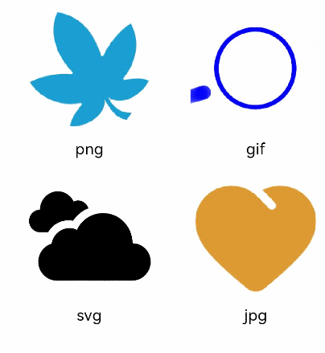
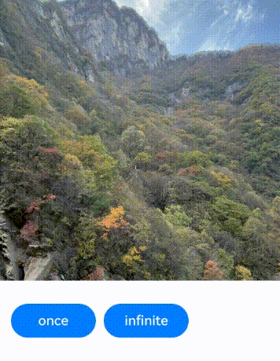
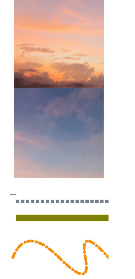
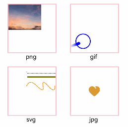
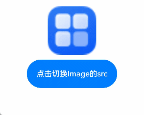
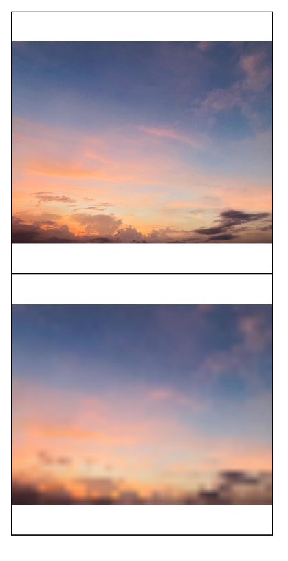
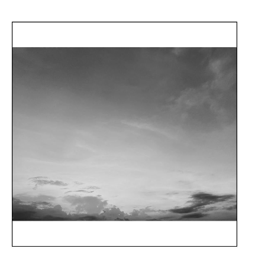

# Image

Image为图片组件，常用于在应用中显示图片。Image支持加载[PixelMap](../../apis-image-kit/js-apis-image.md#pixelmap7)、[ResourceStr](ts-types.md#resourcestr)和[DrawableDescriptor](#drawabledescriptor10)类型的数据源，支持png、jpg、jpeg、bmp、svg、webp、gif和heif类型的图片格式。

> **说明：**
>
> 该组件从API Version 7开始支持。后续版本如有新增内容，则采用上角标单独标记该内容的起始版本。
>
> 使用快捷组合键对Image组件复制时，Image组件必须处于[获焦状态](../../../ui/arkts-common-events-focus-event.md#设置组件是否可获焦)。Image组件默认不获焦，需将[focusable](ts-universal-attributes-focus.md#focusable)属性设置为true，即可使用TAB键将焦点切换到组件上，再将[focusOnTouch](ts-universal-attributes-focus.md#focusontouch9)属性设置为true，即可实现点击获焦。
>
> 图片格式支持SVG图源，SVG标签文档请参考[SVG标签说明](./ts-basic-svg.md)
>
> 动图在Image组件不可见时停止动画，通过[onVisibleAreaChange](./ts-universal-component-visible-area-change-event.md#onvisibleareachange)事件实现组件的可见状态，可见阈值ratios大于0时，Image可见。

## 需要权限

使用网络图片时，需要申请权限ohos.permission.INTERNET。具体申请方式请参考[声明权限](../../../security/AccessToken/declare-permissions.md)。


## 子组件

无


## 接口

### Image

Image(src: PixelMap | ResourceStr | DrawableDescriptor)

通过图片数据源获取图片，用于后续渲染展示。

Image组件加载图片失败或图片尺寸为0时，图片组件大小自动为0，不跟随父组件的布局约束。

Image组件默认按照居中裁剪，例如组件宽高设置相同，原图长宽不等，此时按照中间区域进行裁剪。

Image加载成功且组件不设置宽高时，其显示大小自适应父组件。

**卡片能力：** 从API version 9开始，该接口支持在ArkTS卡片中使用。

**原子化服务API：** 从API version 11开始，该接口支持在原子化服务中使用。

**系统能力：** SystemCapability.ArkUI.ArkUI.Full

**参数：**

| 参数名  | 类型                                     | 必填   | 说明                                     |
| ---- | ---------------------------------------- | ---- | ---------------------------------------- |
| src  | [PixelMap](../../apis-image-kit/js-apis-image.md#pixelmap7)&nbsp;\|&nbsp;[ResourceStr](ts-types.md#resourcestr)\|&nbsp;[DrawableDescriptor](#drawabledescriptor10) | 是    | 图片的数据源，支持本地图片和网络图片，引用方式请参考[加载图片资源](../../../ui/arkts-graphics-display.md#加载图片资源)。<br>1. PixelMap格式为像素图，常用于图片编辑的场景。<br>2. ResourceStr包含Resource和string格式。<br>string格式可用于加载网络图片和本地图片，常用于加载网络图片。当使用相对路径引用本地图片时，例如Image("common/test.jpg")，不支持跨包/跨模块调用该Image组件，建议使用Resource格式来管理需全局使用的图片资源。<br>- 支持`Base64`字符串。格式`data:image/[png\|jpeg\|bmp\|webp\|heif];base64,[base64 data]`, 其中`[base64 data]`为`Base64`字符串数据。<br>- 支持file://路径前缀的字符串，[应用沙箱URI](../../apis-core-file-kit/js-apis-file-fileuri.md#constructor10)：file://\<bundleName>/\<sandboxPath>。当访问的路径中包含特殊符号时，需要使用[fileUri.getUriFromPath(path)](../../apis-core-file-kit/js-apis-file-fileuri.md#fileurigeturifrompath)去做转换。同时需要保证目录包路径下的文件有可读权限。<br>Resource格式可以跨包/跨模块访问资源文件，是访问本地图片的推荐方式。<br/>3. 当传入资源id或name为普通图片时，生成DrawableDescriptor对象。传入[AnimatedDrawableDescriptor](../js-apis-arkui-drawableDescriptor.md#animateddrawabledescriptor12)类型可播放PixelMap数组动画。<br>**说明：**<br/>- ArkTS卡片上支持gif图片格式动效，但仅在显示时播放一次。<br/>- ArkTS卡片上不支持http:/\/等网络相关路径前缀和file:/\/路径前缀的字符串。<br/>- ArkTS卡片上不支持&nbsp;[PixelMap](../../apis-image-kit/js-apis-image.md#pixelmap7)类型。 <br/>- 加载本地图片过程中，如果对图片进行修改或者替换，可能会引起应用崩溃。因此需要覆盖图片文件时，应该先删除该文件再重新创建一个同名文件。<br/>- 网络图片必须支持RFC 9113标准，否则会导致加载失败。<br/>- 如果下载的网络图片大于10MB或一次下载的网络图片数量较多，建议使用[HTTP](../../../network/http-request.md)工具提前预下载，提高图片加载性能，方便应用侧管理数据。<br/> - Image直接传入URL可能会带来的潜在性能问题，例如：(1) 大图加载时无法提前下载，白块显示的时间较长；(2) 小图设置同步加载，在弱网环境下，可能会阻塞UI线程造成冻屏问题；(3) 在快速滑动的瀑布流中，无法提前对即将要显示的图片进行下载，导致滑动白块较多；不同场景下，性能问题会有不同的表现，建议将网络下载部分与Image的显示剥离，可提前下载或者异步下载。<br/>- 如果SVG图片没有原生大小，需要给Image组件设置宽高，否则不显示。<br/>- 如果SVG图片通过image标签引用本地其他图片，被引用的图片不支持svg格式和gif格式。<br/>- src由有效切换为无效时，图片保持不动。<br/>- 当Image组件入参为[PixelMap](../../apis-image-kit/js-apis-image.md#pixelmap7)类型时，只有当PixelMap对象的引用发生变化（即指向一个新的PixelMap实例），Image组件才能感知到数据的变化。仅修改PixelMap对象的内容（如像素值）而不更换对象引用，无法触发数据变化的感知。 |

### Image<sup>12+</sup>

Image(src: PixelMap | ResourceStr | DrawableDescriptor | ImageContent)

src新增[ImageContent](#imagecontent12)类型，可指定对应的图形内容。

**卡片能力：** 从API version 12开始，该接口支持在ArkTS卡片中使用。

**原子化服务API：** 从API version 12开始，该接口支持在原子化服务中使用。

**系统能力：** SystemCapability.ArkUI.ArkUI.Full

**参数：**

| 参数名  | 类型                                     | 必填   | 说明                                     |
| ---- | ---------------------------------------- | ---- | ---------------------------------------- |
| src  | [PixelMap](../../apis-image-kit/js-apis-image.md#pixelmap7)&nbsp;\|&nbsp;[ResourceStr](ts-types.md#resourcestr)\|&nbsp;[DrawableDescriptor](#drawabledescriptor10)\|&nbsp;[ImageContent](#imagecontent12) | 是    | 图片的数据源，支持本地图片和网络图片，引用方式请参考[加载图片资源](../../../ui/arkts-graphics-display.md#加载图片资源)。<br>1. PixelMap格式为像素图，常用于图片编辑的场景。<br>2. ResourceStr包含Resource和string格式。<br>string格式可用于加载网络图片和本地图片，常用于加载网络图片。当使用相对路径引用本地图片时，例如Image("common/test.jpg")，不支持跨包/跨模块调用该Image组件，建议使用Resource格式来管理需全局使用的图片资源。<br>- 支持`Base64`字符串。格式`data:image/[png\|jpeg\|bmp\|webp\|heif];base64,[base64 data]`, 其中`[base64 data]`为`Base64`字符串数据。<br>- 支持file://路径前缀的字符串，[应用沙箱URI](../../apis-core-file-kit/js-apis-file-fileuri.md#constructor10)：file://\<bundleName>/\<sandboxPath>。当访问的路径中包含特殊符号时，需要使用[fileUri.getUriFromPath(path)](../../apis-core-file-kit/js-apis-file-fileuri.md#fileurigeturifrompath)去做转换。同时需要保证目录包路径下的文件有可读权限。<br>Resource格式可以跨包/跨模块访问资源文件，是访问本地图片的推荐方式。<br/>3. 当传入资源id或name为普通图片时，生成DrawableDescriptor对象。传入[AnimatedDrawableDescriptor](../js-apis-arkui-drawableDescriptor.md#animateddrawabledescriptor12)类型可播放PixelMap数组动画。<br>4. 传入[ImageContent](#imagecontent12)类型，指定图像内容。<br>**说明：**<br/>- ArkTS卡片上支持gif图片格式动效，但仅在显示时播放一次。<br/>- ArkTS卡片上不支持http:/\/等网络相关路径前缀和file:/\/路径前缀的字符串。<br/>- ArkTS卡片上不支持&nbsp;[PixelMap](../../apis-image-kit/js-apis-image.md#pixelmap7)类型。 <br/>- 加载本地图片过程中，如果对图片进行修改或者替换，可能会引起应用崩溃。因此需要覆盖图片文件时，应该先删除该文件再重新创建一个同名文件。<br/>- 网络图片必须支持RFC 9113标准，否则会导致加载失败。<br/>- 如果下载的网络图片大于10MB或一次下载的网络图片数量较多，建议使用[HTTP](../../../network/http-request.md)工具提前预下载，提高图片加载性能，方便应用侧管理数据。<br/> - Image直接传入URL可能会带来的潜在性能问题，例如：(1) 大图加载时无法提前下载，白块显示的时间较长；(2) 小图设置同步加载，在弱网环境下，可能会阻塞UI线程造成冻屏问题；(3) 在快速滑动的瀑布流中，无法提前对即将要显示的图片进行下载，导致滑动白块较多；不同场景下，性能问题会有不同的表现，建议将网络下载部分与Image的显示剥离，可提前下载或者异步下载。<br/>- 如果SVG图片没有原生大小，需要给Image组件设置宽高，否则不显示。<br/>- 如果SVG图片通过image标签引用本地其他图片，被引用的图片不支持svg格式和gif格式。<br/>- src由有效切换为无效时，图片保持不动。<br/>- 当Image组件入参为[PixelMap](../../apis-image-kit/js-apis-image.md#pixelmap7)类型时，只有当PixelMap对象的引用发生变化（即指向一个新的PixelMap实例），Image组件才能感知到数据的变化。仅修改PixelMap对象的内容（如像素值）而不更换对象引用，无法触发数据变化的感知。 |

### Image<sup>12+</sup>

Image(src: PixelMap | ResourceStr | DrawableDescriptor, imageAIOptions: ImageAIOptions)

Image新增[imageAIOptions](ts-image-common.md#imageaioptions)参数，为组件设置AI分析选项。

**原子化服务API：** 从API version 12开始，该接口支持在原子化服务中使用。

**系统能力：** SystemCapability.ArkUI.ArkUI.Full

**参数：**

| 参数名  | 类型                                     | 必填   | 说明                                     |
| ---- | ---------------------------------------- | ---- | ---------------------------------------- |
| src  | [PixelMap](../../apis-image-kit/js-apis-image.md#pixelmap7)&nbsp;\|&nbsp;[ResourceStr](ts-types.md#resourcestr)\|&nbsp;[DrawableDescriptor](#drawabledescriptor10) | 是    | 图片的数据源，支持本地图片和网络图片，引用方式请参考[加载图片资源](../../../ui/arkts-graphics-display.md#加载图片资源)。<br>1. PixelMap格式为像素图，常用于图片编辑的场景。<br>2. ResourceStr包含Resource和string格式。<br>string格式可用于加载网络图片和本地图片，常用于加载网络图片。当使用相对路径引用本地图片时，例如Image("common/test.jpg")，不支持跨包/跨模块调用该Image组件，建议使用Resource格式来管理需全局使用的图片资源。<br>- 支持`Base64`字符串。格式`data:image/[png\|jpeg\|bmp\|webp\|heif];base64,[base64 data]`, 其中`[base64 data]`为`Base64`字符串数据。<br>- 支持file://路径前缀的字符串，[应用沙箱URI](../../apis-core-file-kit/js-apis-file-fileuri.md#constructor10)：file://\<bundleName>/\<sandboxPath>。当访问的路径中包含特殊符号时，需要使用[fileUri.getUriFromPath(path)](../../apis-core-file-kit/js-apis-file-fileuri.md#fileurigeturifrompath)去做转换。同时需要保证目录包路径下的文件有可读权限。<br>Resource格式可以跨包/跨模块访问资源文件，是访问本地图片的推荐方式。<br/>3. 当传入资源id或name为普通图片时，生成DrawableDescriptor对象。传入[AnimatedDrawableDescriptor](../js-apis-arkui-drawableDescriptor.md#animateddrawabledescriptor12)类型可播放PixelMap数组动画。<br>**说明：**<br/>- ArkTS卡片上支持gif图片格式动效，但仅在显示时播放一次。<br/>- ArkTS卡片上不支持http:/\/等网络相关路径前缀和file:/\/路径前缀的字符串。<br/>- ArkTS卡片上不支持&nbsp;[PixelMap](../../apis-image-kit/js-apis-image.md#pixelmap7)类型。 <br/>- 加载本地图片过程中，如果对图片进行修改或者替换，可能会引起应用崩溃。因此需要覆盖图片文件时，应该先删除该文件再重新创建一个同名文件。<br/>- 网络图片必须支持RFC 9113标准，否则会导致加载失败。<br/>- 如果下载的网络图片大于10MB或一次下载的网络图片数量较多，建议使用[HTTP](../../../network/http-request.md)工具提前预下载，提高图片加载性能，方便应用侧管理数据。<br/> - Image直接传入URL可能会带来的潜在性能问题，例如：(1) 大图加载时无法提前下载，白块显示的时间较长；(2) 小图设置同步加载，在弱网环境下，可能会阻塞UI线程造成冻屏问题；(3) 在快速滑动的瀑布流中，无法提前对即将要显示的图片进行下载，导致滑动白块较多；不同场景下，性能问题会有不同的表现，建议将网络下载部分与Image的显示剥离，可提前下载或者异步下载。<br/>- 如果SVG图片没有原生大小，需要给Image组件设置宽高，否则不显示。<br/>- 如果SVG图片通过image标签引用本地其他图片，被引用的图片不支持svg格式和gif格式。<br/>- src由有效切换为无效时，图片保持不动。<br/>- 当Image组件入参为[PixelMap](../../apis-image-kit/js-apis-image.md#pixelmap7)类型时，只有当PixelMap对象的引用发生变化（即指向一个新的PixelMap实例），Image组件才能感知到数据的变化。仅修改PixelMap对象的内容（如像素值）而不更换对象引用，无法触发数据变化的感知。 |
| imageAIOptions  | [ImageAIOptions](ts-image-common.md#imageaioptions) | 是   | 给组件设置一个AI分析选项，通过此项可配置分析类型或绑定一个分析控制器。 |

## 属性

属性的详细使用指导请参考[添加属性](../../../ui/arkts-graphics-display.md#添加属性)。除支持[通用属性](ts-universal-attributes-size.md)外，还支持以下属性：

> **说明：**
>
> Image组件不支持设置通用属性[foregroundColor](./ts-universal-attributes-foreground-color.md#foregroundcolor)，可以通过Image组件的[fillColor](#fillcolor)属性设置填充颜色。

### alt

alt(value:&nbsp;string&nbsp;|&nbsp;Resource &nbsp;|&nbsp;PixelMap)

设置图片加载时显示的占位图。

当组件的参数类型为[AnimatedDrawableDescriptor](../js-apis-arkui-drawableDescriptor.md#animateddrawabledescriptor12)时设置该属性不生效。

**卡片能力：** 从API version 9开始，该接口支持在ArkTS卡片中使用。

**原子化服务API：** 从API version 11开始，该接口支持在原子化服务中使用。

**系统能力：** SystemCapability.ArkUI.ArkUI.Full

**参数：**

| 参数名 | 类型                                                     | 必填 | 说明                                                         |
| ------ | -------------------------------------------------------- | ---- | ------------------------------------------------------------ |
| value  | string&nbsp;\|&nbsp;[Resource](ts-types.md#resource)&nbsp;\|&nbsp;[PixelMap](../../apis-image-kit/js-apis-image.md#pixelmap7)<sup>12+</sup> | 是   | 加载时显示的占位图，支持本地图片（png、jpg、bmp、svg、gif和heif类型）,支持[PixelMap](../../apis-image-kit/js-apis-image.md#pixelmap7)类型图片，不支持网络图片。<br/>默认值：null |

### objectFit

objectFit(value: ImageFit)

设置图片的填充效果。

**卡片能力：** 从API version 9开始，该接口支持在ArkTS卡片中使用。

**原子化服务API：** 从API version 11开始，该接口支持在原子化服务中使用。

**系统能力：** SystemCapability.ArkUI.ArkUI.Full

**参数：**

| 参数名 | 类型                                      | 必填 | 说明                                        |
| ------ | ----------------------------------------- | ---- | ------------------------------------------- |
| value  | [ImageFit](ts-appendix-enums.md#imagefit) | 是   | 图片的填充效果。<br/>默认值：ImageFit.Cover |

### objectRepeat

objectRepeat(value: ImageRepeat)

设置图片的重复样式，从中心点向两边重复，剩余空间不足放下一张图片时会截断。svg类型图源不支持该属性。

当组件的参数类型为[AnimatedDrawableDescriptor](../js-apis-arkui-drawableDescriptor.md#animateddrawabledescriptor12)时设置该属性不生效。

**卡片能力：** 从API version 9开始，该接口支持在ArkTS卡片中使用。

**原子化服务API：** 从API version 11开始，该接口支持在原子化服务中使用。

**系统能力：** SystemCapability.ArkUI.ArkUI.Full

**参数：**

| 参数名 | 类型                                            | 必填 | 说明                                              |
| ------ | ----------------------------------------------- | ---- | ------------------------------------------------- |
| value  | [ImageRepeat](ts-appendix-enums.md#imagerepeat) | 是   | 图片的重复样式。<br/>默认值：ImageRepeat.NoRepeat |

### interpolation

interpolation(value: ImageInterpolation)

设置图片的插值效果，即缓解图片在缩放时的锯齿问题。svg类型图源不支持该属性。

当组件的参数类型为[AnimatedDrawableDescriptor](../js-apis-arkui-drawableDescriptor.md#animateddrawabledescriptor12)时设置该属性不生效。

**卡片能力：** 从API version 9开始，该接口支持在ArkTS卡片中使用。

**原子化服务API：** 从API version 11开始，该接口支持在原子化服务中使用。

**系统能力：** SystemCapability.ArkUI.ArkUI.Full

**参数：**

| 参数名 | 类型                                      | 必填 | 说明                                                |
| ------ | ----------------------------------------- | ---- | --------------------------------------------------- |
| value  | [ImageInterpolation](#imageinterpolation) | 是   | 图片的插值效果。<br/>默认值：ImageInterpolation.Low |

### renderMode

renderMode(value: ImageRenderMode)

设置图片的渲染模式。svg类型图源不支持该属性。

设置 [ColorFilter](#colorfilter9) 时，该属性设置不生效。

当组件的参数类型为[AnimatedDrawableDescriptor](../js-apis-arkui-drawableDescriptor.md#animateddrawabledescriptor12)时设置该属性不生效。

**卡片能力：** 从API version 9开始，该接口支持在ArkTS卡片中使用。

**原子化服务API：** 从API version 11开始，该接口支持在原子化服务中使用。

**系统能力：** SystemCapability.ArkUI.ArkUI.Full

**参数：**

| 参数名 | 类型                                | 必填 | 说明                                                         |
| ------ | ----------------------------------- | ---- | ------------------------------------------------------------ |
| value  | [ImageRenderMode](#imagerendermode) | 是   | 图片的渲染模式为原色或黑白。<br/>默认值：ImageRenderMode.Original |

### sourceSize

sourceSize(value: { width:&nbsp;number;&nbsp;height:&nbsp;number&nbsp;})

设置图片解码尺寸。仅在目标尺寸小于图源尺寸时生效。svg类型图源和PixelMap资源不支持该属性。

当组件的参数类型为[AnimatedDrawableDescriptor](../js-apis-arkui-drawableDescriptor.md#animateddrawabledescriptor12)时设置该属性不生效。

**卡片能力：** 从API version 9开始，该接口支持在ArkTS卡片中使用。

**原子化服务API：** 从API version 11开始，该接口支持在原子化服务中使用。

**系统能力：** SystemCapability.ArkUI.ArkUI.Full

**参数：**

| 参数名 | 类型                                                    | 必填 | 说明                                                         |
| ------ | ------------------------------------------------------- | ---- | ------------------------------------------------------------ |
| value  | {<br/>width:&nbsp;number,<br/>height:&nbsp;number<br/>} | 是   | 图片解码尺寸，降低图片的分辨率，常用于需要让图片显示尺寸比组件尺寸更小的场景。和ImageFit.None配合使用时可在组件内显示小图。<br/>单位：vp |

### matchTextDirection

matchTextDirection(value: boolean)

设置图片是否跟随系统语言方向，在RTL语言环境下显示镜像翻转显示效果。

当组件的参数类型为[AnimatedDrawableDescriptor](../js-apis-arkui-drawableDescriptor.md#animateddrawabledescriptor12)时设置该属性不生效。

**卡片能力：** 从API version 9开始，该接口支持在ArkTS卡片中使用。

**原子化服务API：** 从API version 11开始，该接口支持在原子化服务中使用。

**系统能力：** SystemCapability.ArkUI.ArkUI.Full

**参数：**

| 参数名 | 类型    | 必填 | 说明                                         |
| ------ | ------- | ---- | -------------------------------------------- |
| value  | boolean | 是   | 图片是否跟随系统语言方向。<br/>默认值：false |

### fitOriginalSize

fitOriginalSize(value: boolean)

设置图片的显示尺寸是否跟随图源尺寸。图片组件尺寸未设置时，其显示尺寸是否跟随图源尺寸。

当组件的参数类型为[AnimatedDrawableDescriptor](../js-apis-arkui-drawableDescriptor.md#animateddrawabledescriptor12)时设置该属性不生效。

**卡片能力：** 从API version 9开始，该接口支持在ArkTS卡片中使用。

**原子化服务API：** 从API version 11开始，该接口支持在原子化服务中使用。

**系统能力：** SystemCapability.ArkUI.ArkUI.Full

**参数：**

| 参数名 | 类型    | 必填 | 说明                                             |
| ------ | ------- | ---- | ------------------------------------------------ |
| value  | boolean | 是   | 图片的显示尺寸是否跟随图源尺寸<br/>默认值：false <br/>**说明：**<br/>当不设置fitOriginalSize或者设置fitOriginalSize为false时，组件显示大小不跟随图源大小。<br/> 当设置fitOriginalSize为true时，组件显示大小跟随图源大小。 |

### fillColor

fillColor(value: ResourceColor)

设置填充颜色，设置后填充颜色会覆盖在图片上。仅对svg图源生效，设置后会替换svg图片中所有可绘制元素的填充颜色。如需对png图片进行修改颜色，可以使用[colorFilter](#colorfilter9)。

当组件的参数类型为[AnimatedDrawableDescriptor](../js-apis-arkui-drawableDescriptor.md#animateddrawabledescriptor12)时设置该属性不生效。

**卡片能力：** 从API version 9开始，该接口支持在ArkTS卡片中使用。

**原子化服务API：** 从API version 11开始，该接口支持在原子化服务中使用。

**系统能力：** SystemCapability.ArkUI.ArkUI.Full

**参数：**

| 参数名 | 类型                                       | 必填 | 说明           |
| ------ | ------------------------------------------ | ---- | -------------- |
| value  | [ResourceColor](ts-types.md#resourcecolor) | 是   | 设置填充颜色。 <br/>**说明：**<br/> 默认不对组件进行填充。当传入异常值时，系统将使用默认的主题色：浅色模式下为黑色，深色模式下为白色。 |

### autoResize

autoResize(value: boolean)

设置图片解码过程中是否对图源自动缩放。降采样解码时图片的部分信息丢失，因此可能会导致图片质量的下降（如：出现锯齿），这时可以选择把autoResize设为false，按原图尺寸解码，提升显示效果，但会增加内存占用。

原图尺寸和显示尺寸不匹配时，图片都会出现些许的失真、模糊。最佳清晰度配置建议：

图片缩小显示时：.autoResize(false) + .interpolation(.Medium)

图片放大显示时：.interpolation(.High)

当组件的参数类型为[AnimatedDrawableDescriptor](../js-apis-arkui-drawableDescriptor.md#animateddrawabledescriptor12)和svg时设置该属性不生效。

**卡片能力：** 从API version 9开始，该接口支持在ArkTS卡片中使用。

**原子化服务API：** 从API version 11开始，该接口支持在原子化服务中使用。

**系统能力：** SystemCapability.ArkUI.ArkUI.Full

**参数：**

| 参数名 | 类型    | 必填 | 说明                                                         |
| ------ | ------- | ---- | ------------------------------------------------------------ |
| value  | boolean | 是   | 图片解码过程中是否对图源自动缩放。设置为true时，组件会根据显示区域的尺寸决定用于绘制的图源尺寸，有利于减少内存占用。如原图大小为1920x1080，而显示区域大小为200x200，则图片会降采样解码到200x200的尺寸，大幅度节省图片占用的内存。<br/>默认值：false |

### syncLoad<sup>8+</sup>

syncLoad(value: boolean)

设置是否同步加载图片。建议加载尺寸较小的本地图片时将syncLoad设为true，因为耗时较短，在主线程上执行即可。

当组件的参数类型为[AnimatedDrawableDescriptor](../js-apis-arkui-drawableDescriptor.md#animateddrawabledescriptor12)时设置该属性不生效。

**卡片能力：** 从API version 9开始，该接口支持在ArkTS卡片中使用。

**原子化服务API：** 从API version 11开始，该接口支持在原子化服务中使用。

**系统能力：** SystemCapability.ArkUI.ArkUI.Full

**参数：**

| 参数名 | 类型    | 必填 | 说明                                                         |
| ------ | ------- | ---- | ------------------------------------------------------------ |
| value  | boolean | 是   | 是否同步加载图片，默认是异步加载。同步加载时阻塞UI线程，不会显示占位图。<br/>默认值：false |

### copyOption<sup>9+</sup>

copyOption(value: CopyOptions)

设置图片是否可复制。当copyOption设置为非CopyOptions.None时，支持使用长按、鼠标右击、快捷组合键'CTRL+C'等方式进行复制。svg图片不支持复制。

当组件的参数类型为[AnimatedDrawableDescriptor](../js-apis-arkui-drawableDescriptor.md#animateddrawabledescriptor12)时设置该属性不生效。

**卡片能力：** 从API version 9开始，该接口支持在ArkTS卡片中使用。

**原子化服务API：** 从API version 11开始，该接口支持在原子化服务中使用。

**系统能力：** SystemCapability.ArkUI.ArkUI.Full

**参数：**

| 参数名 | 类型                                             | 必填 | 说明                                          |
| ------ | ------------------------------------------------ | ---- | --------------------------------------------- |
| value  | [CopyOptions](ts-appendix-enums.md#copyoptions9) | 是   | 图片是否可复制。<br/>默认值：CopyOptions.None |

### colorFilter<sup>9+</sup>

colorFilter(value: ColorFilter | DrawingColorFilter)

为图像设置颜色滤镜效果。

设置该属性时，[renderMode](#rendermode)属性设置不生效。

**卡片能力：** 从API version 9开始，该接口支持在ArkTS卡片中使用。

**原子化服务API：** 从API version 11开始，该接口支持在原子化服务中使用。

**系统能力：** SystemCapability.ArkUI.ArkUI.Full

**参数：**

| 参数名 | 类型                                    | 必填 | 说明                                                         |
| ------ | --------------------------------------- | ---- | ------------------------------------------------------------ |
| value  | [ColorFilter](ts-types.md#colorfilter9) \| [DrawingColorFilter](#drawingcolorfilter12) | 是   | 1. 给图像设置颜色滤镜效果，入参为一个的4x5的RGBA转换矩阵。<br/>矩阵第一行表示R（红色）的向量值，第二行表示G（绿色）的向量值，第三行表示B（蓝色）的向量值，第四行表示A（透明度）的向量值，4行分别代表不同的RGBA的向量值。<br/>当矩阵对角线值为1，其余值为0时，保持图片原有色彩。<br/> **计算规则：**<br/>如果输入的滤镜矩阵为：<br/><br/>像素点为[R, G, B, A]<br/>则过滤后的颜色为 [R’, G’, B’, A’]<br/><br/>2. 从API Version12开始支持@ohos.graphics.drawing的ColorFilter类型作为入参。<br/>**说明：** <br/>API Version 11及之前，svg类型图源不支持该属性。<br/>从API version 12开始，该接口中的DrawingColorfilter类型支持在原子化服务中使用。其中，svg类型的图源需具有stroke属性。|

### draggable<sup>9+</sup>

draggable(value: boolean)

设置组件默认拖拽效果。不能和[onDragStart](ts-universal-events-drag-drop.md#ondragstart)事件同时使用。

**原子化服务API：** 从API version 11开始，该接口支持在原子化服务中使用。

**系统能力：** SystemCapability.ArkUI.ArkUI.Full

**参数：**

| 参数名 | 类型    | 必填 | 说明                                                         |
| ------ | ------- | ---- | ------------------------------------------------------------ |
| value  | boolean | 是   | 组件默认拖拽效果，设置为true时，组件可拖拽，绑定的长按手势不生效。<br />API version 9及之前，默认值为false。API version 10及之后，默认值为true。<br /> 若用户需要设置自定义手势，则需要将draggable设置为false。 |

### enableAnalyzer<sup>11+</sup>

enableAnalyzer(enable:&nbsp;boolean)

设置组件支持AI分析，当前支持主体识别、文字识别和对象查找等功能。<!--RP3--><!--RP3End-->

不能和[overlay](ts-universal-attributes-overlay.md)属性同时使用，两者同时设置时overlay中CustomBuilder属性将失效。该特性依赖设备能力。

分析图像要求是静态非矢量图，即svg、gif等图像类型不支持分析，支持传入[PixelMap](../../apis-image-kit/js-apis-image.md#pixelmap7)进行分析，目前仅支持[RGBA_8888](../../apis-image-kit/js-apis-image.md#pixelmapformat7)类型，使用方式见[示例4](#示例4)。

alt占位图不支持分析，objectRepeat属性仅在ImageRepeat.NoRepeat下支持分析，隐私遮罩属性[obscured](ts-universal-attributes-obscured.md)打开时不支持分析。

基于完整原始图像进行分析，设置clip、margin、borderRadius、position和objectFit属性导致图像显示不完整，或使用renderMode设置蒙层，仍基于完整原始图像进行分析。 copyOption属性不影响AI分析功能。

当组件的参数类型为[AnimatedDrawableDescriptor](../js-apis-arkui-drawableDescriptor.md#animateddrawabledescriptor12)时设置该属性不生效。

> **说明：**
>
> 需要配置权限：ohos.permission.INTERNET。

**原子化服务API：** 从API version 12开始，该接口支持在原子化服务中使用。

**系统能力：** SystemCapability.ArkUI.ArkUI.Full

**参数：**

| 参数名 | 类型    | 必填 | 说明                                                         |
| ------ | ------- | ---- | ------------------------------------------------------------ |
| enable  | boolean | 是   | 组件支持AI分析，设置为true时，组件可进行AI分析。<br/>默认值：false |

### resizable<sup>11+</sup>

resizable(value: ResizableOptions)

设置图像拉伸时可调整大小的图像选项。拉伸对拖拽缩略图以及占位图有效。

设置合法的 [ResizableOptions](#resizableoptions11) 时，objectRepeat 属性设置不生效。

当设置 top +bottom 大于原图的高或者 left + right 大于原图的宽时 [ResizableOptions](#resizableoptions11) 属性设置不生效。

当组件的参数类型为[AnimatedDrawableDescriptor](../js-apis-arkui-drawableDescriptor.md#animateddrawabledescriptor12)和svg时设置该属性不生效。

**原子化服务API：** 从API version 12开始，该接口支持在原子化服务中使用。

**系统能力：** SystemCapability.ArkUI.ArkUI.Full

**参数：**

| 参数名 | 类型                                    | 必填 | 说明                             |
| ------ | --------------------------------------- | ---- | -------------------------------- |
| value  | [ResizableOptions](#resizableoptions11) | 是   | 图像拉伸时可调整大小的图像选项。 |

### privacySensitive<sup>12+</sup>

privacySensitive(supported: boolean)

设置是否支持卡片敏感隐私信息。

**卡片能力：** 从API version 12开始，该接口支持在ArkTS卡片中使用。

**原子化服务API：** 从API version 12开始，该接口支持在原子化服务中使用。

**系统能力：** SystemCapability.ArkUI.ArkUI.Full

**参数：**

| 参数名    | 类型    | 必填 | 说明                     |
| --------- | ------- | ---- | ------------------------ |
| supported | boolean | 是   | 是否支持卡片敏感隐私信息。<br/>默认值为false，当设置为true时，隐私模式下图片将显示为半透明底板样式。<br/>**说明：** <br/>设置null则不敏感。<br/>进入隐私模式需要[卡片框架支持](./ts-universal-attributes-obscured.md)。 |

### dynamicRangeMode<sup>12+</sup>

dynamicRangeMode(value: DynamicRangeMode)

设置期望展示的图像动态范围。svg类型图源不支持该属性。

<!--RP1--><!--RP1End-->

**原子化服务API：** 从API version 12开始，该接口支持在原子化服务中使用。

**系统能力：** SystemCapability.ArkUI.ArkUI.Full

**参数：**

| 参数名 | 类型                                    | 必填 | 说明                             |
| ------ | --------------------------------------- | ---- | -------------------------------- |
| value  | [DynamicRangeMode](#dynamicrangemode12-1) | 是   | 图像显示的动态范围。<br/>默认值：dynamicRangeMode.Standard |

## ImageContent<sup>12+</sup>

指定图像内容。

| 名称     | 描述                      |
| ------ | -------------------------- |
| EMPTY   | 空图像。                   |

## ImageInterpolation

**卡片能力：** 从API version 9开始，该接口支持在ArkTS卡片中使用。

**原子化服务API：** 从API version 11开始，该接口支持在原子化服务中使用。

| 名称     | 描述                         |
| ------ | -------------------------- |
| None   | 最近邻插值。                   |
| High   | Cubic插值，插值质量最高，可能会影响图片渲染的速度。 |
| Medium | MipMap插值。                     |
| Low    | 双线性插值。                     |

## ImageRenderMode

**卡片能力：** 从API version 9开始，该接口支持在ArkTS卡片中使用。

**原子化服务API：** 从API version 11开始，该接口支持在原子化服务中使用。

| 名称       | 描述      |
| -------- | ------- |
| Original | 原色渲染模式。 |
| Template | 黑白渲染模式。 |

## ResizableOptions<sup>11+</sup>

图像拉伸时可调整大小的图像选项。

**原子化服务API：** 从API version 12开始，该接口支持在原子化服务中使用。

**系统能力：** SystemCapability.ArkUI.ArkUI.Full

| 名称 | 类型 | 必填 | 说明 |
| --------- |-----------|-----------|-----------|
| slice | [EdgeWidths](#edgewidths参数说明) |  否  | 边框宽度类型，用于描述组件边框不同方向的宽度。<br>**说明：**<br>只有当bottom和right同时大于0时，该属性生效。<br> 传入数字时默认单位为vp。|
| lattice<sup>12+</sup> | [DrawingLattice](#drawinglattice12) |  否  | 矩形网格对象。<br>**说明：**<br> 通过@ohos.graphics.drawing的createImageLattice接口创建Lattice类型作为入参。将图像划分为矩形网格，同时处于偶数列和偶数行上的网格图像是固定的，不会被拉伸。<br>该参数对[backgroundImageResizable](ts-universal-attributes-background.md#backgroundimageresizable12)接口不生效。<br> 传入数字时默认单位为px。 |

## EdgeWidths参数说明

**原子化服务API：** 从API version 11开始，该接口支持在原子化服务中使用。

| 名称 | 类型 | 必填 | 说明 |
| --------- |-----------|-----------|-----------|
|  top    |  [Length](ts-types.md#length)  |  否  | 图片顶部拉伸时保持不变距离。<br>默认值：0<br>单位：vp |
|  right  |  [Length](ts-types.md#length)  |  否  | 图片右部拉伸时保持不变距离。<br>默认值：0<br>单位：vp |
|  bottom |  [Length](ts-types.md#length)  |  否  | 图片底部拉伸时保持不变距离。<br>默认值：0<br>单位：vp |
|  left   |  [Length](ts-types.md#length)  |  否  | 图片左部拉伸时保持不变距离。<br>默认值：0<br>单位：vp |


## DynamicRangeMode<sup>12+</sup>

期望展示的图像动态范围。

**原子化服务API：** 从API version 12开始，该接口支持在原子化服务中使用。

| 名称     | 描述                      |
| ------ | -------------------------- |
| High   | 不受限动态范围，最大限度进行图片提亮。              |
| Constraint | 受限动态范围，受限进行图片提亮。          |
| Standard    | 标准动态范围，不进行图片提亮。         |

## DrawableDescriptor<sup>10+<sup>

type DrawableDescriptor = DrawableDescriptor

作为Image组件的入参对象。

**原子化服务API：** 从API version 11开始，该接口支持在原子化服务中使用。

**系统能力：** SystemCapability.ArkUI.ArkUI.Full

| 类型     | 说明       |
| ------ | ---------- |
| [DrawableDescriptor](../js-apis-arkui-drawableDescriptor.md#drawabledescriptor)  | 返回一个DrawableDescriptor对象。 |

## DrawingColorFilter<sup>12+<sup>

type DrawingColorFilter = ColorFilter

颜色滤波器对象。

**原子化服务API：** 从API version 12开始，该接口支持在原子化服务中使用。

**系统能力：** SystemCapability.ArkUI.ArkUI.Full

| 类型     | 说明       |
| ------ | ---------- |
| [ColorFilter](../../apis-arkgraphics2d/js-apis-graphics-drawing.md#colorfilter)  | 返回一个颜色滤波器。 |

## DrawingLattice<sup>12+<sup>

type DrawingLattice = Lattice

将图片按照矩形网格进行划分。

**原子化服务API：** 从API version 12开始，该接口支持在原子化服务中使用。

**系统能力：** SystemCapability.ArkUI.ArkUI.Full

| 类型     | 说明       |
| ------ | ---------- |
| [Lattice](../../apis-arkgraphics2d/js-apis-graphics-drawing.md#lattice12) | 返回一个矩阵网格对象。 |

## 事件

除支持[通用事件](ts-universal-events-click.md)外，还支持以下事件：

### onComplete

onComplete(callback: (event?: { width: number, height: number, componentWidth: number, componentHeight: number, loadingStatus: number,contentWidth: number, contentHeight: number, contentOffsetX: number, contentOffsetY: number }) =&gt; void)

图片数据加载成功和解码成功时均触发该回调，返回成功加载的图片尺寸。

当组件的参数类型为[AnimatedDrawableDescriptor](../js-apis-arkui-drawableDescriptor.md#animateddrawabledescriptor12)时该事件不触发。

**卡片能力：** 从API version 9开始，该接口支持在ArkTS卡片中使用。

**原子化服务API：** 从API version 11开始，该接口支持在原子化服务中使用。

**系统能力：** SystemCapability.ArkUI.ArkUI.Full

**参数：**

| 参数名                       | 类型   | 必填 | 说明                                                         |
| ---------------------------- | ------ | ---- | ------------------------------------------------------------ |
| width                        | number | 是   | 图片的宽。<br/>单位：像素                                    |
| height                       | number | 是   | 图片的高。<br/>单位：像素                                    |
| componentWidth               | number | 是   | 组件的宽。<br/>单位：像素                                    |
| componentHeight              | number | 是   | 组件的高。<br/>单位：像素                                    |
| loadingStatus                | number | 是   | 图片加载成功的状态值。<br/>**说明：**<br/>返回的状态值为0时，表示图片数据加载成功。返回的状态值为1时，表示图片解码成功。 |
| contentWidth<sup>10+</sup>   | number | 是   | 图片实际绘制的宽度。<br/>单位：像素<br>**说明：**<br/>仅在loadingStatus返回1时有效。 |
| contentHeight<sup>10+</sup>  | number | 是   | 图片实际绘制的高度。<br/>单位：像素<br/>**说明：**<br/>仅在loadingStatus返回1时有效。 |
| contentOffsetX<sup>10+</sup> | number | 是   | 实际绘制内容相对于组件自身的x轴偏移。<br/>单位：像素<br/>**说明：**<br/>仅在loadingStatus返回1时有效。 |
| contentOffsetY<sup>10+</sup> | number | 是   | 实际绘制内容相对于组件自身的y轴偏移。<br/>单位：像素<br/>**说明：**<br/>仅在loadingStatus返回1时有效。 |

### onError<sup>9+</sup>

onError(callback: ImageErrorCallback)

图片加载异常时触发该回调。

当组件的参数类型为[AnimatedDrawableDescriptor](../js-apis-arkui-drawableDescriptor.md#animateddrawabledescriptor12)时该事件不触发。

**卡片能力：** 从API version 9开始，该接口支持在ArkTS卡片中使用。

**原子化服务API：** 从API version 11开始，该接口支持在原子化服务中使用。

**系统能力：** SystemCapability.ArkUI.ArkUI.Full

**参数：**

| 参数名   | 类型                                       | 必填 | 说明                       |
| -------- | ------------------------------------------ | ---- | -------------------------- |
| callback | [ImageErrorCallback](#imageerrorcallback9) | 是   | 图片加载异常时触发的回调。<br>**说明：**<br/> - 建议开发者使用此回调，可快速确认图片加载失败时的具体原因 |

### onFinish

onFinish(event: () =&gt; void)

当加载的源文件为带动效的svg格式图片时，svg动效播放完成时会触发这个回调。如果动效为无限循环动效，则不会触发这个回调。

仅支持svg格式的图片。当组件的参数类型为[AnimatedDrawableDescriptor](../js-apis-arkui-drawableDescriptor.md#animateddrawabledescriptor12)时该事件不触发。

**卡片能力：** 从API version 9开始，该接口支持在ArkTS卡片中使用。

**原子化服务API：** 从API version 11开始，该接口支持在原子化服务中使用。

**系统能力：** SystemCapability.ArkUI.ArkUI.Full

## ImageErrorCallback<sup>9+</sup>

type ImageErrorCallback = (error: ImageError) => void

图片加载异常时触发的回调。

当组件的参数类型为[AnimatedDrawableDescriptor](../js-apis-arkui-drawableDescriptor.md#animateddrawabledescriptor12)时该事件不触发。

**卡片能力：** 从API version 9开始，该接口支持在ArkTS卡片中使用。

**原子化服务API：** 从API version 11开始，该接口支持在原子化服务中使用。

**系统能力：** SystemCapability.ArkUI.ArkUI.Full

| 参数名 | 类型                       | 必填 | 说明                               |
| ------ | -------------------------- | ---- | ---------------------------------- |
| error  | [ImageError](#imageerror9) | 是   | 图片加载异常时触发回调的返回对象。 |

## ImageError<sup>9+</sup>

图片加载异常时触发回调的返回对象。

当组件的参数类型为[AnimatedDrawableDescriptor](../js-apis-arkui-drawableDescriptor.md#animateddrawabledescriptor12)时该事件不触发。

**卡片能力：** 从API version 9开始，该接口支持在ArkTS卡片中使用。

**原子化服务API：** 从API version 11开始，该接口支持在原子化服务中使用。

**系统能力：** SystemCapability.ArkUI.ArkUI.Full

| 名称          | 类型   | 必填 | 说明                      |
| --------------- | ------ | ---- | ------------------------- |
| componentWidth  | number | 是   | 组件的宽。<br/>单位：像素 |
| componentHeight | number | 是   | 组件的高。<br/>单位：像素 |
| message<sup>10+</sup>         | string | 是   | 报错信息。                |

## 示例

### 示例1（加载基本类型图片）

加载png、gif、svg和jpg等基本类型的图片。

```ts
@Entry
@Component
struct ImageExample1 {
  build() {
    Column() {
      Flex({ direction: FlexDirection.Column, alignItems: ItemAlign.Start }) {
        Row() {
          // 加载png格式图片
          Image($r('app.media.ic_camera_master_ai_leaf'))
            .width(110).height(110).margin(15)
            .overlay('png', { align: Alignment.Bottom, offset: { x: 0, y: 20 } })
          // 加载gif格式图片
          Image($r('app.media.loading'))
            .width(110).height(110).margin(15)
            .overlay('gif', { align: Alignment.Bottom, offset: { x: 0, y: 20 } })
        }
        Row() {
          // 加载svg格式图片
          Image($r('app.media.ic_camera_master_ai_clouded'))
            .width(110).height(110).margin(15)
            .overlay('svg', { align: Alignment.Bottom, offset: { x: 0, y: 20 } })
          // 加载jpg格式图片
          Image($r('app.media.ic_public_favor_filled'))
            .width(110).height(110).margin(15)
            .overlay('jpg', { align: Alignment.Bottom, offset: { x: 0, y: 20 } })
        }
      }
    }.height(320).width(360).padding({ right: 10, top: 10 })
  }
}
```



### 示例2（下载与显示网络图片）

加载网络图片时，默认网络超时是5分钟，建议使用alt配置加载时的占位图。使用[HTTP](../../../network/http-request.md)工具包发送网络请求，接着将返回的数据解码为Image组件中的`PixelMap`，图片开发可参考[图片处理](../../../media/image/image-overview.md)。

使用网络图片时，需要申请权限ohos.permission.INTERNET。具体申请方式请参考[声明权限](../../../security/AccessToken/declare-permissions.md)。

```ts
import { http } from '@kit.NetworkKit';
import { BusinessError } from '@kit.BasicServicesKit';
import { image } from '@kit.ImageKit';

@Entry
@Component
struct ImageExample2 {
  @State pixelMapImg: PixelMap | undefined = undefined;

  aboutToAppear() {
    this.requestImageUrl('https://www.example.com/xxx.png');// 请填写一个具体的网络图片地址
  }

  requestImageUrl(url: string) {
    http.createHttp().request(url, (error: BusinessError, data: http.HttpResponse)=> {
      if (error) {
        console.error(`request image failed: url: ${url}, code: ${error.code}, message: ${error.message}`);
      } else {
        let imgData: ArrayBuffer = data.result as ArrayBuffer;
        console.info(`request image success, size: ${imgData.byteLength}`);
        let imgSource: image.ImageSource = image.createImageSource(imgData);
        class sizeTmp {
          height: number = 100
          width: number = 100
        }
        let options: Record<string, number | boolean | sizeTmp> = {
          'alphaType': 0,
          'editable': false,
          'pixelFormat': 3,
          'scaleMode': 1,
          'size': { height: 100, width: 100 }
        }
        imgSource.createPixelMap(options).then((pixelMap: PixelMap) => {
          console.error('image createPixelMap success');
          this.pixelMapImg = pixelMap;
        })
      }
    })
  }

  build() {
    Column() {
      Image(this.pixelMapImg)
        .alt($r('app.media.img'))
        .objectFit(ImageFit.None)
        .width('100%')
        .height('100%')
    }
  }
}
```


### 示例3（为图片添加事件）

为图片添加onClick和onFinish事件。

```ts
@Entry
@Component
struct ImageExample3 {
  private imageOne: Resource = $r('app.media.earth');
  private imageTwo: Resource = $r('app.media.star');
  private imageThree: Resource = $r('app.media.moveStar');
  @State src: Resource = this.imageOne
  @State src2: Resource = this.imageThree
  build(){
    Column(){
      // 为图片添加点击事件，点击完成后加载特定图片
      Image(this.src)
        .width(100)
        .height(100)
        .onClick(() => {
          this.src = this.imageTwo
        })

      // 当加载图片为SVG格式时
      Image(this.src2)
        .width(100)
        .height(100)
        .onFinish(() => {
          // SVG动效播放完成时加载另一张图片
          this.src2 = this.imageOne
        })
    }.width('100%').height('100%')
  }
}
```


### 示例4（开启图像AI分析）
<!--RP2-->
使用enableAnalyzer接口开启图像AI分析。

```ts
import { image } from '@kit.ImageKit'

@Entry
@Component
struct ImageExample4 {
  @State imagePixelMap: image.PixelMap | undefined = undefined
  private aiController: ImageAnalyzerController = new ImageAnalyzerController()
  private options: ImageAIOptions = {
    types: [ImageAnalyzerType.SUBJECT, ImageAnalyzerType.TEXT],
    aiController: this.aiController
  }

  async aboutToAppear() {
    this.imagePixelMap = await this.getPixmapFromMedia($r('app.media.app_icon'))
  }

  build() {
    Column() {
      Image(this.imagePixelMap, this.options)
        .enableAnalyzer(true)
        .width(200)
        .height(200)
        .margin({bottom:10})
      Button('getTypes')
        .width(80)
        .height(80)
        .onClick(() => {
          this.aiController.getImageAnalyzerSupportTypes()
        })
    }
  }
  private async getPixmapFromMedia(resource: Resource) {
    let unit8Array = await getContext(this)?.resourceManager?.getMediaContent({
      bundleName: resource.bundleName,
      moduleName: resource.moduleName,
      id: resource.id
    })
    let imageSource = image.createImageSource(unit8Array.buffer.slice(0, unit8Array.buffer.byteLength))
    let createPixelMap: image.PixelMap = await imageSource.createPixelMap({
      desiredPixelFormat: image.PixelMapFormat.RGBA_8888
    })
    await imageSource.release()
    return createPixelMap
  }
}
```


<!--RP2End-->
### 示例5（拉伸图片）

调整不同方向对图片进行拉伸。

```ts
@Entry
@Component
struct Index {
  @State top: number = 10
  @State bottom: number = 10
  @State left: number = 10
  @State right: number = 10

  build() {
    Column({ space: 5 }) {
      // 原图效果
      Image($r("app.media.landscape"))
        .width(200).height(200)
        .border({ width: 2, color: Color.Pink })
        .objectFit(ImageFit.Contain)

      // 图像拉伸效果，设置resizable属性，对图片不同方向进行拉伸
      Image($r("app.media.landscape"))
        .resizable({
          slice: {
            left: this.left,
            right: this.right,
            top: this.top,
            bottom: this.bottom
          }
        })
        .width(200)
        .height(200)
        .border({ width: 2, color: Color.Pink })
        .objectFit(ImageFit.Contain)

      Row() {
        Button("add top to " + this.top).fontSize(10)
          .onClick(() => {
            this.top += 10
          })
        Button("add bottom to " + this.bottom).fontSize(10)
          .onClick(() => {
            this.bottom += 10
          })
      }

      Row() {
        Button("add left to " + this.left).fontSize(10)
          .onClick(() => {
            this.left += 10
          })
        Button("add right to " + this.right).fontSize(10)
          .onClick(() => {
            this.right += 10
          })
      }

    }
    .justifyContent(FlexAlign.Start).width('100%').height('100%')
  }
}
```


### 示例6（播放PixelMap数组动画）

该示例通过[AnimatedDrawableDescriptor](../js-apis-arkui-drawableDescriptor.md#animateddrawabledescriptor12)播放PixelMap数组动画。

```ts
import {AnimationOptions, AnimatedDrawableDescriptor} from '@kit.ArkUI'
import { image } from '@kit.ImageKit'

@Entry
@Component
struct ImageExample {
  pixelmaps: Array<PixelMap>  = [];
  options: AnimationOptions = {duration:2000, iterations:1};
  @State animated: AnimatedDrawableDescriptor | undefined = undefined;

  async aboutToAppear() {
    this.pixelmaps = await this.getPixelMaps();
    this.animated = new AnimatedDrawableDescriptor(this.pixelmaps, this.options);
  }

  build() {
    Column() {
      Row() {
        Image(this.animated)
          .width('500px').height('500px')
          .onFinish(() => {
            console.info("finish")
          })
      }.height('50%')
      Row() {
        Button('once').width(100).padding(5).onClick(() => {
          this.options = {duration:2000, iterations:1};
          this.animated = new AnimatedDrawableDescriptor(this.pixelmaps, this.options);
        }).margin(5)
        Button('infinite').width(100).padding(5).onClick(() => {
          this.options = {duration:2000, iterations:-1};
          this.animated = new AnimatedDrawableDescriptor(this.pixelmaps, this.options);
        }).margin(5)
      }
    }.width('50%')
  }

  private async getPixmapListFromMedia(resource: Resource) {
    let unit8Array = await getContext(this)?.resourceManager?.getMediaContent({
      bundleName: resource.bundleName,
      moduleName: resource.moduleName,
      id: resource.id
    })
    let imageSource = image.createImageSource(unit8Array.buffer.slice(0, unit8Array.buffer.byteLength))
    let createPixelMap: Array<image.PixelMap> = await imageSource.createPixelMapList({
      desiredPixelFormat: image.PixelMapFormat.RGBA_8888
    })
    await imageSource.release()
    return createPixelMap
  }

  private async getPixmapFromMedia(resource: Resource) {
    let unit8Array = await getContext(this)?.resourceManager?.getMediaContent({
      bundleName: resource.bundleName,
      moduleName: resource.moduleName,
      id: resource.id
    })
    let imageSource = image.createImageSource(unit8Array.buffer.slice(0, unit8Array.buffer.byteLength))
    let createPixelMap: image.PixelMap = await imageSource.createPixelMap({
      desiredPixelFormat: image.PixelMapFormat.RGBA_8888
    })
    await imageSource.release()
    return createPixelMap
  }

  private async getPixelMaps() {
    let Mypixelmaps:Array<PixelMap> = await this.getPixmapListFromMedia($r('app.media.view'))//gif图, 生成多张PixelMap
    Mypixelmaps.push(await this.getPixmapFromMedia($r('app.media.icon'))) //添加一张图片
    return Mypixelmaps;
  }
}
```



### 示例7（为图像设置颜色滤镜效果）

该示例通过[colorFilter](#colorfilter9)实现了给图像设置颜色滤镜效果。

```ts
import { drawing, common2D } from '@kit.ArkGraphics2D';

@Entry
@Component
struct ImageExample3 {
  private imageOne: Resource = $r('app.media.1');
  private imageTwo: Resource = $r('app.media.2');
  @State src: Resource = this.imageOne
  @State src2: Resource = this.imageTwo
  private ColorFilterMatrix: number[] = [1, 0, 1, 0, 1, 0, 0, 0, 1, 0, 1, 0, 1, 0, 0, 0, 1, 0, 1, 0]
  private color: common2D.Color = { alpha: 255, red: 255, green: 0, blue: 0 };
  @State DrawingColorFilterFirst: ColorFilter | undefined = undefined
  @State DrawingColorFilterSecond: ColorFilter | undefined = undefined
  @State DrawingColorFilterThird: ColorFilter | undefined = undefined

  build() {
    Column() {
      Image(this.src)
        .width(100)
        .height(100)
        .colorFilter(this.DrawingColorFilterFirst)
        .onClick(()=>{
          this.DrawingColorFilterFirst = drawing.ColorFilter.createBlendModeColorFilter(this.color, drawing.BlendMode.SRC_IN);
        })

      Image(this.src2)
        .width(100)
        .height(100)
        .colorFilter(this.DrawingColorFilterSecond)
        .onClick(()=>{
          this.DrawingColorFilterSecond = new ColorFilter(this.ColorFilterMatrix);
        })

      //当加载图片为SVG格式时
      Image($r('app.media.test_self'))
        .width(110).height(110).margin(15)
        .colorFilter(this.DrawingColorFilterThird)
        .onClick(()=>{
          this.DrawingColorFilterThird = drawing.ColorFilter.createBlendModeColorFilter(this.color, drawing.BlendMode.SRC_IN);
        })
    }
  }
}
```


### 示例8（为图像设置填充效果）

该示例通过[objectFit](#objectfit)为图像设置填充效果。

```ts
@Entry
@Component
struct ImageExample{
  build() {
    Column() {
      Flex({ direction: FlexDirection.Column, alignItems: ItemAlign.Start }) {
        Row() {
          // 加载png格式图片
          Image($r('app.media.sky'))
            .width(110).height(110).margin(15)
            .overlay('png', { align: Alignment.Bottom, offset: { x: 0, y: 20 } })
            .border({ width: 2, color: Color.Pink })
            .objectFit(ImageFit.TOP_START)
          // 加载gif格式图片
          Image($r('app.media.loading'))
            .width(110).height(110).margin(15)
            .overlay('gif', { align: Alignment.Bottom, offset: { x: 0, y: 20 } })
            .border({ width: 2, color: Color.Pink })
            .objectFit(ImageFit.BOTTOM_START)
        }
        Row() {
          // 加载svg格式图片
          Image($r('app.media.svg'))
            .width(110).height(110).margin(15)
            .overlay('svg', { align: Alignment.Bottom, offset: { x: 0, y: 20 } })
            .border({ width: 2, color: Color.Pink })
            .objectFit(ImageFit.TOP_END)
          // 加载jpg格式图片
          Image($r('app.media.jpg'))
            .width(110).height(110).margin(15)
            .overlay('jpg', { align: Alignment.Bottom, offset: { x: 0, y: 20 } })
            .border({ width: 2, color: Color.Pink })
            .objectFit(ImageFit.CENTER)
        }
      }
    }.height(320).width(360).padding({ right: 10, top: 10 })
  }
}
```



### 示例9（切换显示不同类型图片）

该示例展示了ResourceStr类型与ImageContent类型作为数据源的显示图片效果。

```ts
@Entry
@Component
struct ImageContentExample {
  @State imageSrcIndex: number = 0;
  @State imageSrcList: (ResourceStr | ImageContent)[] = [$r('app.media.app_icon'), ImageContent.EMPTY]

  build() {
    Column({ space: 10 }) {
      Image(this.imageSrcList[this.imageSrcIndex])
        .width(100)
        .height(100)
      Button('点击切换Image的src')
        .padding(20)
        .onClick(() => {
          this.imageSrcIndex = (this.imageSrcIndex + 1) % this.imageSrcList.length
        })
    }.width('100%')
    .padding(20)
  }
}
```



### 示例10（配置隐私隐藏）

该示例通过[privacySensitive](#privacysensitive12)展示了如何配置隐私隐藏，效果展示需要卡片框架支持。

```ts
@Entry
@Component
struct ImageExample {
  build() {
    Column({ space: 10 }) {
      Image($r("app.media.startIcon"))
        .width(50)
        .height(50)
        .margin({top :30})
        .privacySensitive(true)
    }
    .alignItems(HorizontalAlign.Center)
    .width("100%")
  }
}
```


### 示例11（为图片设置扫光效果）

该示例通过[linearGradient](./ts-basic-components-datapanel.md#lineargradient10)接口和[animateTo()](./ts-explicit-animation.md)实现了给图片设置扫光效果。

```ts
import { curves } from '@kit.ArkUI';

@Entry
@Component
struct ImageExample11 {
  private curve = curves.cubicBezier(0.33, 0, 0.67, 1);
  @State moveImg: string[] = ['imageScanEffect'];
  @State moveImgVisible: Visibility = Visibility.Visible;
  @State durationTime: number = 1500;
  @State iterationsTimes: number = -1;
  @State private opacityValue: number = 0.5;
  @State imageWidth: number = 450;
  @State visible: Visibility = Visibility.Hidden;
  @State stackBackgroundColor: string = '#E1E4E9';
  @State linePositionX: number = 0 - this.imageWidth;
  @State linePositionY: number = 0;
  @State imgResource: Resource | undefined = undefined;

  startupAnimate() {
    this.moveImg.pop();
    this.moveImg.push('imageScanEffect');
    setTimeout(() => {
      this.imgResource = $r('app.media.img');
    }, 3000);
    animateTo({
      duration: this.durationTime,
      curve: this.curve,
      tempo: 1,
      iterations: this.iterationsTimes,
      delay: 0
    }, () => {
      this.linePositionX = this.imageWidth;
    })
  }

  build() {
    Column() {
      Row() {
        Stack() {
          Image(this.imgResource)
            .width(this.imageWidth)
            .height(200)
            .objectFit(ImageFit.Contain)
            .visibility(this.visible)
            .onComplete(() => {
              this.visible = Visibility.Visible;
              this.moveImg.pop();
            })
            .onError(() =>{
              setTimeout(() => {
                this.visible = Visibility.Visible;
                this.moveImg.pop();
              }, 2600)
            })
          ForEach(this.moveImg, (item: string) => {
            Row()
              .width(this.imageWidth)
              .height(200)
              .visibility(this.moveImgVisible)
              .position({ x: this.linePositionX, y: this.linePositionY })
              .linearGradient({
                direction: GradientDirection.Right,
                repeating: false,
                colors: [[0xE1E4E9, 0], [0xFFFFFF, 0.75], [0xE1E4E9, 1]]
              })
              .opacity(this.opacityValue)
          })
        }
        .backgroundColor(this.visible ? this.stackBackgroundColor : undefined)
        .margin({top: 20, left: 20, right: 20})
        .borderRadius(20)
        .clip(true)
        .onAppear(() => {
          this.startupAnimate();
        })
      }
    }
  }
}
```


### 示例12（通过sourceSize设置图片解码尺寸）

该示例通过[sourceSize](ts-basic-components-image.md#sourcesize)接口自定义图片的解码尺寸。

```ts
@Entry
@Component
struct Index {
  @State borderRadiusValue: number = 10;
  build() {
    Column() {
      Image($r("app.media.sky"))
        .sourceSize({width:1393, height:1080})
        .height(300)
        .width(300)
        .objectFit(ImageFit.Contain)
        .borderWidth(1)
      Image($r("app.media.sky"))
        .sourceSize({width:13, height:10})
        .height(300)
        .width(300)
        .objectFit(ImageFit.Contain)
        .borderWidth(1)
    }
    .height('100%')
    .width('100%')
  }
}
```



### 示例13（通过renderMode设置图片的渲染模式）

该示例通过[renderMode](ts-basic-components-image.md#rendermode)接口设置图片渲染模式为黑白模式。

```ts
@Entry
@Component
struct Index {
  @State borderRadiusValue: number = 10;
  build() {
    Column() {
      Image($r("app.media.sky"))
        .renderMode(ImageRenderMode.Template)
        .height(300)
        .width(300)
        .objectFit(ImageFit.Contain)
        .borderWidth(1)
    }
    .height('100%')
    .width('100%')
  }
}
```



### 示例14（通过objectRepeat设置图片的重复样式）

该示例通过[objectRepeat](ts-basic-components-image.md#objectrepeat)接口在竖直轴上重复绘制图片。

```ts
@Entry
@Component
struct Index {
  @State borderRadiusValue: number = 10;
  build() {
    Column() {
      Image($r("app.media.sky"))
        .objectRepeat(ImageRepeat.Y)
        .height(300)
        .width(300)
        .objectFit(ImageFit.Contain)
        .borderWidth(1)
    }
    .height('100%')
    .width('100%')
  }
}
```

