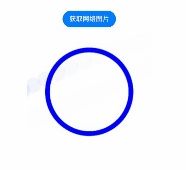

# ImageSpan

[Text](ts-basic-components-text.md)、[ContainerSpan](ts-basic-components-containerspan.md)组件的子组件，用于显示行内图片。

>  **说明：**
>
>  该组件从API Version 10开始支持。后续版本如有新增内容，则采用上角标单独标记该内容的起始版本。


## 子组件

无


## 接口

ImageSpan(value: ResourceStr | PixelMap)

**原子化服务API：** 从API version 11开始，该接口支持在原子化服务中使用。

**系统能力：** SystemCapability.ArkUI.ArkUI.Full

**参数：**

| 参数名 | 参数类型 | 必填 | 参数描述 |
| -------- | -------- | -------- | -------- |
| value | [ResourceStr](ts-types.md#resourcestr) \|&nbsp;[PixelMap](../../apis-image-kit/js-apis-image.md#pixelmap7)&nbsp; | 是 | 图片的数据源，支持本地图片和网络图片。<br/>当使用相对路径引用图片资源时，例如`ImageSpan("common/test.jpg")`，不支持跨包/跨模块调用该ImageSpan组件，建议使用`$r`方式来管理需全局使用的图片资源。<br/>\- 支持的图片格式包括png、jpg、bmp、svg、gif和heif。<br/>\- 支持`Base64`字符串。格式`data:image/[png\|jpeg\|bmp\|webp\|heif];base64,[base64 data]`, 其中`[base64 data]`为`Base64`字符串数据。<br/>\- 支持file:///data/storage路径前缀的字符串，用于读取本应用安装目录下files文件夹下的图片资源。需要保证目录包路径下的文件有可读权限。 |


## 属性

属性继承自[BaseSpan](ts-basic-components-span.md#basespan)，通用属性方法支持[尺寸设置](ts-universal-attributes-size.md#尺寸设置)、[背景设置](ts-universal-attributes-background.md#背景设置)、[边框设置](ts-universal-attributes-border.md#边框设置)

### alt<sup>12+</sup>

alt(value:&nbsp;PixelMap)

设置图片加载时显示的占位图。

**原子化服务API：** 从API version 12开始，该接口支持在原子化服务中使用。

**系统能力：** SystemCapability.ArkUI.ArkUI.Full

**参数：** 

| 参数名 | 类型                                                     | 必填 | 说明                                                         |
| ------ | -------------------------------------------------------- | ---- | ------------------------------------------------------------ |
| value  | [PixelMap](../../apis-image-kit/js-apis-image.md#pixelmap7) | 是   | 加载时显示的占位图，支持[PixelMap](../../apis-image-kit/js-apis-image.md#pixelmap7)类型。<br/>默认值：null |

### verticalAlign

verticalAlign(value: ImageSpanAlignment)

设置图片基于文本的对齐方式。

**原子化服务API：** 从API version 11开始，该接口支持在原子化服务中使用。

**系统能力：** SystemCapability.ArkUI.ArkUI.Full

**参数：** 

| 参数名 | 类型                                      | 必填 | 说明                                                         |
| ------ | ----------------------------------------- | ---- | ------------------------------------------------------------ |
| value  | [ImageSpanAlignment](ts-appendix-enums.md#imagespanalignment枚举说明) | 是   | 图片基于文本的对齐方式。<br />默认值：ImageSpanAlignment.BOTTOM |

### objectFit

objectFit(value: ImageFit)

设置图片的缩放类型。

**原子化服务API：** 从API version 11开始，该接口支持在原子化服务中使用。

**系统能力：** SystemCapability.ArkUI.ArkUI.Full

**参数：** 

| 参数名 | 类型                                      | 必填 | 说明                                        |
| ------ | ----------------------------------------- | ---- | ------------------------------------------- |
| value  | [ImageFit](ts-appendix-enums.md#imagefit) | 是   | 图片的缩放类型。<br/>默认值：ImageFit.Cover |

## 事件

通用事件仅支持[点击事件](ts-universal-attributes-click.md)。还支持以下事件：

### onComplete<sup>12+</sup>

onComplete(callback: ImageCompleteCallback)

图片数据加载成功和解码成功时均触发该回调，返回成功加载的图片尺寸。

**原子化服务API：** 从API version 12开始，该接口支持在原子化服务中使用。

**系统能力：** SystemCapability.ArkUI.ArkUI.Full

**参数：**

| 参数名   | 类型                                       | 必填 | 说明                       |
| -------- | ------------------------------------------ | ---- | -------------------------- |
| callback | [ImageCompleteCallback](#imagecompletecallback12) | 是   | 图片数据加载成功和解码成功时触发的回调。 |

### onError<sup>12+</sup>

onError(callback: ImageErrorCallback)

图片加载异常时触发该回调。

**原子化服务API：** 从API version 12开始，该接口支持在原子化服务中使用。

**系统能力：** SystemCapability.ArkUI.ArkUI.Full

**参数：**

| 参数名   | 类型                                       | 必填 | 说明                       |
| -------- | ------------------------------------------ | ---- | -------------------------- |
| callback | [ImageErrorCallback](ts-basic-components-image.md#imageerrorcallback9) | 是   | 图片加载异常时触发的回调。 |

## ImageCompleteCallback<sup>12+</sup>

type ImageCompleteCallback = (result: ImageLoadResult) => void

图片加载异常时触发的回调。

**原子化服务API：** 从API version 12开始，该接口支持在原子化服务中使用。

| 参数名 | 类型                       | 必填 | 说明                               |
| ------ | -------------------------- | ---- | ---------------------------------- |
| result  | [ImageLoadResult](#imageloadresult12) | 是   | 图片数据加载成功和解码成功触发回调时返回的对象。 |

## ImageLoadResult<sup>12+</sup>

图片数据加载成功和解码成功触发回调时返回的对象。

**原子化服务API：** 从API version 12开始，该接口支持在原子化服务中使用。

| 参数名                       | 类型   | 必填 | 说明                                                         |
| ---------------------------- | ------ | ---- | ------------------------------------------------------------ |
| width                        | number | 是   | 图片的宽。<br/>单位：像素                                    |
| height                       | number | 是   | 图片的高。<br/>单位：像素                                    |
| componentWidth               | number | 是   | 组件的宽。<br/>单位：像素                                    |
| componentHeight              | number | 是   | 组件的高。<br/>单位：像素                                    |
| loadingStatus                | number | 是   | 图片加载成功的状态值。<br/>**说明：**<br/>返回的状态值为0时，表示图片数据加载成功。返回的状态值为1时，表示图片解码成功。 |
| contentWidth   | number | 是   | 图片实际绘制的宽度。<br/>单位：像素<br>**说明：**<br/>仅在loadingStatus返回1时有效。 |
| contentHeight  | number | 是   | 图片实际绘制的高度。<br/>单位：像素<br/>**说明：**<br/>仅在loadingStatus返回1时有效。 |
| contentOffsetX | number | 是   | 实际绘制内容相对于组件自身的x轴偏移。<br/>单位：像素<br/>**说明：**<br/>仅在loadingStatus返回1时有效。 |
| contentOffsetY | number | 是   | 实际绘制内容相对于组件自身的y轴偏移。<br/>单位：像素<br/>**说明：**<br/>仅在loadingStatus返回1时有效。 |


## 示例

### 示例1

该示例实现了设置ImageSpan的基本属性和图片基于文本的对齐方式。

```ts
// xxx.ets
@Entry
@Component
struct SpanExample {
  build() {
    Flex({ direction: FlexDirection.Column, alignItems: ItemAlign.Center, justifyContent: FlexAlign.Center }) {
      Text() {
        Span('This is the Span and ImageSpan component').fontSize(25).textCase(TextCase.Normal)
          .decoration({ type: TextDecorationType.None, color: Color.Pink })
      }.width('100%').textAlign(TextAlign.Center)

      Text() {
        ImageSpan($r('app.media.icon'))
          .width('200px')
          .height('200px')
          .objectFit(ImageFit.Fill)
          .verticalAlign(ImageSpanAlignment.CENTER)
        Span('I am LineThrough-span')
          .decoration({ type: TextDecorationType.LineThrough, color: Color.Red }).fontSize(25)
        ImageSpan($r('app.media.icon'))
          .width('50px')
          .height('50px')
          .verticalAlign(ImageSpanAlignment.TOP)
        Span('I am Underline-span')
          .decoration({ type: TextDecorationType.Underline, color: Color.Red }).fontSize(25)
        ImageSpan($r('app.media.icon'))
          .size({ width: '100px', height: '100px' })
          .verticalAlign(ImageSpanAlignment.BASELINE)
        Span('I am Underline-span')
          .decoration({ type: TextDecorationType.Underline, color: Color.Red }).fontSize(25)
        ImageSpan($r('app.media.icon'))
          .width('70px')
          .height('70px')
          .verticalAlign(ImageSpanAlignment.BOTTOM)
        Span('I am Underline-span')
          .decoration({ type: TextDecorationType.Underline, color: Color.Red }).fontSize(50)
      }
      .width('100%')
      .textIndent(50)
    }.width('100%').height('100%').padding({ left: 0, right: 0, top: 0 })
  }
}
```


### 示例2

该示例实现了如何设置ImageSpan图片的背景样式。

```ts
// xxx.ets
@Component
@Entry
struct Index {
  build() {
    Column() {
      Text() {
        ImageSpan($r('app.media.app_icon'))
          .width('60vp')
          .height('60vp')
          .verticalAlign(ImageSpanAlignment.CENTER)
          .textBackgroundStyle({color: Color.Green, radius: "5vp"})
      }
    }.width('100%').alignItems(HorizontalAlign.Center)
  }
}
```


### 示例3
ImageSpan设置图片成功加载解码和图片加载异常事件回调。
```ts
// xxx.ets
@Entry
@Component
struct Index {
  @State src: ResourceStr = $r('app.media.icon');
  build(){
    Column(){
      Text(){
        ImageSpan(this.src)
          .width(100).height(100)
          .onError((err)=>{
            console.log("onError:" + err.message)
          })
          .onComplete((event)=>{
            console.log("onComplete: " + event.loadingStatus)
          })
      }
    }.width('100%').height('100%')
  }
}
```

### 示例4

该示例实现了ImageSpan设置加载网络图片时占位图的效果。

```ts
// xxx.ets
import { http } from '@kit.NetworkKit'
import { image } from '@kit.ImageKit'
import { BusinessError } from '@kit.BasicServicesKit'

@Entry
@Component
struct SpanExample {
  @State imageAlt: PixelMap | undefined = undefined

  httpRequest() {
    // 直接加载网络地址，请填写一个具体的网络图片地址
    http.createHttp().request("https://www.example.com/xxx.png", (error: BusinessError, data: http.HttpResponse) => {
      if (error) {
        console.error(`http request failed with. Code: ${error.code}, message: ${error.message}`)
      } else {
        console.log(`http request success.`)
        let imageData: ArrayBuffer = data.result as ArrayBuffer
        let imageSource: image.ImageSource = image.createImageSource(imageData)

        class tmp {
          height: number = 100
          width: number = 100
        }

        let option: Record<string, number | boolean | tmp> = {
          'alphaType': 0, // 透明度
          'editable': false, // 是否可编辑
          'pixelFormat': 3, // 像素格式
          'scaleMode': 1, // 缩略值
          'size': { height: 100, width: 100 }
        }
        //创建图片大小
        imageSource.createPixelMap(option).then((pixelMap: PixelMap) => {
          this.imageAlt = pixelMap
        })
      }
    })
  }

  build() {
    Column() {
      Button("获取网络图片")
        .onClick(() => {
          this.httpRequest()
        })

      Text() {
        // 直接加载网络地址，请填写一个具体的网络图片地址
        ImageSpan('https://www.example.com/xxx.png')
          .alt(this.imageAlt)
          .width(300)
          .height(300)
      }

    }.width('100%').height(250).padding({ left: 35, right: 35, top: 35 })
  }
}
```


