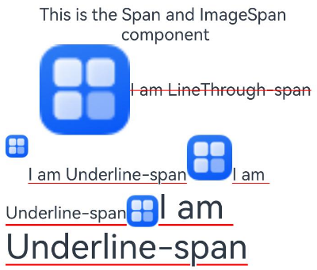

# ImageSpan

[Text](ts-basic-components-text.md)、[ContainerSpan](ts-basic-components-containerspan.md)组件的子组件，用于显示行内图片。

>  **说明：**
>
>  该组件从API Version 10开始支持。后续版本如有新增内容，则采用上角标单独标记该内容的起始版本。


## 子组件

无


## 接口

ImageSpan(value: ResourceStr | PixelMap)

**原子化服务API：** 从API version 11开始，该接口支持在原子化服务中使用。

**系统能力：** SystemCapability.ArkUI.ArkUI.Full

**参数：**

| 参数名 | 参数类型 | 必填 | 参数描述 |
| -------- | -------- | -------- | -------- |
| value | [ResourceStr](ts-types.md#resourcestr) \|&nbsp;[PixelMap](../../apis-image-kit/js-apis-image.md#pixelmap7)&nbsp; | 是 | 图片的数据源，支持本地图片和网络图片。<br/>当使用相对路径引用图片资源时，例如`ImageSpan("common/test.jpg")`，不支持跨包/跨模块调用该ImageSpan组件，建议使用`$r`方式来管理需全局使用的图片资源。<br/>\- 支持的图片格式包括png、jpg、bmp、svg、gif和heif。<br/>\- 支持`Base64`字符串。格式`data:image/[png\|jpeg\|bmp\|webp\|heif];base64,[base64 data]`, 其中`[base64 data]`为`Base64`字符串数据。<br/>\- 支持file:///data/storage路径前缀的字符串，用于读取本应用安装目录下files文件夹下的图片资源。需要保证目录包路径下的文件有可读权限。 |


## 属性

[通用属性](ts-universal-attributes-size.md)方法支持尺寸设置、背景设置、边框设置。

### alt<sup>12+</sup>

alt(value:&nbsp;PixelMap)

设置图片加载时显示的占位图。

**系统能力：** SystemCapability.ArkUI.ArkUI.Full

**参数：** 

| 参数名 | 类型                                                     | 必填 | 说明                                                         |
| ------ | -------------------------------------------------------- | ---- | ------------------------------------------------------------ |
| value  | [PixelMap](../../apis-image-kit/js-apis-image.md#pixelmap7) | 是   | 加载时显示的占位图，支持[PixelMap](../../apis-image-kit/js-apis-image.md#pixelmap7)类型。<br/>默认值：null |

### verticalAlign

verticalAlign(value: ImageSpanAlignment)

设置图片基于文本的对齐方式。

**原子化服务API：** 从API version 11开始，该接口支持在原子化服务中使用。

**系统能力：** SystemCapability.ArkUI.ArkUI.Full

**参数：** 

| 参数名 | 类型                                      | 必填 | 说明                                                         |
| ------ | ----------------------------------------- | ---- | ------------------------------------------------------------ |
| value  | [ImageSpanAlignment](#imagespanalignment) | 是   | 图片基于文本的对齐方式。<br />默认值：ImageSpanAlignment.BOTTOM |

### objectFit

objectFit(value: ImageFit)

设置图片的缩放类型。

**原子化服务API：** 从API version 11开始，该接口支持在原子化服务中使用。

**系统能力：** SystemCapability.ArkUI.ArkUI.Full

**参数：** 

| 参数名 | 类型                                      | 必填 | 说明                                        |
| ------ | ----------------------------------------- | ---- | ------------------------------------------- |
| value  | [ImageFit](ts-appendix-enums.md#imagefit) | 是   | 图片的缩放类型。<br/>默认值：ImageFit.Cover |

### textBackgroundStyle<sup>11+</sup>

textBackgroundStyle(style: TextBackgroundStyle)

设置图片的背景样式。作为[ContainerSpan](ts-basic-components-containerspan.md)的子组件时可以继承它的此属性值，优先使用其自身的此属性。

**原子化服务API：** 从API version 12开始，该接口支持在原子化服务中使用。

**系统能力：** SystemCapability.ArkUI.ArkUI.Full

**参数：** 

| 参数名 | 类型                                                         | 必填 | 说明                                                         |
| ------ | ------------------------------------------------------------ | ---- | ------------------------------------------------------------ |
| style | [TextBackgroundStyle](ts-basic-components-containerspan.md#textbackgroundstyle对象说明) | 是   | 背景样式。<br />默认值:<br /> {<br />  color: Color.Transparent,<br />  radius: 0<br />} |

### baselineOffset<sup>12+</sup>

baselineOffset(value: LengthMetrics)

设置ImageSpan基线的偏移量。此属性与父组件的baselineOffset是共存的。

**系统能力：** SystemCapability.ArkUI.ArkUI.Full

**参数：** 

| 参数名 | 类型                                                         | 必填 | 描述                                                         |
| ------ | ------------------------------------------------------------ | ---- | ------------------------------------------------------------ |
| value  | [LengthMetrics](../js-apis-arkui-graphics.md#lengthmetrics12) | 是   | 设置ImageSpan基线的偏移量，设置该值为百分比时，按默认值显示。<br/>正数内容向上偏移，负数向下偏移。<br/>默认值：0<br/>设置为非0时会导致设置verticalAlign失效。 |

## ImageSpanAlignment

**原子化服务API：** 从API version 11开始，该接口支持在原子化服务中使用。

| 名称     | 描述                           |
| -------- | ------------------------------ |
| TOP      | 图片上边沿与行上边沿对齐。   |
| CENTER   | 图片中间与行中间对齐。       |
| BOTTOM   | 图片下边沿与行下边沿对齐。   |
| BASELINE | 图片下边沿与文本BaseLine对齐。 |

### colorFilter<sup>12+</sup>

colorFilter(value: ColorFilter | DrawingColorFilter)

为图像设置颜色滤镜效果。

**原子化服务API：** 从API version 12开始，该接口支持在原子化服务中使用。

**系统能力：** SystemCapability.ArkUI.ArkUI.Full

**参数：**

| 参数名 | 类型                                    | 必填 | 说明                                                         |
| ------ | --------------------------------------- | ---- | ------------------------------------------------------------ |
| value  | [ColorFilter](ts-types.md#colorfilter9) \| [DrawingColorFilter](../../apis-arkgraphics2d/js-apis-graphics-drawing.md#colorfilter) | 是   | 1. 给图像设置颜色滤镜效果，入参为一个的4x5的RGBA转换矩阵。<br/>矩阵第一行表示R（红色）的向量值，第二行表示G（绿色）的向量值，第三行表示B（蓝色）的向量值，第四行表示A（透明度）的向量值，4行分别代表不同的RGBA的向量值。<br/>当矩阵对角线值为1，其余值为0时，保持图片原有色彩。<br/> **计算规则：**<br/>如果输入的滤镜矩阵为：<br/><br/>像素点为[R, G, B, A]<br/>则过滤后的颜色为 [R’, G’, B’, A’]<br/><br/>2. 支持@ohos.graphics.drawing的ColorFilter类型作为入参。<br/>**说明：** <br/>该接口中的DrawingColorfilter类型支持在原子化服务中使用。其中，svg类型的图源需具有stroke属性。|


## 事件

通用事件仅支持[点击事件](ts-universal-attributes-click.md)。还支持以下事件：

### onComplete<sup>12+</sup>

onComplete(callback: ImageCompleteCallback)

图片数据加载成功和解码成功时均触发该回调，返回成功加载的图片尺寸。

**系统能力：** SystemCapability.ArkUI.ArkUI.Full

**参数：**

| 参数名   | 类型                                       | 必填 | 说明                       |
| -------- | ------------------------------------------ | ---- | -------------------------- |
| callback | [ImageCompleteCallback](#imagecompletecallback12) | 是   | 图片数据加载成功和解码成功时触发的回调。 |

### onError<sup>12+</sup>

onError(callback: ImageErrorCallback)

图片加载异常时触发该回调。

**系统能力：** SystemCapability.ArkUI.ArkUI.Full

**参数：**

| 参数名   | 类型                                       | 必填 | 说明                       |
| -------- | ------------------------------------------ | ---- | -------------------------- |
| callback | [ImageErrorCallback](ts-basic-components-image.md#imageerrorcallback9) | 是   | 图片加载异常时触发的回调。 |

## ImageCompleteCallback<sup>12+</sup>

type ImageCompleteCallback = (result: ImageLoadResult) => void

图片加载异常时触发的回调。

| 参数名 | 类型                       | 必填 | 说明                               |
| ------ | -------------------------- | ---- | ---------------------------------- |
| result  | [ImageLoadResult](#imageloadresult12) | 是   | 图片数据加载成功和解码成功触发回调时返回的对象。 |

## ImageLoadResult<sup>12+</sup>

图片数据加载成功和解码成功触发回调时返回的对象。

| 参数名                       | 类型   | 必填 | 说明                                                         |
| ---------------------------- | ------ | ---- | ------------------------------------------------------------ |
| width                        | number | 是   | 图片的宽。<br/>单位：像素                                    |
| height                       | number | 是   | 图片的高。<br/>单位：像素                                    |
| componentWidth               | number | 是   | 组件的宽。<br/>单位：像素                                    |
| componentHeight              | number | 是   | 组件的高。<br/>单位：像素                                    |
| loadingStatus                | number | 是   | 图片加载成功的状态值。<br/>**说明：**<br/>返回的状态值为0时，表示图片数据加载成功。返回的状态值为1时，表示图片解码成功。 |
| contentWidth   | number | 是   | 图片实际绘制的宽度。<br/>单位：像素<br>**说明：**<br/>仅在loadingStatus返回1时有效。 |
| contentHeight  | number | 是   | 图片实际绘制的高度。<br/>单位：像素<br/>**说明：**<br/>仅在loadingStatus返回1时有效。 |
| contentOffsetX | number | 是   | 实际绘制内容相对于组件自身的x轴偏移。<br/>单位：像素<br/>**说明：**<br/>仅在loadingStatus返回1时有效。 |
| contentOffsetY | number | 是   | 实际绘制内容相对于组件自身的y轴偏移。<br/>单位：像素<br/>**说明：**<br/>仅在loadingStatus返回1时有效。 |


## 示例

### 示例1

该示例实现了设置ImageSpan的基本属性和图片基于文本的对齐方式。

```ts
// xxx.ets
@Entry
@Component
struct SpanExample {
  build() {
    Flex({ direction: FlexDirection.Column, alignItems: ItemAlign.Center, justifyContent: FlexAlign.Center }) {
      Text() {
        Span('This is the Span and ImageSpan component').fontSize(25).textCase(TextCase.Normal)
          .decoration({ type: TextDecorationType.None, color: Color.Pink })
      }.width('100%').textAlign(TextAlign.Center)

      Text() {
        ImageSpan($r('app.media.icon'))
          .width('200px')
          .height('200px')
          .objectFit(ImageFit.Fill)
          .verticalAlign(ImageSpanAlignment.CENTER)
        Span('I am LineThrough-span')
          .decoration({ type: TextDecorationType.LineThrough, color: Color.Red }).fontSize(25)
        ImageSpan($r('app.media.icon'))
          .width('50px')
          .height('50px')
          .verticalAlign(ImageSpanAlignment.TOP)
        Span('I am Underline-span')
          .decoration({ type: TextDecorationType.Underline, color: Color.Red }).fontSize(25)
        ImageSpan($r('app.media.icon'))
          .size({ width: '100px', height: '100px' })
          .verticalAlign(ImageSpanAlignment.BASELINE)
        Span('I am Underline-span')
          .decoration({ type: TextDecorationType.Underline, color: Color.Red }).fontSize(25)
        ImageSpan($r('app.media.icon'))
          .width('70px')
          .height('70px')
          .verticalAlign(ImageSpanAlignment.BOTTOM)
        Span('I am Underline-span')
          .decoration({ type: TextDecorationType.Underline, color: Color.Red }).fontSize(50)
      }
      .width('100%')
      .textIndent(50)
    }.width('100%').height('100%').padding({ left: 0, right: 0, top: 0 })
  }
}
```



### 示例2

该示例实现了如何设置ImageSpan图片的背景样式。

```ts
// xxx.ets
@Component
@Entry
struct Index {
  build() {
    Column() {
      Text() {
        ImageSpan($r('app.media.app_icon'))
          .width('60vp')
          .height('60vp')
          .verticalAlign(ImageSpanAlignment.CENTER)
          .textBackgroundStyle({color: Color.Green, radius: "5vp"})
      }
    }.width('100%').alignItems(HorizontalAlign.Center)
  }
}
```


### 示例3
ImageSpan设置图片成功加载解码和图片加载异常事件回调。
```ts
// xxx.ets
@Entry
@Component
struct Index {
  @State src: ResourceStr = $r('app.media.icon');
  build(){
    Column(){
      Text(){
        ImageSpan(this.src)
          .width(100).height(100)
          .onError((err)=>{
            console.log("onError:" + err.message)
          })
          .onComplete((event)=>{
            console.log("onComplete: " + event.loadingStatus)
          })
      }
    }.width('100%').height('100%')
  }
}
```
### 示例4

该示例实现了给ImageSpan图像设置颜色滤镜效果。

```ts
// xxx.ets
import { drawing, common2D } from '@kit.ArkGraphics2D';

@Entry
@Component
struct SpanExample {
  private ColorFilterMatrix: number[] = [0, 0, 0, 0, 0, 0, 0, 0, 0, 1, 0, 0, 0, 1, 0, 1, 0, 0, 1, 0]
  @State DrawingColorFilterFirst: ColorFilter | undefined = new ColorFilter(this.ColorFilterMatrix)
  private color: common2D.Color = { alpha: 255, red: 255, green: 0, blue: 0 };
  @State DrawingColorFilterSecond: ColorFilter | undefined = undefined

  build() {
    Flex({ direction: FlexDirection.Column, alignItems: ItemAlign.Center, justifyContent: FlexAlign.Center }) {
      Text() {
        ImageSpan($r('app.media.icon'))
          .width('50px')
          .height('50px')
          .colorFilter(this.DrawingColorFilterFirst)
          .onClick(()=>{
            this.DrawingColorFilterFirst = drawing.ColorFilter.createBlendModeColorFilter(this.color, drawing.BlendMode.SRC_IN);
          })
      }
      .width('50%')
      Flex({ direction: FlexDirection.Column, alignItems: ItemAlign.Center, justifyContent: FlexAlign.Center }) {
        Text() {
          ImageSpan($r('app.media.icon'))
            .width('50px')
            .height('50px')
            .colorFilter(this.DrawingColorFilterSecond)
            .onClick(()=>{
              this.DrawingColorFilterSecond = drawing.ColorFilter.createBlendModeColorFilter({ alpha: 255, red: 255, green: 255, blue: 0 }, drawing.BlendMode.SRC);
            })
        }
      .width('50%')
      }.width('100%').height('10%')
    }.width('200%').height('100%')
  }
}
```

