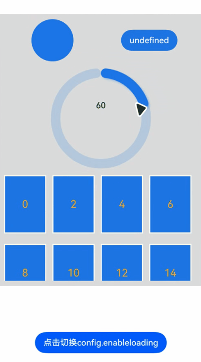

# LoadingProgress

用于显示加载动效的组件。

>  **说明：**
>
> 该组件从API Version 8开始支持。后续版本如有新增内容，则采用上角标单独标记该内容的起始版本。


## 子组件

无


## 接口

LoadingProgress()

创建加载进展组件。

**卡片能力：** 从API version 9开始，该接口支持在ArkTS卡片中使用。

## 属性

除支持[通用属性](ts-universal-attributes-size.md)外，还支持以下属性：

### color

color(value: ResourceColor)

设置加载进度条前景色。

**卡片能力：** 从API version 9开始，该接口支持在ArkTS卡片中使用。

**系统能力：** SystemCapability.ArkUI.ArkUI.Full

**参数：** 

| 参数名 | 类型                                       | 必填 | 说明                                                         |
| ------ | ------------------------------------------ | ---- | ------------------------------------------------------------ |
| value  | [ResourceColor](ts-types.md#resourcecolor) | 是   | 加载进度条的前景色。<br/>默认值：<br/>API version 10及以下：'#99666666'<br/>API version 11及以上：'#ff666666' |

### enableLoading<sup>10+</sup>

enableLoading(value: boolean)

设置LoadingProgress动画显示或者不显示。LoadingProgress动画不显示时，该组件依旧占位。通用属性[Visibility.Hidden](ts-universal-attributes-visibility.md#visibility)隐藏的是包括[border](ts-universal-attributes-border.md#border)、[padding](ts-universal-attributes-size.md#padding)等整个组件范围，而enableLoading=false只隐藏LoadingProgress本身动画内容，不包括border等。

**卡片能力：** 从API version 9开始，该接口支持在ArkTS卡片中使用。

**系统能力：** SystemCapability.ArkUI.ArkUI.Full

**参数：** 

| 参数名 | 类型    | 必填 | 说明                                           |
| ------ | ------- | ---- | ---------------------------------------------- |
| value  | boolean | 是   | LoadingProgress动画是否显示。<br/>默认值：true |

## contentModifier<sup>12+</sup>

contentModifier(modifier: ContentModifier\<LoadingProgressConfiguration>)

定制LoadingProgress内容区的方法。

**系统能力：** SystemCapability.ArkUI.ArkUI.Full

**参数：**

| 参数名 | 类型                                          | 必填 | 说明                                             |
| ------ | --------------------------------------------- | ---- | ------------------------------------------------ |
| modifier  | [ContentModifier\<LoadingProgressConfiguration>](#loadingprogressconfiguration12对象说明) | 是   | 在LoadingProgress组件上，定制内容区的方法。<br/>modifier: 内容修改器，开发者需要自定义class实现ContentModifier接口。 |

## 事件

除支持[通用事件](ts-universal-events-click.md)外，还支持以下事件：

## LoadingProgressConfiguration<sup>12+</sup>对象说明

开发者需要自定义class实现ContentModifier接口。

| 参数名  | 类型    |    默认值      |  说明              |
| ------ | ------ | ------ |-------------------------------- |
| enableloading | boolean | true |LoadingProgress动画是否显示。<br/>默认值：true。 |

## 示例

```ts
// xxx.ets
@Entry
@Component
struct LoadingProgressExample {
  build() {
    Column({ space: 5 }) {
      Text('Orbital LoadingProgress ').fontSize(9).fontColor(0xCCCCCC).width('90%')
      LoadingProgress()
        .color(Color.Blue)
        .layoutWeight(1)
    }.width('100%').margin({ top: 5 })
  }
}
```


## 示例 2

```ts
//该示例自定义LoadingProgress样式，实现了通过按钮切换是否显示LoadingProgress。点击按钮，enableLoading切换为true, 显示LoadingProgress, 再次点击按钮，enableLoading切换为false, 不显示LoadingProgress。
// xxx.ets
import hilog from '@ohos.hilog'


class MyLoadingProgressStyle implements ContentModifier<LoadingProgressConfiguration> {
  enableLoading: boolean = false

  constructor(enableLoading: boolean) {
    this.enableLoading = enableLoading
  }

  applyContent(): WrappedBuilder<[LoadingProgressConfiguration]> {
    return wrapBuilder(buildLoadingProgress)
  }
}


@Builder
function buildLoadingProgress(config: LoadingProgressConfiguration) {
  Column() {
    LoadingProgress().color('#2577e3').size({ width: 200 }).enableLoading((config.contentModifier as MyLoadingProgressStyle).enableLoading)
    Text(JSON.stringify((config.contentModifier as MyLoadingProgressStyle).enableLoading))
  }
}


@Entry
@Component
struct LoadingProgressExample {
  @State loadingProgressList: (boolean | undefined | null)[] = [false, true]
  @State loadingProgressIndex: number = 0
  @State clickFlag: number = 0

  build() {
    Column({ space: 5 }) {
      //LoadingProgress支持通过样式Builder定制内容区
      LoadingProgress()
        .color('#106836')
        .contentModifier(new MyLoadingProgressStyle(this.loadingProgressList[this.loadingProgressIndex]))
      Text(this.clickFlag > 0 ? 'enableLoading:' + this.loadingProgressList[this.loadingProgressIndex] : '')
      Button('点击切换enableLoading').onClick(() => {
        this.clickFlag++
        this.loadingProgressIndex = (this.loadingProgressIndex + 1) % this.loadingProgressList.length
        console.log('enableLoading:' + this.loadingProgressList[this.loadingProgressIndex])
      })
    }.width('100%').margin({ top: 5 })
  }
}
```
