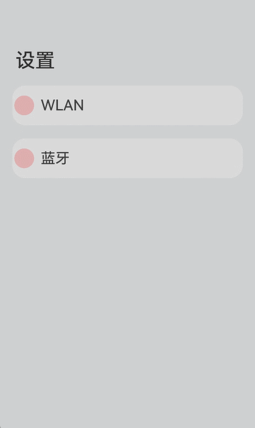

# NavRouter

导航组件，默认提供点击响应处理，不需要开发者自定义点击事件逻辑。

> **说明：**
>
> 该组件从API Version 9开始支持。后续版本如有新增内容，则采用上角标单独标记该内容的起始版本。

## 子组件

必须包含两个子组件，其中第二个子组件必须为[NavDestination](ts-basic-components-navdestination.md)。

> **说明：**
>
> 子组件个数异常时：
> 1. 有且仅有1个时，触发路由到NavDestination的能力失效。
> 2. 有且仅有1个时，且使用NavDestination场景下，不进行路由。
> 3. 大于2个时，后续的子组件不显示。
> 4. 第二个子组件不为NavDestination时，触发路由功能失效。

## 接口

### NavRouter

NavRouter()

**原子化服务API：** 从API version 11开始，该接口支持在原子化服务中使用。

### NavRouter<sup>10+</sup>

NavRouter(value: RouteInfo)

提供路由信息，指定点击NavRouter时，要跳转的NavDestination页面。

**原子化服务API：** 从API version 11开始，该接口支持在原子化服务中使用。

**参数：**

| 参数名     | 类型                                | 必填   | 说明          |
| ------- | ----------------------------------- | ---- | ------------- |
| value   | [RouteInfo](#routeinfo10对象说明) | 否    | 路由信息 |

## 属性

除支持[通用属性](ts-universal-attributes-size.md)外，还支持以下属性：

### mode<sup>10+</sup>

mode(mode: NavRouteMode)

设置指定点击NavRouter跳转到NavDestination页面时，使用的路由模式。

**原子化服务API：** 从API version 11开始，该接口支持在原子化服务中使用。

**系统能力：** SystemCapability.ArkUI.ArkUI.Full

**参数：** 

| 参数名                           | 类型                                     | 必填                                   | 说明                                       |
| ----------------------------- | ---------------------------------------- | ---------------------------------------- | ---------------------------------------- |
| mode                  | [NavRouteMode](#navroutemode枚举类型说明)                                  | 是                                 | 指定点击NavRouter跳转到NavDestination页面时，使用的路由模式。<br/>默认值：NavRouteMode.PUSH_WITH_RECREATE |

## RouteInfo<sup>10+</sup>对象说明

**原子化服务API：** 从API version 11开始，该接口支持在原子化服务中使用。

| 名称                 | 类型                                                     | 必填 | 说明                                                         |
| -------------------- | ------------------------------------------------------------ | ---- | ------------------------------------------------------------ |
| name             | string            | 是   | 点击NavRouter跳转到的NavDestination页面的名称。 |
| param             | unknown            | 否   | 点击NavRouter跳转到NavDestination页面时，传递的参数。 |

## NavRouteMode枚举类型说明

**原子化服务API：** 从API version 11开始，该接口支持在原子化服务中使用。

| 名称    | 描述               |
| ----- | ---------------- |
| PUSH_WITH_RECREATE | 跳转到新的NavDestination页面时，替换当前显示的NavDestination页面，页面销毁，但该页面信息仍保留在路由栈中。 |
| PUSH   | 跳转到新的NavDestination页面时，覆盖当前显示的NavDestination页面，该页面不销毁，且页面信息保留在路由栈中。 |
| REPLACE   | 跳转到新的NavDestination页面时，替换当前显示的NavDestination页面，页面销毁，且该页面信息从路由栈中清除。 |

## 事件

### onStateChange

onStateChange(callback: (isActivated: boolean) => void)

组件激活状态切换时触发该回调。开发者点击激活NavRouter，加载对应的NavDestination子组件时，回调onStateChange(true)。NavRouter对应的NavDestination子组件不再显示时，回调onStateChange(false)。

**原子化服务API：** 从API version 11开始，该接口支持在原子化服务中使用。

**系统能力：** SystemCapability.ArkUI.ArkUI.Full

**参数：** 

| 参数名      | 类型    | 必填 | 描述                                    |
| ----------- | ------- | ---- | --------------------------------------- |
| isActivated | boolean | 是   | isActivated为true时表示激活，为false时表示未激活。 |

## 示例

```ts
// xxx.ets
@Entry
@Component
struct NavRouterExample {
  @State isActiveWLAN: boolean = false
  @State isActiveBluetooth: boolean = false

  build() {
    Navigation() {
      NavRouter() {
        Row() {
          Row()
            .width(30)
            .height(30)
            .borderRadius(30)
            .margin({ left: 3, right: 10 })
            .backgroundColor(Color.Pink)
          Text(`WLAN`)
            .fontSize(22)
            .fontWeight(500)
            .textAlign(TextAlign.Center)
        }
        .width('90%')
        .height(60)

        NavDestination() {
          Flex({ direction: FlexDirection.Row }) {
            Text('未找到可用WLAN').fontSize(30).padding({ left: 15 })
          }
        }.title("WLAN")
      }
      .margin({ top: 10, bottom: 10 })
      .backgroundColor(this.isActiveWLAN ? '#ccc' : '#fff')
      .borderRadius(20)
      .mode(NavRouteMode.PUSH_WITH_RECREATE)
      .onStateChange((isActivated: boolean) => {
        this.isActiveWLAN = isActivated
      })

      NavRouter() {
        Row() {
          Row()
            .width(30)
            .height(30)
            .borderRadius(30)
            .margin({ left: 3, right: 10 })
            .backgroundColor(Color.Pink)
          Text(`蓝牙`)
            .fontSize(22)
            .fontWeight(500)
            .textAlign(TextAlign.Center)
        }
        .width('90%')
        .height(60)

        NavDestination() {
          Flex({ direction: FlexDirection.Row }) {
            Text('未找到可用蓝牙').fontSize(30).padding({ left: 15 })
          }
        }.title("蓝牙")
      }
      .margin({ top: 10, bottom: 10 })
      .backgroundColor(this.isActiveBluetooth ? '#ccc' : '#fff')
      .borderRadius(20)
      .mode(NavRouteMode.REPLACE)
      .onStateChange((isActivated: boolean) => {
        this.isActiveBluetooth = isActivated
      })
    }
    .height('100%')
    .width('100%')
    .title('设置')
    .backgroundColor("#F2F3F5")
    .titleMode(NavigationTitleMode.Free)
    .mode(NavigationMode.Auto)
  }
}
```

