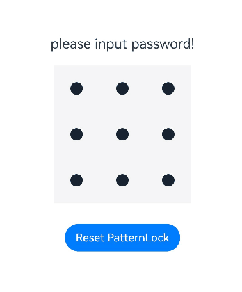

# PatternLock

图案密码锁组件，以九宫格图案的方式输入密码，用于密码验证场景。手指在PatternLock组件区域按下时开始进入输入状态，手指离开屏幕时结束输入状态完成密码输入。

>  **说明：** 
>
> 该组件从API Version 9开始支持。后续版本如有新增内容，则采用上角标单独标记该内容的起始版本。

## 子组件

无

##  接口

PatternLock(controller?: PatternLockController)

**原子化服务API：** 从API version 12开始，该接口支持在原子化服务中使用。

**系统能力：** SystemCapability.ArkUI.ArkUI.Full

**参数：** 

| 参数名     | 类型                                        | 必填 | 说明 |
| ---------- | ----------------------------------------------- | ---- | ------------------------------------------------------------ |
| controller | [PatternLockController](#patternlockcontroller) | 否   | 设置PatternLock组件控制器，可用于控制组件状态重置。       |

## 属性

除支持[通用属性](ts-universal-attributes-size.md)外，还支持以下属性：

### sideLength

sideLength(value: Length)

设置组件的宽度和高度（宽高相同）。设置为0或负数时组件不显示。

**原子化服务API：** 从API version 12开始，该接口支持在原子化服务中使用。

**系统能力：** SystemCapability.ArkUI.ArkUI.Full

**参数：** 

| 参数名 | 类型                         | 必填 | 说明               |
| ------ | ---------------------------- | ---- | ------------------ |
| value  | [Length](ts-types.md#length) | 是   | 组件的宽度和高度。默认值：288vp |

### circleRadius

circleRadius(value: Length)

设置宫格中圆点的半径。设置为0或负数时取默认值。

**原子化服务API：** 从API version 12开始，该接口支持在原子化服务中使用。

**系统能力：** SystemCapability.ArkUI.ArkUI.Full

**参数：** 

| 参数名 | 类型                         | 必填 | 说明                               |
| ------ | ---------------------------- | ---- | ---------------------------------- |
| value  | [Length](ts-types.md#length) | 是   | 宫格中圆点的半径。<br/>默认值：6vp<br/>取值范围：(0, sideLength/11]，设置小于等于0的值时按默认值处理，超过最大值按最大值处理。 |

### backgroundColor
backgroundColor(value: ResourceColor)

设置背景颜色

**原子化服务API：** 从API version 12开始，该接口支持在原子化服务中使用。

**系统能力：** SystemCapability.ArkUI.ArkUI.Full

| 参数名 | 类型                                       | 必填 | 说明                                                       |
| ------ | ------------------------------------------ | ---- | ---------------------------------------------------------- |
| value  | [ResourceColor](ts-types.md#resourcecolor) | 是   | 背景颜色 |

### regularColor

regularColor(value: ResourceColor)

设置宫格圆点在“未选中”状态的填充颜色。

**原子化服务API：** 从API version 12开始，该接口支持在原子化服务中使用。

**系统能力：** SystemCapability.ArkUI.ArkUI.Full

**参数：** 

| 参数名 | 类型                                       | 必填 | 说明                                                       |
| ------ | ------------------------------------------ | ---- | ---------------------------------------------------------- |
| value  | [ResourceColor](ts-types.md#resourcecolor) | 是   | 宫格圆点在“未选中”状态的填充颜色。<br/>默认值：'#ff182431' |

### selectedColor

selectedColor(value: ResourceColor)

设置宫格圆点在“选中“状态的填充颜色。

**原子化服务API：** 从API version 12开始，该接口支持在原子化服务中使用。

**系统能力：** SystemCapability.ArkUI.ArkUI.Full

**参数：** 

| 参数名 | 类型                                       | 必填 | 说明                                                     |
| ------ | ------------------------------------------ | ---- | -------------------------------------------------------- |
| value  | [ResourceColor](ts-types.md#resourcecolor) | 是   | 宫格圆点在“选中”状态的填充颜色。<br/>默认值：'#ff182431' |

### activeColor

activeColor(value: ResourceColor)

设置宫格圆点在“激活”状态的填充颜色，“激活”状态为手指经过圆点但还未选中的状态。

**原子化服务API：** 从API version 12开始，该接口支持在原子化服务中使用。

**系统能力：** SystemCapability.ArkUI.ArkUI.Full

**参数：** 

| 参数名 | 类型                                       | 必填 | 说明                                                     |
| ------ | ------------------------------------------ | ---- | -------------------------------------------------------- |
| value  | [ResourceColor](ts-types.md#resourcecolor) | 是   | 宫格圆点在“激活”状态的填充颜色。<br/>默认值：'#ff182431' |

### pathColor

pathColor(value: ResourceColor)

设置连线的颜色。

**原子化服务API：** 从API version 12开始，该接口支持在原子化服务中使用。

**系统能力：** SystemCapability.ArkUI.ArkUI.Full

**参数：** 

| 参数名 | 类型                                       | 必填 | 说明                                 |
| ------ | ------------------------------------------ | ---- | ------------------------------------ |
| value  | [ResourceColor](ts-types.md#resourcecolor) | 是   | 连线的颜色。<br/>默认值：'#33182431' |

### pathStrokeWidth

pathStrokeWidth(value: number | string)

设置连线的宽度。设置为0或负数时连线不显示。

**原子化服务API：** 从API version 12开始，该接口支持在原子化服务中使用。

**系统能力：** SystemCapability.ArkUI.ArkUI.Full

**参数：** 

| 参数名 | 类型                       | 必填 | 说明                          |
| ------ | -------------------------- | ---- | ----------------------------- |
| value  | number&nbsp;\|&nbsp;string | 是   | 连线的宽度。<br/>默认值：12vp<br/>取值范围：[0, sideLength/3]，超过最大值按最大值处理。 |

### autoReset

autoReset(value: boolean)

设置在完成密码输入后再次在组件区域按下时是否重置组件状态。

**原子化服务API：** 从API version 12开始，该接口支持在原子化服务中使用。

**系统能力：** SystemCapability.ArkUI.ArkUI.Full

**参数：** 

| 参数名 | 类型    | 必填 | 说明                                                         |
| ------ | ------- | ---- | ------------------------------------------------------------ |
| value  | boolean | 是   | 在完成密码输入后再次在组件区域按下时是否重置组件状态。<br/>为true时，完成密码输入后再次在组件区域按下时会重置组件状态（即清除之前输入的密码）；为false时，不会重置组件状态。<br/>默认值：true |

### activateCircleStyle<sup>12+</sup>

activateCircleStyle(options: Optional\<CircleStyleOptions\>)

设置宫格圆点在“激活”状态的背景圆环样式。

**原子化服务API：** 从API version 12开始，该接口支持在原子化服务中使用。

**系统能力：** SystemCapability.ArkUI.ArkUI.Full

**参数：** 

| 参数名 | 类型    | 必填 | 说明                                                         |
| ------ | ------- | ---- | ------------------------------------------------------------ |
| options  | [CircleStyleOptions](#circlestyleoptions12对象说明) | 是   | 宫格圆点在“激活”状态的背景圆环样式。|

## CircleStyleOptions<sup>12+</sup>对象说明

**原子化服务API：** 从API version 12开始，该接口支持在原子化服务中使用。

**系统能力：** SystemCapability.ArkUI.ArkUI.Full


| 名称          | 类型 | 必填 | 说明 |
| ------------- | ------- | ---- | -------- |
| color | [ResourceColor](ts-types.md#resourcecolor) | 否 | 背景圆环颜色。 <br/>默认值：与pathColor值相同 |
| radius  | [LengthMetrics](../js-apis-arkui-graphics.md#lengthmetrics12) | 否 | 背景圆环的半径。<br/>默认值：circleRadius的11/6 |
| enableWaveEffect | boolean | 否 | 波浪效果开关。<br/>默认值：true |

## 事件

除支持[通用事件](ts-universal-events-click.md)外，还支持以下事件：

### onPatternComplete

onPatternComplete(callback: (input: Array\<number\>) => void)

密码输入结束时触发该回调。

**原子化服务API：** 从API version 12开始，该接口支持在原子化服务中使用。

**系统能力：** SystemCapability.ArkUI.ArkUI.Full

**参数：** 

| 参数名 | 类型            | 必填 | 说明                                                         |
| ------ | --------------- | ---- | ------------------------------------------------------------ |
| input  | Array\<number\> | 是   | 与选中宫格圆点顺序一致的数字数组，数字为选中宫格圆点的索引值（第一行圆点从左往右依次为0、1、2，第二行圆点依次为3、4、5，第三行圆点依次为6、7、8）。 |

### onDotConnect<sup>11+</sup>

onDotConnect(callback: [Callback](../../apis-basic-services-kit/js-apis-base.md#callback)\<number\>)

密码输入选中宫格圆点时触发该回调。

回调参数为选中宫格圆点顺序的数字，数字为选中宫格圆点的索引值（第一行圆点从左往右依次为0、1、2，第二行圆点依次为3、4、5，第三行圆点依次为6、7、8）。

**原子化服务API：** 从API version 12开始，该接口支持在原子化服务中使用。

**系统能力：** SystemCapability.ArkUI.ArkUI.Full

## PatternLockController

PatternLock组件的控制器，可以通过它进行组件状态重置。

### 导入对象

```typescript
let patternLockController: PatternLockController = new PatternLockController()
```

### constructor

constructor()

PatternLockController的构造函数。

**原子化服务API：** 从API version 12开始，该接口支持在原子化服务中使用。

**系统能力：** SystemCapability.ArkUI.ArkUI.Full

### reset

reset()

重置组件状态。

**原子化服务API：** 从API version 12开始，该接口支持在原子化服务中使用。

**系统能力：** SystemCapability.ArkUI.ArkUI.Full

### setChallengeResult<sup>11+</sup>

setChallengeResult(result: PatternLockChallengeResult): void

用于设置图案密码正确或错误状态。

**原子化服务API：** 从API version 12开始，该接口支持在原子化服务中使用。

**系统能力：** SystemCapability.ArkUI.ArkUI.Full

| 名称   | 类型                                                         | 必填 | 说明           |
| ------ | ------------------------------------------------------------ | ---- | -------------- |
| result | [PatternLockChallengeResult](#patternlockchallengeresult11枚举说明) | 是   | 图案密码状态。 |

## PatternLockChallengeResult<sup>11+</sup>枚举说明

**原子化服务API：** 从API version 12开始，该接口支持在原子化服务中使用。

**系统能力：** SystemCapability.ArkUI.ArkUI.Full

| 名称    | 说明           |
| ------- | -------------- |
| CORRECT | 图案密码正确。 |
| WRONG   | 图案密码错误。 |

##  示例

该示例展示了PatternLock组件的基本使用方法。通过sideLength设置九宫格的大小、circleRadius等属性设置宫格圆点样式、onPatternComplete属性设置密码输入时的回调。 

当用户密码输入完成后，按输入的密码不同，给予不同的回应：输入的密码长度小于5时，提示重新输入；第一次输入完成后，提示第二次输入密码；第二次输入完成后，判断两次输入的密码是否相同，相同则提示密码设置成功，否则提示重新输入。 

通过'Reset PatternLock'按钮，用户可以重置密码锁。

```ts
// xxx.ets
import { LengthUnit } from '@kit.ArkUI'

@Entry
@Component
struct PatternLockExample {
  @State passwords: Number[] = []
  @State message: string = 'please input password!'
  private patternLockController: PatternLockController = new PatternLockController()

  build() {
    Column() {
      Text(this.message).textAlign(TextAlign.Center).margin(20).fontSize(20)
      PatternLock(this.patternLockController)
        .sideLength(200)
        .circleRadius(9)
        .pathStrokeWidth(18)
        .activeColor('#B0C4DE')
        .selectedColor('#228B22')
        .pathColor('#90EE90')
        .backgroundColor('#F5F5F5')
        .autoReset(true)
        .activateCircleStyle({
          color: '#90EE90',
          radius: { value: 16, unit: LengthUnit.VP },
          enableWaveEffect: true
        })
        .onDotConnect((index: number) => {
          console.log("onDotConnect index: " + index)
        })
        .onPatternComplete((input: Array<number>) => {
          // 输入的密码长度小于5时，提示重新输入
          if (input.length < 5) {
            this.message = 'The password length needs to be greater than 5, please enter again.'
            return
          }
          // 判断密码长度是否大于0
          if (this.passwords.length > 0) {
            // 判断两次输入的密码是否相同，相同则提示密码设置成功，否则提示重新输入
            if (this.passwords.toString() === input.toString()) {
              this.passwords = input
              this.message = 'Set password successfully: ' + this.passwords.toString()
              this.patternLockController.setChallengeResult(PatternLockChallengeResult.CORRECT)
            } else {
              this.message = 'Inconsistent passwords, please enter again.'
              this.patternLockController.setChallengeResult(PatternLockChallengeResult.WRONG)
            }
          } else {
            // 提示第二次输入密码
            this.passwords = input
            this.message = "Please enter again."
          }
        })
      Button('Reset PatternLock').margin(30).onClick(() => {
        // 重置密码锁
        this.patternLockController.reset()
        this.passwords = []
        this.message = 'Please input password'
      })
    }.width('100%').height('100%')
  }
}
```


