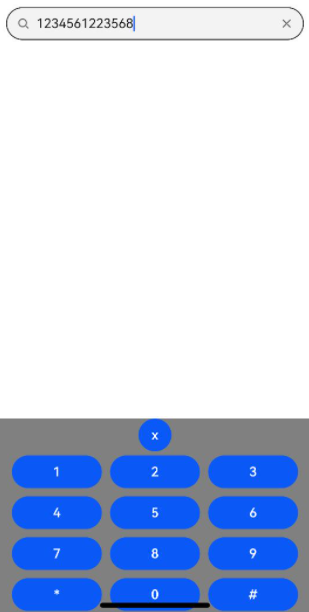
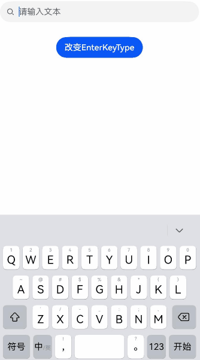

#  Search

搜索框组件，适用于浏览器的搜索内容输入框等应用场景。

> **说明：**
>
> 该组件从API Version 8开始支持。后续版本如有新增内容，则采用上角标单独标记该内容的起始版本。

## 子组件

无

## 接口

Search(options?: { value?: string, placeholder?: ResourceStr, icon?: string, controller?: SearchController })

**参数:**

| 参数名      | 参数类型                                             | 必填 | 参数描述                                                     |
| ----------- | ---------------------------------------------------- | ---- | ------------------------------------------------------------ |
| value       | string                                               | 否   | 设置当前显示的搜索文本内容。<br />从API version 10开始，该参数支持[$$](../../../quick-start/arkts-two-way-sync.md)双向绑定变量。 |
| placeholder | [ResourceStr](ts-types.md#resourcestr)<sup>10+</sup> | 否   | 设置无输入时的提示文本。                                     |
| icon        | string                                               | 否   | 设置搜索图标路径，默认使用系统搜索图标。<br/>**说明：** <br/>icon的数据源支持本地图片和网络图片。<br/>-&nbsp;支持的图片格式包括png、jpg、bmp、svg、gif和pixelmap。<br/>-&nbsp;支持Base64字符串。格式data:image/[png\|jpeg\|bmp\|webp];base64,[base64 data], 其中[base64 data]为Base64字符串数据。<br/>如果与属性searchIcon同时设置，则searchIcon优先。 |
| controller  | [SearchController](#searchcontroller) | 否   | 设置Search组件控制器。                                       |

## 属性

除支持[通用属性](ts-universal-attributes-size.md)外，还支持以下属性：

### searchButton

searchButton(value: string, option?: SearchButtonOptions)

设置搜索框末尾搜索按钮。

**系统能力：** SystemCapability.ArkUI.ArkUI.Full

**参数：** 

| 参数名 | 类型                                                  | 必填 | 说明                         |
| ------ | ----------------------------------------------------- | ---- | ---------------------------- |
| value  | string                                                | 是   | 搜索框末尾搜索按钮文本内容。 |
| option | [SearchButtonOptions](#searchbuttonoptions10对象说明) | 否   | 配置搜索框文本样式。<br />默认值：<br />{<br />fontSize: '16fp',<br />color: '#ff3f97e9'<br />}         |

### placeholderColor

placeholderColor(value: ResourceColor)

设置placeholder文本颜色。

**系统能力：** SystemCapability.ArkUI.ArkUI.Full

**参数：** 

| 参数名 | 类型                                       | 必填 | 说明                                             |
| ------ | ------------------------------------------ | ---- | ------------------------------------------------ |
| value  | [ResourceColor](ts-types.md#resourcecolor) | 是   | placeholder文本颜色。<br />默认值：'#99182431'。 |

### placeholderFont

placeholderFont(value?: Font)

设置placeholder文本样式，包括字体大小，字体粗细，字体族，字体风格。目前仅支持默认字体族。

**系统能力：** SystemCapability.ArkUI.ArkUI.Full

**参数：** 

| 参数名 | 类型                     | 必填 | 说明                  |
| ------ | ------------------------ | ---- | --------------------- |
| value  | [Font](ts-types.md#font) | 否   | placeholder文本样式。 |

### textFont

textFont(value?: Font)

设置搜索框内输入文本样式，包括字体大小，字体粗细，字体族，字体风格。目前仅支持默认字体族。

**系统能力：** SystemCapability.ArkUI.ArkUI.Full

**参数：** 

| 参数名 | 类型                     | 必填 | 说明                   |
| ------ | ------------------------ | ---- | ---------------------- |
| value  | [Font](ts-types.md#font) | 否   | 搜索框内输入文本样式。 |

### textAlign

textAlign(value: TextAlign)

设置文本在搜索框中的对齐方式。目前支持的对齐方式有：Start、Center、End。

**系统能力：** SystemCapability.ArkUI.ArkUI.Full

**参数：** 

| 参数名 | 类型                                        | 必填 | 说明                                                   |
| ------ | ------------------------------------------- | ---- | ------------------------------------------------------ |
| value  | [TextAlign](ts-appendix-enums.md#textalign) | 是   | 文本在搜索框中的对齐方式。<br/>默认值：TextAlign.Start |

### copyOption<sup>9+</sup>

copyOption(value: CopyOptions)

设置输入的文本是否可复制。设置CopyOptions.None时，当前Search中的文字无法被复制或剪切，仅支持粘贴。

copyOption对于拖拽，只限制是否选中，不涉及拖拽范围。

**系统能力：** SystemCapability.ArkUI.ArkUI.Full

**参数：** 

| 参数名 | 类型                                             | 必填 | 说明                                                         |
| ------ | ------------------------------------------------ | ---- | ------------------------------------------------------------ |
| value  | [CopyOptions](ts-appendix-enums.md#copyoptions9) | 是   | 输入的文本是否可复制。<br />默认值：CopyOptions.LocalDevice，支持设备内复制。 |

### searchIcon<sup>10+</sup>

searchIcon(value: IconOptions)

设置左侧搜索图标样式。

**系统能力：** SystemCapability.ArkUI.ArkUI.Full

**参数：** 

| 参数名 | 类型                                  | 必填 | 说明               |
| ------ | ------------------------------------- | ---- | ------------------ |
| value  | [IconOptions](#iconoptions10对象说明) | 是   | 左侧搜索图标样式。<br />默认值：<br />{<br />fontSize: '16vp',<br />color: '#99ffffff',<br />src: ' '<br />} |

### cancelButton<sup>10+</sup>

cancelButton(value: { style?: CancelButtonStyle, icon?: IconOptions })

设置右侧清除按钮样式。

**系统能力：** SystemCapability.ArkUI.ArkUI.Full

**参数：** 

| 参数名 | 类型                                                         | 必填 | 说明                                                         |
| ------ | ------------------------------------------------------------ | ---- | ------------------------------------------------------------ |
| value  | {&nbsp;style:?&nbsp;[CancelButtonStyle](#cancelbuttonstyle10枚举说明),&nbsp;icon:?&nbsp;[IconOptions](#iconoptions10对象说明)&nbsp;} | 是   | 右侧清除按钮样式。<br />style：右侧图标显示状态。<br/>icon：右侧图标。<br>默认值：<br />{<br/>style：CancelButtonStyle.INPUT,<br/>icon:&nbsp;{<br/>size: '16vp',<br/>color: '#99ffffff',<br/>src: ' '<br/>}<br/>}<br/>当style为CancelButtonStyle.CONSTANT时，默认显示清除样式。 |

### fontColor<sup>10+</sup>

fontColor(value: ResourceColor)

设置输入文本的字体颜色。[文本通用属性](ts-universal-attributes-text-style.md)fontSize、fontStyle、fontWeight和fontFamily在[textFont](#textfont)属性中设置。

**系统能力：** SystemCapability.ArkUI.ArkUI.Full

**参数：** 

| 参数名 | 类型                                       | 必填 | 说明                                            |
| ------ | ------------------------------------------ | ---- | ----------------------------------------------- |
| value  | [ResourceColor](ts-types.md#resourcecolor) | 是   | 输入文本的字体颜色。<br />默认值：'#FF182431'。 |

### caretStyle<sup>10+</sup>

caretStyle(value: CaretStyle)

设置光标样式。

**系统能力：** SystemCapability.ArkUI.ArkUI.Full

**参数：** 

| 参数名 | 类型                                | 必填 | 说明                                                         |
| ------ | ----------------------------------- | ---- | ------------------------------------------------------------ |
| value  | [CaretStyle](#caretstyle10对象说明) | 是   | 光标样式。<br />默认值：<br />{<br />width: '1.5vp',<br />color: '#007DFF'<br />} |

>  **说明：**     
>   从API version 12开始，此接口支持设置文本手柄颜色和文本选中底板颜色，光标、文本手柄和文本选中底板颜色保持一致。<br/>文本手柄透明度为设置透明度，文本选中底板透明度，默认20%，如果设置透明度，文本选中底板颜色透明度在设置色透明度的基础上再叠加20%。例如，设置透明度50%，文本选中底板颜色透明度为10%。

### enableKeyboardOnFocus<sup>10+</sup>

enableKeyboardOnFocus(value: boolean)

设置Search通过点击以外的方式获焦时，是否绑定输入法。

从API version 10开始，获焦默认绑定输入法。

**系统能力：** SystemCapability.ArkUI.ArkUI.Full

**参数：** 

| 参数名 | 类型    | 必填 | 说明                                            |
| ------ | ------- | ---- | ----------------------------------------------- |
| value  | boolean | 是   | Search获焦时，是否绑定输入法<br/>默认值：true。 |

### selectionMenuHidden<sup>10+</sup>

selectionMenuHidden(value: boolean)

设置长按输入框或者右键输入框时，是否弹出文本选择菜单。

**系统能力：** SystemCapability.ArkUI.ArkUI.Full

**参数：** 

| 参数名 | 类型    | 必填 | 说明                                                         |
| ------ | ------- | ---- | ------------------------------------------------------------ |
| value  | boolean | 是   | 长按输入框或者右键输入框时，是否弹出文本选择菜单。<br />默认值：false |

### customKeyboard<sup>10+</sup>

customKeyboard(value: CustomBuilder, options?: KeyboardOptions)

设置自定义键盘。

当设置自定义键盘时，输入框激活后不会打开系统输入法，而是加载指定的自定义组件。

自定义键盘的高度可以通过自定义组件根节点的height属性设置，宽度不可设置，使用系统默认值。

自定义键盘采用覆盖原始界面的方式呈现，不会对应用原始界面产生压缩或者上提。

自定义键盘无法获取焦点，但是会拦截手势事件。

默认在输入控件失去焦点时，关闭自定义键盘，开发者也可以通过[stopEditing](#stopediting10)方法控制键盘关闭。

如果设备支持拍摄输入，设置自定义键盘后，该输入框会不支持拍摄输入。

**系统能力：** SystemCapability.ArkUI.ArkUI.Full

**参数：**

| 参数名                | 类型                                        | 必填 | 说明                             |
| --------------------- | ------------------------------------------- | ---- | -------------------------------- |
| value                 | [CustomBuilder](ts-types.md#custombuilder8) | 是   | 自定义键盘。                     |
| options<sup>12+</sup> | [KeyboardOptions](#keyboardoptions12)       | 否   | 设置自定义键盘是否支持避让功能。 |

### type<sup>11+</sup>

type(value: SearchType)

设置输入框类型。

**系统能力：** SystemCapability.ArkUI.ArkUI.Full

**参数：**

| 参数名 | 类型                                | 必填 | 说明                        |
| ------ | ----------------------------------- | ---- | -------------------------- |
| value  | [SearchType](#searchtype11枚举说明) | 是   | 输入框类型。<br/>默认值：SearchType.Normal |

### maxLength<sup>11+</sup>

maxLength(value: number)

设置文本的最大输入字符数。默认不设置最大输入字符数限制。到达文本最大字符限制，将无法继续输入字符。

**系统能力：** SystemCapability.ArkUI.ArkUI.Full

**参数：**

| 参数名 | 类型                                | 必填 | 说明                   |
| ------ | ----------------------------------- | ---- | ---------------------- |
| value  | number | 是   | 文本的最大输入字符数。 |

### enterKeyType<sup>12+</sup>

enterKeyType(value: EnterKeyType)

设置输入法回车键类型。

**系统能力：** SystemCapability.ArkUI.ArkUI.Full

**参数：**

| 参数名 | 类型                                             | 必填 | 说明                                               |
| ------ | ------------------------------------------------ | ---- | -------------------------------------------------- |
| value  | [EnterKeyType](ts-types.md#enterkeytype枚举说明) | 是   | 输入法回车键类型。<br/>默认值：EnterKeyType.Search |

### lineHeight<sup>12+</sup>

lineHeight(value: number | string | Resource)

设置文本的文本行高，设置值不大于0时，不限制文本行高，自适应字体大小，number类型时单位为fp。

**系统能力：** SystemCapability.ArkUI.ArkUI.Full

**参数：**

| 参数名 | 类型                                                         | 必填 | 说明             |
| ------ | ------------------------------------------------------------ | ---- | ---------------- |
| value  | number&nbsp;\|&nbsp;string&nbsp;\|&nbsp;[Resource](ts-types.md#resource) | 是   | 文本的文本行高。 |

### decoration<sup>12+</sup>

decoration(value: TextDecorationOptions)

设置文本装饰线样式及其颜色。

**系统能力：** SystemCapability.ArkUI.ArkUI.Full

**参数：**

| 参数名 | 类型                                                         | 必填 | 说明                                                         |
| ------ | ------------------------------------------------------------ | ---- | ------------------------------------------------------------ |
| value  | [TextDecorationOptions](#textdecorationoptions12对象说明) | 是   | 文本装饰线样式及其颜色。<br />默认值：{<br/>type:&nbsp;TextDecorationType.None,<br/>color：Color.Black<br/>} |

### letterSpacing<sup>12+</sup>

letterSpacing(value: number | string | Resource)

设置文本字符间距。设置该值为百分比时，按默认值显示。设置该值为0时，按默认值显示。

当取值为负值时，文字会发生压缩，负值过小时会将组件内容区大小压缩为0，导致无内容显示。

**系统能力：** SystemCapability.ArkUI.ArkUI.Full

**参数：**

| 参数名 | 类型                       | 必填 | 说明           |
| ------ | -------------------------- | ---- | -------------- |
| value  | number&nbsp;\|&nbsp;string&nbsp;\|&nbsp;[Resource](ts-types.md#resource) | 是   | 文本字符间距。 |

### fontFeature<sup>12+</sup>

fontFeature(value: string)

设置文字特性效果，比如数字等宽的特性。

格式为：normal \| \<feature-tag-value\>

\<feature-tag-value\>的格式为：\<string\> \[ \<integer\> \| on \| off ]

\<feature-tag-value\>的个数可以有多个，中间用','隔开。

例如，使用等宽数字的输入格式为："ss01" on。

**系统能力：** SystemCapability.ArkUI.ArkUI.Full

**参数：** 

| 参数名 | 类型   | 必填 | 说明           |
| ------ | ------ | ---- | -------------- |
| value  | string | 是   | 文字特性效果。 |

设置 Font Feature 属性，Font Feature 是 OpenType 字体的高级排版能力，如支持连字、数字等宽等特性，一般用在自定义字体中，其能力需要字体本身支持。
更多 Font Feature 能力介绍可参考 https://www.w3.org/TR/css-fonts-3/#font-feature-settings-prop 和 https://sparanoid.com/lab/opentype-features/

## IconOptions<sup>10+</sup>对象说明

| 参数名 | 参数类型                                   | 必填 | 参数描述    |
| ------ | ------------------------------------------ | ---- | ----------- |
| size   | [Length](ts-types.md#length)               | 否   | 图标尺寸，不支持百分比。    |
| color  | [ResourceColor](ts-types.md#resourcecolor) | 否   | 图标颜色。    |
| src    | [ResourceStr](ts-types.md#resourcestr)     | 否   | 图标/图片源。 |

## CaretStyle<sup>10+</sup>对象说明

| 参数名 | 参数类型                                   | 必填 | 参数描述 |
| ------ | ------------------------------------------ | ---- | -------- |
| width  | [Length](ts-types.md#length)               | 否   | 光标尺寸，不支持百分比。 |
| color  | [ResourceColor](ts-types.md#resourcecolor) | 否   | 光标颜色。 |

## SearchButtonOptions<sup>10+</sup>对象说明

| 参数名    | 参数类型                                   | 必填 | 参数描述         |
| --------- | ------------------------------------------ | ---- | ---------------- |
| fontSize  | [Length](ts-types.md#length)               | 否   | 文本按钮字体大小，不支持百分比。 |
| fontColor | [ResourceColor](ts-types.md#resourcecolor) | 否   | 文本按钮字体颜色。 |

## TextDecorationOptions<sup>12+</sup>对象说明

| 名称    | 参数类型                                                    | 必填 | 描述                                                         |
| ------- | ----------------------------------------------------------- | ---- | ------------------------------------------------------------ |
| type  | [TextDecorationType](ts-appendix-enums.md#textdecorationtype) | 是   | 设置文本装饰线样式。 |
| color  | &nbsp;[ResourceColor](ts-types.md#resourcecolor) | 否   | 设置文本装饰线颜色。 |

## CancelButtonStyle<sup>10+</sup>枚举说明

| 名称                    | 描述             |
| ----------------------- | ---------------- |
| CONSTANT  | 清除按钮常显样式。 |
| INVISIBLE | 清除按钮常隐样式。 |
| INPUT     | 清除按钮输入样式。 |

## SearchType<sup>11+</sup>枚举说明

| 名称                 | 描述            |
| ------------------ | ------------- |
| NORMAL   | 基本输入模式。<br/>支持输入数字、字母、下划线、空格、特殊字符。 |
| EMAIL    | 邮箱地址输入模式。支持数字，字母，下划线，以及@字符（只能存在一个@字符）。 |
| NUMBER   | 纯数字输入模式。      |
| PHONE_NUMBER | 电话号码输入模式。<br/>支持输入数字、空格、+ 、-、*、#、(、)，长度不限。 |

## SelectionOptions<sup>12+</sup>

setTextSelection的选中文字时的配置。

| 名称       | 类型                        | 必填 | 说明             |
| ---------- | --------------------------- | ---- | ---------------- |
| menuPolicy | [MenuPolicy](#menupolicy12) | 否   | 菜单弹出的策略。 |

## MenuPolicy<sup>12+</sup>

菜单弹出的策略。

| 名称    | 描述                     |
| ------- | ------------------------ |
| DEFAULT | 按照底层默认逻辑决定是否弹出菜单。 |
| NEVER   | 始终不弹出菜单。         |
| ALWAYS  | 始终弹出菜单。           |

## 事件

除支持[通用事件](ts-universal-events-click.md)外，还支持以下事件：

### onSubmit

onSubmit(callback: (value: string) => void)

点击搜索图标、搜索按钮或者按下软键盘搜索按钮时触发该回调。

**系统能力：** SystemCapability.ArkUI.ArkUI.Full

**参数：** 

| 参数名 | 类型   | 必填 | 说明                         |
| ------ | ------ | ---- | ---------------------------- |
| value  | string | 是   | 当前搜索框中输入的文本内容。 |

### onChange

onChange(callback: (value: string) => void)

输入内容发生变化时，触发该回调。

**系统能力：** SystemCapability.ArkUI.ArkUI.Full

**参数：** 

| 参数名 | 类型   | 必填 | 说明                         |
| ------ | ------ | ---- | ---------------------------- |
| value  | string | 是   | 当前搜索框中输入的文本内容。 |

### onCopy

onCopy(callback: (value: string) => void)

长按搜索框弹出剪切板之后，点击剪切板的复制按钮触发该回调。

**系统能力：** SystemCapability.ArkUI.ArkUI.Full

**参数：** 

| 参数名 | 类型   | 必填 | 说明             |
| ------ | ------ | ---- | ---------------- |
| value  | string | 是   | 复制的文本内容。 |

### onCut

onCut(callback: (value: string) => void)

长按搜索框弹出剪切板之后，点击剪切板的剪切按钮触发该回调。

**系统能力：** SystemCapability.ArkUI.ArkUI.Full

**参数：** 

| 参数名 | 类型   | 必填 | 说明             |
| ------ | ------ | ---- | ---------------- |
| value  | string | 是   | 剪切的文本内容。 |

### onPaste

onPaste(callback: (value: string, event: PasteEvent]) => void)

长按搜索框弹出剪切板之后，点击剪切板的粘贴按钮触发该回调。

**系统能力：** SystemCapability.ArkUI.ArkUI.Full

**参数：** 

| 参数名              | 类型                                                         | 必填 | 说明                   |
| ------------------- | ------------------------------------------------------------ | ---- | ---------------------- |
| value               | string                                                       | 是   | 粘贴的文本内容。       |
| event<sup>11+</sup> | [PasteEvent](ts-basic-components-richeditor.md#pasteevent11) | 否   | 用户自定义的粘贴事件。 |

### onTextSelectionChange<sup>10+</sup>

onTextSelectionChange(callback: (selectionStart: number, selectionEnd: number) => void)

文本选择的位置发生变化时，触发该回调。

**系统能力：** SystemCapability.ArkUI.ArkUI.Full

**参数：** 

| 参数名         | 类型   | 必填 | 说明                                              |
| -------------- | ------ | ---- | ------------------------------------------------- |
| selectionStart | number | 是   | 文本选择区域起始位置，文本框中文字的起始位置为0。 |
| selectionEnd   | number | 否   | 文本选择区域结束位置。                            |

### onContentScroll<sup>10+</sup>

onContentScroll(callback: (totalOffsetX: number, totalOffsetY: number) => void)

文本内容滚动时，触发该回调。

**系统能力：** SystemCapability.ArkUI.ArkUI.Full

**参数：** 

| 参数名       | 类型   | 必填 | 说明                               |
| ------------ | ------ | ---- | ---------------------------------- |
| totalOffsetX | number | 是   | 文本在内容区的横坐标偏移，单位px。 |
| totalOffsetY | number | 否   | 文本在内容区的纵坐标偏移，单位px。 |

## SearchController

Search组件的控制器，目前通过它可控制Search组件的光标位置。

### 导入对象
```
controller: SearchController = new SearchController()
```
### caretPosition

caretPosition(value: number): void

设置输入光标的位置。

**参数:**

| 参数名 | 参数类型 | 必填 | 参数描述                           |
| ------ | -------- | ---- | ---------------------------------- |
| value  | number   | 是   | 从字符串开始到光标所在位置的长度。 |

### stopEditing<sup>10+</sup>

stopEditing(): void

退出编辑态。

### getTextContentRect<sup>10+</sup>

getTextContentRect(): RectResult

获取已编辑文本内容区域相对组件的位置和大小，返回值单位为像素。

**返回值：**

| 类型       | 说明       |
| -------------------  | -------- |
| [RectResult](#rectresult10) | 已编辑文本内容的相对组件的位置和大小。 |

> **说明：**
>
> - 返回的位置信息是相对Search组件中搜索图标的偏移值。
> - 不输入文本时，返回值中有相对Search组件的位置信息，但大小为0。
> - 返回值中的位置信息是第一个字符相对于可编辑组件的位置。

### RectResult<sup>10+</sup>

位置和大小，单位均为像素。

| 参数      | 类型     | 描述 |
| ------- | ------ | ----------------------- |
| x     | number | 水平方向横坐标。|
| y     | number | 竖直方向纵坐标。|
| width | number | 内容宽度大小。|
| height | number | 内容高度大小。|

## KeyboardOptions<sup>12+</sup>

设置自定义键盘是否支持避让功能。

| 名称            | 类型              | 必填 | 描述                               |
| --------------- | ---------------  |---- | ---------------------------------   |
| supportAvoidance |  boolean        | 否  | 设置自定义键盘是否支持避让功能；默认值为false不支持避让，true为支持避让。 |


### getTextContentLineCount<sup>10+</sup>

getTextContentLineCount(): number

获取已编辑文本内容的行数。

**返回值：**

| 类型  | 说明       |
| ----- | -------- |
| number| 已编辑文本内容行数。 |

### getCaretOffset<sup>11+</sup>

getCaretOffset(): CaretOffset

返回当前光标所在位置信息。

**返回值：**

| 类型                      | 说明               |
| ----------------------- | ---------------- |
| [CaretOffset](ts-basic-components-textinput.md#caretoffset11对象说明) | 光标相对输入框的位置。 |

> **说明：**
>
> - 返回的位置信息是相对Search组件中搜索图标的偏移值。
> - 不输入文本时，返回值中有相对Search组件的位置信息。
> - 返回值中的位置信息是光标相对于可编辑组件的位置。
> - 在当前帧更新光标位置同时调用该接口，该接口不生效。

### setTextSelection<sup>12+</sup>

setTextSelection(selectionStart: number, selectionEnd: number, options?: SelectionOptions): void;

组件在获焦状态下，调用该接口设置文本选择区域并高亮显示，且只有在selectionStart小于selectionEnd时，文字才会被选取、高亮显示。

**参数：**

| 参数名         | 参数类型 | 必填 | 参数描述                                                     |
| -------------- | -------- | ---- | ------------------------------------------------------------ |
| selectionStart | number   | 是   | 文本选择区域起始位置，文本框中文字的起始位置为0。<br/>当selectionStart小于0时、按照0处理；当selectionStart大于文字最大长度时、按照文字最大长度处理。<br/> |
| selectionEnd   | number   | 是   | 文本选择区域结束位置。<br/>当selectionEnd小于0时、按照0处理；当selectionEnd大于文字最大长度时、按照文字最大长度处理。<br/> |
| options | [SelectionOptions](#selectionoptions12) | 否    | 选中文字时的配置。<br />默认值：MenuPolicy.DEFAULT。 |
>  **说明：**
>
>  如果selectionStart或selectionEnd被赋值为undefined时，当作0处理。
>
>  如果selectionMenuHidden被赋值为true或设备为2in1时，即使options被赋值为MenuPolicy.ALWAYS，调用setTextSelection也不弹出菜单。

##  示例

### 示例1

```ts
// xxx.ets
@Entry
@Component
struct SearchExample {
  @State changeValue: string = ''
  @State submitValue: string = ''
  @State positionInfo: CaretOffset = { index: 0, x: 0, y: 0 }
  controller: SearchController = new SearchController()

  build() {
    Column({space: 10}) {
      Text('onSubmit:' + this.submitValue).fontSize(18).margin(15)
      Text('onChange:' + this.changeValue).fontSize(18).margin(15)
      Search({ value: this.changeValue, placeholder: 'Type to search...', controller: this.controller })
        .searchButton('SEARCH')
        .width('95%')
        .height(40)
        .backgroundColor('#F5F5F5')
        .placeholderColor(Color.Grey)
        .placeholderFont({ size: 14, weight: 400 })
        .textFont({ size: 14, weight: 400 })
        .onSubmit((value: string) => {
          this.submitValue = value
        })
        .onChange((value: string) => {
          this.changeValue = value
        })
        .margin(20)
      Button('Set caretPosition 1')
        .onClick(() => {
          // 设置光标位置到输入的第一个字符后
          this.controller.caretPosition(1)
        })
      Button('Get CaretOffset')
        .onClick(() => {
          this.positionInfo = this.controller.getCaretOffset()
        })
    }.width('100%')
  }
}
```


### 示例2

```ts
// xxx.ets
@Entry
@Component
struct SearchExample {
  @State changeValue: string = ''
  @State submitValue: string = ''

  build() {
    Column() {
      Text('onSubmit:' + this.submitValue).fontSize(18).margin(15)
      Search({ value: this.changeValue, placeholder: 'Type to search...' })
        .searchButton('SEARCH')
        .searchIcon({
          src: $r('app.media.search')
        })
        .cancelButton({
          style: CancelButtonStyle.CONSTANT,
          icon: {
            src: $r('app.media.cancel')
          }
        })
        .width('90%')
        .height(40)
        .maxLength(20)
        .backgroundColor('#F5F5F5')
        .placeholderColor(Color.Grey)
        .placeholderFont({ size: 14, weight: 400 })
        .textFont({ size: 14, weight: 400 })
        .onSubmit((value: string) => {
          this.submitValue = value
        })
        .onChange((value: string) => {
          this.changeValue = value
        })
        .margin(20)
    }.width('100%')
  }
}
```


### 示例3

```ts
// xxx.ets
@Entry
@Component
struct SearchExample {
  controller: SearchController = new SearchController()
  @State inputValue: string = ""

  // 自定义键盘组件
  @Builder CustomKeyboardBuilder() {
    Column() {
      Button('x').onClick(() => {
        // 关闭自定义键盘
        this.controller.stopEditing()
      })
      Grid() {
        ForEach([1, 2, 3, 4, 5, 6, 7, 8, 9, '*', 0, '#'], (item: number | string) => {
          GridItem() {
            Button(item + "")
              .width(110).onClick(() => {
              this.inputValue += item
            })
          }
        })
      }.maxCount(3).columnsGap(10).rowsGap(10).padding(5)
    }.backgroundColor(Color.Gray)
  }

  build() {
    Column() {
      Search({ controller: this.controller, value: this.inputValue})
        // 绑定自定义键盘
        .customKeyboard(this.CustomKeyboardBuilder()).margin(10).border({ width: 1 })
    }
  }
}
```



### 示例4
```ts
// xxx.ets
@Entry
@Component
struct SearchExample {
  @State Text: string = ''
  @State enterTypes: Array<EnterKeyType> = [EnterKeyType.Go, EnterKeyType.Search, EnterKeyType.Send, EnterKeyType.Done, EnterKeyType.Next, EnterKeyType.PREVIOUS, EnterKeyType.NEW_LINE]
  @State index: number = 0
  build() {
    Column({ space: 20 }) {
      Search({ placeholder: '请输入文本', value: this.Text })
        .width(380)
        .enterKeyType(this.enterTypes[this.index])
        .onChange((value: string) => {
          this.Text = value
        })
        .onSubmit((value: String) => {
          console.log("trigger search onsubmit" + value);
        })

      Button('改变EnterKeyType').onClick(() => {
        this.index = (this.index + 1) % this.enterTypes.length;
      })
    }.width('100%')
  }
}
```



### 示例5

该示例实现了使用lineHeight设置文本的文本行高，使用letterSpacing设置文本字符间距，使用decoration设置文本装饰线样式。

```ts
// xxx.ets
@Entry
@Component
struct SearchExample {
  build() {
    Row() {
      Column() {
        Text('lineHeight').fontSize(9).fontColor(0xCCCCCC)
        Search({value: 'lineHeight unset'})
          .border({ width: 1 }).padding(10)
        Search({value: 'lineHeight 15'})
          .border({ width: 1 }).padding(10).lineHeight(15)
        Search({value: 'lineHeight 30'})
          .border({ width: 1 }).padding(10).lineHeight(30)

        Text('letterSpacing').fontSize(9).fontColor(0xCCCCCC)
        Search({value: 'letterSpacing 0'})
          .border({ width: 1 }).padding(5).letterSpacing(0)
        Search({value: 'letterSpacing 3'})
          .border({ width: 1 }).padding(5).letterSpacing(3)
        Search({value: 'letterSpacing -1'})
          .border({ width: 1 }).padding(5).letterSpacing(-1)

        Text('decoration').fontSize(9).fontColor(0xCCCCCC)
        Search({value: 'LineThrough, Red'})
          .border({ width: 1 }).padding(5)
          .decoration({type: TextDecorationType.LineThrough, color: Color.Red})
        Search({value: 'Overline, Red'})
          .border({ width: 1 }).padding(5)
          .decoration({type: TextDecorationType.Overline, color: Color.Red})
        Search({value: 'Underline, Red'})
          .border({ width: 1 }).padding(5)
          .decoration({type: TextDecorationType.Underline, color: Color.Red})
      }.height('90%')
    }
    .width('90%')
    .margin(10)
  }
}

```


### 示例6
fontFeature属性使用示例，对比了fontFeature使用ss01属性和不使用ss01属性的效果

```ts
@Entry
@Component
struct search {
  @State text1: string = 'This is ss01 on : 0123456789'
  @State text2: string = 'This is ss01 off: 0123456789'

  build() {
    Column(){
      Search({value: this.text1})
        .margin({top:200})
        .fontFeature("\"ss01\" on")
      Search({value: this.text2})
        .margin({top:10})
        .fontFeature("\"ss01\" off")
    }
    .width("90%")
    .margin("5%")
  }
}
```


### 示例7

自定义键盘弹出发生避让示例

```ts
@Entry
@Component
struct SearchExample {
  controller: SearchController = new SearchController()
  @State inputValue: string = ""
  @State height1:string|number = '80%'
  @State supportAvoidance:boolean = true;
  // 自定义键盘组件
  @Builder CustomKeyboardBuilder() {
    Column() {
      Row(){
        Button('x').onClick(() => {
          // 关闭自定义键盘
          this.controller.stopEditing()
        }).margin(10)
      }
      Grid() {
        ForEach([1, 2, 3, 4, 5, 6, 7, 8, 9, '*', 0, '#'], (item: number | string) => {
          GridItem() {
            Button(item + "")
              .width(110).onClick(() => {
              this.inputValue += item
            })
          }
        })
      }.maxCount(3).columnsGap(10).rowsGap(10).padding(5)
    }
    .backgroundColor(Color.Gray)
  }

  build() {
    Column() {
      Row(){
        Button("20%")
          .fontSize(24)
          .onClick(()=>{
            this.height1 = "20%"
          })
        Button("80%")
          .fontSize(24)
          .margin({left:20})
          .onClick(()=>{
            this.height1 = "80%"
          })
      }
      .justifyContent(FlexAlign.Center)
      .alignItems(VerticalAlign.Bottom)
      .height(this.height1)
      .width("100%")
      .padding({bottom:50})
      Search({ controller: this.controller, value: this.inputValue})
        // 绑定自定义键盘
        .customKeyboard(this.CustomKeyboardBuilder(),{ supportAvoidance: this.supportAvoidance }).margin(10).border({ width: 1 })
    }
  }
}
```


