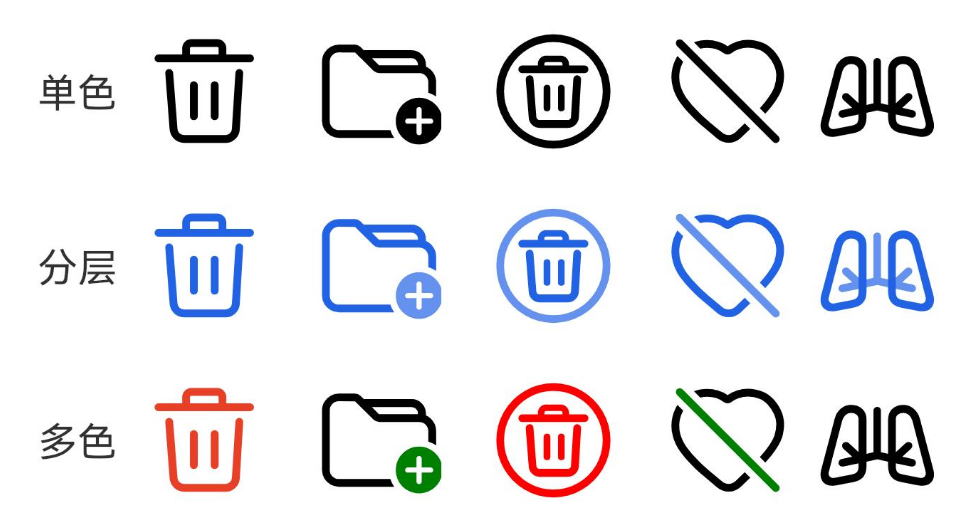
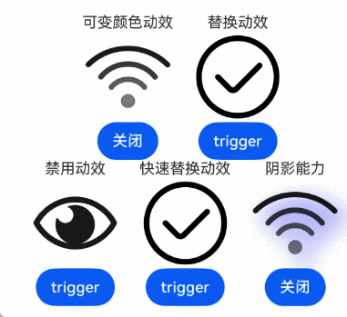
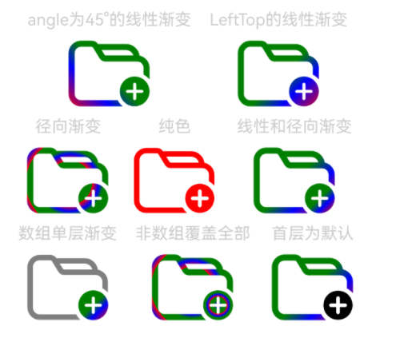

# SymbolGlyph

显示图标小符号的组件。<!--RP1--><!--RP1End-->

>  **说明：**
>
>  该组件从API version 11开始支持。后续版本如有新增内容，则采用上角标单独标记该内容的起始版本。

## 子组件

不支持子组件。

## 接口

SymbolGlyph(value?: Resource)

**卡片能力：** 从API version 12开始，该接口支持在ArkTS卡片中使用。

**原子化服务API：** 从API version 12开始，该接口支持在原子化服务中使用。

**系统能力：** SystemCapability.ArkUI.ArkUI.Full

**参数：**

| 参数名 | 类型 | 必填 | 说明 |
| -------- | -------- | -------- | -------- |
| value | [Resource](ts-types.md#resource)| 否 | SymbolGlyph组件的资源名，如 $r('sys.symbol.ohos_wifi')。 |

>  **说明：**
>
>  $r('sys.symbol.ohos_wifi')中引用的资源为系统预置，SymbolGlyph仅支持系统预置的symbol资源名，引用非symbol资源将显示异常。

## 属性

支持[通用属性](ts-component-general-attributes.md)，不支持文本通用属性，仅支持以下特有属性：

### fontColor

fontColor(value: Array&lt;ResourceColor&gt;)

设置SymbolGlyph组件颜色。

**卡片能力：** 从API version 12开始，该接口支持在ArkTS卡片中使用。

**原子化服务API：** 从API version 12开始，该接口支持在原子化服务中使用。

**系统能力：** SystemCapability.ArkUI.ArkUI.Full

**参数：** 

| 参数名 | 类型 | 必填 | 说明  |
| ------ | ---- | ---- | ----- |
| value  | Array\<[ResourceColor](ts-types.md#resourcecolor)\> | 是   | SymbolGlyph组件颜色。<br/> 默认值：不同渲染策略下默认值不同。 |

### fontSize

fontSize(value: number | string | Resource)

设置SymbolGlyph组件大小。设置string类型时，支持number类型取值的字符串形式，可以附带单位，例如"10"、"10fp"。

组件的图标显示大小由fontSize控制，设置width或height后，其他通用属性仅对组件的占位大小生效。

**卡片能力：** 从API version 12开始，该接口支持在ArkTS卡片中使用。

**原子化服务API：** 从API version 12开始，该接口支持在原子化服务中使用。

**系统能力：** SystemCapability.ArkUI.ArkUI.Full

**参数：** 

| 参数名 | 类型 | 必填 | 说明  |
| ------ | ---- | ---- | ----- |
| value  | number&nbsp;\|&nbsp;string&nbsp;\|&nbsp;[Resource](ts-types.md#resource) | 是   | SymbolGlyph组件大小。<br/>默认值：16fp<br/>单位：[fp](ts-pixel-units.md)<br/>不支持设置百分比字符串。|

### fontWeight

fontWeight(value: number | FontWeight | string)

设置SymbolGlyph组件粗细。number类型取值[100,900]，取值间隔为100，默认为400，取值越大，字体越粗。string类型仅支持number类型取值的字符串形式，例如“400”，以及“bold”、“bolder”、“lighter”、“regular” 、“medium”分别对应FontWeight中相应的枚举值。

sys.symbol.ohos_lungs图标不支持设置fontWeight。

**卡片能力：** 从API version 12开始，该接口支持在ArkTS卡片中使用。

**原子化服务API：** 从API version 12开始，该接口支持在原子化服务中使用。

**系统能力：** SystemCapability.ArkUI.ArkUI.Full

**参数：** 

| 参数名 | 类型                                                         | 必填 | 说明                                                |
| ------ | ------------------------------------------------------------ | ---- | --------------------------------------------------- |
| value  | number&nbsp;\|&nbsp;[FontWeight](ts-appendix-enums.md#fontweight)&nbsp;\|&nbsp;string | 是   | SymbolGlyph组件粗细。<br/>默认值：FontWeight.Normal |

### renderingStrategy

renderingStrategy(value: SymbolRenderingStrategy)

设置SymbolGlyph组件渲染策略。

**卡片能力：** 从API version 12开始，该接口支持在ArkTS卡片中使用。

**原子化服务API：** 从API version 12开始，该接口支持在原子化服务中使用。

**系统能力：** SystemCapability.ArkUI.ArkUI.Full

**参数：** 

| 参数名 | 类型 | 必填 | 说明  |
| ------ | ---- | ---- | ----- |
| value  | [SymbolRenderingStrategy](#symbolrenderingstrategy11枚举说明) | 是   | SymbolGlyph组件渲染策略。<br/>默认值：SymbolRenderingStrategy.SINGLE |

不同渲染策略效果可参考以下示意图。



### effectStrategy

effectStrategy(value: SymbolEffectStrategy)

设置SymbolGlyph组件动效策略。

**卡片能力：** 从API version 12开始，该接口支持在ArkTS卡片中使用。

**原子化服务API：** 从API version 12开始，该接口支持在原子化服务中使用。

**系统能力：** SystemCapability.ArkUI.ArkUI.Full

**参数：** 

| 参数名 | 类型 | 必填 | 说明  |
| ------ | ---- | ---- | ----- |
| value  | [SymbolEffectStrategy](#symboleffectstrategy11枚举说明) | 是   | SymbolGlyph组件动效策略。<br/>默认值：SymbolEffectStrategy.NONE |

### symbolEffect<sup>12+</sup>

symbolEffect(symbolEffect: SymbolEffect, isActive?: boolean)

设置SymbolGlyph组件动效策略及播放状态。

**卡片能力：** 从API version 12开始，该接口支持在ArkTS卡片中使用。

**原子化服务API：** 从API version 12开始，该接口支持在原子化服务中使用。

**系统能力：** SystemCapability.ArkUI.ArkUI.Full

**参数：** 

| 参数名 | 类型 | 必填 | 说明  |
| ------ | ---- | ---- | ----- |
| symbolEffect  | [SymbolEffect](#symboleffect12对象说明) | 是   | SymbolGlyph组件动效策略。<br/>默认值：[SymbolEffect](#symboleffect12对象说明) |
| isActive  | boolean | 否   | SymbolGlyph组件动效播放状态。<br/>true表示播放，false表示不播放。<br/>默认值：false |

### symbolEffect<sup>12+</sup>

symbolEffect(symbolEffect: SymbolEffect, triggerValue?: number)

设置SymbolGlyph组件动效策略及播放触发器。

**卡片能力：** 从API version 12开始，该接口支持在ArkTS卡片中使用。

**原子化服务API：** 从API version 12开始，该接口支持在原子化服务中使用。

**系统能力：** SystemCapability.ArkUI.ArkUI.Full

**参数：** 

| 参数名 | 类型 | 必填 | 说明  |
| ------ | ---- | ---- | ----- |
| symbolEffect | [SymbolEffect](#symboleffect12对象说明) | 是   | SymbolGlyph组件动效策略。<br/>默认值：[SymbolEffect](#symboleffect12对象说明) |
| triggerValue | number | 否   | SymbolGlyph组件动效播放触发器，在数值变更时触发动效。<br/>如果首次不希望触发动效，设置-1。 |

>  **说明：**
>
>  动效属性，仅支持使用effectStrategy属性或单个symbolEffect属性，不支持多种动效属性混合使用。

### minFontScale<sup>18+</sup>

minFontScale(scale: Optional\<number | Resource>)

设置SymbolGlyph组件最小的字体缩放倍数。

**原子化服务API：** 从API version 18开始，该接口支持在原子化服务中使用。

**系统能力：** SystemCapability.ArkUI.ArkUI.Full

**参数：** 

| 参数名 | 类型 | 必填 | 说明  |
| ------ | ---- | ---- | ----- |
| scale  |[Optional](ts-universal-attributes-custom-property.md#optional12)\<number&nbsp;\|&nbsp;[Resource](ts-types.md#resource)>  | 是   | SymbolGlyph组件最小的字体缩放倍数。<br/>取值范围：[0, 1] <br/>设置为0，缩放最小。<br/>**说明：** <br/>设置的值小于0时，按值为0处理。设置的值大于1，按值为1处理。异常值默认不生效。   |

### maxFontScale<sup>18+</sup>

maxFontScale(scale: Optional\<number | Resource>)

设置SymbolGlyph组件最大的字体缩放倍数。

**原子化服务API：** 从API version 18开始，该接口支持在原子化服务中使用。

**系统能力：** SystemCapability.ArkUI.ArkUI.Full

**参数：** 

| 参数名 | 类型 | 必填 | 说明  |
| ------ | ---- | ---- | ----- |
| scale  |[Optional](ts-universal-attributes-custom-property.md#optional12)\<number&nbsp;\|&nbsp;[Resource](ts-types.md#resource)>  | 是   | SymbolGlyph组件最大的字体缩放倍数。<br/>取值范围：[1, +∞)<br/>**说明：** <br/>设置的值小于1时，按值为1处理，异常值默认不生效。 |

### shaderStyle<sup>20+</sup>

shaderStyle(shaders: Array\<ShaderStyle\>)

设置SymbolGlyph组件的渐变色效果。

可以显示为径向渐变[RadialGradientStyle](../arkui-ts/ts-text-common.md#radialgradientstyle20)或线性渐变[LinearGradientStyle](../arkui-ts/ts-text-common.md#lineargradientstyle20)或纯色[ColorShaderStyle](../arkui-ts/ts-text-common.md#colorshaderstyle20)的效果，shaderStyle的优先级高于[fontColor](../arkui-ts/ts-basic-components-symbolSpan.md#fontcolor)和AI识别，纯色建议使用[fontColor](../arkui-ts/ts-basic-components-symbolSpan.md#fontcolor)。

**原子化服务API：** 从API version 20开始，该接口支持在原子化服务中使用。

**系统能力：** SystemCapability.ArkUI.ArkUI.Full

**参数：**

| 参数名     | 类型                                         | 必填                             | 说明                               |
| -------------- | -------------------------------------------- | ----------------------------------- | ----------------------------------- |
| shaders | Array[\<ShaderStyle\>](../arkui-ts/ts-text-common.md#shaderstyle20) | 是 | 径向渐变或线性渐变或纯色。<br/>根据传入的参数区分处理径向渐变[RadialGradientStyle](../arkui-ts/ts-text-common.md#radialgradientstyle20)或线性渐变[LinearGradientStyle](../arkui-ts/ts-text-common.md#lineargradientstyle20)或纯色[ColorShaderStyle](../arkui-ts/ts-text-common.md#colorshaderstyle20)，最终设置到SymbolGlyph组件上显示为渐变色效果。 |

### symbolShadow<sup>20+</sup>

symbolShadow(shadow: Optional\<ShadowOptions\>)

设置SymbolGlyph组件的阴影效果。

**卡片能力：** 从API version 20开始，该接口支持在ArkTS卡片中使用。

**原子化服务API：**: 从API version 20开始，该接口支持在原子化服务中使用。

**系统能力：**: SystemCapability.ArkUI.ArkUI.Full

**参数：**

| 参数名 | 类型 | 必填 | 说明  |
| ------ | ---- | ---- | ----- |
| shadow  |[Optional](ts-universal-attributes-custom-property.md#optional12)\<[ShadowOptions](ts-universal-attributes-image-effect.md#shadowoptions对象说明)\>  | 是  | SymbolGlyph组件的阴影效果。<br>默认值：<br>{<br>radius：0,<br>color：Color.Black,<br>offsetX：0,<br>offsetY：0<br>}|

## ScaleSymbolEffect<sup>12+</sup>

ScaleSymbolEffect继承自父类SymbolEffect。

**卡片能力：** 从API version 12开始，该接口支持在ArkTS卡片中使用。

**原子化服务API：** 从API version 12开始，该接口支持在原子化服务中使用。

**系统能力：** SystemCapability.ArkUI.ArkUI.Full

### 属性

| 名称 | 类型 | 必填 | 说明  |
| ---- | ---- | ---- | ---- |
| scope     | [EffectScope](#effectscope12枚举说明)  |  否   | 动效范围。<br/>默认值：EffectScope.LAYER    |
| direction | [EffectDirection](#effectdirection12枚举说明) |  否   | 动效方向。<br/>默认值：EffectDirection.DOWN |

### constructor<sup>12+</sup>

constructor(scope?: EffectScope, direction?: EffectDirection)

ScaleSymbolEffect的构造函数，缩放动效。

**卡片能力：** 从API version 12开始，该接口支持在ArkTS卡片中使用。

**原子化服务API：** 从API version 12开始，该接口支持在原子化服务中使用。

**系统能力：** SystemCapability.ArkUI.ArkUI.Full

**参数：**

| 参数名 | 类型 | 必填 | 说明  |
| ---- | ---- | ---- | ---- |
| scope     | [EffectScope](#effectscope12枚举说明)         | 否   | 动效范围。<br/>默认值：EffectScope.LAYER    |
| direction | [EffectDirection](#effectdirection12枚举说明) | 否   | 动效方向。<br/>默认值：EffectDirection.DOWN |

## HierarchicalSymbolEffect<sup>12+</sup>

HierarchicalSymbolEffect继承自父类SymbolEffect。

**卡片能力：** 从API version 12开始，该接口支持在ArkTS卡片中使用。

**原子化服务API：** 从API version 12开始，该接口支持在原子化服务中使用。

**系统能力：** SystemCapability.ArkUI.ArkUI.Full

### 属性

| 名称 | 类型 | 必填 | 说明  |
| ---- | ---- | ---- | ---- |
| fillStyle | [EffectFillStyle](#effectfillstyle12枚举说明) | 否   | 动效模式。<br/>默认值：EffectFillStyle.CUMULATIVE |

### constructor<sup>12+</sup>

constructor(fillStyle?: EffectFillStyle)

HierarchicalSymbolEffect的构造函数，层级动效。

**卡片能力：** 从API version 12开始，该接口支持在ArkTS卡片中使用。

**原子化服务API：** 从API version 12开始，该接口支持在原子化服务中使用。

**系统能力：** SystemCapability.ArkUI.ArkUI.Full

**参数：**

| 参数名 | 类型 | 必填 | 说明  |
| ---- | ---- | ---- | ---- |
| fillStyle | [EffectFillStyle](#effectfillstyle12枚举说明) | 否   | 动效模式。<br/>默认值：EffectFillStyle.CUMULATIVE |

## AppearSymbolEffect<sup>12+</sup>

AppearSymbolEffect继承自父类SymbolEffect。

**卡片能力：** 从API version 12开始，该接口支持在ArkTS卡片中使用。

**原子化服务API：** 从API version 12开始，该接口支持在原子化服务中使用。

**系统能力：** SystemCapability.ArkUI.ArkUI.Full

### 属性

| 名称 | 类型 | 必填 | 说明  |
| ---- | ---- | ---- | ---- |
| scope | [EffectScope](#effectscope12枚举说明) | 否   | 动效范围。<br/>默认值：EffectScope.LAYER |

### constructor<sup>12+</sup>

constructor(scope?: EffectScope)

AppearSymbolEffect的构造函数，出现动效。

**卡片能力：** 从API version 12开始，该接口支持在ArkTS卡片中使用。

**原子化服务API：** 从API version 12开始，该接口支持在原子化服务中使用。

**系统能力：** SystemCapability.ArkUI.ArkUI.Full

**参数：**

| 参数名 | 类型 | 必填 | 说明  |
| ---- | ---- | ---- | ---- |
| scope  | [EffectScope](#effectscope12枚举说明) | 否   | 动效范围。<br/>默认值：EffectScope.LAYER |

## DisappearSymbolEffect<sup>12+</sup>

DisappearSymbolEffect继承自父类SymbolEffect。

**卡片能力：** 从API version 12开始，该接口支持在ArkTS卡片中使用。

**原子化服务API：** 从API version 12开始，该接口支持在原子化服务中使用。

**系统能力：** SystemCapability.ArkUI.ArkUI.Full

### 属性

| 名称 | 类型 | 必填 | 说明  |
| ---- | ---- | ---- | ---- |
| scope | [EffectScope](#effectscope12枚举说明) | 否   | 动效范围。<br/>默认值：EffectScope.LAYER |

### constructor<sup>12+</sup>

constructor(scope?: EffectScope)

DisappearSymbolEffect的构造函数，消失动效。

**卡片能力：** 从API version 12开始，该接口支持在ArkTS卡片中使用。

**原子化服务API：** 从API version 12开始，该接口支持在原子化服务中使用。

**系统能力：** SystemCapability.ArkUI.ArkUI.Full

**参数：**

| 参数名 | 类型 | 必填 | 说明  |
| ---- | ---- | ---- | ---- |
| scope  | [EffectScope](#effectscope12枚举说明) | 否   | 动效范围。<br/>默认值：EffectScope.LAYER |

## BounceSymbolEffect<sup>12+</sup>

BounceSymbolEffect继承自父类SymbolEffect。

**卡片能力：** 从API version 12开始，该接口支持在ArkTS卡片中使用。

**原子化服务API：** 从API version 12开始，该接口支持在原子化服务中使用。

**系统能力：** SystemCapability.ArkUI.ArkUI.Full

### 属性

| 名称 | 类型 | 必填 | 说明  |
| ---- | ---- | ---- | ---- |
| scope     | [EffectScope](#effectscope12枚举说明)         | 否   | 动效范围。<br/>默认值：EffectScope.LAYER    |
| direction | [EffectDirection](#effectdirection12枚举说明) | 否   | 动效方向。<br/>默认值：EffectDirection.DOWN |

### constructor<sup>12+</sup>

constructor(scope?: EffectScope, direction?: EffectDirection)

BounceSymbolEffect的构造函数，弹跳动效。

**卡片能力：** 从API version 12开始，该接口支持在ArkTS卡片中使用。

**原子化服务API：** 从API version 12开始，该接口支持在原子化服务中使用。

**系统能力：** SystemCapability.ArkUI.ArkUI.Full

**参数：**

| 参数名 | 类型 | 必填 | 说明  |
| ---- | ---- | ---- | ---- |
| scope     | [EffectScope](#effectscope12枚举说明)         | 否   | 动效范围。<br/>默认值：EffectScope.LAYER    |
| direction | [EffectDirection](#effectdirection12枚举说明) | 否   | 动效方向。<br/>默认值：EffectDirection.DOWN |

## ReplaceSymbolEffect<sup>12+</sup>

ReplaceSymbolEffect继承自父类SymbolEffect。

**卡片能力：** 从API version 12开始，该接口支持在ArkTS卡片中使用。

**原子化服务API：** 从API version 12开始，该接口支持在原子化服务中使用。

**系统能力：** SystemCapability.ArkUI.ArkUI.Full

### 属性

| 名称 | 类型 | 必填 | 说明  |
| ---- | ---- | ---- | ---- |
| scope | [EffectScope](#effectscope12枚举说明) | 否   | 动效范围。<br/>默认值：EffectScope.LAYER |

### constructor<sup>12+</sup>

constructor(scope?: EffectScope)

ReplaceSymbolEffect的构造函数，替换动效。

**卡片能力：** 从API version 12开始，该接口支持在ArkTS卡片中使用。

**原子化服务API：** 从API version 12开始，该接口支持在原子化服务中使用。

**系统能力：** SystemCapability.ArkUI.ArkUI.Full

**参数：**

| 参数名 | 类型 | 必填 | 说明  |
| ---- | ---- | ---- | ---- |
| scope  | [EffectScope](#effectscope12枚举说明) | 否   | 动效范围。<br/>默认值：EffectScope.LAYER |

## SymbolEffectStrategy<sup>11+</sup>枚举说明

动效类型的枚举值。设置动效后，动效启动即生效，无需触发。

**卡片能力：** 从API version 12开始，该接口支持在ArkTS卡片中使用。

**原子化服务API：** 从API version 12开始，该接口支持在原子化服务中使用。

**系统能力：** SystemCapability.ArkUI.ArkUI.Full

| 名称     | 值 | 说明                          |
| ------ | --- | ----------------------------- |
| NONE | 0 | 无动效（默认值）。 |
| SCALE | 1 | 整体缩放动效。                 |
|  HIERARCHICAL  | 2 | 层级动效。  |

## SymbolRenderingStrategy<sup>11+</sup>枚举说明

渲染模式的枚举值。

**卡片能力：** 从API version 12开始，该接口支持在ArkTS卡片中使用。

**原子化服务API：** 从API version 12开始，该接口支持在原子化服务中使用。

**系统能力：** SystemCapability.ArkUI.ArkUI.Full

| 名称     | 值 | 说明                          |
| ------ | --- | ----------------------------- |
| SINGLE  | 0 | 单色模式（默认值）。<br/> 可以设置一个或者多个颜色，默认为黑色。<br/> 当设置多个颜色时，仅生效第一个颜色。 |
| MULTIPLE_COLOR  | 1 | 多色模式。<br/> 最多可以设置三个颜色。当只设置一个颜色时，修改symbol图标的第一层颜色，其他颜色保持默认颜色。<br/> 颜色设置顺序与图标分层顺序匹配，当颜色数量大于图标分层时，多余的颜色不生效。<br/> 仅支持设置颜色，设置透明度设置不生效。|
|  MULTIPLE_OPACITY   | 2 | 分层模式。<br/> 默认为黑色，可以设置一个或者多个颜色。当设置多个颜色时，仅生效第一个颜色。<br/>不透明度与图层相关，symbol图标的第一层透明度为100%、第二层透明度为50%、第三层透明度为20%。  |

## SymbolEffect<sup>12+</sup>对象说明

定义SymbolEffect类。

**卡片能力：** 从API version 12开始，该接口支持在ArkTS卡片中使用。

**原子化服务API：** 从API version 12开始，该接口支持在原子化服务中使用。

**系统能力：** SystemCapability.ArkUI.ArkUI.Full

## PulseSymbolEffect<sup>12+</sup>对象说明

PulseSymbolEffect的构造函数，脉冲动效。

**卡片能力：** 从API version 12开始，该接口支持在ArkTS卡片中使用。

**原子化服务API：** 从API version 12开始，该接口支持在原子化服务中使用。

**系统能力：** SystemCapability.ArkUI.ArkUI.Full

## EffectDirection<sup>12+</sup>枚举说明

**卡片能力：** 从API version 12开始，该接口支持在ArkTS卡片中使用。

**原子化服务API：** 从API version 12开始，该接口支持在原子化服务中使用。

**系统能力：** SystemCapability.ArkUI.ArkUI.Full

| 名称 | 值   | 说明             |
| ---- | ---- | ---------------- |
| DOWN | 0    | 图标缩小再复原。 |
| UP   | 1    | 图标放大再复原。 |

## DisableSymbolEffect<sup>20+</sup>

DisableSymbolEffect继承自父类[SymbolEffect](#symboleffect12)。

**卡片能力：** 从API version 20开始，该接口支持在ArkTS卡片中使用。

**原子化服务API：** 从API version 20开始，该接口支持在原子化服务中使用。

**系统能力：** SystemCapability.ArkUI.ArkUI.Full

### 属性

| 名称 | 类型 | 必填 | 说明  |
| ---- | ---- | ---- | ---- |
| scope | [EffectScope](#effectscope12枚举说明) | 否   | 动效范围。<br/>默认值：EffectScope.LAYER<br/>**说明：** <br/>EffectScope.WHOLE模式不生效。 |

### constructor<sup>20+</sup>

constructor(scope?: EffectScope)

DisableSymbolEffect的构造函数，禁用动效。

**卡片能力：** 从API version 20开始，该接口支持在ArkTS卡片中使用。

**原子化服务API：** 从API version 20开始，该接口支持在原子化服务中使用。

**系统能力：** SystemCapability.ArkUI.ArkUI.Full

**参数：**

| 参数名 | 类型 | 必填 | 说明  |
| ---- | ---- | ---- | ---- |
| scope  | [EffectScope](#effectscope12枚举说明) | 否   | 动效范围。<br/>默认值：EffectScope.LAYER<br/>**说明：** <br/>EffectScope.WHOLE模式不生效。 |

## QuickReplaceSymbolEffect<sup>20+</sup>

QuickReplaceSymbolEffect继承自父类[SymbolEffect](#symboleffect12)。

**卡片能力：** 从API version 20开始，该接口支持在ArkTS卡片中使用。

**原子化服务API：** 从API version 20开始，该接口支持在原子化服务中使用。

**系统能力：** SystemCapability.ArkUI.ArkUI.Full

### 属性

| 名称 | 类型 | 必填 | 说明  |
| ---- | ---- | ---- | ---- |
| scope | [EffectScope](#effectscope12枚举说明) | 否   | 动效范围。<br/>默认值：EffectScope.LAYER |

### constructor<sup>20+</sup>

constructor(scope?: EffectScope)

QuickReplaceSymbolEffect的构造函数，快速替换动效。

**卡片能力：** 从API version 20开始，该接口支持在ArkTS卡片中使用。

**原子化服务API：** 从API version 20开始，该接口支持在原子化服务中使用。

**系统能力：** SystemCapability.ArkUI.ArkUI.Full

**参数：**

| 参数名 | 类型 | 必填 | 说明  |
| ---- | ---- | ---- | ---- |
| scope  | [EffectScope](#effectscope12枚举说明) | 否   | 动效范围。<br/>默认值：EffectScope.LAYER |

## EffectScope<sup>12+</sup>枚举说明

**卡片能力：** 从API version 12开始，该接口支持在ArkTS卡片中使用。

**原子化服务API：** 从API version 12开始，该接口支持在原子化服务中使用。

**系统能力：** SystemCapability.ArkUI.ArkUI.Full

| 名称  | 值   | 说明       |
| ----- | ---- | ---------- |
| LAYER | 0    | 分层模式。 |
| WHOLE | 1    | 整体模式。 |

## EffectFillStyle<sup>12+</sup>枚举说明

**卡片能力：** 从API version 12开始，该接口支持在ArkTS卡片中使用。

**原子化服务API：** 从API version 12开始，该接口支持在原子化服务中使用。

**系统能力：** SystemCapability.ArkUI.ArkUI.Full

| 名称       | 值   | 说明       |
| ---------- | ---- | ---------- |
| CUMULATIVE | 0    | 累加模式。 |
| ITERATIVE  | 1    | 迭代模式。 |

## 事件

支持[通用事件](ts-component-general-events.md)。

## 示例

###  示例1（设置渲染和动效策略）

该示例通过renderingStrategy、effectStrategy属性展示了不同的渲染和动效策略。

```ts
// xxx.ets
@Entry
@Component
struct Index {
  build() {
    Column() {
      Row() {
        Column() {
          Text("Light")
          SymbolGlyph($r('sys.symbol.ohos_trash'))
            .fontWeight(FontWeight.Lighter)
            .fontSize(96)
        }

        Column() {
          Text("Normal")
          SymbolGlyph($r('sys.symbol.ohos_trash'))
            .fontWeight(FontWeight.Normal)
            .fontSize(96)
        }

        Column() {
          Text("Bold")
          SymbolGlyph($r('sys.symbol.ohos_trash'))
            .fontWeight(FontWeight.Bold)
            .fontSize(96)
        }
      }

      Row() {
        Column() {
          Text("单色")
          SymbolGlyph($r('sys.symbol.ohos_folder_badge_plus'))
            .fontSize(96)
            .renderingStrategy(SymbolRenderingStrategy.SINGLE)
            .fontColor([Color.Black, Color.Green, Color.White])
        }

        Column() {
          Text("多色")
          SymbolGlyph($r('sys.symbol.ohos_folder_badge_plus'))
            .fontSize(96)
            .renderingStrategy(SymbolRenderingStrategy.MULTIPLE_COLOR)
            .fontColor([Color.Black, Color.Green, Color.White])
        }

        Column() {
          Text("分层")
          SymbolGlyph($r('sys.symbol.ohos_folder_badge_plus'))
            .fontSize(96)
            .renderingStrategy(SymbolRenderingStrategy.MULTIPLE_OPACITY)
            .fontColor([Color.Black, Color.Green, Color.White])
        }
      }

      Row() {
        Column() {
          Text("无动效")
          SymbolGlyph($r('sys.symbol.ohos_wifi'))
            .fontSize(96)
            .effectStrategy(SymbolEffectStrategy.NONE)
        }

        Column() {
          Text("整体缩放动效")
          SymbolGlyph($r('sys.symbol.ohos_wifi'))
            .fontSize(96)
            .effectStrategy(1)
        }

        Column() {
          Text("层级动效")
          SymbolGlyph($r('sys.symbol.ohos_wifi'))
            .fontSize(96)
            .effectStrategy(2)
        }
      }
    }
  }
}
```


###  示例2（设置动效和阴影）

该示例通过symbolEffect属性展示了各种动效的效果以及结合symbolShadow的阴影效果。

```ts
// xxx.ets
@Entry
@Component
struct Index {
  @State isActive: boolean = true;
  @State triggerValueReplace: number = 0;
  @State triggerValueReplace1: number = 0;
  @State triggerValueReplace2: number = 0;
  @State renderMode: number = 1;

  replaceFlag: boolean = true;
  replaceFlag1: boolean = true;
  replaceFlag2: boolean = true;

  options: ShadowOptions = {
    radius: 10.0,
    color: Color.Blue,
    offsetX: 10,
    offsetY: 10,
  };

  build() {
    Column() {
      Row() {
        Column() {
          Text("可变颜色动效")
          SymbolGlyph($r('sys.symbol.ohos_wifi'))
            .fontSize(96)
            .symbolEffect(new HierarchicalSymbolEffect(EffectFillStyle.ITERATIVE), this.isActive)
          Button(this.isActive ? '关闭' : '播放')
            .onClick(() => {
              this.isActive = !this.isActive;
            })
        }
        .margin({ right: 20 })
        Column() {
          Text("替换动效")
          SymbolGlyph(this.replaceFlag ? $r('sys.symbol.checkmark_circle') : $r('sys.symbol.repeat_1'))
            .fontSize(96)
            .symbolEffect(new ReplaceSymbolEffect(EffectScope.WHOLE), this.triggerValueReplace)
          Button('trigger')
            .onClick(() => {
              this.replaceFlag = !this.replaceFlag;
              this.triggerValueReplace = this.triggerValueReplace + 1;
            })
        }
        .margin({ right: 20 })
      }

      Row() {
        Column() {
          Text("禁用动效")
          SymbolGlyph(this.replaceFlag1 ? $r('sys.symbol.eye_slash') : $r('sys.symbol.eye'))
            .fontSize(96)
            .renderingStrategy(this.renderMode)
            .symbolEffect(new DisableSymbolEffect(EffectScope.LAYER), this.triggerValueReplace1)
          Button('trigger')
            .onClick(() => {
              this.replaceFlag1 = !this.replaceFlag1;
              this.triggerValueReplace1 = this.triggerValueReplace1 + 1;
            })
        }
        .margin({ right: 20 })
        Column() {
          Text("快速替换动效")
          SymbolGlyph(this.replaceFlag2 ? $r('sys.symbol.checkmark_circle') : $r('sys.symbol.repeat_1'))
            .fontSize(96)
            .symbolEffect(new QuickReplaceSymbolEffect(EffectScope.WHOLE), this.triggerValueReplace2)
          Button('trigger')
            .onClick(() => {
              this.replaceFlag2 = !this.replaceFlag2;
              this.triggerValueReplace2 = this.triggerValueReplace2 + 1;
            })
        }
        .margin({ right: 20 })
        Column() {
          Text("阴影能力")
          SymbolGlyph($r('sys.symbol.ohos_wifi'))
            .fontSize(96)
            .symbolEffect(new HierarchicalSymbolEffect(EffectFillStyle.ITERATIVE), this.isActive)
            .symbolShadow(this.options)
          Button(this.isActive ? '关闭' : '播放')
            .onClick(() => {
              this.isActive = !this.isActive;
            })
        }
        .margin({ right: 20 })
      }
    }
    .margin({
      left: 45,
      top: 50
    })
  }
}
```


### 示例3（设置颜色渐变）

该示例通过shaderStyle接口实现了symbolGlyph控件显示为渐变色的功能。

```ts
@Entry
@Component
struct Index {
  @State message: string = 'Hello World';

  linearGradientOptions1: LinearGradientOptions = {
    angle: 45,
    colors: [[Color.Red, 0.0], [Color.Blue, 0.3], [Color.Green, 0.5]]
  };

  linearGradientOptions2: LinearGradientOptions = {
    direction: GradientDirection.LeftTop,
    colors: [[Color.Red, 0.0], [Color.Blue, 0.3], [Color.Green, 0.5]],
    repeating: true,
  };

  radialGradientOptions: RadialGradientOptions = {
    center: ["50%", "50%"],
    radius: "20%",
    colors: [[Color.Red, 0.0], [Color.Blue, 0.3], [Color.Green, 0.5]],
    repeating: true,
  };

  build() {
    Column() {
      Row() {
        Column() {
          Text('angle为45°的线性渐变')
            .fontSize(18)
            .fontColor(0xCCCCCC)
            .textAlign(TextAlign.Center)
          SymbolGlyph($r('sys.symbol.ohos_folder_badge_plus'))
            .fontSize(96)
            .shaderStyle([new LinearGradientStyle(this.linearGradientOptions1)])
        }
        .margin({ right: 20 })
        Column() {
          Text('LeftTop的线性渐变')
            .fontSize(18)
            .fontColor(0xCCCCCC)
            .textAlign(TextAlign.Center)
          SymbolGlyph($r('sys.symbol.ohos_folder_badge_plus'))
            .fontSize(96)
            .shaderStyle([new LinearGradientStyle(this.linearGradientOptions2)])
        }
        .margin({ right: 20 })
      }

      Row() {
        Column() {
          Text('径向渐变')
            .fontSize(18)
            .fontColor(0xCCCCCC)
            .textAlign(TextAlign.Center)
          SymbolGlyph($r('sys.symbol.ohos_folder_badge_plus'))
            .fontSize(96)
            .shaderStyle([new RadialGradientStyle(this.radialGradientOptions)])
        }
        .margin({ right: 20 })
        Column() {
          Text('纯色')
            .fontSize(18)
            .fontColor(0xCCCCCC)
            .textAlign(TextAlign.Center)
          SymbolGlyph($r('sys.symbol.ohos_folder_badge_plus'))
            .fontSize(96)
            .shaderStyle([new ColorShaderStyle(Color.Red)])
        }
        .margin({ right: 20 })
        Column() {
          Text('线性和径向渐变')
            .fontSize(18)
            .fontColor(0xCCCCCC)
            .textAlign(TextAlign.Center)
          SymbolGlyph($r('sys.symbol.ohos_folder_badge_plus'))
            .fontSize(96)
            .shaderStyle([
              new LinearGradientStyle(this.linearGradientOptions2),
              new LinearGradientStyle(this.linearGradientOptions2),
              new RadialGradientStyle(this.radialGradientOptions)
            ])
            .renderingStrategy(SymbolRenderingStrategy.MULTIPLE_OPACITY)
        }
        .margin({ right: 20 })
      }
    }
    .margin({
      left: 20,
      top: 50
    })
  }
}
```
