# Text

显示一段文本的组件。

>  **说明：**
>
>  该组件从API version 7开始支持。后续版本如有新增内容，则采用上角标单独标记该内容的起始版本。


## 子组件

可以包含[Span](ts-basic-components-span.md)、[ImageSpan](ts-basic-components-imagespan.md)、[SymbolSpan](ts-basic-components-symbolSpan.md)和[ContainerSpan](ts-basic-components-containerspan.md)子组件。

## 接口

Text(content?: string | Resource , value?: TextOptions)

**卡片能力：** 从API version 9开始，该接口支持在ArkTS卡片中使用。

**原子化服务API：** 从API version 11开始，该接口支持在原子化服务中使用。

**系统能力：** SystemCapability.ArkUI.ArkUI.Full

**参数：**

| 参数名 | 类型 | 必填 | 说明 |
| -------- | -------- | -------- | -------- |
| content | string \| [Resource](ts-types.md#resource) | 否 | 文本内容。包含子组件Span且未设置[属性字符串](ts-universal-styled-string.md#属性字符串)时不生效，显示Span内容，并且此时text组件的样式不生效。<br/>默认值：' ' |
| value<sup>11+</sup> | [TextOptions](#textoptions11) | 否 | 文本组件初始化选项。|

## 属性

除支持[通用属性](ts-component-general-attributes.md)，还支持以下属性：

### textAlign

textAlign(value: TextAlign)

设置文本段落在水平方向的对齐方式。

文本段落宽度占满Text组件宽度。

可通过[align](ts-universal-attributes-location.md#align)属性控制文本段落在垂直方向上的位置，此组件中不可通过align属性控制文本段落在水平方向上的位置，具体效果如下：

- Alignment.TopStart、Alignment.Top、Alignment.TopEnd：内容顶部对齐。

- Alignment.Start、Alignment.Center、Alignment.End：内容垂直居中。

- Alignment.BottomStart、Alignment.Bottom、Alignment.BottomEnd：内容底部对齐。

当textAlign属性设置为TextAlign.JUSTIFY时，需要根据文本内容设置[wordBreak](#wordbreak11)属性，且最后一行文本不参与两端对齐，为水平对齐首部效果。

**卡片能力：** 从API version 9开始，该接口支持在ArkTS卡片中使用。

**原子化服务API：** 从API version 11开始，该接口支持在原子化服务中使用。

**系统能力：** SystemCapability.ArkUI.ArkUI.Full

**参数：** 

| 参数名 | 类型                                        | 必填 | 说明                                                       |
| ------ | ------------------------------------------- | ---- | ---------------------------------------------------------- |
| value  | [TextAlign](ts-appendix-enums.md#textalign) | 是   | 文本段落在水平方向的对齐方式。<br/>默认值：TextAlign.Start<br/>Wearable设备上默认值为：TextAlign.Center |

### textOverflow

textOverflow(options: TextOverflowOptions)

设置文本超长时的显示方式。

文本截断是按字截断。例如，英文以单词为最小单位进行截断，若需要以字母为单位进行截断，可在字母间添加零宽空格：`\u200B`。从API version 11开始，建议优先组合[wordBreak](#wordbreak11)属性设置为WordBreak.BREAK_ALL方式实现字母为单位进行截断，具体详见[示例4设置文本断行及折行](#示例4设置文本断行及折行)。

当overflow设置为TextOverflow.None、TextOverflow.Clip、TextOverflow.Ellipsis时，需配合[maxLines](#maxlines)属性使用，单独设置不生效。设置TextOverflow.None与TextOverflow.Clip效果一样。

当overflow设置为TextOverflow.MARQUEE时：

- 文本在一行内滚动显示。

- 设置[maxLines](#maxlines)及[copyOption](#copyoption9)属性均不生效。

- Text组件[clip](ts-universal-attributes-sharp-clipping.md#clip)属性默认为true。

- 属性字符串的[CustomSpan](ts-universal-styled-string.md#customspan)不支持跑马灯模式。

- [textAlign](#textalign)属性的生效规则：当文本不可滚动时，textAlign属性生效；当文本可滚动时，textAlign属性不生效。

从API version 12开始，当overflow设置为TextOverflow.MARQUEE时，支持ImageSpan组件，文本和图片在一行内滚动显示。

**卡片能力：** 从API version 9开始，该接口支持在ArkTS卡片中使用。

**原子化服务API：** 从API version 11开始，该接口支持在原子化服务中使用。

**系统能力：** SystemCapability.ArkUI.ArkUI.Full

**参数：** 

| 参数名 | 类型                                                         | 必填 | 说明                                                         |
| ------ | ------------------------------------------------------------ | ---- | ------------------------------------------------------------ |
| options | [TextOverflowOptions](#textoverflowoptions18对象说明) | 是   | 文本超长显示方式对象 |

### maxLines

maxLines(value: number)

设置文本的最大行数。

默认情况下，文本是自动折行的，如果指定此属性，则文本最多不会超过指定的行。如果有多余的文本，可以通过[textOverflow](#textoverflow)来指定截断方式。

**卡片能力：** 从API version 9开始，该接口支持在ArkTS卡片中使用。

**原子化服务API：** 从API version 11开始，该接口支持在原子化服务中使用。

**系统能力：** SystemCapability.ArkUI.ArkUI.Full

**参数：** 

| 参数名 | 类型   | 必填 | 说明             |
| ------ | ------ | ---- | ---------------- |
| value  | number | 是   | 文本的最大行数。 |

### lineHeight

lineHeight(value: number | string | Resource)

设置文本的文本行高。

设置值不大于0时，不限制文本行高，自适应字体大小，number类型时单位为fp。string类型支持number类型取值的字符串形式，可以附带单位，例如"10"、"10fp"。

**卡片能力：** 从API version 9开始，该接口支持在ArkTS卡片中使用。

**原子化服务API：** 从API version 11开始，该接口支持在原子化服务中使用。

**系统能力：** SystemCapability.ArkUI.ArkUI.Full

**参数：** 

| 参数名 | 类型                                                         | 必填 | 说明             |
| ------ | ------------------------------------------------------------ | ---- | ---------------- |
| value  | number&nbsp;\|&nbsp;string&nbsp;\|&nbsp;[Resource](ts-types.md#resource) | 是   | 文本的文本行高。 |

### decoration

decoration(value: DecorationStyleInterface)

设置文本装饰线样式及其颜色。

**卡片能力：** 从API version 9开始，该接口支持在ArkTS卡片中使用。

**原子化服务API：** 从API version 11开始，该接口支持在原子化服务中使用。

**系统能力：** SystemCapability.ArkUI.ArkUI.Full

**参数：** 

| 参数名 | 类型                                                         | 必填 | 说明                                                         |
| ------ | ------------------------------------------------------------ | ---- | ------------------------------------------------------------ |
| value  | [DecorationStyleInterface<sup>12+</sup>](ts-universal-styled-string.md#decorationstyleinterface) | 是   | 文本装饰线样式对象。<br/>默认值：<br/>{<br/>&nbsp;type:&nbsp;TextDecorationType.None,<br/>&nbsp;color:&nbsp;Color.Black,<br/>&nbsp;style:&nbsp;TextDecorationStyle.SOLID&nbsp;<br/>}<br/>**说明：** <br/>style参数不支持卡片能力。 |

### baselineOffset

baselineOffset(value: number | string)

设置文本基线的偏移量。

设置该值为百分比时，按默认值显示。

正数内容向上偏移，负数向下偏移。

**卡片能力：** 从API version 9开始，该接口支持在ArkTS卡片中使用。

**原子化服务API：** 从API version 11开始，该接口支持在原子化服务中使用。

**系统能力：** SystemCapability.ArkUI.ArkUI.Full

**参数：** 

| 参数名 | 类型                       | 必填 | 说明                             |
| ------ | -------------------------- | ---- | -------------------------------- |
| value  | number&nbsp;\|&nbsp;string | 是   | 文本基线的偏移量。<br/>默认值：0 |

### letterSpacing

letterSpacing(value: number | string)

设置文本字符间距。

设置该值为百分比时，按默认值显示。设置该值为0时，按默认值显示。string类型支持number类型取值的字符串形式，可以附带单位，例如"10"、"10fp"。

当取值为负值时，文字会发生压缩，负值过小时会将组件内容区大小压缩为0，导致无内容显示。

**卡片能力：** 从API version 9开始，该接口支持在ArkTS卡片中使用。

**原子化服务API：** 从API version 11开始，该接口支持在原子化服务中使用。

**系统能力：** SystemCapability.ArkUI.ArkUI.Full

**参数：** 

| 参数名 | 类型                       | 必填 | 说明           |
| ------ | -------------------------- | ---- | -------------- |
| value  | number&nbsp;\|&nbsp;string | 是   | 文本字符间距。<br/>单位：fp |

### minFontSize

minFontSize(value: number | string | Resource)

设置文本最小显示字号。

string类型支持number类型取值的字符串形式，可以附带单位，例如"10"、"10fp"。

需配合[maxFontSize](#maxfontsize)以及[maxLines](#maxlines)或布局大小限制使用，单独设置不生效。

自适应字号生效时，fontSize设置不生效。

minFontSize小于或等于0时，自适应字号不生效，此时按照[fontSize](#fontsize)属性的值生效，未设置时按照其默认值生效。

从API version 18开始，支持在子组件和属性字符串上生效，未设置字号的部分自适应字号。

**卡片能力：** 从API version 9开始，该接口支持在ArkTS卡片中使用。

**原子化服务API：** 从API version 11开始，该接口支持在原子化服务中使用。

**系统能力：** SystemCapability.ArkUI.ArkUI.Full

**参数：** 

| 参数名 | 类型                                                         | 必填 | 说明               |
| ------ | ------------------------------------------------------------ | ---- | ------------------ |
| value  | number&nbsp;\|&nbsp;string&nbsp;\|&nbsp;[Resource](ts-types.md#resource) | 是   | 文本最小显示字号。<br/>单位：fp |

### maxFontSize

maxFontSize(value: number | string | Resource)

设置文本最大显示字号。

string类型支持number类型取值的字符串形式，可以附带单位，例如"10"、"10fp"。

需配合[minFontSize](#minfontsize)以及[maxLines](#maxlines)或布局大小限制使用，单独设置不生效。

自适应字号生效时，fontSize设置不生效。

maxFontSize小于或等于0时，自适应字号不生效，此时按照[fontSize](#fontsize)属性的值生效，未设置时按照其默认值生效。

从API version 18开始支持在子组件和属性字符串上生效，未设置字号的部分自适应字号。

**卡片能力：** 从API version 9开始，该接口支持在ArkTS卡片中使用。

**原子化服务API：** 从API version 11开始，该接口支持在原子化服务中使用。

**系统能力：** SystemCapability.ArkUI.ArkUI.Full

**参数：** 

| 参数名 | 类型                                                         | 必填 | 说明               |
| ------ | ------------------------------------------------------------ | ---- | ------------------ |
| value  | number&nbsp;\|&nbsp;string&nbsp;\|&nbsp;[Resource](ts-types.md#resource) | 是   | 文本最大显示字号。<br/>单位：fp |

### textCase

textCase(value: TextCase)

设置文本大小写。

**卡片能力：** 从API version 9开始，该接口支持在ArkTS卡片中使用。

**原子化服务API：** 从API version 11开始，该接口支持在原子化服务中使用。

**系统能力：** SystemCapability.ArkUI.ArkUI.Full

**参数：** 

| 参数名 | 类型                                      | 必填 | 说明                                      |
| ------ | ----------------------------------------- | ---- | ----------------------------------------- |
| value  | [TextCase](ts-appendix-enums.md#textcase) | 是   | 文本大小写。<br />默认值：TextCase.Normal |

### fontColor

fontColor(value: ResourceColor)

设置字体颜色。

**卡片能力：** 从API version 9开始，该接口支持在ArkTS卡片中使用。

**原子化服务API：** 从API version 11开始，该接口支持在原子化服务中使用。

**系统能力：** SystemCapability.ArkUI.ArkUI.Full

**参数：** 

| 参数名 | 类型                                       | 必填 | 说明       |
| ------ | ------------------------------------------ | ---- | ---------- |
| value  | [ResourceColor](ts-types.md#resourcecolor) | 是   | 字体颜色。<br />默认值：'e6182431'<br />Wearable设备上默认值为：'#c5ffffff' |

### fontSize

fontSize(value: number | string | Resource)

设置字体大小。

**卡片能力：** 从API version 9开始，该接口支持在ArkTS卡片中使用。

**原子化服务API：** 从API version 11开始，该接口支持在原子化服务中使用。

**系统能力：** SystemCapability.ArkUI.ArkUI.Full

**参数：** 

| 参数名 | 类型                                                         | 必填 | 说明                                                         |
| ------ | ------------------------------------------------------------ | ---- | ------------------------------------------------------------ |
| value  | number&nbsp;\|&nbsp;string&nbsp;\|&nbsp;[Resource](ts-types.md#resource) | 是   | 字体大小。fontSize为number类型时，使用fp单位。不支持设置百分比字符串。<br />默认值：16fp<br />Wearable设备上默认值为：15fp |

### fontStyle

fontStyle(value: FontStyle)

设置字体样式。

**卡片能力：** 从API version 9开始，该接口支持在ArkTS卡片中使用。

**原子化服务API：** 从API version 11开始，该接口支持在原子化服务中使用。

**系统能力：** SystemCapability.ArkUI.ArkUI.Full

**参数：** 

| 参数名 | 类型                                        | 必填 | 说明                                    |
| ------ | ------------------------------------------- | ---- | --------------------------------------- |
| value  | [FontStyle](ts-appendix-enums.md#fontstyle) | 是   | 字体样式。<br/>默认值：FontStyle.Normal |

### fontWeight

fontWeight(value: number | FontWeight | string)

设置文本的字体粗细，设置过大可能会在不同字体下有截断。

**卡片能力：** 从API version 9开始，该接口支持在ArkTS卡片中使用。

**原子化服务API：** 从API version 11开始，该接口支持在原子化服务中使用。

**系统能力：** SystemCapability.ArkUI.ArkUI.Full

**参数：** 

| 参数名 | 类型                                                         | 必填 | 说明                                                         |
| ------ | ------------------------------------------------------------ | ---- | ------------------------------------------------------------ |
| value  | number&nbsp;\|&nbsp;[FontWeight](ts-appendix-enums.md#fontweight)&nbsp;\|&nbsp;string | 是   | 文本的字体粗细，number类型取值[100,&nbsp;900]，取值间隔为100，默认为400，取值越大，字体越粗。string类型仅支持number类型取值的字符串形式，例如"400"，以及"bold"、"bolder"、"lighter"、"regular"、"medium"，分别对应FontWeight中相应的枚举值。<br/>默认值：FontWeight.Normal<br/>Wearable设备上默认值为：FontWeight.Regular |

### fontFamily

fontFamily(value: string | Resource)

设置字体列表。

**卡片能力：** 从API version 9开始，该接口支持在ArkTS卡片中使用。

**原子化服务API：** 从API version 11开始，该接口支持在原子化服务中使用。

**系统能力：** SystemCapability.ArkUI.ArkUI.Full

**参数：** 

| 参数名 | 类型                                                 | 必填 | 说明                                                         |
| ------ | ---------------------------------------------------- | ---- | ------------------------------------------------------------ |
| value  | string&nbsp;\|&nbsp;[Resource](ts-types.md#resource) | 是   | 字体列表。默认字体'HarmonyOS Sans'。<br>应用当前支持'HarmonyOS Sans'字体和[注册自定义字体](../js-apis-font.md)。<br>卡片当前仅支持'HarmonyOS Sans'字体。 |

### copyOption<sup>9+</sup>

copyOption(value: CopyOptions)

设置组件是否支持文本可复制粘贴。

设置copyOptions为CopyOptions.InApp或者CopyOptions.LocalDevice，长按文本，会弹出文本选择菜单，可选中文本并进行复制、全选操作，此时Text会监听onClick事件，手势事件为非冒泡事件，若需要点击Text组件区域响应父组件的点击手势事件，建议在父组件上使用[parallelGesture](ts-gesture-settings.md#绑定手势识别)绑定手势识别，也可参考[示例7设置文本识别](#示例7设置文本识别)。

由于卡片没有长按事件，此场景下长按文本，不会弹出文本选择菜单。

**卡片能力：** 从API version 9开始，该接口支持在ArkTS卡片中使用。

**原子化服务API：** 从API version 11开始，该接口支持在原子化服务中使用。

**系统能力：** SystemCapability.ArkUI.ArkUI.Full

**参数：** 

| 参数名 | 类型                                             | 必填 | 说明                                                       |
| ------ | ------------------------------------------------ | ---- | ---------------------------------------------------------- |
| value  | [CopyOptions](ts-appendix-enums.md#copyoptions9) | 是   | 组件是否支持文本可复制粘贴。<br />默认值：CopyOptions.None |

### draggable<sup>9+</sup>

draggable(value: boolean)

设置选中文本拖拽效果。

不能和[onDragStart](ts-universal-events-drag-drop.md#ondragstart)事件同时使用。

需配合[CopyOptions](ts-appendix-enums.md#copyoptions9)一起使用，设置copyOptions为CopyOptions.InApp或者CopyOptions.LocalDevice，并且draggable设置为true时，支持对选中文本的拖拽以及选中内容复制到输入框。

**原子化服务API：** 从API version 11开始，该接口支持在原子化服务中使用。

**系统能力：** SystemCapability.ArkUI.ArkUI.Full

**参数：** 

| 参数名 | 类型    | 必填 | 说明                                 |
| ------ | ------- | ---- | ------------------------------------ |
| value  | boolean | 是   | 选中文本拖拽效果。<br/>默认值：false |

### font<sup>10+</sup>

font(value: Font)

设置文本样式。

包括字体大小、字体粗细、字体族和字体风格。

**原子化服务API：** 从API version 11开始，该接口支持在原子化服务中使用。

**系统能力：** SystemCapability.ArkUI.ArkUI.Full

**参数：** 

| 参数名 | 类型    | 必填 | 说明       |
| ------ | ------- | ---- | ---------- |
| value  | [Font](ts-types.md#font) | 是   | 文本样式。 |

### textShadow<sup>10+</sup>

textShadow(value: ShadowOptions | Array&lt;ShadowOptions&gt;)

设置文字阴影效果。

不支持fill字段，不支持智能取色模式。

从API version 11开始，该接口支持以数组形式入参，实现多重文字阴影。

**卡片能力：** 从API version 10开始，该接口支持在ArkTS卡片中使用。

**原子化服务API：** 从API version 11开始，该接口支持在原子化服务中使用。

**系统能力：** SystemCapability.ArkUI.ArkUI.Full

**参数：** 

| 参数名 | 类型                                                         | 必填 | 说明           |
| ------ | ------------------------------------------------------------ | ---- | -------------- |
| value  | [ShadowOptions](ts-universal-attributes-image-effect.md#shadowoptions对象说明)&nbsp;\|&nbsp;&nbsp;Array&lt;[ShadowOptions](ts-universal-attributes-image-effect.md#shadowoptions对象说明)&gt;<sup>11+</sup> | 是   | 文字阴影效果。 |

### heightAdaptivePolicy<sup>10+</sup>

heightAdaptivePolicy(value: TextHeightAdaptivePolicy)

设置文本自适应布局调整字号的方式。

规则如下：

- MAX_LINES_FIRST模式：优先使用[maxLines](#maxlines)属性来调整文本高度。如果使用maxLines属性的布局大小超过了布局约束，则尝试在[minFontSize](#minfontsize)和[maxFontSize](#maxfontsize)的范围内缩小字体以显示更多文本。

- MIN_FONT_SIZE_FIRST模式：优先使用minFontSize属性来调整文本高度。如果使用minFontSize属性可以将文本布局在一行中，则尝试在minFontSize和maxFontSize的范围内增大字体并使用最大可能的字体大小在一行内显示，否则按minFontSize显示。

- LAYOUT_CONSTRAINT_FIRST模式：优先使用布局约束来调整文本高度。如果布局大小超过布局约束，则尝试在minFontSize和maxFontSize的范围内缩小字体以满足布局约束。如果将字体大小缩小到minFontSize后，布局大小仍然超过布局约束，则删除超过布局约束的行。

**原子化服务API：** 从API version 11开始，该接口支持在原子化服务中使用。

**系统能力：** SystemCapability.ArkUI.ArkUI.Full

**参数：** 

| 参数名 | 类型                                                         | 必填 | 说明                                                         |
| ------ | ------------------------------------------------------------ | ---- | ------------------------------------------------------------ |
| value  | [TextHeightAdaptivePolicy](ts-appendix-enums.md#textheightadaptivepolicy10) | 是   | 文本自适应高度的方式。<br/>默认值：TextHeightAdaptivePolicy.MAX_LINES_FIRST |

### textIndent<sup>10+</sup>

textIndent(value: Length)

设置首行文本缩进。

**原子化服务API：** 从API version 11开始，该接口支持在原子化服务中使用。

**系统能力：** SystemCapability.ArkUI.ArkUI.Full

**参数：** 

| 参数名 | 类型                         | 必填 | 说明                         |
| ------ | ---------------------------- | ---- | ---------------------------- |
| value  | [Length](ts-types.md#length) | 是   | 首行文本缩进。<br/>默认值：0 |

### wordBreak<sup>11+</sup>

wordBreak(value: WordBreak)

设置断行规则。

WordBreak.BREAK_ALL与{overflow:&nbsp;TextOverflow.Ellipsis}，maxLines组合使用可实现英文单词按字母截断，超出部分以省略号显示。

**原子化服务API：** 从API version 11开始，该接口支持在原子化服务中使用。

**系统能力：** SystemCapability.ArkUI.ArkUI.Full

**参数：** 

| 参数名 | 类型                                          | 必填 | 说明                                          |
| ------ | --------------------------------------------- | ---- | --------------------------------------------- |
| value  | [WordBreak](ts-appendix-enums.md#wordbreak11) | 是   | 断行规则。 <br />默认值：WordBreak.BREAK_WORD |

### selection<sup>11+</sup>

selection(selectionStart: number, selectionEnd: number)

设置选中区域。

选中区域高亮且显示手柄和文本选择菜单。

当copyOption设置为CopyOptions.None时，设置selection属性不生效。

当overflow设置为TextOverflow.MARQUEE时，设置selection属性不生效。

当selectionStart大于等于selectionEnd时不选中。可选范围为[0, textSize]，textSize为文本内容最大字符数，入参小于0处理为0，大于textSize处理为textSize。

当selectionStart或selectionEnd在截断不可见区域时不选中。截断为false时超出父组件的文本选中区域生效。

**原子化服务API：** 从API version 11开始，该接口支持在原子化服务中使用。

**系统能力：** SystemCapability.ArkUI.ArkUI.Full

**参数：** 

| 参数名         | 类型   | 必填 | 说明                                 |
| -------------- | ------ | ---- | ------------------------------------ |
| selectionStart | number | 是   | 所选文本的起始位置。<br />默认值：-1 |
| selectionEnd   | number | 是   | 所选文本的结束位置。<br />默认值：-1 |

### ellipsisMode<sup>11+</sup>

ellipsisMode(value: EllipsisMode)

设置省略位置。

ellipsisMode属性需要配合overflow设置为TextOverflow.Ellipsis以及maxLines使用，单独设置ellipsisMode属性不生效。

EllipsisMode.START和EllipsisMode.CENTER仅在单行超长文本生效。

**原子化服务API：** 从API version 12开始，该接口支持在原子化服务中使用。

**系统能力：** SystemCapability.ArkUI.ArkUI.Full

**参数：** 

| 参数名 | 类型                                                | 必填 | 说明                                      |
| ------ | --------------------------------------------------- | ---- | ----------------------------------------- |
| value  | [EllipsisMode](ts-appendix-enums.md#ellipsismode11) | 是   | 省略位置。 <br />默认值：EllipsisMode.END |

### enableDataDetector<sup>11+</sup>

enableDataDetector(enable: boolean)

设置是否进行文本特殊实体识别。

该接口依赖设备底层应具有文本识别能力，否则设置不会生效。

当enableDataDetector设置为true，同时不设置dataDetectorConfig属性时，默认识别所有类型的实体，所识别实体的color和decoration会被更改为如下样式：

```ts
color: '#ff007dff'
decoration:{
  type: TextDecorationType.Underline,
  color: '#ff007dff',
  style: TextDecorationStyle.SOLID
}
```

触摸点击和鼠标右键点击实体，会根据实体类型弹出对应的实体操作菜单，鼠标左键点击实体会直接响应菜单的第一个选项。

当overflow设置为TextOverflow.MARQUEE时，该功能不会生效。

当copyOption设置为CopyOptions.None时，点击实体弹出的菜单没有选择文本、复制、翻译、分享和搜索功能。当copyOption不为CopyOptions.None，且textSelectable设置为TextSelectableMode.UNSELECTABLE时，仍然具有实体复制功能，但没有选择文本功能。

**原子化服务API：** 从API version 12开始，该接口支持在原子化服务中使用。

**系统能力：** SystemCapability.ArkUI.ArkUI.Full

**参数：** 

| 参数名 | 类型    | 必填 | 说明                              |
| ------ | ------- | ---- | --------------------------------- |
| enable  | boolean | 是   | 使能文本识别。<br/>默认值： false |

### dataDetectorConfig<sup>11+</sup>

dataDetectorConfig(config: TextDataDetectorConfig)

设置文本识别配置。

需配合[enableDataDetector](#enabledatadetector11)一起使用，设置enableDataDetector为true时，dataDetectorConfig的配置才能生效。

当有两个实体A、B重叠时，按以下规则保留实体：

1.&nbsp;若A&nbsp;⊂&nbsp;B，则保留B，反之则保留A。

2.&nbsp;当A&nbsp;⊄&nbsp;B且B&nbsp;⊄&nbsp;A时，若A.start&nbsp;<&nbsp;B.start，则保留A，反之则保留B。

**原子化服务API：** 从API version 12开始，该接口支持在原子化服务中使用。

**系统能力：** SystemCapability.ArkUI.ArkUI.Full

**参数：** 

| 参数名 | 类型                                                        | 必填 | 说明                                                         |
| ------ | ----------------------------------------------------------- | ---- | ------------------------------------------------------------ |
| config | [TextDataDetectorConfig](ts-text-common.md#textdatadetectorconfig11对象说明) | 是   | 文本识别配置。|

### bindSelectionMenu<sup>11+</sup>

bindSelectionMenu(spanType: TextSpanType, content: CustomBuilder, responseType: TextResponseType,
    options?: SelectionMenuOptions)

设置自定义选择菜单。

bindSelectionMenu长按响应时长为600ms，bindContextMenu长按响应时长为800ms，同时绑定且触发方式均为长按时，优先响应bindSelectionMenu。

自定义菜单超长时，建议内部嵌套[Scroll](./ts-container-scroll.md)组件使用，避免键盘被遮挡。

**原子化服务API：** 从API version 12开始，该接口支持在原子化服务中使用。

**系统能力：** SystemCapability.ArkUI.ArkUI.Full

**参数：** 

| 参数名       | 类型                                                         | 必填 | 说明                                                         |
| ------------ | ------------------------------------------------------------ | ---- | ------------------------------------------------------------ |
| spanType     | [TextSpanType](#textspantype11枚举说明)          | 是   | 选择菜单的类型。<br/>默认值：TextSpanType.TEXT               |
| content      | [CustomBuilder](ts-types.md#custombuilder8)                  | 是   | 选择菜单的内容。                                             |
| responseType | [TextResponseType](#textresponsetype11枚举说明)  | 是   | 选择菜单的响应类型。<br/>默认值：TextResponseType.LONG_PRESS |
| options      | [SelectionMenuOptions](ts-basic-components-richeditor.md#selectionmenuoptions10) | 否   | 选择菜单的选项。                                             |

### fontFeature<sup>12+</sup>

fontFeature(value: string)

设置文字特性效果，比如数字等宽的特性。

格式为：normal \| \<feature-tag-value\>

\<feature-tag-value\>的格式为：\<string\> \[ \<integer\> \| on \| off ]

\<feature-tag-value\>的个数可以有多个，中间用','隔开。

例如，使用等宽数字的输入格式为："ss01" on。

**卡片能力：** 从API version 12开始，该接口支持在ArkTS卡片中使用。

**原子化服务API：** 从API version 12开始，该接口支持在原子化服务中使用。

**系统能力：** SystemCapability.ArkUI.ArkUI.Full

**参数：** 

| 参数名 | 类型   | 必填 | 说明           |
| ------ | ------ | ---- | -------------- |
| value  | string | 是   | 文字特性效果。 |

fontFeature属性列表<br/>
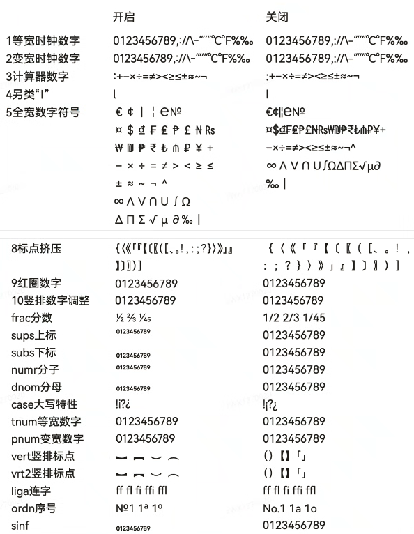

设置 Font Feature 属性，Font Feature 是 OpenType 字体的高级排版能力，如支持连字、数字等宽等特性，一般用在自定义字体中，其能力需要字体本身支持。
更多 Font Feature 能力介绍可参考 https://www.w3.org/TR/css-fonts-3/#font-feature-settings-prop 和 https://sparanoid.com/lab/opentype-features/

>  **说明：**
>
>  不支持Text内同时存在文本内容和Span或ImageSpan子组件。如果同时存在，只显示Span或ImageSpan内的内容。
>
>  字体排版引擎会对开发者传入的宽度[width](ts-universal-attributes-size.md#width)进行向下取整，保证是整型像素后进行排版。如果字体排版引擎向上取整，可能会出现文字右侧被截断。
>
>  当多个Text组件在[Row](ts-container-row.md)容器内布局且没有设置具体的布局分配信息时，Text会以Row的最大尺寸进行布局。如果需要子组件主轴累加的尺寸不超过Row容器主轴的尺寸，可以设置[layoutWeight](ts-universal-attributes-size.md#layoutweight)或者是以[Flex](ts-universal-attributes-flex-layout.md)布局来约束子组件的主轴尺寸。

### lineSpacing<sup>12+</sup>

lineSpacing(value: LengthMetrics)

设置文本的行间距，设置值不大于0时，取默认值0。

**原子化服务API：** 从API version 12开始，该接口支持在原子化服务中使用。

**系统能力：** SystemCapability.ArkUI.ArkUI.Full

**参数：** 

| 参数名 | 类型                                                         | 必填 | 说明             |
| ------ | ------------------------------------------------------------ | ---- | ---------------- |
| value  | [LengthMetrics](../js-apis-arkui-graphics.md#lengthmetrics12) | 是   | 文本的行间距。默认值：0 |

### lineSpacing<sup>20+</sup>

lineSpacing(value: LengthMetrics, options?: LineSpacingOptions)

设置文本的行间距。当不配置LineSpacingOptions时，首行上方和尾行下方默认会有行间距。

**原子化服务API：** 从API version 20开始，该接口支持在原子化服务中使用。

**系统能力：** SystemCapability.ArkUI.ArkUI.Full

**参数：** 

| 参数名 | 类型                                                         | 必填 | 说明             |
| ------ | ------------------------------------------------------------ | ---- | ---------------- |
| value  | [LengthMetrics](../js-apis-arkui-graphics.md#lengthmetrics12) | 是   | 文本的行间距。设置值不大于0时，取默认值0。 |
| options  | [LineSpacingOptions](#linespacingoptions20对象说明) | 否   | 设置行间距配置项。<br/>默认值：{&nbsp;onlyBetweenLines:&nbsp;false&nbsp;} |

### privacySensitive<sup>12+</sup>

privacySensitive(supported: boolean)

设置是否支持卡片敏感隐私信息。

**卡片能力：** 从API version 12开始，该接口支持在ArkTS卡片中使用。

**原子化服务API：** 从API version 12开始，该接口支持在原子化服务中使用。

**系统能力：** SystemCapability.ArkUI.ArkUI.Full

**参数：**

| 参数名    | 类型    | 必填 | 说明                                                         |
| --------- | ------- | ---- | ------------------------------------------------------------ |
| supported | boolean | 是   | 是否支持卡片敏感隐私信息。<br/>默认值为false，当设置为true时，隐私模式下文字将被遮罩为横杠“-”样式。<br/>**说明：** <br/>设置null则不敏感。<br/>进入隐私模式需要[卡片框架支持](./ts-universal-attributes-obscured.md)。 |

### lineBreakStrategy<sup>12+</sup>

lineBreakStrategy(strategy: LineBreakStrategy)

设置折行规则。该属性在wordBreak不等于breakAll的时候生效，不支持连词符。

**原子化服务API：** 从API version 12开始，该接口支持在原子化服务中使用。

**系统能力：** SystemCapability.ArkUI.ArkUI.Full

**参数：** 

| 参数名   | 类型                                                         | 必填 | 说明                                                    |
| -------- | ------------------------------------------------------------ | ---- | ------------------------------------------------------- |
| strategy | [LineBreakStrategy](ts-appendix-enums.md#linebreakstrategy12) | 是   | 文本的折行规则。 <br />默认值：LineBreakStrategy.GREEDY |

### textSelectable<sup>12+</sup>

textSelectable(mode: TextSelectableMode)

设置是否支持文本可选择、可获焦以及Touch后能否获取焦点。

**原子化服务API：** 从API version 12开始，该接口支持在原子化服务中使用。

**系统能力：** SystemCapability.ArkUI.ArkUI.Full

**参数：** 

| 参数名 | 类型                                          | 必填 | 说明                                          |
| ------ | --------------------------------------------- | ---- | --------------------------------------------- |
| mode  | [TextSelectableMode](ts-appendix-enums.md#textselectablemode12) | 是   | 文本是否支持可选择、可获焦。 <br />默认值：TextSelectableMode.SELECTABLE_UNFOCUSABLE |

### editMenuOptions<sup>12+</sup>

editMenuOptions(editMenu: EditMenuOptions)

设置自定义菜单扩展项，允许用户设置扩展项的文本内容、图标、回调方法。

**原子化服务API：** 从API version 12开始，该接口支持在原子化服务中使用。

**系统能力：** SystemCapability.ArkUI.ArkUI.Full

**参数：** 

| 参数名 | 类型                                          | 必填 | 说明                                          |
| ------ | --------------------------------------------- | ---- | --------------------------------------------- |
| editMenu  | [EditMenuOptions](ts-text-common.md#editmenuoptions) | 是   | 扩展菜单选项。 |

### minFontScale<sup>12+</sup>

minFontScale(scale: number | Resource)

设置文本最小的字体缩放倍数。

**原子化服务API：** 从API version 12开始，该接口支持在原子化服务中使用。

**系统能力：** SystemCapability.ArkUI.ArkUI.Full

**参数：** 

| 参数名 | 类型                                          | 必填 | 说明                                          |
| ------ | --------------------------------------------- | ---- | --------------------------------------------- |
| scale  | number \| [Resource](ts-types.md#resource) | 是   | 文本最小的字体缩放倍数。<br/>取值范围：[0, 1]<br/>**说明：** <br/>设置的值小于0时，按值为0处理，设置的值大于1，按值为1处理，异常值默认不生效。 |

### maxFontScale<sup>12+</sup>

maxFontScale(scale: number | Resource)

设置文本最大的字体缩放倍数。

**原子化服务API：** 从API version 12开始，该接口支持在原子化服务中使用。

**系统能力：** SystemCapability.ArkUI.ArkUI.Full

**参数：** 

| 参数名 | 类型                                          | 必填 | 说明                                          |
| ------ | --------------------------------------------- | ---- | --------------------------------------------- |
| scale  | number \| [Resource](ts-types.md#resource) | 是   | 文本最大的字体缩放倍数。<br/>取值范围：[1, +∞)<br/>**说明：** <br/>设置的值小于1时，按值为1处理，异常值默认不生效。 |

### halfLeading<sup>12+</sup>

halfLeading(halfLeading: boolean)

设置文本是否将行间距平分至行的顶部与底部。

组件侧设置halfLeading优先级高于module.json5配置文件中的halfLeading配置项。

**原子化服务API：** 从API version 12开始，该接口支持在原子化服务中使用。

**系统能力：** SystemCapability.ArkUI.ArkUI.Full

**参数：** 

| 参数名 | 类型                                          | 必填 | 说明                                          |
| ------ | --------------------------------------------- | ---- | --------------------------------------------- |
| halfLeading | boolean | 是  | 文本是否将行间距平分至行的顶部与底部。<br/>true表示将行间距平分至行的顶部与底部，false则不平分。<br/>默认值：false |

### font<sup>12+</sup>

font(fontValue: Font, options?: FontSettingOptions)

设置文本样式，支持设置字体配置项。

仅Text组件生效，其子组件不生效。

**卡片能力：** 从API version 12开始，该接口支持在ArkTS卡片中使用。

**原子化服务API：** 从API version 12开始，该接口支持在原子化服务中使用。

**系统能力：** SystemCapability.ArkUI.ArkUI.Full

**参数：** 

| 参数名 | 类型                                          | 必填 | 说明                                          |
| ------ | --------------------------------------------- | ---- | --------------------------------------------- |
| fontValue | [Font](ts-types.md#font) | 是  | 设置文本样式。 |
| options | [FontSettingOptions](ts-text-common.md#fontsettingoptions12对象说明) | 否  | 设置字体配置项。 |

### fontWeight<sup>12+</sup>

fontWeight(weight: number | FontWeight | string, options?: FontSettingOptions)

设置文本字重，支持设置字体配置项。

仅Text组件生效，其子组件不生效。

**卡片能力：** 从API version 12开始，该接口支持在ArkTS卡片中使用。

**原子化服务API：** 从API version 12开始，该接口支持在原子化服务中使用。

**系统能力：** SystemCapability.ArkUI.ArkUI.Full

**参数：** 

| 参数名 | 类型                                          | 必填 | 说明                                          |
| ------ | --------------------------------------------- | ---- | --------------------------------------------- |
| weight | number&nbsp;\|&nbsp;[FontWeight](ts-appendix-enums.md#fontweight)&nbsp;\|&nbsp;string | 是  | 设置文本字重。number类型取值[100,&nbsp;900]，取值间隔为100，默认为400，取值越大，字体越粗。string类型仅支持number类型取值的字符串形式，例如"400"，以及"bold"、"bolder"、"lighter"、"regular"、"medium"，分别对应FontWeight中相应的枚举值。 |
| options | [FontSettingOptions](ts-text-common.md#fontsettingoptions12对象说明) | 否  | 设置字体配置项。 |

### enableHapticFeedback<sup>13+</sup>

enableHapticFeedback(isEnabled: boolean)

设置是否开启触控反馈。

**原子化服务API：** 从API version 13开始，该接口支持在原子化服务中使用。

**系统能力：** SystemCapability.ArkUI.ArkUI.Full

**参数：** 

| 参数名 | 类型    | 必填 | 说明                               |
| ------ | ------- | ---- | ---------------------------------- |
| isEnabled | boolean | 是   | 是否开启触控反馈。<br/>true表示开启，false表示不开启。<br/>默认值：true |

>  **说明：**
>
>  开启触控反馈时，需要在工程的module.json5中配置requestPermissions字段开启振动权限，配置如下：
> ```json
> "requestPermissions": [
>  {
>     "name": "ohos.permission.VIBRATE",
>  }
> ]
> ```

### caretColor<sup>14+</sup>

caretColor(color: ResourceColor)

设置文本框选中区域手柄颜色。

**原子化服务API：** 从API version 14开始，该接口支持在原子化服务中使用。

**系统能力：** SystemCapability.ArkUI.ArkUI.Full

**参数：**

| 参数名 | 类型                                       | 必填 | 说明                                   |
| ------ | ------------------------------------------ | ---- | -------------------------------------- |
| color  | [ResourceColor](ts-types.md#resourcecolor) | 是   | 文本选中手柄颜色。<br/>默认值：'#007DFF' |

### selectedBackgroundColor<sup>14+</sup>

selectedBackgroundColor(color: ResourceColor)

设置文本选中底板颜色。如果未设置不透明度，默认为20%不透明度。

**原子化服务API：** 从API version 14开始，该接口支持在原子化服务中使用。

**系统能力：** SystemCapability.ArkUI.ArkUI.Full

**参数：**

| 参数名 | 类型                                       | 必填 | 说明                                       |
| ------ | ------------------------------------------ | ---- | ------------------------------------------ |
| color  | [ResourceColor](ts-types.md#resourcecolor) | 是   | 文本选中底板颜色。<br/>默认为20%不透明度。<br/>默认值：'#007DFF' |

### marqueeOptions<sup>18+</sup>

marqueeOptions(options: Optional\<TextMarqueeOptions>)

设置文本跑马灯模式的配置项。

当textOverflow设置为TextOverflow.MARQUEE时，marqueeOptions的设置才能生效。

**原子化服务API：** 从API version 18开始，该接口支持在原子化服务中使用。

**系统能力：** SystemCapability.ArkUI.ArkUI.Full

**参数：**

| 参数名 | 类型                                       | 必填 | 说明                                       |
| ------ | ------------------------------------------ | ---- | ------------------------------------------ |
| options | [Optional](ts-universal-attributes-custom-property.md#optional12)\<[TextMarqueeOptions](#textmarqueeoptions18对象说明)> | 是 | 当text组件的textOverflow属性设置为MARQUEE时，可通过marqueeOptions设置跑马灯动效具体的属性，如开关、步长、循环次数、方向等。 |

## TextSpanType<sup>11+</sup>枚举说明

[Span](ts-basic-components-span.md)类型信息。

**系统能力：** SystemCapability.ArkUI.ArkUI.Full

| 名称 | 值 | 说明 |
| -------- | ---- | -------- |
| TEXT | 0 | Span为文字类型。<br/>**原子化服务API：** 从API version 12开始，该接口支持在原子化服务中使用。 |
| IMAGE | 1 | Span为图像类型。<br/>**原子化服务API：** 从API version 12开始，该接口支持在原子化服务中使用。 |
| MIXED | 2 | Span为图文混合类型。<br/>**原子化服务API：** 从API version 12开始，该接口支持在原子化服务中使用。 |
| DEFAULT<sup>15+</sup> | 3 | 注册此类型菜单但未注册TEXT、IMAGE、MIXED菜单时，文字类型、图片类型、图文混合类型都会触发并显示此类型对应的菜单。<br/>**原子化服务API：** 从API version 15开始，该接口支持在原子化服务中使用。 |

>  **说明：**
>
>  菜单类型的匹配顺序如下。例如，用户长按文本时，根据以下规则查找：
>  1. 查找是否注册了TextSpanType.TEXT、TextResponseType.LONG_PRESS菜单
>  2. 查找是否注册了TextSpanType.TEXT、TextResponseType.DEFAULT菜单
>  3. 查找是否注册了TextSpanType.DEFAULT、TextResponseType.LONG_PRESS菜单
>  4. 查找是否注册了TextSpanType.DEFAULT、TextResponseType.DEFAULT菜单

## TextResponseType<sup>11+</sup>枚举说明

**系统能力：** SystemCapability.ArkUI.ArkUI.Full

| 名称         | 值 |  说明          |
| ---------- | --- | ------------- |
| RIGHT_CLICK | 0 | 通过鼠标右键触发菜单弹出。<br/>**原子化服务API：** 从API version 12开始，该接口支持在原子化服务中使用。 |
| LONG_PRESS  | 1 | 通过长按触发菜单弹出。<br/>**原子化服务API：** 从API version 12开始，该接口支持在原子化服务中使用。 |
| SELECT | 2 | 通过鼠标选中触发菜单弹出。<br/>**原子化服务API：** 从API version 12开始，该接口支持在原子化服务中使用。 |
| DEFAULT<sup>15+</sup> | 3 | 注册此类型的菜单但未注册RIGHT_CLICK、LONG_PRESS、SELECT时，右键、长按、鼠标选中都会触发并显示此类型对应的菜单。<br/>**原子化服务API：** 从API version 15开始，该接口支持在原子化服务中使用。 |

>  **说明：**
>
>  菜单类型的匹配顺序如下。例如，用户长按文本时，根据以下规则查找：
>  1. 查找是否注册了TextSpanType.TEXT、TextResponseType.LONG_PRESS菜单
>  2. 查找是否注册了TextSpanType.TEXT、TextResponseType.DEFAULT菜单
>  3. 查找是否注册了TextSpanType.DEFAULT、TextResponseType.LONG_PRESS菜单
>  4. 查找是否注册了TextSpanType.DEFAULT、TextResponseType.DEFAULT菜单

## TextOverflowOptions<sup>18+</sup>对象说明

文本超长显示方式对象。

**卡片能力：** 从API version 18开始，该接口支持在ArkTS卡片中使用。

**原子化服务API：** 从API version 18开始，该接口支持在原子化服务中使用。

**系统能力：** SystemCapability.ArkUI.ArkUI.Full

**参数：** 

| 名称 | 类型                                                         | 必填 | 说明                                                         |
| ------ | ------------------------------------------------------------ | ---- | ------------------------------------------------------------ |
| overflow<sup>7+</sup>  | [TextOverflow](ts-appendix-enums.md#textoverflow) | 是   | 文本超长时的显示方式。<br/>默认值：TextOverflow.Clip <br/>**卡片能力：** 从API version 9开始，该接口支持在ArkTS卡片中使用。<br/>**原子化服务API：** 从API version 11开始，该接口支持在原子化服务中使用。 |

## LineSpacingOptions<sup>20+</sup>对象说明

设置文本的行间距，是否仅在行与行之间生效。

**原子化服务API：** 从API version 20开始，该接口支持在原子化服务中使用。

**系统能力：** SystemCapability.ArkUI.ArkUI.Full

**参数：** 

| 参数名 | 类型                                                         | 必填 | 说明             |
| ------ | ------------------------------------------------------------ | ---- | ---------------- |
| onlyBetweenLines  | boolean | 否   | 文本的行间距是否仅在行与行之间生效。<br/>当设置为true时，行间距仅适用于行与行之间，首行上方和尾行下方无额外的行间距。当设置为false时，首行上方和尾行下方均会存在行间距。<br/>默认值：false |

## 事件

除支持[通用事件](ts-component-general-events.md)外，还支持以下事件：

### onCopy<sup>11+</sup>

onCopy(callback:(value:&nbsp;string)&nbsp;=&gt;&nbsp;void)

长按文本内部区域弹出剪贴板后，点击剪切板复制按钮，触发该回调。目前文本复制仅支持文本。

**原子化服务API：** 从API version 11开始，该接口支持在原子化服务中使用。

**系统能力：** SystemCapability.ArkUI.ArkUI.Full

**参数：** 

| 参数名 | 类型   | 必填 | 说明             |
| ------ | ------ | ---- | ---------------- |
| value  | string | 是   | 复制的文本内容。 |

### onTextSelectionChange<sup>11+</sup>

onTextSelectionChange(callback: (selectionStart: number, selectionEnd: number) => void)

文本选择的位置发生变化时，触发该回调。

**原子化服务API：** 从API version 12开始，该接口支持在原子化服务中使用。

**系统能力：** SystemCapability.ArkUI.ArkUI.Full

**参数：** 

| 参数名         | 类型   | 必填 | 说明                 |
| -------------- | ------ | ---- | -------------------- |
| selectionStart | number | 是   | 所选文本的起始位置。 |
| selectionEnd   | number | 是   | 所选文本的结束位置。 |

### onMarqueeStateChange<sup>18+</sup>

onMarqueeStateChange(callback: Callback\<MarqueeState\>)

跑马灯动画进行到一些特定的阶段时，触发该回调。

**原子化服务API：** 从API version 18开始，该接口支持在原子化服务中使用。

**系统能力：** SystemCapability.ArkUI.ArkUI.Full

**参数：**

| 参数名    | 类型                                             | 必填  | 说明                       |
|--------|---------------------------------------------------|-----|--------------------------|
| callback  | Callback\<[MarqueeState](#marqueestate18枚举说明)\> | 是   | 通过callback参数指定触发回调的状态，状态由MarqueeState枚举定义，例如开始滚动、滚动一次、滚动完成。 |

## TextOptions<sup>11+</sup>

Text初始化参数。

**原子化服务API：** 从API version 12开始，该接口支持在原子化服务中使用。

**系统能力：** SystemCapability.ArkUI.ArkUI.Full

| 名称 | 类型 | 必填 | 说明 |
| -------- | -------- | -------- | -------- |
| controller | [TextController](#textcontroller11)  | 是 | 文本控制器。 |

## TextController<sup>11+</sup>

Text组件的控制器。

**原子化服务API：** 从API version 12开始，该接口支持在原子化服务中使用。

**系统能力：** SystemCapability.ArkUI.ArkUI.Full

### 导入对象

```
controller: TextController = new TextController()
```

### closeSelectionMenu

closeSelectionMenu(): void

关闭自定义选择菜单或系统默认选择菜单。

**原子化服务API：** 从API version 12开始，该接口支持在原子化服务中使用。

**系统能力：** SystemCapability.ArkUI.ArkUI.Full

### setStyledString<sup>12+</sup>

setStyledString(value: StyledString): void

触发绑定或更新属性字符串。

**原子化服务API：** 从API version 12开始，该接口支持在原子化服务中使用。

**系统能力：** SystemCapability.ArkUI.ArkUI.Full

**参数：**

| 参数名   | 类型   | 必填   | 说明                |
| ----- | ------ | ---- | ------------------- |
| value | [StyledString](ts-universal-styled-string.md#styledstring) | 是    | 属性字符串。<br/>**说明：** <br/>StyledString的子类[MutableStyledString](ts-universal-styled-string.md#mutablestyledstring)也可以作为入参值。 |

### getLayoutManager<sup>12+</sup>

getLayoutManager(): LayoutManager

获取布局管理器对象。

**原子化服务API：** 从API version 12开始，该接口支持在原子化服务中使用。

**系统能力：** SystemCapability.ArkUI.ArkUI.Full

**返回值：**

| 类型                                       | 说明      |
| ---------------------------------------- | ------- |
| [LayoutManager](ts-text-common.md#LayoutManager) | 布局管理器对象。 |

## TextMarqueeOptions<sup>18+</sup>对象说明

Marquee初始化参数。

**原子化服务API：** 从API version 18开始，该接口支持在原子化服务中使用。

**系统能力：** SystemCapability.ArkUI.ArkUI.Full

**参数：**

| 名称                | 类型                                              | 必填 | 说明                                                                                  |
|--------------------|-------------------------------------------------|----|-------------------------------------------------------------------------------------|
| start              | boolean                                         | 是  | 控制跑马灯进入播放状态。<br/>true表示播放，false表示不播放。                           |
| step               | number                                          | 否  | 滚动动画文本滚动步长。<br/>默认值：4.0vp                                                           |
| loop               | number                                          | 否  | 设置重复滚动的次数，小于等于零时无限循环。<br/>默认值：-1                                                    |
| fromStart          | boolean                                         | 否  | 设置文本从头开始滚动或反向滚动。<br/>true表示从头开始滚动，false表示反向滚动。<br/>默认值：true                                                  |
| delay              | number                                          | 否  | 设置每次滚动的时间间隔。<br/>默认值：0 <br/>单位：毫秒                                                             |
| fadeout            | boolean                                         | 否  | 设置文字超长时的渐隐效果。<br/>true表示支持渐隐效果，false表示不支持渐隐效果。<br/>当Text内容超出显示范围时，未完全展现的文字边缘将应用渐隐效果。若两端均有文字未完全显示，则两端同时应用渐隐效果。在渐隐效果开启状态下，clip属性将自动锁定为true，不允许设置为false。<br/>默认值：false  |
| marqueeStartPolicy | [MarqueeStartPolicy](#marqueestartpolicy18枚举说明) | 否  | 设置跑马灯启动策略。<br/>默认值：MarqueeStartPolicy.DEFAULT                                       |

## MarqueeStartPolicy<sup>18+</sup>枚举说明

Marquee的滚动方式，可选择默认持续滚动或条件触发滚动。

**原子化服务API：** 从API version 18开始，该接口支持在原子化服务中使用。

**系统能力：** SystemCapability.ArkUI.ArkUI.Full

| 名称        | 值 | 说明            |
|----------|----|---------------|
| DEFAULT  | 0  | 默认持续滚动。       |
| ON_FOCUS | 1  | 获焦以及鼠标悬浮时开始滚动。 |

## MarqueeState<sup>18+</sup>枚举说明

Marquee状态回调的返回值。

**原子化服务API：** 从API version 18开始，该接口支持在原子化服务中使用。

**系统能力：** SystemCapability.ArkUI.ArkUI.Full

| 名称     | 值 | 说明                            |
|--------|----|-------------------------------|
| START  | 0  | 跑马灯滚动开始。                     |
| BOUNCE | 1  | 完成一次跑马灯滚动，如果循环次数不是1，将会多次返回。 |
| FINISH | 2  | 跑马灯全部循环次数完成。              |

## 示例

### 示例1（设置文本布局）
该示例通过textAlign、lineHeight、baselineOffset、halfLeading属性展示了文本布局的效果。
```ts
// xxx.ets
@Extend(Text)
function style(TextAlign: TextAlign) {
  .textAlign(TextAlign)
  .fontSize(12)
  .border({ width: 1 })
  .padding(10)
  .width('100%')
  .margin(5)
}

@Entry
@Component
struct TextExample1 {
  @State changeTextAlignIndex: number = 0;
  @State changeDecorationIndex: number = 0;
  @State TextAlign: TextAlign[] = [TextAlign.Start, TextAlign.Center, TextAlign.End];
  @State TextAlignStr: string[] = ['Start', 'Center', 'End'];
  @State TextDecorationType: TextDecorationType[] =
    [TextDecorationType.LineThrough, TextDecorationType.Overline, TextDecorationType.Underline];
  @State TextDecorationTypeStr: string[] = ['LineThrough', 'Overline', 'Underline'];
  @State TextDecorationStyle: TextDecorationStyle[] =
    [TextDecorationStyle.SOLID, TextDecorationStyle.DOTTED, TextDecorationStyle.WAVY];
  @State TextDecorationStyleStr: string[] = ['SOLID', 'DOTTED', 'WAVY'];

  build() {
    Flex({ direction: FlexDirection.Column, alignItems: ItemAlign.Center }) {
      // 设置文本水平方向对齐方式
      // 单行文本
      Text('textAlign').fontSize(9).fontColor(0xCCCCCC)
      Text(`TextAlign set to ${this.TextAlignStr[this.changeTextAlignIndex]}.`)
        .style(this.TextAlign[this.changeTextAlignIndex])

      // 多行文本
      Text(`This is the text content with textAlign set to ${this.TextAlignStr[this.changeTextAlignIndex]}.`)
        .style(this.TextAlign[this.changeTextAlignIndex])
        .margin(5)

      Row() {
        Button('当前TextAlign类型：' + this.TextAlignStr[this.changeTextAlignIndex]).onClick(() => {
          this.changeTextAlignIndex++;
          if (this.changeTextAlignIndex > (this.TextAlignStr.length - 1)) {
            this.changeTextAlignIndex = 0;
          }
        })
      }.justifyContent(FlexAlign.Center).width('100%')

      // 设置文本行高
      Text('lineHeight').fontSize(9).fontColor(0xCCCCCC)
      Text('This is the text with the line height set. This is the text with the line height set.')
        .style(TextAlign.Start)
      Text('This is the text with the line height set. This is the text with the line height set.')
        .style(TextAlign.Start)
        .lineHeight(20)

      // 设置文本基线偏移
      Text('baselineOffset').fontSize(9).fontColor(0xCCCCCC)
      Text('This is the text content with baselineOffset 0.')
        .baselineOffset(0)
        .style(TextAlign.Start)
      Text('This is the text content with baselineOffset 30.')
        .baselineOffset(30)
        .style(TextAlign.Start)
      Text('This is the text content with baselineOffset -20.')
        .baselineOffset(-20)
        .style(TextAlign.Start)

      // 设置文本是否居中对齐
      Text('halfLeading').fontSize(9).fontColor(0xCCCCCC)
      Text("This is the text with the halfLeading set.")
        .lineHeight(60)
        .halfLeading(true)
        .style(TextAlign.Start)
      Text("This is the text without the halfLeading set.")
        .lineHeight(60)
        .halfLeading(false)
        .style(TextAlign.Start)
    }.height(600).width('100%').padding({ left: 35, right: 35, top: 35 })
  }
}
```
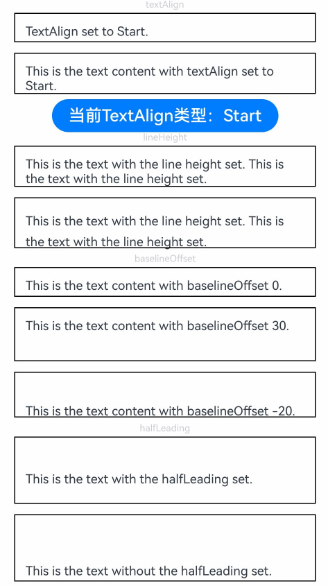

### 示例2（设置文本样式）

该示例通过decoration、letterSpacing、textCase、fontFamily、textShadow、fontStyle、textIndent、fontWeight属性展示了不同样式的文本效果。

```ts
@Extend(Text)
function style() {
  .font({ size: 12 })
  .border({ width: 1 })
  .padding(10)
  .width('100%')
  .margin(5)
}

@Entry
@Component
struct TextExample2 {
  @State changeDecorationIndex: number = 0;
  @State TextDecorationType: TextDecorationType[] =
    [TextDecorationType.LineThrough, TextDecorationType.Overline, TextDecorationType.Underline];
  @State TextDecorationTypeStr: string[] = ['LineThrough', 'Overline', 'Underline'];
  @State TextDecorationStyle: TextDecorationStyle[] =
    [TextDecorationStyle.SOLID, TextDecorationStyle.DOTTED, TextDecorationStyle.WAVY];
  @State TextDecorationStyleStr: string[] = ['SOLID', 'DOTTED', 'WAVY'];

  build() {
    Flex({ direction: FlexDirection.Column, alignItems: ItemAlign.Center }) {
      Text('decoration').fontSize(9).fontColor(0xCCCCCC)
      Text('This is the text content with the decoration set to LineThrough and the color set to Red.')
        .decoration({
          type: this.TextDecorationType[this.changeDecorationIndex],
          color: Color.Red,
          style: this.TextDecorationStyle[this.changeDecorationIndex]
        })
        .style()
        .margin(5)

      Row() {
        Button('当前decoration类型：' + this.TextDecorationTypeStr[this.changeDecorationIndex] + ' & ' +
        this.TextDecorationStyleStr[this.changeDecorationIndex]).onClick(() => {
          this.changeDecorationIndex++;
          if (this.changeDecorationIndex > (this.TextDecorationTypeStr.length - 1)) {
            this.changeDecorationIndex = 0;
          }
        })
      }.justifyContent(FlexAlign.Center).width('100%')

      // 文本字符间距
      Text('letterSpacing').fontSize(9).fontColor(0xCCCCCC)
      Text('This is the text content with letterSpacing 0.')
        .letterSpacing(0)
        .style()
      Text('This is the text content with letterSpacing 3.')
        .letterSpacing(3)
        .style()
      Text('This is the text content with letterSpacing -1.')
        .letterSpacing(-1)
        .style()

      Text('textCase').fontSize(9).fontColor(0xCCCCCC)
      Text('This is the text content with textCase set to Normal.')
        .textCase(TextCase.Normal)
        .style()
      // 文本全小写展示
      Text('This is the text content with textCase set to LowerCase.')
        .textCase(TextCase.LowerCase)
        .style()
      // 文本全大写展示
      Text('This is the text content with textCase set to UpperCase.')
        .textCase(TextCase.UpperCase)
        .style()

      Text('fontFamily').fontSize(9).fontColor(0xCCCCCC)
      // 设置字体列表
      Text('This is the text content with fontFamily')
        .style()
        .fontFamily('HarmonyOS Sans')

      Text('textShadow').fontSize(9).fontColor(0xCCCCCC)
      // 设置文字阴影效果
      Text('textShadow')
        .style()
        .textAlign(TextAlign.Center)
        .fontSize(40)
        .textShadow({
          radius: 10,
          color: Color.Black,
          offsetX: 0,
          offsetY: 0
        })

      Text('fontStyle').fontSize(9).fontColor(0xCCCCCC)
      // 设置字体样式
      Text('This is the text content with fontStyle set to Italic')
        .style()
        .fontStyle(FontStyle.Italic)
      Text('This is the text content with fontStyle set to Normal')
        .style()
        .fontStyle(FontStyle.Normal)

      Text('textIndent').fontSize(9).fontColor(0xCCCCCC)
      // 设置文字缩进
      Text('This is the text content with textIndent 30')
        .style()
        .textIndent(30)

      Text('fontWeight').fontSize(9).fontColor(0xCCCCCC)
      // 设置文本的字体粗细
      Text('This is the text content with fontWeight 800')
        .style()
        .fontWeight('800', { enableVariableFontWeight: true })

    }.width('100%').padding({ left: 35, right: 35 })
  }
}
```
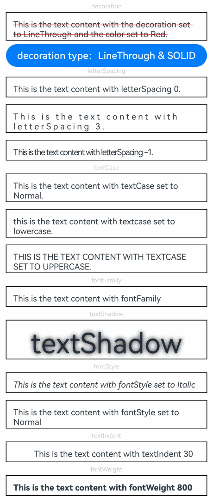

### 示例3（设置文本超长省略）

该示例通过maxLines、textOverflow、ellipsisMode属性展示了文本超长省略以及调整省略位置的效果。

```ts
@Extend(Text)
function style() {
  .textAlign(TextAlign.Center)
  .fontSize(12)
  .border({ width: 1 })
  .padding(10)
  .width('100%')
  .margin(5)
}

@Entry
@Component
struct TextExample3 {
  @State text: string =
    'The text component is used to display a piece of textual information.Support universal attributes and universal text attributes.';
  @State ellipsisModeIndex: number = 0;
  @State ellipsisMode: EllipsisMode[] = [EllipsisMode.START, EllipsisMode.CENTER, EllipsisMode.END];
  @State ellipsisModeStr: string[] = ['START', 'CENTER', 'END'];

  build() {
    Flex({ direction: FlexDirection.Column, alignItems: ItemAlign.Center }) {
      // 文本超长时显示方式
      Text('TextOverflow+maxLines').fontSize(9).fontColor(0xCCCCCC)
      // 超出maxLines截断内容展示
      Text('This is the setting of textOverflow to Clip text content This is the setting of textOverflow to None text content. This is the setting of textOverflow to Clip text content This is the setting of textOverflow to None text content.')
        .textOverflow({ overflow: TextOverflow.Clip })
        .maxLines(1)
        .style()

      // 超出maxLines展示省略号
      Text('This is set textOverflow to Ellipsis text content This is set textOverflow to Ellipsis text content.')
        .textOverflow({ overflow: TextOverflow.Ellipsis })
        .maxLines(1)
        .style()

      Text('marquee').fontSize(9).fontColor(0xCCCCCC)
      // 设置文本超长时以跑马灯的方式展示
      Text('This is the text with the text overflow set marquee')
        .textOverflow({ overflow: TextOverflow.MARQUEE })
        .style()
        .marqueeOptions({
          start: true,
          fromStart: true,
          step: 6,
          loop: -1,
          delay: 0,
          fadeout: false,
          marqueeStartPolicy: MarqueeStartPolicy.DEFAULT
        })
        .onMarqueeStateChange((state: MarqueeState) => {
          if (state == MarqueeState.START) {
            // "收到状态: START";
          } else if (state == MarqueeState.BOUNCE) {
            // "收到状态: BOUNCE";
          } else if (state == MarqueeState.FINISH) {
            // "收到状态: FINISH";
          }
        })

      Text('ellipsisMode').fontSize(9).fontColor(0xCCCCCC)
      // 设置文本超长时省略号的位置
      Text(this.text)
        .textOverflow({ overflow: TextOverflow.Ellipsis })
        .ellipsisMode(this.ellipsisMode[this.ellipsisModeIndex])
        .maxLines(1)
        .style()

      Row() {
        Button('更改省略号位置：' + this.ellipsisModeStr[this.ellipsisModeIndex]).onClick(() => {
          this.ellipsisModeIndex++;
          if (this.ellipsisModeIndex > (this.ellipsisModeStr.length - 1)) {
            this.ellipsisModeIndex = 0;
          }
        })
      }
    }.height(600).width('100%').padding({ left: 35, right: 35, top: 35 })
  }
}
```

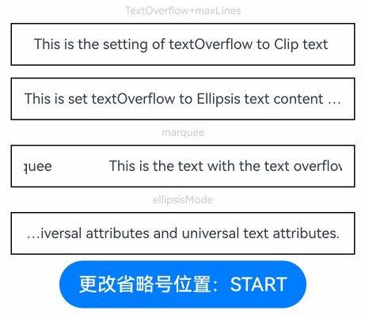

### 示例4（设置文本断行及折行）

该示例通过wordBreak、lineBreakStrategy、clip属性展示了文本在不同断行、折行规则下的效果以及文本超长时是否截断。

```ts
// xxx.ets
@Extend(Text)
function style() {
  .fontSize(12)
  .border({ width: 1 })
  .padding(10)
  .width('100%')
  .margin(5)
}

@Entry
@Component
struct TextExample4 {
  @State text: string =
    'The text component is used to display a piece of textual information.Support universal attributes and universal text attributes.';
  @State text2: string =
    "They can be classified as built-in components–those directly provided by the ArkUI framework and custom components – those defined by developers" +
      "The built-in components include buttons radio buttons progress indicators and text You can set the rendering effect of these components in method chaining mode," +
      "page components are divided into independent UI units to implement independent creation development and reuse of different units on pages making pages more engineering-oriented.";
  @State textClip: boolean = false;
  @State wordBreakIndex: number = 0;
  @State wordBreak: WordBreak[] = [WordBreak.NORMAL, WordBreak.BREAK_ALL, WordBreak.BREAK_WORD];
  @State wordBreakStr: string[] = ['NORMAL', 'BREAK_ALL', 'BREAK_WORD'];
  @State lineBreakStrategyIndex: number = 0;
  @State lineBreakStrategy: LineBreakStrategy[] =
    [LineBreakStrategy.GREEDY, LineBreakStrategy.HIGH_QUALITY, LineBreakStrategy.BALANCED];
  @State lineBreakStrategyStr: string[] = ['GREEDY', 'HIGH_QUALITY', 'BALANCED'];

  build() {
    Flex({ direction: FlexDirection.Column, alignItems: ItemAlign.Center }) {
      Text('wordBreak').fontSize(9).fontColor(0xCCCCCC)
      // 设置文本断行规则
      Text(this.text)
        .maxLines(2)
        .textOverflow({ overflow: TextOverflow.Ellipsis })
        .wordBreak(this.wordBreak[this.wordBreakIndex])
        .style()

      Row() {
        Button('当前wordBreak模式：' + this.wordBreakStr[this.wordBreakIndex]).onClick(() => {
          this.wordBreakIndex++;
          if (this.wordBreakIndex > (this.wordBreakStr.length - 1)) {
            this.wordBreakIndex = 0;
          }
        })
      }

      Text('clip').fontSize(9).fontColor(0xCCCCCC)
      // 设置文本是否超长截断
      Text('This is set wordBreak to WordBreak text Taumatawhakatangihangakoauauotamateaturipukakapikimaungahoronukupokaiwhenuakitanatahu.')
        .wordBreak(WordBreak.NORMAL)
        .maxLines(2)
        .clip(this.textClip)
        .style()
      Row() {
        Button('切换clip：' + this.textClip).onClick(() => {
          this.textClip = !this.textClip;
        })
      }

      Text('lineBreakStrategy').fontSize(9).fontColor(0xCCCCCC)
      // 设置文本折行规则
      Text(this.text2)
        .lineBreakStrategy(this.lineBreakStrategy[this.lineBreakStrategyIndex])
        .style()
      Row() {
        Button('当前lineBreakStrategy模式：' + this.lineBreakStrategyStr[this.lineBreakStrategyIndex]).onClick(() => {
          this.lineBreakStrategyIndex++;
          if (this.lineBreakStrategyIndex > (this.lineBreakStrategyStr.length - 1)) {
            this.lineBreakStrategyIndex = 0;
          }
        })
      }
    }.height(600).width('100%').padding({ left: 35, right: 35, top: 35 })
  }
}
```

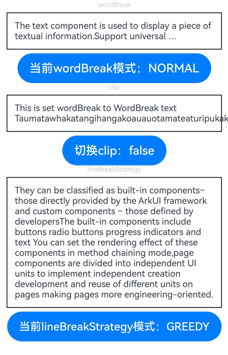

### 示例5（设置文本选中和复制）

该示例通过selection、onCopy、draggable、caretColor、selectedBackgroundColor接口展示了文本选中、触发复制回调、设置文本选中可拖拽以及修改手柄和选中颜色的效果。

```ts
// xxx.ets
@Entry
@Component
struct TextExample5 {
  @State onCopy: string = '';
  @State text: string =
    'This is set selection to Selection text content This is set selection to Selection text content.';
  @State start: number = 0;
  @State end: number = 20;

  build() {
    Flex({ direction: FlexDirection.Column, alignItems: ItemAlign.Start, justifyContent: FlexAlign.Start }) {
      Text(this.text)
        .fontSize(12)
        .border({ width: 1 })
        .lineHeight(20)
        .margin(30)
        .copyOption(CopyOptions.InApp)
        .selection(this.start, this.end)
        .onCopy((value: string) => {
          this.onCopy = value;
        })
        .draggable(true)
        .caretColor(Color.Red)
        .selectedBackgroundColor(Color.Grey)
        .enableHapticFeedback(true)
      Button('Set text selection')
        .margin({ left: 20 })
        .onClick(() => {
          // 变更文本选中起始点、终点
          this.start = 10;
          this.end = 30;
        })
      Text(this.onCopy).fontSize(12).margin(10).key('copy')
    }.height(600).width(335).padding({ left: 35, right: 35, top: 35 })
  }
}
```
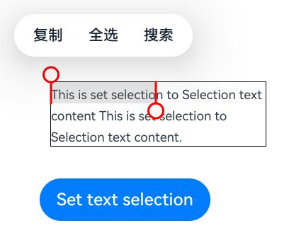

### 示例6（设置文本自适应和缩放倍数限制范围）

该示例通过heightAdaptivePolicy属性展示文本自适应效果以及通过minFontScale、maxFontScale展示设置字体缩放倍数限制范围。

```ts
// xxx.ets
@Extend(Text)
function style(HeightAdaptivePolicy: TextHeightAdaptivePolicy) {
  .width('80%')
  .height(90)
  .borderWidth(1)
  .minFontSize(10)
  .maxFontSize(30)
  .maxLines(2)
  .margin(5)
  .textOverflow({ overflow: TextOverflow.Ellipsis })
  .heightAdaptivePolicy(HeightAdaptivePolicy)
}

@Entry
@Component
struct TextExample6 {
  build() {
    Flex({ direction: FlexDirection.Column, alignItems: ItemAlign.Center }) {
      // 设置文本自适应高度的方式
      Text('heightAdaptivePolicy').fontSize(9).fontColor(0xCCCCCC)
      Text('This is the text with the height adaptive policy set.')
        .style(TextHeightAdaptivePolicy.MAX_LINES_FIRST)
      Text('This is the text with the height adaptive policy set.')
        .style(TextHeightAdaptivePolicy.MIN_FONT_SIZE_FIRST)
      Text('This is the text with the height adaptive policy set.')
        .style(TextHeightAdaptivePolicy.LAYOUT_CONSTRAINT_FIRST)

      Text('fontScale').fontSize(9).fontColor(0xCCCCCC)
      Text('This is the text content with minFontScale set to 1 and maxFontScale set to 1.2')
        .style(TextHeightAdaptivePolicy.MAX_LINES_FIRST)
        .minFontScale(1)
        .maxFontScale(1.2)
    }.height(600).width('100%').padding({ left: 35, right: 35, top: 35 })
  }
}
```


### 示例7（设置文本识别）

该示例通过enableDataDetector、dataDetectorConfig接口实现了文本识别的功能。

```ts
// xxx.ets
@Entry
@Component
struct TextExample7 {
  @State phoneNumber: string = '(86) (755) ********';
  @State url: string = 'www.********.com';
  @State email: string = '***@example.com';
  @State address: string = 'XX省XX市XX区XXXX';
  @State datetime: string = 'XX年XX月XX日XXXX';
  @State enableDataDetector: boolean = true;
  @State types: TextDataDetectorType[] = [];

  build() {
    Row() {
      Column() {
        Text(
          '电话号码：' + this.phoneNumber + '\n' +
            '链接：' + this.url + '\n' +
            '邮箱：' + this.email + '\n' +
            '地址：' + this.address + '\n' +
            '时间：' + this.datetime
        )
          .fontSize(16)
          .copyOption(CopyOptions.InApp)
          .enableDataDetector(this.enableDataDetector)
          .dataDetectorConfig({
            types: this.types, onDetectResultUpdate: (result: string) => {
            }
          })
          .textAlign(TextAlign.Center)
          .borderWidth(1)
          .padding(10)
          .width('100%')
      }
      .width('100%')
      // 使用parallelGesture中的TapGesture替代onClick属性，达到非冒泡事件类似冒泡
      // 的效果，点击Text组件区域Column上的点击事件正常响应
      .parallelGesture(TapGesture().onAction((event: GestureEvent) => {
        console.log('test column onClick timestamp:' + event.timestamp);
      }), GestureMask.Normal)
    }
    .height('100%')
  }
}
```


### 示例8（文本绑定自定义菜单）

该示例通过bindSelectionMenu、onTextSelectionChange、closeSelectionMenu接口实现了文本绑定自定义菜单的功能。

```ts
// xxx.ets
@Entry
@Component
struct TextExample8 {
  controller: TextController = new TextController();
  options: TextOptions = { controller: this.controller };

  build() {
    Column() {
      Column() {
        Text(undefined, this.options) {
          Span('Hello World')
          ImageSpan($r('app.media.icon'))
            .width('100px')
            .height('100px')
            .objectFit(ImageFit.Fill)
            .verticalAlign(ImageSpanAlignment.CENTER)
        }
        .copyOption(CopyOptions.InApp)
        .bindSelectionMenu(TextSpanType.IMAGE, this.LongPressImageCustomMenu, TextResponseType.LONG_PRESS, {
          onDisappear: () => {
            console.info(`自定义选择菜单关闭时回调`);
          },
          onAppear: () => {
            console.info(`自定义选择菜单弹出时回调`);
          }
        })
        .bindSelectionMenu(TextSpanType.TEXT, this.RightClickTextCustomMenu, TextResponseType.RIGHT_CLICK)
        .bindSelectionMenu(TextSpanType.MIXED, this.SelectMixCustomMenu, TextResponseType.SELECT)
        .onTextSelectionChange((selectionStart: number, selectionEnd: number) => {
          console.info(`文本选中区域变化回调, selectionStart: ${selectionStart}, selectionEnd: ${selectionEnd}`);
        })
        .borderWidth(1)
        .borderColor(Color.Red)
        .width(200)
        .height(100)
      }
      .width('100%')
      .backgroundColor(Color.White)
      .alignItems(HorizontalAlign.Start)
      .padding(25)
    }
    .height('100%')
  }

  @Builder
  RightClickTextCustomMenu() {
    Column() {
      Menu() {
        MenuItemGroup() {
          MenuItem({ startIcon: $r('app.media.app_icon'), content: "Right Click Menu 1", labelInfo: "" })
            .onClick((event) => {
              this.controller.closeSelectionMenu();
            })
          MenuItem({ startIcon: $r('app.media.app_icon'), content: "Right Click Menu 2", labelInfo: "" })
          MenuItem({ startIcon: $r('app.media.app_icon'), content: "Right Click Menu 3", labelInfo: "" })
        }
      }
      .MenuStyles()
    }
  }

  @Builder
  LongPressImageCustomMenu() {
    Column() {
      Menu() {
        MenuItemGroup() {
          MenuItem({ startIcon: $r('app.media.app_icon'), content: "Long Press Image Menu 1", labelInfo: "" })
            .onClick((event) => {
              this.controller.closeSelectionMenu();
            })
          MenuItem({ startIcon: $r('app.media.app_icon'), content: "Long Press Image Menu 2", labelInfo: "" })
          MenuItem({ startIcon: $r('app.media.app_icon'), content: "Long Press Image Menu 3", labelInfo: "" })
        }
      }
      .MenuStyles()
    }
  }

  @Builder
  SelectMixCustomMenu() {
    Column() {
      Menu() {
        MenuItemGroup() {
          MenuItem({ startIcon: $r('app.media.app_icon'), content: "Select Mixed Menu 1", labelInfo: "" })
            .onClick((event) => {
              this.controller.closeSelectionMenu();
            })
          MenuItem({ startIcon: $r('app.media.app_icon'), content: "Select Mixed Menu 2", labelInfo: "" })
          MenuItem({ startIcon: $r('app.media.app_icon'), content: "Select Mixed Menu 3", labelInfo: "" })
        }
      }
      .MenuStyles()
    }
  }
}

@Extend(Menu)
function MenuStyles() {
  .radius($r('sys.float.ohos_id_corner_radius_card'))
  .clip(true)
  .backgroundColor('#F0F0F0')
}
```

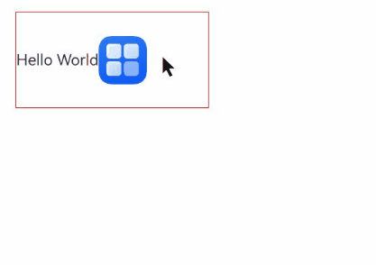

### 示例9（设置文本特性与行间距）

该示例通过fontFeature、lineSpacing接口展示了设置文本特性与行间距的效果。

```ts
// xxx.ets
import { LengthMetrics } from '@kit.ArkUI'

@Extend(Text)
function style() {
  .fontSize(12)
  .border({ width: 1 })
  .width('100%')
}

@Entry
@Component
struct TextExample9 {
  build() {
    Flex({ direction: FlexDirection.Column, alignItems: ItemAlign.Center, justifyContent: FlexAlign.SpaceBetween }) {
      Text('lineSpacing').fontSize(9).fontColor(0xCCCCCC)
      // 设置文本行间距
      Text('This is a context with no lineSpacing set.')
        .lineSpacing(undefined)
        .style()
      Text('This is a context with lineSpacing set to 20_px.')
        .lineSpacing(LengthMetrics.px(20))
        .style()
      Text('This is the context with lineSpacing set to 20_vp.')
        .lineSpacing(LengthMetrics.vp(20))
        .style()
      Text('This is the context with lineSpacing set to 20_fp.')
        .lineSpacing(LengthMetrics.fp(20))
        .style()
      Text('This is the context with lineSpacing set to 20_lpx.')
        .lineSpacing(LengthMetrics.lpx(20))
        .style()
      Text('This is the context with lineSpacing set to 100%.')
        .lineSpacing(LengthMetrics.percent(1))
        .style()
      Text('The line spacing of this context is set to 20_px, and the spacing is effective only between the lines.')
        .lineSpacing(LengthMetrics.px(20), { onlyBetweenLines: true })
        .style()

      Text('fontFeature').fontSize(9).fontColor(0xCCCCCC)
      // 设置文本特性
      Text('This is ss01 on : 0123456789')
        .fontFeature("\"ss01\" on")
        .style()
      Text('This is ss01 off: 0123456789')
        .fontFeature("\"ss01\" off")
        .style()
    }.height(300).width(350).padding({ left: 35, right: 35, top: 35 })
  }
}
```

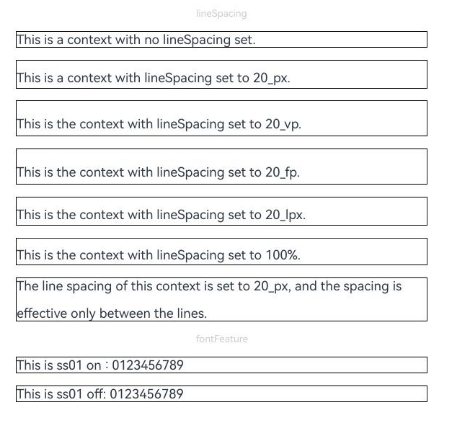

### 示例10（获取文本信息）

该示例通过getLayoutManager接口调用文本的布局管理对象获取文本信息。

```ts
// xxx.ets
import { text } from '@kit.ArkGraphics2D'

@Entry
@Component
struct TextExample10 {
  @State lineCount: string = "";
  @State glyphPositionAtCoordinate: string = "";
  @State lineMetrics: string = "";
  @State rectsForRangeStr: string = "";
  controller: TextController = new TextController();
  @State textStr: string =
    'Hello World! 您好，世界！';

  build() {
    Scroll() {
      Column() {
        Text('Text组件getLayoutManager接口获取段落相对组件的信息')
          .fontSize(15)
          .fontColor(0xCCCCCC)
          .width('90%')
          .padding(10)
        Text(this.textStr, { controller: this.controller })
          .fontSize(25)
          .borderWidth(1)
          .onAreaChange(() => {
            let layoutManager: LayoutManager = this.controller.getLayoutManager();
            this.lineCount = "LineCount: " + layoutManager.getLineCount();
          })

        Text('LineCount').fontSize(15).fontColor(0xCCCCCC).width('90%').padding(10)
        Text(this.lineCount)

        Text('GlyphPositionAtCoordinate').fontSize(15).fontColor(0xCCCCCC).width('90%').padding(10)
        Button("相对组件坐标[150,50]字形信息")
          .onClick(() => {
            let layoutManager: LayoutManager = this.controller.getLayoutManager();
            let position: PositionWithAffinity = layoutManager.getGlyphPositionAtCoordinate(150, 50);
            this.glyphPositionAtCoordinate =
              "相对组件坐标[150,50] glyphPositionAtCoordinate position: " + position.position + " affinity: " +
              position.affinity;
          })
          .margin({ bottom: 20, top: 10 })
        Text(this.glyphPositionAtCoordinate)

        Text('LineMetrics').fontSize(15).fontColor(0xCCCCCC).width('90%').padding(10)
        Button("首行行信息、文本样式信息、以及字体属性信息")
          .onClick(() => {
            let layoutManager: LayoutManager = this.controller.getLayoutManager();
            let lineMetrics: LineMetrics = layoutManager.getLineMetrics(0);
            this.lineMetrics = "lineMetrics is " + JSON.stringify(lineMetrics) + "\n\n";
            let runMetrics = lineMetrics.runMetrics;
            runMetrics.forEach((value, key) => {
              this.lineMetrics += "runMetrics key is " + key + " " + JSON.stringify(value) + "\n\n";
            })
          })
          .margin({ bottom: 20, top: 10 })
        Text(this.lineMetrics)

        Text('getRectsForRange').fontSize(15).fontColor(0xCCCCCC).width('90%').padding(10)
        Button("获取指定矩形宽度和高度下，文本中任意区间范围内字符或占位符的绘制区域信息")
          .onClick(() => {
            let layoutManager: LayoutManager = this.controller.getLayoutManager();
            let range: TextRange = { start: 0, end: 1 };
            let rectsForRangeInfo: text.TextBox[] =
              layoutManager.getRectsForRange(range, text.RectWidthStyle.TIGHT, text.RectHeightStyle.TIGHT);
            this.rectsForRangeStr = "getRectsForRange result is " + "\n\n";
            rectsForRangeInfo.forEach((value, key) => {
              this.rectsForRangeStr += "rectsForRange key is " + key + " " + JSON.stringify(value) + "\n\n";
            })
          })
          .margin({ bottom: 20, top: 10 })
        Text(this.rectsForRangeStr)
      }
      .margin({ top: 100, left: 8, right: 8 })
    }
  }
}
```

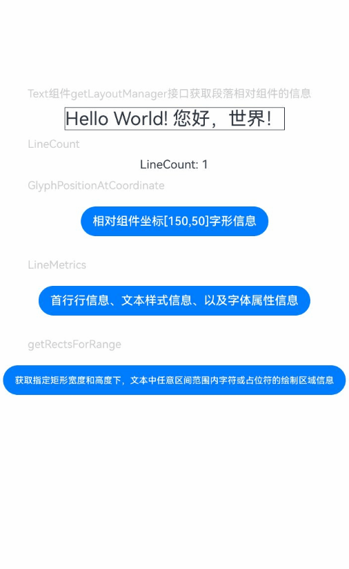

### 示例11（实现键盘框选文本）

该示例通过textSelectable属性实现了设置TextSelectMode.SELECTABLE_FOCUSABLE属性时能够触发键盘框选文本功能。

```ts
// xxx.ets
@Entry
@Component
struct TextExample11 {
  @State message: string =
    'TextTextTextTextTextTextTextText' + 'TextTextTextTextTextTextTextTextTextTextTextTextTextTextTextText';

  build() {
    Column() {
      Text(this.message)
        .width(300)
        .height(100)
        .maxLines(5)
        .fontColor(Color.Black)
        .copyOption(CopyOptions.InApp)
        .selection(3, 8)
        .textSelectable(TextSelectableMode.SELECTABLE_FOCUSABLE)
    }.width('100%').margin({ top: 100 })
  }
}
```

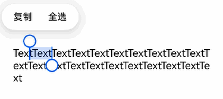

### 示例12（文本扩展自定义菜单）

该示例通过editMenuOptions接口实现了文本设置自定义菜单扩展项的文本内容、图标以及回调的功能。

```ts
// xxx.ets
@Entry
@Component
struct TextExample12 {
  @State text: string = 'Text editMenuOptions'
  onCreateMenu = (menuItems: Array<TextMenuItem>) => {
    let item1: TextMenuItem = {
      content: 'custom1',
      icon: $r('app.media.startIcon'),
      id: TextMenuItemId.of('custom1'),
    };
    let item2: TextMenuItem = {
      content: 'custom2',
      id: TextMenuItemId.of('custom2'),
      icon: $r('app.media.startIcon'),
    };
    menuItems.push(item1);
    menuItems.unshift(item2);
    return menuItems;
  }
  onMenuItemClick = (menuItem: TextMenuItem, textRange: TextRange) => {
    if (menuItem.id.equals(TextMenuItemId.of("custom2"))) {
      console.log("拦截 id: custom2 start:" + textRange.start + "; end:" + textRange.end);
      return true;
    }
    if (menuItem.id.equals(TextMenuItemId.COPY)) {
      console.log("拦截 COPY start:" + textRange.start + "; end:" + textRange.end);
      return true;
    }
    if (menuItem.id.equals(TextMenuItemId.SELECT_ALL)) {
      console.log("不拦截 SELECT_ALL start:" + textRange.start + "; end:" + textRange.end);
      return false;
    }
    return false;
  };
  @State editMenuOptions: EditMenuOptions = {
    onCreateMenu: this.onCreateMenu, onMenuItemClick: this.onMenuItemClick
  };

  build() {
    Column() {
      Text(this.text)
        .fontSize(20)
        .copyOption(CopyOptions.LocalDevice)
        .editMenuOptions(this.editMenuOptions)
        .margin({ top: 100 })
    }
    .width("90%")
    .margin("5%")
  }
}
```

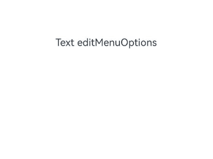

### 示例13（配置隐私隐藏）

该示例通过privacySensitive属性展示了文本如何配置隐私隐藏的效果，实际显示需要卡片框架支持。

```ts
// xxx.ets
@Entry
@Component
struct TextExample13 {
  build() {
    Column({ space: 10 }) {
      Text("privacySensitive")
        .privacySensitive(true)
        .margin({ top: 30 })
    }
    .alignItems(HorizontalAlign.Center)
    .width("100%")
  }
}
```

