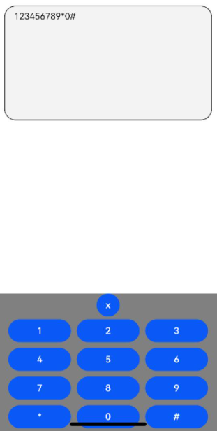
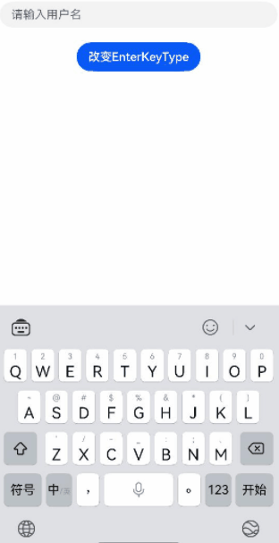
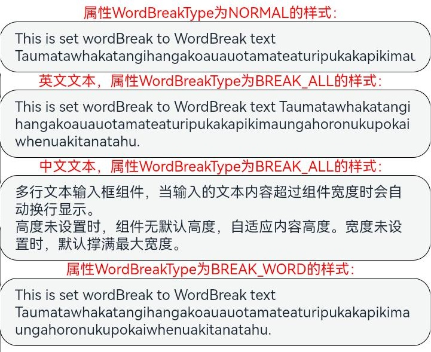
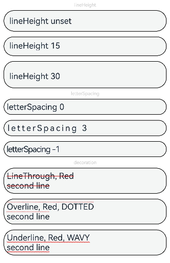

# TextArea

多行文本输入框组件，当输入的文本内容超过组件宽度时会自动换行显示。

高度未设置时，组件无默认高度，自适应内容高度。宽度未设置时，默认撑满最大宽度。

>  **说明：**
>
>  该组件从API Version 7开始支持。后续版本如有新增内容，则采用上角标单独标记该内容的起始版本。


## 子组件

无


## 接口

TextArea(value?: TextAreaOptions)

**参数：**
| 参数名 |类型|必填|说明|
|-----|-----|----|----|
| value | [TextAreaOptions](#textareaoptions对象说明) | 否  | TextArea组件参数。 |

## TextAreaOptions对象说明
| 参数名                     | 参数类型                                     | 必填   | 参数描述           |
| ----------------------- | ---------------------------------------- | ---- | -------------- |
| placeholder      | [ResourceStr](ts-types.md#resourcestr)  | 否    | 设置无输入时的提示文本。输入内容后，提示文本不显示。<br/>仅设置placeholder属性时，手柄依然跟随拖动，手柄松开后光标停留在文字开头位置。     |
| text             | [ResourceStr](ts-types.md#resourcestr)  | 否    | 设置输入框当前的文本内容。</br>建议通过onChange事件将状态变量与文本实时绑定，</br>避免组件刷新时TextArea中的文本内容异常。<br />从API version 10开始，该参数支持[$$](../../../quick-start/arkts-two-way-sync.md)双向绑定变量。 |
| controller<sup>8+</sup> | [TextAreaController](#textareacontroller8) | 否    | 设置TextArea控制器。 |


## 属性

除支持[通用属性](ts-universal-attributes-size.md)和[文本通用属性](ts-universal-attributes-text-style.md)的fontColor、fontSize、fontStyle、fontWeight、fontFamily外，还支持以下属性：

### placeholderColor

placeholderColor(value: ResourceColor)

设置placeholder文本颜色。

**系统能力：** SystemCapability.ArkUI.ArkUI.Full

**参数：** 

| 参数名 | 类型                                       | 必填 | 说明                                         |
| ------ | ------------------------------------------ | ---- | -------------------------------------------- |
| value  | [ResourceColor](ts-types.md#resourcecolor) | 是   | placeholder文本颜色。<br/>默认值：跟随主题。 |

### placeholderFont

placeholderFont(value: Font)

设置placeholder文本样式，包括字体大小，字体粗细，字体族，字体风格。目前仅支持默认字体族。

**系统能力：** SystemCapability.ArkUI.ArkUI.Full

**参数：** 

| 参数名 | 类型                     | 必填 | 说明                  |
| ------ | ------------------------ | ---- | --------------------- |
| value  | [Font](ts-types.md#font) | 是   | placeholder文本样式。 |

### textAlign

textAlign(value: TextAlign)

设置文本在输入框中的水平对齐方式。

支持TextAlign.Start、TextAlign.Center和TextAlign.End。

可通过[align](ts-universal-attributes-location.md)属性控制文本段落在垂直方向上的位置，此组件中不可通过align属性控制文本段落在水平方向上的位置，即align属性中Alignment.TopStart、Alignment.Top、Alignment.TopEnd效果相同，控制内容在顶部，Alignment.Start、Alignment.Center、Alignment.End效果相同，控制内容垂直居中，Alignment.BottomStart、Alignment.Bottom、Alignment.BottomEnd效果相同，控制内容在底部。

当textAlign属性设置为TextAlign.JUSTIFY时，最后一行文本不参与两端对齐，为水平对齐首部效果。

从API version 11开始，textAlign可设置TextAlign.JUSTIFY

**系统能力：** SystemCapability.ArkUI.ArkUI.Full

**参数：** 

| 参数名 | 类型                                        | 必填 | 说明                                                       |
| ------ | ------------------------------------------- | ---- | ---------------------------------------------------------- |
| value  | [TextAlign](ts-appendix-enums.md#textalign) | 是   | 文本在输入框中的水平对齐方式。<br/>默认值：TextAlign.Start |

### caretColor

caretColor(value: ResourceColor)

设置输入框光标颜色。

**系统能力：** SystemCapability.ArkUI.ArkUI.Full

**参数：** 

| 参数名 | 类型                                       | 必填 | 说明                                   |
| ------ | ------------------------------------------ | ---- | -------------------------------------- |
| value  | [ResourceColor](ts-types.md#resourcecolor) | 是   | 输入框光标颜色。<br/>默认值：'#007DFF' |

>  **说明：**     
>   从API version 12开始，此接口支持设置文本手柄颜色和文本选中底板颜色，光标、文本手柄和文本选中底板颜色保持一致。<br/>文本手柄透明度为设置透明度，文本选中底板透明度，默认20%，如果设置透明度，文本选中底板颜色透明度在设置色透明度的基础上再叠加20%。例如，设置透明度50%，文本选中底板颜色透明度为10%。

### inputFilter<sup>8+</sup>

inputFilter(value: ResourceStr, error?: (value: string) => void)

通过正则表达式设置输入过滤器。匹配表达式的输入允许显示，不匹配的输入将被过滤。仅支持单个字符匹配，不支持字符串匹配。

**系统能力：** SystemCapability.ArkUI.ArkUI.Full

**参数：** 

| 参数名 | 类型                                   | 必填 | 说明                               |
| ------ | -------------------------------------- | ---- | ---------------------------------- |
| value  | [ResourceStr](ts-types.md#resourcestr) | 是   | 正则表达式。                       |
| error  | (value: string) => void                | 否   | 正则匹配失败时，返回被过滤的内容。 |

### copyOption<sup>9+</sup>

copyOption(value: CopyOptions)

设置输入的文本是否可复制。设置CopyOptions.None时，当前TextArea中的文字无法被复制或剪切，仅支持粘贴。

copyOption对于拖拽，只限制是否选中，不涉及拖拽范围。

**系统能力：** SystemCapability.ArkUI.ArkUI.Full

**参数：** 

| 参数名 | 类型                                             | 必填 | 说明                                                         |
| ------ | ------------------------------------------------ | ---- | ------------------------------------------------------------ |
| value  | [CopyOptions](ts-appendix-enums.md#copyoptions9) | 是   | 输入的文本是否可复制。<br/>默认值：CopyOptions.LocalDevice，支持设备内复制。 |

### maxLength<sup>10+</sup>

maxLength(value: number)

设置文本的最大输入字符数。默认不设置最大输入字符数限制。到达文本最大字符限制，将无法继续输入字符，同时边框变为红色。

**系统能力：** SystemCapability.ArkUI.ArkUI.Full

**参数：** 

| 参数名 | 类型   | 必填 | 说明                   |
| ------ | ------ | ---- | ---------------------- |
| value  | number | 是   | 文本的最大输入字符数。 |

### showCounter<sup>10+</sup>

showCounter(value: boolean, options?: InputCounterOptions)

设置当通过InputCounterOptions输入的字符数超过阈值时显示计数器。

参数value为true时，才能设置options，文本框开启计数下标功能，需要配合maxlength（设置最大字符限制）一起使用。字符计数器显示的效果是当前输入字符数/最大可输入字符数。

当输入字符数大于最大字符数乘百分比值时，显示字符计数器。如果用户设置计数器时不设置InputCounterOptions，那么当前输入字符数达到最大字符数时，边框和计数器下标将变为红色。用户同时设置参数value为true和InputCounterOptions，当thresholdPercentage数值在有效区间内，且输入字符数超过最大字符数时，边框和计数器下标将变为红色，框体抖动。highlightBorder设置为false，则不显示红色边框，计数器默认显示红色边框。内联模式下字符计数器不显示。

**系统能力：** SystemCapability.ArkUI.ArkUI.Full

**参数：** 

| 参数名                | 类型                                                         | 必填 | 说明             |
| --------------------- | ------------------------------------------------------------ | ---- | ---------------- |
| value                 | boolean                                                      | 是   | 是否显示计数器。 |
| options<sup>11+</sup> | [InputCounterOptions](ts-basic-components-textinput.md#inputcounteroptions11对象说明) | 否   | 计数器的百分比。 |

### style<sup>10+</sup>

style(value: TextContentStyle)

设置文本框多态样式。

**系统能力：** SystemCapability.ArkUI.ArkUI.Full

**参数：** 

| 参数名 | 类型                                                        | 必填 | 说明                                                  |
| ------ | ----------------------------------------------------------- | ---- | ----------------------------------------------------- |
| value  | [TextContentStyle](ts-appendix-enums.md#textcontentstyle10) | 是   | 文本框多态样式。<br/>默认值：TextContentStyle.DEFAULT |

### enableKeyboardOnFocus<sup>10+</sup>

enableKeyboardOnFocus(value: boolean)

设置TextArea通过点击以外的方式获焦时，是否绑定输入法。

从API version 10开始，获焦默认绑定输入法。

**系统能力：** SystemCapability.ArkUI.ArkUI.Full

**参数：** 

| 参数名 | 类型    | 必填 | 说明                                                        |
| ------ | ------- | ---- | ----------------------------------------------------------- |
| value  | boolean | 是   | 通过点击以外的方式获焦时，是否绑定输入法。<br/>默认值：true |

### selectionMenuHidden<sup>10+</sup>

selectionMenuHidden(value: boolean)

设置长按、双击输入框或者右键输入框时，是否不弹出文本选择菜单。

**系统能力：** SystemCapability.ArkUI.ArkUI.Full

**参数：** 

| 参数名 | 类型    | 必填 | 说明                                                         |
| ------ | ------- | ---- | ------------------------------------------------------------ |
| value  | boolean | 是   | 长按、双击输入框或者右键输入框时，是否不弹出文本选择菜单。<br />默认值：false |

### barState<sup>10+</sup>

barState(value: BarState)

设置输入框编辑态时滚动条的显示模式。

**系统能力：** SystemCapability.ArkUI.ArkUI.Full

**参数：** 

| 参数名 | 类型                                      | 必填 | 说明                                                         |
| ------ | ----------------------------------------- | ---- | ------------------------------------------------------------ |
| value  | [BarState](ts-appendix-enums.md#barstate) | 是   | 输入框编辑态时滚动条的显示模式。<br/>默认值：BarState.Auto |

### maxLines<sup>10+</sup>

maxLines(value: number)

设置内联输入风格编辑态和非内联模式下文本可显示的最大行数。

**系统能力：** SystemCapability.ArkUI.ArkUI.Full

**参数：** 

| 参数名 | 类型                                      | 必填 | 说明                                                         |
| ------ | ----------------------------------------- | ---- | ------------------------------------------------------------ |
| value  | number | 是   | 内联输入风格编辑态时文本可显示的最大行数。<br/>默认值：3，非内联模式下，默认值为+∞，不限制最大行数。 <br/>取值范围：(0, +∞) |

### customKeyboard<sup>10+</sup>

customKeyboard(value: CustomBuilder, options?: KeyboardOptions)

设置自定义键盘。

当设置自定义键盘时，输入框激活后不会打开系统输入法，而是加载指定的自定义组件。

自定义键盘的高度可以通过自定义组件根节点的height属性设置，宽度不可设置，使用系统默认值。

自定义键盘采用覆盖原始界面的方式呈现，不会对应用原始界面产生压缩或者上提。

自定义键盘无法获取焦点，但是会拦截手势事件。

默认在输入控件失去焦点时，关闭自定义键盘，开发者也可以通过[TextAreaController](#textareacontroller8).[stopEditing](#stopediting10)方法控制键盘关闭。

如果设备支持拍摄输入，设置自定义键盘后，该输入框会不支持拍摄输入。

**系统能力：** SystemCapability.ArkUI.ArkUI.Full

**参数：** 

| 参数名                | 类型                                        | 必填 | 说明                             |
| --------------------- | ------------------------------------------- | ---- | -------------------------------- |
| value                 | [CustomBuilder](ts-types.md#custombuilder8) | 是   | 自定义键盘。                     |
| options<sup>12+</sup> | [KeyboardOptions](#keyboardoptions12)       | 否   | 设置自定义键盘是否支持避让功能。 |

### type<sup>11+</sup>

type(value: TextAreaType)

设置输入框类型。

**系统能力：** SystemCapability.ArkUI.ArkUI.Full

**参数：** 

| 参数名 | 类型                                    | 必填 | 说明                                         |
| ------ | --------------------------------------- | ---- | -------------------------------------------- |
| value  | [TextAreaType](#textareatype11枚举说明) | 是   | 输入框类型。<br/>默认值：TextAreaType.Normal |

### enterKeyType<sup>11+</sup>

enterKeyType(value: EnterKeyType)

设置输入法回车键类型。

**系统能力：** SystemCapability.ArkUI.ArkUI.Full

**参数：** 

| 参数名 | 类型                                             | 必填 | 说明                                                 |
| ------ | ------------------------------------------------ | ---- | ---------------------------------------------------- |
| value  | [EnterKeyType](ts-types.md#enterkeytype枚举说明) | 是   | 输入法回车键类型。<br/>默认值：EnterKeyType.NEW_LINE |

>  **说明：**
>
>  [通用属性padding](ts-universal-attributes-size.md#padding)的默认值为：<br>{<br>&nbsp;top: 8 vp,<br>&nbsp;right: 16 vp,<br>&nbsp;bottom: 8 vp,<br>&nbsp;left: 16 vp<br> }  <br>从API version 11开始，多行输入框可设置.width('auto')使组件宽度自适应文本宽度，自适应时组件宽度受constraintSize属性以及父容器传递的最大最小宽度限制，其余使用方式参考[尺寸设置](ts-universal-attributes-size.md#属性)。

### lineHeight<sup>12+</sup>

lineHeight(value: number | string | Resource)

设置文本的文本行高，设置值不大于0时，不限制文本行高，自适应字体大小，number类型时单位为fp。

**系统能力：** SystemCapability.ArkUI.ArkUI.Full

**参数：**

| 参数名 | 类型                                                         | 必填 | 说明             |
| ------ | ------------------------------------------------------------ | ---- | ---------------- |
| value  | number&nbsp;\|&nbsp;string&nbsp;\|&nbsp;[Resource](ts-types.md#resource) | 是   | 文本的文本行高。 |

### decoration<sup>12+</sup>

decoration(value: TextDecorationOptions)

设置文本装饰线样式及其颜色。

**系统能力：** SystemCapability.ArkUI.ArkUI.Full

**参数：**

| 参数名 | 类型                                                         | 必填 | 说明                                                         |
| ------ | ------------------------------------------------------------ | ---- | ------------------------------------------------------------ |
| value  | [TextDecorationOptions](#textdecorationoptions12对象说明) | 是   | 文本装饰线样式及其颜色。<br />默认值：{<br/>type:&nbsp;TextDecorationType.None,<br/>color：Color.Black<br/>} |

### letterSpacing<sup>12+</sup>

letterSpacing(value: number | string | Resource)

设置文本字符间距。设置该值为百分比时，按默认值显示。设置该值为0时，按默认值显示。

当取值为负值时，文字会发生压缩，负值过小时会将组件内容区大小压缩为0，导致无内容显示。

**系统能力：** SystemCapability.ArkUI.ArkUI.Full

**参数：**

| 参数名 | 类型                       | 必填 | 说明           |
| ------ | -------------------------- | ---- | -------------- |
| value  | number&nbsp;\|&nbsp;string&nbsp;\|&nbsp;[Resource](ts-types.md#resource) | 是   | 文本字符间距。 |

### fontFeature<sup>12+</sup>

fontFeature(value: string)

设置文字特性效果，比如数字等宽的特性。

格式为：normal \| \<feature-tag-value\>

\<feature-tag-value\>的格式为：\<string\> \[ \<integer\> \| on \| off ]

\<feature-tag-value\>的个数可以有多个，中间用','隔开。

例如，使用等宽数字的输入格式为："ss01" on。

**系统能力：** SystemCapability.ArkUI.ArkUI.Full

**参数：** 

| 参数名 | 类型   | 必填 | 说明           |
| ------ | ------ | ---- | -------------- |
| value  | string | 是   | 文字特性效果。 |

设置 Font Feature 属性，Font Feature 是 OpenType 字体的高级排版能力，如支持连字、数字等宽等特性，一般用在自定义字体中，其能力需要字体本身支持。
更多 Font Feature 能力介绍可参考 https://www.w3.org/TR/css-fonts-3/#font-feature-settings-prop 和 https://sparanoid.com/lab/opentype-features/

### wordBreak<sup>12+</sup>

wordBreak(value: WordBreak)

设置文本断行规则。该属性对placeholder文本无效。

**系统能力：** SystemCapability.ArkUI.ArkUI.Full

**参数：** 

| 参数名 | 类型                                          | 必填 | 说明                                          |
| ------ | --------------------------------------------- | ---- | --------------------------------------------- |
| value  | [WordBreak](ts-appendix-enums.md#wordbreak11) | 是   | 文本断行规则。 <br />默认值：WordBreak.BREAK_WORD |

>  **说明：**
>
>  组件不支持clip属性设置，设置该属性任意枚举值对组件文本截断无影响。

### selectedBackgroundColor<sup>12+</sup>

selectedBackgroundColor(value: ResourceColor)

设置文本选中底板颜色。如果未设置不透明度，默认为20%不透明度。

**系统能力：** SystemCapability.ArkUI.ArkUI.Full

**参数：**

| 参数名 | 类型                                       | 必填 | 说明                                       |
| ------ | ------------------------------------------ | ---- | ------------------------------------------ |
| value  | [ResourceColor](ts-types.md#resourcecolor) | 是   | 文本选中底板颜色。<br/>默认为20%不透明度。 |

>  **说明：**  
>   如果文本选中底板未设置颜色，默认使用光标颜色，如果光标颜色有透明度，文本选中底板颜色透明度在光标颜色透明度的基础上再叠加20%。例如，光标颜色透明度为50%，文本选中底板颜色透明度为10%。如果文本选中底板设置颜色，显示设置颜色和透明度。

### caretStyle<sup>12+</sup>

caretStyle(value: CaretStyle)

设置光标风格。

**系统能力：** SystemCapability.ArkUI.ArkUI.Full

**参数：**

| 参数名 | 类型                                | 必填 | 说明         |
| ------ | ----------------------------------- | ---- | ------------ |
| value  | [CaretStyle](#caretstyle12对象说明) | 是   | 光标的风格。 |

### textIndent<sup>12+</sup>

textIndent(value: Dimension)

设置首行文本缩进。

**系统能力：** SystemCapability.ArkUI.ArkUI.Full

**参数：** 

| 参数名 | 类型                         | 必填 | 说明                         |
| ------ | ---------------------------- | ---- | ---------------------------- |
| value  | Dimension                   | 是   | 首行文本缩进。<br/>默认值：0 |

### textOverflow<sup>12+</sup>

textOverflow(value: TextOverflow)

设置文本超长时的显示方式。

文本截断是按字截断。例如，英文以单词为最小单位进行截断，若需要以字母为单位进行截断，可在字母间添加零宽空格：\u200B。建议优先组合wordBreak属性设置为WordBreak.BREAK_ALL方式实现字母为单位进行截断。

当overflow设置为TextOverflow.None、TextOverflow.Clip、TextOverflow.Ellipsis时，需配合maxLines使用，单独设置不生效。设置TextOverflow.None与TextOverflow.Clip效果一样。

**卡片能力：** 该接口支持在ArkTS卡片中使用。

**系统能力：** SystemCapability.ArkUI.ArkUI.Full

**参数：** 

| 参数名 | 类型                                                          | 必填 | 说明                                                         |
| ------ | ------------------------------------------------------------ | ---- | ------------------------------------------------------------ |
| value  | [TextOverflow](ts-appendix-enums.md#textoverflow)            | 是   | 文本超长时的显示方式。<br/>默认值：TextOverflow.Clip           |

>  **说明：**     
>   TextArea组件不支持设置TextOverflow.MARQUEE模式,当设置为TextOverflow.MARQUEE模式时 显示为TextOverflow.Clip

## 事件

除支持[通用事件](ts-universal-events-click.md)外，还支持以下事件：

### onChange

onChange(callback:&nbsp;(value:&nbsp;string)&nbsp;=&gt;&nbsp;void)

输入内容发生变化时，触发该回调。

**系统能力：** SystemCapability.ArkUI.ArkUI.Full

**参数：** 

| 参数名 | 类型   | 必填 | 说明                 |
| ------ | ------ | ---- | -------------------- |
| value  | string | 是   | 当前输入的文本内容。 |

### onEditChange<sup>10+</sup>

onEditChange(callback:&nbsp;(isEditing:&nbsp;boolean)&nbsp;=&gt;&nbsp;void)

输入状态变化时，触发该回调。有光标时为编辑态，无光标时为非编辑态。isEditing为true表示正在输入。

**系统能力：** SystemCapability.ArkUI.ArkUI.Full

**参数：** 

| 参数名    | 类型    | 必填 | 说明                 |
| --------- | ------- | ---- | -------------------- |
| isEditing | boolean | 是   | 为true表示正在输入。 |

### onCopy<sup>8+</sup>

onCopy(callback:(value:&nbsp;string)&nbsp;=&gt;&nbsp;void)

长按输入框内部区域弹出剪贴板后，点击剪切板复制按钮，触发该回调。

**系统能力：** SystemCapability.ArkUI.ArkUI.Full

**参数：** 

| 参数名 | 类型   | 必填 | 说明             |
| ------ | ------ | ---- | ---------------- |
| value  | string | 是   | 复制的文本内容。 |

### onCut<sup>8+</sup>

onCut(callback:(value:&nbsp;string)&nbsp;=&gt;&nbsp;void)

长按输入框内部区域弹出剪贴板后，点击剪切板剪切按钮，触发该回调。

**系统能力：** SystemCapability.ArkUI.ArkUI.Full

**参数：** 

| 参数名 | 类型   | 必填 | 说明             |
| ------ | ------ | ---- | ---------------- |
| value  | string | 是   | 剪切的文本内容。 |

### onPaste

onPaste(callback:(value:&nbsp;string, event:&nbsp;PasteEvent)&nbsp;=&gt;&nbsp;void)

长按输入框内部区域弹出剪贴板后，点击剪切板粘贴按钮，触发该回调。

**系统能力：** SystemCapability.ArkUI.ArkUI.Full

**参数：** 

| 参数名              | 类型                                                         | 必填 | 说明                   |
| ------------------- | ------------------------------------------------------------ | ---- | ---------------------- |
| value               | string                                                       | 是   | 粘贴的文本内容。       |
| event<sup>11+</sup> | [PasteEvent](ts-basic-components-richeditor.md#pasteevent11) | 否   | 用户自定义的粘贴事件。 |

### onTextSelectionChange<sup>10+</sup>

onTextSelectionChange(callback: (selectionStart: number, selectionEnd: number) => void)

文本选择的位置发生变化时，触发该回调。

**系统能力：** SystemCapability.ArkUI.ArkUI.Full

**参数：** 

| 参数名         | 类型   | 必填 | 说明                                    |
| -------------- | ------ | ---- | --------------------------------------- |
| selectionStart | number | 是   | 所选文本的起始位置，文字的起始位置为0。 |
| selectionEnd   | number | 是   | 所选文本的结束位置。                    |

### onContentScroll<sup>10+</sup>

onContentScroll(callback: (totalOffsetX: number, totalOffsetY: number) => void)

文本内容滚动时，触发该回调。

**系统能力：** SystemCapability.ArkUI.ArkUI.Full

**参数：** 

| 参数名       | 类型   | 必填 | 说明                               |
| ------------ | ------ | ---- | ---------------------------------- |
| totalOffsetX | number | 是   | 文本在内容区的横坐标偏移，单位px。 |
| totalOffsetY | number | 是   | 文本在内容区的纵坐标偏移，单位px。 |

### onSubmit<sup>11+</sup>

onSubmit(callback:&nbsp;(enterKey:&nbsp;EnterKeyType)&nbsp;=&gt;&nbsp;void)

按下输入法回车键触发该回调。

**系统能力：** SystemCapability.ArkUI.ArkUI.Full

**参数：** 

| 参数名   | 类型                                             | 必填 | 说明                                                         |
| -------- | ------------------------------------------------ | ---- | ------------------------------------------------------------ |
| enterKey | [EnterKeyType](ts-types.md#enterkeytype枚举说明) | 是   | 输入法回车键类型，类型为EnterKeyType.NEW_LINE时不触发onSubmit。 |

## TextAreaController<sup>8+</sup>

TextArea组件的控制器，目前可通过它设置TextArea组件的光标位置。

### 导入对象

```
controller: TextAreaController = new TextAreaController()
```

### caretPosition<sup>8+</sup>

caretPosition(value: number): void

设置输入光标的位置。

**参数：**

| 参数名 | 参数类型 | 必填 | 参数描述                               |
| ------ | -------- | ---- | -------------------------------------- |
| value  | number   | 是   | 从字符串开始到光标所在位置的字符长度。 |

### setTextSelection<sup>10+</sup>

setTextSelection(selectionStart: number, selectionEnd: number, options?: SelectionOptions): void;

组件在获焦状态下，调用该接口设置文本选择区域并高亮显示，且只有在selectionStart小于selectionEnd时，文字才会被选取、高亮显示。

**参数：**

| 参数名         | 参数类型 | 必填 | 参数描述                                                     |
| -------------- | -------- | ---- | ------------------------------------------------------------ |
| selectionStart | number   | 是   | 文本选择区域起始位置，文本框中文字的起始位置为0。<br/>当selectionStart小于0时、按照0处理；当selectionStart大于文字最大长度时、按照文字最大长度处理。<br/> |
| selectionEnd   | number   | 是   | 文本选择区域结束位置。<br/>当selectionEnd小于0时、按照0处理；当selectionEnd大于文字最大长度时、按照文字最大长度处理。<br/> |
| options<sup>12+</sup>   | [SelectionOptions](#selectionoptions12) | 否    | 选中文字时的配置。<br />默认值：MenuPolicy.DEFAULT。 |
>  **说明：**
>
>  如果selectionMenuHidden被赋值为true或设备为2in1时，即使options被赋值为MenuPolicy.ALWAYS，调用setTextSelection也不弹出菜单。

##  SelectionOptions<sup>12+</sup>

setTextSelection选中文字时的配置。

| 名称       | 类型                        | 必填 | 说明             |
| ---------- | --------------------------- | ---- | ---------------- |
| menuPolicy | [MenuPolicy](#menupolicy12) | 否   | 菜单弹出的策略。 |

## MenuPolicy<sup>12+</sup>

菜单弹出的策略。

| 名称    | 描述                     |
| ------- | ------------------------ |
| DEFAULT | 按照底层默认逻辑决定是否弹出菜单。 |
| NEVER   | 始终不弹出菜单。         |
| ALWAYS  | 始终弹出菜单。           |

### stopEditing<sup>10+</sup>

stopEditing(): void

退出编辑态。

### getTextContentRect<sup>10+</sup>

getTextContentRect(): [RectResult](#rectresult10)

获取已编辑文本内容区域相对组件的位置和大小，返回值单位为像素。

**返回值：**

| 类型       | 说明       |
| -------------------  | -------- |
| [RectResult](#rectresult10) | 已编辑文本内容的相对组件的位置和大小。 |

> **说明：**
>
> - 初始不输入文本时，返回值中有相对组件的位置信息，大小为0。
> - 返回值中的位置信息是第一个字符相对于可编辑组件的位置。
> - 有输入时返回信息中的宽度是组件编辑的固定宽度。

### RectResult<sup>10+</sup>

位置和大小，单位均为像素。

| 参数      | 类型     | 描述 |
| ------- | ------ | ----------------------- |
| x     | number | 水平方向横坐标。|
| y     | number | 竖直方向纵坐标。|
| width | number | 内容宽度大小。|
| height | number | 内容高度大小。|


### getTextContentLineCount<sup>10+</sup>

getTextContentLineCount(): number

获取已编辑文本内容的行数。

**返回值：**

| 类型  | 说明       |
| ----- | -------- |
| number| 已编辑文本内容行数。 |

### getCaretOffset<sup>11+</sup>

getCaretOffset(): CaretOffset

返回当前光标所在位置信息。

**返回值：**

| 类型                      | 说明               |
| ----------------------- | ---------------- |
| [CaretOffset](ts-basic-components-textinput.md#caretoffset11对象说明) | 光标相对输入框的位置。 |

> **说明：**
>
> - 在当前帧更新光标位置同时调用该接口，该接口不生效。

## TextDecorationOptions<sup>12+</sup>对象说明

| 名称    | 参数类型                                                    | 必填 | 描述                                                         |
| ------- | ----------------------------------------------------------- | ---- | ------------------------------------------------------------ |
| type  | [TextDecorationType](ts-appendix-enums.md#textdecorationtype) | 是   | 设置文本装饰线样式。 |
| color  | &nbsp;[ResourceColor](ts-types.md#resourcecolor) | 否   | 设置文本装饰线颜色。 |

## TextAreaType<sup>11+</sup>枚举说明

| 名称                 | 描述            |
| ------------------ | ------------- |
| NORMAL   | 基本输入模式。<br/>支持输入数字、字母、下划线、空格、特殊字符。 |
| EMAIL    | 邮箱地址输入模式。支持数字，字母，下划线，以及@字符（只能存在一个@字符）。 |
| NUMBER   | 纯数字输入模式。      |
| PHONE_NUMBER | 电话号码输入模式。<br/>支持输入数字、空格、+ 、-、*、#、(、)，长度不限。 |

## KeyboardOptions<sup>12+</sup>

设置自定义键盘是否支持避让功能。

| 名称            | 类型              | 必填   | 描述                               |
| --------------- | ---------------  |---- | ------------------------------------  |
| supportAvoidance |  boolean      | 否 | 设置自定义键盘是否支持避让功能；默认值为false不支持避让，true为支持避让。 |

## CaretStyle<sup>12+</sup>对象说明
| 参数名 | 类型  | 必填 | 说明  |
| ------ | -------- | ---- | ------------------------------------------- |
| width  | [Length](ts-types.md#length) | 否  | 光标尺寸，不支持百分比设置。 |

## 示例

### 示例1

```ts
// xxx.ets
@Entry
@Component
struct TextAreaExample {
  @State text: string = ''
  @State positionInfo: CaretOffset = { index: 0, x: 0, y: 0 }
  controller: TextAreaController = new TextAreaController()

  build() {
    Column() {
      TextArea({
        text: this.text,
        placeholder: 'The text area can hold an unlimited amount of text. input your word...',
        controller: this.controller
      })
        .placeholderFont({ size: 16, weight: 400 })
        .width(336)
        .height(56)
        .margin(20)
        .fontSize(16)
        .fontColor('#182431')
        .backgroundColor('#FFFFFF')
        .onChange((value: string) => {
          this.text = value
        })
      Text(this.text)
      Button('Set caretPosition 1')
        .backgroundColor('#007DFF')
        .margin(15)
        .onClick(() => {
          // 设置光标位置到第一个字符后
          this.controller.caretPosition(1)
        })
      Button('Get CaretOffset')
        .backgroundColor('#007DFF')
        .margin(15)
        .onClick(() => {
          this.positionInfo = this.controller.getCaretOffset()
        })
    }.width('100%').height('100%').backgroundColor('#F1F3F5')
  }
}
```


### 示例2

```ts
// xxx.ets
@Entry
@Component
struct TextAreaExample {
  @State text: string = 'test'
  @State counterVisible: boolean = false
  @State maxNumber: number = -1
  controller: TextAreaController = new TextAreaController()

  build() {
    Column() {
      TextArea({
        text: this.text,
        placeholder: 'The text area can hold an unlimited amount of text. input your word...',
        controller: this.controller
      })
        .placeholderFont({ size: 16, weight: 400 })
        .width(336)
        .height(56)
        .margin(20)
        .fontSize(16)
        .fontColor('#182431')
        .maxLength(4)
        .showCounter(true)
        .backgroundColor('#FFFFFF')
        .onChange((value: string) => {
          this.text = value
        })
    }.width('100%').height('100%').backgroundColor('#F1F3F5')
  }
}
```


### 示例3

```ts
// xxx.ets
@Entry
@Component
struct TextAreaExample {
  controller: TextAreaController = new TextAreaController()
  @State inputValue: string = ""

  // 自定义键盘组件
  @Builder CustomKeyboardBuilder() {
    Column() {
      Button('x').onClick(() => {
        // 关闭自定义键盘
        this.controller.stopEditing()
      })
      Grid() {
        ForEach([1, 2, 3, 4, 5, 6, 7, 8, 9, '*', 0, '#'], (item: number | string) => {
          GridItem() {
            Button(item + "")
              .width(110).onClick(() => {
              this.inputValue += item
            })
          }
        })
      }.maxCount(3).columnsGap(10).rowsGap(10).padding(5)
    }.backgroundColor(Color.Gray)
  }

  build() {
    Column() {
      TextArea({ controller: this.controller, text: this.inputValue})
        // 绑定自定义键盘
        .customKeyboard(this.CustomKeyboardBuilder()).margin(10).border({ width: 1 })
        .height(200)
    }
  }
}
```



### 示例4

```ts
// xxx.ets
@Entry
@Component
struct TextAreaExample {
  @State text: string = ''
  controller: TextAreaController = new TextAreaController()

  build() {
    Column() {
      TextArea({ text: this.text, controller: this.controller })
        .placeholderFont({ size: 16, weight: 400 })
        .width(336)
        .height(56)
        .maxLength(6)
		.showCounter(true, { thresholdPercentage: 50, highlightBorder: true })
		//计数器显示效果为用户当前输入字符数/最大字符限制数。最大字符限制数通过maxLength()接口设置。
        //如果用户当前输入字符数达到最大字符限制乘50%（thresholdPercentage）。字符计数器显示。
        //用户设置highlightBorder为false时，配置取消红色边框。不设置此参数时，默认为true。
        .onChange((value: string) => {
          this.text = value
        })
    }.width('100%').height('100%').backgroundColor('#F1F3F5')
  }
}
```


### 示例5
```ts
// xxx.ets
@Entry
@Component
struct TextInputExample {
  @State Text: string = ''
  @State enterTypes: Array<EnterKeyType> = [EnterKeyType.Go, EnterKeyType.Search, EnterKeyType.Send, EnterKeyType.Done, EnterKeyType.Next, EnterKeyType.PREVIOUS, EnterKeyType.NEW_LINE]
  @State index: number = 0
  build() {
    Column({ space: 20 }) {
      TextArea({ placeholder: '请输入用户名', text: this.Text })
        .width(380)
        .enterKeyType(this.enterTypes[this.index])
        .onChange((value: string) => {
          this.Text = value
        })
        .onSubmit((enterKey: EnterKeyType) => {
          console.log("trigger area onsubmit" + enterKey);
        })
      Button('改变EnterKeyType').onClick(() => {
        this.index = (this.index + 1) % this.enterTypes.length;
      })

    }.width('100%')
  }
}
```




### 示例6
示例展示设置不同wordBreak属性的TextArea样式。

```ts
// xxx.ets
@Entry
@Component
struct TextAreaExample {
  build() {
    Column() {
      Text("属性WordBreakType为NORMAL的样式：").fontSize(16).fontColor(0xFF0000)
      TextArea({
        text: 'This is set wordBreak to WordBreak text Taumatawhakatangihangakoauauotamateaturipukakapikimaungahoronukupokaiwhenuakitanatahu.'
      })
        .fontSize(16)
        .border({ width: 1 })
        .wordBreak(WordBreak.NORMAL)
      Text("英文文本，属性WordBreakType为BREAK_ALL的样式：").fontSize(16).fontColor(0xFF0000)
      TextArea({
        text: 'This is set wordBreak to WordBreak text Taumatawhakatangihangakoauauotamateaturipukakapikimaungahoronukupokaiwhenuakitanatahu.'
      })
        .fontSize(16)
        .border({ width: 1 })
        .wordBreak(WordBreak.BREAK_ALL)
      Text("中文文本，属性WordBreakType为BREAK_ALL的样式：").fontSize(16).fontColor(0xFF0000)
      TextArea({
        text: '多行文本输入框组件，当输入的文本内容超过组件宽度时会自动换行显示。\n高度未设置时，组件无默认高度，自适应内容高度。宽度未设置时，默认撑满最大宽度。'
      })
        .fontSize(16)
        .border({ width: 1 })
        .wordBreak(WordBreak.BREAK_ALL)
      Text("属性WordBreakType为BREAK_WORD的样式：").fontSize(16).fontColor(0xFF0000)
      TextArea({
        text: 'This is set wordBreak to WordBreak text Taumatawhakatangihangakoauauotamateaturipukakapikimaungahoronukupokaiwhenuakitanatahu.'
      })
        .fontSize(16)
        .border({ width: 1 })
        .wordBreak(WordBreak.BREAK_WORD)
    }
  }
}
```



### 示例7

该示例实现了使用lineHeight设置文本的文本行高，使用letterSpacing设置文本字符间距，使用decoration设置文本装饰线样式。

```ts
// xxx.ets
@Entry
@Component
struct TextAreaExample {
  build() {
    Row() {
      Column() {
        Text('lineHeight').fontSize(9).fontColor(0xCCCCCC)
        TextArea({text: 'lineHeight unset'})
          .border({ width: 1 }).padding(10).margin(5)
        TextArea({text: 'lineHeight 15'})
          .border({ width: 1 }).padding(10).margin(5).lineHeight(15)
        TextArea({text: 'lineHeight 30'})
          .border({ width: 1 }).padding(10).margin(5).lineHeight(30)

        Text('letterSpacing').fontSize(9).fontColor(0xCCCCCC)
        TextArea({text: 'letterSpacing 0'})
          .border({ width: 1 }).padding(5).margin(5).letterSpacing(0)
        TextArea({text: 'letterSpacing 3'})
          .border({ width: 1 }).padding(5).margin(5).letterSpacing(3)
        TextArea({text: 'letterSpacing -1'})
          .border({ width: 1 }).padding(5).margin(5).letterSpacing(-1)

        Text('decoration').fontSize(9).fontColor(0xCCCCCC)
        TextArea({text: 'LineThrough, Red\nsecond line'})
          .border({ width: 1 }).padding(5).margin(5)
          .decoration({type: TextDecorationType.LineThrough, color: Color.Red})
        TextArea({text: 'Overline, Red\nsecond line'})
          .border({ width: 1 }).padding(5).margin(5)
          .decoration({type: TextDecorationType.Overline, color: Color.Red})
        TextArea({text: 'Underline, Red\nsecond line'})
          .border({ width: 1 }).padding(5).margin(5)
          .decoration({type: TextDecorationType.Underline, color: Color.Red})
      }.height('90%')
    }
    .width('90%')
    .margin(10)
  }
}
```



### 示例8
fontFeature属性使用示例，对比了fontFeature使用ss01属性和不使用ss01属性的效果。

```ts
@Entry
@Component
struct textArea {
  @State text1: string = 'This is ss01 on : 0123456789'
  @State text2: string = 'This is ss01 off: 0123456789'

  build() {
    Column(){
      TextArea({text: this.text1})
        .fontSize(20)
        .margin({top:200})
        .fontFeature("\"ss01\" on")
      TextArea({text : this.text2})
        .margin({top:10})
        .fontSize(20)
        .fontFeature("\"ss01\" off")
    }
    .width("90%")
    .margin("5%")
  }
}
```


### 示例9

自定义键盘弹出发生避让示例

```ts
@Entry
@Component
struct TextAreaExample {
  controller: TextAreaController = new TextAreaController()
  @State inputValue: string = ""
  @State height1:string|number = '80%'
  @State height2:number = 100
  @State supportAvoidance:boolean = true;

  // 自定义键盘组件
  @Builder CustomKeyboardBuilder() {
    Column() {
      Row(){
        Button('x').onClick(() => {
          // 关闭自定义键盘
          this.controller.stopEditing()
        }).margin(10)
      }
      Grid() {
        ForEach([1, 2, 3, 4, 5, 6, 7, 8, 9, '*', 0, '#'], (item: number | string) => {
          GridItem() {
            Button(item + "")
              .width(110).onClick(() => {
              this.inputValue += item
            })
          }
        })
      }.maxCount(3).columnsGap(10).rowsGap(10).padding(5)
    }.backgroundColor(Color.Gray)
  }

  build() {
    Column() {
      Row(){
        Button("20%")
          .fontSize(24)
          .onClick(()=>{
            this.height1 = "20%"
          })
        Button("80%")
          .fontSize(24)
          .margin({left:20})
          .onClick(()=>{
            this.height1 = "80%"
          })
      }
      .justifyContent(FlexAlign.Center)
      .alignItems(VerticalAlign.Bottom)
      .height(this.height1)
      .width("100%")
      .padding({bottom:50})
      TextArea({ controller: this.controller, text: this.inputValue})
        // 绑定自定义键盘
        .customKeyboard(this.CustomKeyboardBuilder(),{ supportAvoidance: this.supportAvoidance }).margin(10).border({ width: 1 })
        // .height(200)
    }
  }
}
```


