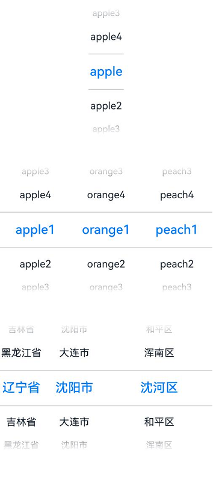
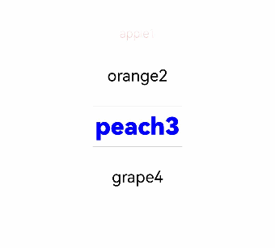
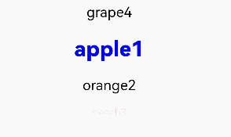
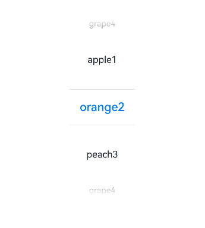
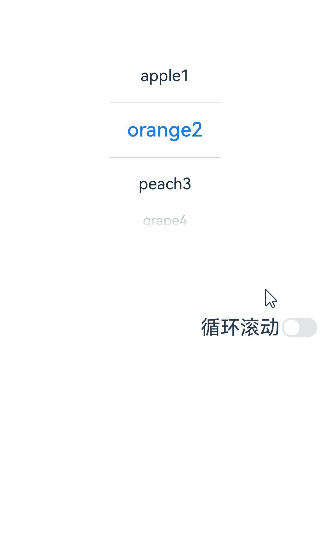
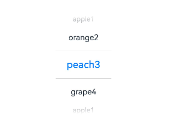
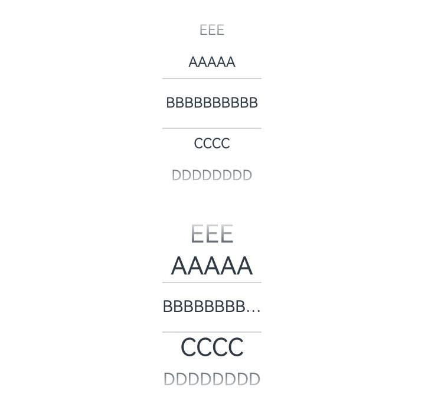

# TextPicker

滑动选择文本内容的组件。

>  **说明：**
>
> - 该组件从API version 8开始支持。后续版本如有新增内容，则采用上角标单独标记该内容的起始版本。
>
> - 该组件不建议开发者在动效过程中修改属性数据。
>
> - 该组件最大显示行数在横竖屏模式下存在差异，竖屏为5行，横屏为3行。


## 子组件

无


## 接口

TextPicker(options?: TextPickerOptions)

根据range指定的选择范围创建文本选择器。

**原子化服务API：** 从API version 11开始，该接口支持在原子化服务中使用。

**系统能力：** SystemCapability.ArkUI.ArkUI.Full

**参数：**

| 参数名  | 类型                                            | 必填 | 说明                   |
| ------- | ----------------------------------------------- | ---- | ---------------------- |
| options | [TextPickerOptions](#textpickeroptions对象说明) | 否   | 配置文本选择器的参数。 |

## TextPickerOptions对象说明

文本选择器的参数说明。

**系统能力：** SystemCapability.ArkUI.ArkUI.Full

| 名称 | 类型 | 只读 | 可选 | 说明 |
| -------- | -------- | -------- | -------- | -------- |
| range | string[]&nbsp;\|&nbsp;string[] []<sup>10+</sup> \| [Resource](ts-types.md#resource)&nbsp;\|<br/>[TextPickerRangeContent](#textpickerrangecontent10对象说明)[]<sup>10+</sup>&nbsp;\|&nbsp;[TextCascadePickerRangeContent](#textcascadepickerrangecontent10对象说明)[]<sup>10+</sup> | 否 | 否 | 选择器的数据选择列表。不可设置为空数组，若设置为空数组，则不显示；若动态变化为空数组，则保持当前正常值显示。<br/>**说明**：单列数据选择器使用string[]，[Resource](ts-types.md#resource)，[TextPickerRangeContent](#textpickerrangecontent10对象说明)[]类型。<br/>多列数据选择器使用string[][]类型。 <br/>多列联动数据选择器使用[TextCascadePickerRangeContent](#textcascadepickerrangecontent10对象说明)[]类型。<br/>Resource类型只支持[strarray.json](../../../quick-start/resource-categories-and-access.md#资源组目录)。<br>range的类型及列数不可以动态修改。<br />**原子化服务API：** 从API version 11开始，该接口支持在原子化服务中使用。|
| selected | number&nbsp;\|&nbsp;number[]<sup>10+</sup> | 否 | 是 | 设置默认选中项在数组中的索引值，索引从0开始。<br/>默认值：0 <br/>**说明**：单列数据选择器使用number类型。<br/>多列、多列联动数据选择器使用number[]类型。<br />从API version 10开始，该参数支持[$$](../../../ui/state-management/arkts-two-way-sync.md)双向绑定变量。<br />**原子化服务API：** 从API version 11开始，该接口支持在原子化服务中使用。|
| value | [ResourceStr](ts-types.md#resourcestr)&nbsp;\|&nbsp;[ResourceStr](ts-types.md#resourcestr)[] | 否 | 是 | 设置默认选中项的值，优先级低于selected。<br/>默认值：第一个元素值<br/>从API version 20开始，支持[Resource](ts-types.md#resource)类型。<br/> **说明**：只有显示文本列表时该值有效。显示图片或图片加文本的列表时，该值无效。 <br/>单列数据选择器使用[ResourceStr](ts-types.md#resourcestr)类型。<br/>多列、多列联动数据选择器使用[ResourceStr](ts-types.md#resourcestr)[]类型。<br />从API version 10开始，该参数支持[$$](../../../ui/state-management/arkts-two-way-sync.md)双向绑定变量。<br />**原子化服务API：** 从API version 11开始，该接口支持在原子化服务中使用。|
| columnWidths<sup>18+</sup> | [LengthMetrics](../js-apis-arkui-graphics.md#lengthmetrics12)[] | 否 | 是 | 设置每一个选择项列宽。<br/>默认值：每一个选择项列宽相等。<br/>**说明**：如果文本长度大于列宽时，文本被截断。<br/>当设置为异常值时，列宽按照默认值处理，此时TextPicker组件多列等宽，每一列宽度为组件宽度除以列数。默认值支持Undefined和Null，不支持Undefined[]和Null[]。<br />**原子化服务API：** 从API version 18开始，该接口支持在原子化服务中使用。 |

## TextPickerRangeContent<sup>10+</sup>对象说明

单列数据选择器的数据选项内容。

**原子化服务API：** 从API version 11开始，该接口支持在原子化服务中使用。

**系统能力：** SystemCapability.ArkUI.ArkUI.Full

| 名称 | 类型                                                 | 只读 | 可选 | 说明                                                         |
| ---- | ---------------------------------------------------- | ---- | ---- | ------------------------------------------------------------ |
| icon | string&nbsp;\|&nbsp;[Resource](ts-types.md#resource) | 否   | 否   | 图片资源。 icon是string类型时，表示图片存放的路径，例如"/common/hello.png"。 |
| text | string&nbsp;\|&nbsp;[Resource](ts-types.md#resource) | 否   | 是   | 文本信息。<br/>默认值：空字符串<br/>**说明**：如果文本长度大于列宽时，文本被截断。 |

## TextCascadePickerRangeContent<sup>10+</sup>对象说明

多列联动数据选择器的数据选项内容。

**原子化服务API：** 从API version 11开始，该接口支持在原子化服务中使用。

**系统能力：** SystemCapability.ArkUI.ArkUI.Full

| 名称 | 类型                                                 | 只读 | 可选 | 说明   |
| ------ | -------------------------------------------------------- | ---- | ---------- | ---------- |
| text   | string&nbsp;\|&nbsp;[Resource](ts-types.md#resource) | 否  | 否  | 文本信息。<br/>**说明**：如果文本长度大于列宽时，文本被截断。 |
| children   | [TextCascadePickerRangeContent](#textcascadepickerrangecontent10对象说明)[] | 否  | 是  | 联动数据。 |
## DividerOptions<sup>12+</sup>对象说明

分割线的信息。

**原子化服务API：** 从API version 12开始，该接口支持在原子化服务中使用。

**系统能力：** SystemCapability.ArkUI.ArkUI.Full

| 名称        | 类型                                       | 只读 | 可选 | 说明                                                         |
| ----------- | ------------------------------------------ | ---- | ---- | ------------------------------------------------------------ |
| strokeWidth | [Dimension](ts-types.md#dimension10)       | 否   | 是   | 分割线的线宽（默认单位vp），也可指定单位为px，不支持"百分比"类型。<br/>取值范围：strokeWidth小于0取默认值，最大不得超过列高的一半。<br/>默认值：2.0px |
| startMargin | [Dimension](ts-types.md#dimension10)       | 否   | 是   | 分割线与TextPicker侧边起始端的距离（默认单位vp），也可指定单位为px，不支持“百分比”类型。<br/>取值范围：startMargin小于0时无效，最大值不得超过TextPicker列宽。<br/>默认值：0 |
| endMargin   | [Dimension](ts-types.md#dimension10)       | 否   | 是   | 分割线与TextPicker侧边结束端的距离（默认单位vp），也可指定单位为px，不支持“百分比”类型。<br/>取值范围：endMargin小于0时无效，最大值不得超过TextPicker列宽。<br/>默认值：0 |
| color       | [ResourceColor](ts-types.md#resourcecolor) | 否   | 是   | 分割线的颜色。<br/>默认值：'#33000000'                       |

## 属性

除支持[通用属性](ts-component-general-attributes.md)外，还支持以下属性：

### defaultPickerItemHeight

defaultPickerItemHeight(value: number | string)

设置Picker各选择项的高度。

**原子化服务API：** 从API version 11开始，该接口支持在原子化服务中使用。

**系统能力：** SystemCapability.ArkUI.ArkUI.Full

**参数：** 

| 参数名 | 类型                       | 必填 | 说明                   |
| ------ | -------------------------- | ---- | ---------------------- |
| value  | number&nbsp;\|&nbsp;string | 是   | Picker各选择项的高度。number类型取值范围：[0, +∞)，string类型仅支持number类型取值的字符串形式，例如"56"。<br />默认值：选中项56vp，非选中项36vp。<br />**说明：**<br />设置该参数后，选中项与非选中项的高度均为所设置的值。 |

### defaultPickerItemHeight<sup>18+</sup>

defaultPickerItemHeight(height: Optional\<number | string>)

设置Picker各选择项的高度。与[defaultPickerItemHeight](#defaultpickeritemheight)相比，height参数新增了对undefined类型的支持。

**原子化服务API：** 从API version 18开始，该接口支持在原子化服务中使用。

**系统能力：** SystemCapability.ArkUI.ArkUI.Full

**参数：**

| 参数名 | 类型                       | 必填 | 说明                   |
| ------ | -------------------------- | ---- | ---------------------- |
| height  | [Optional](ts-universal-attributes-custom-property.md#optionalt12)\<number&nbsp;\|&nbsp;string> | 是   | Picker各选择项的高度。number类型取值范围：[0, +∞)，string类型仅支持number类型取值的字符串形式，例如"56"。<br/>默认值：选中项56vp，非选中项36vp。<br />**说明：**<br />设置该参数后，选中项与非选中项的高度均为所设置的值。<br/>当height的值为undefined时，维持上次取值。 |

### disappearTextStyle<sup>10+</sup>

disappearTextStyle(value: PickerTextStyle)

设置过渡项（以选中项为基准向上或向下的第二项）的文本样式。

**原子化服务API：** 从API version 11开始，该接口支持在原子化服务中使用。

**系统能力：** SystemCapability.ArkUI.ArkUI.Full

**参数：** 

| 参数名 | 类型                                                         | 必填 | 说明                                                         |
| ------ | ------------------------------------------------------------ | ---- | ------------------------------------------------------------ |
| value  | [PickerTextStyle](ts-picker-common.md#pickertextstyle类型说明) | 是   | 过渡项的文本颜色、字号、字体粗细。<br/>默认值：<br/>{<br/>color: '#ff182431',<br/>font: {<br/>size: '14fp', <br/>weight: FontWeight.Regular<br/>}<br/>} |

### disappearTextStyle<sup>18+</sup>

disappearTextStyle(style: Optional\<PickerTextStyle>)

设置过渡项的文本颜色、字号、字体粗细。与[disappearTextStyle](#disappeartextstyle10)<sup>10+</sup>相比，style参数新增了对undefined类型的支持。

**原子化服务API：** 从API version 18开始，该接口支持在原子化服务中使用。

**系统能力：** SystemCapability.ArkUI.ArkUI.Full

**参数：**

| 参数名 | 类型                                                         | 必填 | 说明                                                         |
| ------ | ------------------------------------------------------------ | ---- | ------------------------------------------------------------ |
| style  | [Optional](ts-universal-attributes-custom-property.md#optionalt12)\<[PickerTextStyle](ts-picker-common.md#pickertextstyle类型说明)> | 是   | 过渡项的文本颜色、字号、字体粗细。<br/>当style的值为undefined时，默认值：<br/>{<br/>color: '#ff182431',<br/>font: {<br/>size: '14fp', <br/>weight: FontWeight.Regular<br/>}<br/>} |

>  **说明：**
>
> 若选中项向上或向下的可视项数低于两项则无对应过渡项。

### textStyle<sup>10+</sup>

textStyle(value: PickerTextStyle)

设置一般项（以选中项为基准向上或向下的第一项）的文本样式。

**原子化服务API：** 从API version 11开始，该接口支持在原子化服务中使用。

**系统能力：** SystemCapability.ArkUI.ArkUI.Full

**参数：** 

| 参数名 | 类型                                                         | 必填 | 说明                                                         |
| ------ | ------------------------------------------------------------ | ---- | ------------------------------------------------------------ |
| value  | [PickerTextStyle](ts-picker-common.md#pickertextstyle类型说明) | 是   | 一般项的文本颜色、字号、字体粗细。<br/>默认值：<br/>{<br/>color: '#ff182431',<br/>font: {<br/>size: '16fp', <br/>weight: FontWeight.Regular<br/>}<br/>} |

### textStyle<sup>18+</sup>

textStyle(style: Optional\<PickerTextStyle>)

设置一般项的文本颜色、字号、字体粗细。与[textStyle](#textstyle10)<sup>10+</sup>相比，style参数新增了对undefined类型的支持。

**原子化服务API：** 从API version 18开始，该接口支持在原子化服务中使用。

**系统能力：** SystemCapability.ArkUI.ArkUI.Full

**参数：**

| 参数名 | 类型                                                         | 必填 | 说明                                                         |
| ------ | ------------------------------------------------------------ | ---- | ------------------------------------------------------------ |
| style  | [Optional](ts-universal-attributes-custom-property.md#optionalt12)\<[PickerTextStyle](ts-picker-common.md#pickertextstyle类型说明)> | 是   | 一般项的文本颜色、字号、字体粗细。<br/>当style的值为undefined时，默认值：<br/>{<br/>color: '#ff182431',<br/>font: {<br/>size: '16fp', <br/>weight: FontWeight.Regular<br/>}<br/>} |

>  **说明：**
>
> 若选中项向上或向下可视项数低于一项则无对应一般项。

### selectedTextStyle<sup>10+</sup>

selectedTextStyle(value: PickerTextStyle)

设置选中项的文本颜色、字号、字体粗细。Wearable设备不支持设置该属性。

**原子化服务API：** 从API version 11开始，该接口支持在原子化服务中使用。

**系统能力：** SystemCapability.ArkUI.ArkUI.Full

**参数：** 

| 参数名 | 类型                                                         | 必填 | 说明                                                         |
| ------ | ------------------------------------------------------------ | ---- | ------------------------------------------------------------ |
| value  | [PickerTextStyle](ts-picker-common.md#pickertextstyle类型说明) | 是   | 选中项的文本颜色、字号、字体粗细。<br/>默认值：<br/>{<br/>color: '#ff007dff',<br/>font: {<br/>size: '20fp', <br/>weight: FontWeight.Medium<br/>}<br/>} |

### selectedTextStyle<sup>18+</sup>

selectedTextStyle(style: Optional\<PickerTextStyle>)

设置选中项的文本颜色、字号、字体粗细。与[selectedTextStyle](#selectedtextstyle10)<sup>10+</sup>相比，style参数新增了对undefined类型的支持。

**原子化服务API：** 从API version 18开始，该接口支持在原子化服务中使用。

**系统能力：** SystemCapability.ArkUI.ArkUI.Full

**参数：**

| 参数名 | 类型                                                         | 必填 | 说明                                                         |
| ------ | ------------------------------------------------------------ | ---- | ------------------------------------------------------------ |
| style  | [Optional](ts-universal-attributes-custom-property.md#optionalt12)\<[PickerTextStyle](ts-picker-common.md#pickertextstyle类型说明)> | 是   | 选中项的文本颜色、字号、字体粗细。<br/>当style的值为undefined时，默认值：<br/>{<br/>color: '#ff007dff',<br/>font: {<br/>size: '20fp', <br/>weight: FontWeight.Medium<br/>}<br/>} |

### selectedIndex<sup>10+</sup>

selectedIndex(value: number | number[])

设置默认选中项在数组中的索引值，优先级高于[TextPickerOptions](#textpickeroptions对象说明)中的选中值。单列数据选择器使用number类型。多列、多列联动数据选择器使用number[]类型。

**原子化服务API：** 从API version 11开始，该接口支持在原子化服务中使用。

**系统能力：** SystemCapability.ArkUI.ArkUI.Full

**参数：** 

| 参数名 | 类型                         | 必填 | 说明                         |
| ------ | ---------------------------- | ---- | ---------------------------- |
| value  | number&nbsp;\|&nbsp;number[] | 是   | 默认选中项在数组中的索引值，索引从0开始。<br/>默认值：0 <br/>当value的值为undefined时，默认值与[TextPickerOptions](#textpickeroptions对象说明)中的selected值保持一致。如果[TextPickerOptions](#textpickeroptions对象说明)中的selected值为undefined，则默认值为0。<br/> |

### selectedIndex<sup>18+</sup>

selectedIndex(index: Optional\<number | number[]>)

设置默认选中项在数组中的索引值，优先级高于[TextPickerOptions](#textpickeroptions对象说明)中的选中值。单列数据选择器使用number类型。多列、多列联动数据选择器使用number[]类型。与[selectedIndex](#selectedindex10)相比，index参数新增了对undefined类型的支持。

**原子化服务API：** 从API version 18开始，该接口支持在原子化服务中使用。

**系统能力：** SystemCapability.ArkUI.ArkUI.Full

**参数：**

| 参数名 | 类型                                                         | 必填 | 说明                                                         |
| ------ | ------------------------------------------------------------ | ---- | ------------------------------------------------------------ |
| index  | [Optional](ts-universal-attributes-custom-property.md#optionalt12)\<number&nbsp;\|&nbsp;number[]> | 是   | 默认选中项在数组中的索引值，索引从0开始。<br/>默认值：0 <br/>当index的值为undefined时，默认值与[TextPickerOptions](#textpickeroptions对象说明)中的selected值保持一致，如果[TextPickerOptions](#textpickeroptions对象说明)中的selected值为undefined，则默认值为0。<br/> |

### canLoop<sup>10+</sup>

canLoop(value: boolean)

设置是否可循环滚动。

**原子化服务API：** 从API version 11开始，该接口支持在原子化服务中使用。

**系统能力：** SystemCapability.ArkUI.ArkUI.Full

**参数：** 

| 参数名 | 类型    | 必填 | 说明                                                         |
| ------ | ------- | ---- | ------------------------------------------------------------ |
| value  | boolean | 是   | 是否可循环滚动。<br/>true：可循环，false：不可循环。<br/>默认值：true |

### canLoop<sup>18+</sup>

canLoop(isLoop: Optional\<boolean>)

设置是否可循环滚动。与[canLoop](#canloop10)<sup>10+</sup>相比，isLoop参数新增了对undefined类型的支持。

**原子化服务API：** 从API version 18开始，该接口支持在原子化服务中使用。

**系统能力：** SystemCapability.ArkUI.ArkUI.Full

**参数：**

| 参数名 | 类型    | 必填 | 说明                                                         |
| ------ | ------- | ---- | ------------------------------------------------------------ |
| isLoop  | [Optional](ts-universal-attributes-custom-property.md#optionalt12)\<boolean> | 是   | 是否可循环滚动。<br/>true：可循环，false：不可循环。<br/>当isLoop的值为undefined时，默认值：true |

### divider<sup>12+</sup>

divider(value: DividerOptions | null)

设置分割线样式，不设置该属性则按“默认值”展示分割线。

[DividerOptions](#divideroptions12对象说明)中startMargin + endMargin 超过组件宽度后，startMargin和endMargin会被置0。

**原子化服务API：** 从API version 12开始，该接口支持在原子化服务中使用。

**系统能力：** SystemCapability.ArkUI.ArkUI.Full

**参数：**
| 参数名 | 类型    | 必填 | 说明                                                                  |
| ------ | ------- | ---- | --------------------------------------------------------------------- |
| value | [DividerOptions](#divideroptions12对象说明) \| null | 是   | 1.设置[DividerOptions](#divideroptions12对象说明)，则按设置的样式显示分割线。<br/>默认值：<br/>{<br/>strokeWidth: '2px', <br/>startMargin: 0, <br/>endMargin: 0, <br/>color: '#33000000'<br/>}<br/>2.设置为null不显示分割线。 |

### divider<sup>18+</sup>

divider(textDivider: Optional\<DividerOptions | null>)

设置分割线样式，不设置该属性则按“默认值”展示分割线。与[divider](#divider12)<sup>12+</sup>相比，textDivider参数新增了对undefined类型的支持。

[DividerOptions](#divideroptions12对象说明)中startMargin + endMargin 超过组件宽度后，startMargin和endMargin会被置0。

**原子化服务API：** 从API version 18开始，该接口支持在原子化服务中使用。

**系统能力：** SystemCapability.ArkUI.ArkUI.Full

**参数：**

| 参数名 | 类型    | 必填 | 说明                                                                  |
| ------ | ------- | ---- | --------------------------------------------------------------------- |
| textDivider | [Optional](ts-universal-attributes-custom-property.md#optionalt12)\<[DividerOptions](#divideroptions12对象说明) \| null> | 是   | 1.设置[DividerOptions](#divideroptions12对象说明)，则按设置的样式显示分割线。<br/>当textDivider的值为undefined时，默认值：<br/>{<br/>strokeWidth: '2px', <br/>startMargin: 0, <br/>endMargin: 0, <br/>color: '#33000000'<br/>}<br/>2.设置为null不显示分割线。 |

### gradientHeight<sup>12+</sup>

gradientHeight(value: Dimension)

设置渐隐效果的高度。若未设置该属性，则显示默认渐隐效果。

**原子化服务API：** 从API version 12开始，该接口支持在原子化服务中使用。

**系统能力：** SystemCapability.ArkUI.ArkUI.Full

**参数：**

| 参数名 | 类型    | 必填 | 说明                                                         |
| ------ | ------- | ---- | ------------------------------------------------------------ |
| value  | [Dimension](ts-types.md#dimension10) | 是   | 内容区上下边缘的渐隐高度（支持百分比，100%为TextPicker高度的一半即最大值），设置为0时不显示渐隐效果，负数等非法值显示默认渐隐效果。默认值为36vp。|

### gradientHeight<sup>18+</sup>

gradientHeight(height: Optional\<Dimension>)

设置渐隐效果高度，不设置该属性则显示默认渐隐效果。与[gradientHeight](#gradientheight12)<sup>12+</sup>相比，height参数新增了对undefined类型的支持。

**原子化服务API：** 从API version 18开始，该接口支持在原子化服务中使用。

**系统能力：** SystemCapability.ArkUI.ArkUI.Full

**参数：**

| 参数名 | 类型    | 必填 | 说明                                                         |
| ------ | ------- | ---- | ------------------------------------------------------------ |
| height  | [Optional](ts-universal-attributes-custom-property.md#optionalt12)\<[Dimension](ts-types.md#dimension10)> | 是   | 内容区上下边缘的渐隐高度（支持百分比，100%为TextPicker高度的一半即最大值），设置为0时不显示渐隐效果，负数等非法值显示默认渐隐效果。默认值为36vp。<br/>当height的值为undefined时，默认值为36vp。 |

### disableTextStyleAnimation<sup>15+</sup>

disableTextStyleAnimation(disabled: boolean)

设置滑动过程中是否有文本样式变化动效。设置为true时，滑动过程中无字号、字重、字体颜色等变化动效，且文本均显示为[defaultTextStyle](#defaulttextstyle15)属性设置样式。如未设置[defaultTextStyle](#defaulttextstyle15)，则显示为[Text](ts-basic-components-text.md)组件默认样式。

**原子化服务API：** 从API version 15开始，该接口支持在原子化服务中使用。

**系统能力：** SystemCapability.ArkUI.ArkUI.Full

**参数：**

| 参数名 | 类型    | 必填 | 说明                                                         |
| ------ | ------- | ---- | ------------------------------------------------------------ |
| disabled  | boolean | 是   | 设置滑动过程中是否有文本样式变化动效。<br/>true：无文本样式变化动效，false：有文本样式变化动效。<br/>默认值：false |

### defaultTextStyle<sup>15+</sup>

defaultTextStyle(style: TextPickerTextStyle)

设置关闭滑动过程中文本样式变化动效时，各个选项文本的样式。仅当[disableTextStyleAnimation](#disabletextstyleanimation15)为true时生效。

**原子化服务API：** 从API version 15开始，该接口支持在原子化服务中使用。

**系统能力：** SystemCapability.ArkUI.ArkUI.Full

**参数：**

| 参数名 | 类型                                                         | 必填 | 说明                                                         |
| ------ | ------------------------------------------------------------ | ---- | ------------------------------------------------------------ |
| style  | [TextPickerTextStyle](#textpickertextstyle15类型说明) | 是   | 设置关闭滑动过程中文本样式变化动效时的各个选项文本的样式。<br/>默认值：与[Text](ts-basic-components-text.md)组件默认值相同。 |

### enableHapticFeedback<sup>18+</sup>

enableHapticFeedback(enable: Optional\<boolean>)

设置是否开启触控反馈。

**原子化服务API：** 从API version 18开始，该接口支持在原子化服务中使用。

**系统能力：** SystemCapability.ArkUI.ArkUI.Full

**参数：**

| 参数名 | 类型                                          | 必填  | 说明                                                                                  |
| ------ | --------------------------------------------- |-----|-------------------------------------------------------------------------------------|
| enable  | [Optional](ts-universal-attributes-custom-property.md#optionalt12)\<boolean> | 是   | 设置是否开启触控反馈。<br/>默认值：true，true表示开启触控反馈，false表示不开启触控反馈。|

>  **说明：**
>
>  开启触控反馈时，需要在工程的module.json5中配置requestPermissions字段开启振动权限，配置如下：
>  ```json
>  "requestPermissions": [
>  {
>   "name": "ohos.permission.VIBRATE",
>  }
>  ]
>  ```

### digitalCrownSensitivity<sup>18+</sup>
digitalCrownSensitivity(sensitivity: Optional\<CrownSensitivity>)

设置表冠灵敏度。

**原子化服务API：** 从API version 18开始，该接口支持在原子化服务中使用。

**系统能力：** SystemCapability.ArkUI.ArkUI.Full

**参数：**

| 参数名   | 类型                                     | 必填   | 说明                      |
| ----- | ---------------------------------------- | ---- | ------------------------- |
| sensitivity | [Optional](ts-universal-attributes-custom-property.md#optionalt12)\<[CrownSensitivity](ts-appendix-enums.md#crownsensitivity18)> | 是    | 表冠响应灵敏度。<br/>默认值：CrownSensitivity.MEDIUM，响应速度适中。                     |

>  **说明：**
>
>  用于圆形屏幕的穿戴设备。组件响应[表冠事件](ts-universal-events-crown.md)，需要先获取焦点。

### selectedBackgroundStyle<sup>20+</sup>
selectedBackgroundStyle(style: Optional\<PickerBackgroundStyle>)

设置选中项的背景样式。

**原子化服务API：** 从API version 20开始，该接口支持在原子化服务中使用。

**系统能力：** SystemCapability.ArkUI.ArkUI.Full

**参数：**

| 参数名   | 类型                                     | 必填   | 说明                      |
| ----- | ---------------------------------------- | ---- | ------------------------- |
| style | [Optional](ts-universal-attributes-custom-property.md#optionalt12)\<[PickerBackgroundStyle](#pickerbackgroundstyle20)> | 是    | 选中项背景的颜色和边框圆角半径，多列模式时会同时设置所有列的选中项背景的颜色和圆角半径。<br/>默认值：<br/>{ <br/>color: $r('sys.color.comp_background_tertiary'),<br/>borderRadius: $r('sys.float.corner_radius_level12')<br/>}|

## 事件

除支持[通用事件](ts-component-general-events.md)外，还支持以下事件：

### onChange

onChange(callback:&nbsp;(value:&nbsp;string&nbsp;\|&nbsp;string[],&nbsp;index:&nbsp;number&nbsp;\|&nbsp;number[])&nbsp;=&gt;&nbsp;void)

滑动TextPicker文本内容后，选项归位至选中项位置时，触发该回调。不能通过双向绑定的状态变量触发。当显示文本或图片加文本列表时，value值为选中项中的文本值，当显示图片列表时，value值为空。

回调会在滑动动画结束后触发，如果需要快速获取索引值变化，建议使用[onEnterSelectedArea](#onenterselectedarea18)接口。

**原子化服务API：** 从API version 11开始，该接口支持在原子化服务中使用。

**系统能力：** SystemCapability.ArkUI.ArkUI.Full

**参数：** 

| 参数名 | 类型                                       | 必填 | 说明                                              |
| ------ | ------------------------------------------ | ---- | ------------------------------------------------- |
| value  | string&nbsp;\|&nbsp;string[]<sup>10+</sup> | 是   | 当前选中项的文本。多列的情况，value为数组类型。   |
| index  | number&nbsp;\|&nbsp;number[]<sup>10+</sup> | 是   | 当前选中项的索引值，索引从0开始。多列的情况，index为数组类型。 |

### onChange<sup>18+</sup>

onChange(callback: Optional\<OnTextPickerChangeCallback>)

滑动TextPicker文本内容后，选项归位至选中项位置时，触发该回调。不能通过双向绑定的状态变量触发。与[onChange](#onchange)相比，callback参数新增了对undefined类型的支持。

回调会在滑动动画结束后触发，如果需要快速获取索引值变化，建议使用[onEnterSelectedArea](#onenterselectedarea18)接口。

**原子化服务API：** 从API version 18开始，该接口支持在原子化服务中使用。

**系统能力：** SystemCapability.ArkUI.ArkUI.Full

**参数：**

| 参数名   | 类型                                                         | 必填 | 说明                                                         |
| -------- | ------------------------------------------------------------ | ---- | ------------------------------------------------------------ |
| callback | [Optional](ts-universal-attributes-custom-property.md#optionalt12)\<[OnTextPickerChangeCallback](#ontextpickerchangecallback18)> | 是   | 滑动选中TextPicker文本内容后，触发的回调。<br/>当callback的值为undefined时，不使用回调函数。 |

### onScrollStop<sup>14+</sup>

onScrollStop(callback: TextPickerScrollStopCallback)

文本选择器的选项列滑动停止时触发该事件。

手指拖动选项列触发的滑动，手指离开屏幕且滑动停止时会触发该事件。

**原子化服务API：** 从API version 14开始，该接口支持在原子化服务中使用。

**系统能力：** SystemCapability.ArkUI.ArkUI.Full

**参数：** 

| 参数名 | 类型                                       | 必填 | 说明                                              |
| ------ | ------------------------------------------ | ---- | ------------------------------------------------- |
| callback | [TextPickerScrollStopCallback](#textpickerscrollstopcallback14) | 是   | 文本选择器的选项列滑动停止时触发该事件。 |

### onScrollStop<sup>18+</sup>

onScrollStop(callback: Optional\<TextPickerScrollStopCallback>)

文本选择器的选项列滑动停止时触发该事件。与[onScrollStop](#onscrollstop14)<sup>14+</sup>相比，callback参数新增了对undefined类型的支持。

手指拖动选项列触发的滑动，手指离开屏幕且滑动停止时会触发该事件。

**原子化服务API：** 从API version 18开始，该接口支持在原子化服务中使用。

**系统能力：** SystemCapability.ArkUI.ArkUI.Full

**参数：** 

| 参数名 | 类型                                       | 必填 | 说明                                              |
| ------ | ------------------------------------------ | ---- | ------------------------------------------------- |
| callback | [Optional](ts-universal-attributes-custom-property.md#optionalt12)\<[TextPickerScrollStopCallback](#textpickerscrollstopcallback14)> | 是   | 文本选择器的选项列滑动停止时触发该事件。<br/>当callback的值为undefined时，不使用回调函数。 |

### onEnterSelectedArea<sup>18+</sup>

onEnterSelectedArea(callback: TextPickerEnterSelectedAreaCallback)

滑动TextPicker过程中，选项进入分割线区域内，触发该回调。

与[onChange](#onchange)事件的差别在于，该事件的触发时机早于[onChange](#onchange)事件，当当前滑动列滑动距离超过选中项高度的一半时，选项此时已经进入分割线区域内，会触发该事件。

当显示文本或图片加文本列表时，value值为选中项中的文本值，当显示图片列表时，value值为空。

**原子化服务API：** 从API version 18开始，该接口支持在原子化服务中使用。

**系统能力：** SystemCapability.ArkUI.ArkUI.Full

**参数：** 

| 参数名   | 类型                       | 必填 | 说明                                       |
| -------- | -------------------------- | ---- | ------------------------------------------ |
| callback | [TextPickerEnterSelectedAreaCallback](#textpickerenterselectedareacallback18) | 是   | 滑动TextPicker过程中，选项进入分割线区域时触发的回调。 |

### onAccept<sup>(deprecated) </sup>

onAccept(callback: (value: string, index: number) => void)

点击弹窗中的“确定”按钮时触发该回调。该事件仅在[文本滑动选择器弹窗](ts-methods-textpicker-dialog.md)中生效。

从API version 10开始废弃。

**系统能力：** SystemCapability.ArkUI.ArkUI.Full

**参数：**

| 参数名 | 类型   | 必填 | 说明                 |
| ------ | ------ | ---- | -------------------- |
| value  | string | 是   | 当前选中项的文本。   |
| index  | number | 是   | 当前选中项的索引值，索引从0开始。 |

### onCancel<sup>(deprecated) </sup>

onCancel(callback: () => void)

点击弹窗中的“取消”按钮时触发该回调。该事件仅在[文本滑动选择器弹窗](ts-methods-textpicker-dialog.md)中生效。

从API version 10开始废弃。

**系统能力：** SystemCapability.ArkUI.ArkUI.Full

**参数：**
| 参数名 | 类型   | 必填 | 说明                 |
| ------ | ------ | ---- | -------------------- |
| callback  | () => void | 是   | 点击弹窗中的“取消”按钮时触发该回调。   |

## TextPickerTextStyle<sup>15+</sup>类型说明

文本样式选项，继承自[PickerTextStyle](ts-picker-common.md#pickertextstyle类型说明)。

**原子化服务API：** 从API version 15开始，该接口支持在原子化服务中使用。

| 名称 | 类型                                     | 只读 | 可选 | 说明                      |
| ----- | ---------------------------------------- | ---- | ------------------------- | ------------------------- |
| color | [ResourceColor](ts-types.md#resourcecolor) | 否   | 是   | 文本颜色。                     |
| font  | [Font](ts-types.md#font)                 | 否   | 是   | 文本样式。 |
| minFontSize  | number&nbsp;\|&nbsp;string&nbsp;\|&nbsp;[Resource](ts-types.md#resource) | 否   | 是   | 文本最小显示字号，与maxFontSize配合使用。设置minFontSize与maxFontSize时，font中的size不生效。默认最大行数为1，自适应高度方式为MIN_FONT_SIZE_FIRST。                     |
| maxFontSize  | number&nbsp;\|&nbsp;string&nbsp;\|&nbsp;[Resource](ts-types.md#resource) | 否   | 是   | 文本最大显示字号。                     |
|  overflow   |   [TextOverflow](ts-appendix-enums.md#textoverflow) | 否   | 是   | 文本截断方式，设置为MARQUEE时不生效。                     |

## OnTextPickerChangeCallback<sup>18+</sup>

type OnTextPickerChangeCallback = (selectItem: string | string[], index: number | number[]) => void

滑动选中TextPicker文本内容后，触发该回调。当显示文本或图片加文本列表时，selectItem值为选中项中的文本值，当显示图片列表时，selectItem值为空。

**原子化服务API：** 从API version 18开始，该接口支持在原子化服务中使用。

**系统能力：** SystemCapability.ArkUI.ArkUI.Full

**参数：** 

| 参数名     | 类型                                       | 必填 | 说明                                                         |
| ---------- | ------------------------------------------ | ---- | ------------------------------------------------------------ |
| selectItem | string&nbsp;\|&nbsp;string[]<sup>10+</sup> | 是   | 当前选中项的文本。多列的情况，selectItem为数组类型。         |
| index      | number&nbsp;\|&nbsp;number[]<sup>10+</sup> | 是   | 当前选中项的索引值，索引从0开始。多列的情况，index为数组类型。 |

## TextPickerScrollStopCallback<sup>14+</sup>

type TextPickerScrollStopCallback = (value: string | string[], index: number | number[]) => void

文本选择器的选项列滑动停止时触发该事件。

当显示文本或图片加文本列表时，value值为选中项中的文本值，当显示图片列表时，value值为空。

**原子化服务API：** 从API version 14开始，该接口支持在原子化服务中使用。

**系统能力：** SystemCapability.ArkUI.ArkUI.Full

**参数：** 

| 参数名 | 类型                                       | 必填 | 说明                                              |
| ------ | ------------------------------------------ | ---- | ------------------------------------------------- |
| value  | string&nbsp;\|&nbsp;string[] | 是   | 当前选中项的文本。多列的情况，value为数组类型。   |
| index  | number&nbsp;\|&nbsp;number[] | 是   | 当前选中项的索引值，索引从0开始。多列的情况，index为数组类型。 |

## TextPickerEnterSelectedAreaCallback<sup>18+</sup>

type TextPickerEnterSelectedAreaCallback = (value: string | string[], index: number | number[]) => void

滑动TextPicker过程中，选项进入分割线区域内，触发该回调。

在多列联动场景中，不建议使用该回调，由于该回调标识的是滑动过程中选项进入分割线区域内的节点，而跟随变化的选项并不涉及滑动，因此，回调的返回值中，仅当前滑动列的值会正常变化，其余未滑动列的值保持不变。

**原子化服务API：** 从API version 18开始，该接口支持在原子化服务中使用。

**系统能力：** SystemCapability.ArkUI.ArkUI.Full

**参数：** 

| 参数名 | 类型                                       | 必填 | 说明                                              |
| ------ | ------------------------------------------ | ---- | ------------------------------------------------- |
| value  | string&nbsp;\|&nbsp;string[] | 是   | 当前选中项的文本。多列的情况，value为数组类型。   |
| index  | number&nbsp;\|&nbsp;number[] | 是   | 当前选中项的索引值，索引从0开始。多列的情况，index为数组类型。 |

## PickerBackgroundStyle<sup>20+</sup>

选择器选项背景样式，包括选项背景颜色和选项边框圆角半径。

**原子化服务API：** 从API version 20开始，该接口支持在原子化服务中使用。

**系统能力：** SystemCapability.ArkUI.ArkUI.Full

| 名称 | 类型                                       | 只读 | 可选 | 说明                                              |
| ------ | ------------------------------------- | ---- | ------------------------------------------------- | ------------------------------------------------- |
| color  | [ResourceColor](ts-types.md#resourcecolor) | 否  | 是  | 选项背景颜色，默认值为'sys.color.comp_background_tertiary'。   |
| borderRadius  | [LengthMetrics](../js-apis-arkui-graphics.md#lengthmetrics12) &nbsp;\|&nbsp; [BorderRadiuses](ts-types.md#borderradiuses9) &nbsp;\|&nbsp; [LocalizedBorderRadiuses](ts-types.md#localizedborderradiuses12) | 否  | 是  | 选项边框圆角半径。[LengthMetrics](../js-apis-arkui-graphics.md#lengthmetrics12)类型的value参数同时作用于四个圆角半径大小，unit参数用于设置单位；[BorderRadiuses](ts-types.md#borderradiuses9)类型可以设置四个不同值的圆角半径，所有单位固定为VP。[LocalizedBorderRadiuses](ts-types.md#localizedborderradiuses12)类型可以设置四个不同值的圆角半径，并且可以单独设置每个圆角的单位。默认值为{ value:24, unit:LengthUnit.VP }，即四个圆角半径均为24VP。 |
## 示例

### 示例1（设置选择器列数）

该示例通过配置range实现单列或多列文本选择器，通过配置columnWidths设置每一列宽度。

```ts
// xxx.ets
import { LengthMetrics } from '@kit.ArkUI';

class Bottom {
  bottom: number = 50;
}

let bott: Bottom = new Bottom();
@Entry
@Component
struct TextPickerExample {
  private select: number = 1;
  private apfruits: string[] = ['apple1', 'apple2', 'apple3', 'apple4'];
  private orfruits: string[] = ['orange1', 'orange2', 'orange3', 'orange4'];
  private pefruits: string[] = ['peach1', 'peach2', 'peach3', 'peach4'];
  private multi: string[][] = [this.apfruits, this.orfruits, this.pefruits];
  private cascade: TextCascadePickerRangeContent[] = [
    {
      text: '辽宁省',
      children: [{ text: '沈阳市', children: [{ text: '沈河区' }, { text: '和平区' }, { text: '浑南区' }] },
        { text: '大连市', children: [{ text: '中山区' }, { text: '金州区' }, { text: '长海县' }] }]
    },
    {
      text: '吉林省',
      children: [{ text: '长春市', children: [{ text: '南关区' }, { text: '宽城区' }, { text: '朝阳区' }] },
        { text: '四平市', children: [{ text: '铁西区' }, { text: '铁东区' }, { text: '梨树县' }] }]
    },
    {
      text: '黑龙江省',
      children: [{ text: '哈尔滨市', children: [{ text: '道里区' }, { text: '道外区' }, { text: '南岗区' }] },
        { text: '牡丹江市', children: [{ text: '东安区' }, { text: '西安区' }, { text: '爱民区' }] }]
    }
  ];
  private singleColumnWidths: LengthMetrics[] = [
    LengthMetrics.percent(50)
  ];

  private multipleColumnWidths: LengthMetrics[] = [
    LengthMetrics.vp(100),
    LengthMetrics.vp(200),
    LengthMetrics.vp(100)
  ];

  private cascadeColumnWidths: LengthMetrics[] = [
    LengthMetrics.percent(20),
    LengthMetrics.percent(30),
    LengthMetrics.percent(50)
  ];
  build() {
    Column() {

      TextPicker({ range: this.apfruits, selected: this.select, columnWidths: this.singleColumnWidths })
        .onChange((value: string | string[], index: number | number[]) => {
          console.info('Picker item changed, value: ' + value + ', index: ' + index);
        })
        .onScrollStop((value: string | string[], index: number | number[]) => {
          console.info('Picker scroll stopped, value: ' + value + ', index: ' + index);
        }).margin(bott)
        .onEnterSelectedArea((value: string | string[], index: number | number[]) => {
          console.info('Picker item enter selected area, value: ' + value + ', index: ' + index);
        })

      TextPicker({ range: this.multi, columnWidths: this.multipleColumnWidths })
        .onChange((value: string | string[], index: number | number[]) => {
          console.info('TextPicker 多列:onChange ' + JSON.stringify(value) + ', ' + 'index: ' + JSON.stringify(index));
        })
        .onScrollStop((value: string | string[], index: number | number[]) => {
          console.info('TextPicker 多列:onScrollStop ' + JSON.stringify(value) + ', ' + 'index: ' + JSON.stringify(index));
        }).margin(bott)
        .onEnterSelectedArea((value: string | string[], index: number | number[]) => {
          console.info('TextPicker 多列:onEnterSelectedArea ' + JSON.stringify(value) + ', ' + 'index: ' + JSON.stringify(index));
        })

      TextPicker({ range: this.cascade, columnWidths: this.cascadeColumnWidths })
        .onChange((value: string | string[], index: number | number[]) => {
          console.info('TextPicker 多列联动:onChange ' + JSON.stringify(value) + ', ' + 'index: ' + JSON.stringify(index));
        })
        .onScrollStop((value: string | string[], index: number | number[]) => {
          console.info('TextPicker 多列联动:onScrollStop ' + JSON.stringify(value) + ', ' + 'index: ' + JSON.stringify(index));
        })
        .onEnterSelectedArea((value: string | string[], index: number | number[]) => {
          console.info('TextPicker 多列联动:onEnterSelectedArea ' + JSON.stringify(value) + ', ' + 'index: ' + JSON.stringify(index));
        })
    }
  }
}
```



### 示例2（设置文本样式）

该示例通过配置[disappearTextStyle](#disappeartextstyle10)、[textStyle](#textstyle10)、[selectedTextStyle](#selectedtextstyle10)实现文本选择器中的文本样式。

```ts
// xxx.ets
@Entry
@Component
struct TextPickerExample {
  private select: number = 0;
  private fruits: string[] = ['apple1', 'orange2', 'peach3', 'grape4'];

  build() {
    Column() {
      TextPicker({
        range: this.fruits,
        selected: this.select,
        value: this.fruits[this.select]
      })
        .onChange((value: string | string[], index: number | number[]) => {
          console.info('Picker item changed, value: ' + value + ', index: ' + index);
        })
        .onScrollStop((value: string | string[], index: number | number[]) => {
          console.info('Picker scroll stopped, value: ' + value + ', index: ' + index);
        })
        .disappearTextStyle({ color: Color.Red, font: { size: 15, weight: FontWeight.Lighter } })
        .textStyle({ color: Color.Black, font: { size: 20, weight: FontWeight.Normal } })
        .selectedTextStyle({ color: Color.Blue, font: { size: 30, weight: FontWeight.Bolder } })
        .defaultPickerItemHeight(50)
        .canLoop(false)
        .selectedIndex(2)
    }.width('100%').height('100%')
  }
}
```



### 示例3（设置无分割线样式）

该示例通过配置divider为null实现无分割线样式的文本选择器。

```ts
// xxx.ets
@Entry
@Component
struct TextPickerExample {
  private select: number = 0;
  private fruits: string[] = ['apple1', 'orange2', 'peach3', 'grape4'];

  build() {
    Column() {
      TextPicker({ range: this.fruits, selected: this.select })
        .onChange((value: string | string[], index: number | number[]) => {
          console.info('Picker item changed, value: ' + value + ', index: ' + index);
        })
        .onScrollStop((value: string | string[], index: number | number[]) => {
          console.info('Picker scroll stopped, value: ' + value + ', index: ' + index);
        })
        .disappearTextStyle({color: Color.Red, font: {size: 15, weight: FontWeight.Lighter}})
        .textStyle({color: Color.Black, font: {size: 20, weight: FontWeight.Normal}})
        .selectedTextStyle({color: Color.Blue, font: {size: 30, weight: FontWeight.Bolder}})
        .divider(null)
    }.width('100%').height('100%')
  }
}
```


### 示例4（设置分割线样式）

该示例通过配置divider的DividerOptions类型实现分割线样式的文本选择器。

```ts
// xxx.ets
@Entry
@Component
struct TextPickerExample {
  private select: number = 1;
  private fruits: string[] = ['apple1', 'orange2', 'peach3', 'grape4'];

  build() {
    Column() {
      TextPicker({ range: this.fruits, selected: this.select })
        .onChange((value: string | string[], index: number | number[]) => {
          console.info('Picker item changed, value: ' + value + ', index: ' + index);
        })
        .onScrollStop((value: string | string[], index: number | number[]) => {
          console.info('Picker scroll stopped, value: ' + value + ', index: ' + index);
        })
        .disappearTextStyle({color: Color.Red, font: {size: 15, weight: FontWeight.Lighter}})
        .textStyle({color: Color.Black, font: {size: 20, weight: FontWeight.Normal}})
        .selectedTextStyle({color: Color.Blue, font: {size: 30, weight: FontWeight.Bolder}})
        .divider({
          strokeWidth: 10,
          color: Color.Red,
          startMargin: 10,
          endMargin: 20
        } as DividerOptions)
    }.width('100%').height('100%')
  }
}
```


### 示例5（设置渐隐效果）

该示例通过gradientHeight自定义TextPicker的渐隐效果高度。

```ts
// xxx.ets
@Entry
@Component
struct TextPickerExample {
  private select: number = 1;
  private fruits: string[] = ['apple1', 'orange2', 'peach3', 'grape4'];

  build() {
    Column() {
      TextPicker({ range: this.fruits, selected: this.select })
        .onChange((value: string | string[], index: number | number[]) => {
          console.info('Picker item changed, value: ' + value + ', index: ' + index);
        })
        .onScrollStop((value: string | string[], index: number | number[]) => {
          console.info('Picker scroll stopped, value: ' + value + ', index: ' + index);
        })
        .disappearTextStyle({color: Color.Red, font: {size: 15, weight: FontWeight.Lighter}})
        .textStyle({color: Color.Black, font: {size: 20, weight: FontWeight.Normal}})
        .selectedTextStyle({color: Color.Blue, font: {size: 30, weight: FontWeight.Bolder}})
        .gradientHeight(100)
    }.width('100%').height('100%')
  }
}
```


### 示例6（设置选择项高度）

该示例通过配置defaultPickerItemHeight设置选择项的高度。

```ts
// xxx.ets
@Entry
@Component
struct TextPickerExample {
  private select: number = 1;
  private fruits: string[] = ['apple1', 'orange2', 'peach3', 'grape4'];

  build() {
    Column() {
      TextPicker({ range: this.fruits, selected: this.select })
        .defaultPickerItemHeight(60)
        .onChange((value: string | string[], index: number | number[]) => {
          console.info('Picker item changed, value: ' + value + ', index: ' + index);
        })
        .onScrollStop((value: string | string[], index: number | number[]) => {
          console.info('Picker scroll stopped, value: ' + value + ', index: ' + index);
        })
    }.width('100%').height('100%')
  }
}
```




### 示例7（设置循环滚动）

该示例通过配置[canLoop](#canloop10)设置TextPicker是否循环滚动。

```ts
// xxx.ets
@Entry
@Component
struct TextPickerExample {
  @State isLoop: boolean = false;
  private select: number = 1;
  private fruits: string[] = ['apple1', 'orange2', 'peach3', 'grape4'];

  build() {
    Column() {
      TextPicker({ range: this.fruits, selected: this.select })
        .onChange((value: string | string[], index: number | number[]) => {
          console.info('Picker item changed, value: ' + value + ', index: ' + index);
        })
        .onScrollStop((value: string | string[], index: number | number[]) => {
          console.info('Picker scroll stopped, value: ' + value + ', index: ' + index);
        })
        .canLoop(this.isLoop)

      Row() {
        Text('循环滚动').fontSize(20)

        Toggle({ type: ToggleType.Switch, isOn: false })
          .onChange((isOn: boolean) => {
            this.isLoop = isOn;
          })
      }.position({ x: '60%', y: '40%' })

    }.width('100%')
  }
}
```



### 示例8（设置选中项索引值）

该示例通过配置selectedIndex设置默认选中项的索引值。

```ts
// xxx.ets
@Entry
@Component
struct TextPickerExample {
  private fruits: string[] = ['apple1', 'orange2', 'peach3', 'grape4'];

  build() {
    Column() {
      TextPicker({ range: this.fruits, selected: 1 })
        .selectedIndex(2)
        .onChange((value: string | string[], index: number | number[]) => {
          console.info('Picker item changed, value: ' + value + ', index: ' + index);
        })
        .onScrollStop((value: string | string[], index: number | number[]) => {
          console.info('Picker scroll stopped, value: ' + value + ', index: ' + index);
        })
    }.width('100%').height('100%')
  }
}
```



### 示例9（设置禁用文本样式变化动效与对应文本样式）

该示例通过配置[disableTextStyleAnimation](#disabletextstyleanimation15)、[defaultTextStyle](#defaulttextstyle15)实现文本选择器禁用文本样式变化动效与此时的文本样式设置。

```ts
// xxx.ets
@Entry
@Component
struct TextPickerExample {
  private select: number = 1;
  private fruits: string[] = ['AAAAA', 'BBBBBBBBBBBBB', 'CCCC', 'DDDDDDDD', 'EEE'];

  build() {
    Column() {
      TextPicker({
        range: this.fruits,
        selected: this.select,
        value: this.fruits[this.select]
      })
        .disableTextStyleAnimation(true)
        .margin({ bottom: 30 })
      TextPicker({
        range: this.fruits,
        selected: this.select,
        value: this.fruits[this.select]
      })
        .disableTextStyleAnimation(true)
        .defaultTextStyle({ minFontSize: 18, maxFontSize: 28, overflow: TextOverflow.Ellipsis })
    }.width('100%').height('100%')
  }
}
```



### 示例10（设置选中项背景样式）

该示例通过配置[selectedBackgroundStyle](#selectedbackgroundstyle20)实现文本选择器选中项的背景样式。

```ts
import { LengthUnit } from '@kit.ArkUI';

// xxx.ets
@Entry
@Component
struct TextPickerExample {
  private showText1: string [] =
    ["Text1", "Text1", "Text1", "Text1"]
  private showText2: string[] [] =
    [
      ["Text2", "Text2", "Text2", "Text2"],
      ["Text3", "Text3", "Text3", "Text3"]
    ]

  build() {
    Column() {
      Row() {
        TextPicker({ range: this.showText1 })
          .selectedBackgroundStyle({
            color: "#FFD5D5D5",
            borderRadius: { value: 0, unit: LengthUnit.VP }
          })
        Column()
          .width("10%")
        TextPicker({ range: this.showText1 })
          .selectedBackgroundStyle({
            color: "#FFE3F8F9",
            borderRadius: {
              topStart: { value: 5, unit: LengthUnit.VP },
              topEnd: { value: 10, unit: LengthUnit.VP },
              bottomStart: { value: 15, unit: LengthUnit.VP },
              bottomEnd: { value: 20, unit: LengthUnit.VP },
            }
          })
      }

      Row()
        .height("10%")
      Row() {
        TextPicker({ range: this.showText2 })
          .selectedBackgroundStyle({
            borderRadius: {
              topLeft: 8,
              topRight: 8,
              bottomLeft: 8,
              bottomRight: 8
            },
            color: "#FFFFEEF6"
          })
      }
    }.height("100%")
  }
}
```

