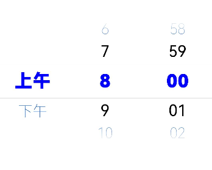
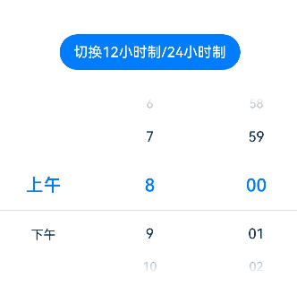
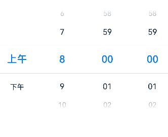
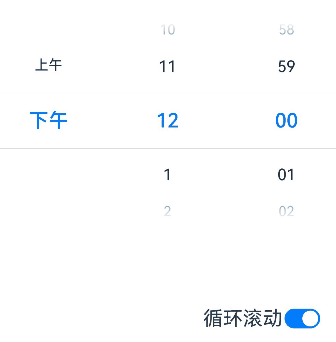
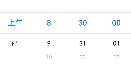
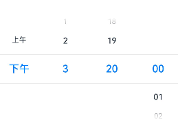
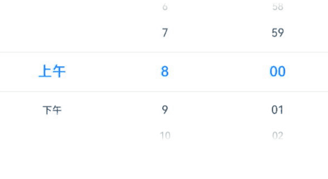

# TimePicker

时间选择组件，根据指定参数创建选择器，支持选择小时及分钟。

>  **说明：**
>
>  该组件从API version 8开始支持。后续版本如有新增内容，则采用上角标单独标记该内容的起始版本。


## 子组件

无


## 接口

TimePicker(options?: TimePickerOptions)

默认以24小时的时间区间创建滑动选择器。

**原子化服务API：** 从API version 11开始，该接口支持在原子化服务中使用。

**系统能力：** SystemCapability.ArkUI.ArkUI.Full

**参数：**

| 参数名  | 类型                                            | 必填 | 说明                     |
| ------- | ----------------------------------------------- | ---- | ------------------------ |
| options | [TimePickerOptions](#timepickeroptions对象说明) | 否   | 配置时间选择组件的参数。 |

## TimePickerOptions对象说明

**系统能力：** SystemCapability.ArkUI.ArkUI.Full

| 名称                 | 类型                                            | 必填 | 说明                                                         |
| -------------------- | ----------------------------------------------- | ---- | ------------------------------------------------------------ |
| selected             | Date                                            | 否   | 设置选中项的时间。<br/>默认值：当前系统时间<br />从API version 10开始，该参数支持[$$](../../../ui/state-management/arkts-two-way-sync.md)双向绑定变量。<br/>**原子化服务API：** 从API version 11开始，该接口支持在原子化服务中使用。 |
| format<sup>11+</sup> | [TimePickerFormat](#timepickerformat11枚举说明) | 否   | 指定需要显示的TimePicker的格式。<br/>默认值：TimePickerFormat.HOUR_MINUTE <br/>**原子化服务API：** 从API version 12开始，该接口支持在原子化服务中使用。|
| start<sup>18+</sup>  | Date | 否   | 指定时间选择组件的起始时间。<br/>默认值：Date(0, 0, 0, 0, 0, 0)，仅生效设置日期的小时和分钟。<br/>设定了start、end，且为非默认值的场景下，loop不生效。 <br/>**原子化服务API：** 从API version 18开始，该接口支持在原子化服务中使用。 |
| end<sup>18+</sup>    | Date | 否   | 指定时间选择组件的结束时间。<br/>默认值：Date(0, 0, 0, 23, 59, 59)，仅生效设置日期的小时和分钟。<br/>设定了start、end，且为非默认值的场景下，loop不生效。<br/>**原子化服务API：** 从API version 18开始，该接口支持在原子化服务中使用。 |

>  **说明：**
>
>  在TimePicker组件滑动过程中修改TimePickerOptions中的属性（selected、start、end），会导致这些属性无法生效。  
>  Date对象用于处理日期和时间。
>
>  **方式1：** new Date()
>
>  获取系统当前日期和时间。
>
>  **方式2：** new Date(value: number | string)
>
>  | 参数名   | 类型   | 必填 | 说明   |
>  | ------- | ------ | ---- | ------ |
>  | value   | number&nbsp;\|&nbsp;string  | 是 | 设置日期格式。<br/> number：毫秒，自1970年1月1日 00:00:00以来的毫秒数。<br/> string：时间格式的字符串，如 ‘2025-02-20 08:00:00’ 或 ‘2025-02-20T08:00:00’。|
>
>  **方式3：** new Date(year: number, monthIndex: number, date?: number, hours?: number, minutes?: number, seconds?: number, ms?: number)
>
>  | 参数名   | 类型   | 必填 | 说明   |
>  | --------| ------ | ---- | ------ |
>  | year        | number | 是   | 设置年份，例如：2025。|
>  | monthIndex  | number | 是   | 设置月份索引，例如：2，代表3月份。|
>  | date        | number | 否   | 设置日期，例如：10。（如果设置hours，则date不能省略）|
>  | hours       | number | 否   | 设置小时，例如：15。（如果设置minutes，则hours不能省略）|
>  | minutes     | number | 否   | 设置分钟，例如：20。（如果设置seconds，则minutes不能省略）|
>  | seconds     | number | 否   | 设置秒，例如：20。（如果设置ms，则seconds不能省略）|
>  | ms          | number | 否   | 设置毫秒，例如：10。|

## TimePickerFormat<sup>11+</sup>枚举说明

**原子化服务API：** 从API version 12开始，该接口支持在原子化服务中使用。

**系统能力：** SystemCapability.ArkUI.ArkUI.Full

| 名称               | 说明                     |
| ------------------ | ------------------------ |
| HOUR_MINUTE        | 按照小时和分显示。       |
| HOUR_MINUTE_SECOND | 按照小时、分钟和秒显示。 |

**异常情形说明：**

| 异常情形   | 对应结果  |
| -------- |  ------------------------------------------------------------ |
| 起始时间晚于结束时间    | 起始时间、结束时间都为默认值  |
| 选中时间早于起始时间    | 选中时间为起始时间  |
| 选中时间晚于结束时间    | 选中时间为结束时间  |
| 起始时间晚于当前系统时间，选中时间未设置    | 选中时间为起始时间 |
| 结束时间早于当前系统时间，选中时间未设置    | 选中时间为结束时间  |
| 时间格式不符合规范，如'01:61:61'   | 取默认值  |

## 属性

除支持[通用属性](ts-component-general-attributes.md)外，还支持以下属性：

### useMilitaryTime

useMilitaryTime(value: boolean)

设置展示时间是否为24小时制。当展示时间为12小时制时，上下午与小时无联动关系。

**原子化服务API：** 从API version 11开始，该接口支持在原子化服务中使用。

**系统能力：** SystemCapability.ArkUI.ArkUI.Full

**参数：** 

| 参数名 | 类型    | 必填 | 说明                                       |
| ------ | ------- | ---- | ------------------------------------------ |
| value  | boolean | 是   | 展示时间是否为24小时制。<br/>默认值：false，false表示展示时间为12小时制，true表示展示时间为24小时制。 |

### useMilitaryTime<sup>18+</sup>

useMilitaryTime(isMilitaryTime: Optional\<boolean>)

设置展示时间是否为24小时制。与[useMilitaryTime](#usemilitarytime)相比，isMilitaryTime参数新增了对undefined类型的支持。

**原子化服务API：** 从API version 18开始，该接口支持在原子化服务中使用。

**系统能力：** SystemCapability.ArkUI.ArkUI.Full

**参数：**

| 参数名 | 类型    | 必填 | 说明                                       |
| ------ | ------- | ---- | ------------------------------------------ |
| isMilitaryTime | [Optional](ts-universal-attributes-custom-property.md#optional12)\<boolean> | 是   | 展示时间是否为24小时制。<br/>当isMilitaryTime的值为undefined时，默认值：false，false表示展示时间为12小时制，true表示展示时间为24小时制。 |

### disappearTextStyle<sup>10+</sup>

disappearTextStyle(value: PickerTextStyle)

设置所有选项中最上和最下两个选项的文本颜色、字号、字体粗细。

**原子化服务API：** 从API version 11开始，该接口支持在原子化服务中使用。

**系统能力：** SystemCapability.ArkUI.ArkUI.Full

**参数：** 

| 参数名 | 类型                                                         | 必填 | 说明                                                         |
| ------ | ------------------------------------------------------------ | ---- | ------------------------------------------------------------ |
| value  | [PickerTextStyle](ts-basic-components-datepicker.md#pickertextstyle10类型说明) | 是   | 所有选项中最上和最下两个选项的文本颜色、字号、字体粗细。<br/>默认值：<br/>{<br/>color: '#ff182431',<br/>font: {<br/>size: '14fp', <br/>weight: FontWeight.Regular<br/>}<br/>} |

### disappearTextStyle<sup>18+</sup>

disappearTextStyle(style: Optional\<PickerTextStyle>)

设置所有选项中最上和最下两个选项的文本颜色、字号、字体粗细。与[disappearTextStyle](#disappeartextstyle10)<sup>10+</sup>相比，style参数新增了对undefined类型的支持。

**原子化服务API：** 从API version 18开始，该接口支持在原子化服务中使用。

**系统能力：** SystemCapability.ArkUI.ArkUI.Full

**参数：**

| 参数名 | 类型                                                         | 必填 | 说明                                                         |
| ------ | ------------------------------------------------------------ | ---- | ------------------------------------------------------------ |
| style  | [Optional](ts-universal-attributes-custom-property.md#optional12)\<[PickerTextStyle](ts-basic-components-datepicker.md#pickertextstyle10类型说明)> | 是   | 所有选项中最上和最下两个选项的文本颜色、字号、字体粗细。<br/>当style的值为undefined时，默认值：<br/>{<br/>color: '#ff182431',<br/>font: {<br/>size: '14fp', <br/>weight: FontWeight.Regular<br/>}<br/>} |

### textStyle<sup>10+</sup>

textStyle(value: PickerTextStyle)

设置所有选项中除了最上、最下及选中项以外的文本颜色、字号、字体粗细。

**原子化服务API：** 从API version 11开始，该接口支持在原子化服务中使用。

**系统能力：** SystemCapability.ArkUI.ArkUI.Full

**参数：** 

| 参数名 | 类型                                                         | 必填 | 说明                                                         |
| ------ | ------------------------------------------------------------ | ---- | ------------------------------------------------------------ |
| value  | [PickerTextStyle](ts-basic-components-datepicker.md#pickertextstyle10类型说明) | 是   | 所有选项中除了最上、最下及选中项以外的文本颜色、字号、字体粗细。<br/>默认值：<br/>{<br/>color: '#ff182431',<br/>font: {<br/>size: '16fp', <br/>weight: FontWeight.Regular<br/>}<br/>} |

### textStyle<sup>18+</sup>

textStyle(style: Optional\<PickerTextStyle>)

设置所有选项中除了最上、最下及选中项以外的文本颜色、字号、字体粗细。与[textStyle](#textstyle10)<sup>10+</sup>相比，style参数新增了对undefined类型的支持。

**原子化服务API：** 从API version 18开始，该接口支持在原子化服务中使用。

**系统能力：** SystemCapability.ArkUI.ArkUI.Full

**参数：**

| 参数名 | 类型                                                         | 必填 | 说明                                                         |
| ------ | ------------------------------------------------------------ | ---- | ------------------------------------------------------------ |
| style  | [Optional](ts-universal-attributes-custom-property.md#optional12)\<[PickerTextStyle](ts-basic-components-datepicker.md#pickertextstyle10类型说明)> | 是   | 所有选项中除了最上、最下及选中项以外的文本颜色、字号、字体粗细。<br/>当style的值为undefined时，默认值：<br/>{<br/>color: '#ff182431',<br/>font: {<br/>size: '16fp', <br/>weight: FontWeight.Regular<br/>}<br/>} |

### selectedTextStyle<sup>10+</sup>

selectedTextStyle(value: PickerTextStyle)

设置选中项的文本颜色、字号、字体粗细。

**原子化服务API：** 从API version 11开始，该接口支持在原子化服务中使用。

**系统能力：** SystemCapability.ArkUI.ArkUI.Full

**参数：** 

| 参数名 | 类型                                                         | 必填 | 说明                                                         |
| ------ | ------------------------------------------------------------ | ---- | ------------------------------------------------------------ |
| value  | [PickerTextStyle](ts-basic-components-datepicker.md#pickertextstyle10类型说明) | 是   | 选中项的文本颜色、字号、字体粗细。<br/>默认值：<br/>{<br/>color: '#ff007dff',<br/>font: {<br/>size: '20fp', <br/>weight: FontWeight.Medium<br/>}<br/>} |

### selectedTextStyle<sup>18+</sup>

selectedTextStyle(style: Optional\<PickerTextStyle>)

设置选中项的文本颜色、字号、字体粗细。与[selectedTextStyle](#selectedtextstyle10)<sup>10+</sup>相比，style参数新增了对undefined类型的支持。

**原子化服务API：** 从API version 18开始，该接口支持在原子化服务中使用。

**系统能力：** SystemCapability.ArkUI.ArkUI.Full

**参数：**

| 参数名 | 类型                                                         | 必填 | 说明                                                         |
| ------ | ------------------------------------------------------------ | ---- | ------------------------------------------------------------ |
| style  | [Optional](ts-universal-attributes-custom-property.md#optional12)\<[PickerTextStyle](ts-basic-components-datepicker.md#pickertextstyle10类型说明)> | 是   | 选中项的文本颜色、字号、字体粗细。<br/>当style的值为undefined时，默认值：<br/>{<br/>color: '#ff007dff',<br/>font: {<br/>size: '20fp', <br/>weight: FontWeight.Medium<br/>}<br/>} |

### loop<sup>11+</sup>

loop(value: boolean)

设置是否启用循环模式。

**原子化服务API：** 从API version 12开始，该接口支持在原子化服务中使用。

**系统能力：** SystemCapability.ArkUI.ArkUI.Full

**参数：** 

| 参数名 | 类型    | 必填 | 说明                                                         |
| ------ | ------- | ---- | ------------------------------------------------------------ |
| value  | boolean | 是   | 是否启用循环模式。<br/>默认值：true，true表示启用循环模式，false表示不启用循环模式。 |

### loop<sup>18+</sup>

loop(isLoop: Optional\<boolean>)

设置是否启用循环模式。与[loop](#loop11)<sup>11+</sup>相比，isLoop参数新增了对undefined类型的支持。

**原子化服务API：** 从API version 18开始，该接口支持在原子化服务中使用。

**系统能力：** SystemCapability.ArkUI.ArkUI.Full

**参数：**

| 参数名 | 类型    | 必填 | 说明                                                         |
| ------ | ------- | ---- | ------------------------------------------------------------ |
| isLoop  | [Optional](ts-universal-attributes-custom-property.md#optional12)\<boolean> | 是   | 是否启用循环模式。<br/>当isLoop的值为undefined时，默认值：true，true表示启用循环模式，false表示不启用循环模式。 |

### dateTimeOptions<sup>12+</sup>

dateTimeOptions(value: DateTimeOptions)

设置时分秒是否显示前置0。

**原子化服务API：** 从API version 12开始，该接口支持在原子化服务中使用。

**系统能力：** SystemCapability.ArkUI.ArkUI.Full

**参数：** 

| 参数名 | 类型                                                         | 必填 | 说明                                                         |
| ------ | ------------------------------------------------------------ | ---- | ------------------------------------------------------------ |
| value  | [DateTimeOptions](../../apis-localization-kit/js-apis-intl.md#datetimeoptions) | 是   | 设置时分秒是否显示前置0，目前只支持设置hour、minute和second参数。<br/>默认值：<br/>hour: 24小时制默认为"2-digit"，即有前置0；12小时制默认为"numeric"，即没有前置0。<br/>minute: 默认为"2-digit"，即有前置0。|

### dateTimeOptions<sup>18+</sup>

dateTimeOptions(timeFormat: Optional\<DateTimeOptions>)

设置时分秒是否显示前置0。与[dateTimeOptions](#datetimeoptions12)<sup>12+</sup>相比，timeFormat参数新增了对undefined类型的支持。

**原子化服务API：** 从API version 18开始，该接口支持在原子化服务中使用。

**系统能力：** SystemCapability.ArkUI.ArkUI.Full

**参数：**

| 参数名 | 类型                                                         | 必填 | 说明                                                         |
| ------ | ------------------------------------------------------------ | ---- | ------------------------------------------------------------ |
| timeFormat  | [Optional](ts-universal-attributes-custom-property.md#optional12)\<[DateTimeOptions](../../apis-localization-kit/js-apis-intl.md#datetimeoptions)> | 是   | 设置时分秒是否显示前置0，目前只支持设置hour、minute和second参数。<br/>默认值：<br/>hour: 24小时制默认为"2-digit"，即有前置0；12小时制默认为"numeric"，即没有前置0。<br/>minute: 默认为"2-digit"，即有前置0。<br/>second: 默认为"2-digit"，即有前置0。<br/> 当hour、minute、second的值设置为undefined时，显示效果与其默认值规则一致。|

### enableHapticFeedback<sup>12+</sup>

enableHapticFeedback(enable: boolean)

设置是否支持触控反馈。

**原子化服务API：** 从API version 12开始，该接口支持在原子化服务中使用。

**系统能力：** SystemCapability.ArkUI.ArkUI.Full

| 参数名 | 类型                                          | 必填  | 说明                                                                                  |
| ------ | --------------------------------------------- |-----|-------------------------------------------------------------------------------------|
| enable  | boolean | 是   | 是否支持触控反馈。<br/>默认值：true，true表示开启触控反馈，false表示不开启触控反馈。<br/>设置为true后是否生效，还取决于系统的硬件是否支持。 |

### enableHapticFeedback<sup>18+</sup>

enableHapticFeedback(enable: Optional\<boolean>)

·设置是否支持触控反馈。与[enableHapticFeedback](#enablehapticfeedback12)<sup>12+</sup>相比，enable参数新增了对undefined类型的支持。

**原子化服务API：** 从API version 18开始，该接口支持在原子化服务中使用。

**系统能力：** SystemCapability.ArkUI.ArkUI.Full

| 参数名 | 类型                                          | 必填  | 说明                                                                                  |
| ------ | --------------------------------------------- |-----|-------------------------------------------------------------------------------------|
| enable  | [Optional](ts-universal-attributes-custom-property.md#optional12)\<boolean> | 是   | 是否支持触控反馈。<br/>当enable的值为undefined时，默认值：true，true表示开启触控反馈，false表示不开启触控反馈。<br/>设置为true后是否生效，还取决于系统的硬件是否支持。 |

>  **说明：**
>
>  开启触控反馈时，需要在工程的module.json5中配置requestPermissions字段开启振动权限，配置如下：
>  ```json
>  "requestPermissions": [
>  {
>   "name": "ohos.permission.VIBRATE",
>  }
>  ]
>  ```

### enableCascade<sup>18+</sup>

enableCascade(enable: boolean)

在设置12小时制时，上午和下午的标识会根据小时数自动切换。

**原子化服务API：** 从API version 18开始，该接口支持在原子化服务中使用。

**系统能力：** SystemCapability.ArkUI.ArkUI.Full

| 参数名 | 类型                                          | 必填  | 说明                                                                                  |
| ------ | --------------------------------------------- |-----|-------------------------------------------------------------------------------------|
| enable  | boolean | 是   | 在12小时制时，设置上午和下午的标识是否会根据小时数自动切换。<br/>默认值：false，false表示不开启自动切换，true表示开启自动切换。<br/>设置为true后，仅当loop参数同时为true时生效。<br/> |

### digitalCrownSensitivity<sup>18+</sup>
digitalCrownSensitivity(sensitivity: Optional\<CrownSensitivity>)

设置表冠灵敏度。

**原子化服务API：** 从API version 18开始，该接口支持在原子化服务中使用。

**系统能力：** SystemCapability.ArkUI.ArkUI.Full

| 参数名   | 参数类型                                     | 必填   | 参数描述                      |
| ----- | ---------------------------------------- | ---- | ------------------------- |
| sensitivity | [Optional](ts-universal-attributes-custom-property.md#optional12)\<[CrownSensitivity](ts-appendix-enums.md#crownsensitivity18)> | 是    | 表冠灵敏度。                     |

>  **说明：**
>
>  用于穿戴设备圆形屏幕使用。

## 事件

除支持[通用事件](ts-component-general-events.md)外，还支持以下事件：

### onChange

onChange(callback:&nbsp;(value:&nbsp;TimePickerResult )&nbsp;=&gt;&nbsp;void)

选择时间时触发该事件。

**原子化服务API：** 从API version 11开始，该接口支持在原子化服务中使用。

**系统能力：** SystemCapability.ArkUI.ArkUI.Full

**参数：** 

| 参数名 | 类型                                          | 必填 | 说明           |
| ------ | --------------------------------------------- | ---- | -------------- |
| value  | [TimePickerResult](#timepickerresult对象说明) | 是   | 24小时制时间。 |

### onChange<sup>18+</sup>

onChange(callback: Optional\<OnTimePickerChangeCallback>)

滑动TimePicker后，时间选项归位至选中项位置时，触发该回调。与[onChange](#onchange)相比，callback参数新增了对undefined类型的支持。

**原子化服务API：** 从API version 18开始，该接口支持在原子化服务中使用。

**系统能力：** SystemCapability.ArkUI.ArkUI.Full

**参数：**

| 参数名   | 类型                                                         | 必填 | 说明                                                         |
| -------- | ------------------------------------------------------------ | ---- | ------------------------------------------------------------ |
| callback | [Optional](ts-universal-attributes-custom-property.md#optional12)\<[OnTimePickerChangeCallback](#ontimepickerchangecallback18)> | 是   | 选择时间时触发该回调。<br/>当callback的值为undefined时，不使用回调函数。 |

### onEnterSelectedArea<sup>18+</sup>

onEnterSelectedArea(callback: Callback\<TimePickerResult>)

滑动TimePicker过程中，选项进入分割线区域内，触发该回调。

与onChange事件的差别在于，该事件的触发时机早于onChange事件，当当前滑动列滑动距离超过选中项高度的一半时，选项此时已经进入分割线区域内，会触发该事件。当enableCascade设置为true时，由于上午/下午列与小时列存在联动关系，不建议使用该回调。该回调标识的是滑动过程中选项进入分割线区域内的节点，而联动变化的选项并不涉及滑动，因此，回调的返回值中，仅当前滑动列的值会正常变化，其余未滑动列的值保持不变。

**原子化服务API：** 从API version 18开始，该接口支持在原子化服务中使用。

**系统能力：** SystemCapability.ArkUI.ArkUI.Full

**参数：** 

| 参数名   | 类型                       | 必填 | 说明                                       |
| -------- | -------------------------- | ---- | ------------------------------------------ |
| callback | Callback\<[TimePickerResult](#timepickerresult对象说明)> | 是   | 滑动TimePicker过程中，选项进入分割线区域时触发的回调。 |

## OnTimePickerChangeCallback<sup>18+</sup>

type OnTimePickerChangeCallback = (value: TimePickerResult) => void

选择时间时触发该事件。

**卡片能力：** 从API version 18开始，该接口支持在ArkTS卡片中使用。

**原子化服务API：** 从API version 18开始，该接口支持在原子化服务中使用。

**系统能力：** SystemCapability.ArkUI.ArkUI.Full

**参数：** 

| 参数名 | 类型                                          | 必填 | 说明           |
| ------ | --------------------------------------------- | ---- | -------------- |
| value  | [TimePickerResult](#timepickerresult对象说明) | 是   | 24小时制时间。 |

## TimePickerResult对象说明

返回值为24小时制时间。

**原子化服务API：** 从API version 11开始，该接口支持在原子化服务中使用。

**系统能力：** SystemCapability.ArkUI.ArkUI.Full

| 名称                 | 类型   | 只读 | 可选 | 说明                                |
| -------------------- | ------ | ---- | ---- | ----------------------------------- |
| hour                 | number | 否   | 否   | 选中时间的时。<br/>取值范围：[0-23] |
| minute               | number | 否   | 否   | 选中时间的分。<br/>取值范围：[0-59] |
| second<sup>11+</sup> | number | 否   | 否   | 选中时间的秒。<br/>取值范围：[0-59] |

## 示例

### 示例1（设置文本样式）

该示例通过配置disappearTextStyle、textStyle、selectedTextStyle实现文本选择器中的文本样式。

```ts
// xxx.ets
@Entry
@Component
struct TimePickerExample {
  private selectedTime: Date = new Date('2022-07-22T08:00:00')

  build() {
    TimePicker({
      selected: this.selectedTime
    })
      .disappearTextStyle({ color: '#004aaf', font: { size: 24, weight: FontWeight.Lighter } })
      .textStyle({ color: Color.Black, font: { size: 26, weight: FontWeight.Normal } })
      .selectedTextStyle({ color: Color.Blue, font: { size: 30, weight: FontWeight.Bolder } })
      .onChange((value: TimePickerResult) => {
        if (value.hour >= 0) {
          this.selectedTime.setHours(value.hour, value.minute)
          console.info('select current date is: ' + JSON.stringify(value))
        }
      })
  }
}
```



### 示例2（切换小时制）

该示例通过配置useMilitaryTime实现12小时制、24小时制的切换。

```ts
// xxx.ets
@Entry
@Component
struct TimePickerExample {
  @State isMilitaryTime: boolean = false
  private selectedTime: Date = new Date('2022-07-22T08:00:00')

  build() {
    Column() {
      Button('切换12小时制/24小时制')
        .margin(30)
        .onClick(() => {
          this.isMilitaryTime = !this.isMilitaryTime
        })

      TimePicker({
        selected: this.selectedTime
      })
        .useMilitaryTime(this.isMilitaryTime)
        .onChange((value: TimePickerResult) => {
          if (value.hour >= 0) {
            this.selectedTime.setHours(value.hour, value.minute)
            console.info('select current time is: ' + JSON.stringify(value))
          }
        })
        .onEnterSelectedArea((value: TimePickerResult) => {
            console.info('item enter selected area, time is: ' + JSON.stringify(value))
        })
    }.width('100%')
  }
}
```



### 示例3（设置时间格式）

该示例使用format、dateTimeOptions设置TimePicker时间格式。

```ts
// xxx.ets
@Entry
@Component
struct TimePickerExample {
  private selectedTime: Date = new Date('2022-07-22T08:00:00')

  build() {
    Column() {
      TimePicker({
        selected: this.selectedTime,
        format: TimePickerFormat.HOUR_MINUTE_SECOND
      })
        .dateTimeOptions({ hour: "numeric", minute: "2-digit", second: "2-digit" })
        .onChange((value: TimePickerResult) => {
          if (value.hour >= 0) {
            this.selectedTime.setHours(value.hour, value.minute)
            console.info('select current date is: ' + JSON.stringify(value))
          }
        })
    }.width('100%')
  }
}
```



### 示例4（设置循环滚动）

该示例使用loop设置TimePicker是否循环滚动。

```ts
// xxx.ets
@Entry
@Component
struct TimePickerExample {
  @State isLoop: boolean = true
  private selectedTime: Date = new Date('2022-07-22T12:00:00')

  build() {
    Column() {
      TimePicker({
        selected: this.selectedTime
      })
        .loop(this.isLoop)
        .onChange((value: TimePickerResult) => {
          if (value.hour >= 0) {
            this.selectedTime.setHours(value.hour, value.minute)
            console.info('select current date is: ' + JSON.stringify(value))
          }
        })

      Row() {
        Text('循环滚动').fontSize(20)

        Toggle({ type: ToggleType.Switch, isOn: true })
          .onChange((isOn: boolean) => {
            this.isLoop = isOn
          })
      }.position({ x: '60%', y: '40%' })

    }.width('100%')
  }
}
```



### 示例5（设置时间选择组件的起始时间）

该示例设置TimePicker的起始时间。

```ts
// xxx.ets
@Entry
@Component
struct TimePickerExample {
  private selectedTime: Date = new Date('2022-07-22T08:50:00')

  build() {
    Column() {
      TimePicker({
        selected: this.selectedTime,
        format: TimePickerFormat.HOUR_MINUTE_SECOND,
        start: new Date('2022-07-22T08:30:00')
      })
        .dateTimeOptions({ hour: "numeric", minute: "2-digit", second: "2-digit" })
        .onChange((value: TimePickerResult) => {
          if (value.hour >= 0) {
            this.selectedTime.setHours(value.hour, value.minute)
            console.info('select current date is: ' + JSON.stringify(value))
          }
        })
    }.width('100%')
  }
}
```


### 示例6（设置时间选择组件的结束时间）

该示例设置TimePicker的结束时间。

```ts
// xxx.ets
@Entry
@Component
struct TimePickerExample {
  private selectedTime: Date = new Date('2022-07-22T08:50:00')

  build() {
    Column() {
      TimePicker({
        selected: this.selectedTime,
        format: TimePickerFormat.HOUR_MINUTE_SECOND,
        end: new Date('2022-07-22T15:20:00'),
      })
        .dateTimeOptions({ hour: "numeric", minute: "2-digit", second: "2-digit" })
        .onChange((value: TimePickerResult) => {
          if (value.hour >= 0) {
            this.selectedTime.setHours(value.hour, value.minute)
            console.info('select current date is: ' + JSON.stringify(value))
          }
        })
    }.width('100%')
  }
}
```



### 示例7（设置上午下午跟随时间联动）

该示例通过配置enableCascade、loop实现12小时制时上午下午跟随时间联动。

```ts
// xxx.ets
@Entry
@Component
struct TimePickerExample {
  private selectedTime: Date = new Date('2022-07-22T08:00:00')

  build() {
    Column() {
      TimePicker({
        selected: this.selectedTime,
      })
        .enableCascade(true)
        .loop(true)
        .onChange((value: TimePickerResult) => {
          if (value.hour >= 0) {
            this.selectedTime.setHours(value.hour, value.minute)
            console.info('select current date is: ' + JSON.stringify(value))
          }
        })
    }.width('100%')
  }
}
```


