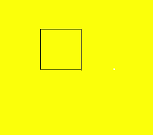
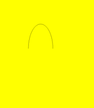
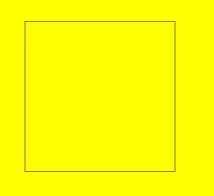

# Path2D

路径对象，支持通过对象的接口进行路径的描述，并通过Canvas的stroke接口或者fill接口进行绘制。

>  **说明：**
>
>  从 API version 8 开始支持。后续版本如有新增内容，则采用上角标单独标记该内容的起始版本。

## 接口

Path2D(unit?: LengthMetricsUnit)

构造一个空的Path2D对象。

**卡片能力：** 从API version 9开始，该接口支持在ArkTS卡片中使用。

**原子化服务API：** 从API version 11开始，该接口支持在原子化服务中使用。

**系统能力：** SystemCapability.ArkUI.ArkUI.Full

**参数：**

| 参数名  | 类型     | 必填 |  说明   |
| ----- | -------- | ---- | ---------- |
| unit<sup>12+</sup>  | [LengthMetricsUnit](../js-apis-arkui-graphics.md#lengthmetricsunit12) | 否 | 用来配置Path2D对象的单位模式，配置后无法动态更改，配置方法同[CanvasRenderingContext2D](ts-canvasrenderingcontext2d.md#lengthmetricsunit12)。<br>默认值：DEFAULT|

Path2D(description: string, unit?: LengthMetricsUnit)

使用符合SVG路径描述规范的路径字符串构造一个Path2D对象。

**卡片能力：** 从API version 9开始，该接口支持在ArkTS卡片中使用。

**原子化服务API：** 从API version 11开始，该接口支持在原子化服务中使用。

**系统能力：** SystemCapability.ArkUI.ArkUI.Full

**参数：**

| 参数名  | 类型     | 必填 |  说明   |
| ----- | -------- | ---- | ---------- |
| description | string | 是 | 符合 SVG 路径描述规范的路径字符串，格式参考[Path](ts-drawing-components-path.md#svg路径描述规范)中SVG路径描述规范说明。 |
| unit<sup>12+</sup>  | [LengthMetricsUnit](../js-apis-arkui-graphics.md#lengthmetricsunit12) | 否 | 用来配置Path2D对象的单位模式，配置后无法动态更改，配置方法同[CanvasRenderingContext2D](ts-canvasrenderingcontext2d.md#lengthmetricsunit12)。<br>默认值：DEFAULT|

## 方法

### addPath

addPath(path: Path2D, transform?: Matrix2D): void

将另一个路径添加到当前的路径对象中。

**卡片能力：** 从API version 9开始，该接口支持在ArkTS卡片中使用。

**原子化服务API：** 从API version 11开始，该接口支持在原子化服务中使用。

**系统能力：** SystemCapability.ArkUI.ArkUI.Full

**参数：**

| 参数名  | 类型     | 必填 |  说明   |
| ----- | -------- | ---- | ---------- |
| path      | [Path2D](ts-components-canvas-path2d.md)   | 是 | 需要添加到当前路径的路径对象，路径单位：px。 |
| transform | [Matrix2D](ts-components-canvas-matrix2d.md) | 否 | 新增路径的变换矩阵对象。<br>默认值：null |


**示例：**

  ```ts
  // xxx.ets
  @Entry
  @Component
  struct AddPath {
    private settings: RenderingContextSettings = new RenderingContextSettings(true);
    private context: CanvasRenderingContext2D = new CanvasRenderingContext2D(this.settings);
    private path2Da: Path2D = new Path2D("M250 150 L150 350 L350 350 Z");
    private path2Db: Path2D = new Path2D();

    build() {
      Flex({ direction: FlexDirection.Column, alignItems: ItemAlign.Center, justifyContent: FlexAlign.Center }) {
        Canvas(this.context)
          .width('100%')
          .height('100%')
          .backgroundColor('#ffff00')
          .onReady(() => {
            this.path2Db.addPath(this.path2Da)
            this.context.stroke(this.path2Db)
          })
      }
      .width('100%')
      .height('100%')
    }
  }
  ```

  


### closePath

closePath(): void

将路径的当前点移回到路径的起点，当前点到起点间画一条直线。如果形状已经闭合或只有一个点，则此功能不执行任何操作。

**卡片能力：** 从API version 9开始，该接口支持在ArkTS卡片中使用。

**原子化服务API：** 从API version 11开始，该接口支持在原子化服务中使用。

**系统能力：** SystemCapability.ArkUI.ArkUI.Full

**示例：**

  ```ts
  // xxx.ets
  @Entry
  @Component
  struct ClosePath {
    private settings: RenderingContextSettings = new RenderingContextSettings(true);
    private context: CanvasRenderingContext2D = new CanvasRenderingContext2D(this.settings);
    private path2Db: Path2D = new Path2D();
  
    build() {
      Flex({ direction: FlexDirection.Column, alignItems: ItemAlign.Center, justifyContent: FlexAlign.Center }) {
        Canvas(this.context)
          .width('100%')
          .height('100%')
          .backgroundColor('#ffff00')
          .onReady(() => {
            this.path2Db.moveTo(200, 100)
            this.path2Db.lineTo(300, 100)
            this.path2Db.lineTo(200, 200)
            this.path2Db.closePath()
            this.context.stroke(this.path2Db)
          })
      }
      .width('100%')
      .height('100%')
    }
  }
  ```

  


### moveTo

moveTo(x: number, y: number): void

将路径的当前坐标点移动到目标点，移动过程中不绘制线条。

**卡片能力：** 从API version 9开始，该接口支持在ArkTS卡片中使用。

**原子化服务API：** 从API version 11开始，该接口支持在原子化服务中使用。

**系统能力：** SystemCapability.ArkUI.ArkUI.Full

**参数：**

| 参数   | 类型     | 必填 | 描述       |
| ---- | ------ | ---- | -------- |
| x    | number | 是 | 目标点X轴坐标。<br>默认单位：vp |
| y    | number | 是 | 目标点Y轴坐标。<br>默认单位：vp |

**示例：**

  ```ts
  // xxx.ets
  @Entry
  @Component
  struct MoveTo {
    private settings: RenderingContextSettings = new RenderingContextSettings(true);
    private context: CanvasRenderingContext2D = new CanvasRenderingContext2D(this.settings);
    private path2Db: Path2D = new Path2D();
  
    build() {
      Flex({ direction: FlexDirection.Column, alignItems: ItemAlign.Center, justifyContent: FlexAlign.Center }) {
        Canvas(this.context)
          .width('100%')
          .height('100%')
          .backgroundColor('#ffff00')
          .onReady(() => {
            this.path2Db.moveTo(50, 100)
            this.path2Db.lineTo(250, 100)
            this.path2Db.lineTo(150, 200)
            this.path2Db.closePath()
            this.context.stroke(this.path2Db)
          })
      }
      .width('100%')
      .height('100%')
    }
  }
  ```

  


### lineTo

lineTo(x: number, y: number): void

从当前点绘制一条直线到目标点。

**卡片能力：** 从API version 9开始，该接口支持在ArkTS卡片中使用。

**原子化服务API：** 从API version 11开始，该接口支持在原子化服务中使用。

**系统能力：** SystemCapability.ArkUI.ArkUI.Full

**参数：**

| 参数名  | 类型     | 必填 |  说明   |
| ----- | -------- | ---- | ---------- |
| x    | number | 是 | 目标点X轴坐标。<br>默认单位：vp |
| y    | number | 是 | 目标点Y轴坐标。<br>默认单位：vp |

**示例：**

  ```ts
  // xxx.ets
  @Entry
  @Component
  struct LineTo {
    private settings: RenderingContextSettings = new RenderingContextSettings(true);
    private context: CanvasRenderingContext2D = new CanvasRenderingContext2D(this.settings);
    private path2Db: Path2D = new Path2D();
  
    build() {
      Flex({ direction: FlexDirection.Column, alignItems: ItemAlign.Center, justifyContent: FlexAlign.Center }) {
        Canvas(this.context)
          .width('100%')
          .height('100%')
          .backgroundColor('#ffff00')
          .onReady(() => {
            this.path2Db.moveTo(100, 100)
            this.path2Db.lineTo(100, 200)
            this.path2Db.lineTo(200, 200)
            this.path2Db.lineTo(200, 100)
            this.path2Db.closePath()
            this.context.stroke(this.path2Db)
          })
      }
      .width('100%')
      .height('100%')
    }
  }
  ```

  


### bezierCurveTo

bezierCurveTo(cp1x: number, cp1y: number, cp2x: number, cp2y: number, x: number, y: number): void

创建三次贝赛尔曲线的路径。

**卡片能力：** 从API version 9开始，该接口支持在ArkTS卡片中使用。

**原子化服务API：** 从API version 11开始，该接口支持在原子化服务中使用。

**系统能力：** SystemCapability.ArkUI.ArkUI.Full

**参数：**

| 参数名  | 类型     | 必填 |  说明   |
| ----- | -------- | ---- | ---------- |
| cp1x | number | 是 | 第一个贝塞尔参数的x坐标值。<br>默认单位：vp |
| cp1y | number | 是 | 第一个贝塞尔参数的y坐标值。<br>默认单位：vp |
| cp2x | number | 是 | 第二个贝塞尔参数的x坐标值。<br>默认单位：vp |
| cp2y | number | 是 | 第二个贝塞尔参数的y坐标值。<br>默认单位：vp |
| x    | number | 是 | 路径结束时的x坐标值。<br>默认单位：vp    |
| y    | number | 是 | 路径结束时的y坐标值。<br>默认单位：vp    |

**示例：**

  ```ts
  // xxx.ets
  @Entry
  @Component
  struct BezierCurveTo {
    private settings: RenderingContextSettings = new RenderingContextSettings(true);
    private context: CanvasRenderingContext2D = new CanvasRenderingContext2D(this.settings);
    private path2Db: Path2D = new Path2D();
  
    build() {
      Flex({ direction: FlexDirection.Column, alignItems: ItemAlign.Center, justifyContent: FlexAlign.Center }) {
        Canvas(this.context)
          .width('100%')
          .height('100%')
          .backgroundColor('#ffff00')
          .onReady(() => {
            this.path2Db.moveTo(10, 10)
            this.path2Db.bezierCurveTo(20, 100, 200, 100, 200, 20)
            this.context.stroke(this.path2Db)
          })
      }
      .width('100%')
      .height('100%')
    }
  }
  ```

  


### quadraticCurveTo

quadraticCurveTo(cpx: number, cpy: number, x: number, y: number): void

创建二次贝赛尔曲线的路径。

**卡片能力：** 从API version 9开始，该接口支持在ArkTS卡片中使用。

**原子化服务API：** 从API version 11开始，该接口支持在原子化服务中使用。

**系统能力：** SystemCapability.ArkUI.ArkUI.Full

**参数：**

| 参数名  | 类型     | 必填 |  说明   |
| ----- | -------- | ---- | ---------- |
| cpx  | number | 是 | 贝塞尔参数的x坐标值。<br>默认单位：vp |
| cpy  | number | 是 | 贝塞尔参数的y坐标值。<br>默认单位：vp |
| x    | number | 是 | 路径结束时的x坐标值。<br>默认单位：vp |
| y    | number | 是 | 路径结束时的y坐标值。<br>默认单位：vp |

**示例：**

  ```ts
  // xxx.ets
  @Entry
  @Component
  struct QuadraticCurveTo {
    private settings: RenderingContextSettings = new RenderingContextSettings(true);
    private context: CanvasRenderingContext2D = new CanvasRenderingContext2D(this.settings);
    private path2Db: Path2D = new Path2D();
  
    build() {
      Flex({ direction: FlexDirection.Column, alignItems: ItemAlign.Center, justifyContent: FlexAlign.Center }) {
        Canvas(this.context)
          .width('100%')
          .height('100%')
          .backgroundColor('#ffff00')
          .onReady(() => {
            this.path2Db.moveTo(10, 10)
            this.path2Db.quadraticCurveTo(100, 100, 200, 20)
            this.context.stroke(this.path2Db)
        })
      }
      .width('100%')
      .height('100%')
    }
  }
  ```

  


### arc

arc(x: number, y: number, radius: number, startAngle: number, endAngle: number, counterclockwise?: boolean): void

绘制弧线路径。

**卡片能力：** 从API version 9开始，该接口支持在ArkTS卡片中使用。

**原子化服务API：** 从API version 11开始，该接口支持在原子化服务中使用。

**系统能力：** SystemCapability.ArkUI.ArkUI.Full

**参数：**

| 参数名  | 类型     | 必填 |  说明   |
| ----- | -------- | ---- | ---------- |
| x                | number  | 是 | 弧线圆心的x坐标值。<br>默认单位：vp |
| y                | number  | 是 | 弧线圆心的y坐标值。<br>默认单位：vp |
| radius           | number  | 是 | 弧线的圆半径。<br>默认单位：vp    |
| startAngle       | number  | 是 | 弧线的起始弧度。<br>单位：弧度。   |
| endAngle         | number  | 是 | 弧线的终止弧度。<br>单位：弧度。   |
| counterclockwise | boolean | 否 | 是否逆时针绘制圆弧。<br>true：逆时针方向绘制圆弧。<br>false：顺时针方向绘制圆弧。<br>默认值：false |

**示例：**

  ```ts
  // xxx.ets
  @Entry
  @Component
  struct Arc {
    private settings: RenderingContextSettings = new RenderingContextSettings(true);
    private context: CanvasRenderingContext2D = new CanvasRenderingContext2D(this.settings);
    private path2Db: Path2D = new Path2D();
  
    build() {
      Flex({ direction: FlexDirection.Column, alignItems: ItemAlign.Center, justifyContent: FlexAlign.Center }) {
        Canvas(this.context)
          .width('100%')
          .height('100%')
          .backgroundColor('#ffff00')
          .onReady(() => {
            this.path2Db.arc(100, 75, 50, 0, 6.28)
            this.context.stroke(this.path2Db)
          })
      }
      .width('100%')
      .height('100%')
    }
  }
  ```

  


### arcTo

arcTo(x1: number, y1: number, x2: number, y2: number, radius: number): void

依据圆弧经过的点和圆弧半径创建圆弧路径。

**卡片能力：** 从API version 9开始，该接口支持在ArkTS卡片中使用。

**原子化服务API：** 从API version 11开始，该接口支持在原子化服务中使用。

**系统能力：** SystemCapability.ArkUI.ArkUI.Full

**参数：**

| 参数名  | 类型     | 必填 |  说明   |
| ----- | -------- | ---- | ---------- |
| x1     | number | 是 | 圆弧经过的第一个点的x坐标值。<br>默认单位：vp |
| y1     | number | 是 | 圆弧经过的第一个点的y坐标值。<br>默认单位：vp |
| x2     | number | 是 | 圆弧经过的第二个点的x坐标值。<br>默认单位：vp |
| y2     | number | 是 | 圆弧经过的第二个点的y坐标值。<br>默认单位：vp |
| radius | number | 是 | 圆弧的圆半径值。<br>默认单位：vp |

**示例：**

  ```ts
  // xxx.ets
  @Entry
  @Component
  struct ArcTo {
    private settings: RenderingContextSettings = new RenderingContextSettings(true);
    private context: CanvasRenderingContext2D = new CanvasRenderingContext2D(this.settings);
    private path2Db: Path2D = new Path2D();

    build() {
      Flex({ direction: FlexDirection.Column, alignItems: ItemAlign.Center, justifyContent: FlexAlign.Center }) {
        Canvas(this.context)
          .width('100%')
          .height('100%')
          .backgroundColor('#ffff00')
          .onReady(() => {
            this.path2Db.moveTo(0, 0)
            this.path2Db.arcTo(150, 20, 150, 70, 50)
            this.context.stroke(this.path2Db)
          })
      }
      .width('100%')
      .height('100%')
    }
  }
  ```

  


### ellipse

ellipse(x: number, y: number, radiusX: number, radiusY: number, rotation: number, startAngle: number, endAngle: number, counterclockwise?: boolean): void

在规定的矩形区域绘制一个椭圆。

**卡片能力：** 从API version 9开始，该接口支持在ArkTS卡片中使用。

**原子化服务API：** 从API version 11开始，该接口支持在原子化服务中使用。

**系统能力：** SystemCapability.ArkUI.ArkUI.Full

**参数：**

| 参数名  | 类型     | 必填 |  说明   |
| ----- | -------- | ---- | ---------- |
| x                | number  | 是  | 椭圆圆心的x轴坐标。<br>默认单位：vp|
| y                | number  | 是  | 椭圆圆心的y轴坐标。<br>默认单位：vp|
| radiusX          | number  | 是  | 椭圆x轴的半径长度。<br>默认单位：vp|
| radiusY          | number  | 是  | 椭圆y轴的半径长度。<br>默认单位：vp|
| rotation         | number  | 是  | 椭圆的旋转角度。<br>单位：弧度                           |
| startAngle       | number  | 是  | 椭圆绘制的起始点角度。<br>单位：弧度                        |
| endAngle         | number  | 是  | 椭圆绘制的结束点角度。<br>单位：弧度                        |
| counterclockwise | boolean | 否  | 是否以逆时针方向绘制椭圆。<br>true：逆时针方向绘制椭圆。<br>false：顺时针方向绘制椭圆。<br>默认值：false |

**示例：**

  ```ts
  // xxx.ets
  @Entry
  @Component
  struct CanvasExample {
    private settings: RenderingContextSettings = new RenderingContextSettings(true);
    private context: CanvasRenderingContext2D = new CanvasRenderingContext2D(this.settings);
    private path2Db: Path2D = new Path2D();

    build() {
      Flex({ direction: FlexDirection.Column, alignItems: ItemAlign.Center, justifyContent: FlexAlign.Center }) {
        Canvas(this.context)
          .width('100%')
          .height('100%')
          .backgroundColor('#ffff00')
          .onReady(() => {
            this.path2Db.ellipse(200, 200, 50, 100, 0, Math.PI * 1, Math.PI * 2)
            this.context.stroke(this.path2Db)
          })
      }
      .width('100%')
      .height('100%')
    }
  }
  ```

  


### rect

rect(x: number, y: number, w: number, h: number): void

创建矩形路径。

**卡片能力：** 从API version 9开始，该接口支持在ArkTS卡片中使用。

**原子化服务API：** 从API version 11开始，该接口支持在原子化服务中使用。

**系统能力：** SystemCapability.ArkUI.ArkUI.Full

**参数：**

| 参数名  | 类型     | 必填 |  说明   |
| ----- | -------- | ---- | ---------- |
| x    | number | 是 | 指定矩形的左上角x坐标值。<br>默认单位：vp |
| y    | number | 是 | 指定矩形的左上角y坐标值。<br>默认单位：vp |
| w    | number | 是 | 指定矩形的宽度。<br>默认单位：vp |
| h    | number | 是 | 指定矩形的高度。<br>默认单位：vp |

**示例：**

  ```ts
  // xxx.ets
  @Entry
  @Component
  struct CanvasExample {
    private settings: RenderingContextSettings = new RenderingContextSettings(true);
    private context: CanvasRenderingContext2D = new CanvasRenderingContext2D(this.settings);
    private path2Db: Path2D = new Path2D();
  
    build() {
      Flex({ direction: FlexDirection.Column, alignItems: ItemAlign.Center, justifyContent: FlexAlign.Center }) {
        Canvas(this.context)
          .width('100%')
          .height('100%')
          .backgroundColor('#ffff00')
          .onReady(() => {
            this.path2Db.rect(20, 20, 100, 100);
            this.context.stroke(this.path2Db)
          })
      }
      .width('100%')
      .height('100%')
    }
  }
  ```

  
