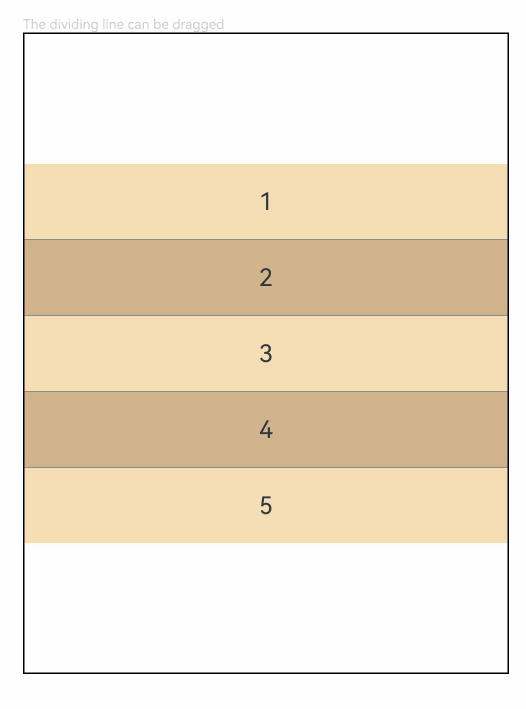

# ColumnSplit

将子组件纵向布局，并在每个子组件之间插入一根横向的分割线。

>  **说明：**
>
> 该组件从API Version 7开始支持。后续版本如有新增内容，则采用上角标单独标记该内容的起始版本。
## 子组件

可以包含子组件。

ColumnSplit通过分割线限制子组件的高度。初始化时，分割线位置根据子组件的高度来计算。初始化后，后续动态修改子组件的高度则不生效，分割线位置保持不变，子组件高度可以通过拖动相邻分割线进行改变。

初始化后，动态修改[margin](ts-universal-attributes-size.md#margin)、[border](ts-universal-attributes-border.md#border)、[padding](ts-universal-attributes-size.md#padding)通用属性导致子组件尺寸大于相邻分割线间距的异常情况下，不支持拖动分割线改变子组件的高度。
## 接口

ColumnSplit()

## 属性

### resizeable

resizeable(value: boolean)

设置分割线是否可拖拽。

**原子化服务API：** 从API version 11开始，该接口支持在原子化服务中使用。

**系统能力：** SystemCapability.ArkUI.ArkUI.Full

**参数：** 

| 参数名 | 类型    | 必填 | 说明                                 |
| ------ | ------- | ---- | ------------------------------------ |
| value  | boolean | 是   | 分割线是否可拖拽。<br/>默认值：false |

### divider<sup>10+</sup>

divider(value: ColumnSplitDividerStyle | null)

设置分割线的margin。

**原子化服务API：** 从API version 11开始，该接口支持在原子化服务中使用。

**系统能力：** SystemCapability.ArkUI.ArkUI.Full

**参数：** 

| 参数名 | 类型                                                         | 必填 | 说明                                                         |
| ------ | ------------------------------------------------------------ | ---- | ------------------------------------------------------------ |
| value  | [ColumnSplitDividerStyle](#columnsplitdividerstyle10对象说明)&nbsp;\|&nbsp;null | 是   | 分割线的margin。<br/>默认值：null，分割线上下margin为0。ColumnSplitDividerStyle设置分割线与上下子节点的距离。 |

## ColumnSplitDividerStyle<sup>10+</sup>对象说明

**原子化服务API：** 从API version 11开始，该接口支持在原子化服务中使用。

| 名称        | 参数类型      | 必填 | 描述                       |
| ----------- | ------------- | ---- |--------------------------|
| startMargin | [Dimension](ts-types.md#dimension10)       | 否   | 分割线与其上方子组件的距离。<br/>默认值：0 |
| endMargin   | [Dimension](ts-types.md#dimension10)       | 否   | 分割线与其下方子组件的距离。<br/>默认值：0 |

>  **说明：**
>
> 与[RowSplit](ts-container-rowsplit#RowSplit)相同，ColumnSplit的分割线可以改变上下两边子组件的高度，子组件可改变高度的范围取决于子组件的最大最小高度。
>
> 支持[clip](ts-universal-attributes-sharp-clipping.md#clip)、[margin](ts-universal-attributes-size.md#margin)等通用属性，clip不设置的时候默认值为true。


## 示例

```ts
// xxx.ets
@Entry
@Component
struct ColumnSplitExample {
  build() {
    Column(){
      Text('The secant line can be dragged').fontSize(9).fontColor(0xCCCCCC).width('90%')
      ColumnSplit() {
        Text('1').width('100%').height(50).backgroundColor(0xF5DEB3).textAlign(TextAlign.Center)
        Text('2').width('100%').height(50).backgroundColor(0xD2B48C).textAlign(TextAlign.Center)
        Text('3').width('100%').height(50).backgroundColor(0xF5DEB3).textAlign(TextAlign.Center)
        Text('4').width('100%').height(50).backgroundColor(0xD2B48C).textAlign(TextAlign.Center)
        Text('5').width('100%').height(50).backgroundColor(0xF5DEB3).textAlign(TextAlign.Center)
      }
      .borderWidth(1)
      .resizeable(true) // 可拖动
      .width('90%').height('60%')
    }.width('100%')
  }
}
```


