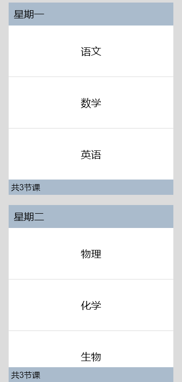

# ListItemGroup

该组件用来展示列表item分组，宽度默认充满[List](ts-container-list.md)组件，必须配合List组件来使用。

> **说明：**
>
> - 该组件从API Version 9开始支持。后续版本如有新增内容，则采用上角标单独标记该内容的起始版本。
> - 该组件的父组件只能是[List](ts-container-list.md)。
> - ListItemGroup组件不支持设置[通用属性aspectRatio](ts-universal-attributes-layout-constraints.md)。
> - 当ListItemGroup的父组件List的listDirection属性为Axis.Vertical时，设置[通用属性height](ts-universal-attributes-size.md)属性不生效。ListItemGroup的高度为header高度、footer高度和所有ListItem布局后总高度之和。
> - 当父组件List的listDirection属性为Axis.Horizontal时，设置[通用属性width](ts-universal-attributes-size.md)属性不生效。ListItemGroup的宽度为header宽度、footer宽度和所有ListItem布局后总宽度之和。
> - 当前ListItemGroup内部的ListItem组件不支持编辑、拖拽功能，即ListItem组件的editable属性不生效。
> - ListItemGroup使用direction属性设置布局方向不生效，ListItemGroup组件布局方向跟随父容器List组件的布局方向。

## 子组件

包含[ListItem](ts-container-listitem.md)子组件。


## 接口

ListItemGroup(options?: ListItemGroupOptions)

**原子化服务API：** 从API version 11开始，该接口支持在原子化服务中使用。

**系统能力：** SystemCapability.ArkUI.ArkUI.Full

**参数：**

| 参数名 | 类型 | 必填 | 说明 |
| -------- | -------- | -------- | -------- |
| options |  [ListItemGroupOptions](#listitemgroupoptions对象说明)| 否 | 列表item分组组件参数。 |

## ListItemGroupOptions对象说明

**原子化服务API：** 从API version 11开始，该接口支持在原子化服务中使用。

**系统能力：** SystemCapability.ArkUI.ArkUI.Full

| 名称              | 类型                                            | 必填 | 说明                                                     |
| ------------------- | --------------------------------------------------- | ---- | ------------------------------------------------------------ |
| header              | [CustomBuilder](ts-types.md#custombuilder8) &nbsp;   | 否   | 设置ListItemGroup头部组件。<br/>**说明：**<br/>可以放单个子组件或不放子组件。               |
| headerComponent<sup>13+</sup>              | [ComponentContent](../js-apis-arkui-ComponentContent.md)       | 否   | 使用ComponentContent类型参数设置ListItemGroup头部组件。<br/>**说明：**<br/>可以放单个子组件或不放子组件。 该参数的优先级高于参数header。即同时设置header和headerComponent时，以headerComponent设置的值为准。<br/>同一个headerComponent不推荐同时给不同的ListItemGroup使用,否则会导致显示问题。              |
| footer              | [CustomBuilder](ts-types.md#custombuilder8) &nbsp;     | 否   | 设置ListItemGroup尾部组件。<br/>**说明：**<br/>可以放单个子组件或不放子组件。               |
| footerComponent<sup>13+</sup>              | [ComponentContent](../js-apis-arkui-ComponentContent.md)       | 否   | 使用ComponentContent类型参数设置ListItemGroup尾部组件。<br/>**说明：**<br/>可以放单个子组件或不放子组件。该参数的优先级高于参数footer。 即同时设置footer和footerComponent时，以footerComponent设置的值为准。<br/>同一个footerComponent不推荐同时给不同的ListItemGroup使用,否则会导致显示问题。                           |
| space               | number&nbsp;\|&nbsp;string                          | 否   | 列表项间距。只作用于ListItem与ListItem之间，不作用于header与ListItem、footer与ListItem之间。<br/>默认值：0<br/>单位：vp  |
| style<sup>10+</sup> | [ListItemGroupStyle](#listitemgroupstyle10枚举说明) | 否   | 设置List组件卡片样式。<br/>默认值: ListItemGroupStyle.NONE<br/>设置为ListItemGroupStyle.NONE时无样式。<br/>设置为ListItemGroupStyle.CARD时，建议配合[ListItem](ts-container-listitem.md)的ListItemStyle.CARD同时使用，显示默认卡片样式。 <br/>卡片样式下，ListItemGroup默认规格：左右外边距12vp，上下左右内边距4vp。<br/>卡片样式下, 为卡片内的列表选项提供了默认的focus、hover、press、selected和disable样式。<br/>**说明：**<br/>当前卡片模式下，使用默认Axis.Vertical排列方向，如果listDirection属性设置为Axis.Horizontal，会导致显示混乱;List属性alignListItem默认为ListItemAlign.Center，居中对齐显示。 |

## 属性

### divider

divider(value: [ListDividerOptions](ts-container-list.md#listdivideroptions14对象说明) | null)

设置ListItem分割线样式，默认无分割线。

strokeWidth, startMargin和endMargin不支持设置百分比。

ListItem设置[多态样式](ts-universal-attributes-polymorphic-style.md)时，被按压的子组件上下的分割线不绘制。

**原子化服务API：** 从API version 11开始，该接口支持在原子化服务中使用。

**系统能力：** SystemCapability.ArkUI.ArkUI.Full

**参数：** 

| 参数名 | 类型                                                         | 必填 | 说明                                                         |
| ------ | ------------------------------------------------------------ | ---- | ------------------------------------------------------------ |
| value  | [ListDividerOptions](ts-container-list.md#listdivideroptions14对象说明)&nbsp;\|&nbsp;null | 是   | ListItem分割线样式。<br/> 默认值：null |

### childrenMainSize<sup>12+</sup>

childrenMainSize(value: ChildrenMainSize)

设置ListItemGroup组件的子组件在主轴方向的大小信息。

**原子化服务API：** 从API version 12开始，该接口支持在原子化服务中使用。

**系统能力：** SystemCapability.ArkUI.ArkUI.Full

**参数：** 

| 参数名     | 类型   | 必填 | 说明                            |
| ---------- | ------ | ---- | ------------------------------- |
| value | [ChildrenMainSize](ts-container-scrollable-common.md#childrenmainsize12对象说明) | 是   | 1.通过ChildrenMainSize对象向ListItemGroup组件准确提供所有ListItem在主轴方向的大小信息。<br/>2.提供的主轴方向大小必须与子组件实际在主轴方向的大小一致。<br/>3. 必须同时设置List的childrenMainSize属性使用。<br/>4.子组件主轴方向大小变化或者增删子组件时都必须通过ChildrenMainSize对象方法通知ListItemGroup组件。|

## ListItemGroupStyle<sup>10+</sup>枚举说明

**原子化服务API：** 从API version 11开始，该接口支持在原子化服务中使用。

**系统能力：** SystemCapability.ArkUI.ArkUI.Full

| 名称 | 值  | 说明             |
| ---- | ---- | ------------------ |
| NONE | 0 | 无样式。           |
| CARD | 1 | 显示默认卡片样式。 |


## 示例

### 示例1

该示例展示了ListItemGroup的header吸顶和footer吸底的效果。

```ts
// xxx.ets
@Entry
@Component
struct ListItemGroupExample {
  private timeTable: TimeTable[] = [
    {
      title: '星期一',
      projects: ['语文', '数学', '英语']
    },
    {
      title: '星期二',
      projects: ['物理', '化学', '生物']
    },
    {
      title: '星期三',
      projects: ['历史', '地理', '政治']
    },
    {
      title: '星期四',
      projects: ['美术', '音乐', '体育']
    }
  ]

  @Builder
  itemHead(text: string) {
    Text(text)
      .fontSize(20)
      .backgroundColor(0xAABBCC)
      .width("100%")
      .padding(10)
  }

  @Builder
  itemFoot(num: number) {
    Text('共' + num + "节课")
      .fontSize(16)
      .backgroundColor(0xAABBCC)
      .width("100%")
      .padding(5)
  }

  build() {
    Column() {
      List({ space: 20 }) {
        ForEach(this.timeTable, (item: TimeTable) => {
          ListItemGroup({ header: this.itemHead(item.title), footer: this.itemFoot(item.projects.length) }) {
            ForEach(item.projects, (project: string) => {
              ListItem() {
                Text(project)
                  .width("100%")
                  .height(100)
                  .fontSize(20)
                  .textAlign(TextAlign.Center)
                  .backgroundColor(0xFFFFFF)
              }
            }, (item: string) => item)
          }
          .divider({ strokeWidth: 1, color: Color.Blue }) // 每行之间的分界线
        })
      }
      .width('90%')
      .sticky(StickyStyle.Header | StickyStyle.Footer)
      .scrollBar(BarState.Off)
    }.width('100%').height('100%').backgroundColor(0xDCDCDC).padding({ top: 5 })
  }
}

interface TimeTable {
  title: string;
  projects: string[];
}
```



### 示例2

该示例展示了ListItemGroup的卡片样式效果。

```ts
// xxx.ets
@Entry
@Component
struct ListItemGroupExample2 {
  private arr: ArrObject[] = [
    {
      style: ListItemGroupStyle.CARD,
      itemStyles: [ListItemStyle.CARD, ListItemStyle.CARD, ListItemStyle.CARD]
    },
    {
      style: ListItemGroupStyle.CARD,
      itemStyles: [ListItemStyle.CARD, ListItemStyle.CARD, ListItemStyle.NONE]
    },
    {
      style: ListItemGroupStyle.CARD,
      itemStyles: [ListItemStyle.CARD, ListItemStyle.NONE, ListItemStyle.CARD]
    },
    {
      style: ListItemGroupStyle.NONE,
      itemStyles: [ListItemStyle.CARD, ListItemStyle.CARD, ListItemStyle.NONE]
    }
  ]

  build() {
    Column() {
      List({ space: "4vp", initialIndex: 0 }) {
        ForEach(this.arr, (item: ArrObject, index?: number) => {
          ListItemGroup({ style: item.style }) {
            ForEach(item.itemStyles, (itemStyle: number, itemIndex?: number) => {
              ListItem({ style: itemStyle }) {
                if (index != undefined && itemIndex != undefined) {
                  Text("第" + (index + 1) + "个Group中第" + (itemIndex + 1) + "个item")
                    .width("100%")
                    .textAlign(TextAlign.Center)
                }
              }
            }, (item: string) => item)
          }
        })
      }
      .width('100%')
      .multiSelectable(true)
      .backgroundColor(0xDCDCDC)
    }
    .width('100%')
    .padding({ top: 5 })
  }
}

interface ArrObject {
  style: number;
  itemStyles: number[];
}
```


### 示例3

该示例通过ComponentContent设置Header/Footer。

```ts
// xxx.ets
import { ComponentContent } from '@kit.ArkUI';

interface TimeTable {
  title: string;
  projects: string[];
}

class HeadBuilderParams {
  text: string | Resource;
  constructor(text: string | Resource) {
    this.text = text;
  }
}

class FootBuilderParams {
  num: number | Resource;
  constructor(num: number | Resource) {
    this.num = num;
  }
}

@Builder
function itemHead(params: HeadBuilderParams) {
  Text(params.text)
    .fontSize(20)
    .height('48vp')
    .width("100%")
    .padding(10)
    .backgroundColor($r('sys.color.background_tertiary'))
}

@Builder
function itemFoot(params: FootBuilderParams) {
  Text('共' + params.num + '节课')
    .fontSize(20)
    .height('48vp')
    .width("100%")
    .padding(10)
    .backgroundColor($r('sys.color.background_tertiary'))
}

@Component
struct MyItemGroup {
  item: TimeTable = { title: "", projects: [] }
  header?: ComponentContent<HeadBuilderParams> = undefined
  footer?: ComponentContent<FootBuilderParams> = undefined
  headerParam = new HeadBuilderParams(this.item.title)
  footerParam = new FootBuilderParams(this.item.projects.length)

  aboutToAppear(): void {
    this.header = new ComponentContent(this.getUIContext(), wrapBuilder(itemHead), this.headerParam)
    this.footer = new ComponentContent(this.getUIContext(), wrapBuilder(itemFoot), this.footerParam)
  }
  GetHeader() {
    this.header?.update(new HeadBuilderParams(this.item.title));
    return this.header;
  }

  GetFooter() {
    this.footer?.update(new FootBuilderParams(this.item.projects.length));
    return this.footer;
  }

  build() {
    ListItemGroup({
      headerComponent: this.GetHeader(),
      footerComponent: this.GetFooter()
    }) {
      ForEach(this.item.projects, (project: string) => {
        ListItem() {
          Text(project)
            .width("100%")
            .height(100)
            .fontSize(20)
            .textAlign(TextAlign.Center)
        }
      }, (item: string) => item)
    }
    .divider({ strokeWidth: 1, color: Color.Blue }) // 每行之间的分界线
  }
}

@Entry
@Component
struct ListItemGroupExample {
  @State timeTable: TimeTable[] = [
    {
      title: '星期一',
      projects: ['语文', '数学', '英语']
    },
    {
      title: '星期二',
      projects: ['物理', '化学', '生物']
    },
    {
      title: '星期三',
      projects: ['历史', '地理', '政治', '体育']
    },
    {
      title: '星期四',
      projects: ['美术', '音乐']
    }
  ]

  build() {
    Column() {
      Button("update").width(100).height(50).onClick(() => {
        this.timeTable[0] = {
          title: '更新后的星期一',
          projects: ['语文', '物理', '历史', '美术']
        }
      })
      List({ space: 20 }) {
        ForEach(this.timeTable, (item: TimeTable) => {
          MyItemGroup({ item: item })
        })
      }
      .layoutWeight(1)
      .sticky(StickyStyle.Header | StickyStyle.Footer)
      .scrollBar(BarState.Off)
    }
    .backgroundColor($r('sys.color.background_primary'))
  }
}
```

