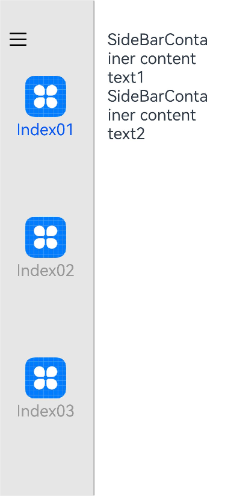

# SideBarContainer

提供侧边栏可以显示和隐藏的侧边栏容器，通过子组件定义侧边栏和内容区，第一个子组件表示侧边栏，第二个子组件表示内容区。

>  **说明：**
>
>  该组件从API Version 8开始支持。后续版本如有新增内容，则采用上角标单独标记该内容的起始版本。


## 子组件

可以包含子组件。

>  **说明：**
>
>  - 子组件类型：系统组件和自定义组件，不支持渲染控制类型（[if/else](../../../quick-start/arkts-rendering-control-ifelse.md)、[ForEach](../../../quick-start/arkts-rendering-control-foreach.md)和[LazyForEach](../../../quick-start/arkts-rendering-control-lazyforeach.md)）。
>  - 子组件个数：必须且仅包含2个子组件。
>  - 子组件个数异常时：3个或以上子组件，显示第一个和第二个。1个子组件，显示侧边栏，内容区为空白。


## 接口

SideBarContainer( type?: SideBarContainerType )

**元服务API：** 从API version 11开始，该接口支持在元服务中使用。

**参数：**

| 参数名 | 参数类型 | 必填 | 参数描述 |
| -------- | -------- | -------- | -------- |
| type | [SideBarContainerType](#sidebarcontainertype枚举说明) | 否 | 设置侧边栏的显示类型。<br/>默认值：SideBarContainerType.Embed |

## SideBarContainerType枚举说明

**元服务API：** 从API version 11开始，该接口支持在元服务中使用。

| 名称 | 描述 |
| -------- | -------- |
| Embed | 侧边栏嵌入到组件内，和内容区并列显示。<br/>组件尺寸小于minContentWidth + minSideBarWidth,并且未设置showSideBar时，侧边栏自动隐藏。<br/>未设置minSideBarWidth或者minContentWidth采用未设置接口的默认值进行计算。<br/> 组件在自动隐藏后，如果通过点击控制按钮唤出侧边栏，则侧边栏悬浮在内容区上显示。|
| Overlay | 侧边栏浮在内容区上面。 |
| AUTO<sup>10+</sup> | 组件尺寸大于等于minSideBarWidth+minContentWidth时，采用Embed模式显示。<br/>组件尺寸小于minSideBarWidth+minContentWidth时，采用Overlay模式显示。<br/>未设置minSideBarWidth或minContentWidth时，会使用未设置接口的默认值进行计算，若计算的值小于600vp，则使用600vp做为模式切换的断点值。|

## 属性

除支持[通用属性](ts-universal-attributes-size.md)外，还支持以下属性：

### showSideBar

showSideBar(value: boolean)

设置是否显示侧边栏。

从API version 10开始，该属性支持[$$](../../../quick-start/arkts-two-way-sync.md)双向绑定变量。

**元服务API：** 从API version 11开始，该接口支持在元服务中使用。

**系统能力：** SystemCapability.ArkUI.ArkUI.Full

**参数：** 

| 参数名 | 类型    | 必填 | 说明                                                         |
| ------ | ------- | ---- | ------------------------------------------------------------ |
| value  | boolean | 是   | 是否显示侧边栏。<br/>true：显示侧边栏<br/>false：不显示侧边栏<br/>默认值：true |

### controlButton

controlButton(value: ButtonStyle)

设置侧边栏控制按钮的属性。

**元服务API：** 从API version 11开始，该接口支持在元服务中使用。

**系统能力：** SystemCapability.ArkUI.ArkUI.Full

**参数：** 

| 参数名 | 类型                                | 必填 | 说明                   |
| ------ | ----------------------------------- | ---- | ---------------------- |
| value  | [ButtonStyle](#buttonstyle对象说明) | 是   | 侧边栏控制按钮的属性。 |

### showControlButton

showControlButton(value: boolean)

设置是否显示控制按钮。

**元服务API：** 从API version 11开始，该接口支持在元服务中使用。

**系统能力：** SystemCapability.ArkUI.ArkUI.Full

**参数：** 

| 参数名 | 类型    | 必填 | 说明                                                         |
| ------ | ------- | ---- | ------------------------------------------------------------ |
| value  | boolean | 是   | 是否显示控制按钮。<br/>true：显示控制按钮<br/>false：不显示控制按钮<br/>默认值：true |

### sideBarWidth

sideBarWidth(value: number&nbsp;|&nbsp;Length)

设置侧边栏的宽度。设置为小于0的值时按默认值显示。受最小宽度和最大宽度限制，不在限制区域内取最近的点。

**元服务API：** 从API version 11开始，该接口支持在元服务中使用。

**系统能力：** SystemCapability.ArkUI.ArkUI.Full

**参数：** 

| 参数名 | 类型                                                         | 必填 | 说明                                                         |
| ------ | ------------------------------------------------------------ | ---- | ------------------------------------------------------------ |
| value  | number&nbsp;\|&nbsp;[Length](ts-types.md#length)<sup>9+</sup> | 是   | 侧边栏的宽度。<br/>默认值：240vp<br/>单位：vp<br/>**说明：** <br/>API version 9及以下版本默认值为200vp，API version 10的默认值为240vp。 |

### minSideBarWidth

minSideBarWidth(value: number&nbsp;|&nbsp;Length)

设置侧边栏最小宽度。设置为小于0的值时按默认值显示。值不能超过侧边栏容器本身宽度，超过使用侧边栏容器本身宽度。

minSideBarWidth优先于侧边栏子组件minWidth，minSideBarWidth未设置时默认值优先级高于侧边栏子组件minWidth。

**元服务API：** 从API version 11开始，该接口支持在元服务中使用。

**系统能力：** SystemCapability.ArkUI.ArkUI.Full

**参数：** 

| 参数名 | 类型                                                         | 必填 | 说明                                                         |
| ------ | ------------------------------------------------------------ | ---- | ------------------------------------------------------------ |
| value  | number&nbsp;\|&nbsp;[Length](ts-types.md#length)<sup>9+</sup> | 是   | 侧边栏最小宽度。<br/>默认值：240vp<br/>单位：vp<br/>**说明：** <br/>API version 9及以下版本默认值为200vp，API version 10的默认值为240vp。 |

### maxSideBarWidth

maxSideBarWidth(value: number&nbsp;|&nbsp;Length)

设置侧边栏最小宽度。设置为小于0的值时按默认值显示。值不能超过侧边栏容器本身宽度，超过使用侧边栏容器本身宽度。

maxSideBarWidth优先于侧边栏子组件maxWidth，maxSideBarWidth未设置时默认值优先级高于侧边栏子组件maxWidth。

**元服务API：** 从API version 11开始，该接口支持在元服务中使用。

**系统能力：** SystemCapability.ArkUI.ArkUI.Full

**参数：** 

| 参数名 | 类型                                                         | 必填 | 说明                                                |
| ------ | ------------------------------------------------------------ | ---- | --------------------------------------------------- |
| value  | number&nbsp;\|&nbsp;[Length](ts-types.md#length)<sup>9+</sup> | 是   | 设置侧边栏最大宽度。<br/>默认值：280vp<br/>单位：vp |

### autoHide<sup>9+</sup>

autoHide(value: boolean)

设置当侧边栏拖拽到小于最小宽度后，是否自动隐藏。受minSideBarWidth属性方法影响，minSideBarWidth属性方法未设置值使用默认值。

拖拽过程中判断是否要自动隐藏。小于最小宽度时需要阻尼效果触发隐藏（越界一段距离）。

**元服务API：** 从API version 11开始，该接口支持在元服务中使用。

**系统能力：** SystemCapability.ArkUI.ArkUI.Full

**参数：** 

| 参数名 | 类型    | 必填 | 说明                                                         |
| ------ | ------- | ---- | ------------------------------------------------------------ |
| value  | boolean | 是   | 侧边栏拖拽到小于最小宽度后，是否自动隐藏。<br/>true：会自动隐藏<br/>false：不会自动隐藏<br/>默认值：true |

### sideBarPosition<sup>9+</sup>

sideBarPosition(value: SideBarPosition)

设置侧边栏显示位置。

**元服务API：** 从API version 11开始，该接口支持在元服务中使用。

**系统能力：** SystemCapability.ArkUI.ArkUI.Full

**参数：** 

| 参数名 | 类型                                         | 必填 | 说明                                               |
| ------ | -------------------------------------------- | ---- | -------------------------------------------------- |
| value  | [SideBarPosition](#sidebarposition9枚举说明) | 是   | 侧边栏显示位置。<br/>默认值：SideBarPosition.Start |

### divider<sup>10+</sup>

divider(value: DividerStyle | null)

设置分割线的样式。

**元服务API：** 从API version 11开始，该接口支持在元服务中使用。

**系统能力：** SystemCapability.ArkUI.ArkUI.Full

**参数：** 

| 参数名 | 类型                                                      | 必填 | 说明                                                         |
| ------ | --------------------------------------------------------- | ---- | ------------------------------------------------------------ |
| value  | [DividerStyle](#dividerstyle10对象说明)&nbsp;\|&nbsp;null | 是   | 分割线的样式。<br/>默认为DividerStyle：显示分割线。<br/>- null：不显示分割线。 |

### minContentWidth<sup>10+</sup>

minContentWidth(value: Dimension)

设置SideBarContainer组件内容区可显示的最小宽度。

设置为小于0，内容区显示的最小宽度为360vp，未设置该属性时，组件内容区的可缩小到0。

Embed场景下，增大组件尺寸时仅增大内容区的尺寸。

缩小组件尺寸时，先缩小内容区的尺寸至minContentWidth。继续缩小组件尺寸时，保持内容区宽度minContentWidth不变，优先缩小侧边栏的尺寸。

当缩小侧边栏的尺寸至minSideBarWidth后，继续缩小组件尺寸时，

- 如果autoHide属性为false，则会保持侧边栏宽度minSideBarWidth和内容区宽度minContentWidth不变，但内容区会被截断显示；
- 如果autoHide属性为true，则会优先隐藏侧边栏，然后继续缩小至内容区宽度minContentWidth后，内容区宽度保持不变，但内容区会被截断显示。

minContentWidth优先于侧边栏的maxSideBarWidth与sideBarWidth属性，minContentWidth未设置时默认值优先级低于设置的minSideBarWidth与maxSideBarWidth属性。

**元服务API：** 从API version 11开始，该接口支持在元服务中使用。

**系统能力：** SystemCapability.ArkUI.ArkUI.Full

**参数：** 

| 参数名 | 类型                                 | 必填 | 说明                                                         |
| ------ | ------------------------------------ | ---- | ------------------------------------------------------------ |
| value  | [Dimension](ts-types.md#dimension10) | 是   | SideBarContainer组件内容区可显示的最小宽度。<br/>默认值：360vp<br/>单位：vp |

## ButtonStyle对象说明

**元服务API：** 从API version 11开始，该接口支持在元服务中使用。

| 名称 | 参数类型 | 必填 | 描述 |
| -------- | -------- | -------- | -------- |
| left | number | 否 | 设置侧边栏控制按钮距离容器左界限的间距。<br/>默认值：16vp<br>单位：vp |
| top | number | 否 | 设置侧边栏控制按钮距离容器上界限的间距。<br/>默认值：48vp<br/>单位：vp |
| width | number | 否 | 设置侧边栏控制按钮的宽度。<br/>默认值：<br/>API version 9及之前版本：32vp<br/>从API version 10开始：24vp<br/>单位：vp |
| height | number | 否 | 设置侧边栏控制按钮的高度。<br/>默认值：<br/>API version 9及之前版本：32vp<br/>从API version 10开始：24vp<br/>单位：vp |
| icons | {<br/>shown:&nbsp;string \| PixelMap \| [Resource](ts-types.md) ,<br/>hidden:&nbsp;string \| PixelMap \| [Resource](ts-types.md) ,<br/>switching?:&nbsp;string \| PixelMap \| [Resource](ts-types.md) <br/>} | 否 | 设置侧边栏控制按钮的图标：<br/> </p> - shown: 设置侧边栏显示时控制按钮的图标。<br>**说明：** <br>资源获取错误时，使用默认图标。<br/>- hidden: 设置侧边栏隐藏时控制按钮的图标。<br>- switching:设置侧边栏显示和隐藏状态切换时控制按钮的图标。 |

## SideBarPosition<sup>9+</sup>枚举说明

**元服务API：** 从API version 11开始，该接口支持在元服务中使用。

| 名称 | 描述 |
| -------- | -------- |
| Start | 侧边栏位于容器左侧。 |
| End | 侧边栏位于容器右侧。 |

## DividerStyle<sup>10+</sup>对象说明

**元服务API：** 从API version 11开始，该接口支持在元服务中使用。

| 名称        | 参数类型      | 必填 | 描述                                     |
| ----------- | ------------- | ---- | ---------------------------------------- |
| strokeWidth | [Length](ts-types.md#length)        | 是   | 分割线的线宽。<br/>默认值：1vp |
| color       | [ResourceColor](ts-types.md#resourcecolor) | 否   | 分割线的颜色。<br/>默认值：#000000，3%   |
| startMargin | [Length](ts-types.md#length)        | 否   | 分割线与侧边栏顶端的距离。<br/>默认值：0 |
| endMargin   | [Length](ts-types.md#length)        | 否   | 分割线与侧边栏底端的距离。<br/>默认值：0 |
>  **说明：** 
>
>  针对侧边栏子组件设置[通用属性宽高](ts-universal-attributes-size.md)时，宽高都不生效。
>  针对侧边栏内容区设置[通用属性宽高](ts-universal-attributes-size.md)时，宽高都不生效，默认占满SideBarContainer的剩余空间。
>
>  当showSideBar属性未设置时，依据组件大小进行自动显示：
>
>  - 小于minSideBarWidth + minContentWidth：默认不显示侧边栏。
>  - 大于等于minSideBarWidth + minContentWidth：默认显示侧边栏。

## 事件

除支持[通用事件](ts-universal-events-click.md)外，还支持以下事件：

### onChange

onChange(callback: (value: boolean) =&gt; void)

当侧边栏的状态在显示和隐藏之间切换时触发回调。

触发该事件的条件：

1、showSideBar属性值变换时；

2、showSideBar属性自适应行为变化时；

3、分割线拖拽触发autoHide时。

**元服务API：** 从API version 11开始，该接口支持在元服务中使用。

**系统能力：** SystemCapability.ArkUI.ArkUI.Full

**参数：** 

| 参数名 | 类型    | 必填 | 说明                          |
| ------ | ------- | ---- | ----------------------------- |
| value  | boolean | 是   | true表示显示，false表示隐藏。 |


## 示例

```ts
// xxx.ets
@Entry
@Component
struct SideBarContainerExample {
  normalIcon: Resource = $r("app.media.icon")
  selectedIcon: Resource = $r("app.media.icon")
  @State arr: number[] = [1, 2, 3]
  @State current: number = 1

  build() {
    SideBarContainer(SideBarContainerType.Embed) {
      Column() {
        ForEach(this.arr, (item: number) => {
          Column({ space: 5 }) {
            Image(this.current === item ? this.selectedIcon : this.normalIcon).width(64).height(64)
            Text("Index0" + item)
              .fontSize(25)
              .fontColor(this.current === item ? '#0A59F7' : '#999')
              .fontFamily('source-sans-pro,cursive,sans-serif')
          }
          .onClick(() => {
            this.current = item
          })
        }, (item: string) => item)
      }.width('100%')
      .justifyContent(FlexAlign.SpaceEvenly)
      .backgroundColor('#19000000')

      Column() {
        Text('SideBarContainer content text1').fontSize(25)
        Text('SideBarContainer content text2').fontSize(25)
      }
      .margin({ top: 50, left: 20, right: 30 })
    }
    .controlButton({
      icons: {
        hidden: $r('app.media.drawer'),
        shown: $r('app.media.drawer'),
        switching: $r('app.media.drawer')
      }
    })
    .sideBarWidth(150)
    .minSideBarWidth(50)
    .maxSideBarWidth(300)
    .minContentWidth(0)
    .onChange((value: boolean) => {
      console.info('status:' + value)
    })
    .divider({ strokeWidth: '1vp', color: Color.Gray, startMargin: '4vp', endMargin: '4vp' })
  }
}
```


