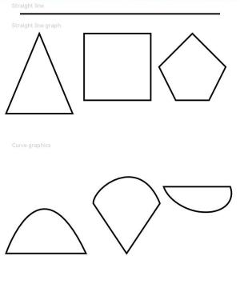
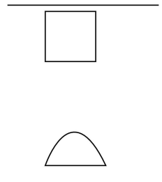
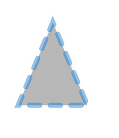

# Path

路径绘制组件，根据绘制路径生成封闭的自定义形状。

> **说明：**
>
> 该组件从API version 7开始支持。后续版本如有新增内容，则采用上角标单独标记该内容的起始版本。
>
> 该组件从API version 20开始支持使用[AttributeUpdater](../js-apis-arkui-AttributeUpdater.md)类的[updateConstructorParams](../js-apis-arkui-AttributeUpdater.md#updateconstructorparams)接口更新构造参数。


## 子组件

无

## 接口

Path(options?: PathOptions)

**卡片能力：** 从API version 9开始，该接口支持在ArkTS卡片中使用。

**原子化服务API：** 从API version 11开始，该接口支持在原子化服务中使用。

**系统能力：** SystemCapability.ArkUI.ArkUI.Full

**参数:**

| 参数名                                             | 类型         | 必填 | 说明                   |
| ------ | ---------------- | ---- | ------------------------------------------------------------ |
| options  | [PathOptions](ts-drawing-components-path.md#pathoptions18对象说明) | 否   | Path绘制区域。|

## PathOptions<sup>18+</sup>对象说明
用于描述Path绘制区域。

> **说明：**
>
> 为规范匿名对象的定义，API 18版本修改了此处的元素定义。其中，保留了历史匿名对象的起始版本信息，会出现外层元素@since版本号高于内层元素版本号的情况，但这不影响接口的使用。

**卡片能力：** 从API version 18开始，该接口支持在ArkTS卡片中使用。

**原子化服务API：** 从API version 18开始，该接口支持在原子化服务中使用。

**系统能力：** SystemCapability.ArkUI.ArkUI.Full

| 名称 | 类型 | 必填 | 说明 |
| -------- | -------- | -------- | -------- |
| width<sup>7+</sup> | [Length](ts-types.md#length) | 否 | 路径所在矩形的宽度。<br/>值为异常值或缺省时按照自身内容需要的宽度处理。<br/>默认单位：vp |
| height<sup>7+</sup> | [Length](ts-types.md#length) | 否 | 路径所在矩形的高度。<br/>值为异常值或缺省时按照自身内容需要的高度处理。<br/>默认单位：vp |
| [commands<sup>7+</sup>](ts-drawing-components-path.md#commands) | [ResourceStr](ts-types.md#resourcestr)  | 否 | 路径绘制的命令字符串。<br/>值为异常值或缺省时按照自身内容需要的宽高处理。默认值：空字符串<br/>异常值按照默认值处理。 |

## 属性

除支持[通用属性](ts-component-general-attributes.md)外，还支持以下属性：

### commands

commands(value: [ResourceStr](ts-types.md#resourcestr))

设置符合[SVG路径描述规范](ts-drawing-components-path.md#svg路径描述规范)的命令字符串，单位为px。像素单位转换方法请参考[像素单位转换](ts-pixel-units.md)。

**卡片能力：** 从API version 9开始，该接口支持在ArkTS卡片中使用。

**原子化服务API：** 从API version 11开始，该接口支持在原子化服务中使用。

**系统能力：** SystemCapability.ArkUI.ArkUI.Full

**参数：** 

| 参数名 | 类型   | 必填 | 说明                          |
| ------ | ------ | ---- | ----------------------------- |
| value  | [ResourceStr](ts-types.md#resourcestr) | 是   | 线条绘制的路径。<br/>默认值：空字符串<br/>默认单位：px |

### fill

fill(value: ResourceColor)

设置填充区域的颜色，支持[attributeModifier](ts-universal-attributes-attribute-modifier.md#attributemodifier)动态设置属性方法，异常值按照默认值处理。与通用属性foregroundColor同时设置时，后设置的属性生效。

**卡片能力：** 从API version 9开始，该接口支持在ArkTS卡片中使用。

**原子化服务API：** 从API version 11开始，该接口支持在原子化服务中使用。

**系统能力：** SystemCapability.ArkUI.ArkUI.Full

**参数：** 

| 参数名 | 类型                                       | 必填 | 说明                                   |
| ------ | ------------------------------------------ | ---- | -------------------------------------- |
| value  | [ResourceColor](ts-types.md#resourcecolor) | 是   | 填充区域颜色。<br/>默认值：Color.Black |

### fillOpacity

fillOpacity(value: number | string | Resource)

设置填充区域透明度，支持[attributeModifier](ts-universal-attributes-attribute-modifier.md#attributemodifier)动态设置属性方法。

**卡片能力：** 从API version 9开始，该接口支持在ArkTS卡片中使用。

**原子化服务API：** 从API version 11开始，该接口支持在原子化服务中使用。

**系统能力：** SystemCapability.ArkUI.ArkUI.Full

**参数：** 

| 参数名 | 类型                                                         | 必填 | 说明                           |
| ------ | ------------------------------------------------------------ | ---- | ------------------------------ |
| value  | number&nbsp;\|&nbsp;string&nbsp;\|&nbsp;[Resource](ts-types.md#resource) | 是   | 填充区域透明度。<br/>**说明：**<br/>number格式取值范围是[0.0, 1.0]，若给定值小于0.0，则取值为0.0；若给定值大于1.0，则取值为1.0，其余异常值按1.0处理。<br/>string格式支持number格式取值的字符串形式，取值范围与number格式相同。<br/>Resource格式支持系统资源或者应用资源中的字符串，取值范围和number格式相同。<br/>默认值：1 |

### stroke

stroke(value: ResourceColor)

设置边框颜色，支持[attributeModifier](ts-universal-attributes-attribute-modifier.md#attributemodifier)动态设置属性方法，不设置时，默认边框颜色为不透明的黑色。异常值不会绘制边框线条。

**卡片能力：** 从API version 9开始，该接口支持在ArkTS卡片中使用。

**原子化服务API：** 从API version 11开始，该接口支持在原子化服务中使用。

**系统能力：** SystemCapability.ArkUI.ArkUI.Full

**参数：** 

| 参数名 | 类型                                       | 必填 | 说明       |
| ------ | ------------------------------------------ | ---- | ---------- |
| value  | [ResourceColor](ts-types.md#resourcecolor) | 是   | 边框颜色。 |

### strokeDashArray

strokeDashArray(value: Array&lt;any&gt;)

设置线条间隙，支持[attributeModifier](ts-universal-attributes-attribute-modifier.md#attributemodifier)动态设置属性方法。线段相交时可能会出现重叠现象。取值范围≥0，异常值按照默认值处理。

**卡片能力：** 从API version 9开始，该接口支持在ArkTS卡片中使用。

**原子化服务API：** 从API version 11开始，该接口支持在原子化服务中使用。

**系统能力：** SystemCapability.ArkUI.ArkUI.Full

**参数：** 

| 参数名 | 类型             | 必填 | 说明                      |
| ------ | ---------------- | ---- | ------------------------- |
| value  | Array&lt;any&gt; | 是   | 线条间隙。<br/>默认值：[]（空数组）<br/>默认单位：vp |

### strokeDashOffset

strokeDashOffset(value: number | string)

设置线条绘制起点的偏移量，支持[attributeModifier](ts-universal-attributes-attribute-modifier.md#attributemodifier)动态设置属性方法。异常值按照默认值处理。

**卡片能力：** 从API version 9开始，该接口支持在ArkTS卡片中使用。

**原子化服务API：** 从API version 11开始，该接口支持在原子化服务中使用。

**系统能力：** SystemCapability.ArkUI.ArkUI.Full

**参数：** 

| 参数名 | 类型                       | 必填 | 说明                                 |
| ------ | -------------------------- | ---- | ------------------------------------ |
| value  | number&nbsp;\|&nbsp;string | 是   | 线条绘制起点的偏移量。<br/>默认值：0<br/>默认单位：vp |

### strokeLineCap

strokeLineCap(value: LineCapStyle)

设置线条端点绘制样式，支持[attributeModifier](ts-universal-attributes-attribute-modifier.md#attributemodifier)动态设置属性方法。

**卡片能力：** 从API version 9开始，该接口支持在ArkTS卡片中使用。

**原子化服务API：** 从API version 11开始，该接口支持在原子化服务中使用。

**系统能力：** SystemCapability.ArkUI.ArkUI.Full

**参数：** 

| 参数名 | 类型                                              | 必填 | 说明                                             |
| ------ | ------------------------------------------------- | ---- | ------------------------------------------------ |
| value  | [LineCapStyle](ts-appendix-enums.md#linecapstyle) | 是   | 线条端点绘制样式。<br/>默认值：LineCapStyle.Butt |

### strokeLineJoin

strokeLineJoin(value: LineJoinStyle)

设置线条拐角绘制样式，支持[attributeModifier](ts-universal-attributes-attribute-modifier.md#attributemodifier)动态设置属性方法。

**卡片能力：** 从API version 9开始，该接口支持在ArkTS卡片中使用。

**原子化服务API：** 从API version 11开始，该接口支持在原子化服务中使用。

**系统能力：** SystemCapability.ArkUI.ArkUI.Full

**参数：** 

| 参数名 | 类型                                                | 必填 | 说明                                               |
| ------ | --------------------------------------------------- | ---- | -------------------------------------------------- |
| value  | [LineJoinStyle](ts-appendix-enums.md#linejoinstyle) | 是   | 线条拐角绘制样式。<br/>默认值：LineJoinStyle.Miter |

### strokeMiterLimit

strokeMiterLimit(value: number | string)

设置斜接长度与边框宽度比值的极限值，支持[attributeModifier](ts-universal-attributes-attribute-modifier.md#attributemodifier)动态设置属性方法。斜接长度表示外边框外边交点到内边交点的距离，边框宽度即strokeWidth属性的值。该属性取值需在strokeLineJoin属性取值LineJoinStyle.Miter时生效。

该属性的合法值范围应当大于等于1.0，当取值范围在[0,1)时按1.0处理，其余异常值按默认值处理。

**卡片能力：** 从API version 9开始，该接口支持在ArkTS卡片中使用。

**原子化服务API：** 从API version 11开始，该接口支持在原子化服务中使用。

**系统能力：** SystemCapability.ArkUI.ArkUI.Full

**参数：** 

| 参数名 | 类型                       | 必填 | 说明                                           |
| ------ | -------------------------- | ---- | ---------------------------------------------- |
| value  | number&nbsp;\|&nbsp;string | 是   | 斜接长度与边框宽度比值的极限值。<br/>默认值：4 |

### strokeOpacity

strokeOpacity(value: number | string | Resource)

设置线条透明度，支持[attributeModifier](ts-universal-attributes-attribute-modifier.md#attributemodifier)动态设置属性方法。该属性的取值范围是[0.0, 1.0]，若给定值小于0.0，则取值为0.0；若给定值大于1.0，则取值为1.0，其余异常值按1.0处理 。

**卡片能力：** 从API version 9开始，该接口支持在ArkTS卡片中使用。

**原子化服务API：** 从API version 11开始，该接口支持在原子化服务中使用。

**系统能力：** SystemCapability.ArkUI.ArkUI.Full

**参数：** 

| 参数名 | 类型                                                         | 必填 | 说明                       |
| ------ | ------------------------------------------------------------ | ---- | -------------------------- |
| value  | number&nbsp;\|&nbsp;string&nbsp;\|&nbsp;[Resource](ts-types.md#resource) | 是   | 线条透明度。<br/>默认值：1 |

### strokeWidth

strokeWidth(value: Length)

设置线条宽度，支持[attributeModifier](ts-universal-attributes-attribute-modifier.md#attributemodifier)动态设置属性方法。该属性若为string类型, 暂不支持百分比，百分比按照1px处理。

**卡片能力：** 从API version 9开始，该接口支持在ArkTS卡片中使用。

**原子化服务API：** 从API version 11开始，该接口支持在原子化服务中使用。

**系统能力：** SystemCapability.ArkUI.ArkUI.Full

**参数：** 

| 参数名 | 类型                         | 必填 | 说明                     |
| ------ | ---------------------------- | ---- | ------------------------ |
| value  | [Length](ts-types.md#length) | 是   | 线条宽度，取值范围≥0。<br/>默认值：1<br/>默认单位：vp<br/>异常值按照默认值处理。 |

### antiAlias

antiAlias(value: boolean)

设置是否开启抗锯齿效果，支持[attributeModifier](ts-universal-attributes-attribute-modifier.md#attributemodifier)动态设置属性方法。

**卡片能力：** 从API version 9开始，该接口支持在ArkTS卡片中使用。

**原子化服务API：** 从API version 11开始，该接口支持在原子化服务中使用。

**系统能力：** SystemCapability.ArkUI.ArkUI.Full

**参数：** 

| 参数名 | 类型    | 必填 | 说明                                  |
| ------ | ------- | ---- | ------------------------------------- |
| value  | boolean | 是   | 是否开启抗锯齿效果。<br/>true：开启抗锯齿；false：关闭抗锯齿。<br/>默认值：true |

## SVG路径描述规范

SVG路径描述规范支持的命令如下：

| 命令   | 名称                               | 参数                                       | 说明                                       |
| ---- | -------------------------------- | ---------------------------------------- | ---------------------------------------- |
| M    | moveto                           | （x y）                                    | 在给定的 (x, y) 坐标处开始一个新的子路径。例如，`M 0 0` 表示将（0, 0）点作为新子路径的起始点。 |
| L    | lineto                           | （x y）                                    | 从当前点到给定的 (x, y) 坐标画一条线，该坐标成为新的当前点。例如，`L 50 50` 表示绘制当前点到（50, 50）点的直线，并将（50, 50）点作为新子路径的起始点。 |
| H    | horizontal lineto                | x                                        | 从当前点绘制一条水平线到给定的x坐标，等效于将y坐标指定为当前点y坐标的L命令。例如，当前点为(100, 100)，`H 50 ` 表示绘制当前点到（50, 100）点的直线，并将（50, 100）点作为新子路径的起始点。 |
| V    | vertical lineto                  | y                                        | 从当前点绘制一条垂直线到给定的y坐标，等效于将x坐标指定为当前点x坐标的L命令。例如，当前点为(100, 100)，`V 50 ` 表示绘制当前点到（100, 50）点的直线，并将（100, 50）点作为新子路径的起始点。 |
| C    | curveto                          | (x1 y1 x2 y2 x y)                        | 使用 (x1, y1) 作为曲线起点的控制点， (x2, y2) 作为曲线终点的控制点，从当前点到 (x, y) 绘制三次贝塞尔曲线。例如，`C100 100 250 100 250 200 ` 表示绘制当前点到（250, 200）点的三次贝塞尔曲线，并将（250, 200）点作为新子路径的起始点。 |
| S    | smooth curveto                   | (x2 y2 x y)                              | (x2, y2) 作为曲线终点的控制点，绘制从当前点到 (x, y) 绘制三次贝塞尔曲线。若前一个命令是C或S，则起点控制点是上一个命令的终点控制点相对于起点的映射。 例如，`C100 100 250 100 250 200 S400 300 400 200`第二段贝塞尔曲线的起点控制点为（250, 300）。如果没有前一个命令或者前一个命令不是 C或S，则第一个控制点与当前点重合。 |
| Q    | quadratic Belzier curve          | (x1 y1 x y)                              | 使用 (x1, y1) 作为控制点，从当前点到 (x, y) 绘制二次贝塞尔曲线。例如，`Q400 50 600 300 ` 表示绘制当前点到（600, 300）点的二次贝塞尔曲线，并将（600, 300）点作为新子路径的起始点。 |
| T    | smooth quadratic Belzier curveto | (x y)                                    | 绘制从当前点到 (x, y) 绘制二次贝塞尔曲线。若前一个命令是Q或T，则控制点是上一个命令的终点控制点相对于起点的映射。 例如，`Q400 50 600 300 T1000 300`第二段贝塞尔曲线的控制点为（800, 350）。 如果没有前一个命令或者前一个命令不是 Q或T，则第一个控制点与当前点重合。 |
| A    | elliptical Arc                   | (rx ry x-axis-rotation large-arc-flag sweep-flag x y) | 从当前点到 (x, y) 绘制一条椭圆弧。椭圆的大小和方向由两个半径 (rx, ry) 和x-axis-rotation定义，指示整个椭圆相对于当前坐标系如何旋转（以度为单位）。 large-arc-flag 和 sweep-flag确定弧的绘制方式。 |
| Z    | closepath                        | none                                     | 通过将当前路径连接回当前子路径的初始点来关闭当前子路径。             |

例如： commands('M0 20 L50 50 L50 100 Z')定义了一个三角形，起始于位置（0，20），接着绘制点（0，20）到点（50，50）的直线，再绘制从点（50，50）到点（50，100）的直线，最后绘制从点（50，100）到（0，20）的直线关闭路径，形成封闭三角形。

## 示例

### 示例1（组件属性绘制）

通过commands、fillOpacity、stroke属性分别绘制路径、透明度、边框颜色。

```ts
// xxx.ets
@Entry
@Component
struct PathExample {
  build() {
    Column({ space: 10 }) {
      Text('Straight line')
        .fontSize(11)
        .fontColor(0xCCCCCC)
        .width('90%')
      // 绘制一条长600px，宽3vp的直线
      Path()
        .width('600px')
        .height('10px')
        .commands('M0 0 L600 0')
        .stroke(Color.Black)
        .strokeWidth(3)

      Text('Straight line graph')
        .fontSize(11)
        .fontColor(0xCCCCCC)
        .width('90%')
      // 绘制直线图形
      Flex({ justifyContent: FlexAlign.SpaceBetween }) {
        Path()
          .width('210px')
          .height('310px')
          .commands('M100 0 L200 240 L0 240 Z')
          .fillOpacity(0)
          .stroke(Color.Black)
          .strokeWidth(3)
        Path()
          .width('210px')
          .height('310px')
          .commands('M0 0 H200 V200 H0 Z')
          .fillOpacity(0)
          .stroke(Color.Black)
          .strokeWidth(3)
        Path()
          .width('210px')
          .height('310px')
          .commands('M100 0 L0 100 L50 200 L150 200 L200 100 Z')
          .fillOpacity(0)
          .stroke(Color.Black)
          .strokeWidth(3)
      }.width('95%')

      Text('Curve graphics').fontSize(11).fontColor(0xCCCCCC).width('90%')
      // 绘制弧线图形
      Flex({ justifyContent: FlexAlign.SpaceBetween }) {
        Path()
          .width('250px')
          .height('310px')
          .commands("M0 300 S100 0 240 300 Z")
          .fillOpacity(0)
          .stroke(Color.Black)
          .strokeWidth(3)
        Path()
          .width('210px')
          .height('310px')
          .commands('M0 150 C0 100 140 0 200 150 L100 300 Z')
          .fillOpacity(0)
          .stroke(Color.Black)
          .strokeWidth(3)
        Path()
          .width('210px')
          .height('310px')
          .commands('M0 100 A30 20 20 0 0 200 100 Z')
          .fillOpacity(0)
          .stroke(Color.Black)
          .strokeWidth(3)
      }.width('95%')
    }.width('100%')
    .margin({ top: 5 })
  }
}
```



### 示例2（使用不同参数类型绘制路径）

width、height、commands属性分别使用不同的长度类型绘制图形。

```ts
// xxx.ets
@Entry
@Component
struct PathTypeExample {
  build() {
    Column({ space: 10 }) {
      // 宽、高、命令字符串使用string类型，绘制一条直线
      Path({ width: '600px', height: '10px' })
        .commands('M0 0 L600 0')
        .fillOpacity(0)
        .stroke(Color.Black)
        .strokeWidth(3)
      // 宽、高使用number类型，绘制一个弧线图形
      Path({ width: 200, height: 200 })
        .commands('M0 0 H200 V200 H0 Z')
        .fillOpacity(0)
        .stroke(Color.Black)
        .strokeWidth(3)
      // 宽、高、命令字符串使用Resource类型（需用户自定义），绘制一个弧线图形
      Path({ width: $r('app.string.PathWidth'), height: $r('app.string.PathHeight') })
        .commands($r('app.string.PathCommands'))
        .fillOpacity(0)
        .stroke(Color.Black)
        .strokeWidth(3)
    }.width('100%')
    .margin({ top: 5 })
  }
}
```



### 示例3（使用attributeModifier动态设置Path组件的属性）

以下示例展示了如何使用attributeModifier动态设置Path组件的commands、fill、fillOpacity、stroke、strokeDashArray、strokeDashOffset、strokeLineCap、strokeLineJoin、strokeMiterLimit、strokeOpacity、strokeWidth和antiAlias属性。

```ts
// xxx.ets
class MyPathModifier implements AttributeModifier<PathAttribute> {
  applyNormalAttribute(instance: PathAttribute): void {
    // 使用字符串commands绘制一个三角形，填充颜色#707070，填充透明度0.5，边框颜色#2787D9，边框间隙[20]，向左偏移15，线条两端样式为半圆，拐角样式使用尖角连接路径段，斜接长度与边框宽度比值的极限值为5，边框透明度0.5，边框宽度10，抗锯齿开启
    instance.commands('M100 0 L200 240 L0 240 Z')
    instance.fill("#707070")
    instance.fillOpacity(0.5)
    instance.stroke("#2787D9")
    instance.strokeDashArray([20])
    instance.strokeDashOffset("15")
    instance.strokeLineCap(LineCapStyle.Round)
    instance.strokeLineJoin(LineJoinStyle.Miter)
    instance.strokeMiterLimit(5)
    instance.strokeOpacity(0.5)
    instance.strokeWidth(10)
    instance.antiAlias(true)
  }
}

@Entry
@Component
struct PathModifierDemo {
  @State modifier: MyPathModifier = new MyPathModifier()

  build() {
    Column() {
      Path()
        .attributeModifier(this.modifier)
        .offset({ x: 20, y: 20 })
    }
  }
}
```


