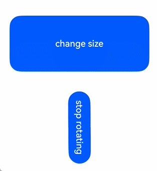

# 显式动画 (animateTo)

提供全局animateTo显式动画接口来指定由于闭包代码导致的状态变化插入过渡动效。同属性动画，布局类改变宽高的动画，内容都是直接到终点状态，例如文字、[Canvas](ts-components-canvas-canvas.md)的内容等，如果要内容跟随宽高变化，可以使用[renderFit](ts-universal-attributes-renderfit.md)属性配置。

>  **说明：**
>
>  从API Version 7开始支持。后续版本如有新增内容，则采用上角标单独标记该内容的起始版本。
>
>  本模块功能依赖UI的执行上下文，不可在UI上下文不明确的地方使用，参见[UIContext](../js-apis-arkui-UIContext.md#uicontext)说明。
>
>**卡片能力：** 从API version 9开始，该接口支持在ArkTS卡片中使用。
>
>  从API version 10开始，可以通过使用[UIContext](../js-apis-arkui-UIContext.md#uicontext)中的[animateTo](../js-apis-arkui-UIContext.md#animateto)来明确UI的执行上下文。
>
>  从API version 11开始，该接口支持在原子化服务中使用。

## 接口
animateTo(value: AnimateParam, event: () => void): void

**原子化服务API：** 从API version 11开始，该接口支持在原子化服务中使用。

**参数：**
| 参数    | 类型                                | 是否必填 | 描述                                    |
| ----- | --------------------------------- | ---- | ------------------------------------- |
| value | [AnimateParam](#animateparam对象说明) | 是    | 设置动画效果相关参数。                           |
| event | () => void                        | 是    | 指定动效的闭包函数，在闭包函数中导致的状态变化系统会自动插入过渡动画。 |

## AnimateParam对象说明 

| 名称         | 类型          | 是否必填                 | 描述                                       |
| ---------- | ---------------|------------------------ | ---------------------------------------- |
| duration   | number         |  否  | 动画持续时间，单位为毫秒。<br/>默认值：1000<br/>**卡片能力：** 从API version 9开始，该接口支持在ArkTS卡片中使用。<br/>**原子化服务API：** 从API version 11开始，该接口支持在原子化服务中使用。<br/>**说明：**<br/>- 在ArkTS卡片上最大动画持续时间为1000毫秒，若超出则固定为1000毫秒。<br/>-&nbsp;设置小于0的值时按0处理。<br/>-&nbsp;设置浮点型类型的值时，向下取整。例如，设置值为1.2，按照1处理。 |
| tempo      | number         | 否 | 动画播放速度，值越大动画播放越快，值越小播放越慢，为0时无动画效果。<br/>默认值：1.0<br/>**原子化服务API：** 从API version 11开始，该接口支持在原子化服务中使用。<br/>**说明：** <br/>当设置小于0的值时按值为1处理。 |
| curve      | [Curve](ts-appendix-enums.md#curve)&nbsp;\|&nbsp;[ICurve<sup>9+</sup>](../js-apis-curve.md#icurve)&nbsp;\|&nbsp;string | 否 | 动画曲线。<br/>默认值：Curve.EaseInOut<br/>**卡片能力：** 从API version 9开始，该接口支持在ArkTS卡片中使用。<br/>**原子化服务API：** 从API version 11开始，该接口支持在原子化服务中使用。 |
| delay      | number         | 否 | 动画延迟播放时间，单位为ms(毫秒)，默认不延时播放。<br/>默认值：0<br/>取值范围：(-∞, +∞)<br/>**原子化服务API：** 从API version 11开始，该接口支持在原子化服务中使用。<br/>**说明：** <br/>-&nbsp;delay>=0为延迟播放，delay<0表示提前播放。对于delay<0的情况：当delay的绝对值小于实际动画时长，动画将在开始后第一帧直接运动到delay绝对值的时刻的状态；当delay的绝对值大于等于实际动画时长，动画将在开始后第一帧直接运动到终点状态。其中实际动画时长等于单次动画时长乘以动画播放次数。<br/>-&nbsp;设置浮点型类型的值时，向下取整。例如，设置值为1.2，按照1处理。 |
| iterations | number         | 否 | 动画播放次数。默认播放一次，设置为-1时表示无限次播放。设置为0时表示无动画效果。<br/>默认值：1 <br/>取值范围：[-1, +∞)<br/>**原子化服务API：** 从API version 11开始，该接口支持在原子化服务中使用。          |
| playMode   | [PlayMode](ts-appendix-enums.md#playmode)|否 | 动画播放模式，默认播放完成后重头开始播放。<br/>默认值：PlayMode.Normal<br/>**卡片能力：** 从API version 9开始，该接口支持在ArkTS卡片中使用。<br/>相关使用约束请参考PlayMode说明。<br/>**原子化服务API：** 从API version 11开始，该接口支持在原子化服务中使用。 |
| onFinish   | ()&nbsp;=&gt;&nbsp;void      | 否 | 动画播放完成回调。Ability从前台切换至后台时会立即结束动画，触发播放完成回调。 <br/>**卡片能力：** 从API version 9开始，该接口支持在ArkTS卡片中使用。<br/>**原子化服务API：** 从API version 11开始，该接口支持在原子化服务中使用。<br/>|
| finishCallbackType<sup>11+</sup>   | [FinishCallbackType](#finishcallbacktype11)|否 | 在动画中定义onFinish回调的类型。<br/>默认值：FinishCallbackType.REMOVED<br/>**卡片能力：** 从API version 11开始，该接口支持在ArkTS卡片中使用。<br/>**原子化服务API：** 从API version 12开始，该接口支持在原子化服务中使用。 |
| expectedFrameRateRange<sup>11+</sup>   | [ExpectedFrameRateRange](#expectedframeraterange11) | 否 | 设置动画的期望帧率。<br/>**原子化服务API：** 从API version 12开始，该接口支持在原子化服务中使用。|

> **PlayMode说明：**
>
> - PlayMode推荐使用PlayMode.Normal和PlayMode.Alternate，此场景下动画的第一轮是正向播放的。如使用PlayMode.Reverse和PlayMode.AlternateReverse，则动画的第一轮是逆向播放的，在动画刚开始时会跳变到终止状态，然后逆向播放动画。
> - 使用PlayMode.Alternate或PlayMode.AlternateReverse时，开发者应保证动画最终状态和状态变量的取值一致，即应保证动画的最后一轮是正向播放的。使用PlayMode.Alternate时，iterations应为奇数。使用PlayMode.AlternateReverse时，iterations应为偶数。
> - 不推荐使用PlayMode.Reverse，此场景下不仅会导致动画刚开始就跳变到终止状态，也会导致动画最终状态和状态变量的取值不同。

## FinishCallbackType<sup>11+</sup>

**卡片能力：** 从API version 11开始，该接口支持在ArkTS卡片中使用。

**原子化服务API：** 从API version 12开始，该接口支持在原子化服务中使用。

**系统能力：** SystemCapability.ArkUI.ArkUI.Full

| 名称       | 描述                                                         |
| --------- | ------------------------------------------------------------ |
| REMOVED   | 当整个动画结束并立即删除时，将触发回调。                         |
| LOGICALLY | 当动画在逻辑上处于下降状态，但可能仍处于其长尾状态时，将触发回调。 |

## ExpectedFrameRateRange<sup>11+</sup>

**原子化服务API：** 从API version 12开始，该接口支持在原子化服务中使用。

| 名称  | 类型     | 说明      |
|-----|--------|---------|
| min | number | 期望的最小帧率。 |
| max | number | 期望的最大帧率。 |
| expected | number | 期望的最优帧率。 |

## 示例

> **说明：**
> 
> 直接使用animateTo可能导致实例不明确的问题，建议使用[getUIContext](../js-apis-arkui-UIContext.md#uicontext)获取UIContext实例，并使用[animateTo](../js-apis-arkui-UIContext.md#animateto)调用绑定实例的animateTo。

```ts
// xxx.ets
@Entry
@Component
struct AnimateToExample {
  @State widthSize: number = 250
  @State heightSize: number = 100
  @State rotateAngle: number = 0
  private flag: boolean = true

  build() {
    Column() {
      Button('change size')
        .width(this.widthSize)
        .height(this.heightSize)
        .margin(30)
        .onClick(() => {
          if (this.flag) {
            // 建议使用this.getUIContext()?.animateTo()
            animateTo({
              duration: 2000,
              curve: Curve.EaseOut,
              iterations: 3,
              playMode: PlayMode.Normal,
              onFinish: () => {
                console.info('play end')
              }
            }, () => {
              this.widthSize = 150
              this.heightSize = 60
            })
          } else {
            // 建议使用this.getUIContext()?.animateTo()
            animateTo({}, () => {
              this.widthSize = 250
              this.heightSize = 100
            })
          }
          this.flag = !this.flag
        })
      Button('stop rotating')
        .margin(50)
        .rotate({ x: 0, y: 0, z: 1, angle: this.rotateAngle })
        .onAppear(() => {
          // 组件出现时开始做动画
          // 建议使用this.getUIContext()?.animateTo()
          animateTo({
            duration: 1200,
            curve: Curve.Friction,
            delay: 500,
            iterations: -1, // 设置-1表示动画无限循环
            playMode: PlayMode.Alternate,
            expectedFrameRateRange: {
              min: 10,
              max: 120,
              expected: 60,
            }
          }, () => {
            this.rotateAngle = 90
          })
        })
        .onClick(() => {
          // 建议使用this.getUIContext()?.animateTo()
          animateTo({ duration: 0 }, () => {
            // this.rotateAngle之前为90，在duration为0的动画中修改属性，可以停止该属性之前的动画，按新设置的属性显示
            this.rotateAngle = 0
          })
        })
    }.width('100%').margin({ top: 5 })
  }
}
```

