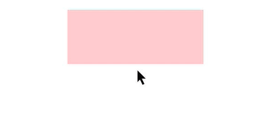
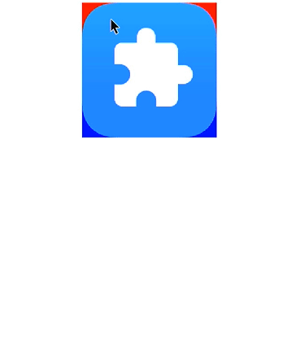

# 自定义手势判定

为组件提供自定义手势判定能力。开发者可根据需要，在手势识别期间，决定是否响应手势。

>  **说明：**
>
>  从API Version 11开始支持。后续版本如有新增内容，则采用上角标单独标记该内容的起始版本。


## onGestureJudgeBegin
onGestureJudgeBegin(callback: (gestureInfo: GestureInfo, event: BaseGestureEvent) => GestureJudgeResult): T

**原子化服务API：** 从API version 12开始，该接口支持在原子化服务中使用。

**参数：**
| 参数名        | 参数类型                    | 必填  | 参数描述                          |
| ---------- | -------------------------- | ------- | ----------------------------- |
| callback      | (gestureInfo: [GestureInfo](#gestureinfo对象说明), event: [BaseGestureEvent](#basegestureevent对象说明)) => [GestureJudgeResult](#gesturejudgeresult11) | 是     |  给组件绑定自定义手势判定回调，当绑定到该组件的手势被接受时，会触发用户定义的回调来获取结果。 |

**返回值：**

| 类型 | 说明 |
| -------- | -------- |
| T | 返回当前组件。 |


## GestureJudgeResult<sup>11+</sup>

**原子化服务API：** 从API version 12开始，该接口支持在原子化服务中使用。

**系统能力：** SystemCapability.ArkUI.ArkUI.Full

| 名称  | 描述                                   |
| ----- | -------------------------------------- |
| CONTINUE  | 不影响系统手势判定流程。|
| REJECT  | 对于用户自定义的手势判定结果为失败。|

## GestureInfo对象说明

**原子化服务API：** 从API version 12开始，该接口支持在原子化服务中使用。

| 名称            | 类型                        | 描述         |
| ---------------  | -------------------------   | -----------|
| tag              | string                      | 手势标记。<br/>**说明：**<br/>如果未设置事件标识tag属性的情况下，此处tag不返回或者返回undefined。  |
| type             | [GestureControl.GestureType](#gesturetype12)  | 手势类型。<br/>**说明：**<br/> 当手势为未暴露类型的系统内置手势事件时，type的值为-1。 |
| isSystemGesture  | boolean                     | 判断当前手势是否是组件自带的手势。true表示是组件自带的手势，false表示非组件自带手势。<br/>默认值：false |

## GestureType<sup>12+</sup>

**原子化服务API：** 从API version 11开始，该接口支持在原子化服务中使用。

**系统能力：** SystemCapability.ArkUI.ArkUI.Full

| 名称  | 值 | 描述                                   |
| ----- | -------- | -------------------------------------- |
| TAP_GESTURE   | 0 | 点击手势|
| LONG_PRESS_GESTURE  | 1 | 长按手势|
| PAN_GESTURE    | 2 | 拖动手势|
| PINCH_GESTURE   | 3 | 捏合手势|
| SWIPE_GESTURE    | 4 | 滑动手势|
| ROTATION_GESTURE   | 5 | 旋转手势|
| DRAG    | 6 | 拖拽|
| CLICK   | 7 | 点击|

## BaseEvent对象说明<sup>8+</sup>


| 名称    | 类型                                      | 描述         |
| ---------| ----------------------------------------  | -----------|
| target   | [EventTarget](ts-universal-events-click.md#eventtarget8对象说明) | 触发手势事件的元素对象显示区域。<br/>**卡片能力：** 从API version 9开始，该接口支持在ArkTS卡片中使用。<br/>**原子化服务API：** 从API version 11开始，该接口支持在原子化服务中使用。|
| timestamp| number | 事件时间戳，触发事件时距离系统启动的时间间隔。<br>单位：ns<br/>**卡片能力：** 从API version 9开始，该接口支持在ArkTS卡片中使用。<br/>**原子化服务API：** 从API version 11开始，该接口支持在原子化服务中使用。 |
| source   | [SourceType](ts-gesture-settings.md#sourcetype枚举说明) | 事件输入设备。<br/>**卡片能力：** 从API version 9开始，该接口支持在ArkTS卡片中使用。<br/>**原子化服务API：** 从API version 11开始，该接口支持在原子化服务中使用。  |
| pressure<sup>9+</sup> | number | 按压的压力大小。<br/>默认值：0<br/>取值范围：[0,1]，典型值0.913168，压感大小与数值正相关。<br/>**卡片能力：** 从API version 9开始，该接口支持在ArkTS卡片中使用。<br/>**原子化服务API：** 从API version 11开始，该接口支持在原子化服务中使用。  |
| tiltX<sup>9+</sup> | number | 手写笔在设备平面上的投影与设备平面X轴的夹角。<br/>**卡片能力：** 从API version 9开始，该接口支持在ArkTS卡片中使用。<br/>**原子化服务API：** 从API version 11开始，该接口支持在原子化服务中使用。 |
| tiltY<sup>9+</sup> | number | 手写笔在设备平面上的投影与设备平面Y轴的夹角。<br/>**卡片能力：** 从API version 9开始，该接口支持在ArkTS卡片中使用。<br/>**原子化服务API：** 从API version 11开始，该接口支持在原子化服务中使用。 |
| rollAngle<sup>17+</sup> | number | 手写笔与设备平面的夹角。<br/>**卡片能力：** 从API version 17开始，该接口支持在ArkTS卡片中使用。<br/>**原子化服务API：** 从API version 17开始，该接口支持在原子化服务中使用。 |
| sourceTool<sup>9+</sup> | [SourceTool](ts-gesture-settings.md#sourcetool枚举说明9) | 事件输入源。<br/>**卡片能力：** 从API version 9开始，该接口支持在ArkTS卡片中使用。<br/>**原子化服务API：** 从API version 11开始，该接口支持在原子化服务中使用。  |
| axisHorizontal<sup>12+</sup> | number | 水平轴值。<br/>**说明：**<br/>当前仅在由鼠标滚轮或者触控板双指滑动场景下触发的Pan手势中可以获取。<br/>**卡片能力：** 从API version 12开始，该接口支持在ArkTS卡片中使用。<br/>**原子化服务API：** 从API version 12开始，该接口支持在原子化服务中使用。|
| axisVertical<sup>12+</sup> | number | 垂直轴值。<br/>**说明：**<br/>当前仅在由鼠标滚轮或者触控板双指滑动场景下触发的Pan手势中可以获取。<br/>**卡片能力：** 从API version 12开始，该接口支持在ArkTS卡片中使用。<br/>**原子化服务API：** 从API version 12开始，该接口支持在原子化服务中使用。 |
| getModifierKeyState<sup>12+</sup> | (Array&lt;string&gt;) => bool | 获取功能键按压状态。报错信息请参考以下错误码。支持功能键 'Ctrl'\|'Alt'\|'Shift'。<br/>**原子化服务API：** 从API version 12开始，该接口支持在原子化服务中使用。|
| deviceId<sup>12+</sup> | number | 触发当前事件的输入设备ID。<br/>**原子化服务API：** 从API version 12开始，该接口支持在原子化服务中使用。|
| targetDisplayId<sup>15+</sup> | number | 事件发生的屏幕ID。  <br/>默认值：0<br />取值范围：[0, +∞)<br />**原子化服务API：** 从API version 15开始，该接口支持在原子化服务中使用。 |

**错误码**：

以下错误码详细介绍请参考[通用错误码](../../errorcode-universal.md)。

| 错误码ID | 错误信息 |
| ------- | -------- |
| 401 | Parameter error. Possible causes: 1. Incorrect parameter types. 2. Parameter verification failed. |

## BaseGestureEvent对象说明
继承于[BaseEvent](#baseevent对象说明8)。

**原子化服务API：** 从API version 12开始，该接口支持在原子化服务中使用。

| 名称      | 类型                                      | 描述         |
| ---------  | ----------------------------------------  | -----------|
| fingerList | [FingerInfo[]](ts-gesture-settings.md#fingerinfo对象说明8) | 触发事件的所有手指信息。  |

## TapGestureEvent对象说明
继承于[BaseGestureEvent](#basegestureevent对象说明)。可将该对象作为[onGestureJudgeBegin](#ongesturejudgebegin)的event参数来传递。

**原子化服务API：** 从API version 12开始，该接口支持在原子化服务中使用。

| 名称      | 类型      | 必填                                | 说明         |
| ---------  | --- | -------------------------------------  | -----------|
| tapLocation<sup>20+</sup>  | [EventLocationInfo](ts-basic-gestures-tapgesture.md#eventlocationinfo20对象说明) | 否 | 获取点击手势的坐标信息。<br/>取值范围：[0, +∞)<br/> **原子化服务API：** 从API version 20开始，该接口支持在原子化服务中使用。|

## LongPressGestureEvent对象说明
继承于[BaseGestureEvent](#basegestureevent对象说明)。可将该对象作为[onGestureJudgeBegin](#ongesturejudgebegin)的event参数来传递。

**原子化服务API：** 从API version 12开始，该接口支持在原子化服务中使用。

| 名称      | 类型                                      | 描述         |
| ---------  | ----------------------------------------  | -----------|
| repeat     | boolean | 是否为重复触发事件。true表示为重复触发事件，false表示非重复触发事件。  |

## PanGestureEvent对象说明
继承于[BaseGestureEvent](#basegestureevent对象说明)。可将该对象作为[onGestureJudgeBegin](#ongesturejudgebegin)的event参数来传递。

**原子化服务API：** 从API version 12开始，该接口支持在原子化服务中使用。

| 名称      | 类型                                      | 描述         |
| ---------  | ----------------------------------------  | -----------|
| offsetX    | number | 手势事件x轴相对当前组件元素原始区域的偏移量，单位为vp，从左向右滑动offsetX为正，反之为负。  |
| offsetY    | number | 手势事件y轴相对当前组件元素原始区域的偏移量，单位为vp，从上向下滑动offsetY为正，反之为负。  |
| velocityX  | number | 获取当前手势的x轴方向速度。坐标轴原点为屏幕左上角，分正负方向速度，从左往右为正，反之为负。单位为vp/s。  |
| velocityY  | number | 获取当前手势的y轴方向速度。坐标轴原点为屏幕左上角，分正负方向速度，从上往下为正，反之为负。单位为vp/s。|
| velocity   | number | 获取当前的主方向速度。为xy轴方向速度的平方和的算术平方根。单位为vp/s。  |

## PinchGestureEvent对象说明

**原子化服务API：** 从API version 12开始，该接口支持在原子化服务中使用。

继承于[BaseGestureEvent](#basegestureevent对象说明)。可将该对象作为[onGestureJudgeBegin](#ongesturejudgebegin)的event参数来传递。
| 名称         | 类型                                      | 描述         |
| ------------  | ----------------------------------------  | -----------|
| scale         | number | 缩放比例。  |
| pinchCenterX  | number | 捏合手势中心点相对于当前组件元素原始区域左上角x轴坐标，单位为vp。  |
| pinchCenterY  | number | 捏合手势中心点相对于当前组件元素原始区域左上角y轴坐标，单位为vp。  |

## RotationGestureEvent对象说明

**原子化服务API：** 从API version 12开始，该接口支持在原子化服务中使用。

继承于[BaseGestureEvent](#basegestureevent对象说明)。可将该对象作为[onGestureJudgeBegin](#ongesturejudgebegin)的event参数来传递。
| 名称         | 类型                                      | 描述         |
| ------------  | ----------------------------------------  | -----------|
| angle         | number | 表示旋转角度，单位为deg。<br/>**说明：**<br/>角度计算方式：滑动手势被识别到后，连接两根手指之间的线被识别为起始线条，随着手指的滑动，手指之间的线条会发生旋转，根据起始线条两端点和当前线条两端点的坐标，使用反正切函数分别计算其相对于水平方向的夹角，最后arctan2(cy2-cy1,cx2-cx1)-arctan2(y2-y1,x2-x1)为旋转的角度。以起始线条为坐标系，顺时针旋转为0到180度，逆时针旋转为-180到0度。  |

## SwipeGestureEvent对象说明
继承于[BaseGestureEvent](#basegestureevent对象说明)。可将该对象作为[onGestureJudgeBegin](#ongesturejudgebegin)的event参数来传递。

**原子化服务API：** 从API version 12开始，该接口支持在原子化服务中使用。

| 名称         | 类型                                      | 描述         |
| ------------  | ----------------------------------------  | -----------|
| angle         | number | 表示滑动手势的角度，即两根手指间的线段与水平方向的夹角变化的度数，单位为deg。<br/>**说明：**<br/>角度计算方式：滑动手势被识别到后，连接两根手指之间的线被识别为起始线条，随着手指的滑动，手指之间的线条会发生旋转，根据起始线条两端点和当前线条两端点的坐标，使用反正切函数分别计算其相对于水平方向的夹角，最后arctan2(cy2-cy1,cx2-cx1)-arctan2(y2-y1,x2-x1)为旋转的角度。以起始线条为坐标系，顺时针旋转为0到180度，逆时针旋转为-180到0度。|
| speed         | number | 滑动手势速度，即所有手指相对当前组件元素原始区域滑动的平均速度，单位为vp/s。  |
## 示例

### 示例1（自定义手势判定）

该示例通过配置onGestureJudgeBegin实现了对长按、滑动和拖动手势的自定义判定。

```ts
// xxx.ets
@Entry
@Component
struct Index {
  @State message: string = '';

  build() {
    Column() {
      Row({ space: 20 }) {
        Text(this.message).width(200).height(80).backgroundColor(Color.Pink)
          .fontSize(25)
      }.margin(20)
    }
    .width('100%')
    .height(200)
    .borderWidth(2)
    .onDragStart(() => {
      this.message = 'drag'
      console.log("Drag start.")
    })
    .gesture(
      TapGesture()
        .tag("tap1")// 设置点击手势标志
        .onAction(() => {
          this.message = 'tap1'
        })
    )
    .gesture(
      LongPressGesture()
        .tag("longPress1")// 设置长按手势标志
        .onAction(() => {
          this.message = 'longPress'
        })
    )
    .gesture(
      SwipeGesture()
        .tag("swipe1")// 设置滑动手势标志
        .onAction(() => {
          this.message = 'swipe1'
        })
    )
    .gesture(
      PanGesture()
        .tag("pan1")// 设置拖动手势标志
        .onActionStart(() => {
          this.message = 'pan1'
        })
    )
    .onGestureJudgeBegin((gestureInfo: GestureInfo, event: BaseGestureEvent) => {
      // 若该手势类型为长按手势，转换为长按手势事件
      if (gestureInfo.type == GestureControl.GestureType.LONG_PRESS_GESTURE) {
        let longPressEvent = event as LongPressGestureEvent;
        console.log("repeat " + longPressEvent.repeat)
      }
      // 若该手势类型为滑动手势，转换为滑动手势事件
      if (gestureInfo.type == GestureControl.GestureType.SWIPE_GESTURE) {
        let swipeEvent = event as SwipeGestureEvent;
        console.log("angle " + swipeEvent.angle)
      }
      // 若该手势类型为拖动手势，转换为拖动手势事件
      if (gestureInfo.type == GestureControl.GestureType.PAN_GESTURE) {
        let panEvent = event as PanGestureEvent;
        console.log("velocity " + panEvent.velocity)
      }
      // 自定义判定标准
      if (gestureInfo.type == GestureControl.GestureType.DRAG) {
        // 返回 REJECT 会使拖动手势失败
        return GestureJudgeResult.REJECT;
      } else if (gestureInfo.tag == 'longPress1' && event.fingerList.length > 0 && event.fingerList[0].localY < 100) {
        // 返回 CONTINUE 将保持系统判定。
        return GestureJudgeResult.CONTINUE;
      }
      return GestureJudgeResult.CONTINUE;
    })
  }
}
```


### 示例2（自定义区域手势判定）

该示例通过配置onGestureJudgeBegin判定区域决定长按手势和拖拽是否响应。

```ts
// xxx.ets
import { PromptAction } from '@kit.ArkUI';

@Entry
@Component
struct Index {
  scroller: Scroller = new Scroller()
  promptAction: PromptAction = this.getUIContext().getPromptAction();

  build() {
    Scroll(this.scroller) {
      Column({ space: 8 }) {
        Text("Drag 上下两层 上层绑定长按，下层绑定拖拽。先长按后平移上半区红色区域只会响应长按，先长按后平移下半区蓝色区域只会响应拖拽").width('100%').fontSize(20).fontColor('0xffdd00')
          .backgroundColor(0xeeddaa00)
        Stack({ alignContent: Alignment.Center }) {
          Column() {
            // 模拟上半区和下半区
            Stack().width('200vp').height('100vp').backgroundColor(Color.Red)
            Stack().width('200vp').height('100vp').backgroundColor(Color.Blue)
          }.width('200vp').height('200vp')
          // Stack的下半区是绑定了拖动手势的图像区域。
          Image($r('sys.media.ohos_app_icon'))
            .draggable(true)
            .onDragStart(()=>{
              this.promptAction.showToast({ message: "Drag 下半区蓝色区域，Image响应" })
            })
            .width('200vp').height('200vp')
          // Stack的上半区是绑定了长按手势的浮动区域。
          Stack() {
          }
          .width('200vp')
          .height('200vp')
          .hitTestBehavior(HitTestMode.Transparent)
          .onGestureJudgeBegin((gestureInfo: GestureInfo, event: BaseGestureEvent) => {
            // 确定tag标志是否有值
            if (gestureInfo.tag) {
              console.log("gestureInfo tag" + gestureInfo.tag.toString())
            }
            console.log("gestureInfo Type " + gestureInfo.type.toString() + " isSystemGesture " + gestureInfo.isSystemGesture);
            console.log("pressure " + event.pressure + " fingerList.length " + event.fingerList.length
            + " timeStamp " + event.timestamp + " sourceType " + event.source.toString() + " titleX " + event.tiltX + " titleY " + event.tiltY + " rollAngle " + event.rollAngle + " sourcePool " + event.sourceTool.toString());
            // 如果是长按类型手势，判断点击的位置是否在上半区
            if (gestureInfo.type == GestureControl.GestureType.LONG_PRESS_GESTURE) {
              if (event.fingerList.length > 0 && event.fingerList[0].localY < 100) {
                return GestureJudgeResult.CONTINUE
              } else {
                return GestureJudgeResult.REJECT
              }
            }
            return GestureJudgeResult.CONTINUE
          })
          .gesture(GestureGroup(GestureMode.Parallel,
            LongPressGesture()
              .onAction((event: GestureEvent) => {
                this.promptAction.showToast({ message: "LongPressGesture 长按上半区 红色区域，红色区域响应" })
              })
              .tag("tap111")
          ))

        }.width('100%')
      }.width('100%')
    }
  }
}
```
