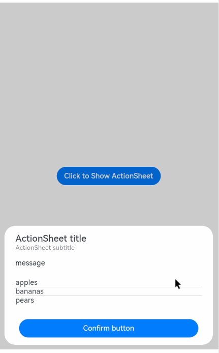
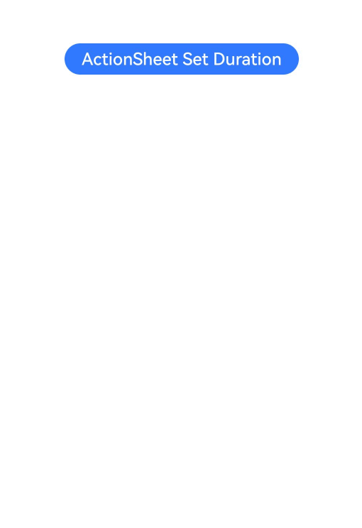
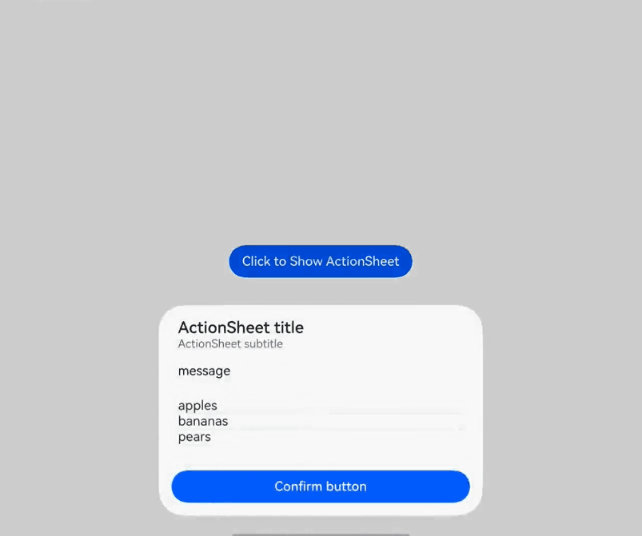

# 列表选择弹窗 (ActionSheet)

列表弹窗。

>  **说明：**
>
>  从API version 8开始支持。后续版本如有新增内容，则采用上角标单独标记该内容的起始版本。
>
> 本模块功能依赖UI的执行上下文，不可在[UI上下文不明确](../../../ui/arkts-global-interface.md)的地方使用，参见[UIContext](../js-apis-arkui-UIContext.md#uicontext)说明。
>
> 从API version 10开始，可以通过使用[UIContext](../js-apis-arkui-UIContext.md#uicontext)中的[showActionSheet](../js-apis-arkui-UIContext.md#showactionsheet)来明确UI的执行上下文。

## ActionSheet

### show

static show(value: ActionSheetOptions)

定义列表弹窗并弹出。

**原子化服务API：** 从API version 11开始，该接口支持在原子化服务中使用。

**系统能力：** SystemCapability.ArkUI.ArkUI.Full

**参数：**

| 参数名 | 类型                                              | 必填 | 说明                     |
| ------ | ------------------------------------------------- | ---- | ------------------------ |
| value  | [ActionSheetOptions](#actionsheetoptions对象说明) | 是   | 配置列表选择弹窗的参数。 |

## ActionSheetOptions对象说明

**系统能力：** SystemCapability.ArkUI.ArkUI.Full

| 名称      | 类型                    | 必填  | 说明                          |
| ---------- | -------------------------- | ------- | ----------------------------- |
| title      | string&nbsp;\|&nbsp;[Resource](ts-types.md#resource) | 是     |  弹窗标题。<br/>当文本内容过长无法显示时，用省略号代替未显示的部分。<br>**原子化服务API：** 从API version 11开始，该接口支持在原子化服务中使用。 |
| subtitle<sup>10+</sup> | [ResourceStr](ts-types.md#resourcestr) | 否 | 弹窗副标题。<br/>当文本内容过长无法显示时，用省略号代替未显示的部分。<br>**原子化服务API：** 从API version 11开始，该接口支持在原子化服务中使用。 |
| message    | string&nbsp;\|&nbsp;[Resource](ts-types.md#resource) | 是     | 弹窗内容。<br/>文本超长时会触发滚动条。<br>**原子化服务API：** 从API version 11开始，该接口支持在原子化服务中使用。  |
| autoCancel | boolean                           | 否     | 点击遮障层时，是否关闭弹窗。<br>默认值：true<br>值为true时，点击遮障层关闭弹窗，值为false时，点击遮障层不关闭弹窗。 <br>**原子化服务API：** 从API version 11开始，该接口支持在原子化服务中使用。|
| confirm    | {<br/>enabled<sup>10+</sup>?: boolean,<br/>defaultFocus<sup>10+</sup>?: boolean,<br />style<sup>10+</sup>?: [DialogButtonStyle](ts-appendix-enums.md#dialogbuttonstyle10),<br />value:&nbsp;string&nbsp;\|&nbsp;[Resource](ts-types.md#resource),<br/>action:&nbsp;()&nbsp;=&gt;&nbsp;void<br/>} | 否  | 确认Button的使能状态、默认焦点、按钮风格、文本内容和点击回调。在弹窗获焦且未进行tab键走焦时，该按钮默认响应Enter键，且多重弹窗可自动获焦连续响应。默认响应Enter键能力在defaultFocus为true时不生效。<br>enabled：点击Button是否响应，true表示Button可以响应，false表示Button不可以响应。<br />默认值：true<br />defaultFocus：设置Button是否是默认焦点，true表示Button是默认焦点，false表示Button不是默认焦点。<br />默认值：false<br />style：设置Button的风格样式。<br />默认值：DialogButtonStyle.DEFAULT<br/>value：Button文本内容。当文本内容过长无法显示时，用省略号代替未显示的部分。<br/>action:&nbsp;Button选中时的回调。<br>**原子化服务API：** 从API version 11开始，该接口支持在原子化服务中使用。 |
| cancel     | ()&nbsp;=&gt;&nbsp;void           | 否     | 点击遮障层关闭dialog时的回调。  <br>**原子化服务API：** 从API version 11开始，该接口支持在原子化服务中使用。  |
| alignment  | [DialogAlignment](ts-methods-alert-dialog-box.md#dialogalignment枚举说明) | 否     |  弹窗在竖直方向上的对齐方式。<br>默认值：DialogAlignment.Bottom  <br>**原子化服务API：** 从API version 11开始，该接口支持在原子化服务中使用。<br/>**说明**：<br/>若在UIExtension中设置showInSubWindow为true，弹窗将基于UIExtension的宿主窗口对齐。|
| offset     | {<br/>dx:&nbsp;number&nbsp;\|&nbsp;string&nbsp;\|&nbsp;[Resource](ts-types.md#resource),<br/>dy:&nbsp;number&nbsp;\|&nbsp;string&nbsp;\|&nbsp;[Resource](ts-types.md#resource)<br/>} | 否      | 需要显式指定像素单位，如'10px'，也可设置百分比字符串，如'100%'。<br/>不指定像素单位时，默认单位vp，如'10'，等同于10。<br>弹窗相对alignment所在位置的偏移量。<br/>默认值：<br/>1.alignment设置为Top、TopStart、TopEnd时默认值为{dx:&nbsp;0,dy:&nbsp;"40vp"} <br/>2.alignment设置为其他时默认值为{dx:&nbsp;0,dy:&nbsp;"-40vp"} <br>**原子化服务API：** 从API version 11开始，该接口支持在原子化服务中使用。|
| sheets     | Array&lt;[SheetInfo](#sheetinfo对象说明)&gt; | 是       | 设置选项内容，每个选择项支持设置图片、文本和选中的回调。 <br>**原子化服务API：** 从API version 11开始，该接口支持在原子化服务中使用。|
| maskRect<sup>10+</sup> | [Rectangle](ts-methods-alert-dialog-box.md#rectangle8类型说明) | 否     | 弹窗遮蔽层区域，在遮蔽层区域内的事件不透传，在遮蔽层区域外的事件透传。<br/>默认值：{ x: 0, y: 0, width: '100%', height: '100%' } <br/>**说明：**<br/>showInSubWindow为true时，maskRect不生效。<br/>**原子化服务API：** 从API version 11开始，该接口支持在原子化服务中使用。|
| showInSubWindow<sup>11+</sup> | boolean | 否 | 某弹框需要显示在主窗口之外时，是否在子窗口显示此弹窗。值为true表示在子窗口显示弹窗。<br/>默认值：false，弹窗显示在应用内，而非独立子窗口。<br/>**说明**：showInSubWindow为true的弹窗无法触发显示另一个showInSubWindow为true的弹窗。<br/>**原子化服务API：** 从API version 12开始，该接口支持在原子化服务中使用。 |
| isModal<sup>11+</sup> | boolean | 否 | 弹窗是否为模态窗口，模态窗口有蒙层，非模态窗口无蒙层。值为false时，弹窗为非模态窗口，无蒙层。<br/>默认值：true，此时弹窗有蒙层。<br/>**原子化服务API：** 从API version 12开始，该接口支持在原子化服务中使用。 |
| backgroundColor<sup>11+</sup> | [ResourceColor](ts-types.md#resourcecolor)  | 否 | 弹窗背板颜色。<br/>默认值：Color.Transparent<br/>**说明：** <br/>当设置了backgroundColor为非透明色时，backgroundBlurStyle需要设置为BlurStyle.NONE，否则颜色显示将不符合预期效果。<br/>**原子化服务API：** 从API version 12开始，该接口支持在原子化服务中使用。 |
| backgroundBlurStyle<sup>11+</sup> | [BlurStyle](ts-universal-attributes-background.md#blurstyle9) | 否 | 弹窗背板模糊材质。<br/>默认值：BlurStyle.COMPONENT_ULTRA_THICK<br/>**说明：** <br/>设置为BlurStyle.NONE即可关闭背景虚化。当设置了backgroundBlurStyle为非NONE值时，则不要设置backgroundColor，否则颜色显示将不符合预期效果。<br/>**原子化服务API：** 从API version 12开始，该接口支持在原子化服务中使用。 |
| onWillDismiss<sup>12+</sup> | Callback<[DismissDialogAction](#dismissdialogaction12)> | 否 | 交互式关闭回调函数。<br/>**说明：**<br/>1.当用户执行点击遮障层关闭、左滑/右滑、三键back、键盘ESC关闭交互操作时，如果注册该回调函数，则不会立刻关闭弹窗。在回调函数中可以通过reason得到阻拦关闭弹窗的操作类型，从而根据原因选择是否能关闭弹窗。当前组件返回的reason中，暂不支持CLOSE_BUTTON的枚举值。<br/>2.在onWillDismiss回调中，不能再做onWillDismiss拦截。 <br/>**原子化服务API：** 从API version 12开始，该接口支持在原子化服务中使用。 |
| cornerRadius<sup>12+</sup> | [Dimension](ts-types.md#dimension10)&nbsp;\|&nbsp;[BorderRadiuses](ts-types.md#borderradiuses9) &nbsp;\|&nbsp; [LocalizedBorderRadiuses](ts-types.md#localizedborderradiuses12) | 否 | 设置背板的圆角半径。<br />可分别设置4个圆角的半径。<br />默认值：{ topLeft: '32vp', topRight: '32vp', bottomLeft: '32vp', bottomRight: '32vp' }<br /> 圆角大小受组件尺寸限制，最大值为组件宽或高的一半，若值为负，则按照默认值处理。 <br /> 百分比参数方式：以父元素弹窗宽和高的百分比来设置弹窗的圆角。<br/>**说明：**<br/>当cornerRadius属性类型为LocalizedBorderRadiuses时，支持随语言习惯改变布局顺序。<br/>**原子化服务API：** 从API version 12开始，该接口支持在原子化服务中使用。|
| borderWidth<sup>12+</sup> | [Dimension](ts-types.md#dimension10)&nbsp;\|&nbsp;[EdgeWidths](ts-types.md#edgewidths9)&nbsp;\|&nbsp;[LocalizedEdgeWidths](ts-types.md#localizededgewidths12) | 否 | 设置弹窗背板的边框宽度。<br />可分别设置4个边框宽度。<br />默认值：0<br /> 百分比参数方式：以父元素弹窗宽的百分比来设置弹窗的边框宽度。<br />当弹窗左边框和右边框大于弹窗宽度，弹窗上边框和下边框大于弹窗高度，显示可能不符合预期。<br/>**说明：**<br/>当borderWidth属性类型为LocalizedEdgeWidths时，支持随语言习惯改变布局顺序。<br/>**原子化服务API：** 从API version 12开始，该接口支持在原子化服务中使用。|
| borderColor<sup>12+</sup> | [ResourceColor](ts-types.md#resourcecolor)&nbsp;\|&nbsp;[EdgeColors](ts-types.md#edgecolors9)&nbsp;\|&nbsp;[LocalizedEdgeColors](ts-types.md#localizededgecolors12) | 否 | 设置弹窗背板的边框颜色。<br/>默认值：Color.Black<br/> 如果使用borderColor属性，需要和borderWidth属性一起使用。<br/>**说明：**<br/>当borderColor属性类型为LocalizedEdgeColors时，支持随语言习惯改变布局顺序。<br/>**原子化服务API：** 从API version 12开始，该接口支持在原子化服务中使用。|
| borderStyle<sup>12+</sup> | [BorderStyle](ts-appendix-enums.md#borderstyle)&nbsp;\|&nbsp;[EdgeStyles](ts-types.md#edgestyles9)  | 否 | 设置弹窗背板的边框样式。<br/>默认值：BorderStyle.Solid。<br/> 如果使用borderStyle属性，需要和borderWidth属性一起使用。<br/>**原子化服务API：** 从API version 12开始，该接口支持在原子化服务中使用。 |
| width<sup>12+</sup> | [Dimension](ts-types.md#dimension10)   | 否 | 设置弹窗背板的宽度。<br />**说明：**<br>- 弹窗宽度默认最大值：400vp。<br />- 百分比参数方式：弹窗参考宽度为所在窗口的宽度，在此基础上调小或调大。<br/>**原子化服务API：** 从API version 12开始，该接口支持在原子化服务中使用。|
| height<sup>12+</sup> | [Dimension](ts-types.md#dimension10)   | 否 | 设置弹窗背板的高度。<br />**说明：**<br />- 弹窗高度默认最大值：0.9 *（窗口高度 - 安全区域）。<br />- 百分比参数方式：弹窗参考高度为（窗口高度 - 安全区域），在此基础上调小或调大。<br/>**原子化服务API：** 从API version 12开始，该接口支持在原子化服务中使用。|
| shadow<sup>12+</sup> | [ShadowOptions](ts-universal-attributes-image-effect.md#shadowoptions对象说明)&nbsp;\|&nbsp;[ShadowStyle](ts-universal-attributes-image-effect.md#shadowstyle10枚举说明)   | 否 | 设置弹窗背板的阴影。 <br /> 当设备为2in1时，默认场景下获焦阴影值为ShadowStyle.OUTER_FLOATING_MD，失焦为ShadowStyle.OUTER_FLOATING_SM<br/>**原子化服务API：** 从API version 12开始，该接口支持在原子化服务中使用。|
| transition<sup>12+</sup> | [TransitionEffect](ts-transition-animation-component.md#transitioneffect10) | 否 | 设置弹窗显示和退出的过渡效果。<br/>**说明：**<br/>1.如果不设置，则使用默认的显示/退出动效。<br/>2.显示动效中按back键，打断显示动效，执行退出动效，动画效果为显示动效与退出动效的曲线叠加后的效果。<br/>3.退出动效中按back键，不会打断退出动效，退出动效继续执行，继续按back键退出应用。 <br/>**原子化服务API：** 从API version 12开始，该接口支持在原子化服务中使用。|
| enableHoverMode<sup>14+</sup>     | boolean | 否   | 是否响应悬停态，值为true表示响应悬停态。<br />默认值：false，默认不响应。<br/>**原子化服务API：** 从API version 14开始，该接口支持在原子化服务中使用。|
| hoverModeArea<sup>14+</sup>       | [HoverModeAreaType](ts-appendix-enums.md#hovermodeareatype14) | 否   | 悬停态下弹窗默认展示区域。<br />默认值：HoverModeAreaType.BOTTOM_SCREEN。<br/>**原子化服务API：** 从API version 14开始，该接口支持在原子化服务中使用。|
| levelMode<sup>15+</sup>       | [LevelMode](#levelmode15) | 否   | 设置弹窗显示层级。<br />**说明：**<br />- 默认值：LevelMode.OVERLAY。<br />- 当且仅当showInSubWindow属性设置为false时生效。<br/>**原子化服务API：** 从API version 15开始，该接口支持在原子化服务中使用。|
| levelUniqueId<sup>15+</sup>       | number | 否   | 设置页面级弹窗需要显示的层级下的[节点 uniqueId](../js-apis-arkui-frameNode.md#getuniqueid12)。<br />**说明：**<br />- 当且仅当levelMode属性设置为LevelMode.EMBEDDED时生效。<br/>**原子化服务API：** 从API version 15开始，该接口支持在原子化服务中使用。|
| immersiveMode<sup>15+</sup>       | [ImmersiveMode](#immersivemode15) | 否   | 设置页面内弹窗蒙层效果。<br />**说明：**<br />- 默认值：ImmersiveMode.DEFAULT <br />- 当且仅当levelMode属性设置为LevelMode.EMBEDDED时生效。<br/>**原子化服务API：** 从API version 15开始，该接口支持在原子化服务中使用。|

## SheetInfo对象说明

**原子化服务API：** 从API version 11开始，该接口支持在原子化服务中使用。

**系统能力：** SystemCapability.ArkUI.ArkUI.Full

| 名称 | 类型                                                     | 必填 | 说明         |
| ------ | ------------------------------------------------------------ | ---- | ----------------- |
| title  | string&nbsp;\|&nbsp;[Resource](ts-types.md#resource) | 是   | 选项的文本内容。<br/>文本超长时会触发滚动条。|
| icon   | string&nbsp;\|&nbsp;[Resource](ts-types.md#resource) | 否   | 选项的图标，默认无图标显示。<br>string格式可用于加载网络图片和本地图片，常用于加载网络图片。当使用相对路径引用本地图片时，例如Image("common/test.jpg")。|
| action | ()=&gt;void  | 是   | 选项选中的回调。 |

## LevelMode<sup>15+</sup>

type LevelMode = LevelMode

弹窗的显示层级。

**原子化服务API：** 从API version 15开始，该接口支持在原子化服务中使用。

**系统能力：** SystemCapability.ArkUI.ArkUI.Full

| 类型                                                        | 说明                 |
| ----------------------------------------------------------- | -------------------- |
| [LevelMode](../js-apis-promptAction.md#levelmode15枚举说明) | 设置弹窗的显示层级。 |

## ImmersiveMode<sup>15+</sup>

type ImmersiveMode = ImmersiveMode

弹窗的蒙层效果。

**原子化服务API：** 从API version 15开始，该接口支持在原子化服务中使用。

**系统能力：** SystemCapability.ArkUI.ArkUI.Full

| 类型                                                         | 说明                       |
| ------------------------------------------------------------ | -------------------------- |
| [ImmersiveMode](../js-apis-promptAction.md#immersivemode15枚举说明) | 设置页面内弹窗的蒙层效果。 |

## DismissDialogAction<sup>12+</sup>

Dialog关闭的信息。

**原子化服务API：** 从API version 12开始，该接口支持在原子化服务中使用。

**系统能力：** SystemCapability.ArkUI.ArkUI.Full

### 属性

| 名称    | 类型                                                         | 可读 | 可写 | 说明                                                         |
| ------- | ------------------------------------------------------------ | ---- | ---- | ------------------------------------------------------------ |
| dismiss | Callback&lt;void&gt;                                         | 否   | 否   | Dialog关闭回调函数。开发者需要退出时调用，不需要退出时无需调用。 |
| reason  | [DismissReason](../js-apis-promptAction.md#dismissreason12枚举说明) | 否   | 否   | Dialog无法关闭原因。根据开发者需要选择不同操作下，Dialog是否需要关闭。 |

## 示例

>  **说明：**
>
> 推荐通过使用[UIContext](../js-apis-arkui-UIContext.md#uicontext)中的[showActionSheet](../js-apis-arkui-UIContext.md#showactionsheet)来明确UI的执行上下文。

### 示例1（弹出列表选择弹窗）

该示例通过点击按钮弹窗列表选择弹窗。

```ts
@Entry
@Component
struct ActionSheetExample {
  build() {
    Flex({ direction: FlexDirection.Column, alignItems: ItemAlign.Center, justifyContent: FlexAlign.Center }) {
      Button('Click to Show ActionSheet')
        .onClick(() => {
          ActionSheet.show({
            // 建议使用 this.getUIContext().showActionSheet()接口
            title: 'ActionSheet title',
            subtitle: 'ActionSheet subtitle',
            message: 'message',
            autoCancel: true,
            confirm: {
              defaultFocus: true,
              value: 'Confirm button',
              action: () => {
                console.log('Get Alert Dialog handled');
              }
            },
            cancel: () => {
              console.log('actionSheet canceled');
            },
            onWillDismiss: (dismissDialogAction: DismissDialogAction) => {
              console.info("reason=" + JSON.stringify(dismissDialogAction.reason))
              console.log("dialog onWillDismiss");
              if (dismissDialogAction.reason === DismissReason.PRESS_BACK) {
                dismissDialogAction.dismiss();
              }
              if (dismissDialogAction.reason === DismissReason.TOUCH_OUTSIDE) {
                dismissDialogAction.dismiss();
              }
            },
            alignment: DialogAlignment.Bottom,
            offset: { dx: 0, dy: -10 },
            sheets: [
              {
                title: 'apples',
                action: () => {
                  console.log('apples');
                }
              },
              {
                title: 'bananas',
                action: () => {
                  console.log('bananas');
                }
              },
              {
                title: 'pears',
                action: () => {
                  console.log('pears');
                }
              }
            ]
          })
        })
    }.width('100%')
    .height('100%')
  }
}
```



### 示例2（可在主窗外弹出的弹窗）

在2in1设备上设置showInSubWindow为true时，可以弹出在主窗外显示的弹窗。

```ts
@Entry
@Component
struct ActionSheetExample {
  build() {
    Flex({ direction: FlexDirection.Column, alignItems: ItemAlign.Center, justifyContent: FlexAlign.Center }) {
      Button('Click to Show ActionSheet')
        .onClick(() => {
          ActionSheet.show({
            title: 'ActionSheet title',
            subtitle: 'ActionSheet subtitle',
            message: 'message',
            autoCancel: true,
            showInSubWindow: true,
            isModal: true,
            confirm: {
              defaultFocus: true,
              value: 'Confirm button',
              action: () => {
                console.log('Get Alert Dialog handled');
              }
            },
            cancel: () => {
              console.log('actionSheet canceled');
            },
            onWillDismiss: (dismissDialogAction: DismissDialogAction) => {
              console.info("reason=" + JSON.stringify(dismissDialogAction.reason));
              console.log("dialog onWillDismiss");
              if (dismissDialogAction.reason === DismissReason.PRESS_BACK) {
                dismissDialogAction.dismiss();
              }
              if (dismissDialogAction.reason === DismissReason.TOUCH_OUTSIDE) {
                dismissDialogAction.dismiss();
              }
            },
            alignment: DialogAlignment.Center,
            offset: { dx: 0, dy: -10 },
            sheets: [
              {
                title: 'apples',
                action: () => {
                  console.log('apples');
                }
              },
              {
                title: 'bananas',
                action: () => {
                  console.log('bananas');
                }
              },
              {
                title: 'pears',
                action: () => {
                  console.log('pears');
                }
              }
            ]
          })
        })
    }.width('100%')
    .height('100%')
  }
}
```


### 示例3（设置弹窗的动画）
该示例通过配置transition实现弹窗的显示和消失动画。

```ts
@Entry
@Component
struct ActionSheetExample {
  build() {
    Column({ space: 5 }) {
      Button('ActionSheet Set Duration')
        .onClick(() => {
          ActionSheet.show({
            title: 'ActionSheet 1',
            message: 'Set Animation Duration open 3 second, close 100 ms',
            autoCancel: true,
            alignment: DialogAlignment.Top,
            transition: TransitionEffect.asymmetric(TransitionEffect.OPACITY
              .animation({ duration: 3000, curve: Curve.Sharp })
              .combine(TransitionEffect.scale({ x: 1.5, y: 1.5 }).animation({ duration: 3000, curve: Curve.Sharp })),
              TransitionEffect.OPACITY.animation({ duration: 100, curve: Curve.Smooth })
                .combine(TransitionEffect.scale({ x: 0.5, y: 0.5 }).animation({ duration: 100, curve: Curve.Smooth }))),
            offset: { dx: 0, dy: -20 },
            confirm: {
              value: 'button',
              action: () => {
                console.info('Button-clicking callback');
              }
            },
            cancel: () => {
              console.info('Closed callbacks');
            },
            sheets: [
              {
                title: 'apples',
                action: () => {
                  console.log('apples');
                }
              },
              {
                title: 'bananas',
                action: () => {
                  console.log('bananas');
                }
              },
              {
                title: 'pears',
                action: () => {
                  console.log('pears');
                }
              }
            ]
          })
        }).backgroundColor(0x317aff).height("88px")
    }.width('100%').margin({ top: 5 })
  }
}
```



### 示例4（设置弹窗的样式）
该示例定义了ActionSheet的样式，如宽度、高度、背景色、阴影等等。
```ts
@Entry
@Component
struct ActionSheetExample {
  build() {
    Flex({ direction: FlexDirection.Column, alignItems: ItemAlign.Center }) {
      Button('Click to Show ActionSheet')
        .onClick(() => {
          ActionSheet.show({
            title: 'ActionSheet title',
            subtitle: 'ActionSheet subtitle',
            message: 'message',
            autoCancel: true,
            width: 300,
            height: 350,
            cornerRadius: 20,
            borderWidth: 1,
            borderStyle: BorderStyle.Solid, //使用borderStyle属性，需要和borderWidth属性一起使用
            borderColor: Color.Blue, //使用borderColor属性，需要和borderWidth属性一起使用
            backgroundColor: Color.White,
            shadow: ({
              radius: 20,
              color: Color.Grey,
              offsetX: 50,
              offsetY: 0
            }),
            confirm: {
              defaultFocus: true,
              value: 'Confirm button',
              action: () => {
                console.log('Get Alert Dialog handled');
              }
            },
            cancel: () => {
              console.log('actionSheet canceled');
            },
            onWillDismiss: (dismissDialogAction: DismissDialogAction) => {
              console.info("reason=" + JSON.stringify(dismissDialogAction.reason));
              console.log("dialog onWillDismiss");
              if (dismissDialogAction.reason === DismissReason.PRESS_BACK) {
                dismissDialogAction.dismiss();
              }
              if (dismissDialogAction.reason === DismissReason.TOUCH_OUTSIDE) {
                dismissDialogAction.dismiss();
              }
            },
            alignment: DialogAlignment.Bottom,
            offset: { dx: 0, dy: -10 },
            sheets: [
              {
                title: 'apples',
                action: () => {
                  console.log('apples');
                }
              },
              {
                title: 'bananas',
                action: () => {
                  console.log('bananas');
                }
              },
              {
                title: 'pears',
                action: () => {
                  console.log('pears');
                }
              }
            ]
          })
        })
    }.width('100%')
  }
}
```


### 示例5（悬停态弹窗）

该示例展示了在折叠屏悬停态下设置dialog布局区域的效果。

```ts
@Entry
@Component
struct ActionSheetExample {
  build() {
    Flex({ direction: FlexDirection.Column, alignItems: ItemAlign.Center, justifyContent: FlexAlign.Center }) {
      Button('Click to Show ActionSheet')
        .onClick(() => {
          ActionSheet.show({
            // 建议使用 this.getUIContext().showActionSheet()接口
            title: 'ActionSheet title',
            subtitle: 'ActionSheet subtitle',
            message: 'message',
            autoCancel: true,
            confirm: {
              defaultFocus: true,
              value: 'Confirm button',
              action: () => {
                console.log('Get Alert Dialog handled');
              }
            },
            cancel: () => {
              console.log('actionSheet canceled');
            },
            onWillDismiss: (dismissDialogAction: DismissDialogAction) => {
              console.info("reason=" + JSON.stringify(dismissDialogAction.reason));
              console.log("dialog onWillDismiss");
              if (dismissDialogAction.reason === DismissReason.PRESS_BACK) {
                dismissDialogAction.dismiss();
              }
              if (dismissDialogAction.reason === DismissReason.TOUCH_OUTSIDE) {
                dismissDialogAction.dismiss();
              }
            },
            alignment: DialogAlignment.Bottom,
            offset: { dx: 0, dy: -10 },
            enableHoverMode: true,
            hoverModeArea: HoverModeAreaType.TOP_SCREEN,
            sheets: [
              {
                title: 'apples',
                action: () => {
                  console.log('apples');
                }
              },
              {
                title: 'bananas',
                action: () => {
                  console.log('bananas');
                }
              },
              {
                title: 'pears',
                action: () => {
                  console.log('pears');
                }
              }
            ]
          })
        })
    }.width('100%')
    .height('100%')
  }
}
```


