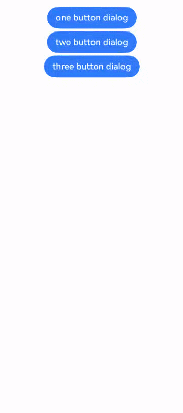
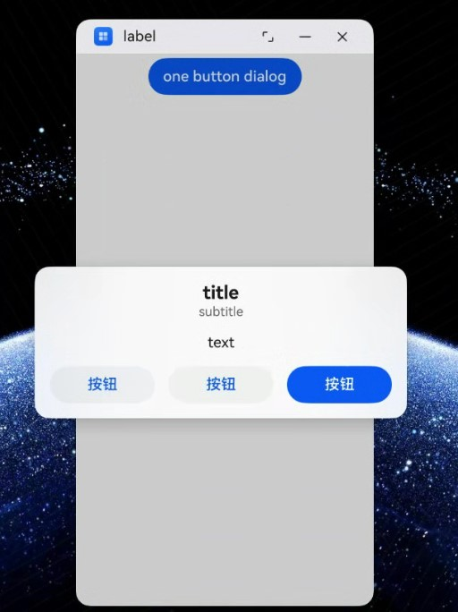

# 警告弹窗 (AlertDialog)

显示警告弹窗组件，可设置文本内容与响应回调。

>  **说明：**
>
> 从API Version 7开始支持。后续版本如有新增内容，则采用上角标单独标记该内容的起始版本。
>
> 本模块功能依赖UI的执行上下文，不可在UI上下文不明确的地方使用，参见[UIContext](../js-apis-arkui-UIContext.md#uicontext)说明。
>
> 从API version 10开始，可以通过使用[UIContext](../js-apis-arkui-UIContext.md#uicontext)中的[showAlertDialog](../js-apis-arkui-UIContext.md#showalertdialog)来明确UI的执行上下文。

## 属性

| 名称    | 参数类型  | 参数描述 |
| ---- | --------------- | -------- |
| show | [AlertDialogParamWithConfirm](#alertdialogparamwithconfirm对象说明)&nbsp;\|&nbsp;[AlertDialogParamWithButtons](#alertdialogparamwithbuttons对象说明)&nbsp;\|&nbsp;[AlertDialogParamWithOptions](#alertdialogparamwithoptions10对象说明)<sup>10+</sup> | 定义并显示AlertDialog组件。 |

## AlertDialogParam对象说明

| 名称                              | 类型                                                         | 必填 | 描述                                                         |
| --------------------------------- | ------------------------------------------------------------ | ---- | ------------------------------------------------------------ |
| title                             | [ResourceStr](ts-types.md#resourcestr)                       | 否   | 弹窗标题。                                                   |
| subtitle<sup>10+</sup>            | [ResourceStr](ts-types.md#resourcestr)                       | 否   | 弹窗副标题。                                                 |
| message                           | [ResourceStr](ts-types.md#resourcestr)                       | 是   | 弹窗内容。                                                   |
| autoCancel                        | boolean                                                      | 否   | 点击遮障层时，是否关闭弹窗，true表示关闭弹窗。false表示不关闭弹窗。<br/>默认值：true |
| cancel                            | ()&nbsp;=&gt;&nbsp;void                                      | 否   | 点击遮障层关闭dialog时的回调。                               |
| alignment                         | [DialogAlignment](#dialogalignment枚举说明)                  | 否   | 弹窗在竖直方向上的对齐方式。<br/>默认值：DialogAlignment.Default |
| offset                            | [Offset](ts-types.md#offset)                                 | 否   | 弹窗相对alignment所在位置的偏移量。<br/>默认值：{&nbsp;dx:&nbsp;0&nbsp;,&nbsp;dy:&nbsp;0&nbsp;} |
| gridCount                         | number                                                       | 否   | 弹窗容器宽度所占用栅格数。<br/>默认值：4                     |
| maskRect<sup>10+</sup>            | [Rectangle](#rectangle8类型说明)                             | 否   | 弹窗遮蔽层区域，在遮蔽层区域内的事件不透传，在遮蔽层区域外的事件透传。<br/>默认值：{ x: 0, y: 0, width: '100%', height: '100%' } <br/>**说明：**<br/>showInSubWindow为true时，maskRect不生效。|
| showInSubWindow<sup>11+</sup>     | boolean                                                      | 否   | 某弹框需要显示在主窗口之外时，是否在子窗口显示此弹窗。<br/>默认值：false，弹窗显示在应用内，而非独立子窗口。<br/>**说明**：showInSubWindow为true的弹窗无法触发显示另一个showInSubWindow为true的弹窗。 |
| isModal<sup>11+</sup>             | boolean                                                      | 否   | 弹窗是否为模态窗口，模态窗口有蒙层，非模态窗口无蒙层。<br/>默认值：true，此时弹窗有蒙层。 |
| backgroundColor<sup>11+</sup>     | [ResourceColor](ts-types.md#resourcecolor)                   | 否   | 弹窗背板颜色。<br/>默认值：Color.Transparent                 |
| backgroundBlurStyle<sup>11+</sup> | [BlurStyle](ts-appendix-enums.md#blurstyle9)                 | 否   | 弹窗背板模糊材质。<br/>默认值：BlurStyle.COMPONENT_ULTRA_THICK |
| onWillDismiss<sup>12+</sup>       | Callback<[DismissDialogAction](#dismissdialogaction12类型说明)> | 否   | 交互式关闭回调函数。<br/>**说明：**<br/>1.当用户执行点击遮障层关闭、左滑/右滑、三键back、键盘ESC关闭交互操作时，如果注册该回调函数，则不会立刻关闭弹窗。在回调函数中可以通过reason得到阻拦关闭弹窗的操作类型，从而根据原因选择是否能关闭弹窗。当前组件返回的reason中，暂不支持CLOSE_BUTTON的枚举值。<br/>2.在onWillDismiss回调中，不能再做onWillDismiss拦截。 |
| cornerRadius<sup>12+</sup>        | [BorderRadiuses](ts-types.md#borderradiuses9)&nbsp;\|&nbsp;[Dimension](ts-types.md#dimension10) | 否   | 设置背板的圆角半径。<br />可分别设置4个圆角的半径。<br />默认值：{ topLeft: '24vp', topRight: '24vp', bottomLeft: '24vp', bottomRight: '24vp' }。<br /> 圆角大小受组件尺寸限制，最大值为组件宽或高的一半，若值为负，则按照0处理。 <br /> 百分比参数方式：以父元素弹窗宽和高的百分比来设置弹窗的圆角。|
| transition<sup>12+</sup>          | [TransitionEffect](ts-transition-animation-component.md#transitioneffect10) | 否   | 设置弹窗显示和退出的过渡效果。<br/>**说明：**<br/> 1.如果不设置，则使用默认的显示/退出动效。<br/> 2.显示动效中按back键，打断显示动效，执行退出动效，动画效果为显示动效与退出动效的曲线叠加后的效果。<br/> 3.退出动效中按back键，不会打断退出动效，退出动效继续执行，继续按back键退出应用。                               |
| width<sup>12+</sup>               | [Dimension](ts-types.md#dimension10) | 否   | 设置弹窗背板的宽度。<br>width和gridCount同时设置时，width优先。<br />**说明：**<br /> 弹窗的宽度百分比是相对主窗口或子窗口(showInSubWindow)的宽度。<br />非showInSubWindow弹窗宽度的最大尺寸是主窗口宽度，showInSubWindow弹窗宽度的最大尺寸是子窗口宽度。|
| height<sup>12+</sup>              | [Dimension](ts-types.md#dimension10)                         | 否   | 设置弹窗背板的高度。<br />**说明：**<br />弹窗的高度百分比是相对主窗口或子窗口(showInSubWindow)的高度。<br />当高度设置100%，非showInSubWindow弹窗高度的最大尺寸是主窗口高度，showInSubWindow弹窗高度的最大尺寸是子窗口高度。<br />设置弹窗对齐方式，弹出的显示区域不足，会剪裁弹窗。|
| borderWidth<sup>12+</sup>         | [Dimension](ts-types.md#dimension10)&nbsp;\|&nbsp;[EdgeWidths](ts-types.md#edgewidths9) | 否   | <br />可分别设置4个边框宽度。<br />默认值：0。<br /> 百分比参数方式：以父元素弹窗宽的百分比来设置弹窗的边框宽度。<br />当弹窗左边框和右边框大于弹窗宽度，弹窗上边框和下边框大于弹窗高度，显示可能不符合预期。|
| borderColor<sup>12+</sup>         | [ResourceColor](ts-types.md#resourcecolor)&nbsp;\|&nbsp;[EdgeColors](ts-types.md#edgecolors9) | 否   | 设置弹窗背板的边框颜色。<br/>默认值：Color.Black。<br/> 如果使用borderColor属性，需要和borderWidth属性一起使用。 |
| borderStyle<sup>12+</sup>         | [BorderStyle](ts-appendix-enums.md#borderstyle)&nbsp;\|&nbsp;[EdgeStyles](ts-types.md#edgestyles9) | 否   | 设置弹窗背板的边框样式。<br/>默认值：BorderStyle。<br/> 如果使用borderStyle属性，需要和borderWidth属性一起使用。 |
| shadow<sup>12+</sup>              | [ShadowOptions](ts-universal-attributes-image-effect.md#shadowoptions对象说明)&nbsp;\|&nbsp;[ShadowStyle](ts-universal-attributes-image-effect.md#shadowstyle10枚举说明) | 否   | 设置弹窗背板的阴影。                                         |

## AlertDialogParamWithConfirm对象说明

继承自[AlertDialogParam](#alertdialogparam对象说明)。

| 参数名       | 参数类型     | 必填     | 参数描述         |
| ---------- | ---------------- | ---------- | ------------------------------- |
| confirm    | {<br/>enabled<sup>10+</sup>?: boolean,<br/>defaultFocus<sup>10+</sup>?: boolean,<br />style<sup>10+</sup>?: [DialogButtonStyle](#dialogbuttonstyle10枚举说明),<br />value:&nbsp;[ResourceStr](ts-types.md#resourcestr),<br/>fontColor?:&nbsp;[ResourceColor](ts-types.md#resourcecolor),<br/>backgroundColor?:&nbsp;&nbsp;[ResourceColor](ts-types.md#resourcecolor),<br/>action:&nbsp;()&nbsp;=&gt;&nbsp;void<br/>} | 否   | 确认Button的使能状态、默认焦点、按钮风格、文本内容、文本色、按钮背景色和点击回调。<br />enabled：点击Button是否响应，true表示Button可以响应，false表示Button不可以响应。<br />默认值：true<br />defaultFocus：设置Button是否是默认焦点，true表示Button是默认焦点，false表示Button不是默认焦点。<br />默认值：false<br />style：设置Button的风格样式。<br />默认值：DialogButtonStyle.DEFAULT。<br />value：Button文本内容。<br />fontColor：Button文本颜色。<br />backgroundColor：Button背景颜色。<br />action：&nbsp;Button选中时的回调。 |

## AlertDialogParamWithButtons对象说明

继承自[AlertDialogParam](#alertdialogparam对象说明)。

| 参数名             | 参数类型                | 必填     | 参数描述                     |
| --------------- | ---------------------- | ------------ | --------------------- |
| primaryButton   | {<br/>enabled<sup>10+</sup>?: boolean,<br/>defaultFocus<sup>10+</sup>?: boolean,<br />style<sup>10+</sup>?: [DialogButtonStyle](#dialogbuttonstyle10枚举说明),<br />value:&nbsp;[ResourceStr](ts-types.md#resourcestr),<br/>fontColor?:&nbsp;[ResourceColor](ts-types.md#resourcecolor),<br/>backgroundColor?:&nbsp;[ResourceColor](ts-types.md#resourcecolor),<br/>action:&nbsp;()&nbsp;=&gt;&nbsp;void;<br/>} | 否 | 确认Button的使能状态、默认焦点、按钮风格、文本内容、文本色、按钮背景色和点击回调。<br />enabled：点击Button是否响应。<br />默认值：true<br />defaultFocus：设置Button是否是默认焦点。<br />默认值：false<br />style：设置Button的风格样式。<br />默认值：DialogButtonStyle.DEFAULT。<br />value：Button文本内容。<br />fontColor：Button文本颜色。<br />backgroundColor：Button背景颜色。<br />action：&nbsp;Button选中时的回调。 |
| secondaryButton | {<br/>enabled<sup>10+</sup>?: boolean,<br/>defaultFocus<sup>10+</sup>?: boolean,<br />style<sup>10+</sup>?: [DialogButtonStyle](#dialogbuttonstyle10枚举说明),<br />value:&nbsp;[ResourceStr](ts-types.md#resourcestr),<br/>fontColor?:&nbsp;[ResourceColor](ts-types.md#resourcecolor),<br/>backgroundColor?:&nbsp;[ResourceColor](ts-types.md#resourcecolor),<br/>action:&nbsp;()&nbsp;=&gt;&nbsp;void;<br/>} | 否  | 确认Button的使能状态、默认焦点、按钮风格、文本内容、文本色、按钮背景色和点击回调。<br />enabled：点击Button是否响应。<br />默认值：true。<br />defaultFocus：设置Button是否是默认焦点。<br />默认值：false。<br />style：设置Button的风格样式。<br />默认值：DialogButtonStyle.DEFAULT。<br />value：Button文本内容。<br />fontColor：Button文本颜色。<br />backgroundColor：Button背景颜色。<br />action：&nbsp;Button选中时的回调。 |

## AlertDialogParamWithOptions<sup>10+</sup>对象说明

继承自[AlertDialogParam](#alertdialogparam对象说明)。

| 参数名             | 参数类型                | 必填     | 参数描述                     |
| --------------- | ---------------------- | ------------ | --------------------- |
| buttons<sup>10+</sup>       | Array&lt;[AlertDialogButtonOptions](#alertdialogbuttonoptions10对象说明)&gt;                 | 否  | 弹窗容器中的多个按钮。 |
|buttonDirection<sup>10+</sup>      | [DialogButtonDirection](#dialogbuttondirection10枚举说明)| 否  | 按钮排布方向默认值为DialogButtonDirection.AUTO，建议3个以上按钮使用Auto模式（两个以上按钮会切换为纵向模式，通常能显示更多按钮），非Auto模式下，3个以上按钮可能会显示不全，超出显示范围的按钮会被截断。|

## AlertDialogButtonOptions<sup>10+</sup>对象说明
| 参数名             | 参数类型                | 必填     | 参数描述                     |
| ------------------| ---------------------- | ------------ | --------------------- |
| enabled           | boolean | 否     | 点击Button是否响应，默认值true。        |
| defaultFocus           | boolean | 否     | 设置Button是否是默认焦点，默认值false。        |
| style           | [DialogButtonStyle](#dialogbuttonstyle10枚举说明) | 否     | 设置Button的风格样式，默认值DialogButtonStyle.DEFAULT。        |
| value           | [ResourceStr](ts-types.md#resourcestr) | 是     | Button的文本内容，若值为null，则该按钮不显示。        |
| fontColor           | [ResourceColor](ts-types.md#resourcecolor) | 否     | Button的文本颜色。        |
| backgroundColor           | [ResourceColor](ts-types.md#resourcecolor) | 否     | Button背景颜色。        |
| action           | 	() => void | 是     | Button选中时的回调。        |

## DialogButtonDirection<sup>10+</sup>枚举说明
| 名称                       | 描述      |
| -------------------------- | --------- |
| AUTO                      | 两个及以下按钮水平排布，两个以上为竖直排布。 |
| HORIZONTAL                      | 按钮水平布局。 |
| VERTICAL                      | 按钮竖直布局。 |

confirm参数优先级：fontColor、backgroundColor  > style > defaultFocus

| backgroundColor | fontColor | style                       | defaultFocus | 效果     |
| --------------- | --------- | --------------------------- | ------------ | -------- |
| 绿底            | 红字      | -                           | -            | 绿底红字 |
| 绿底            | -         | DialogButtonStyle.HIGHLIGHT | -            | 绿底白字 |
| 绿底            | -         | DialogButtonStyle.DEFAULT   | -            | 绿底蓝字 |
| 绿底            | -         | -                           | TRUE         | 绿底白字 |
| 绿底            | -         | -                           | FALSE/-      | 绿底蓝字 |
| -               | 红字      | DialogButtonStyle.HIGHLIGHT | -            | 蓝底红字 |
| -               | 红字      | DialogButtonStyle.DEFAULT   | -            | 白底红字 |
| -               | 红字      | -                           | TRUE         | 蓝底红字 |
| -               | 红字      | -                           | FALSE/-      | 白底红字 |
| -               | -         | DialogButtonStyle.HIGHLIGHT | -            | 蓝底白字 |
| -               | -         | DialogButtonStyle.DEFAULT   | -            | 白底蓝字 |
| -               | -         | -                           | TRUE         | 蓝底白字 |
| -               | -         | -                           | FALSE/-      | 白底蓝字 |

## DialogAlignment枚举说明

| 名称                       | 描述      |
| ------------------------ | ------- |
| Top                      | 垂直顶部对齐。 |
| Center                   | 垂直居中对齐。 |
| Bottom                   | 垂直底部对齐。 |
| Default                  | 默认对齐。   |
| TopStart<sup>8+</sup>    | 左上对齐。   |
| TopEnd<sup>8+</sup>      | 右上对齐。   |
| CenterStart<sup>8+</sup> | 左中对齐。   |
| CenterEnd<sup>8+</sup>   | 右中对齐。   |
| BottomStart<sup>8+</sup> | 左下对齐。   |
| BottomEnd<sup>8+</sup>   | 右下对齐。   |

## Rectangle<sup>8+</sup>类型说明

Rectangle是各种Dialog中maskRect参数的类型。

| 名称     | 类型                           | 必填 | 描述                                |
|--------|------------------------------|----|-----------------------------------|
| x      | [Length](ts-types.md#length) | 否  | 弹窗遮蔽层区域相对于窗口左上角的x轴坐标。<br/>默认值：0vp |
| y      | [Length](ts-types.md#length) | 否  | 弹窗遮蔽层区域相对于窗口左上角的y轴坐标。<br/>默认值：0vp |
| width  | [Length](ts-types.md#length) | 否  | 弹窗遮蔽层区域的宽度。<br/>默认值：'100%'        |
| height | [Length](ts-types.md#length) | 否  | 弹窗遮蔽层区域的高度。<br/>默认值：'100%'        |

>  **说明：**
>
>  x和y可以设置正负值百分比。当x设置为'100%'时表示遮蔽层区域往右偏移窗口本身宽度大小，当x设置为'-100%'时表示遮蔽层区域往左偏移窗口本身宽度大小。当y设置为'100%'时表示遮蔽层区域往下偏移窗口本身高度大小，当y设置为'-100%'时表示遮蔽层区域往上偏移窗口本身高度大小。
>
>  width和height只能设置正值，支持百分比，如果设置为负值，那么该值将被重置为默认值。
>
>  百分比相对于窗口自身宽高进行计算。

## DialogButtonStyle<sup>10+</sup>枚举说明

| 名称      | 描述                              |
| --------- | --------------------------------- |
| DEFAULT   | 白底蓝字（深色主题：白底=黑底）。 |
| HIGHLIGHT | 蓝底白字。                        |

## DismissDialogAction<sup>12+</sup>类型说明

| 名称     | 类型                                 | 必填 | 描述                                                           |
|----------|-------------------------------------|------|----------------------------------------------------------------|
| dismiss  | Callback&lt;void&gt;                            |  是  | Dialog关闭回调函数。开发者需要退出时调用，不需要退出时无需调用。    |
| reason   | [DismissReason](#dismissreason12枚举说明) |  是  | Dialog无法关闭原因。根据开发者需要选择不同操作下，Dialog是否需要关闭。 |

## DismissReason<sup>12+</sup>枚举说明

| 名称             | 描述                             |
| --------------- | -------------------------------- |
| PRESS_BACK      | 点击三键back、左滑/右滑、键盘ESC。  |
| TOUCH_OUTSIDE   | 点击遮障层时。                     |
| CLOSE_BUTTON    | 点击关闭按钮。                     |

## 示例

### 示例1

```ts
// xxx.ets
@Entry
@Component
struct AlertDialogExample {
  build() {
    Column({ space: 5 }) {
      Button('one button dialog')
        .onClick(() => {
          AlertDialog.show(
            {
              title: 'title',
              message: 'text',
              autoCancel: true,
              alignment: DialogAlignment.Bottom,
              offset: { dx: 0, dy: -20 },
              gridCount: 3,
              confirm: {
                value: 'button',
                action: () => {
                  console.info('Button-clicking callback')
                }
              },
              cancel: () => {
                console.info('Closed callbacks')
              },
              onWillDismiss:(dismissDialogAction: DismissDialogAction)=> {
                console.info("reason=" + JSON.stringify(dismissDialogAction.reason))
                console.log("dialog onWillDismiss")
                if (dismissDialogAction.reason == DismissReason.PRESS_BACK) {
                  dismissDialogAction.dismiss()
                }
                if (dismissDialogAction.reason == DismissReason.TOUCH_OUTSIDE) {
                  dismissDialogAction.dismiss()
                }
              }
            }
          )
        })
        .backgroundColor(0x317aff)
      Button('two button dialog')
        .onClick(() => {
          AlertDialog.show(
            {
              title: 'title',
              subtitle: 'subtitle',
              message: 'text',
              autoCancel: true,
              alignment: DialogAlignment.Bottom,
              gridCount: 4,
              offset: { dx: 0, dy: -20 },
              primaryButton: {
                value: 'cancel',
                action: () => {
                  console.info('Callback when the first button is clicked')
                }
              },
              secondaryButton: {
                enabled: true,
                defaultFocus: true,
                style: DialogButtonStyle.HIGHLIGHT,
                value: 'ok',
                action: () => {
                  console.info('Callback when the second button is clicked')
                }
              },
              cancel: () => {
                console.info('Closed callbacks')
              },
              onWillDismiss:(dismissDialogAction: DismissDialogAction)=> {
                console.info("reason=" + JSON.stringify(dismissDialogAction.reason))
                console.log("dialog onWillDismiss")
                if (dismissDialogAction.reason == DismissReason.PRESS_BACK) {
                  dismissDialogAction.dismiss()
                }
                if (dismissDialogAction.reason == DismissReason.TOUCH_OUTSIDE) {
                  dismissDialogAction.dismiss()
                }
              } 
            }
          )
        }).backgroundColor(0x317aff)
        Button('three button dialog')
        .onClick(() => {
          AlertDialog.show(
            {
              title: 'title',
              subtitle: 'subtitle',
              message: 'text',
              autoCancel: true,
              alignment: DialogAlignment.Bottom,
              gridCount: 4,
              offset: { dx: 0, dy: -20 },
              buttonDirection: DialogButtonDirection.HORIZONTAL,
              buttons: [
                {
                  value: '按钮',
                  action: () => {
                    console.info('Callback when button1 is clicked')
                  }
                },
                {
                  value: '按钮',
                  action: () => {
                    console.info('Callback when button2 is clicked')
                  }
                },
                {
                  value: '按钮',
                  enabled: true,
                  defaultFocus: true,
                  style: DialogButtonStyle.HIGHLIGHT,
                  action: () => {
                    console.info('Callback when button3 is clicked')
                  }
                },
              ],
              cancel: () => {
                console.info('Closed callbacks')
              },
              onWillDismiss:(dismissDialogAction: DismissDialogAction)=> {
                console.info("reason=" + JSON.stringify(dismissDialogAction.reason))
                console.log("dialog onWillDismiss")
                if (dismissDialogAction.reason == DismissReason.PRESS_BACK) {
                  dismissDialogAction.dismiss()
                }
                if (dismissDialogAction.reason == DismissReason.TOUCH_OUTSIDE) {
                  dismissDialogAction.dismiss()
                }
              }
            }
          )
        }).backgroundColor(0x317aff)
    }.width('100%').margin({ top: 5 })
  }
}
```



### 示例2

```ts
// xxx.ets
@Entry
@Component
struct AlertDialogExample {
  build() {
    Column({ space: 5 }) {
      Button('one button dialog')
        .onClick(() => {
          AlertDialog.show(
            {
              title: 'title',
              subtitle: 'subtitle',
              message: 'text',
              autoCancel: true,
              alignment: DialogAlignment.Center,
              gridCount: 4,
              showInSubWindow: true,
              isModal: true,
              offset: { dx: 0, dy: -20 },
              buttonDirection: DialogButtonDirection.HORIZONTAL,
              buttons: [
                {
                  value: '按钮',
                  action: () => {
                    console.info('Callback when button1 is clicked')
                  }
                },
                {
                  value: '按钮',
                  action: () => {
                    console.info('Callback when button2 is clicked')
                  }
                },
                {
                  value: '按钮',
                  enabled: true,
                  defaultFocus: true,
                  style: DialogButtonStyle.HIGHLIGHT,
                  action: () => {
                    console.info('Callback when button3 is clicked')
                  }
                },
              ],
              cancel: () => {
                console.info('Closed callbacks')
              },
              onWillDismiss: (dismissDialogAction: DismissDialogAction) => {
                console.info("reason=" + JSON.stringify(dismissDialogAction.reason))
                console.log("dialog onWillDismiss")
                if (dismissDialogAction.reason == DismissReason.PRESS_BACK) {
                  dismissDialogAction.dismiss()
                }
                if (dismissDialogAction.reason == DismissReason.TOUCH_OUTSIDE) {
                  dismissDialogAction.dismiss()
                }
              }
            })
        })
    }.width('100%').margin({ top: 5 }).backgroundColor(0x317aff)
  }
}
```



### 示例3
AlertDialog显示动画持续3秒，退出动画持续100毫秒
```ts
// xxx.ets
import router from '@ohos.router';
@Entry
@Component
struct AlertDialogExample {
  build() {
    Column({ space: 5 }) {
      Button('AlertDialog Set Duration')
        .onClick(()=>{
            AlertDialog.show(
              {
                title: 'AlertDialog 1',
                message: 'Set Animation Duration open 3 second, close 100ms',
                autoCancel: true,
                alignment: DialogAlignment.Top,
                offset: { dx: 0, dy: -20 },
                gridCount: 3,
                transition:TransitionEffect.asymmetric(TransitionEffect.OPACITY
                  .animation({ duration: 3000, curve: Curve.Sharp }).combine(TransitionEffect.scale({x: 1.5, y: 1.5}).animation({duration: 3000, curve: Curve.Sharp})),
                  TransitionEffect.OPACITY.animation({ duration: 100, curve: Curve.Smooth })
                    .combine(TransitionEffect.scale({x: 0.5, y: 0.5}).animation({duration: 100, curve: Curve.Smooth}))),
                confirm: {
                  value: 'button',
                  action: () => {
                    console.info('Button-clicking callback')
                  }
                },
                cancel: () => {
                  console.info('Closed callbacks')
                }
              }
            )
        })
        .backgroundColor(0x317aff).height("88px")
    }.width('100%').margin({ top: 5 })
  }
}
```

