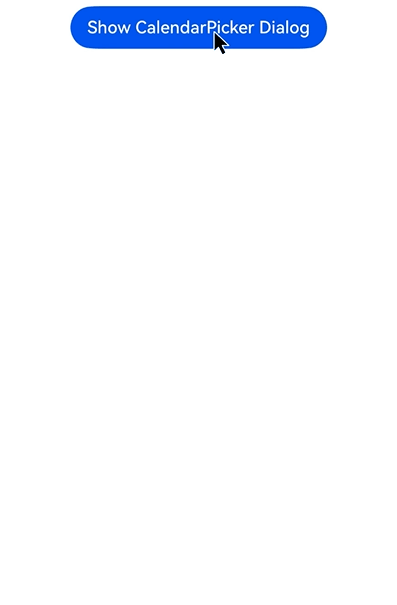

# 日历选择器弹窗 (CalendarPickerDialog)

点击日期弹出日历选择器弹窗，可选择弹窗内任意日期。

> **说明：**
>
> 该组件从API Version 10开始支持。后续版本如有新增内容，则采用上角标单独标记该内容的起始版本。
>
> 本模块功能依赖UI的执行上下文，不可在UI上下文不明确的地方使用，参见[UIContext](../js-apis-arkui-UIContext.md#uicontext)说明。

## CalendarPickerDialog.show

static show(options?: CalendarDialogOptions)

定义日历选择器弹窗并弹出。

**元服务API：** 从API version 11开始，该接口支持在元服务中使用。

**系统能力：** SystemCapability.ArkUI.ArkUI.Full

**参数：** 

| 参数名  | 类型                                                    | 必填 | 说明                       |
| ------- | ------------------------------------------------------- | ---- | -------------------------- |
| options | [CalendarDialogOptions](#calendardialogoptions对象说明) | 否   | 配置日历选择器弹窗的参数。 |

## CalendarDialogOptions对象说明

继承自[CalendarOptions](ts-basic-components-calendarpicker.md#calendaroptions对象说明)。

| 名称       | 类型                                            | 必填 | 描述                                                         |
| ---------- | ----------------------------------------------- | ---- | ------------------------------------------------------------ |
| onAccept   | (value: Date) => void                           | 否   | 点击弹窗中的“确定”按钮时触发该回调。<br/>value：选中的日期值。<br />**元服务API：** 从API version 11开始，该接口支持在元服务中使用。 |
| onCancel   | () => void                                      | 否   | 点击弹窗中的“取消”按钮时触发该回调。<br />**元服务API：** 从API version 11开始，该接口支持在元服务中使用。                         |
| onChange   | (value: Date) => void                           | 否   | 选择弹窗中日期使当前选中项改变时触发该回调。<br/>value：选中的日期值。<br />**元服务API：** 从API version 11开始，该接口支持在元服务中使用。 |
| backgroundColor<sup>11+</sup> | [ResourceColor](ts-types.md#resourcecolor)  | 否 | 弹窗背板颜色。<br/>默认值：Color.Transparent。<br/>**元服务API：** 从API version 12开始，该接口支持在元服务中使用。 |
| backgroundBlurStyle<sup>11+</sup> | [BlurStyle](ts-appendix-enums.md#blurstyle9) | 否 | 弹窗背板模糊材质。<br/>默认值：BlurStyle.COMPONENT_ULTRA_THICK。<br/>**元服务API：** 从API version 12开始，该接口支持在元服务中使用。 |
| acceptButtonStyle<sup>12+</sup> | [PickerDialogButtonStyle](ts-methods-datepicker-dialog.md#pickerdialogbuttonstyle12类型说明) | 否 | 设置确认按钮显示样式、样式和重要程度、角色、背景色、圆角、文本颜色、字号、字体粗细、字体样式、字体列表、按钮是否默认响应Enter键。<br />**说明：**<br />acceptButtonStyle与cancelButtonStyle中最多只能有一个primary字段配置为true，二者primary字段均配置为true时均不生效。|
| cancelButtonStyle<sup>12+</sup> | [PickerDialogButtonStyle](ts-methods-datepicker-dialog.md#pickerdialogbuttonstyle12类型说明) | 否 | 设置取消按钮显示样式、样式和重要程度、角色、背景色、圆角、文本颜色、字号、字体粗细、字体样式、字体列表、按钮是否默认响应Enter键。<br />**说明：**<br />acceptButtonStyle与cancelButtonStyle中最多只能有一个primary字段配置为true，二者primary字段均配置为true时均不生效。|
| onDidAppear<sup>12+</sup> | () => void | 否 | 弹窗弹出时的事件回调。<br />**说明：**<br />1.正常时序依次为：onWillAppear>>onDidAppear>>(onAccept/onCancel/onChange)>>onWillDisappear>>onDidDisappear。<br />2.在onDidAppear内设置改变弹窗显示效果的回调事件，二次弹出生效。<br />3.快速点击弹出，消失弹窗时，存在onWillDisappear在onDidAppear前生效。<br />4. 当弹窗入场动效未完成时关闭弹窗，该回调不会触发。 |
| onDidDisappear<sup>12+</sup> | () => void | 否 | 弹窗消失时的事件回调。<br />**说明：**<br />1.正常时序依次为：onWillAppear>>onDidAppear>>(onAccept/onCancel/onChange)>>onWillDisappear>>onDidDisappear。 |
| onWillAppear<sup>12+</sup> | () => void | 否 | 弹窗显示动效前的事件回调。<br />**说明：**<br />1.正常时序依次为：onWillAppear>>onDidAppear>>(onAccept/onCancel/onChange)>>onWillDisappear>>onDidDisappear。<br />2.在onWillAppear内设置改变弹窗显示效果的回调事件，二次弹出生效。 |
| onWillDisappear<sup>12+</sup> | () => void | 否 | 弹窗退出动效前的事件回调。<br />**说明：**<br />1.正常时序依次为：onWillAppear>>onDidAppear>>(onAccept/onCancel/onChange)>>onWillDisappear>>onDidDisappear。<br />2.快速点击弹出，消失弹窗时，存在onWillDisappear在onDidAppear前生效。 |
| shadow<sup>12+</sup>              | [ShadowOptions](ts-universal-attributes-image-effect.md#shadowoptions对象说明)&nbsp;\|&nbsp;[ShadowStyle](ts-universal-attributes-image-effect.md#shadowstyle10枚举说明) | 否   | 设置弹窗背板的阴影。<br /> 当设备为2in1时，默认场景下获焦阴影值为ShadowStyle.OUTER_FLOATING_MD，失焦为ShadowStyle.OUTER_FLOATING_SM                 |  

## 示例

### 示例1

CalendarPickerDialog基本使用

```ts
// xxx.ets
@Entry
@Component
struct CalendarPickerDialogExample {
  private selectedDate: Date = new Date()
  build() {
    Column() {
      Button("Show CalendarPicker Dialog")
        .margin(20)
        .onClick(() => {
          console.info("CalendarDialog.show")
          CalendarPickerDialog.show({
            selected: this.selectedDate,
            onAccept: (value) => {
              console.info("calendar onAccept:" + JSON.stringify(value))
            },
            onCancel: () => {
              console.info("calendar onCancel")
            },
            onChange: (value) => {
              console.info("calendar onChange:" + JSON.stringify(value))
            },
            onDidAppear: () => {
              console.info("calendar onDidAppear")
            },
            onDidDisappear: () => {
              console.info("calendar onDidDisappear")
            },
            onWillAppear: () => {
              console.info("calendar onWillAppear")
            },
            onWillDisappear: () => {
              console.info("calendar onWillDisappear")
            }
          })
        })
    }.width('100%')
  }
}
```



### 示例2

按钮支持自定义样式

```ts
// xxx.ets
@Entry
@Component
struct CalendarPickerDialogExample {
  private selectedDate: Date = new Date()
  build() {
    Column() {
      Button("Show CalendarPicker Dialog")
        .margin(20)
        .onClick(() => {
          console.info("CalendarDialog.show")
          CalendarPickerDialog.show({
            selected: this.selectedDate,
            acceptButtonStyle: { type: ButtonType.Normal, style: ButtonStyleMode.NORMAL, role: ButtonRole.NORMAL, fontColor: Color.Red,
              fontSize: '26fp', fontWeight: FontWeight.Bolder, fontStyle: FontStyle.Normal, fontFamily: 'sans-serif', backgroundColor:'#80834511',
              borderRadius: 20 },
            cancelButtonStyle: { type: ButtonType.Normal, style: ButtonStyleMode.NORMAL, role: ButtonRole.NORMAL, fontColor: Color.Blue,
              fontSize: '16fp', fontWeight: FontWeight.Normal, fontStyle: FontStyle.Italic, fontFamily: 'sans-serif', backgroundColor:'#50182431',
              borderRadius: 10 },
            onAccept: (value) => {
              console.info("calendar onAccept:" + JSON.stringify(value))
            },
            onCancel: () => {
              console.info("calendar onCancel")
            },
            onChange: (value) => {
              console.info("calendar onChange:" + JSON.stringify(value))
            },
            onDidAppear: () => {
              console.info("calendar onDidAppear")
            },
            onDidDisappear: () => {
              console.info("calendar onDidDisappear")
            },
            onWillAppear: () => {
              console.info("calendar onWillAppear")
            },
            onWillDisappear: () => {
              console.info("calendar onWillDisappear")
            }
          })
        })
    }.width('100%')
  }
}
```

