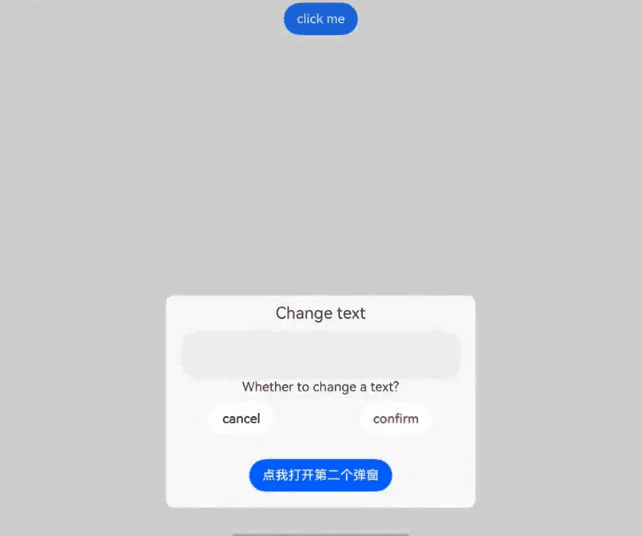

# 自定义弹窗 (CustomDialog)

通过CustomDialogController类显示自定义弹窗。使用弹窗组件时，优先考虑自定义弹窗，便于弹窗样式与内容的自定义。

> **说明：**
>
> 从API version 7开始支持。后续版本如有新增内容，则采用上角标单独标记该内容的起始版本。


## 接口

constructor(value: CustomDialogControllerOptions)

配置自定义弹窗的参数。

> **说明：**
>
> 自定义弹窗的所有参数，不支持动态刷新。
>
> 在CustomDialogController作为全局变量以实现全局自定义弹窗的场景下，若对controller重新赋值，则无法通过其关闭之前的弹窗。建议在重新赋值前先关闭弹窗。
>
> 在自定义弹窗内拉起另一个自定义弹窗时，不建议直接关闭拉起方。

**原子化服务API：** 从API version 11开始，该接口支持在原子化服务中使用。

**系统能力：** SystemCapability.ArkUI.ArkUI.Full

**参数：**

| 参数名 | 类型                                                         | 必填 | 说明                   |
| ------ | ------------------------------------------------------------ | ---- | ---------------------- |
| value  | [CustomDialogControllerOptions](#customdialogcontrolleroptions对象说明) | 是   | 配置自定义弹窗的参数。 |

## CustomDialogControllerOptions对象说明

自定义弹窗的样式。

**系统能力：** SystemCapability.ArkUI.ArkUI.Full

| 名称                           | 类型                                     | 只读 | 可选 | 说明                                     |
| ----------------------------- | ---------------------------------------- | ---- | ---------------------------------------- | ---------------------------------------- |
| builder                       | [CustomDialog](../../../ui/arkts-common-components-custom-dialog.md) | 否   | 否   | 自定义弹窗内容构造器。<br/>**说明：** <br/>若builder构造器使用回调函数作为入参，请注意使用this绑定问题，如builder: custombuilder({ callback: ()=> {...}})。<br/>若在builder中监听数据变化可以使用@Link或@Consume，而其他方式如@Prop、@ObjectLink不适用此场景。<br/>**原子化服务API：** 从API version 11开始，该接口支持在原子化服务中使用。 |
| cancel                        | ()&nbsp;=&gt;&nbsp;void                  | 否    | 是   | 返回、ESC键和点击遮障层弹窗退出时的回调。<br/>**原子化服务API：** 从API version 11开始，该接口支持在原子化服务中使用。 |
| autoCancel                    | boolean                                  | 否    | 是   | 是否允许点击遮障层退出，true表示关闭弹窗。false表示不关闭弹窗。<br>默认值：true<br/>**原子化服务API：** 从API version 11开始，该接口支持在原子化服务中使用。 |
| alignment                     | [DialogAlignment](ts-methods-alert-dialog-box.md#dialogalignment枚举说明) | 否    | 是   | 弹窗在竖直方向上的对齐方式。<br>默认值：DialogAlignment.Default<br/>**原子化服务API：** 从API version 11开始，该接口支持在原子化服务中使用。 |
| offset                        | [Offset](ts-types.md#offset)             | 否    | 是   | 弹窗相对alignment所在位置的偏移量。<br/>默认值：{ dx: 0, dy: 0 }<br/>**原子化服务API：** 从API version 11开始，该接口支持在原子化服务中使用。 |
| customStyle                   | boolean                                  | 否    | 是   | 弹窗容器样式是否自定义。值为true表示弹窗容器样式不能自定义，值为false表示弹窗样式可以自定义。<br>设置false时（默认值）：<br/>1.圆角为32vp。<br/>2.未设置弹窗宽度高度：弹窗容器的宽度根据栅格系统自适应。高度自适应自定义的内容节点。<br/>3.设置弹窗宽度高度：弹窗容器的宽度不超过默认样式下的最大宽度（自定义节点设置100%的宽度），弹窗容器的高度不超过默认样式下的最大高度（自定义节点设置100%的高度）。<br/>4.受安全区域的影响，弹窗显示区域将排除安全区域。<br/>设置为true：<br/>1.圆角为0，弹窗背景色为透明色。<br/>2.不支持设置弹窗宽度、高度、边框宽度、边框样式、边框颜色以及阴影宽度。<br/>3.弹窗显示区域为屏幕。<br/>**原子化服务API：** 从API version 11开始，该接口支持在原子化服务中使用。|
| gridCount<sup>8+</sup>        | number                                   | 否    | 是   | 弹窗宽度占[栅格宽度](../../../ui/arkts-layout-development-grid-layout.md)的个数。<br>默认为按照窗口大小自适应，异常值按默认值处理，最大栅格数为系统最大栅格数。<br/>取值范围：大于等于0的整数。<br/>**原子化服务API：** 从API version 11开始，该接口支持在原子化服务中使用。 |
| maskColor<sup>10+</sup>       | [ResourceColor](ts-types.md#resourcecolor) | 否    | 是   | 自定义蒙层颜色。<br>默认值：0x33000000<br/>**原子化服务API：** 从API version 11开始，该接口支持在原子化服务中使用。              |
| maskRect<sup>10+</sup>        | [Rectangle](ts-methods-alert-dialog-box.md#rectangle8类型说明) | 否     | 是    | 弹窗遮蔽层区域，在遮蔽层区域内的事件不透传，在遮蔽层区域外的事件透传。<br/>默认值：{ x: 0, y: 0, width: '100%', height: '100%' } <br/>**说明：**<br/>showInSubWindow为true时，maskRect不生效。<br/>**原子化服务API：** 从API version 11开始，该接口支持在原子化服务中使用。|
| openAnimation<sup>10+</sup>   | [AnimateParam](ts-explicit-animation.md#animateparam对象说明) | 否    | 是   | 自定义设置弹窗弹出的动画效果相关参数。<br>**说明**：<br>tempo默认值为1，当设置小于等于0的值时按默认值处理。<br/>iterations默认值为1，默认播放一次，设置为其他数值时按默认值处理。<br>playMode控制动画播放模式，默认值为PlayMode.Normal，设置为其他数值时按照默认值处理。<br/>**原子化服务API：** 从API version 11开始，该接口支持在原子化服务中使用。 |
| closeAnimation<sup>10+</sup>  | [AnimateParam](ts-explicit-animation.md#animateparam对象说明) | 否    | 是   | 自定义设置弹窗关闭的动画效果相关参数。<br>**说明**：<br>tempo默认值为1，当设置小于等于0的值时按默认值处理。<br/>iterations默认值为1，默认播放一次，设置为其他数值时按默认值处理。<br>playMode控制动画播放模式，默认值为PlayMode.Normal，设置为其他数值时按照默认值处理。<br/>页面转场切换时，建议使用默认关闭动效。<br/>**原子化服务API：** 从API version 11开始，该接口支持在原子化服务中使用。 |
| showInSubWindow<sup>10+</sup> | boolean                                  | 否    | 是   | 某弹框需要显示在主窗口之外时，是否在子窗口显示此弹窗。值为true表示在子窗口显示弹窗。<br>默认值：false，弹窗显示在应用内，而非独立子窗口。<br>**说明**：showInSubWindow为true的弹窗无法触发显示另一个showInSubWindow为true的弹窗。不建议在showInSubWindow为true的弹窗中使用CalendarPicker、CalendarPickerDialog、DatePickerDialog、TextPickerDialog、TimePickerDialog、Toast组件，弹窗会影响上述组件行为。<br/>**原子化服务API：** 从API version 11开始，该接口支持在原子化服务中使用。 |
| backgroundColor<sup>10+</sup> | [ResourceColor](ts-types.md#resourcecolor)      | 否   | 是  | 设置弹窗背板填充。<br/>默认值：Color.Transparent<br />**说明：** 如果同时设置了内容构造器的背景色，则backgroundColor会被内容构造器的背景色覆盖。<br/>backgroundColor会与模糊属性backgroundBlurStyle叠加产生效果，如果不符合预期，可将backgroundBlurStyle设置为BlurStyle.NONE，即可取消模糊。<br/>**原子化服务API：** 从API version 11开始，该接口支持在原子化服务中使用。 |
| cornerRadius<sup>10+</sup>    | [Dimension](ts-types.md#dimension10)&nbsp;\|&nbsp;[BorderRadiuses](ts-types.md#borderradiuses9) | 否   | 是  | 设置背板的圆角半径。<br />可分别设置4个圆角的半径。<br />默认值：{ topLeft: '32vp', topRight: '32vp', bottomLeft: '32vp', bottomRight: '32vp' }<br />**说明**：自定义弹窗默认的背板圆角半径为32vp，如果需要使用cornerRadius属性，请和[borderRadius](ts-universal-attributes-border.md#borderradius)属性一起使用。<br/>**原子化服务API：** 从API version 11开始，该接口支持在原子化服务中使用。 |
| isModal<sup>11+</sup> | boolean | 否 | 是 | 弹窗是否为模态窗口。值为true表示为模态窗口且有蒙层，不可与弹窗周围其他控件进行交互，即蒙层区域无法事件透传。值为false表示为非模态窗口且无蒙层，可以与弹窗周围其他控件进行交互。<br/>默认值：true<br/>**原子化服务API：** 从API version 12开始，该接口支持在原子化服务中使用。 |
| onWillDismiss<sup>12+</sup> | Callback<[DismissDialogAction](#dismissdialogaction12)> | 否 | 是 | 交互式关闭回调函数。<br/>**说明：**<br/>1.当用户执行点击遮障层关闭、侧滑（左滑/右滑）、三键back、键盘ESC关闭交互操作时，如果注册该回调函数，则不会立刻关闭弹窗。在回调函数中可以通过reason得到阻拦关闭弹窗的操作类型，从而根据原因选择是否能关闭弹窗。当前组件返回的reason中，暂不支持CLOSE_BUTTON的枚举值。<br/>2.在onWillDismiss回调中，不能再做onWillDismiss拦截。 <br/>**原子化服务API：** 从API version 12开始，该接口支持在原子化服务中使用。|
| borderWidth<sup>12+</sup> | [Dimension](ts-types.md#dimension10)&nbsp;\|&nbsp;[EdgeWidths](ts-types.md#edgewidths9)  | 否 | 是 | 设置弹窗背板的边框宽度。<br />可分别设置4个边框宽度。<br />默认值：0。<br /> 百分比参数方式：以父元素弹窗宽的百分比来设置弹窗的边框宽度。<br />当弹窗左边框和右边框大于弹窗宽度，弹窗上边框和下边框大于弹窗高度，显示可能不符合预期。<br/>**原子化服务API：** 从API version 12开始，该接口支持在原子化服务中使用。|
| borderColor<sup>12+</sup> | [ResourceColor](ts-types.md#resourcecolor)&nbsp;\|&nbsp;[EdgeColors](ts-types.md#edgecolors9)  | 否 | 是 | 设置弹窗背板的边框颜色。<br/>默认值：Color.Black<br/>如果使用borderColor属性，需要和borderWidth属性一起使用。 <br/>**原子化服务API：** 从API version 12开始，该接口支持在原子化服务中使用。 |
| borderStyle<sup>12+</sup> | [BorderStyle](ts-appendix-enums.md#borderstyle)&nbsp;\|&nbsp;[EdgeStyles](ts-types.md#edgestyles9)  | 否 | 是 | 设置弹窗背板的边框样式。<br/>默认值：BorderStyle.Solid<br/>如果使用borderStyle属性，需要和borderWidth属性一起使用。 <br/>**原子化服务API：** 从API version 12开始，该接口支持在原子化服务中使用。 |
| width<sup>12+</sup> | [Dimension](ts-types.md#dimension10) | 否   | 是  | 设置弹窗背板的宽度。<br />**说明：**<br>- 弹窗宽度默认最大值：400vp。<br />- 百分比参数方式：弹窗参考宽度为所在窗口的宽度，在此基础上调小或调大。<br/>**原子化服务API：** 从API version 12开始，该接口支持在原子化服务中使用。|
| height<sup>12+</sup> | [Dimension](ts-types.md#dimension10)   | 否 | 是 | 设置弹窗背板的高度。<br />**说明：**<br />- 弹窗高度默认最大值：0.9 *（窗口高度 - 安全区域）。<br />- 百分比参数方式：弹窗参考高度为（窗口高度 - 安全区域），在此基础上调小或调大。<br/>**原子化服务API：** 从API version 12开始，该接口支持在原子化服务中使用。|
| shadow<sup>12+</sup> | [ShadowOptions](ts-universal-attributes-image-effect.md#shadowoptions对象说明)&nbsp;\|&nbsp;[ShadowStyle](ts-universal-attributes-image-effect.md#shadowstyle10枚举说明)   | 否 | 是 | 设置弹窗背板的阴影。 <br /> 当设备为2in1时，默认场景下获焦阴影值为ShadowStyle.OUTER_FLOATING_MD，失焦为ShadowStyle.OUTER_FLOATING_SM。其他设备默认无阴影。<br/>**原子化服务API：** 从API version 12开始，该接口支持在原子化服务中使用。|
| backgroundBlurStyle<sup>12+</sup> | [BlurStyle](ts-universal-attributes-background.md#blurstyle9)                 | 否   | 是  | 弹窗背板模糊材质。<br/>默认值：BlurStyle.COMPONENT_ULTRA_THICK <br/>**说明：** <br/>设置为BlurStyle.NONE即可关闭背景虚化。当设置了backgroundBlurStyle为非NONE值时，则不要设置backgroundColor，否则颜色显示将不符合预期效果。<br/>**原子化服务API：** 从API version 12开始，该接口支持在原子化服务中使用。 |
| backgroundBlurStyleOptions<sup>19+</sup> | [BackgroundBlurStyleOptions](ts-universal-attributes-background.md#backgroundblurstyleoptions10对象说明) | 否 | 是 | 背景模糊效果。默认值请参考BackgroundBlurStyleOptions类型说明。<br />**原子化服务API：** 从API version 19开始，该接口支持在原子化服务中使用。 |
| backgroundEffect<sup>19+</sup> | [BackgroundEffectOptions](ts-universal-attributes-background.md#backgroundeffectoptions11) | 否 | 是 | 背景效果参数。默认值请参考BackgroundEffectOptions类型说明。<br />**原子化服务API：** 从API version 19开始，该接口支持在原子化服务中使用。 |
| keyboardAvoidMode<sup>12+</sup> | [KeyboardAvoidMode](ts-universal-attributes-popup.md#keyboardavoidmode12枚举说明) | 否 | 是 | 用于设置弹窗是否在拉起软键盘时进行自动避让。<br/>默认值：KeyboardAvoidMode.DEFAULT<br/>**原子化服务API：** 从API version 12开始，该接口支持在原子化服务中使用。 |
| enableHoverMode<sup>14+</sup>     | boolean | 否   | 是  | 是否响应悬停态，值为true时，响应悬停态。<br />默认值：false，默认不响应。<br/>**原子化服务API：** 从API version 14开始，该接口支持在原子化服务中使用。|
| hoverModeArea<sup>14+</sup>       | [HoverModeAreaType](ts-appendix-enums.md#hovermodeareatype14) | 否   | 是  | 悬停态下弹窗默认展示区域。<br />默认值：HoverModeAreaType.BOTTOM_SCREEN。<br/>**原子化服务API：** 从API version 14开始，该接口支持在原子化服务中使用。|
| onWillAppear<sup>19+</sup> | Callback&lt;void&gt; | 否 | 是 | 弹窗显示动效前的事件回调。<br />**说明：**<br />1.正常时序依次为：onWillAppear>>onDidAppear>>onWillDisappear>>onDidDisappear。<br />2.在onWillAppear内设置改变弹窗显示效果的回调事件，二次弹出生效。 <br/>**原子化服务API：** 从API version 19开始，该接口支持在原子化服务中使用。|
| onDidAppear<sup>19+</sup> | Callback&lt;void&gt; | 否 | 是 | 弹窗弹出时的事件回调。<br />**说明：**<br />1.正常时序依次为：onWillAppear>>onDidAppear>>onWillDisappear>>onDidDisappear。<br />2.在onDidAppear内设置改变弹窗显示效果的回调事件，二次弹出生效。<br />3.快速点击弹出，关闭弹窗时，onWillDisappear在onDidAppear前生效。<br/>4.弹窗入场动效未完成时彻底关闭弹窗，动效打断，onDidAppear不会触发。<br/>**原子化服务API：** 从API version 19开始，该接口支持在原子化服务中使用。 |
| onWillDisappear<sup>19+</sup> | Callback&lt;void&gt; | 否 | 是 | 弹窗退出动效前的事件回调。<br />**说明：**<br />1.正常时序依次为：onWillAppear>>onDidAppear>>onWillDisappear>>onDidDisappear。<br /> **原子化服务API：** 从API version 19开始，该接口支持在原子化服务中使用。|
| onDidDisappear<sup>19+</sup> | Callback&lt;void&gt; | 否 | 是 | 弹窗消失时的事件回调。<br />**说明：**<br />1.正常时序依次为：onWillAppear>>onDidAppear>>onWillDisappear>>onDidDisappear。<br/>**原子化服务API：** 从API version 19开始，该接口支持在原子化服务中使用。 |
| keyboardAvoidDistance<sup>15+</sup>       | [LengthMetrics](../js-apis-arkui-graphics.md#lengthmetrics12) | 否   | 是  | 弹窗避让键盘后，和键盘之间的距离。<br />**说明：**<br />- 默认值：16vp。<br />- 默认单位：vp。<br />- 当且仅当keyboardAvoidMode属性设置为DEFAULT时生效。<br/>**原子化服务API：** 从API version 15开始，该接口支持在原子化服务中使用。|
| levelMode<sup>15+</sup>       | [LevelMode](../js-apis-promptAction.md#levelmode15枚举说明) | 否   | 是  | 设置弹窗显示层级。<br />**说明：**<br />- 默认值：LevelMode.OVERLAY。<br />- 当且仅当showInSubWindow属性设置为false时生效。<br/>**原子化服务API：** 从API version 15开始，该接口支持在原子化服务中使用。|
| levelUniqueId<sup>15+</sup>       | number | 否   | 是  | 设置页面级弹窗需要显示的层级下的[节点 uniqueId](../js-apis-arkui-frameNode.md#getuniqueid12)。<br/>取值范围：大于等于0的数字。<br />**说明：**<br />- 当且仅当levelMode属性设置为LevelMode.EMBEDDED时生效。<br/>**原子化服务API：** 从API version 15开始，该接口支持在原子化服务中使用。|
| immersiveMode<sup>15+</sup>       | [ImmersiveMode](../js-apis-promptAction.md#immersivemode15枚举说明) | 否   | 是  | 设置页面内弹窗蒙层效果。<br />**说明：**<br />- 默认值：ImmersiveMode.DEFAULT <br />- 当且仅当levelMode属性设置为LevelMode.EMBEDDED时生效。<br/>**原子化服务API：** 从API version 15开始，该接口支持在原子化服务中使用。|
| levelOrder<sup>18+</sup>       | [LevelOrder](../js-apis-promptAction.md#levelorder18) | 否   | 是  | 设置弹窗显示的顺序。<br />**说明：**<br />- 默认值：LevelOrder.clamp(0) <br />- 不支持动态刷新顺序。<br/>**原子化服务API：** 从API version 18开始，该接口支持在原子化服务中使用。|
| focusable<sup>19+</sup>       | boolean | 否   | 是  | 设置弹窗是否获取焦点。值为true表示获取焦点，值为false表示不获取焦点。<br />默认值：true <br />**说明：**<br />只有弹出覆盖在当前窗口之上的弹窗才可以获取焦点。<br/>**原子化服务API：** 从API version 19开始，该接口支持在原子化服务中使用。|

> **说明：**
>
> - 按下返回键和ESC键时会让弹窗退出。
> - 弹窗在避让软键盘时到达极限高度之后会压缩高度。
>   需要注意：高度压缩生效在外层容器上，如果容器根节点中的子组件设置了较大的固定高度，由于容器默认不裁剪，依然可能存在超出屏幕显示的情况。
> - 自定义弹窗仅适用于简单提示场景，不能替代页面使用。弹窗避让软键盘时，与软键盘之间存在16vp的安全间距。
> - 为了达成良好的视觉体验，弹窗的显示和关闭存在默认动画，动画时长不同设备间可能存在差异。
>   需要注意：在动画播放过程中，页面不响应触摸、滑动、点击操作。关闭默认弹窗动画效果可设置openAnimation和closeAnimation的duration为0。
> - 当前，ArkUI弹出框默认为非页面级弹出框，在页面路由跳转时，如果开发者未调用close方法将其关闭，弹出框将不会自动关闭。若需实现在跳转页面时覆盖弹出框的场景，可以使用[组件导航子页面显示类型的弹窗类型](../../../ui/arkts-navigation-navigation.md#页面显示类型)或者[页面级弹出框](../../../ui/arkts-embedded-dialog.md)。

## DismissDialogAction<sup>12+</sup>

Dialog关闭的信息。

**原子化服务API：** 从API version 12开始，该接口支持在原子化服务中使用。

**系统能力：** SystemCapability.ArkUI.ArkUI.Full

### 属性

| 名称    | 类型                                                         | 只读 | 可选 | 说明                                                         |
| ------- | ------------------------------------------------------------ | ---- | ---- | ------------------------------------------------------------ |
| dismiss | Callback&lt;void&gt;                                         | 否   | 否   | Dialog关闭回调函数。开发者需要退出时调用，不需要退出时无需调用。 |
| reason  | [DismissReason](../js-apis-promptAction.md#dismissreason12枚举说明) | 否   | 否   | Dialog无法关闭原因。根据开发者需要选择不同操作下，Dialog是否需要关闭。 |

## CustomDialogController

自定义弹窗的控制器。

**原子化服务API：** 从API version 11开始，该接口支持在原子化服务中使用。

**系统能力：** SystemCapability.ArkUI.ArkUI.Full

### 导入对象

```ts
dialogController : CustomDialogController | null = new CustomDialogController(CustomDialogControllerOptions)
```
> **说明：** 
>
> - CustomDialogController仅在作为@CustomDialog和@Component struct成员变量，且在@Component struct内部定义时赋值才有效，具体用法可参考下方示例。
>
> - 若尝试在CustomDialog中传入多个其他的Controller，以实现在CustomDialog中打开另一个或另一些CustomDialog，那么此处需要将指向自己的controller放在所有controller的后面。详细用法可参考[示例1弹出嵌套弹窗](#示例1弹出嵌套弹窗)。

### constructor

constructor(value: CustomDialogControllerOptions)

自定义弹窗的构造器。

**原子化服务API：** 从API version 11开始，该接口支持在原子化服务中使用。

**系统能力：** SystemCapability.ArkUI.ArkUI.Full

**参数：**

| 参数名 | 类型                                                         | 必填 | 说明                   |
| ------ | ------------------------------------------------------------ | ---- | ---------------------- |
| value  | [CustomDialogControllerOptions](#customdialogcontrolleroptions对象说明) | 是   | 配置自定义弹窗的参数。 |

### open

open()

显示自定义弹窗内容，允许多次使用，但如果弹框为SubWindow模式，则该弹框不允许再弹出SubWindow弹框。

**原子化服务API：** 从API version 11开始，该接口支持在原子化服务中使用。

**系统能力：** SystemCapability.ArkUI.ArkUI.Full


### close

close()

**原子化服务API：** 从API version 11开始，该接口支持在原子化服务中使用。

**系统能力：** SystemCapability.ArkUI.ArkUI.Full


关闭显示的自定义弹窗，若已关闭，则不生效。

### getState<sup>20+</sup>

getState(): PromptActionCommonState

获取自定义弹窗的状态。

**原子化服务API：** 从API version 20开始，该接口支持在原子化服务中使用。

**系统能力：** SystemCapability.ArkUI.ArkUI.Full

**返回值：**

| 类型 | 说明 |
| -------- | -------- |
| [PromptActionCommonState](#promptactioncommonstate20) | 返回对应的弹窗状态。 |

## PromptActionCommonState<sup>20+</sup>

type PromptActionCommonState = promptAction.CommonState

自定义弹窗的状态。

**原子化服务API：** 从API version 20开始，该接口支持在原子化服务中使用。

**系统能力：** SystemCapability.ArkUI.ArkUI.Full

| 类型 | 说明 |
| -------- | -------- |
| [promptAction.CommonState](../js-apis-promptAction.md#commonstate20枚举说明) | 返回对应的弹窗状态。 |

## 示例

### 示例1（弹出嵌套弹窗）

该示例实现了在CustomDialog中打开另一个或另一些CustomDialog。

```ts
// xxx.ets
@CustomDialog
struct CustomDialogExampleTwo {
  controllerTwo?: CustomDialogController;
  build() {
    Column() {
      Text('我是第二个弹窗')
        .fontSize(30)
        .height(100)
      Button('点我关闭第二个弹窗')
        .onClick(() => {
          if (this.controllerTwo != undefined) {
            this.controllerTwo.close();
          }
        })
        .margin(20)
    }
  }
}
@CustomDialog
@Component
struct CustomDialogExample {
  @Link textValue: string;
  @Link inputValue: string;
  dialogControllerTwo: CustomDialogController | null = new CustomDialogController({
    builder: CustomDialogExampleTwo(),
    alignment: DialogAlignment.Bottom,
    onWillDismiss:(dismissDialogAction: DismissDialogAction)=> {
      console.info(`reason= ${dismissDialogAction.reason}`);
      console.info('dialog onWillDismiss');
      if (dismissDialogAction.reason == DismissReason.PRESS_BACK) {
        dismissDialogAction.dismiss();
      }
      if (dismissDialogAction.reason == DismissReason.TOUCH_OUTSIDE) {
        dismissDialogAction.dismiss();
      }
    },
    offset: { dx: 0, dy: -25 } })
  controller?: CustomDialogController;
  // 若尝试在CustomDialog中传入多个其他的Controller，以实现在CustomDialog中打开另一个或另一些CustomDialog，那么此处需要将指向自己的controller放在所有controller的后面
  cancel: () => void = () => {
  }
  confirm: () => void = () => {
  }

  build() {
    Column() {
      Text('Change text').fontSize(20).margin({ top: 10, bottom: 10 })
      TextInput({ placeholder: '', text: this.textValue }).height(60).width('90%')
        .onChange((value: string) => {
          this.textValue = value;
        })
      Text('Whether to change a text?').fontSize(16).margin({ bottom: 10 })
      Flex({ justifyContent: FlexAlign.SpaceAround }) {
        Button('cancel')
          .onClick(() => {
            if (this.controller != undefined) {
              this.controller.close();
              this.cancel();
            }
          }).backgroundColor(0xffffff).fontColor(Color.Black)
        Button('confirm')
          .onClick(() => {
            if (this.controller != undefined) {
              this.inputValue = this.textValue;
              this.controller.close();
              this.confirm();
            }
          }).backgroundColor(0xffffff).fontColor(Color.Red)
      }.margin({ bottom: 10 })

      Button('点我打开第二个弹窗')
        .onClick(() => {
          if (this.dialogControllerTwo != null) {
            this.dialogControllerTwo.open();
          }
        })
        .margin(20)
    }.borderRadius(10)
    // 如果需要使用border属性或cornerRadius属性，请和borderRadius属性一起使用。
  }
}
@Entry
@Component
struct CustomDialogUser {
  @State textValue: string = ''
  @State inputValue: string = 'click me'
  dialogController: CustomDialogController | null = new CustomDialogController({
    builder: CustomDialogExample({
      cancel: ()=> { this.onCancel(); },
      confirm: ()=> { this.onAccept(); },
      textValue: this.textValue,
      inputValue: this.inputValue
    }),
    cancel: this.exitApp,
    autoCancel: true,
    onWillDismiss:(dismissDialogAction: DismissDialogAction)=> {
      console.info(`reason= ${dismissDialogAction.reason}`);
      console.info('dialog onWillDismiss');
      if (dismissDialogAction.reason == DismissReason.PRESS_BACK) {
        dismissDialogAction.dismiss();
      }
      if (dismissDialogAction.reason == DismissReason.TOUCH_OUTSIDE) {
        dismissDialogAction.dismiss();
      }
    },
    alignment: DialogAlignment.Bottom,
    offset: { dx: 0, dy: -20 },
    gridCount: 4,
    customStyle: false,
    cornerRadius: 10,
  })

  // 在自定义组件即将析构销毁时将dialogController置空
  aboutToDisappear() {
    this.dialogController = null; // 将dialogController置空
  }

  onCancel() {
    console.info('Callback when the first button is clicked');
  }

  onAccept() {
    console.info('Callback when the second button is clicked');
  }

  exitApp() {
    console.info('Click the callback in the blank area');
  }
  build() {
    Column() {
      Button(this.inputValue)
        .onClick(() => {
          if (this.dialogController != null) {
            this.dialogController.open();
          }
        }).backgroundColor(0x317aff)
    }.width('100%').margin({ top: 5 })
  }
}
```


### 示例2（可在主窗外弹出的弹窗）

在2in1设备上设置showInSubWindow为true时，可以弹出在主窗外显示的弹窗。

```ts
// xxx.ets
@CustomDialog
struct CustomDialogExample {
  controller?: CustomDialogController;
  cancel: () => void = () => {
  }
  confirm: () => void = () => {
  }
  build() {
    Column() {
      Text('可展示在主窗口外的弹窗')
        .fontSize(30)
        .height(100)
      Button('点我关闭弹窗')
        .onClick(() => {
          if (this.controller != undefined) {
            this.controller.close();
          }
        })
        .margin(20)
    }
  }
}
@Entry
@Component
struct CustomDialogUser {
  dialogController: CustomDialogController | null = new CustomDialogController({
    builder: CustomDialogExample({
      cancel: ()=> { this.onCancel(); },
      confirm: ()=> { this.onAccept(); }
    }),
    cancel: this.existApp,
    autoCancel: true,
    onWillDismiss:(dismissDialogAction: DismissDialogAction)=> {
      console.info(`reason= ${dismissDialogAction.reason}`);
      console.info('dialog onWillDismiss');
      if (dismissDialogAction.reason == DismissReason.PRESS_BACK) {
        dismissDialogAction.dismiss();
      }
      if (dismissDialogAction.reason == DismissReason.TOUCH_OUTSIDE) {
        dismissDialogAction.dismiss();
      }
    },
    alignment: DialogAlignment.Center,
    offset: { dx: 0, dy: -20 },
    gridCount: 4,
    showInSubWindow: true,
    isModal: true,
    customStyle: false,
    cornerRadius: 10,
    focusable: true
  })
  // 在自定义组件即将析构销毁时将dialogController置空
  aboutToDisappear() {
    this.dialogController = null; // 将dialogController置空
  }

  onCancel() {
    console.info('Callback when the first button is clicked');
  }

  onAccept() {
    console.info('Callback when the second button is clicked');
  }

  existApp() {
    console.info('Click the callback in the blank area');
  }

  build() {
    Column() {
      Button('click me')
        .onClick(() => {
          if (this.dialogController != null) {
            this.dialogController.open();
          }
        }).backgroundColor(0x317aff)
    }.width('100%').margin({ top: 5 })
  }
}
```


### 示例3（设置弹窗的样式）
该示例定义了CustomDialog的样式，包括宽度、高度、背景色、阴影等。
```ts
// xxx.ets
@CustomDialog
struct CustomDialogExample {
  controller?: CustomDialogController;
  cancel: () => void = () => {
  }
  confirm: () => void = () => {
  }
  build() {
    Column() {
      Text('这是自定义弹窗')
        .fontSize(30)
        .height(100)
      Button('点我关闭弹窗')
        .onClick(() => {
          if (this.controller != undefined) {
            this.controller.close();
          }
        })
        .margin(20)
    }
  }
}
@Entry
@Component
struct CustomDialogUser {
  dialogController: CustomDialogController | null = new CustomDialogController({
    builder: CustomDialogExample({
      cancel: ()=> { this.onCancel(); },
      confirm: ()=> { this.onAccept(); }
    }),
    cancel: this.existApp,
    autoCancel: true,
    onWillDismiss:(dismissDialogAction: DismissDialogAction)=> {
      console.info(`reason= ${dismissDialogAction.reason}`);
      console.info('dialog onWillDismiss')
      if (dismissDialogAction.reason == DismissReason.PRESS_BACK) {
        dismissDialogAction.dismiss();
      }
      if (dismissDialogAction.reason == DismissReason.TOUCH_OUTSIDE) {
        dismissDialogAction.dismiss();
      }
    },
    alignment: DialogAlignment.Center,
    offset: { dx: 0, dy: -20 },
    customStyle: false,
    cornerRadius: 20,
    width: 300,
    height: 200,
    borderWidth: 1,
    borderStyle: BorderStyle.Dashed,//使用borderStyle属性，需要和borderWidth属性一起使用
    borderColor: Color.Blue,//使用borderColor属性，需要和borderWidth属性一起使用
    backgroundColor: Color.White,
    shadow: ({ radius: 20, color: Color.Grey, offsetX: 50, offsetY: 0}),
  })
  // 在自定义组件即将析构销毁时将dialogController置空
  aboutToDisappear() {
    this.dialogController = null; // 将dialogController置空
  }

  onCancel() {
    console.info('Callback when the first button is clicked');
  }

  onAccept() {
    console.info('Callback when the second button is clicked');
  }

  existApp() {
    console.info('Click the callback in the blank area');
  }

  build() {
    Column() {
      Button('click me')
        .onClick(() => {
          if (this.dialogController != null) {
            this.dialogController.open();
          }
        }).backgroundColor(0x317aff)
    }.width('100%').margin({ top: 5 })
  }
}
```


### 示例4（悬停态弹窗）

该示例展示了在折叠屏悬停态下设置dialog布局区域的效果。

```ts
@CustomDialog
@Component
struct CustomDialogExample {
  @Link textValue: string;
  @Link inputValue: string;
  controller?: CustomDialogController;

  build() {
    Column() {
      Text('Change text').fontSize(20).margin({ top: 10, bottom: 10 })
      TextInput({ placeholder: '', text: this.textValue }).height(60).width('90%')
        .onChange((value: string) => {
          this.textValue = value;
        })
      Text('Whether to change a text?').fontSize(16).margin({ bottom: 10 })
      Flex({ justifyContent: FlexAlign.SpaceAround }) {
        Button('cancel')
          .onClick(() => {
            if (this.controller != undefined) {
              this.controller.close();
            }
          }).backgroundColor(0xffffff).fontColor(Color.Black)
        Button('confirm')
          .onClick(() => {
            if (this.controller != undefined) {
              this.inputValue = this.textValue;
              this.controller.close();
            }
          }).backgroundColor(0xffffff).fontColor(Color.Red)
      }.margin({ bottom: 10 })

      Button('点我打开第二个弹窗')
        .margin(20)
    }.borderRadius(10)
    // 如果需要使用border属性或cornerRadius属性，请和borderRadius属性一起使用。
  }
}
@Entry
@Component
struct CustomDialogUser {
  @State textValue: string = '';
  @State inputValue: string = 'click me';
  dialogController: CustomDialogController | null = new CustomDialogController({
    builder: CustomDialogExample({
      textValue: this.textValue,
      inputValue: this.inputValue
    }),
    cancel: this.exitApp,
    autoCancel: true,
    onWillDismiss: (dismissDialogAction: DismissDialogAction)=> {
      console.info(`reason= ${dismissDialogAction.reason}`);
      console.info('dialog onWillDismiss');
      if (dismissDialogAction.reason == DismissReason.PRESS_BACK) {
        dismissDialogAction.dismiss();
      }
      if (dismissDialogAction.reason == DismissReason.TOUCH_OUTSIDE) {
        dismissDialogAction.dismiss();
      }
    },
    alignment: DialogAlignment.Bottom,
    offset: { dx: 0, dy: -20 },
    gridCount: 4,
    customStyle: false,
    cornerRadius: 10,
    enableHoverMode: true,
    hoverModeArea: HoverModeAreaType.TOP_SCREEN
  })

  // 在自定义组件即将析构销毁时将dialogController置空
  aboutToDisappear() {
    this.dialogController = null; // 将dialogController置空
  }

  exitApp() {
    console.info('Click the callback in the blank area');
  }

  build() {
    Column() {
      Button(this.inputValue)
        .onClick(() => {
          if (this.dialogController != null) {
            this.dialogController.open();
          }
        }).backgroundColor(0x317aff)
    }.width('100%').margin({ top: 5 })
  }
}
```



### 示例5（获取弹窗的状态）

该示例实现了在CustomDialogController中调用getState获取弹窗当前状态。

```ts
// xxx.ets
@CustomDialog
struct CustomDialogExample {
  controller?: CustomDialogController

  build() {
    Column() {
      Button("点我查询弹窗状态:通过自定义组件自带controller")
        .onClick(() => {
          if (this.getDialogController() != undefined) {
            console.info('state:' + this.getDialogController().getState())
          } else {
            console.info('state: no exist')
          }
        }).margin(20)
      Button('点我查询弹窗状态:通过CustomDialogController ')
        .onClick(() => {
          console.info('state:' + this.controller?.getState())
        }).margin(20)
      Button('点我关闭弹窗')
        .onClick(() => {
          if (this.getDialogController() != undefined) {
            this.getDialogController().close()
          }
        }).margin(20)
      
    }
  }
}

@Entry
@Component
struct CustomDialogUser {
  @State bg: ResourceColor = Color.Green
  dialogController: CustomDialogController | null = new CustomDialogController({
    builder: CustomDialogExample({
    }),
    autoCancel: false
  })

  build() {
    Column() {
      Button('click me')
        .onClick(() => {
          if (this.dialogController != null) {
            this.dialogController.open()
          }
        }).backgroundColor(0x317aff)
    }.width('100%').margin({ top: 5 })
    .backgroundColor(this.bg)
  }
}
```

### 示例6（使用@Link和@Consume监听数据变化）

该示例使用@Link和@Consume实现页面与弹窗内数据的双向绑定。

```ts
@CustomDialog
@Component
struct CustomDialogExample {
  @Link textValue: string;
  @Consume inputValue: string;
  controller?: CustomDialogController;

  cancel: () => void = () => {
  }
  confirm: () => void = () => {
  }

  build() {
    Column() {
      Text('Change text').fontSize(20).margin({ top: 10, bottom: 10 })
      TextInput({ placeholder: '', text: this.textValue }).height(60).width('90%')
        .onChange((value: string) => {
          this.textValue = value;
        })
      Text('Whether to change a text?').fontSize(16).margin({ bottom: 10 })
      Flex({ justifyContent: FlexAlign.SpaceAround }) {
        Button('cancel')
          .onClick(() => {
            if (this.controller != undefined) {
              this.controller.close();
              this.cancel();
            }
          }).backgroundColor(0xffffff).fontColor(Color.Black)
        Button('confirm')
          .onClick(() => {
            if (this.controller != undefined) {
              this.inputValue = this.textValue;
              this.controller.close();
              this.confirm();
            }
          }).backgroundColor(0xffffff).fontColor(Color.Red)
      }.margin({ bottom: 10 })
    }.borderRadius(10)
  }
}
@Entry
@Component
struct CustomDialogUser {
  @State textValue: string = ''
  @Provide inputValue: string = 'click me'
  dialogController: CustomDialogController | null = new CustomDialogController({
    builder: CustomDialogExample({
      cancel: ()=> { this.onCancel(); },
      confirm: ()=> { this.onAccept(); },
      textValue: this.textValue
    }),
    cancel: this.exitApp,
    autoCancel: true,
    onWillDismiss:(dismissDialogAction: DismissDialogAction)=> {
      if (dismissDialogAction.reason == DismissReason.PRESS_BACK) {
        dismissDialogAction.dismiss();
      }
      if (dismissDialogAction.reason == DismissReason.TOUCH_OUTSIDE) {
        dismissDialogAction.dismiss();
      }
    },
    alignment: DialogAlignment.Center,
    offset: { dx: 0, dy: -20 },
    gridCount: 4,
    customStyle: false,
    cornerRadius: 10,
  })

  // 在自定义组件即将析构销毁时将dialogController置空
  aboutToDisappear() {
    this.dialogController = null; // 将dialogController置空
  }

  onCancel() {
    console.info('Callback when the first button is clicked');
  }

  onAccept() {
    console.info('Callback when the second button is clicked');
  }

  exitApp() {
    console.info('Click the callback in the blank area');
  }
  build() {
    Column() {
      Button(this.inputValue)
        .onClick(() => {
          if (this.dialogController != null) {
            this.dialogController.open();
          }
        }).backgroundColor(0x317aff)
    }.width('100%').margin({ top: 5 })
  }
}
```


### 示例7（自定义带loading的弹窗）

该示例使用maskColor，maskRect和LoadingProgress，实现带loading的弹窗，并展示不在maskRect区域的事件透传效果。

```ts
import window from '@ohos.window';

@CustomDialog
@Component
struct LoadingDialogExample {
  controller?: CustomDialogController;
  cancel: () => void = () => {
  }
  confirm: () => void = () => {
  }

  build() {
    Column() {
      LoadingProgress().color(Color.Blue).layoutWeight(1)
    }.borderRadius(10).width(100).height(100)
  }
}

@Entry
@Component
struct CustomDialogUser {
  @State number: number = 0;
  dialogController: CustomDialogController | null = null;

  // 在自定义组件即将析构销毁时将dialogController置空
  aboutToDisappear() {
    this.dialogController = null; // 将dialogController置空
  }

  onCancel() {
    console.info('Callback when the first button is clicked');
  }

  onAccept() {
    console.info('Callback when the second button is clicked');
  }

  exitApp() {
    console.info('Click the callback in the blank area');
  }

  build() {
    Column() {
      Button("click " + this.number).onClick(() => {
        this.number++;
      })
      Button("show loading dialog").onClick(() => {
        //获取窗口对象
        let windowClass = window.getLastWindow(this.getUIContext().getHostContext());
        windowClass.then(window => {
          //获取窗口信息，设置maskRect
          let properties = window.getWindowProperties();
          let maskRect = {
            x: this.getUIContext().px2vp(properties.windowRect.left + 150),
            y: this.getUIContext().px2vp(properties.windowRect.top + 350),
            width: this.getUIContext().px2vp(properties.windowRect.width - 300),
            height: this.getUIContext().px2vp(properties.windowRect.height - 700)
          } as Rectangle
          if (this.dialogController == null) {
            this.dialogController = new CustomDialogController({
              builder: LoadingDialogExample({
                cancel: () => {
                  this.onCancel();
                },
                confirm: () => {
                  this.onAccept();
                },
              }),
              cancel: this.exitApp,
              maskRect: maskRect,
              autoCancel: false,
              maskColor: "#33AA0000",
              showInSubWindow: false,
              backgroundBlurStyle: BlurStyle.NONE,
              onWillDismiss: (dismissDialogAction: DismissDialogAction) => {
                if (dismissDialogAction.reason == DismissReason.PRESS_BACK) {
                  dismissDialogAction.dismiss();
                }
                if (dismissDialogAction.reason == DismissReason.TOUCH_OUTSIDE) {
                  dismissDialogAction.dismiss();
                }
              },
              alignment: DialogAlignment.Center,
              customStyle: false,
              cornerRadius: 10,
              openAnimation: { duration: 0, tempo: 0 },
              closeAnimation: { duration: 0, tempo: 0 }
            })
          }
          this.dialogController.close();
          this.dialogController.open();
        })
      }).backgroundColor(0x317aff)
    }.width('100%').margin({ top: 5 })
  }
}
```


### 示例8（不使用keyboardAvoidDistance调整弹窗与软键盘的间距）

该示例通过监听键盘变化，调整布局margin的bottom，实现与使用keyboardAvoidDistance调整弹窗与软键盘的间距一样的效果。

```ts
import window from '@ohos.window';

@CustomDialog
@Component
struct CustomDialogExample {
  @Link textValue: string;
  @Link inputValue: string;
  @Link isKeyboardShow: boolean
  @Link navigationBarHeight: number
  controller?: CustomDialogController;
  cancel: () => void = () => {
  }
  confirm: () => void = () => {
  }

  build() {
    Column() {
      Text('Change text').fontSize(20).margin({ top: 10, bottom: 10 })
      TextInput({ placeholder: '', text: this.textValue }).height(60).width('90%')
        .onChange((value: string) => {
          this.textValue = value;
        })
      Text('Whether to change a text?').fontSize(16).margin({ bottom: 10 })
      Flex({ justifyContent: FlexAlign.SpaceAround }) {
        Button('cancel')
          .onClick(() => {
            if (this.controller != undefined) {
              this.controller.close();
              this.cancel();
            }
          }).backgroundColor(0xffffff).fontColor(Color.Black)
        Button('confirm')
          .onClick(() => {
            if (this.controller != undefined) {
              this.inputValue = this.textValue;
              this.controller.close();
              this.confirm();
            }
          }).backgroundColor(0xffffff).fontColor(Color.Red)
      }.margin({ bottom: 10 })
    }.borderRadius(10)
    .margin({
      // 通过键盘显隐调整间距（键盘与弹窗间距为16vp）
      bottom: this.isKeyboardShow ? -16 : this.navigationBarHeight
    }).backgroundColor(Color.White)
  }
}

@Entry
@Component
struct CustomDialogUser {
  @State textValue: string = ''
  @State inputValue: string = 'click me'
  @State isKeyboardShow: boolean = false
  @State navigationBarHeight: number = 0
  windowClass: window.Window | null = null
  dialogController: CustomDialogController | null = new CustomDialogController({
    builder: CustomDialogExample({
      cancel: () => {
        this.onCancel();
      },
      confirm: () => {
        this.onAccept();
      },
      textValue: this.textValue,
      inputValue: this.inputValue,
      isKeyboardShow: this.isKeyboardShow,
      navigationBarHeight: this.navigationBarHeight
    }),
    cancel: this.exitApp,
    autoCancel: true,
    onWillDismiss: (dismissDialogAction: DismissDialogAction) => {
      if (dismissDialogAction.reason == DismissReason.PRESS_BACK) {
        dismissDialogAction.dismiss();
      }
      if (dismissDialogAction.reason == DismissReason.TOUCH_OUTSIDE) {
        dismissDialogAction.dismiss();
      }
    },
    alignment: DialogAlignment.Bottom,
    customStyle: true,
    cornerRadius: 10,
  })

  aboutToAppear(): void {
    let windowClass = window.getLastWindow(this.getUIContext().getHostContext());
    windowClass.then(win => {
      this.windowClass = win;
      // 获取底部导航栏高度
      let navigationArea = this.windowClass?.getWindowAvoidArea(window.AvoidAreaType.TYPE_NAVIGATION_INDICATOR);
      this.navigationBarHeight = navigationArea.bottomRect.height;
      this.windowClass?.on('avoidAreaChange', (data) => {
        if (data.type == window.AvoidAreaType.TYPE_KEYBOARD) {
          this.isKeyboardShow = data.area.bottomRect.height > 0;
        }
      })
    });
  }

  // 在自定义组件即将析构销毁时将dialogController置空
  aboutToDisappear() {
    this.dialogController = null; // 将dialogController置空
    this.windowClass?.off('avoidAreaChange')
  }

  onCancel() {
    console.info('Callback when the first button is clicked');
  }

  onAccept() {
    console.info('Callback when the second button is clicked');
  }

  exitApp() {
    console.info('Click the callback in the blank area');
  }

  build() {
    Column() {
      Button(this.inputValue)
        .onClick(() => {
          if (this.dialogController != null) {
            this.dialogController.open();
          }
        }).backgroundColor(0x317aff)
    }.width('100%').margin({ top: 5 })
  }
}
```


### 示例9（弹窗生命周期）

该示例展示了弹窗生命周期的相关接口的使用方法。

```ts
// xxx.ets
@CustomDialog
struct CustomDialogExample1 {
  controller?: CustomDialogController
  cancel: () => void = () => {
  }
  confirm: () => void = () => {
  }
  build() {
    Column() {
      Text('允许访问相机？')
        .fontSize(30)
        .height(100)
      Button('点我关闭弹窗')
        .onClick(() => {
          if (this.controller != undefined) {
            this.controller.close();
          }
        })
        .margin(20)
    }
  }
}

@Entry
@Component
struct Example3 {
  @State log: string = 'Log information:';
  dialogController: CustomDialogController | null = new CustomDialogController({
    builder: CustomDialogExample1({
      cancel: ()=> { this.onCancel(); },
      confirm: ()=> { this.onAccept(); }
    }),
    cancel: this.existApp,
    autoCancel: true,
    alignment: DialogAlignment.Bottom,
    onWillDismiss:(dismissDialogAction: DismissDialogAction)=> {
      console.info(`reason= ${dismissDialogAction.reason}`);
      console.info('dialog onWillDismiss');
      if (dismissDialogAction.reason == DismissReason.PRESS_BACK) {
        dismissDialogAction.dismiss();
      }
      if (dismissDialogAction.reason == DismissReason.TOUCH_OUTSIDE) {
        dismissDialogAction.dismiss();
      }
    },
    onDidAppear: () => {
      this.log += '# onDidAppear';
      console.info('CustomDialog,is onDidAppear!');
    },
    onDidDisappear: () => {
      this.log += '# onDidDisappear';
      console.info('CustomDialog,is onDidDisappear!');
    },
    onWillAppear: () => {
      this.log = 'Log information:onWillAppear';
      console.info('CustomDialog,is onWillAppear!');
    },
    onWillDisappear: () => {
      this.log += '# onWillDisappear';
      console.info('CustomDialog,is onWillDisappear!');
    },
    offset: { dx: 0, dy: -20 },
    customStyle: false,
  })
  onCancel() {
    console.info('CustomDialog Callback when the first button is clicked');
  }

  onAccept() {
    console.info('CustomDialog Callback when the second button is clicked');
  }

  existApp() {
    console.info('CustomDialog Click the callback in the blank area');
  }
  build() {
    Column({ space: 5 }) {
      Button('CustomDialog')
        .onClick(() => {
          this.dialogController?.open();
        })
      Text(this.log).fontSize(30).margin({ top: 200 })
    }.width('100%').margin({ top: 5 })
  }
}
```


### 示例10（不同customStyle下的弹窗示例）

该示例是在对齐方式为DialogAlignment.Bottom时，展示customStyle不同值下，弹窗内容与安全区域的效果。

```ts
@CustomDialog
@Component
struct CustomStyleDialogExample {
  controller?: CustomDialogController;
  cancel: () => void = () => {
  }
  confirm: () => void = () => {
  }

  build() {
    Column().borderRadius(10).width(110).height(110).backgroundColor("#2787d9")
  }
}

@Entry
@Component
struct CustomDialogUser {
  @State customStyle: boolean = false;
  dialogController: CustomDialogController | null = null;

  // 在自定义组件即将析构销毁时将dialogController置空
  aboutToDisappear() {
    this.dialogController = null; // 将dialogController置空
  }

  onCancel() {
    console.info('Callback when the first button is clicked');
  }

  onAccept() {
    console.info('Callback when the second button is clicked');
  }

  exitApp() {
    console.info('Click the callback in the blank area');
  }

  build() {
    Column() {
      Button('change  customStyle:' + this.customStyle).onClick(() => {
        this.customStyle = !this.customStyle;
      })
      Button('show dialog').onClick(() => {
        if (this.dialogController != null) {
          this.dialogController.close();
        }
        this.dialogController = new CustomDialogController({
          builder: CustomStyleDialogExample({
            cancel: () => {
              this.onCancel();
            },
            confirm: () => {
              this.onAccept();
            },
          }),
          cancel: this.exitApp,
          autoCancel: true,
          showInSubWindow: false,
          onWillDismiss: (dismissDialogAction: DismissDialogAction) => {
            if (dismissDialogAction.reason == DismissReason.PRESS_BACK) {
              dismissDialogAction.dismiss();
            }
            if (dismissDialogAction.reason == DismissReason.TOUCH_OUTSIDE) {
              dismissDialogAction.dismiss();
            }
          },
          alignment: DialogAlignment.Bottom,
          customStyle: this.customStyle,
          cornerRadius: 10,
          openAnimation: { duration: 0, tempo: 0 },
          closeAnimation: { duration: 0, tempo: 0 }
        })
        this.dialogController.open();
      }).margin({ top: 5 })
    }.width('100%').margin({ top: 5 })
  }
}
```
