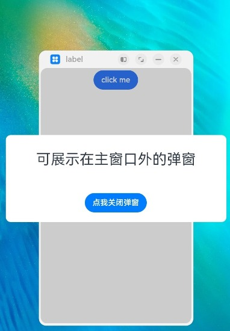

# 自定义弹窗 (CustomDialog)

通过CustomDialogController类显示自定义弹窗。使用弹窗组件时，可优先考虑自定义弹窗，便于自定义弹窗的样式与内容。

> **说明：**
>
> 从API Version 7开始支持。后续版本如有新增内容，则采用上角标单独标记该内容的起始版本。


## 接口

CustomDialogController(value: CustomDialogControllerOptions)

配置自定义弹窗的参数。

> **说明：**
>
> 自定义弹窗的所有参数，不支持动态刷新。

**系统能力：** SystemCapability.ArkUI.ArkUI.Full

**参数：**

| 参数名 | 类型                                                         | 必填 | 说明                   |
| ------ | ------------------------------------------------------------ | ---- | ---------------------- |
| value  | [CustomDialogControllerOptions](#customdialogcontrolleroptions对象说明) | 是   | 配置自定义弹窗的参数。 |

## CustomDialogControllerOptions对象说明

| 名称                           | 参数类型                                     | 必填   | 描述                                     |
| ----------------------------- | ---------------------------------------- | ---- | ---------------------------------------- |
| builder                       | [CustomDialog](../../../ui/arkts-common-components-custom-dialog.md) | 是    | 自定义弹窗内容构造器。<br/>**说明：** <br/>若builder构造器使用回调函数作为入参，请注意使用this绑定问题，如build: custombuilder({ callback: ()=> {...}})。<br/>若在builder构造器中监听数据变化请使用@Link，其他方式如@Prop、@ObjectLink不适用此场景。<br/>**元服务API：** 从API version 11开始，该接口支持在元服务中使用。 |
| cancel                        | ()&nbsp;=&gt;&nbsp;void                  | 否    | 返回、ESC键和点击遮障层弹窗退出时的回调。<br/>**元服务API：** 从API version 11开始，该接口支持在元服务中使用。 |
| autoCancel                    | boolean                                  | 否    | 是否允许点击遮障层退出，true表示关闭弹窗。false表示不关闭弹窗。<br>默认值：true<br/>**元服务API：** 从API version 11开始，该接口支持在元服务中使用。 |
| alignment                     | [DialogAlignment](ts-methods-alert-dialog-box.md#dialogalignment枚举说明) | 否    | 弹窗在竖直方向上的对齐方式。<br>默认值：DialogAlignment.Default<br/>**元服务API：** 从API version 11开始，该接口支持在元服务中使用。 |
| offset                        | [Offset](ts-types.md#offset)             | 否    | 弹窗相对alignment所在位置的偏移量。<br/>**元服务API：** 从API version 11开始，该接口支持在元服务中使用。                   |
| customStyle                   | boolean                                  | 否    | 弹窗容器样式是否自定义。<br>设置flase时（默认值）：<br/>1、圆角为32vp。<br/>2、未设置弹窗宽度高度：弹窗容器的宽度根据栅格系统自适应。高度自适应自定义的内容节点。<br/>3、设置弹窗宽度高度：弹窗容器的宽度不超过默认样式下的最大宽度（自定义节点设置100%的宽度），弹窗容器的高度不超过默认样式下的最大高度（自定义节点设置100%的高度）。<br/>设置为true：<br/>1、圆角为0，弹窗背景色为透明色。<br/>2、不支持设置弹窗宽度、高度、边框宽度、边框样式、边框颜色以及阴影宽度。<br/>**元服务API：** 从API version 11开始，该接口支持在元服务中使用。|
| gridCount<sup>8+</sup>        | number                                   | 否    | 弹窗宽度占[栅格宽度](../../../ui/arkts-layout-development-grid-layout.md)的个数。<br>默认为按照窗口大小自适应，异常值按默认值处理，最大栅格数为系统最大栅格数。<br/>**元服务API：** 从API version 11开始，该接口支持在元服务中使用。 |
| maskColor<sup>10+</sup>       | [ResourceColor](ts-types.md#resourcecolor) | 否    | 自定义蒙层颜色。<br>默认值: 0x33000000<br/>**元服务API：** 从API version 11开始，该接口支持在元服务中使用。              |
| maskRect<sup>10+</sup>        | [Rectangle](ts-methods-alert-dialog-box.md#rectangle8类型说明) | 否     | 弹窗遮蔽层区域，在遮蔽层区域内的事件不透传，在遮蔽层区域外的事件透传。<br/>默认值：{ x: 0, y: 0, width: '100%', height: '100%' } <br/>**说明：**<br/>showInSubWindow为true时，maskRect不生效。<br/>**元服务API：** 从API version 11开始，该接口支持在元服务中使用。|
| openAnimation<sup>10+</sup>   | [AnimateParam](ts-explicit-animation.md#animateparam对象说明) | 否    | 自定义设置弹窗弹出的动画效果相关参数。<br>**说明**：<br>tempo默认值为1，当设置小于等于0的值时按默认值处理。<br/>iterations默认值为1，默认播放一次，设置为其他数值时按默认值处理。<br>playMode控制动画播放模式，默认值为PlayMode.Normal，设置为其他数值时按照默认值处理。<br/>**元服务API：** 从API version 11开始，该接口支持在元服务中使用。 |
| closeAnimation<sup>10+</sup>  | [AnimateParam](ts-explicit-animation.md#animateparam对象说明) | 否    | 自定义设置弹窗关闭的动画效果相关参数。<br>**说明**：<br>tempo默认值为1，当设置小于等于0的值时按默认值处理。<br/>iterations默认值为1，默认播放一次，设置为其他数值时按默认值处理。<br>playMode控制动画播放模式，默认值为PlayMode.Normal，设置为其他数值时按照默认值处理。<br/>页面转场切换时，建议使用默认关闭动效。<br/>**元服务API：** 从API version 11开始，该接口支持在元服务中使用。 |
| showInSubWindow<sup>10+</sup> | boolean                                  | 否    | 某弹框需要显示在主窗口之外时，是否在子窗口显示此弹窗。<br>默认值：false，弹窗显示在应用内，而非独立子窗口。<br>**说明**：showInSubWindow为true的弹窗无法触发显示另一个showInSubWindow为true的弹窗。<br/>**元服务API：** 从API version 11开始，该接口支持在元服务中使用。 |
| backgroundColor<sup>10+</sup> | [ResourceColor](ts-types.md#resourcecolor)      | 否   | 设置弹窗背板填充。<br />**说明**：如果同时设置了内容构造器的背景色，则backgroundColor会被内容构造器的背景色覆盖。<br/>**元服务API：** 从API version 11开始，该接口支持在元服务中使用。 |
| cornerRadius<sup>10+</sup>    | [BorderRadiuses](ts-types.md#borderradiuses9) \| [Dimension](ts-types.md#dimension10) | 否   | 设置背板的圆角半径。<br />可分别设置4个圆角的半径。<br />默认值：{ topLeft: '32vp', topRight: '32vp', bottomLeft: '32vp', bottomRight: '32vp' }<br />**说明**：自定义弹窗默认的背板圆角半径为32vp，如果需要使用cornerRadius属性，请和[borderRadius](ts-universal-attributes-border.md#borderradius)属性一起使用。<br/>**元服务API：** 从API version 11开始，该接口支持在元服务中使用。 |
| isModal<sup>11+</sup> | boolean | 否 | 弹窗是否为模态窗口，模态窗口有蒙层，非模态窗口无蒙层。<br/>默认值：true，此时弹窗有蒙层。<br/>**元服务API：** 从API version 12开始，该接口支持在元服务中使用。 |
| onWillDismiss<sup>12+</sup> | Callback<[DismissDialogAction](ts-methods-alert-dialog-box.md#dismissdialogaction12类型说明)> | 否 | 交互式关闭回调函数。<br/>**说明：**<br/>1.当用户执行点击遮障层关闭、左滑/右滑、三键back、键盘ESC关闭交互操作时，如果注册该回调函数，则不会立刻关闭弹窗。在回调函数中可以通过reason得到阻拦关闭弹窗的操作类型，从而根据原因选择是否能关闭弹窗。当前组件返回的reason中，暂不支持CLOSE_BUTTON的枚举值。<br/>2.在onWillDismiss回调中，不能再做onWillDismiss拦截。 |
| borderWidth<sup>12+</sup> | [Dimension](ts-types.md#dimension10)&nbsp;\|&nbsp;[EdgeWidths](ts-types.md#edgewidths9)  | 否 | 设置弹窗背板的边框宽度。<br />可分别设置4个边框宽度。<br />默认值：0。<br /> 百分比参数方式：以父元素弹窗宽的百分比来设置弹窗的边框宽度。<br />当弹窗左边框和右边框大于弹窗宽度，弹窗上边框和下边框大于弹窗高度，显示可能不符合预期。|
| borderColor<sup>12+</sup> | [ResourceColor](ts-types.md#resourcecolor)&nbsp;\|&nbsp;[EdgeColors](ts-types.md#edgecolors9)  | 否 | 设置弹窗背板的边框颜色。<br/>默认值：Color.Black。<br/> 如果使用borderColor属性，需要和borderWidth属性一起使用。 |
| borderStyle<sup>12+</sup> | [BorderStyle](ts-appendix-enums.md#borderstyle)&nbsp;\|&nbsp;[EdgeStyles](ts-types.md#edgestyles9)  | 否 | 设置弹窗背板的边框样式。<br/>默认值：BorderStyle.Solid。<br/> 如果使用borderStyle属性，需要和borderWidth属性一起使用。 |
| width<sup>12+</sup> | [Dimension](ts-types.md#dimension10) | 否   | 设置弹窗背板的宽度。<br />**说明：**<br>- 弹窗宽度默认最大值：400vp。<br />- 百分比参数方式：弹窗参考宽度为所在窗口的宽度，在此基础上调小或调大。|
| height<sup>12+</sup> | [Dimension](ts-types.md#dimension10)   | 否 | 设置弹窗背板的高度。<br />**说明：**<br />- 弹窗高度默认最大值：0.9 *（窗口高度 - 安全区域）。<br />- 百分比参数方式：弹窗参考高度为（窗口高度 - 安全区域），在此基础上调小或调大。|
| shadow<sup>12+</sup> | [ShadowOptions](ts-universal-attributes-image-effect.md#shadowoptions对象说明)&nbsp;\|&nbsp;[ShadowStyle](ts-universal-attributes-image-effect.md#shadowstyle10枚举说明)   | 否 | 设置弹窗背板的阴影。 <br /> 当设备为2in1时，默认场景下获焦阴影值为ShadowStyle.OUTER_FLOATING_MD，失焦为ShadowStyle.OUTER_FLOATING_SM|
| backgroundBlurStyle<sup>12+</sup> | [BlurStyle](ts-appendix-enums.md#blurstyle9)                 | 否   | 弹窗背板模糊材质。<br/>默认值：BlurStyle.COMPONENT_ULTRA_THICK |

> **说明：**
>
> - 按下返回键和ESC键时会让弹窗退出。
> - 自定义弹窗仅适用于简单提示场景，不能替代页面使用。由于弹窗存在完全避让输入法行为，即在软键盘弹出时，会自动向上抬起软键盘高度，因此如果弹窗高度过大时，可能会导致部分区域不可见。弹窗避让软键盘时，与软键盘之间存在16vp的安全间距。

## CustomDialogController

**元服务API：** 从API version 11开始，该接口支持在元服务中使用。

### 导入对象

```ts
dialogController : CustomDialogController | null = new CustomDialogController(CustomDialogControllerOptions)
```
**说明**：CustomDialogController仅在作为@CustomDialog和@Component struct的成员变量，且在@Component struct内部定义时赋值才有效，具体用法可看下方示例。

### open
open(): void


显示自定义弹窗内容，允许多次使用，但如果弹框为SubWindow模式，则该弹框不允许再弹出SubWindow弹框。


### close
close(): void


关闭显示的自定义弹窗，若已关闭，则不生效。

## 示例

### 示例1

```ts
// xxx.ets
@CustomDialog
struct CustomDialogExampleTwo {
  controllerTwo?: CustomDialogController
  build() {
    Column() {
      Text('我是第二个弹窗')
        .fontSize(30)
        .height(100)
      Button('点我关闭第二个弹窗')
        .onClick(() => {
          if (this.controllerTwo != undefined) {
            this.controllerTwo.close()
          }
        })
        .margin(20)
    }
  }
}
@CustomDialog
struct CustomDialogExample {
  @Link textValue: string
  @Link inputValue: string
  dialogControllerTwo: CustomDialogController | null = new CustomDialogController({
    builder: CustomDialogExampleTwo(),
    alignment: DialogAlignment.Bottom,
    onWillDismiss:(dismissDialogAction: DismissDialogAction)=> {
      console.info("reason=" + JSON.stringify(dismissDialogAction.reason))
      console.log("dialog onWillDismiss")
      if (dismissDialogAction.reason == DismissReason.PRESS_BACK) {
        dismissDialogAction.dismiss()
      }
      if (dismissDialogAction.reason == DismissReason.TOUCH_OUTSIDE) {
        dismissDialogAction.dismiss()
      }
    },
    offset: { dx: 0, dy: -25 } })
  controller?: CustomDialogController
  // 若尝试在CustomDialog中传入多个其他的Controller，以实现在CustomDialog中打开另一个或另一些CustomDialog，那么此处需要将指向自己的controller放在所有controller的后面
  cancel: () => void = () => {
  }
  confirm: () => void = () => {
  }

  build() {
    Column() {
      Text('Change text').fontSize(20).margin({ top: 10, bottom: 10 })
      TextInput({ placeholder: '', text: this.textValue }).height(60).width('90%')
        .onChange((value: string) => {
          this.textValue = value
        })
      Text('Whether to change a text?').fontSize(16).margin({ bottom: 10 })
      Flex({ justifyContent: FlexAlign.SpaceAround }) {
        Button('cancel')
          .onClick(() => {
            if (this.controller != undefined) {
              this.controller.close()
              this.cancel()
            }
          }).backgroundColor(0xffffff).fontColor(Color.Black)
        Button('confirm')
          .onClick(() => {
            if (this.controller != undefined) {
              this.inputValue = this.textValue
              this.controller.close()
              this.confirm()
            }
          }).backgroundColor(0xffffff).fontColor(Color.Red)
      }.margin({ bottom: 10 })

      Button('点我打开第二个弹窗')
        .onClick(() => {
          if (this.dialogControllerTwo != null) {
            this.dialogControllerTwo.open()
          }
        })
        .margin(20)
    }.borderRadius(10)
    // 如果需要使用border属性或cornerRadius属性，请和borderRadius属性一起使用。
  }
}
@Entry
@Component
struct CustomDialogUser {
  @State textValue: string = ''
  @State inputValue: string = 'click me'
  dialogController: CustomDialogController | null = new CustomDialogController({
    builder: CustomDialogExample({
      cancel: ()=> { this.onCancel() },
      confirm: ()=> { this.onAccept() },
      textValue: $textValue,
      inputValue: $inputValue
    }),
    cancel: this.exitApp,
    autoCancel: true,
    onWillDismiss:(dismissDialogAction: DismissDialogAction)=> {
      console.info("reason=" + JSON.stringify(dismissDialogAction.reason))
      console.log("dialog onWillDismiss")
      if (dismissDialogAction.reason == DismissReason.PRESS_BACK) {
        dismissDialogAction.dismiss()
      }
      if (dismissDialogAction.reason == DismissReason.TOUCH_OUTSIDE) {
        dismissDialogAction.dismiss()
      }
    },
    alignment: DialogAlignment.Bottom,
    offset: { dx: 0, dy: -20 },
    gridCount: 4,
    customStyle: false,
    cornerRadius: 10,
  })

  // 在自定义组件即将析构销毁时将dialogControlle置空
  aboutToDisappear() {
    this.dialogController = null // 将dialogController置空
  }

  onCancel() {
    console.info('Callback when the first button is clicked')
  }

  onAccept() {
    console.info('Callback when the second button is clicked')
  }

  exitApp() {
    console.info('Click the callback in the blank area')
  }
  build() {
    Column() {
      Button(this.inputValue)
        .onClick(() => {
          if (this.dialogController != null) {
            this.dialogController.open()
          }
        }).backgroundColor(0x317aff)
    }.width('100%').margin({ top: 5 })
  }
}
```


### 示例2

```ts
// xxx.ets
@CustomDialog
struct CustomDialogExample {
  controller?: CustomDialogController
  cancel: () => void = () => {
  }
  confirm: () => void = () => {
  }
  build() {
    Column() {
      Text('可展示在主窗口外的弹窗')
        .fontSize(30)
        .height(100)
      Button('点我关闭弹窗')
        .onClick(() => {
          if (this.controller != undefined) {
            this.controller.close()
          }
        })
        .margin(20)
    }
  }
}
@Entry
@Component
struct CustomDialogUser {
  dialogController: CustomDialogController | null = new CustomDialogController({
    builder: CustomDialogExample({
      cancel: ()=> { this.onCancel() },
      confirm: ()=> { this.onAccept() }
    }),
    cancel: this.existApp,
    autoCancel: true,
    onWillDismiss:(dismissDialogAction: DismissDialogAction)=> {
      console.info("reason=" + JSON.stringify(dismissDialogAction.reason))
      console.log("dialog onWillDismiss")
      if (dismissDialogAction.reason == DismissReason.PRESS_BACK) {
        dismissDialogAction.dismiss()
      }
      if (dismissDialogAction.reason == DismissReason.TOUCH_OUTSIDE) {
        dismissDialogAction.dismiss()
      }
    },
    alignment: DialogAlignment.Center,
    offset: { dx: 0, dy: -20 },
    gridCount: 4,
    showInSubWindow: true,
    isModal: true,
    customStyle: false,
    cornerRadius: 10,
  })
  // 在自定义组件即将析构销毁时将dialogControlle置空
  aboutToDisappear() {
    this.dialogController = null // 将dialogController置空
  }

  onCancel() {
    console.info('Callback when the first button is clicked')
  }

  onAccept() {
    console.info('Callback when the second button is clicked')
  }

  existApp() {
    console.info('Click the callback in the blank area')
  }

  build() {
    Column() {
      Button('click me')
        .onClick(() => {
          if (this.dialogController != null) {
            this.dialogController.open()
          }
        }).backgroundColor(0x317aff)
    }.width('100%').margin({ top: 5 })
  }
}
```


