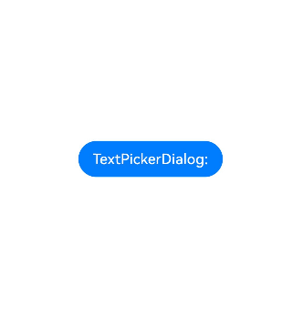
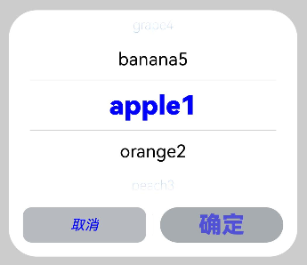
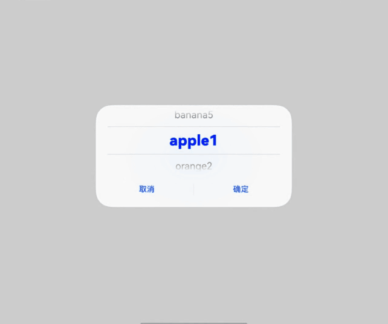
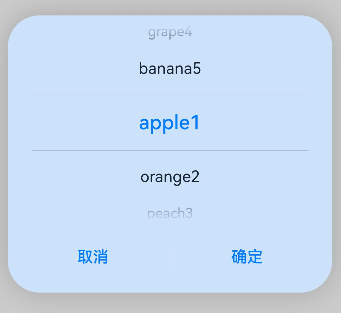
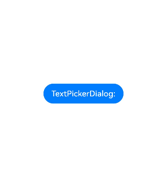

# 文本滑动选择器弹窗 (TextPickerDialog)

根据指定的选择范围创建文本选择器，展示在弹窗上。

>  **说明：**
>
> 该组件从API Version 8开始支持。后续版本如有新增内容，则采用上角标单独标记该内容的起始版本。
>
> 本模块功能依赖UI的执行上下文，不可在UI上下文不明确的地方使用，参见[UIContext](../js-apis-arkui-UIContext.md#uicontext)说明。
>
> 从API version 10开始，可以通过使用[UIContext](../js-apis-arkui-UIContext.md#uicontext)中的[showTextPickerDialog](../js-apis-arkui-UIContext.md#showtextpickerdialog)来明确UI的执行上下文。

## TextPickerDialog

### show<sup>(deprecated)</sup>

static show(options?: TextPickerDialogOptions)

定义文本滑动选择器弹窗并弹出。

从API version 8开始支持，从API version 18开始废弃，建议使用[UIContext](../js-apis-arkui-UIContext.md#uicontext)中的[showTextPickerDialog](../js-apis-arkui-UIContext.md#showtextpickerdialog)替代。

**原子化服务API：** 从API version 11开始，该接口支持在原子化服务中使用。

**系统能力：** SystemCapability.ArkUI.ArkUI.Full

**参数：**

| 参数名  | 类型                                                        | 必填 | 说明                       |
| ------- | ----------------------------------------------------------- | ---- | -------------------------- |
| options | [TextPickerDialogOptions](#textpickerdialogoptions对象说明) | 否   | 配置文本选择器弹窗的参数。 |

## TextPickerDialogOptions对象说明

文本选择器弹窗的参数继承自[TextPickerOptions](ts-basic-components-textpicker.md#textpickeroptions对象说明)。

**系统能力：** SystemCapability.ArkUI.ArkUI.Full

| 名称 | 类型 | 必填 |  说明 |
| -------- | -------- | -------- |  -------- |
| defaultPickerItemHeight | number \| string | 否 | 设置选择器中选项的高度。number类型取值范围：[0, +∞]，string类型仅支持number类型取值的字符串形式，例如"56"。<br/>默认值：选中项56vp，非选中项36vp。设置该参数后，选中项与非选中项的高度均为所设置的值。<br/>**原子化服务API：** 从API version 11开始，该接口支持在原子化服务中使用。 |
| disappearTextStyle<sup>10+</sup> | [PickerTextStyle](ts-basic-components-datepicker.md#pickertextstyle10类型说明) | 否 | 设置所有选项中最上和最下两个选项的文本颜色、字号、字体粗细。<br/>默认值：<br/>{<br/>color: '#ff182431',<br/>font: {<br/>size: '14fp', <br/>weight: FontWeight.Regular<br/>}<br/>}<br/>**原子化服务API：** 从API version 11开始，该接口支持在原子化服务中使用。 |
| textStyle<sup>10+</sup> | [PickerTextStyle](ts-basic-components-datepicker.md#pickertextstyle10类型说明) | 否 | 设置所有选项中除了最上、最下及选中项以外的文本颜色、字号、字体粗细。<br/>默认值：<br/>{<br/>color: '#ff182431',<br/>font: {<br/>size: '16fp', <br/>weight: FontWeight.Regular<br/>}<br/>}<br/>**原子化服务API：** 从API version 11开始，该接口支持在原子化服务中使用。 |
| selectedTextStyle<sup>10+</sup> | [PickerTextStyle](ts-basic-components-datepicker.md#pickertextstyle10类型说明) | 否 | 设置选中项的文本颜色、字号、字体粗细。<br/>默认值：<br/>{<br/>color: '#ff007dff',<br/>font: {<br/>size: '20vp', <br/>weight: FontWeight.Medium<br/>}<br/>}<br/>**原子化服务API：** 从API version 11开始，该接口支持在原子化服务中使用。 |
| acceptButtonStyle<sup>12+</sup> | [PickerDialogButtonStyle](ts-methods-datepicker-dialog.md#pickerdialogbuttonstyle12类型说明) | 否 | 设置确认按钮显示样式、样式和重要程度、角色、背景色、圆角、文本颜色、字号、字体粗细、字体样式、字体列表、按钮是否默认响应Enter键。<br />**说明：**<br />acceptButtonStyle与cancelButtonStyle中最多只能有一个primary字段配置为true，二者primary字段均配置为true时均不生效。<br/>**原子化服务API：** 从API version 12开始，该接口支持在原子化服务中使用。|
| cancelButtonStyle<sup>12+</sup> | [PickerDialogButtonStyle](ts-methods-datepicker-dialog.md#pickerdialogbuttonstyle12类型说明) | 否 | 设置取消按钮显示样式、样式和重要程度、角色、背景色、圆角、文本颜色、字号、字体粗细、字体样式、字体列表、按钮是否默认响应Enter键。<br />**说明：**<br />acceptButtonStyle与cancelButtonStyle中最多只能有一个primary字段配置为true，二者primary字段均配置为true时均不生效。<br/>**原子化服务API：** 从API version 12开始，该接口支持在原子化服务中使用。|
| canLoop<sup>10+</sup> | boolean | 否 | 设置是否可循环滚动，true：可循环，false：不可循环，默认值：true。<br/>**原子化服务API：** 从API version 11开始，该接口支持在原子化服务中使用。 |
| alignment<sup>10+</sup>  | [DialogAlignment](ts-methods-alert-dialog-box.md#dialogalignment枚举说明) | 否   | 弹窗在竖直方向上的对齐方式。<br>默认值：DialogAlignment.Default<br/>**原子化服务API：** 从API version 11开始，该接口支持在原子化服务中使用。 |
| offset<sup>10+</sup>     | [Offset](ts-types.md#offset) | 否     | 弹窗相对alignment所在位置的偏移量。<br/>默认值：{&nbsp;dx:&nbsp;0&nbsp;,&nbsp;dy:&nbsp;0&nbsp;}<br/>**原子化服务API：** 从API version 11开始，该接口支持在原子化服务中使用。 |
| maskRect<sup>10+</sup>| [Rectangle](ts-methods-alert-dialog-box.md#rectangle8类型说明) | 否     | 弹窗遮蔽层区域，在遮蔽层区域内的事件不透传，在遮蔽层区域外的事件透传。<br/>默认值：{ x: 0, y: 0, width: '100%', height: '100%' }<br/>**原子化服务API：** 从API version 11开始，该接口支持在原子化服务中使用。 |
| onAccept | (value: [TextPickerResult](#textpickerresult对象说明)) => void | 否 | 点击弹窗中的“确定”按钮时触发该回调。<br/>**原子化服务API：** 从API version 11开始，该接口支持在原子化服务中使用。 |
| onCancel | () => void | 否 | 点击弹窗中的“取消”按钮时触发该回调。<br/>**原子化服务API：** 从API version 11开始，该接口支持在原子化服务中使用。 |
| onChange | (value: [TextPickerResult](#textpickerresult对象说明)) => void | 否 | 滑动弹窗中的选择器后，选项归位至选中项位置时，触发该回调。<br/>**原子化服务API：** 从API version 11开始，该接口支持在原子化服务中使用。 |
| onScrollStop<sup>14+</sup> | (value: [TextPickerResult](#textpickerresult对象说明)) => void | 否 | 滑动弹窗中的选择器的选择列停止触发该回调。<br/>**原子化服务API：** 从API version 14开始，该接口支持在原子化服务中使用。 |
| backgroundColor<sup>11+</sup> | [ResourceColor](ts-types.md#resourcecolor)  | 否 | 弹窗背板颜色。<br/>默认值：Color.Transparent<br/>**说明：** <br/>当设置了backgroundColor为非透明色时，backgroundBlurStyle需要设置为BlurStyle.NONE，否则颜色显示将不符合预期效果。<br/>**原子化服务API：** 从API version 12开始，该接口支持在原子化服务中使用。 |
| backgroundBlurStyle<sup>11+</sup> | [BlurStyle](ts-universal-attributes-background.md#blurstyle9) | 否 | 弹窗背板模糊材质。<br/>默认值：BlurStyle.COMPONENT_ULTRA_THICK<br/>**说明：** <br/>设置为BlurStyle.NONE即可关闭背景虚化。当设置了backgroundBlurStyle为非NONE值时，则不要设置backgroundColor，否则颜色显示将不符合预期效果。<br/>**原子化服务API：** 从API version 12开始，该接口支持在原子化服务中使用。 |
| onDidAppear<sup>12+</sup> | () => void | 否 | 弹窗弹出时的事件回调。<br />**说明：**<br />1.正常时序依次为：onWillAppear>>onDidAppear>>(onAccept/onCancel/onChange/onScrollStop)>>onWillDisappear>>onDidDisappear。<br />2.在onDidAppear内设置改变弹窗显示效果的回调事件，二次弹出生效。<br />3.快速点击弹出，消失弹窗时，存在onWillDisappear在onDidAppear前生效。<br />4. 当弹窗入场动效未完成时关闭弹窗，该回调不会触发。<br/>**原子化服务API：** 从API version 12开始，该接口支持在原子化服务中使用。 |
| onDidDisappear<sup>12+</sup> | () => void | 否 | 弹窗消失时的事件回调。<br />**说明：**<br />1.正常时序依次为：onWillAppear>>onDidAppear>>(onAccept/onCancel/onChange/onScrollStop)>>onWillDisappear>>onDidDisappear。<br/>**原子化服务API：** 从API version 12开始，该接口支持在原子化服务中使用。 |
| onWillAppear<sup>12+</sup> | () => void | 否 | 弹窗显示动效前的事件回调。<br />**说明：**<br />1.正常时序依次为：onWillAppear>>onDidAppear>>(onAccept/onCancel/onChange/onScrollStop)>>onWillDisappear>>onDidDisappear。<br />2.在onWillAppear内设置改变弹窗显示效果的回调事件，二次弹出生效。<br/>**原子化服务API：** 从API version 12开始，该接口支持在原子化服务中使用。|
| onWillDisappear<sup>12+</sup> | () => void | 否 | 弹窗退出动效前的事件回调。<br />**说明：**<br />1.正常时序依次为：onWillAppear>>onDidAppear>>(onAccept/onCancel/onChange/onScrollStop)>>onWillDisappear>>onDidDisappear。<br />2.快速点击弹出，消失弹窗时，存在onWillDisappear在onDidAppear前生效。<br/>**原子化服务API：** 从API version 12开始，该接口支持在原子化服务中使用。|
| shadow<sup>12+</sup>              | [ShadowOptions](ts-universal-attributes-image-effect.md#shadowoptions对象说明)&nbsp;\|&nbsp;[ShadowStyle](ts-universal-attributes-image-effect.md#shadowstyle10枚举说明) | 否   | 设置弹窗背板的阴影。<br />当设备为2in1时，默认场景下获焦阴影值为ShadowStyle.OUTER_FLOATING_MD，失焦为ShadowStyle.OUTER_FLOATING_SM <br/>**原子化服务API：** 从API version 12开始，该接口支持在原子化服务中使用。|
| enableHoverMode<sup>14+</sup>     | boolean | 否   | 是否响应悬停态。<br />默认值：false，默认不响应。<br/>**原子化服务API：** 从API version 14开始，该接口支持在原子化服务中使用。|
| hoverModeArea<sup>14+</sup>       | [HoverModeAreaType](ts-appendix-enums.md#hovermodeareatype14) | 否   | 悬停态下弹窗默认展示区域。<br />默认值：HoverModeAreaType.BOTTOM_SCREEN。<br/>**原子化服务API：** 从API version 14开始，该接口支持在原子化服务中使用。|
| disableTextStyleAnimation<sup>15+</sup>   |  boolean | 否   |  设置滑动过程中是否有文本样式变化动效。<br/>true：无文本样式变化动效，false：有文本样式变化动效。<br/>默认值：false |
| defaultTextStyle<sup>15+</sup>   |  [TextPickerTextStyle](ts-basic-components-textpicker.md#textpickertextstyle15类型说明) | 否   |  设置关闭滑动过程中文本样式变化动效时的各个选项文本的样式，仅当disableTextStyleAnimation为true时生效。<br/>默认值：与[Text](ts-basic-components-text.md)组件默认值相同。 |
| onEnterSelectedArea<sup>18+</sup>   |  Callback\<[TextPickerResult](#textpickerresult对象说明)> | 否   |  滑动过程中，选项进入分割线区域内，触发该回调。与onChange事件的差别在于，该事件的触发时机早于onChange事件，当当前滑动列滑动距离超过选中项高度的一半时，选项此时已经进入分割线区域内，会触发该事件。<br />**说明：**<br />在多列联动场景中，不建议使用该回调，由于该回调标识的是滑动过程中选项进入分割线区域内的节点，而跟随变化的选项并不涉及滑动，因此，回调的返回值中，仅当前滑动列的值会正常变化，其余未滑动列的值保持不变。<br/>**原子化服务API：** 从API version 18开始，该接口支持在原子化服务中使用。 |
| enableHapticFeedback<sup>18+</sup> | boolean | 否   | 设置是否开启触控反馈。<br />默认值：true，true表示开启触控反馈，false表示不开启触控反馈。<br />**原子化服务API**： 从API version 18开始，该接口支持在原子化服务中使用。<br />**说明**：<br />开启触控反馈时，需要在工程的module.json5中配置requestPermissions字段开启振动权限，配置如下：<br />"requestPermissions": [{"name": "ohos.permission.VIBRATE"}]|

## TextPickerResult对象说明

**原子化服务API：** 从API version 11开始，该接口支持在原子化服务中使用。

**系统能力：** SystemCapability.ArkUI.ArkUI.Full

| 名称 | 类型 | 只读 | 可选 | 说明 |
| -------- | -------- | -------- | -------- | -------- |
| value | string \| string []<sup>10+</sup> | 否 | 否 | 选中项的文本内容。<br/>**说明**：当显示文本或图片加文本列表时，value值为选中项中的文本值。（文本选择器显示多列时，value为数组类型。）<br/>当显示图片列表时，value值为空。<br/>value值不支持包含转义字符'\\'。 |
| index | number \| number []<sup>10+</sup> | 否 | 否 | 选中项在选择范围数组中的索引值，索引从0开始。（文本选择器显示多列时，index为数组类型。） |

## 示例

>  **说明：**
>
> 推荐通过使用[UIContext](../js-apis-arkui-UIContext.md#uicontext)中的[showTextPickerDialog](../js-apis-arkui-UIContext.md#showtextpickerdialog)来明确UI的执行上下文。

### 示例1（弹出文本选择弹窗）

该示例通过点击按钮弹出文本选择弹窗。

```ts
// xxx.ets
@Entry
@Component
struct TextPickerDialogExample {
  private select: number | number[] = 0
  private fruits: string[] = ['apple1', 'orange2', 'peach3', 'grape4', 'banana5']
  @State v: string = '';

  build() {
    Row() {
      Column() {
        Button("TextPickerDialog:" + this.v)
          .margin(20)
          .onClick(() => {
            TextPickerDialog.show({
              range: this.fruits,
              selected: this.select,
              value: this.v,
              defaultPickerItemHeight: 40,
              onAccept: (value: TextPickerResult) => {
                // 设置select为按下确定按钮时候的选中项index，这样当弹窗再次弹出时显示选中的是上一次确定的选项
                this.select = value.index
                console.log(this.select + '')
                // 点击确定后，被选到的文本数据展示到页面
                this.v = value.value as string
                console.info("TextPickerDialog:onAccept()" + JSON.stringify(value))
              },
              onCancel: () => {
                console.info("TextPickerDialog:onCancel()")
              },
              onChange: (value: TextPickerResult) => {
                console.info("TextPickerDialog:onChange()" + JSON.stringify(value))
              },
              onScrollStop: (value: TextPickerResult) => {
                console.info("TextPickerDialog:onScrollStop()" + JSON.stringify(value))
              },
              onDidAppear: () => {
                console.info("TextPickerDialog:onDidAppear()")
              },
              onDidDisappear: () => {
                console.info("TextPickerDialog:onDidDisappear()")
              },
              onWillAppear: () => {
                console.info("TextPickerDialog:onWillAppear()")
              },
              onWillDisappear: () => {
                console.info("TextPickerDialog:onWillDisappear()")
              }
            })
          })
      }.width('100%')
    }.height('100%')
  }
}
```




### 示例2（自定义样式）

该示例通过配置disappearTextStyle、textStyle、selectedTextStyle、acceptButtonStyle、cancelButtonStyle实现了自定义文本以及按钮样式。

```ts
// xxx.ets
@Entry
@Component
struct TextPickerDialogExample {
  private select: number | number[] = 0
  private fruits: string[] = ['apple1', 'orange2', 'peach3', 'grape4', 'banana5']
  @State v: string = '';

  build() {
    Row() {
      Column() {
        Button("TextPickerDialog:" + this.v)
          .margin(20)
          .onClick(() => {
            this.getUIContext().showTextPickerDialog({
              range: this.fruits,
              selected: this.select,
              disappearTextStyle: { color: '#297bec', font: { size: 15, weight: FontWeight.Lighter } },
              textStyle: { color: Color.Black, font: { size: 20, weight: FontWeight.Normal } },
              selectedTextStyle: { color: Color.Blue, font: { size: 30, weight: FontWeight.Bolder } },
              acceptButtonStyle: {
                type: ButtonType.Normal,
                style: ButtonStyleMode.NORMAL,
                role: ButtonRole.NORMAL,
                fontColor: 'rgb(81, 81, 216)',
                fontSize: '26fp',
                fontWeight: FontWeight.Bolder,
                fontStyle: FontStyle.Normal,
                fontFamily: 'sans-serif',
                backgroundColor: '#A6ACAF',
                borderRadius: 20
              },
              cancelButtonStyle: {
                type: ButtonType.Normal,
                style: ButtonStyleMode.NORMAL,
                role: ButtonRole.NORMAL,
                fontColor: Color.Blue,
                fontSize: '16fp',
                fontWeight: FontWeight.Normal,
                fontStyle: FontStyle.Italic,
                fontFamily: 'sans-serif',
                backgroundColor: '#50182431',
                borderRadius: 10
              },
              onAccept: (value: TextPickerResult) => {
                // 设置select为按下确定按钮时候的选中项index，这样当弹窗再次弹出时显示选中的是上一次确定的选项
                this.select = value.index
                console.log(this.select + '')
                // 点击确定后，被选到的文本数据展示到页面
                this.v = value.value as string
                console.info("TextPickerDialog:onAccept()" + JSON.stringify(value))
              },
              onCancel: () => {
                console.info("TextPickerDialog:onCancel()")
              },
              onChange: (value: TextPickerResult) => {
                console.info("TextPickerDialog:onChange()" + JSON.stringify(value))
              },
              onScrollStop: (value: TextPickerResult) => {
                console.info("TextPickerDialog:onScrollStop()" + JSON.stringify(value))
              },
              onDidAppear: () => {
                console.info("TextPickerDialog:onDidAppear()")
              },
              onDidDisappear: () => {
                console.info("TextPickerDialog:onDidDisappear()")
              },
              onWillAppear: () => {
                console.info("TextPickerDialog:onWillAppear()")
              },
              onWillDisappear: () => {
                console.info("TextPickerDialog:onWillDisappear()")
              }
            })
          })
      }.width('100%')
    }.height('100%')
  }
}
```



### 示例3（悬停态弹窗）

该示例展示了在折叠屏悬停态下设置dialog布局区域的效果。

```ts
@Entry
@Component
struct TextPickerDialogExample {
  private select: number | number[] = 0;
  private fruits: string[] = ['apple1', 'orange2', 'peach3', 'grape4', 'banana5'];
  @State v: string = '';

  build() {
    Row() {
      Column() {
        Button("TextPickerDialog:" + this.v)
          .margin(20)
          .onClick(() => {
            this.getUIContext().showTextPickerDialog({
              range: this.fruits,
              selected: this.select,
              disappearTextStyle: { color: Color.Red, font: { size: 15, weight: FontWeight.Lighter }},
              textStyle: { color: Color.Black, font: { size: 20, weight: FontWeight.Normal }},
              selectedTextStyle: { color: Color.Blue, font: { size: 30, weight: FontWeight.Bolder }},
              onAccept: (value: TextPickerResult) => {
                // 设置select为按下确定按钮时候的选中项index，这样当弹窗再次弹出时显示选中的是上一次确定的选项
                this.select = value.index;
                console.log(this.select + '');
                // 点击确定后，被选到的文本数据展示到页面
                this.v = value.value as string;
                console.info("TextPickerDialog:onAccept()" + JSON.stringify(value));
              },
              onCancel: () => {
                console.info("TextPickerDialog:onCancel()");
              },
              onChange: (value: TextPickerResult) => {
                console.info("TextPickerDialog:onChange()" + JSON.stringify(value));
              },
              onScrollStop: (value: TextPickerResult) => {
                console.info("TextPickerDialog:onScrollStop()" + JSON.stringify(value));
              },
              onDidAppear: () => {
                console.info("TextPickerDialog:onDidAppear()");
              },
              onDidDisappear: () => {
                console.info("TextPickerDialog:onDidDisappear()");
              },
              onWillAppear: () => {
                console.info("TextPickerDialog:onWillAppear()");
              },
              onWillDisappear: () => {
                console.info("TextPickerDialog:onWillDisappear()");
              },
              enableHoverMode: true,
              hoverModeArea: HoverModeAreaType.TOP_SCREEN
            })
          })
      }.width('100%')
    }.height('100%')
  }
}
```



### 示例4（设置弹窗位置）

该示例通过alignment、offset设置弹窗的位置。

```ts
// xxx.ets
@Entry
@Component
struct TextPickerDialogExample {
  private select: number | number[] = 0
  private fruits: string[] = ['apple1', 'orange2', 'peach3', 'grape4', 'banana5']
  @State v: string = '';

  build() {
    Row() {
      Column() {
        Button("TextPickerDialog:" + this.v)
          .margin(20)
          .onClick(() => {
            this.getUIContext().showTextPickerDialog({
              range: this.fruits,
              selected: this.select,
              alignment: DialogAlignment.Center,
              offset: { dx: 20, dy: 0 },
              onAccept: (value: TextPickerResult) => {
                // 设置select为按下确定按钮时候的选中项index，这样当弹窗再次弹出时显示选中的是上一次确定的选项
                this.select = value.index
                console.log(this.select + '')
                // 点击确定后，被选到的文本数据展示到页面
                this.v = value.value as string
                console.info("TextPickerDialog:onAccept()" + JSON.stringify(value))
              }
            })
          })
      }.width('100%')
    }.height('100%')
  }
}
```


### 示例5（设置遮蔽区）

该示例通过maskRect设置遮蔽区。

```ts
// xxx.ets
@Entry
@Component
struct TextPickerDialogExample {
  private select: number | number[] = 0
  private fruits: string[] = ['apple1', 'orange2', 'peach3', 'grape4', 'banana5']
  @State v: string = '';

  build() {
    Row() {
      Column() {
        Button("TextPickerDialog:" + this.v)
          .margin(20)
          .onClick(() => {
            this.getUIContext().showTextPickerDialog({
              range: this.fruits,
              selected: this.select,
              maskRect: {
                x: 30,
                y: 60,
                width: '100%',
                height: '60%'
              },
              onAccept: (value: TextPickerResult) => {
                // 设置select为按下确定按钮时候的选中项index，这样当弹窗再次弹出时显示选中的是上一次确定的选项
                this.select = value.index
                console.log(this.select + '')
                // 点击确定后，被选到的文本数据展示到页面
                this.v = value.value as string
                console.info("TextPickerDialog:onAccept()" + JSON.stringify(value))
              }
            })
          })
      }.width('100%')
    }.height('100%')
  }
}
```


### 示例6（设置弹窗背板）

该示例通过backgroundColor、backgroundBlurStyle、shadow设置弹窗背板。

```ts
// xxx.ets
@Entry
@Component
struct TextPickerDialogExample {
  private select: number | number[] = 0
  private fruits: string[] = ['apple1', 'orange2', 'peach3', 'grape4', 'banana5']
  @State v: string = '';

  build() {
    Row() {
      Column() {
        Button("TextPickerDialog:" + this.v)
          .margin(20)
          .onClick(() => {
            this.getUIContext().showTextPickerDialog({
              range: this.fruits,
              selected: this.select,
              backgroundColor: 'rgb(204, 226, 251)',
              backgroundBlurStyle: BlurStyle.NONE,
              shadow: ShadowStyle.OUTER_FLOATING_SM,
              onAccept: (value: TextPickerResult) => {
                // 设置select为按下确定按钮时候的选中项index，这样当弹窗再次弹出时显示选中的是上一次确定的选项
                this.select = value.index
                console.log(this.select + '')
                // 点击确定后，被选到的文本数据展示到页面
                this.v = value.value as string
                console.info("TextPickerDialog:onAccept()" + JSON.stringify(value))
              }
            })
          })
      }.width('100%')
    }.height('100%')
  }
}
```




### 示例7（设置循环滚动）

该示例使用canLoop设置是否循环滚动。

```ts
// xxx.ets
@Entry
@Component
struct TextPickerDialogExample {
  private select: number | number[] = 0
  private fruits: string[] = ['apple1', 'orange2', 'peach3', 'grape4', 'banana5']
  @State v: string = '';

  build() {
    Row() {
      Column() {
        Button("TextPickerDialog:" + this.v)
          .margin(20)
          .onClick(() => {
            this.getUIContext().showTextPickerDialog({
              range: this.fruits,
              selected: this.select,
              value: this.v,
              canLoop: false,
              onAccept: (value: TextPickerResult) => {
                // 设置select为按下确定按钮时候的选中项index，这样当弹窗再次弹出时显示选中的是上一次确定的选项
                this.select = value.index
                console.log(this.select + '')
                // 点击确定后，被选到的文本数据展示到页面
                this.v = value.value as string
                console.info("TextPickerDialog:onAccept()" + JSON.stringify(value))
              }
            })
          })
      }.width('100%')
    }.height('100%')
  }
}
```


