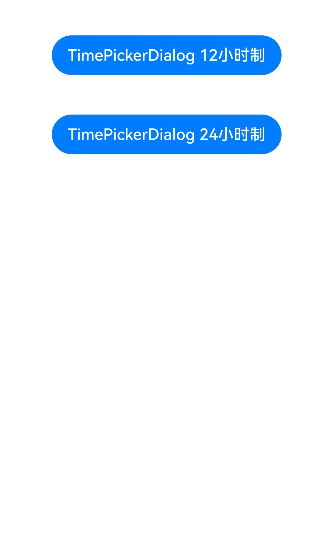

# 时间滑动选择器弹窗 (TimePickerDialog)

以24小时的时间区间创建时间滑动选择器，展示在弹窗上。

>  **说明：**
>
> 该组件从API Version 8开始支持。后续版本如有新增内容，则采用上角标单独标记该内容的起始版本。
>
> 本模块功能依赖UI的执行上下文，不可在UI上下文不明确的地方使用，参见[UIContext](../js-apis-arkui-UIContext.md#uicontext)说明。
>
> 从API version 10开始，可以通过使用[UIContext](../js-apis-arkui-UIContext.md#uicontext)中的[showTimePickerDialog](../js-apis-arkui-UIContext.md#showtimepickerdialog)来明确UI的执行上下文。

## TimePickerDialog.show

static show(options?: TimePickerDialogOptions)

定义时间滑动选择器弹窗并弹出。

**原子化服务API：** 从API version 11开始，该接口支持在原子化服务中使用。

**系统能力：** SystemCapability.ArkUI.ArkUI.Full

**参数：** 

| 参数名  | 类型                                                        | 必填 | 说明                       |
| ------- | ----------------------------------------------------------- | ---- | -------------------------- |
| options | [TimePickerDialogOptions](#timepickerdialogoptions对象说明) | 否   | 配置时间选择器弹窗的参数。 |

## TimePickerDialogOptions对象说明

继承自[TimePickerOptions](ts-basic-components-timepicker.md#timepickeroptions对象说明)。


| 名称 | 类型 | 必填 | 说明 |
| -------- | -------- | -------- | -------- |
| useMilitaryTime | boolean | 否 | 展示时间是否为24小时制，默认为12小时制。<br/>默认值：false<br />**说明：** 当展示时间为12小时制时，上下午与小时无联动关系。<br/>**原子化服务API：** 从API version 11开始，该接口支持在原子化服务中使用。 |
| disappearTextStyle<sup>10+</sup> | [PickerTextStyle](ts-basic-components-datepicker.md#pickertextstyle10类型说明) | 否 | 设置所有选项中最上和最下两个选项的文本颜色、字号、字体粗细。<br/>默认值：<br/>{<br/>color: '#ff182431',<br/>font: {<br/>size: '14fp', <br/>weight: FontWeight.Regular<br/>}<br/>}<br/>**原子化服务API：** 从API version 11开始，该接口支持在原子化服务中使用。 |
| textStyle<sup>10+</sup> | [PickerTextStyle](ts-basic-components-datepicker.md#pickertextstyle10类型说明) | 否 | 设置所有选项中除了最上、最下及选中项以外的文本颜色、字号、字体粗细。<br/>默认值：<br/>{<br/>color: '#ff182431',<br/>font: {<br/>size: '16fp', <br/>weight: FontWeight.Regular<br/>}<br/>}<br/>**原子化服务API：** 从API version 11开始，该接口支持在原子化服务中使用。 |
| selectedTextStyle<sup>10+</sup> | [PickerTextStyle](ts-basic-components-datepicker.md#pickertextstyle10类型说明) | 否 | 设置选中项的文本颜色、字号、字体粗细。<br/>默认值：<br/>{<br/>color: '#ff007dff',<br/>font: {<br/>size: '20vp', <br/>weight: FontWeight.Medium<br/>}<br/>}<br/>**原子化服务API：** 从API version 11开始，该接口支持在原子化服务中使用。 |
| acceptButtonStyle<sup>12+</sup> | [PickerDialogButtonStyle](ts-methods-datepicker-dialog.md#pickerdialogbuttonstyle12类型说明) | 否 | 设置确认按钮显示样式、样式和重要程度、角色、背景色、圆角、文本颜色、字号、字体粗细、字体样式、字体列表、按钮是否默认响应Enter键。<br />**说明：**<br />acceptButtonStyle与cancelButtonStyle中最多只能有一个primary字段配置为true，二者primary字段均配置为true时均不生效。<br/>**原子化服务API：** 从API version 12开始，该接口支持在原子化服务中使用。|
| cancelButtonStyle<sup>12+</sup> | [PickerDialogButtonStyle](ts-methods-datepicker-dialog.md#pickerdialogbuttonstyle12类型说明) | 否 | 设置取消按钮显示样式、样式和重要程度、角色、背景色、圆角、文本颜色、字号、字体粗细、字体样式、字体列表、按钮是否默认响应Enter键。<br />**说明：**<br />acceptButtonStyle与cancelButtonStyle中最多只能有一个primary字段配置为true，二者primary字段均配置为true时均不生效。<br/>**原子化服务API：** 从API version 12开始，该接口支持在原子化服务中使用。|
| alignment<sup>10+</sup>  | [DialogAlignment](ts-methods-alert-dialog-box.md#dialogalignment枚举说明) | 否   | 弹窗在竖直方向上的对齐方式。<br>默认值：DialogAlignment.Default<br/>**原子化服务API：** 从API version 11开始，该接口支持在原子化服务中使用。 |
| offset<sup>10+</sup>     | [Offset](ts-types.md#offset) | 否     | 弹窗相对alignment所在位置的偏移量。<br/>默认值：{&nbsp;dx:&nbsp;0&nbsp;,&nbsp;dy:&nbsp;0&nbsp;}<br/>**原子化服务API：** 从API version 11开始，该接口支持在原子化服务中使用。 |
| maskRect<sup>10+</sup>| [Rectangle](ts-methods-alert-dialog-box.md#rectangle8类型说明) | 否     | 弹窗遮蔽层区域，在遮蔽层区域内的事件不透传，在遮蔽层区域外的事件透传。<br/>默认值：{ x: 0, y: 0, width: '100%', height: '100%' }<br/>**原子化服务API：** 从API version 11开始，该接口支持在原子化服务中使用。 |
| onAccept | (value: [TimePickerResult](ts-basic-components-timepicker.md#TimePickerResult对象说明)) => void | 否 | 点击弹窗中的“确定”按钮时触发该回调。<br/>**原子化服务API：** 从API version 11开始，该接口支持在原子化服务中使用。 |
| onCancel | () => void | 否 | 点击弹窗中的“取消”按钮时触发该回调。<br/>**原子化服务API：** 从API version 11开始，该接口支持在原子化服务中使用。 |
| onChange | (value: [TimePickerResult](ts-basic-components-timepicker.md#TimePickerResult对象说明)) => void | 否 | 滑动弹窗中的选择器使当前选中时间改变时触发该回调。<br/>**原子化服务API：** 从API version 11开始，该接口支持在原子化服务中使用。 |
| backgroundColor<sup>11+</sup> | [ResourceColor](ts-types.md#resourcecolor)  | 否 | 弹窗背板颜色。<br/>默认值：Color.Transparent<br/>**原子化服务API：** 从API version 12开始，该接口支持在原子化服务中使用。 |
| backgroundBlurStyle<sup>11+</sup> | [BlurStyle](ts-appendix-enums.md#blurstyle9) | 否 | 弹窗背板模糊材质。<br/>默认值：BlurStyle.COMPONENT_ULTRA_THICK<br/>**原子化服务API：** 从API version 12开始，该接口支持在原子化服务中使用。 |
| onDidAppear<sup>12+</sup> | () => void | 否 | 弹窗弹出时的事件回调。<br />**说明：**<br />1.正常时序依次为：onWillAppear>>onDidAppear>>(onAccept/onCancel/onChange)>>onWillDisappear>>onDidDisappear。<br />2.在onDidAppear内设置改变弹窗显示效果的回调事件，二次弹出生效。<br />3.快速点击弹出，消失弹窗时，存在onWillDisappear在onDidAppear前生效。<br />4. 当弹窗入场动效未完成时关闭弹窗，该回调不会触发。<br/>**原子化服务API：** 从API version 12开始，该接口支持在原子化服务中使用。 |
| onDidDisappear<sup>12+</sup> | () => void | 否 | 弹窗消失时的事件回调。<br />**说明：**<br />1.正常时序依次为：onWillAppear>>onDidAppear>>(onAccept/onCancel/onChange)>>onWillDisappear>>onDidDisappear。<br/>**原子化服务API：** 从API version 12开始，该接口支持在原子化服务中使用。 |
| onWillAppear<sup>12+</sup> | () => void | 否 | 弹窗显示动效前的事件回调。<br />**说明：**<br />1.正常时序依次为：onWillAppear>>onDidAppear>>(onAccept/onCancel/onChange)>>onWillDisappear>>onDidDisappear。<br />2.在onWillAppear内设置改变弹窗显示效果的回调事件，二次弹出生效。<br/>**原子化服务API：** 从API version 12开始，该接口支持在原子化服务中使用。|
| onWillDisappear<sup>12+</sup> | () => void | 否 | 弹窗退出动效前的事件回调。<br />**说明：**<br />1.正常时序依次为：onWillAppear>>onDidAppear>>(onAccept/onCancel/onChange)>>onWillDisappear>>onDidDisappear。<br />2.快速点击弹出，消失弹窗时，存在onWillDisappear在onDidAppear前生效。<br/>**原子化服务API：** 从API version 12开始，该接口支持在原子化服务中使用。|
| shadow<sup>12+</sup>              | [ShadowOptions](ts-universal-attributes-image-effect.md#shadowoptions对象说明)&nbsp;\|&nbsp;[ShadowStyle](ts-universal-attributes-image-effect.md#shadowstyle10枚举说明) | 否   | 设置弹窗背板的阴影。<br />当设备为2in1时，默认场景下获焦阴影值为ShadowStyle.OUTER_FLOATING_MD，失焦为ShadowStyle.OUTER_FLOATING_SM <br/>**原子化服务API：** 从API version 12开始，该接口支持在原子化服务中使用。|
| dateTimeOptions<sup>12+</sup> | [DateTimeOptions](../../apis-localization-kit/js-apis-intl.md#datetimeoptions) | 否 | 设置时分是否显示前置0，目前只支持设置hour和minute参数。<br/>默认值：<br/>hour: 24小时制默认为"2-digit"，即有前置0；12小时制默认为"numeric"，即没有前置0。<br/>minute: 默认为"2-digit"，即有前置0。<br/>**原子化服务API：** 从API version 12开始，该接口支持在原子化服务中使用。|

## 示例

### 示例1

TimePickerDialog基本使用

```ts
// xxx.ets
@Entry
@Component
struct TimePickerDialogExample {
  private selectTime: Date = new Date('2020-12-25T08:30:00')

  build() {
    Column() {
      Button("TimePickerDialog 12小时制")
        .margin(20)
        .onClick(() => {
          TimePickerDialog.show({
            selected: this.selectTime,
            disappearTextStyle: { color: Color.Red, font: { size: 15, weight: FontWeight.Lighter } },
            textStyle: { color: Color.Black, font: { size: 20, weight: FontWeight.Normal } },
            selectedTextStyle: { color: Color.Blue, font: { size: 30, weight: FontWeight.Bolder } },
            onAccept: (value: TimePickerResult) => {
              // 设置selectTime为按下确定按钮时的时间，这样当弹窗再次弹出时显示选中的为上一次确定的时间
              if (value.hour != undefined && value.minute != undefined) {
                this.selectTime.setHours(value.hour, value.minute)
                console.info("TimePickerDialog:onAccept()" + JSON.stringify(value))
              }
            },
            onCancel: () => {
              console.info("TimePickerDialog:onCancel()")
            },
            onChange: (value: TimePickerResult) => {
              console.info("TimePickerDialog:onChange()" + JSON.stringify(value))
            },
            onDidAppear: () => {
              console.info("TimePickerDialog:onDidAppear()")
            },
            onDidDisappear: () => {
              console.info("TimePickerDialog:onDidDisappear()")
            },
            onWillAppear: () => {
              console.info("TimePickerDialog:onWillAppear()")
            },
            onWillDisappear: () => {
              console.info("TimePickerDialog:onWillDisappear()")
            }
          })
        })
      Button("TimePickerDialog 24小时制")
        .margin(20)
        .onClick(() => {
          TimePickerDialog.show({
            selected: this.selectTime,
            useMilitaryTime: true,
            disappearTextStyle: { color: Color.Red, font: { size: 15, weight: FontWeight.Lighter } },
            textStyle: { color: Color.Black, font: { size: 20, weight: FontWeight.Normal } },
            selectedTextStyle: { color: Color.Blue, font: { size: 30, weight: FontWeight.Bolder } },
            onAccept: (value: TimePickerResult) => {
              if (value.hour != undefined && value.minute != undefined) {
                this.selectTime.setHours(value.hour, value.minute)
                console.info("TimePickerDialog:onAccept()" + JSON.stringify(value))
              }
            },
            onCancel: () => {
              console.info("TimePickerDialog:onCancel()")
            },
            onChange: (value: TimePickerResult) => {
              console.info("TimePickerDialog:onChange()" + JSON.stringify(value))
            },
            onDidAppear: () => {
              console.info("TimePickerDialog:onDidAppear()")
            },
            onDidDisappear: () => {
              console.info("TimePickerDialog:onDidDisappear()")
            },
            onWillAppear: () => {
              console.info("TimePickerDialog:onWillAppear()")
            },
            onWillDisappear: () => {
              console.info("TimePickerDialog:onWillDisappear()")
            }
          })
        })
    }.width('100%')
  }
}
```




### 示例2

按钮支持自定义样式

```ts
// xxx.ets
@Entry
@Component
struct TimePickerDialogExample {
  private selectTime: Date = new Date('2020-12-25T08:30:00')

  build() {
    Column() {
      Button("TimePickerDialog 24小时制")
        .margin(20)
        .onClick(() => {
          TimePickerDialog.show({
            selected: this.selectTime,
            useMilitaryTime: true,
            disappearTextStyle: { color: Color.Red, font: { size: 15, weight: FontWeight.Lighter } },
            textStyle: { color: Color.Black, font: { size: 20, weight: FontWeight.Normal } },
            selectedTextStyle: { color: Color.Blue, font: { size: 30, weight: FontWeight.Bolder } },
            acceptButtonStyle: { type: ButtonType.Normal, style: ButtonStyleMode.NORMAL, role: ButtonRole.NORMAL, fontColor: Color.Red,
              fontSize: '26fp', fontWeight: FontWeight.Bolder, fontStyle: FontStyle.Normal, fontFamily: 'sans-serif', backgroundColor:'#80834511',
              borderRadius: 20 },
            cancelButtonStyle: { type: ButtonType.Normal, style: ButtonStyleMode.NORMAL, role: ButtonRole.NORMAL, fontColor: Color.Blue,
              fontSize: '16fp', fontWeight: FontWeight.Normal, fontStyle: FontStyle.Italic, fontFamily: 'sans-serif', backgroundColor:'#50182431',
              borderRadius: 10 },
            onAccept: (value: TimePickerResult) => {
              if (value.hour != undefined && value.minute != undefined) {
                this.selectTime.setHours(value.hour, value.minute)
                console.info("TimePickerDialog:onAccept()" + JSON.stringify(value))
              }
            },
            onCancel: () => {
              console.info("TimePickerDialog:onCancel()")
            },
            onChange: (value: TimePickerResult) => {
              console.info("TimePickerDialog:onChange()" + JSON.stringify(value))
            },
            onDidAppear: () => {
              console.info("TimePickerDialog:onDidAppear()")
            },
            onDidDisappear: () => {
              console.info("TimePickerDialog:onDidDisappear()")
            },
            onWillAppear: () => {
              console.info("TimePickerDialog:onWillAppear()")
            },
            onWillDisappear: () => {
              console.info("TimePickerDialog:onWillDisappear()")
            }
          })
        })
    }.width('100%')
  }
}
```


