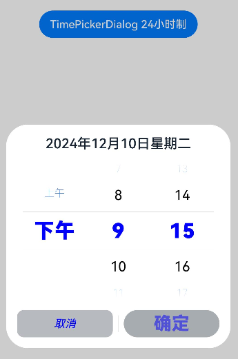
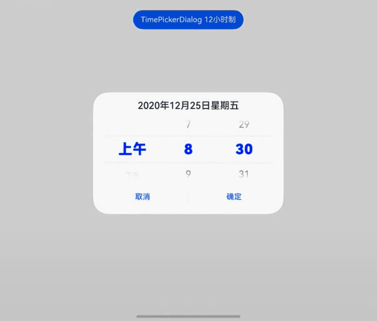
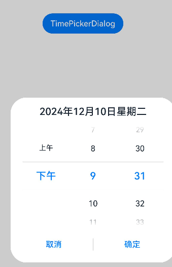
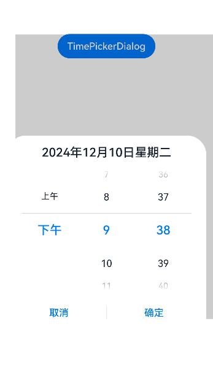
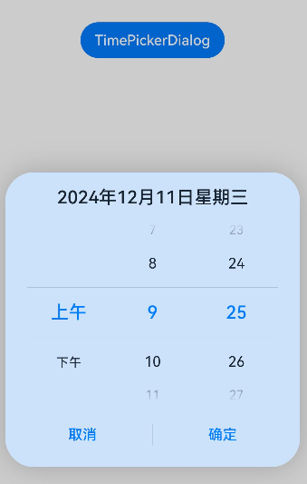
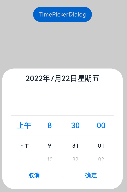
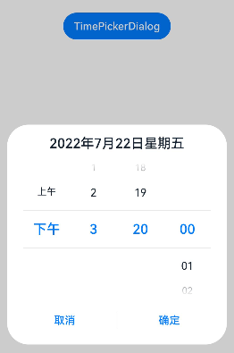

# 时间滑动选择器弹窗 (TimePickerDialog)

以24小时的时间区间创建时间滑动选择器，展示在弹窗上。

>  **说明：**
>
> - 该组件从API Version 8开始支持。后续版本如有新增内容，则采用上角标单独标记该内容的起始版本。
>
> - 本模块功能依赖UI的执行上下文，不可在[UI上下文不明确](../../../ui/arkts-global-interface.md)的地方使用，参见[UIContext](../js-apis-arkui-UIContext.md#uicontext)说明。
>
> - 该组件不支持在Wearable设备上使用。

## TimePickerDialog

### show<sup>(deprecated)</sup>

static show(options?: TimePickerDialogOptions)

定义时间滑动选择器弹窗并弹出。

> **说明：**
> 
> 从API version 18开始废弃，建议使用[UIContext](../js-apis-arkui-UIContext.md#uicontext)中的[showTimePickerDialog](../js-apis-arkui-UIContext.md#showtimepickerdialog)替代。
>
> 从API version 10开始，可以通过使用[UIContext](../js-apis-arkui-UIContext.md#uicontext)中的[showTimePickerDialog](../js-apis-arkui-UIContext.md#showtimepickerdialog)来明确UI的执行上下文。

**原子化服务API：** 从API version 11开始，该接口支持在原子化服务中使用。

**系统能力：** SystemCapability.ArkUI.ArkUI.Full

**参数：**

| 参数名  | 类型                                                        | 必填 | 说明                       |
| ------- | ----------------------------------------------------------- | ---- | -------------------------- |
| options | [TimePickerDialogOptions](#timepickerdialogoptions对象说明) | 否   | 配置时间选择器弹窗的参数。 |

## TimePickerDialogOptions对象说明

时间选择器弹窗选项。

继承自[TimePickerOptions](ts-basic-components-timepicker.md#timepickeroptions对象说明)。

**系统能力：** SystemCapability.ArkUI.ArkUI.Full

| 名称 | 类型 | 只读 | 可选 | 说明 |
| -------- | -------- | -------- | -------- | -------- |
| useMilitaryTime | boolean | 否 | 是 | 是否使用24小时制展示时间，默认为12小时制。<br/>默认值：false<br />**说明：** 当展示时间为12小时制时，上下午与小时无联动关系。<br/>**原子化服务API：** 从API version 11开始，该接口支持在原子化服务中使用。 |
| disappearTextStyle<sup>10+</sup> | [PickerTextStyle](ts-basic-components-datepicker.md#pickertextstyle10类型说明) | 否 | 是 | 设置过渡项（以选中项为基准向上或向下的第二项）的文本颜色、字号、字体粗细。<br/>默认值：<br/>{<br/>color: '#ff182431',<br/>font: {<br/>size: '14fp', <br/>weight: FontWeight.Regular<br/>}<br/>}<br/>**原子化服务API：** 从API version 11开始，该接口支持在原子化服务中使用。 |
| textStyle<sup>10+</sup> | [PickerTextStyle](ts-basic-components-datepicker.md#pickertextstyle10类型说明) | 否 | 是 | 设置一般项（以选中项为基准向上或向下的第一项）的文本颜色、字号、字体粗细。<br/>默认值：<br/>{<br/>color: '#ff182431',<br/>font: {<br/>size: '16fp', <br/>weight: FontWeight.Regular<br/>}<br/>}<br/>**原子化服务API：** 从API version 11开始，该接口支持在原子化服务中使用。 |
| selectedTextStyle<sup>10+</sup> | [PickerTextStyle](ts-basic-components-datepicker.md#pickertextstyle10类型说明) | 否 | 是 | 设置选中项的文本颜色、字号、字体粗细。<br/>默认值：<br/>{<br/>color: '#ff007dff',<br/>font: {<br/>size: '20fp', <br/>weight: FontWeight.Medium<br/>}<br/>}<br/>**原子化服务API：** 从API version 11开始，该接口支持在原子化服务中使用。 |
| acceptButtonStyle<sup>12+</sup> | [PickerDialogButtonStyle](ts-methods-datepicker-dialog.md#pickerdialogbuttonstyle12类型说明) | 否 | 是 | 设置确认按钮显示样式、样式和重要程度、角色、背景色、圆角、文本颜色、字号、字体粗细、字体样式、字体列表、按钮是否默认响应Enter键。<br />**说明：**<br/> 1.acceptButtonStyle与cancelButtonStyle中最多只能有一个primary字段配置为true，如果同时设置为true，则primary字段不生效，保持默认值false。<br/>2.按钮高度默认40vp，在关怀模式-大字体场景下高度不变，即使按钮样式设置为圆角矩形[ROUNDED_RECTANGLE](ts-basic-components-button.md#buttontype枚举说明)，呈现效果依然是胶囊型按钮[Capsule](ts-basic-components-button.md#buttontype枚举说明)。<br/>**原子化服务API：** 从API version 12开始，该接口支持在原子化服务中使用。|
| cancelButtonStyle<sup>12+</sup> | [PickerDialogButtonStyle](ts-methods-datepicker-dialog.md#pickerdialogbuttonstyle12类型说明) | 否 | 是 | 设置取消按钮显示样式、样式和重要程度、角色、背景色、圆角、文本颜色、字号、字体粗细、字体样式、字体列表、按钮是否默认响应Enter键。<br />**说明：**<br/>1.acceptButtonStyle与cancelButtonStyle中最多只能有一个primary字段配置为true，如果同时设置为true，则primary字段不生效，保持默认值false。<br/>2.按钮高度默认40vp，在关怀模式-大字体场景下高度不变，即使按钮样式设置为圆角矩形[ROUNDED_RECTANGLE](ts-basic-components-button.md#buttontype枚举说明)，呈现效果依然是胶囊型按钮[Capsule](ts-basic-components-button.md#buttontype枚举说明)。<br/>**原子化服务API：** 从API version 12开始，该接口支持在原子化服务中使用。|
| alignment<sup>10+</sup>  | [DialogAlignment](ts-methods-alert-dialog-box.md#dialogalignment枚举说明) | 否  | 是  | 设置弹窗在竖直方向上的对齐方式。<br>默认值：DialogAlignment.Default<br/>**原子化服务API：** 从API version 11开始，该接口支持在原子化服务中使用。 |
| offset<sup>10+</sup>     | [Offset](ts-types.md#offset) | 否    | 是    | 设置弹窗相对alignment所在位置的偏移量。<br/>默认值：{&nbsp;dx:&nbsp;0&nbsp;,&nbsp;dy:&nbsp;0&nbsp;}<br/>**原子化服务API：** 从API version 11开始，该接口支持在原子化服务中使用。 |
| maskRect<sup>10+</sup>| [Rectangle](ts-methods-alert-dialog-box.md#rectangle8类型说明) | 否    | 是    | 弹窗遮蔽层区域，在遮蔽层区域内的事件不透传，在遮蔽层区域外的事件透传。<br/>默认值：{ x: 0, y: 0, width: '100%', height: '100%' }<br/>**原子化服务API：** 从API version 11开始，该接口支持在原子化服务中使用。 |
| onAccept | (value: [TimePickerResult](ts-basic-components-timepicker.md#timepickerresult对象说明)) => void | 否 | 是 | 点击弹窗中的“确定”按钮时触发该回调。<br/>**原子化服务API：** 从API version 11开始，该接口支持在原子化服务中使用。 |
| onCancel | () => void | 否 | 是 | 点击弹窗中的“取消”按钮时触发该回调。<br/>**原子化服务API：** 从API version 11开始，该接口支持在原子化服务中使用。 |
| onChange | (value: [TimePickerResult](ts-basic-components-timepicker.md#timepickerresult对象说明)) => void | 否 | 是 | 滑动弹窗中的选择器后，选项归位至选中项位置时，触发该回调。<br/>**原子化服务API：** 从API version 11开始，该接口支持在原子化服务中使用。 |
| backgroundColor<sup>11+</sup> | [ResourceColor](ts-types.md#resourcecolor)  | 否 | 是 | 弹窗背板颜色。<br/>默认值：Color.Transparent<br/>**说明：** <br/>当设置了backgroundColor为非透明色时，backgroundBlurStyle需要设置为BlurStyle.NONE，否则颜色显示将不符合预期效果。<br/>**原子化服务API：** 从API version 12开始，该接口支持在原子化服务中使用。 |
| backgroundBlurStyle<sup>11+</sup> | [BlurStyle](ts-universal-attributes-background.md#blurstyle9) | 否 | 是 | 弹窗背板模糊材质。<br/>默认值：BlurStyle.COMPONENT_ULTRA_THICK<br/>**说明：** <br/>设置为BlurStyle.NONE即可关闭背景虚化。当设置了backgroundBlurStyle为非NONE值时，则不要设置backgroundColor，否则颜色显示将不符合预期效果。<br/>**原子化服务API：** 从API version 12开始，该接口支持在原子化服务中使用。 |
| backgroundBlurStyleOptions<sup>19+</sup> | [BackgroundBlurStyleOptions](ts-universal-attributes-background.md#backgroundblurstyleoptions10对象说明) | 否 | 是 | 背景模糊效果。<br />**原子化服务API：** 从API version 19开始，该接口支持在原子化服务中使用。 |
| backgroundEffect<sup>19+</sup> | [BackgroundEffectOptions](ts-universal-attributes-background.md#backgroundeffectoptions11) | 否 | 是 | 背景效果参数。<br />**原子化服务API：** 从API version 19开始，该接口支持在原子化服务中使用。 |
| onDidAppear<sup>12+</sup> | () => void | 否 | 是 | 弹窗弹出时的事件回调。<br />**说明：**<br />1.正常时序依次为：onWillAppear>>onDidAppear>>(onAccept/onCancel/onChange)>>onWillDisappear>>onDidDisappear。<br />2.在onDidAppear内设置改变弹窗显示效果的回调事件，二次弹出生效。<br />3.快速点击弹出，消失弹窗时，存在onWillDisappear在onDidAppear前生效。<br />4. 当弹窗入场动效未完成时关闭弹窗，该回调不会触发。<br/>**原子化服务API：** 从API version 12开始，该接口支持在原子化服务中使用。 |
| onDidDisappear<sup>12+</sup> | () => void | 否 | 是 | 弹窗消失时的事件回调。<br />**说明：**<br />1.正常时序依次为：onWillAppear>>onDidAppear>>(onAccept/onCancel/onChange)>>onWillDisappear>>onDidDisappear。<br/>**原子化服务API：** 从API version 12开始，该接口支持在原子化服务中使用。 |
| onWillAppear<sup>12+</sup> | () => void | 否 | 是 | 弹窗显示动效前的事件回调。<br />**说明：**<br />1.正常时序依次为：onWillAppear>>onDidAppear>>(onAccept/onCancel/onChange)>>onWillDisappear>>onDidDisappear。<br />2.在onWillAppear内设置改变弹窗显示效果的回调事件，二次弹出生效。<br/>**原子化服务API：** 从API version 12开始，该接口支持在原子化服务中使用。|
| onWillDisappear<sup>12+</sup> | () => void | 否 | 是 | 弹窗退出动效前的事件回调。<br />**说明：**<br />1.正常时序依次为：onWillAppear>>onDidAppear>>(onAccept/onCancel/onChange)>>onWillDisappear>>onDidDisappear。<br />2.快速点击弹出，消失弹窗时，存在onWillDisappear在onDidAppear前生效。<br/>**原子化服务API：** 从API version 12开始，该接口支持在原子化服务中使用。|
| shadow<sup>12+</sup>              | [ShadowOptions](ts-universal-attributes-image-effect.md#shadowoptions对象说明)&nbsp;\|&nbsp;[ShadowStyle](ts-universal-attributes-image-effect.md#shadowstyle10枚举说明) | 否  | 是  | 设置弹窗背板的阴影。<br />当设备为2in1时，默认场景下获焦阴影值为ShadowStyle.OUTER_FLOATING_MD，失焦为ShadowStyle.OUTER_FLOATING_SM。 <br/>**原子化服务API：** 从API version 12开始，该接口支持在原子化服务中使用。|
| dateTimeOptions<sup>12+</sup> | [DateTimeOptions](../../apis-localization-kit/js-apis-intl.md#datetimeoptions) | 否 | 是 | 设置时分是否显示前导0，目前只支持设置hour和minute参数。<br/>默认值：<br/>hour: 24小时制默认为"2-digit"，设置hour是否按照2位数字显示，如果实际数值小于10，则会补充前导0并显示，即为"0X"；12小时制默认为"numeric"，即没有前导0。<br/>minute: 默认为"2-digit"，设置minute是否按照2位数字显示，如果实际数值小于10，则会补充前导0并显示，即为"0X"。<br/>**原子化服务API：** 从API version 12开始，该接口支持在原子化服务中使用。|
| enableHoverMode<sup>14+</sup>     | boolean | 否  | 是  | 是否响应悬停态。<br />默认值：false，默认不响应。<br/>**原子化服务API：** 从API version 14开始，该接口支持在原子化服务中使用。|
| hoverModeArea<sup>14+</sup>       | [HoverModeAreaType](ts-appendix-enums.md#hovermodeareatype14) | 否  | 是  | 悬停态下弹窗默认展示区域。<br />默认值：HoverModeAreaType.BOTTOM_SCREEN <br/>**原子化服务API：** 从API version 14开始，该接口支持在原子化服务中使用。|
| onEnterSelectedArea<sup>18+</sup>   |  Callback\<[TimePickerResult](ts-basic-components-timepicker.md#timepickerresult对象说明)> | 否  | 是  |  滑动过程中，选项进入分割线区域内，触发该回调。与onChange事件的差别在于，该事件的触发时机早于onChange事件，当当前滑动列滑动距离超过选中项高度的一半时，选项此时已经进入分割线区域内，会触发该事件。<br />**说明：**<br />当enableCascade设置为true时，由于上午/下午列与小时列存在联动关系，不建议使用该回调。该回调标识的是滑动过程中选项进入分割线区域内的节点，而联动变化的选项并不涉及滑动，因此，回调的返回值中，仅当前滑动列的值会正常变化，其余未滑动列的值保持不变。<br/>**原子化服务API：** 从API version 18开始，该接口支持在原子化服务中使用。 |
| enableCascade<sup>18+</sup>              | boolean | 否  | 是  | 设置12小时制时上午和下午标识是否会根据小时数自动切换。<br/>默认值：false，false表示不开启自动切换，true表示开启自动切换。<br/>**原子化服务API：** 从API version 18开始，该接口支持在原子化服务中使用。|
| enableHapticFeedback<sup>18+</sup> | boolean | 否  | 是  | 设置是否开启触控反馈。<br />默认值：true，true表示开启触控反馈，false表示不开启触控反馈。<br />**原子化服务API**： 从API version 18开始，该接口支持在原子化服务中使用。<br />**说明**：<br />开启触控反馈时，需要在工程的module.json5中配置requestPermissions字段开启振动权限，配置如下：<br />"requestPermissions": [{"name": "ohos.permission.VIBRATE"}]|

**异常情形说明:**

| 异常情形   | 对应结果  |
| -------- |  ------------------------------------------------------------ |
| 起始时间晚于结束时间    | 起始时间、结束时间都为默认值  |
| 选中时间早于起始时间    | 选中时间为起始时间  |
| 选中时间晚于结束时间    | 选中时间为结束时间  |
| 起始时间晚于当前系统时间，选中时间未设置    | 选中时间为起始时间 |
| 结束时间早于当前系统时间，选中时间未设置    | 选中时间为结束时间  |
| 时间格式不符合规范，如'01:61:61'   | 取默认值  |

## 示例

>  **说明：**
>
> 推荐通过使用[UIContext](../js-apis-arkui-UIContext.md#uicontext)中的[showTimePickerDialog](../js-apis-arkui-UIContext.md#showtimepickerdialog)来明确UI的执行上下文。

### 示例1（设置时间格式）

该示例通过useMilitaryTime、dateTimeOptions、format设置时间格式。

```ts
@Entry
@Component
struct TimePickerDialogExample {
  private selectTime: Date = new Date('2020-12-25T08:30:00');

  build() {
    Column() {
      Button("TimePickerDialog 12小时制")
        .margin(20)
        .onClick(() => {
          this.getUIContext().showTimePickerDialog({
            selected: this.selectTime,
            format: TimePickerFormat.HOUR_MINUTE,
            useMilitaryTime: false,
            dateTimeOptions: { hour: "numeric", minute: "2-digit" },
            onAccept: (value: TimePickerResult) => {
              // 设置selectTime为按下确定按钮时的时间，这样当弹窗再次弹出时显示选中的为上一次确定的时间
              if (value.hour != undefined && value.minute != undefined) {
                this.selectTime.setHours(value.hour, value.minute);
                console.info("TimePickerDialog:onAccept()" + JSON.stringify(value));
              }
            },
            onCancel: () => {
              console.info("TimePickerDialog:onCancel()");
            },
            onChange: (value: TimePickerResult) => {
              console.info("TimePickerDialog:onChange()" + JSON.stringify(value));
            },
            onDidAppear: () => {
              console.info("TimePickerDialog:onDidAppear()");
            },
            onDidDisappear: () => {
              console.info("TimePickerDialog:onDidDisappear()");
            },
            onWillAppear: () => {
              console.info("TimePickerDialog:onWillAppear()");
            },
            onWillDisappear: () => {
              console.info("TimePickerDialog:onWillDisappear()");
            }
          });
        })
      Button("TimePickerDialog 24小时制")
        .margin(20)
        .onClick(() => {
          this.getUIContext().showTimePickerDialog({
            selected: this.selectTime,
            format: TimePickerFormat.HOUR_MINUTE_SECOND,
            useMilitaryTime: true,
            onAccept: (value: TimePickerResult) => {
              if (value.hour != undefined && value.minute != undefined) {
                this.selectTime.setHours(value.hour, value.minute);
                console.info("TimePickerDialog:onAccept()" + JSON.stringify(value));
              }
            },
          })
        })
    }.width('100%')
  }
}
```


### 示例2（自定义样式）

该示例通过配置disappearTextStyle、textStyle、selectedTextStyle、acceptButtonStyle、cancelButtonStyle实现了自定义文本以及按钮样式。

```ts
// xxx.ets
@Entry
@Component
struct TimePickerDialogExample {
  private selectTime: Date = new Date('2020-12-25T08:30:00');

  build() {
    Column() {
      Button("TimePickerDialog 24小时制")
        .margin(20)
        .onClick(() => {
          this.getUIContext().showTimePickerDialog({
            disappearTextStyle: { color: '#297bec', font: { size: 15, weight: FontWeight.Lighter } },
            textStyle: { color: Color.Black, font: { size: 20, weight: FontWeight.Normal } },
            selectedTextStyle: { color: Color.Blue, font: { size: 30, weight: FontWeight.Bolder } },
            acceptButtonStyle: {
              type: ButtonType.Normal,
              style: ButtonStyleMode.NORMAL,
              role: ButtonRole.NORMAL,
              fontColor: 'rgb(81, 81, 216)',
              fontSize: '26fp',
              fontWeight: FontWeight.Bolder,
              fontStyle: FontStyle.Normal,
              fontFamily: 'sans-serif',
              backgroundColor: '#A6ACAF',
              borderRadius: 20
            },
            cancelButtonStyle: {
              type: ButtonType.Normal,
              style: ButtonStyleMode.NORMAL,
              role: ButtonRole.NORMAL,
              fontColor: Color.Blue,
              fontSize: '16fp',
              fontWeight: FontWeight.Normal,
              fontStyle: FontStyle.Italic,
              fontFamily: 'sans-serif',
              backgroundColor: '#50182431',
              borderRadius: 10
            },
            onAccept: (value: TimePickerResult) => {
              if (value.hour != undefined && value.minute != undefined) {
                this.selectTime.setHours(value.hour, value.minute);
                console.info("TimePickerDialog:onAccept()" + JSON.stringify(value));
              }
            }
          });
        })
    }.width('100%')
  }
}
```



### 示例3（悬停态弹窗）

该示例展示了在折叠屏悬停态下设置dialog布局区域的效果。

```ts
@Entry
@Component
struct TimePickerDialogExample {
  private selectTime: Date = new Date('2020-12-25T08:30:00');

  build() {
    Column() {
      Button("TimePickerDialog 12小时制")
        .margin(20)
        .onClick(() => {
          this.getUIContext().showTimePickerDialog({
            selected: this.selectTime,
            disappearTextStyle: { color: Color.Red, font: { size: 15, weight: FontWeight.Lighter } },
            textStyle: { color: Color.Black, font: { size: 20, weight: FontWeight.Normal } },
            selectedTextStyle: { color: Color.Blue, font: { size: 30, weight: FontWeight.Bolder } },
            onAccept: (value: TimePickerResult) => {
              // 设置selectTime为按下确定按钮时的时间，这样当弹窗再次弹出时显示选中的为上一次确定的时间
              if (value.hour != undefined && value.minute != undefined) {
                this.selectTime.setHours(value.hour, value.minute);
                console.info("TimePickerDialog:onAccept()" + JSON.stringify(value));
              }
            },
            onCancel: () => {
              console.info("TimePickerDialog:onCancel()");
            },
            onChange: (value: TimePickerResult) => {
              console.info("TimePickerDialog:onChange()" + JSON.stringify(value));
            },
            onDidAppear: () => {
              console.info("TimePickerDialog:onDidAppear()");
            },
            onDidDisappear: () => {
              console.info("TimePickerDialog:onDidDisappear()");
            },
            onWillAppear: () => {
              console.info("TimePickerDialog:onWillAppear()");
            },
            onWillDisappear: () => {
              console.info("TimePickerDialog:onWillDisappear()");
            },
            enableHoverMode: true,
            hoverModeArea: HoverModeAreaType.TOP_SCREEN
          });
        })
    }.width('100%')
  }
}
```



### 示例4（设置弹窗位置）

该示例通过alignment和offset设置弹窗的位置。

```ts
// xxx.ets
@Entry
@Component
struct TimePickerDialogExample {
  private selectTime: Date = new Date('2020-12-25T08:30:00');

  build() {
    Column() {
      Button("TimePickerDialog")
        .margin(20)
        .onClick(() => {
          this.getUIContext().showTimePickerDialog({
            alignment: DialogAlignment.Center,
            offset: { dx: 20 , dy: 0 },
            onAccept: (value: TimePickerResult) => {
              // 设置selectTime为按下确定按钮时的时间，这样当弹窗再次弹出时显示选中的为上一次确定的时间
              if (value.hour != undefined && value.minute != undefined) {
                this.selectTime.setHours(value.hour, value.minute);
                console.info("TimePickerDialog:onAccept()" + JSON.stringify(value));
              }
            }
          });
        })
    }.width('100%')
  }
}
```



### 示例5（设置遮蔽区）

该示例通过maskRect设置遮蔽区。

```ts
// xxx.ets
@Entry
@Component
struct TimePickerDialogExample {
  private selectTime: Date = new Date('2020-12-25T08:30:00');

  build() {
    Column() {
      Button("TimePickerDialog")
        .margin(20)
        .onClick(() => {
          this.getUIContext().showTimePickerDialog({
            maskRect: { x: 30, y: 60, width: '100%', height: '60%' },
            onAccept: (value: TimePickerResult) => {
              // 设置selectTime为按下确定按钮时的时间，这样当弹窗再次弹出时显示选中的为上一次确定的时间
              if (value.hour != undefined && value.minute != undefined) {
                this.selectTime.setHours(value.hour, value.minute);
                console.info("TimePickerDialog:onAccept()" + JSON.stringify(value));
              }
            }
          });
        })
    }.width('100%')
  }
}
```



### 示例6（设置弹窗背板）

该示例通过maskRect设置弹窗背板。

```ts
// xxx.ets
@Entry
@Component
struct TimePickerDialogExample {
  private selectTime: Date = new Date('2020-12-25T08:30:00');

  build() {
    Column() {
      Button("TimePickerDialog")
        .margin(20)
        .onClick(() => {
          this.getUIContext().showTimePickerDialog({
            backgroundColor: 'rgb(204, 226, 251)',
            backgroundBlurStyle: BlurStyle.NONE,
            shadow: ShadowStyle.OUTER_FLOATING_SM,
            onAccept: (value: TimePickerResult) => {
              // 设置selectTime为按下确定按钮时的时间，这样当弹窗再次弹出时显示选中的为上一次确定的时间
              if (value.hour != undefined && value.minute != undefined) {
                this.selectTime.setHours(value.hour, value.minute);
                console.info("TimePickerDialog:onAccept()" + JSON.stringify(value));
              }
            }
          });
        })
    }.width('100%')
  }
}
```


### 示例7（设置时间滑动选择器弹窗的起始时间）

该示例设置TimePickerDialog的起始时间。

```ts
// xxx.ets
@Entry
@Component
struct TimePickerDialogExample {
  private selectTime: Date = new Date('2022-07-22T08:50:00');

  build() {
    Column() {
      Button("TimePickerDialog")
        .margin(20)
        .onClick(() => {
          this.getUIContext().showTimePickerDialog({
            useMilitaryTime: false,
            selected: this.selectTime,
            format: TimePickerFormat.HOUR_MINUTE_SECOND,
            start: new Date('2022-07-22T08:30:00'),
            onAccept: (value: TimePickerResult) => {
              // 设置selectTime为按下确定按钮时的时间，这样当弹窗再次弹出时显示选中的为上一次确定的时间
              if (value.hour != undefined && value.minute != undefined) {
                this.selectTime.setHours(value.hour, value.minute);
                console.info("TimePickerDialog:onAccept()" + JSON.stringify(value));
              }
            }
          });
        })
    }.width('100%')
  }
}
```


### 示例8（设置时间滑动选择器弹窗的结束时间）

该示例设置TimePickerDialog的结束时间。

```ts
// xxx.ets
@Entry
@Component
struct TimePickerDialogExample {
  private selectTime: Date = new Date('2022-07-22T08:50:00');

  build() {
    Column() {
      Button("TimePickerDialog")
        .margin(20)
        .onClick(() => {
          this.getUIContext().showTimePickerDialog({
            useMilitaryTime: false,
            selected: this.selectTime,
            format: TimePickerFormat.HOUR_MINUTE_SECOND,
            end: new Date('2022-07-22T15:20:00'),
            onAccept: (value: TimePickerResult) => {
              // 设置selectTime为按下确定按钮时的时间，这样当弹窗再次弹出时显示选中的为上一次确定的时间
              if (value.hour != undefined && value.minute != undefined) {
                this.selectTime.setHours(value.hour, value.minute);
                console.info("TimePickerDialog:onAccept()" + JSON.stringify(value));
              }
            }
          });
        })
    }.width('100%')
  }
}
```


### 示例9（设置上午下午跟随时间联动）

该示例通过配置enableCascade实现12小时制时上午下午跟随时间联动。

```ts
// xxx.ets
@Entry
@Component
struct TimePickerDialogExample {
  private selectTime: Date = new Date('2022-07-22T08:00:00');

  build() {
    Column() {
      Button("TimePickerDialog")
        .margin(20)
        .onClick(() => {
          this.getUIContext().showTimePickerDialog({
            useMilitaryTime: false,
            selected: this.selectTime,
            enableCascade:true,
            onAccept: (value: TimePickerResult) => {
              // 设置selectTime为按下确定按钮时的时间，这样当弹窗再次弹出时显示选中的为上一次确定的时间
              if (value.hour != undefined && value.minute != undefined) {
                this.selectTime.setHours(value.hour, value.minute);
                console.info("TimePickerDialog:onAccept()" + JSON.stringify(value));
              }
            }
          });
        })
    }.width('100%')
  }
}
```


