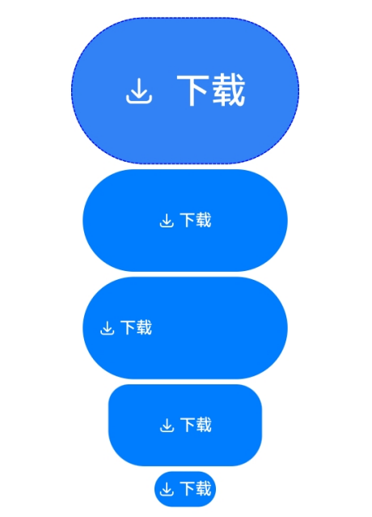

# 安全控件通用属性


安全控件的基础属性，用于设置安全控件通用的属性。


> **说明：**
>
> 该组件从API Version 10开始支持。后续版本如有新增内容，则采用上角标单独标记该内容的起始版本。


## iconSize

iconSize(value: Dimension)

设置安全控件上图标的尺寸。

**原子化服务API：** 从API version 11开始，该接口支持在原子化服务中使用。

**系统能力：** SystemCapability.ArkUI.ArkUI.Full

**参数：**

| 参数名 | 类型                   | 必填 | 说明                   |
|------------|------|-------|---------|
| value | [Dimension](ts-types.md#dimension10) | 否 |安全控件上图标的尺寸。<br/>默认值：16vp|

## layoutDirection

layoutDirection(value: SecurityComponentLayoutDirection)

设置安全控件上图标和文字分布的方向。

**原子化服务API：** 从API version 11开始，该接口支持在原子化服务中使用。

**系统能力：** SystemCapability.ArkUI.ArkUI.Full

**参数：**

| 参数名 | 类型                   | 必填 | 说明                   |
|------------|------|-------|---------|
| value | [SecurityComponentLayoutDirection](#securitycomponentlayoutdirection枚举说明) |否 | 安全控件上图标和文字分布的方向。<br/>默认值：SecurityComponentLayoutDirection.HORIZONTAL|

## position

position(value: Position)

设置绝对定位，设置安全控件的左上角相对于父容器左上角的偏移位置。

**原子化服务API：** 从API version 11开始，该接口支持在原子化服务中使用。

**系统能力：** SystemCapability.ArkUI.ArkUI.Full

**参数：**

| 参数名 | 类型                   | 必填 | 说明                   |
|------------|------|-------|---------|
| value | [Position](ts-types.md#position) |否 |安全控件的左上角相对于父容器左上角的偏移位置。<br/>默认值：<br/>{<br/>x: 0,<br/>y: 0<br/>}|

## markAnchor

markAnchor(value: Position)

设置安全控件在位置定位时的锚点，以控件左上角作为基准点进行偏移。

**原子化服务API：** 从API version 11开始，该接口支持在原子化服务中使用。

**系统能力：** SystemCapability.ArkUI.ArkUI.Full

**参数：**

| 参数名 | 类型                   | 必填 | 说明                   |
|------------|------|-------|---------|
| value | [Position](ts-types.md#position) |否 |安全控件在位置定位时的锚点，以控件左上角作为基准点进行偏移。通常配合position和offset属性使用，单独使用时，效果类似offset。<br/>默认值：<br/>{<br/>x: 0,<br/>y: 0<br/>}|

## offset

offset(value: Position | Edges | LocalizedEdges)

设置安全控件相对于自身布局位置的坐标偏移。

**原子化服务API：** 从API version 11开始，该接口支持在原子化服务中使用。

**系统能力：** SystemCapability.ArkUI.ArkUI.Full

**参数：**

| 参数名 | 类型                   | 必填 | 说明                   |
|------------|------|-------|---------|
| value | [Position](ts-types.md#position) \| [Edges<sup>12+</sup>](ts-types.md#edges12) \| [LocalizedEdges<sup>12+</sup>](ts-types.md#localizededges12) |否 |安全控件相对于自身布局位置的坐标偏移。设置此属性不会影响父容器的布局，仅在绘制过程中调整位置。<br/>默认值：<br/>{<br/>x: 0,<br/>y: 0<br/>}|

## fontSize

fontSize(value: Dimension)

设置安全控件上文字的尺寸。

**原子化服务API：** 从API version 11开始，该接口支持在原子化服务中使用。

**系统能力：** SystemCapability.ArkUI.ArkUI.Full

**参数：**

| 参数名 | 类型                   | 必填 | 说明                   |
|------------|------|-------|---------|
| value | [Dimension](ts-types.md#dimension10) |否 |安全控件上文字的尺寸。<br/>默认值：16fp|

## fontStyle

fontStyle(value: FontStyle)

设置安全控件上文字的样式。

**原子化服务API：** 从API version 11开始，该接口支持在原子化服务中使用。

**系统能力：** SystemCapability.ArkUI.ArkUI.Full

**参数：**

| 参数名 | 类型                   | 必填 | 说明                   |
|------------|------|-------|---------|
| value | [FontStyle](ts-appendix-enums.md#fontstyle) |否 |安全控件上文字的样式。<br/>默认值：FontStyle.Normal|

## fontWeight

fontWeight(value: number | FontWeight | string)

设置安全控件上文字粗细。

**原子化服务API：** 从API version 11开始，该接口支持在原子化服务中使用。

**系统能力：** SystemCapability.ArkUI.ArkUI.Full

**参数：**

| 参数名 | 类型                   | 必填 | 说明                   |
|------------|------|-------|---------|
| value | number \| [FontWeight](ts-appendix-enums.md#fontweight) \| string |否 |安全控件上文字粗细。<br/>默认值：FontWeight.Medium|

## fontFamily

fontFamily(value: string | Resource)

设置安全控件上文字的字体。

**原子化服务API：** 从API version 11开始，该接口支持在原子化服务中使用。

**系统能力：** SystemCapability.ArkUI.ArkUI.Full

**参数：**

| 参数名 | 类型                   | 必填 | 说明                   |
|------------|------|-------|---------|
| value | string \| [Resource](ts-types.md#resource) |否 |安全控件上文字的字体。<br/>默认字体：'HarmonyOS Sans'|

## fontColor

fontColor(value: ResourceColor)

设置安全控件上文字的颜色。

**原子化服务API：** 从API version 11开始，该接口支持在原子化服务中使用。

**系统能力：** SystemCapability.ArkUI.ArkUI.Full

**参数：**

| 参数名 | 类型                   | 必填 | 说明                   |
|------------|------|-------|---------|
| value | [ResourceColor](ts-types.md#resourcecolor) |否 |安全控件上文字的颜色。<br/>默认值：\#ffffffff|

## iconColor

iconColor(value: ResourceColor)

设置安全控件上图标的颜色。

**原子化服务API：** 从API version 11开始，该接口支持在原子化服务中使用。

**系统能力：** SystemCapability.ArkUI.ArkUI.Full

**参数：**

| 参数名 | 类型                   | 必填 | 说明                   |
|------------|------|-------|---------|
| value | [ResourceColor](ts-types.md#resourcecolor) |否 |安全控件上图标的颜色。<br/>默认值：\#ffffffff|

## backgroundColor

backgroundColor(value: ResourceColor)

设置安全控件的背景颜色。

**原子化服务API：** 从API version 11开始，该接口支持在原子化服务中使用。

**系统能力：** SystemCapability.ArkUI.ArkUI.Full

**参数：**

| 参数名 | 类型                   | 必填 | 说明                   |
|------------|------|-------|---------|
| value | [ResourceColor](ts-types.md#resourcecolor) |否 |安全控件的背景颜色。<br/>默认值：\#007dff|

## borderStyle

borderStyle(value: BorderStyle)

设置安全控件的边框的样式。

**原子化服务API：** 从API version 11开始，该接口支持在原子化服务中使用。

**系统能力：** SystemCapability.ArkUI.ArkUI.Full

**参数：**

| 参数名 | 类型                   | 必填 | 说明                   |
|------------|------|-------|---------|
| value | [BorderStyle](ts-appendix-enums.md#borderstyle) |否 |安全控件的边框的样式。<br/>默认不设置边框样式|

## borderWidth

borderWidth(value: Dimension)

设置安全控件的边框的宽度。

**原子化服务API：** 从API version 11开始，该接口支持在原子化服务中使用。

**系统能力：** SystemCapability.ArkUI.ArkUI.Full

**参数：**

| 参数名 | 类型                   | 必填 | 说明                   |
|------------|------|-------|---------|
| value | [Dimension](ts-types.md#dimension10) |否 |安全控件的边框的宽度。<br/>默认不设置边框宽度|

## borderColor

borderColor(value: ResourceColor)

设置安全控件的边框的颜色。

**原子化服务API：** 从API version 11开始，该接口支持在原子化服务中使用。

**系统能力：** SystemCapability.ArkUI.ArkUI.Full

**参数：**

| 参数名 | 类型                   | 必填 | 说明                   |
|------------|------|-------|---------|
| value | [ResourceColor](ts-types.md#resourcecolor) |否 |安全控件的边框的颜色。<br/>默认不设置边框颜色|

## borderRadius

borderRadius(value: Dimension)

设置安全控件的边框圆角半径。

**原子化服务API：** 从API version 11开始，该接口支持在原子化服务中使用。

**系统能力：** SystemCapability.ArkUI.ArkUI.Full

**参数：**

| 参数名 | 类型                   | 必填 | 说明                   |
|------------|------|-------|---------|
| value |  [Dimension](ts-types.md#dimension10) |否 |安全控件的边框圆角半径。|

## padding

padding(value: Padding | Dimension)

设置安全控件的内边距。

**原子化服务API：** 从API version 11开始，该接口支持在原子化服务中使用。

**系统能力：** SystemCapability.ArkUI.ArkUI.Full

**参数：**

| 参数名 | 类型                   | 必填 | 说明                   |
|------------|------|-------|---------|
| value | [Padding](ts-types.md#padding) \| [Dimension](ts-types.md#dimension10) |否 |安全控件的内边距。<br/>默认值：上下12vp, 左右24vp|

## textIconSpace

textIconSpace(value: Dimension)

设置安全控件中图标和文字的间距。

**原子化服务API：** 从API version 11开始，该接口支持在原子化服务中使用。

**系统能力：** SystemCapability.ArkUI.ArkUI.Full

**参数：**

| 参数名 | 类型                   | 必填 | 说明                   |
|------------|------|-------|---------|
| value | [Dimension](ts-types.md#dimension10) |否 |安全控件中图标和文字的间距。<br/>默认值：4vp|

## width<sup>11+</sup>

width(value: Length)

设置安全控件自身的宽度，缺省时将根据元素内容自适配宽度。

**系统能力：** SystemCapability.ArkUI.ArkUI.Full

**参数：**

| 参数名 | 类型                   | 必填 | 说明                   |
|------------|------|-------|---------|
|value | [Length](ts-types.md#length) |否 |安全控件自身的宽度，缺省时将根据元素内容自适配宽度。若设置宽度小于当前属性组合下允许的最小宽度时，宽度不会缩减到设置值，此时宽度会大于设置宽度，以保证安全控件显示的完整性。|

## height<sup>11+</sup>

height(value: Length)

设置安全控件自身的高度，缺省时将根据元素内容自适配高度。

**系统能力：** SystemCapability.ArkUI.ArkUI.Full

**参数：**

| 参数名 | 类型                   | 必填 | 说明                   |
|------------|------|-------|---------|
| value | [Length](ts-types.md#length) |否|安全控件自身的高度，缺省时将根据元素内容自适配高度。若设置高度小于当前属性组合下允许的最小高度时，高度不会缩减到设置值，此时高度会大于设置高度，以保证安全控件显示的完整性。|

## size<sup>11+</sup>

size(value: SizeOptions)

设置高宽尺寸，缺省时将根据元素内容自适配高宽尺寸。

**系统能力：** SystemCapability.ArkUI.ArkUI.Full

**参数：**

| 参数名 | 类型                   | 必填 | 说明                   |
|------------|------|-------|---------|
| value | [SizeOptions](ts-types.md#sizeoptions) |否 |高宽尺寸，缺省时将根据元素内容自适配高宽尺寸。若设置尺寸小于当前属性组合下允许的最小尺寸时，尺寸不会缩减到设置值，此时尺寸会大于设置尺寸，以保证安全控件显示的完整性。|

## constraintSize<sup>11+</sup>

constraintSize(value: ConstraintSizeOptions)

设置约束尺寸，组件布局时，进行尺寸范围限制。

**系统能力：** SystemCapability.ArkUI.ArkUI.Full

**参数：**

| 参数名 | 类型                   | 必填 | 说明                   |
|------------|------|-------|---------|
| value | [ConstraintSizeOptions](ts-types.md#constraintsizeoptions) |否 |约束尺寸，组件布局时，进行尺寸范围限制。constraintSize的优先级高于Width和Height。取值结果参考[constraintSize取值对width/height影响](ts-universal-attributes-size.md)。<br> 同width/height一样，控件尺寸无法小于当前属性组合下的最小值，以保证安全控件显示的完整性。<br>默认值：<br>{<br/>minWidth:&nbsp;0,<br/>maxWidth:&nbsp;Infinity,<br/>minHeight:&nbsp;0,<br/>maxHeight:&nbsp;Infinity<br/>}|


## SecurityComponentLayoutDirection枚举说明

**原子化服务API：** 从API version 11开始，该接口支持在原子化服务中使用。

| 名称 | 枚举值 | 描述 |
| -------- | -------- | -------- |
| HORIZONTAL | 0 | 安全控件上图标和文字分布的方向为水平排列。 |
| VERTICAL | 1 | 安全控件上图标和文字分布的方向为垂直排列。 |


## 示例

```ts
// xxx.ets
@Entry
@Component
struct Index {
  build() {
    Row() {
      Column({space:5}) {
        // 生成一个保存按钮，并设置它的SecurityComponent属性
        SaveButton()
          .fontSize(35)
          .fontColor(Color.White)
          .iconSize(30)
          .layoutDirection(SecurityComponentLayoutDirection.HORIZONTAL)
          .borderWidth(1)
          .borderStyle(BorderStyle.Dashed)
          .borderColor(Color.Blue)
          .borderRadius(20)
          .fontWeight(100)
          .iconColor(Color.White)
          .padding({left:50, top:50, bottom:50, right:50})
          .textIconSpace(20)
          .backgroundColor(0x3282f6)
        SaveButton().size({width:200, height:100})
        SaveButton().constraintSize({maxWidth:60})
      }.width('100%')
    }.height('100%')
  }
}
```


