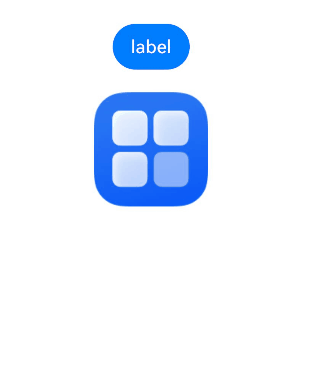
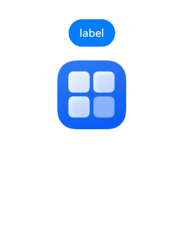

# 动态属性设置

动态设置组件的属性，支持开发者在属性设置时使用if/else语法，且根据需要使用多态样式设置属性。

>  **说明：**
>
>  从API Version 11开始支持。后续版本如有新增内容，则采用上角标单独标记该内容的起始版本。
>
> 在attributeModifier中设置的属性尽量不要与其他方法设置的属性相同，避免在页面刷新时attributeModifier不生效。
>
> attributeModifier不支持自定义组件。

## attributeModifier

attributeModifier(modifier:&nbsp;AttributeModifier\<T>)

动态设置组件的属性方法。

**原子化服务API：** 从API version 12开始，该接口支持在原子化服务中使用。

**系统能力：** SystemCapability.ArkUI.ArkUI.Full

**参数：**

| 参数名   | 类型                  | 必填 | 说明                                                         |
| -------- | --------------------- | ---- | ------------------------------------------------------------ |
| modifier | [AttributeModifier\<T>](#attributemodifiert) | 是   | 在当前组件上，动态设置属性方法，支持使用if/else语法。<br/>modifier: 属性修改器，开发者需要自定义class实现AttributeModifier接口。 |

## AttributeModifier\<T>

开发者需要自定义class实现AttributeModifier接口。

**原子化服务API：** 从API version 12开始，该接口支持在原子化服务中使用。

### applyNormalAttribute
applyNormalAttribute(instance: T) : void

组件普通状态时的样式。

**原子化服务API：** 从API version 12开始，该接口支持在原子化服务中使用。

### applyPressedAttribute
applyPressedAttribute(instance: T) : void

组件按压状态的样式。

**原子化服务API：** 从API version 12开始，该接口支持在原子化服务中使用。

### applyFocusedAttribute
applyFocusedAttribute(instance: T) : void

组件获焦状态的样式。

**原子化服务API：** 从API version 12开始，该接口支持在原子化服务中使用。

### applyDisabledAttribute
applyDisabledAttribute(instance: T) : void

组件禁用状态的样式。

**原子化服务API：** 从API version 12开始，该接口支持在原子化服务中使用。

### applySelectedAttribute
applySelectedAttribute(instance: T) : void

组件选中状态的样式

开发者可根据需要自定义实现这些方法，通过传入的参数识别组件类型，对instance设置属性，支持使用if/else语法进行动态设置。

**原子化服务API：** 从API version 12开始，该接口支持在原子化服务中使用。

**参数**：

| 参数             | 描述                                                         |
| -------------------- | ------------------------------------------------------------ |
| instance |组件的属性类，用来标识进行属性设置的组件的类型，比如Button组件的ButtonAttribute，Text组件的TextAttribute等。|

**instance参数支持范围:**

AlphabetIndexerAttribute、BadgeAttribute、BlankAttribute、ButtonAttribute、CalendarPickerAttribute、CanvasAttribute、CheckboxAttribute、CheckboxGroupAttribute、CircleAttribute、ColumnAttribute、ColumnSplitAttribute、ShapeAttribute、CommonAttribute、CounterAttribute、DataPanelAttribute、DatePickerAttribute、DividerAttribute、EllipseAttribute、FlexAttribute、FlowItemAttribute、FormLinkAttribute、GaugeAttribute、GridAttribute、GridColAttribute、ColumnAttribute、GridItemAttribute、GridRowAttribute、HyperlinkAttribute、ImageAttribute、ImageAnimatorAttribute、ImageSpanAttribute、LineAttribute、ListAttribute、ListItemAttribute、ListItemGroupAttribute、LoadingProgressAttribute、MarqueeAttribute、MenuAttribute、MenuItemAttribute、MenuItemGroupAttribute、NavDestinationAttribute、NavigationAttribute、NavigatorAttribute、NavRouterAttribute、PanelAttribute、PathAttribute、PatternLockAttribute、PolygonAttribute、PolylineAttribute、ProgressAttribute、QRCodeAttribute、RadioAttribute、RatingAttribute、RectAttribute、RefreshAttribute、RelativeContainerAttribute、RichEditorAttribute、RichTextAttribute、RowAttribute、RowSplitAttribute、ScrollAttribute、ScrollBarAttribute、SearchAttribute、SelectAttribute、ShapeAttribute、SideBarContainerAttribute、SliderAttribute、SpanAttribute、StackAttribute、StepperAttribute、StepperItemAttribute、SwiperAttribute、SymbolGlyphAttribute、TabContentAttribute、TabsAttribute、TextAttribute、TextAreaAttribute、TextClockAttribute、TextInputAttribute、TextPickerAttribute、TextTimerAttribute、TimePickerAttribute、ToggleAttribute、VideoAttribute、WaterFlowAttribute、XComponentAttribute、ParticleAttribute<!--Del-->、EffectComponentAttribute、FormComponentAttribute、PluginComponentAttribute、RemoteWindowAttribute、UIExtensionComponentAttribute<!--DelEnd-->。

**属性支持范围:**

不支持入参为[CustomBuilder](ts-types.md#custombuilder8)或Lamda表达式的属性，且不支持手势，事件仅支持onClick、onTouch、onAppear、onDisAppear、onMouse、onHover、onKeyEvent、onBlur、onFocus、onAreaChange、onSizeChange、onGestureJudgeBegin、onGestureRecognizerJudgeBegin、shouldBuiltInRecognizerParallelWith。不支持已废弃属性，未支持的属性在使用时会抛异常"Method not implemented"。
## 自定义Modifier
从API version 12开始，开发者可使用自定义Modifier构建组件并配置属性，通过此自定义的Modifier可调用所封装组件的属性和样式接口。 

**自定义Modifier支持范围:**  

CommonModifier、ColumnModifier、ColumnSplitModifier、RowModifier、RowSplitModifier、SideBarContainerModifier、BlankModifier、DividerModifier、GridColModifier、GridRowModifier、NavDestinationModifier、NavigatorModifier、StackModifier、NavigationModifier、NavRouterModifier、StepperItemModifier、TabsModifier、GridModifier、GridItemModifier、ListModifier、ListItemModifier、ListItemGroupModifier、ScrollModifier、SwiperModifier、WaterFlowModifier、ButtonModifier、CounterModifier、TextPickerModifier、TimePickerModifier、ToggleModifier、CalendarPickerModifier、CheckboxModifier、CheckboxGroupModifier、DatePickerModifier、RadioModifier、RatingModifier、SelectModifier、SliderModifier、PatternLockModifier、SpanModifier、RichEditorModifier、RefreshModifier、SearchModifier、TextAreaModifier、TextModifier、TextInputModifier、ImageSpanModifier、ImageAnimatorModifier、ImageModifier、VideoModifier、DataPanelModifier、GaugeModifier、LoadingProgressModifier、MarqueeModifier、ProgressModifier、QRCodeModifier、TextClockModifier、TextTimerModifier、LineModifier、PathModifier、PolygonModifier、PolylineModifier、RectModifier、ShapeModifier、AlphabetIndexerModifier、FormComponentModifier、HyperlinkModifier、MenuModifier、MenuItemModifier、PanelModifier、SymbolGlyphModifier、ParticleModifier。  
未暴露的组件Modifier可以使用CommonModifier。 

**注意事项**
1. 设置自定义Modifier给一个组件，该组件对应属性生效。  
2. 自定义Modifier属性值变化，组件对应属性也会变化。自定义Modifier类型为基类，构造的对象为子类对象，使用时要通过as进行类型断言为子类。  
3. 一个自定义Modifier设置给两个组件，Modifier属性变化的时候对两个组件同时生效。  
4. 一个Modifier设置了属性A和属性B，再设置属性C和属性D，4个属性同时在组件上生效。  
5. 自定义Modifier不支持@State标注的状态数据的变化感知，见示例2。  
6. 多次通过attributeModifier设置属性时，生效的属性为所有属性的并集，相同属性按照设置顺序生效。   

## 示例
### 示例1

如果配合状态管理V2使用，详情见：[Modifier与makeObserved](../../../quick-start/arkts-v1-v2-migration.md#modifier)。

```ts
// xxx.ets
class MyButtonModifier implements AttributeModifier<ButtonAttribute> {
  isDark: boolean = false
  applyNormalAttribute(instance: ButtonAttribute): void {
    if (this.isDark) {
      instance.backgroundColor(Color.Black)
    } else {
      instance.backgroundColor(Color.Red)
    }
  }
}

@Entry
@Component
struct attributeDemo {
  @State modifier: MyButtonModifier = new MyButtonModifier()

  build() {
    Row() {
      Column() {
        Button("Button")
          .attributeModifier(this.modifier)
          .onClick(() => {
            this.modifier.isDark = !this.modifier.isDark
          })
      }
      .width('100%')
    }
    .height('100%')
  }
}
```


```ts
// xxx.ets
class MyButtonModifier implements AttributeModifier<ButtonAttribute> {
  applyNormalAttribute(instance: ButtonAttribute): void {
    instance.backgroundColor(Color.Black)
  }

  applyPressedAttribute(instance: ButtonAttribute): void {
    instance.backgroundColor(Color.Red)
  }
}

@Entry
@Component
struct attributePressedDemo {
  @State modifier: MyButtonModifier = new MyButtonModifier()

  build() {
    Row() {
      Column() {
        Button("Button")
          .attributeModifier(this.modifier)
      }
      .width('100%')
    }
    .height('100%')
  }
}
```


### 示例2
自定义Modifier不支持@State标注的状态数据的变化感知。
```ts
import { CommonModifier } from "@kit.ArkUI"

class MyModifier extends CommonModifier {
  applyNormalAttribute(instance: CommonAttribute) : void{
    super.applyNormalAttribute?.(instance);
  }
}

@Component
struct MyImage1 {
  @Link modifier : CommonModifier

  build(){
    Image($r("app.media.testImage")).attributeModifier(this.modifier as MyModifier)
  }
}
@Entry
@Component
struct Index {
  index : number = 0;
  @State width1 : number = 100;
  @State height1 : number = 100;
  @State myModifier: CommonModifier = new MyModifier().width(this.width1).height(this.height1).margin(10)

  build() {
    Column() {
      Button($r("app.string.EntryAbility_label"))
        .margin(10)
        .onClick(() => {
          console.log("Modifier","onClick")
          this.index ++;
          if(this.index %2 === 1){
            this.width1 = 10;
            console.log("Modifier","setGroup1")
          }else{
            this.width1 = 10;
            console.log("Modifier","setGroup2")
          }
        })
      MyImage1({modifier:this.myModifier})
    }
    .width('100%')
  }
}
```
  
### 示例3
自定义Modifier设置了width和height，点击按钮时设置borderStyle和borderWidth，点击后4个属性同时生效。 
```ts
import { CommonModifier } from "@kit.ArkUI"

class MyModifier extends CommonModifier {
  applyNormalAttribute(instance: CommonAttribute) : void{
    super.applyNormalAttribute?.(instance);
  }

  public setGroup1() : void {
    this.borderStyle(BorderStyle.Dotted)
    this.borderWidth(8)
  }

  public setGroup2() : void {
    this.borderStyle(BorderStyle.Dashed)
    this.borderWidth(8)
  }
}

@Component
struct MyImage1 {
  @Link modifier : CommonModifier

  build(){
    Image($r("app.media.testImage")).attributeModifier(this.modifier as MyModifier)
  }
}

@Entry
@Component
struct Index {
  @State myModifier: CommonModifier = new MyModifier().width(100).height(100).margin(10)
  index : number = 0;

  build() {
    Column() {
      Button($r("app.string.EntryAbility_label"))
        .margin(10)
        .onClick(() => {
          console.log("Modifier","onClick")
          this.index ++;
          if(this.index %2 === 1){
            (this.myModifier as MyModifier).setGroup1()
            console.log("Modifier","setGroup1")
          }else{
            (this.myModifier as MyModifier).setGroup2()
            console.log("Modifier","setGroup2")
          }
        })
      MyImage1({modifier:this.myModifier})
    }
    .width('100%')
  }
}
```

