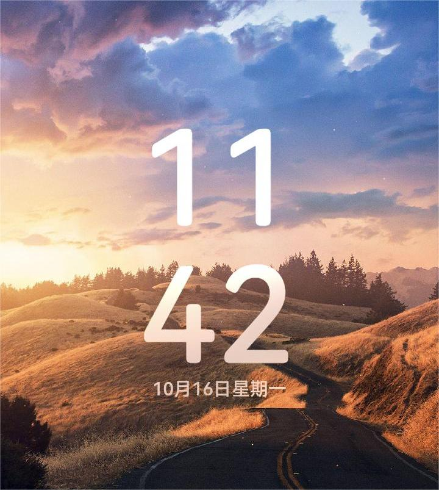
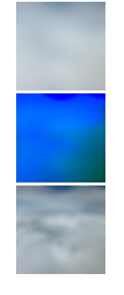

# 背景设置

设置组件的背景样式。

>  **说明：**
>
>  从API version 7开始支持。后续版本如有新增内容，则采用上角标单独标记该内容的起始版本。

## background<sup>10+</sup>

background(builder: CustomBuilder, options?: { align?: Alignment })

设置组件背景。

**原子化服务API：** 从API version 11开始，该接口支持在原子化服务中使用。

**系统能力：** SystemCapability.ArkUI.ArkUI.Full

**参数：** 

| 参数名  | 类型                                                 | 必填 | 说明                                                         |
| ------- | ---------------------------------------------------- | ---- | ------------------------------------------------------------ |
| builder | [CustomBuilder](ts-types.md#custombuilder8)          | 是   | 自定义背景。                                                 |
| options | {align?:[Alignment](ts-appendix-enums.md#alignment)} | 否   | 设置自定义背景与组件的对齐方式。<br/>同时设置了background，backgroundColor，backgroundImage时，叠加显示，background在最上层。 |

>  **说明：**
>
>  自定义背景渲染会有一定延迟，不能响应事件，不能进行动态更新。该属性不支持嵌套使用，不支持预览器预览。

## backgroundColor

backgroundColor(value: ResourceColor): T

设置组件背景色。

**卡片能力：** 从API version 9开始，该接口支持在ArkTS卡片中使用。

**原子化服务API：** 从API version 11开始，该接口支持在原子化服务中使用。

**系统能力：** SystemCapability.ArkUI.ArkUI.Full

**参数：** 

| 参数名 | 类型                                       | 必填 | 说明               |
| ------ | ------------------------------------------ | ---- | ------------------ |
| value  | [ResourceColor](ts-types.md#resourcecolor) | 是   | 设置组件的背景色。 |

>  **说明：**
>
>  当通过[backgroundBlurStyle](#backgroundblurstyle9)中的inactiveColor指定背景色时，不建议再通过backgroundColor设置背景色。

## backgroundImage

backgroundImage(src: ResourceStr&nbsp;|&nbsp;PixelMap, repeat?: ImageRepeat)

设置组件的背景图片。

**卡片能力：** 从API version 9开始，该接口支持在ArkTS卡片中使用。

**原子化服务API：** 从API version 11开始，该接口支持在原子化服务中使用。

**系统能力：** SystemCapability.ArkUI.ArkUI.Full

**参数：** 

| 参数名 | 类型                                            | 必填 | 说明                                                         |
| ------ | ----------------------------------------------- | ---- | ------------------------------------------------------------ |
| src    | [ResourceStr](ts-types.md#resourcestr) \| [PixelMap<sup>12+</sup>](../../apis-image-kit/js-apis-image.md#pixelmap7)          | 是   | 图片地址，支持网络图片资源地址、本地图片资源地址、Base64和PixelMap资源，不支持svg类型的图片。 |
| repeat | [ImageRepeat](ts-appendix-enums.md#imagerepeat) | 否   | 设置背景图片的重复样式，默认不重复。当设置的背景图片为透明底色图片，且同时设置了backgroundColor时，二者叠加显示，背景颜色在最底部。 |

## backgroundImageSize

backgroundImageSize(value: SizeOptions | ImageSize)

设置组件背景图片的宽度和高度。

**卡片能力：** 从API version 9开始，该接口支持在ArkTS卡片中使用。

**原子化服务API：** 从API version 11开始，该接口支持在原子化服务中使用。

**系统能力：** SystemCapability.ArkUI.ArkUI.Full

**参数：** 

| 参数名 | 类型                                                         | 必填 | 说明                                                         |
| ------ | ------------------------------------------------------------ | ---- | ------------------------------------------------------------ |
| value  | [SizeOptions](ts-universal-attributes-size.md#sizeoptions对象说明)&nbsp;\|&nbsp;[ImageSize](ts-appendix-enums.md#imagesize) | 是   | 设置背景图像的高度和宽度。当输入为{width:&nbsp;Length,&nbsp;height:&nbsp;Length}对象时，如果只设置一个属性，则第二个属性保持图片原始宽高比进行调整。默认保持原图的比例不变。<br/>width和height取值范围： [0, +∞)<br/>默认值：ImageSize.Auto<br/>**说明：** <br/>width和height均设置为小于或等于0的值时，按值为0显示。当width和height中只有一个值未设置或者设置为小于等于0的值时，另一个会根据图片原始宽高比进行调整。 |

## backgroundImagePosition

backgroundImagePosition(value: Position | Alignment)

设置背景图的位置。

**卡片能力：** 从API version 9开始，该接口支持在ArkTS卡片中使用。

**原子化服务API：** 从API version 11开始，该接口支持在原子化服务中使用。

**系统能力：** SystemCapability.ArkUI.ArkUI.Full

**参数：** 

| 参数名 | 类型                                                         | 必填 | 说明                                                         |
| ------ | ------------------------------------------------------------ | ---- | ------------------------------------------------------------ |
| value  | [Position](ts-types.md#position)&nbsp;\|&nbsp;[Alignment](ts-appendix-enums.md#alignment) | 是   | 设置背景图在组件中显示位置，即相对于组件左上角的坐标。<br/>默认值：<br/>{<br/>x:&nbsp;0,<br/>y:&nbsp;0<br/>} <br/> x和y值设置百分比时，偏移量是相对组件自身宽高计算的。 |

## BlurStyle<sup>9+</sup>

**卡片能力：** 从API version 9开始，该接口支持在ArkTS卡片中使用。

**系统能力：** SystemCapability.ArkUI.ArkUI.Full

| 名称                   | 描述        |
| -------------------- | --------- |
| Thin                 | 轻薄材质模糊。<br/>**原子化服务API：** 从API version 11开始，该接口支持在原子化服务中使用。   |
| Regular              | 普通厚度材质模糊。<br/>**原子化服务API：** 从API version 11开始，该接口支持在原子化服务中使用。 |
| Thick                | 厚材质模糊。<br/>**原子化服务API：** 从API version 11开始，该接口支持在原子化服务中使用。    |
| BACKGROUND_THIN<sup>10+</sup>       | 近距景深模糊。<br/>**原子化服务API：** 从API version 11开始，该接口支持在原子化服务中使用。   |
| BACKGROUND_REGULAR<sup>10+</sup>    | 中距景深模糊。<br/>**原子化服务API：** 从API version 11开始，该接口支持在原子化服务中使用。   |
| BACKGROUND_THICK<sup>10+</sup>      | 远距景深模糊。<br/>**原子化服务API：** 从API version 11开始，该接口支持在原子化服务中使用。   |
| BACKGROUND_ULTRA_THICK<sup>10+</sup> | 超远距景深模糊。<br/>**原子化服务API：** 从API version 11开始，该接口支持在原子化服务中使用。  |
| NONE<sup>10+</sup> | 关闭模糊。<br/>**原子化服务API：** 从API version 11开始，该接口支持在原子化服务中使用。  |
| COMPONENT_ULTRA_THIN<sup>11+</sup> | 组件超轻薄材质模糊。<br/>**原子化服务API：** 从API version 12开始，该接口支持在原子化服务中使用。 |
| COMPONENT_THIN<sup>11+</sup> | 组件轻薄材质模糊。<br/>**原子化服务API：** 从API version 12开始，该接口支持在原子化服务中使用。 |
| COMPONENT_REGULAR<sup>11+</sup> | 组件普通材质模糊。<br/>**原子化服务API：** 从API version 12开始，该接口支持在原子化服务中使用。 |
| COMPONENT_THICK<sup>11+</sup> | 组件厚材质模糊。<br/>**原子化服务API：** 从API version 12开始，该接口支持在原子化服务中使用。 |
| COMPONENT_ULTRA_THICK<sup>11+</sup> | 组件超厚材质模糊。<br/>**原子化服务API：** 从API version 12开始，该接口支持在原子化服务中使用。 |

## backgroundBlurStyle<sup>9+</sup>

backgroundBlurStyle(value: BlurStyle, options?: BackgroundBlurStyleOptions): T

为当前组件提供一种在背景和内容之间的模糊能力，通过枚举值的方式封装了不同的模糊半径、蒙版颜色、蒙版透明度、饱和度、亮度。

**卡片能力：** 从API version 9开始，该接口支持在ArkTS卡片中使用。

**原子化服务API：** 从API version 11开始，该接口支持在原子化服务中使用。

**系统能力：** SystemCapability.ArkUI.ArkUI.Full

**参数：** 

| 参数名                | 类型                                                         | 必填 | 说明                                                         |
| --------------------- | ------------------------------------------------------------ | ---- | ------------------------------------------------------------ |
| value                 | [BlurStyle](#blurstyle9)                 | 是   | 背景模糊样式。模糊样式中封装了模糊半径、蒙版颜色、蒙版透明度、饱和度、亮度五个参数。 |
| options<sup>10+</sup> | [BackgroundBlurStyleOptions](#backgroundblurstyleoptions10对象说明) | 否   | 背景模糊选项。 <br/>该参数在ArkTS卡片中，暂不支持使用。                                              |

>  **说明：**
>
>  当通过backgroundBlurStyle中的inactiveColor指定背景色时，不建议再通过[backgroundColor](#backgroundcolor)设置背景色。

## backdropBlur

backdropBlur(value: number, options?: BlurOptions): T

为组件添加背景模糊效果，支持自定义设置模糊半径和灰阶参数。

**卡片能力：** 从API version 9开始，该接口支持在ArkTS卡片中使用。

**原子化服务API：** 从API version 11开始，该接口支持在原子化服务中使用。

**系统能力：** SystemCapability.ArkUI.ArkUI.Full

**参数：** 

| 参数名                | 类型                                              | 必填 | 说明                                                         |
| --------------------- | ------------------------------------------------- | ---- | ------------------------------------------------------------ |
| value                 | number                                            | 是   | 为当前组件添加背景模糊效果，入参为模糊半径，模糊半径越大越模糊，为0时不模糊。 |
| options<sup>11+</sup> | [BlurOptions](ts-universal-attributes-foreground-blur-style.md#bluroptions11) | 否   | 灰阶梯参数。                                                 |

>  **说明：**
>
>  blur和backdropBlur是实时模糊接口，会每帧进行实时渲染，性能负载较高。当模糊内容和模糊半径都不需要变化时，建议使用[静态模糊接口](../../apis-arkgraphics2d/js-apis-effectKit.md#blur)。

## backgroundEffect<sup>11+</sup> 

backgroundEffect(options: BackgroundEffectOptions): T

设置组件背景属性，包括背景模糊半径、亮度、饱和度和颜色等参数。

**原子化服务API：** 从API version 11开始，该接口支持在原子化服务中使用。

**系统能力：** SystemCapability.ArkUI.ArkUI.Full

**参数：** 

| 参数名  | 类型                                                         | 必填 | 说明                                       |
| ------- | ------------------------------------------------------------ | ---- | ------------------------------------------ |
| options | [BackgroundEffectOptions](#backgroundeffectoptions11) | 是   | 设置组件背景属性包括：饱和度，亮度，颜色。 |

## BackgroundEffectOptions<sup>11+</sup>

背景效果参数。

**原子化服务API：** 从API version 12开始，该接口支持在原子化服务中使用。

**系统能力：** SystemCapability.ArkUI.ArkUI.Full

| 名称        |   类型         |   必填 |  说明                        |
| ----         |  ----         |   ---- | --------------------------  |
| radius       | number        |   是   |   模糊半径，取值范围：[0, +∞)，默认为0。  |
| saturation   | number        |   否   |   饱和度，取值范围：[0, +∞)，默认为1。推荐取值范围：[0, 50]。     |
| brightness   | number        |   否   |   亮度，取值范围：[0, +∞)，默认为1。推荐取值范围：[0, 2]。 |
| color        | [ResourceColor](ts-types.md#resourcecolor)         |   否   |   颜色，默认透明色。  |
| adaptiveColor | [AdaptiveColor](ts-universal-attributes-foreground-blur-style.md#adaptivecolor10枚举说明) |   否  | 背景模糊效果使用的取色模式,默认为DEFAULT。使用AVERAGE时color必须带有透明度，取色模式才生效。   |
| blurOptions  | [BlurOptions](ts-universal-attributes-foreground-blur-style.md#bluroptions11) |   否   |   灰阶模糊参数，默认为[0,0]。  |
| policy<sup>14+</sup>    | [BlurStyleActivePolicy](#blurstyleactivepolicy14) | 否    | 模糊激活策略。<br/> 默认值：BlurStyleActivePolicy.ALWAYS_ACTIVE |
| inactiveColor<sup>14+</sup>  | [ResourceColor](ts-types.md#resourcecolor)  | 否    | 窗口失焦后，窗口内控件模糊效果会被移除，则使用inactiveColor作为控件背板颜色。 |

## backgroundImageResizable<sup>12+</sup>

backgroundImageResizable(value: ResizableOptions)

设置背景图在拉伸时可调整大小的图像选项。

设置合法的ResizableOptions时，[backgroundImage](#backgroundimage)属性中的repeat参数设置不生效。

当设置top+bottom大于原图的高或者left+right大于原图的宽时，ResizableOptions属性设置不生效。

**原子化服务API：** 从API version 12开始，该接口支持在原子化服务中使用。

**系统能力：** SystemCapability.ArkUI.ArkUI.Full

**参数：**

| 参数名 | 类型                                    | 必填 | 说明                             |
| ------ | --------------------------------------- | ---- | -------------------------------- |
| value  | [ResizableOptions](ts-basic-components-image.md#resizableoptions11) | 是   | 图像拉伸时可调整大小的图像选项。 |

## BackgroundBlurStyleOptions<sup>10+</sup>对象说明

继承自[BlurStyleOptions](ts-universal-attributes-foreground-blur-style.md#blurstyleoptions)。

**原子化服务API：** 从API version 13开始，该接口支持在原子化服务中使用。

**系统能力：** SystemCapability.ArkUI.ArkUI.Full

| 名称 | 类型                                                         | 必填 | 说明                                                 |
| ------ | ------------------------------------------------------------ | ---- | ---------------------------------------------------- |
| policy<sup>14+</sup>  | [BlurStyleActivePolicy](#blurstyleactivepolicy14) | 否    | 模糊激活策略。<br/> 默认值：BlurStyleActivePolicy.ALWAYS_ACTIVE |
| inactiveColor<sup>14+</sup>  | [ResourceColor](ts-types.md#resourcecolor) | 否    | 窗口失焦后，窗口内控件模糊效果会被移除，则使用inactiveColor作为控件背板颜色。 |

## BlurStyleActivePolicy<sup>14+</sup>

**原子化服务API：** 从API version 14开始，该接口支持在原子化服务中使用。

**系统能力**：SystemCapability.ArkUI.ArkUI.Full

| 名称     | 值|说明                            |
| ------ | ----------------------------- |----------------------------- |
| FOLLOWS_WINDOW_ACTIVE_STATE| 0|模糊效果跟随窗口焦点状态变化，非焦点不模糊，焦点模糊。|
|  ALWAYS_ACTIVE  | 1|一直有模糊效果。|
| ALWAYS_INACTIVE |2 |一直无模糊效果。|

## backgroundBrightness<sup>12+</sup> 

backgroundBrightness(params: BackgroundBrightnessOptions): T

设置组件背景提亮效果。

**原子化服务API：** 从API version 12开始，该接口支持在原子化服务中使用。

**系统能力：** SystemCapability.ArkUI.ArkUI.Full

**参数：** 

| 参数名 | 类型                                                         | 必填 | 说明                                                 |
| ------ | ------------------------------------------------------------ | ---- | ---------------------------------------------------- |
| params | [BackgroundBrightnessOptions](#backgroundbrightnessoptions12对象说明) | 是   | 设置组件背景提亮效果，包括：亮度变化速率，提亮程度。 |

## BackgroundBrightnessOptions<sup>12+</sup>对象说明

**原子化服务API：** 从API version 12开始，该接口支持在原子化服务中使用。

**系统能力：** SystemCapability.ArkUI.ArkUI.Full

| 名称          | 类型   | 必填 | 说明                                                         |
| ------------- | ------ | ---- | ------------------------------------------------------------ |
| rate          | number | 是   | 亮度变化速率。亮度变化速率越大，提亮程度下降速度越快。若rate为0，则lightUpDegree将不生效，即不会产生任何提亮效果。<br/>默认值：0.0 <br/>取值范围：(0.0, +∞) |
| lightUpDegree | number | 是   | 提亮程度。提亮程度越大，亮度提升程度越大。<br/> 默认值：0.0 <br/>取值范围：[-1.0, 1.0] |

>  **说明：**
>
>  对于组件背景内容，每个像素自身的亮度（灰阶值）的计算公式为：
>  `Y = （0.299R + 0.587G + 0.114B）/ 255.0`（R、G、B分别表示像素红色、绿色和蓝色通道的值，Y表示灰阶值），通过上述公式将像素点的灰阶值归一化至0~1的范围。
>  每个像素的亮度提升计算公式为：`ΔY = -rate*Y + lightUpDegree`。例如，当rate=0.5，lightUpDegree=0.5时，对于灰阶值为0.2的像素点，亮度增加值为`-0.5*0.2 + 0.5 = 0.4`，对于灰阶值为1的像素点，亮度增加值为`-0.5*1 + 0.5 = 0`。

## 示例

### 示例1（设置背景基础样式）

该示例通过配置backgroundColor、backgroundImage、backgroundImageSize和backgroundImagePosition设置背景的基础样式。

```ts
// xxx.ets
@Entry
@Component
struct BackgroundExample {

  build() {
    Column({ space: 5 }) {
      Text('background color').fontSize(9).width('90%').fontColor(0xCCCCCC)
      Row().width('90%').height(50).backgroundColor(0xE5E5E5).border({ width: 1 })

      Text('background image repeat along X').fontSize(9).width('90%').fontColor(0xCCCCCC)
      Row()
        .backgroundImage('/comment/bg.jpg', ImageRepeat.X)
        .backgroundImageSize({ width: '250px', height: '140px' })
        .width('90%')
        .height(70)
        .border({ width: 1 })

      Text('background image repeat along Y').fontSize(9).width('90%').fontColor(0xCCCCCC)
      Row()
        .backgroundImage('/comment/bg.jpg', ImageRepeat.Y)
        .backgroundImageSize({ width: '500px', height: '120px' })
        .width('90%')
        .height(100)
        .border({ width: 1 })

      Text('background image size').fontSize(9).width('90%').fontColor(0xCCCCCC)
      Row()
        .width('90%').height(150)
        .backgroundImage('/comment/bg.jpg', ImageRepeat.NoRepeat)
        .backgroundImageSize({ width: 1000, height: 500 })
        .border({ width: 1 })

      Text('background fill the box(Cover)').fontSize(9).width('90%').fontColor(0xCCCCCC)
      // 不保证图片完整的情况下占满盒子
      Row()
        .width(200)
        .height(50)
        .backgroundImage('/comment/bg.jpg', ImageRepeat.NoRepeat)
        .backgroundImageSize(ImageSize.Cover)
        .border({ width: 1 })

      Text('background fill the box(Contain)').fontSize(9).width('90%').fontColor(0xCCCCCC)
      // 保证图片完整的情况下放到最大
      Row()
        .width(200)
        .height(50)
        .backgroundImage('/comment/bg.jpg', ImageRepeat.NoRepeat)
        .backgroundImageSize(ImageSize.Contain)
        .border({ width: 1 })

      Text('background image position').fontSize(9).width('90%').fontColor(0xCCCCCC)
      Row()
        .width(100)
        .height(50)
        .backgroundImage('/comment/bg.jpg', ImageRepeat.NoRepeat)
        .backgroundImageSize({ width: 1000, height: 560 })
        .backgroundImagePosition({ x: -500, y: -300 })
        .border({ width: 1 })
    }
    .width('100%').height('100%').padding({ top: 5 })
  }
}
```


### 示例2（设置背景模糊样式）

该示例通过backgroundBlurStyle设置背景模糊样式。

```ts
// xxx.ets
@Entry
@Component
struct BackgroundBlurStyleDemo {
  build() {
    Column() {
      Row() {
        Text("Thin Material")
      }
      .width('50%')
      .height('50%')
      .backgroundBlurStyle(BlurStyle.Thin, { colorMode: ThemeColorMode.LIGHT, adaptiveColor: AdaptiveColor.DEFAULT, scale: 1.0 })
      .position({ x: '15%', y: '30%' })
    }
    .height('100%')
    .width('100%')
    .backgroundImage($r('app.media.bg'))
    .backgroundImageSize(ImageSize.Cover)
  }
}
```


### 示例3（设置组件背景）

该示例通过background设置组件背景。

```ts
// xxx.ets
@Entry
@Component
struct BackgroundExample {
  @Builder renderBackground() {
    Column() {
      Progress({value : 50})
    }
  }

  build() {
    Column() {
      Text("content")
        .width(100)
        .height(40)
        .fontColor("#FFF")
        .position({x:50, y:80})
        .textAlign(TextAlign.Center)
        .backgroundColor(Color.Green)
    }
    .width(200).height(200)
    .background(this.renderBackground)
    .backgroundColor(Color.Gray)
  }
}
```


### 示例4（设置组件背景提亮效果）

该示例通过backgroundBrightness设置组件背景提亮效果。

```ts
// xxx.ets
@Entry
@Component
struct BackgroundBrightnessDemo {
  build() {
    Column() {
      Row() {
        Text("BackgroundBrightness")
      }
      .width(200)
      .height(100)
      .position({ x: 100, y: 100 })
      .backgroundBlurStyle(BlurStyle.Thin, { colorMode: ThemeColorMode.LIGHT, adaptiveColor: AdaptiveColor.DEFAULT})
      .backgroundBrightness({rate:0.5,lightUpDegree:0.5}) // 背景提亮效果
    }
    .width('100%')
    .height('100%')
    .backgroundImage($r('app.media.image'))
    .backgroundImageSize(ImageSize.Cover)
  }
}
```

效果图如下：

rate和lightUpDegree参数值为0.5,0.5：


修改rate和lightUpDegree参数值为0.5,-0.1：


去掉backgroundBrightness的设置，效果如下：


### 示例5（设置模糊属性）

该示例提供了模糊属性的实现方法。通过blur设置内容模糊，通过backdropBlur设置背景模糊。

```ts
// xxx.ets
@Entry
@Component
struct BlurEffectsExample {
  build() {
    Column({ space: 10 }) {
      // 对字体进行模糊
      Text('font blur').fontSize(15).fontColor(0xCCCCCC).width('90%')
      Flex({ alignItems: ItemAlign.Center }) {
        Text('original text').margin(10)
        Text('blur text')
          .blur(5).margin(10)
        Text('blur text')
          .blur(10).margin(10)
        Text('blur text')
          .blur(15).margin(10)
      }.width('90%').height(40)
      .backgroundColor(0xF9CF93)


      // 对背景进行模糊
      Text('backdropBlur').fontSize(15).fontColor(0xCCCCCC).width('90%')
      Text()
        .width('90%')
        .height(40)
        .fontSize(16)
        .backdropBlur(3)
        .backgroundImage($r('app.media.image'))
        .backgroundImageSize({ width: 1200, height: 160 })
    }.width('100%').margin({ top: 5 })
  }
}
```


### 示例6（设置文字异形模糊效果）

该示例通过blendMode和backgroundEffect实现文字异形模糊效果。<br/>
如果出现漏线问题，开发者应首先确保两个blendMode所在组件大小严格相同。如果确认相同，可能是组件边界落在浮点数坐标上导致，可尝试设置[pixelRound](ts-universal-attributes-pixelRound.md#pixelround)通用属性，使产生的白线、暗线两侧的组件边界对齐到整数像素坐标上。

```ts
// xxx.ets
@Entry
@Component
struct Index {
  @State shColor: Color = Color.White;
  @State sizeDate: number = 20;
  @State rVal: number = 255;
  @State gVal: number = 255;
  @State bVal: number = 255;
  @State aVal: number = 0.1;
  @State rad: number = 40;
  @State satVal: number = 0.8;
  @State briVal: number = 1.5;
  build() {
    Stack() {
      Image($r('app.media.image'))
      Column() {
        Column({ space: 0 }) {
          Column() {
            Text('11')
              .fontSize(144)
              .fontWeight(FontWeight.Bold)
              .fontColor('rgba(255,255,255,1)')
              .fontFamily('HarmonyOS-Sans-Digit')
              .maxLines(1)
              .lineHeight(120 * 1.25)
              .height(120 * 1.25)
              .letterSpacing(4 * 1.25)
            Text('42')
              .fontSize(144)
              .fontWeight(FontWeight.Bold)
              .fontColor('rgba(255,255,255,1)')
              .fontFamily('HarmonyOS-Sans-Digit')
              .maxLines(1)
              .lineHeight(120 * 1.25)
              .height(120 * 1.25)
              .letterSpacing(4 * 1.25)
              .shadow({
                color: 'rgba(0,0,0,0)',
                radius: 20,
                offsetX: 0,
                offsetY: 0
              })
            Row() {
              Text('10月16日')
                .fontSize(this.sizeDate)
                .height(22)
                .fontWeight('medium')
                .fontColor('rgba(255,255,255,1)')
              Text('星期一')
                .fontSize(this.sizeDate)
                .height(22)
                .fontWeight('medium')
                .fontColor('rgba(255,255,255,1)')
            }
          }
          .blendMode(BlendMode.DST_IN, BlendApplyType.OFFSCREEN)
          .pixelRound({
            start: PixelRoundCalcPolicy.FORCE_FLOOR ,
            top: PixelRoundCalcPolicy.FORCE_FLOOR ,
            end: PixelRoundCalcPolicy.FORCE_CEIL,
            bottom: PixelRoundCalcPolicy.FORCE_CEIL
          })
        }
        .blendMode(BlendMode.SRC_OVER, BlendApplyType.OFFSCREEN)
        .backgroundEffect({
          radius: this.rad,
          saturation: this.satVal,
          brightness: this.briVal,
          color: this.getVolumeDialogWindowColor()
        })
        .justifyContent(FlexAlign.Center)
        .pixelRound({
          start: PixelRoundCalcPolicy.FORCE_FLOOR ,
          top: PixelRoundCalcPolicy.FORCE_FLOOR ,
          end: PixelRoundCalcPolicy.FORCE_CEIL,
          bottom: PixelRoundCalcPolicy.FORCE_CEIL
        })
      }
    }
  }
  getVolumeDialogWindowColor(): ResourceColor | string {
    return `rgba(${this.rVal.toFixed(0)}, ${this.gVal.toFixed(0)}, ${this.bVal.toFixed(0)}, ${this.aVal.toFixed(0)})`;
  }
}
```



### 示例7（模糊效果对比）

该示例对比了backgroundEffect、backDropBlur和backgroundBlurStyle三种不同的模糊效果。

```ts
// xxx.ets
@Entry
@Component
struct BackGroundBlur {
  private imageSize: number = 150;

  build() {
    Column({ space: 5 }) {
      // backgroundBlurStyle通过枚举值的方式设置模糊参数
      Stack() {
        Image($r('app.media.test'))
          .width(this.imageSize)
          .height(this.imageSize)
        Column()
          .width(this.imageSize)
          .height(this.imageSize)
          .backgroundBlurStyle(BlurStyle.Thin)
      }

      // backgroundEffect 可以自定义设置 模糊半径，亮度，饱和度等参数
      Stack() {
        Image($r('app.media.test'))
          .width(this.imageSize)
          .height(this.imageSize)
        Column()
          .width(this.imageSize)
          .height(this.imageSize)
          .backgroundEffect({ radius: 20, brightness: 0.6, saturation: 15 })
      }

      // backdropBlur 只能设置模糊半径和灰阶参数
      Stack() {
        Image($r('app.media.test'))
          .width(this.imageSize)
          .height(this.imageSize)
        Column()
          .width(this.imageSize)
          .height(this.imageSize)
          .backdropBlur(20, { grayscale: [30, 50] })
      }
    }
    .width('100%')
    .padding({ top: 5 })
  }
}
```

