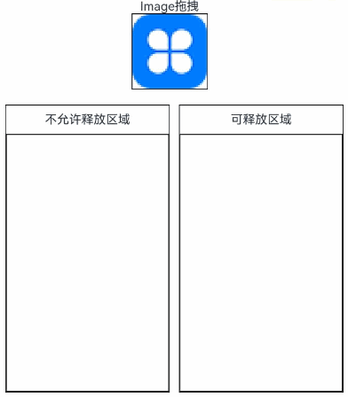

# 拖拽控制

设置组件是否可以响应拖拽事件。

> **说明：**
> 
> 从API Version 10开始支持。后续版本如有新增内容，则采用上角标单独标记该内容的起始版本。

ArkUI框架对以下组件实现了默认的拖拽能力，支持对数据的拖出或拖入响应。开发者也可以通过实现通用拖拽事件来自定义拖拽响应。

- 默认支持拖出能力的组件（可从组件上拖出数据）：[Search](ts-basic-components-search.md)、[TextInput](ts-basic-components-textinput.md)、[TextArea](ts-basic-components-textarea.md)、[RichEditor](ts-basic-components-richeditor.md)、[Text](ts-basic-components-text.md)、[Image](ts-basic-components-image.md)、[FormComponent](ts-basic-components-formcomponent-sys.md)、[Hyperlink](ts-container-hyperlink.md)，开发者可通过设置这些组件的[draggable](ts-universal-attributes-drag-drop.md#draggable)属性来控制对默认拖拽能力的使用。

- 默认支持拖入能力的组件（目标组件可响应拖入数据）：[Search](ts-basic-components-search.md)、[TextInput](ts-basic-components-textinput.md)、[TextArea](ts-basic-components-textarea.md)、[RichEditor](ts-basic-components-richeditor.md)，开发者可通过设置这些组件的[allowDrop](ts-universal-attributes-drag-drop.md#allowdrop)属性为null来禁用对默认拖入能力的支持。

<!--RP1--><!--RP1End-->其他组件需要开发者将draggable属性设置为true，并在onDragStart等接口中实现数据传输相关内容，才能正确处理拖拽。

## allowDrop

allowDrop(value: Array&lt;UniformDataType&gt;)

设置该组件上允许落入的数据类型。

**系统能力：** SystemCapability.ArkUI.ArkUI.Full

**参数：**

| 参数名 | 类型                                                         | 必填 | 说明                                            |
| ------ | ------------------------------------------------------------ | ---- | ----------------------------------------------- |
| value  | Array\<[UniformDataType](../../apis-arkdata/js-apis-data-uniformTypeDescriptor.md#uniformdatatype)> | 是   | 设置该组件上允许落入的数据类型。<br/>默认值：空 |

## draggable

draggable(value: boolean)

设置该组件是否允许进行拖拽。

**系统能力：** SystemCapability.ArkUI.ArkUI.Full

**参数：**

| 参数名 | 类型    | 必填 | 说明                                           |
| ------ | ------- | ---- | ---------------------------------------------- |
| value  | boolean | 是   | 设置该组件是否允许进行拖拽。<br/>默认值：false |

## dragPreview<sup>11+</sup>

dragPreview(value: CustomBuilder | DragItemInfo | string)

设置组件拖拽过程中的预览图。

**系统能力：** SystemCapability.ArkUI.ArkUI.Full

**参数：**

| 参数名 | 类型                                                         | 必填 | 说明                                                         |
| ------ | ------------------------------------------------------------ | ---- | ------------------------------------------------------------ |
| value  | [CustomBuilder](ts-types.md#custombuilder8)&nbsp;\|&nbsp;[DragItemInfo](ts-universal-events-drag-drop.md#dragiteminfo说明) \| string<sup>12+</sup> | 是   | 设置组件拖拽过程中的预览图，仅在onDragStart拖拽方式中有效。<br/>当组件支持拖拽并同时设置[bindContextMenu](ts-universal-attributes-menu.md#bindcontextmenu8)的预览图时，则长按浮起的预览图以[bindContextMenu](ts-universal-attributes-menu.md#bindcontextmenu8)设置的预览图为准。开发者在[onDragStart](ts-universal-events-drag-drop.md#onDragStart)中返回的背板图优先级低于[dragPreview](ts-universal-attributes-drag-drop.md#dragPreview11)设置的预览图，当设置了[dragPreview](ts-universal-attributes-drag-drop.md#dragPreview11)预览图时，拖拽过程中的背板图使用[dragPreview](ts-universal-attributes-drag-drop.md#dragPreview11)预览图。由于[CustomBuilder](ts-types.md#custombuilder8)需要离线渲染之后才能使用，因此存在一定的性能开销和时延，推荐优先使用 [DragItemInfo](ts-universal-events-drag-drop.md#dragiteminfo说明)中的[PixelMap](../../apis-image-kit/js-apis-image.md#pixelmap7)方式。<br/> 当传入类型为string的id时，则将id对应组件的截图作为预览图。如果id对应的组件无法查找到，或者id对应的组件Visibility属性设置成none/hidden，则对组件自身进行截图作为拖拽预览图。目前截图不含有亮度、阴影、模糊和旋转等视觉效果。<br/>默认值：空<br/> |

## dragPreviewOptions<sup>11+</sup>

dragPreviewOptions(value: DragPreviewOptions, options?: DragInteractionOptions)

设置拖拽过程中背板图处理模式及数量角标的显示。不支持onItemDragStart拖拽方式。

**系统能力：** SystemCapability.ArkUI.ArkUI.Full

**参数：**

| 参数名 | 类型                                                            | 必填 | 说明                                                         |
| ------ | -------------------------------------------------------------- | ---- | ------------------------------------------------------------ |
| value  | [DragPreviewOptions](#dragpreviewoptions11)<sup>11+</sup>      | 是   | 设置拖拽过程中背板图处理模式及数量角标的显示。<br/>默认值：空 |
| options<sup>12+</sup>| [DragInteractionOptions](#draginteractionoptions12)<sup>12+</sup>| 否   | 设置拖拽过程中背板图浮起的交互模式。<br/>默认值：空|

## DragPreviewOptions<sup>11+</sup>

| 名称 | 类型 | 必填 | 描述 |
| -------- | -------- | -------- | -------- |
| mode | [DragPreviewMode](#dragpreviewmode11枚举说明) | 否 | 表示拖拽过程中背板图处理模式。<br/>默认值：DragPreviewMode.AUTO<br/> |
| numberBadge<sup>12+</sup> | boolean &nbsp;\|&nbsp; number | 否 | 控制数量角标是否显示，或强制设置显示的数量。当设置数量角标时取值范围为[0，2<sup>31</sup>-1]，当设置为浮点数时，只显示整数部分。<br/>注：在多选拖拽场景，需通过该接口设置拖拽对象的数量。<br/>默认值：true<br/> |

## DragPreviewMode<sup>11+</sup>枚举说明

| 名称 | 枚举值 | 描述 |
| -------- | ------- | -------- |
| AUTO  | 1 | 系统根据拖拽场景自动改变跟手点位置，根据规则自动对拖拽背板图进行缩放变换等。 |
| DISABLE_SCALE  | 2 | 禁用系统对拖拽背板图的缩放行为。 |

## DragInteractionOptions<sup>12+</sup>

| 名称 | 类型 | 必填 | 描述 |
| -------- | -------- | -------- | -------- |
| isMultiSelectionEnabled | boolean | 否 | 表示拖拽过程中背板图是否支持多选聚拢效果。该参数只在[Grid](ts-container-grid.md)和[List](ts-container-list.md)组件中的[GridItem](ts-container-griditem.md)组件和[ListItem](ts-container-listitem.md)组件生效。<br/>当一个组件设置为多选拖拽时，该组件的子组件不可拖拽。聚拢组件预览图设置的优先级为[dragPreview](#dragpreview11)中的string，dragPreview中的PixelMap，组件自截图，不支持dragPreview中的Builder形式。<br/>不支持组件绑定[bindContextMenu](ts-universal-attributes-menu.md#bindcontextmenu12)中设置isShown为true的模式。<br/>默认值：false<br/> |
| defaultAnimationBeforeLifting | boolean | 否 | 表示是否执行长按浮起发起前组件自身的默认缩小动效。<br/>默认值：false <br/> |

## 示例
### 示例1
allowDrop与draggable属性用法示例

```ts
// xxx.ets
import UDC from '@ohos.data.unifiedDataChannel';
import UTD from '@ohos.data.uniformTypeDescriptor';

@Entry
@Component
struct ImageExample {
  @State uri: string = ""
  @State AblockArr: string[] = []
  @State BblockArr: string[] = []
  @State AVisible: Visibility = Visibility.Visible
  @State dragSuccess :Boolean = false

  build() {
    Column() {
      Text('Image拖拽')
        .fontSize('30dp')
      Flex({ direction: FlexDirection.Row, alignItems: ItemAlign.Center, justifyContent: FlexAlign.SpaceAround }) {
        Image($r('app.media.icon'))
          .width(100)
          .height(100)
          .border({ width: 1 })
          .visibility(this.AVisible)
          .draggable(true)
          .onDragEnd((event: DragEvent) => {
            let ret = event.getResult();
            if(ret == 0) {
              console.log("enter ret == 0")
              this.AVisible = Visibility.Hidden;
            } else {
              console.log("enter ret != 0")
              this.AVisible = Visibility.Visible;
            }
          })
      }
      .margin({ bottom: 20 })
      Row() {
        Column(){
          Text('不允许释放区域(显示不允许角标但可以释放)')
            .fontSize('15dp')
            .height('10%')
          List(){
            ForEach(this.AblockArr, (item:string, index) => {
              ListItem() {
                Image(item)
                  .width(100)
                  .height(100)
                  .border({width: 1})
              }
              .margin({ left: 30 , top : 30})
            }, (item:string) => item)
          }
          .height('90%')
          .width('100%')
          .allowDrop([UTD.UniformDataType.TEXT])
          .onDrop((event?: DragEvent, extraParams?: string) => {
            this.uri = JSON.parse(extraParams as string).extraInfo;
            this.AblockArr.splice(JSON.parse(extraParams as string).insertIndex, 0, this.uri);
            console.log("ondrop not udmf data");
          })
          .border({width: 1})
        }
        .height("50%")
        .width("45%")
        .border({ width: 1 })
        .margin({ left: 12 })
        Column(){
          Text('可释放区域')
            .fontSize('15dp')
            .height('10%')
          List(){
            ForEach(this.BblockArr, (item:string, index) => {
              ListItem() {
                Image(item)
                  .width(100)
                  .height(100)
                  .border({width: 1})
              }
              .margin({ left: 30 , top : 30})
            }, (item:string) => item)
          }
          .border({width: 1})
          .height('90%')
          .width('100%')
          .allowDrop([UTD.UniformDataType.IMAGE])
          .onDrop((event?: DragEvent, extraParams?: string) => {
            console.log("enter onDrop")
            let dragData:UnifiedData = (event as DragEvent).getData() as UnifiedData;
            if(dragData != undefined) {
              let arr:Array<UDC.UnifiedRecord> = dragData.getRecords();
              if(arr.length > 0) {
                let image = arr[0] as UDC.Image;
                this.uri = image.imageUri;
                this.BblockArr.splice(JSON.parse(extraParams as string).insertIndex, 0, this.uri);
              } else {
                console.log(`dragData arr is null`)
              }
            } else {
              console.log(`dragData  is undefined`)
            }
            console.log("ondrop udmf data");
            this.dragSuccess = true
          })
        }
        .height("50%")
        .width("45%")
        .border({ width: 1 })
        .margin({ left: 12 })
      }
    }.width('100%')
  }
}
```



### 示例2
dragPreview属性用法示例
```ts
// xxx.ets
@Entry
@Component
struct DragPreviewDemo{
  @Builder dragPreviewBuilder() {
    Column() {
      Text("dragPreview")
        .width(150)
        .height(50)
        .fontSize(20)
        .borderRadius(10)
        .textAlign(TextAlign.Center)
        .fontColor(Color.Black)
        .backgroundColor(Color.Pink)
    }
  }

  @Builder MenuBuilder() {
    Flex({ direction: FlexDirection.Column, justifyContent: FlexAlign.Center, alignItems: ItemAlign.Center }) {
      Text("menu item 1")
        .fontSize(15)
        .width(100)
        .height(40)
        .textAlign(TextAlign.Center)
        .fontColor(Color.Black)
        .backgroundColor(Color.Pink)
      Divider()
        .height(5)
      Text("menu item 2")
        .fontSize(15)
        .width(100)
        .height(40)
        .textAlign(TextAlign.Center)
        .fontColor(Color.Black)
        .backgroundColor(Color.Pink)
    }
    .width(100)
  }

  build() {
    Row() {
      Column() {
        Image('/resource/image.jpeg')
          .width("30%")
          .draggable(true)
          .bindContextMenu(this.MenuBuilder, ResponseType.LongPress)
          .onDragStart(() => {
            console.log("Image onDragStart")
          })
          .dragPreview(this.dragPreviewBuilder)
      }
      .width("100%")
    }
    .height("100%")
  }
}
```


### 示例3
dragPreviewOptions属性用法示例
```ts
// xxx.ets
@Entry
@Component
struct dragPreviewOptionsDemo{
  build() {
    Row() {
      Column() {
        Image('/resource/image.jpeg')
          .margin({ top: 10 })
          .width("100%")
          .draggable(true)
          .dragPreviewOptions({ mode: DragPreviewMode.AUTO })
      }
      .width("100%")
      .height("100%")
    }
  }
}
```


### 示例4
DragInteractionOptions属性中isMultiSelectionEnabled参数使用方法用例。
```ts
@Entry
@Component
struct Example {
  @State numbers: number[] = [0, 1, 2, 3, 4 , 5, 6, 7, 8]
  build() {
    Column({ space: 5}) {
      Grid() {
        ForEach(this.numbers, (item: number) => {
          GridItem() {
            Column()
              .backgroundColor(Color.Red)
              .width(90)
              .height(90)
          }
          .selectable(true)
          .selected(true)
          .dragPreviewOptions({}, {isMultiSelectionEnabled:true})
          .onDragStart(()=>{

          })
    }, (item: string) => item)
      }
      .columnsTemplate('1fr 1fr 1fr')
      .rowsTemplate('1fr 1fr 1fr')
      .height(300)
    }
    .width('100%')
  }
}
```

### 示例5
DragInteractionOptions属性中defaultAnimationBeforeLifting参数使用方法用例。
```ts
@Entry
@Component
struct Example {
  @State numbers: number[] = [0, 1, 2, 3, 4 , 5, 6, 7, 8]
  build() {
    Column({ space: 5}) {
      Grid() {
        ForEach(this.numbers, (item: number) => {
          GridItem() {
            Column()
              .backgroundColor(Color.Red)
              .width(90)
              .height(90)
          }
          .selectable(true)
          .selected(true)
          .dragPreviewOptions({}, {isMultiSelectionEnabled:true, defaultAnimationBeforeLifting:true})
          .onDragStart(()=>{

          })
    }, (item: string) => item)
      }
      .columnsTemplate('1fr 1fr 1fr')
      .rowsTemplate('1fr 1fr 1fr')
      .height(300)
    }
    .width('100%')
  }
}
```