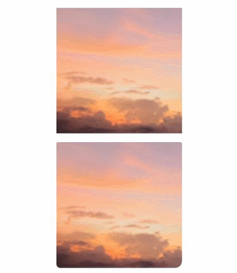
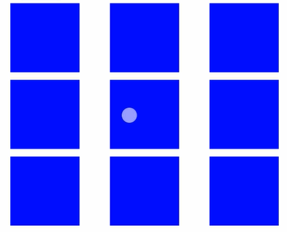
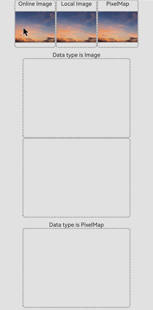
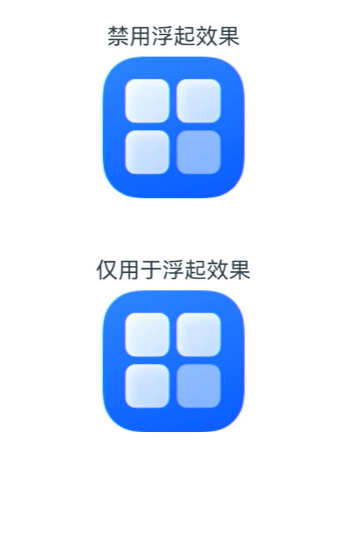
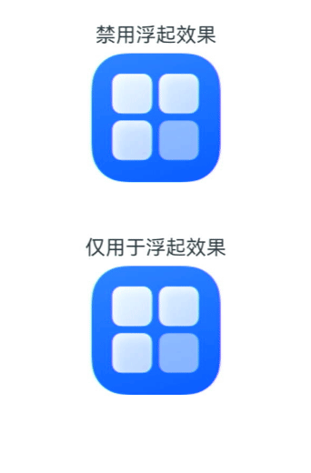

# 拖拽控制

设置组件是否可以响应拖拽事件。

> **说明：**
> 
> 从API Version 10开始支持。后续版本如有新增内容，则采用上角标单独标记该内容的起始版本。

ArkUI框架对以下组件实现了默认的拖拽能力，支持对数据的拖出或拖入响应。开发者也可以通过实现通用拖拽事件来自定义拖拽响应。

- 默认支持拖出能力的组件（可从组件上拖出数据）：[Search](ts-basic-components-search.md)、[TextInput](ts-basic-components-textinput.md)、[TextArea](ts-basic-components-textarea.md)、[RichEditor](ts-basic-components-richeditor.md)、[Text](ts-basic-components-text.md)、[Image](ts-basic-components-image.md)、<!--Del-->[FormComponent](ts-basic-components-formcomponent-sys.md)、<!--DelEnd-->[Hyperlink](ts-container-hyperlink.md)，开发者可通过设置这些组件的[draggable](ts-universal-attributes-drag-drop.md#draggable)属性来控制对默认拖拽能力的使用。

- 默认支持拖入能力的组件（目标组件可响应拖入数据）：[Search](ts-basic-components-search.md)、[TextInput](ts-basic-components-textinput.md)、[TextArea](ts-basic-components-textarea.md)、[RichEditor](ts-basic-components-richeditor.md)，开发者可通过设置这些组件的[allowDrop](ts-universal-attributes-drag-drop.md#allowdrop)属性为null来禁用对默认拖入能力的支持。

<!--RP1--><!--RP1End-->其他组件需要开发者将draggable属性设置为true，并在onDragStart等接口中实现数据传输相关内容，才能正确处理拖拽。

> **说明：**
>
> Text组件需配合[copyOption](ts-basic-components-text.md#copyoption9)一起使用，设置copyOptions为CopyOptions.InApp或者CopyOptions.LocalDevice。

## allowDrop

allowDrop(value: Array&lt;UniformDataType&gt; | null)

设置该组件上允许落入的数据类型。

**原子化服务API：** 从API version 11开始，该接口支持在原子化服务中使用。

**系统能力：** SystemCapability.ArkUI.ArkUI.Full

**参数：**

| 参数名 | 类型                                                         | 必填 | 说明                                            |
| ------ | ------------------------------------------------------------ | ---- | ----------------------------------------------- |
| value  | Array\<[UniformDataType](../../apis-arkdata/js-apis-data-uniformTypeDescriptor.md#uniformdatatype)> \| null<sup>12+</sup> | 是   | 设置该组件上允许落入的数据类型。从API version 12开始，允许设置成null使该组件不接受所有的数据类型。<br/>默认值：空 |

## draggable

draggable(value: boolean)

设置该组件是否允许进行拖拽。

**原子化服务API：** 从API version 11开始，该接口支持在原子化服务中使用。

**系统能力：** SystemCapability.ArkUI.ArkUI.Full

**参数：**

| 参数名 | 类型    | 必填 | 说明                                           |
| ------ | ------- | ---- | ---------------------------------------------- |
| value  | boolean | 是   | 设置该组件是否允许进行拖拽。true表示允许拖拽，false表示不允许拖拽。<br/>默认值：false |

## dragPreview<sup>11+</sup>

dragPreview(value: CustomBuilder | DragItemInfo | string)

设置组件拖拽过程中的预览图。

**原子化服务API：** 从API version 12开始，该接口支持在原子化服务中使用。

**系统能力：** SystemCapability.ArkUI.ArkUI.Full

**参数：**

| 参数名 | 类型                                                         | 必填 | 说明                                                         |
| ------ | ------------------------------------------------------------ | ---- | ------------------------------------------------------------ |
| value  | [CustomBuilder](ts-types.md#custombuilder8)&nbsp;\|&nbsp;[DragItemInfo](ts-universal-events-drag-drop.md#dragiteminfo说明) \| string<sup>12+</sup> | 是   | 设置组件拖拽过程中的预览图，仅在onDragStart拖拽方式中有效。<br/>当组件支持拖拽并同时设置[bindContextMenu](ts-universal-attributes-menu.md#bindcontextmenu8)的预览图时，则长按浮起的预览图以[bindContextMenu](ts-universal-attributes-menu.md#bindcontextmenu8)设置的预览图为准。开发者在[onDragStart](ts-universal-events-drag-drop.md#onDragStart)中返回的背板图优先级低于[dragPreview](ts-universal-attributes-drag-drop.md#dragPreview11)设置的预览图，当设置了[dragPreview](ts-universal-attributes-drag-drop.md#dragPreview11)预览图时，拖拽过程中的背板图使用[dragPreview](ts-universal-attributes-drag-drop.md#dragPreview11)预览图。由于[CustomBuilder](ts-types.md#custombuilder8)需要离线渲染之后才能使用，因此存在一定的性能开销和时延，推荐优先使用 [DragItemInfo](ts-universal-events-drag-drop.md#dragiteminfo说明)中的[PixelMap](../../apis-image-kit/js-apis-image.md#pixelmap7)方式。<br/> 当传入类型为string的id时，则将id对应组件的截图作为预览图。如果id对应的组件无法查找到，或者id对应的组件Visibility属性设置成none/hidden，则对组件自身进行截图作为拖拽预览图。目前截图不含有亮度、阴影、模糊和旋转等视觉效果。<br/>默认值：空<br/> |

## dragPreview<sup>15+</sup>

dragPreview(preview: CustomBuilder | DragItemInfo | string, config?: PreviewConfiguration):T

自定义组件拖拽过程中的预览图，仅用于设置浮起效果或者禁用浮起效果。

**原子化服务API：** 从API version 15开始，该接口支持在原子化服务中使用。

**系统能力：** SystemCapability.ArkUI.ArkUI.Full

**参数：**

| 参数名 | 类型                                                         | 必填 | 说明                                                         |
| ------ | ------------------------------------------------------------ | ---- | ------------------------------------------------------------ |
| preview  | [CustomBuilder](ts-types.md#custombuilder8)&nbsp;\|&nbsp;[DragItemInfo](ts-universal-events-drag-drop.md#dragiteminfo说明) \| string | 是   | 设置组件拖拽过程中的预览图，仅在onDragStart拖拽方式中有效。<br/>当组件支持拖拽并同时设置[bindContextMenu](ts-universal-attributes-menu.md#bindcontextmenu8)的预览图时，则长按浮起的预览图以[bindContextMenu](ts-universal-attributes-menu.md#bindcontextmenu8)设置的预览图为准。开发者在[onDragStart](ts-universal-events-drag-drop.md#ondragstart)中返回的背板图优先级低于[dragPreview](ts-universal-attributes-drag-drop.md#dragpreview11)设置的预览图，当设置了[dragPreview](ts-universal-attributes-drag-drop.md#dragpreview11)预览图时，拖拽过程中的背板图使用[dragPreview](ts-universal-attributes-drag-drop.md#dragpreview11)预览图。由于[CustomBuilder](ts-types.md#custombuilder8)需要离线渲染之后才能使用，因此存在一定的性能开销和时延，推荐优先使用 [DragItemInfo](ts-universal-events-drag-drop.md#dragiteminfo说明)中的[PixelMap](../../apis-image-kit/js-apis-image.md#pixelmap7)方式。<br/> 当传入类型为string的id时，则将id对应组件的截图作为预览图。如果id对应的组件无法查找到，或者id对应的组件Visibility属性设置成none/hidden，则对组件自身进行截图作为拖拽预览图。目前截图不含有亮度、阴影、模糊和旋转等视觉效果。<br/>默认值：空 |
| config | [PreviewConfiguration](ts-universal-events-drag-drop.md#previewconfiguration15) | 是 | 对自定义拖拽过程中的预览图进行配置。<br/>只对[dragPreview](#dragpreview11)中的预览生效。<br/>默认值：空 |

## dragPreviewOptions<sup>11+</sup>

dragPreviewOptions(value: DragPreviewOptions, options?: DragInteractionOptions)

设置拖拽过程中背板图处理模式及数量角标的显示。不支持onItemDragStart拖拽方式。

**原子化服务API：** 从API version 12开始，该接口支持在原子化服务中使用。

**系统能力：** SystemCapability.ArkUI.ArkUI.Full

**参数：**

| 参数名 | 类型                                                            | 必填 | 说明                                                         |
| ------ | -------------------------------------------------------------- | ---- | ------------------------------------------------------------ |
| value  | [DragPreviewOptions](#dragpreviewoptions11)<sup>11+</sup>      | 是   | 设置拖拽过程中背板图处理模式及数量角标的显示。<br/>默认值：空 |
| options<sup>12+</sup>| [DragInteractionOptions](#draginteractionoptions12)<sup>12+</sup>| 否   | 设置拖拽过程中背板图浮起的交互模式。<br/>默认值：空|

## DragPreviewOptions<sup>11+</sup>

**原子化服务API：** 从API version 12开始，该接口支持在原子化服务中使用。

| 名称 | 类型 | 必填 | 描述 |
| -------- | -------- | -------- | -------- |
| mode | [DragPreviewMode](#dragpreviewmode11枚举说明) &nbsp;\|&nbsp; Array<[DragPreviewMode](#dragpreviewmode11枚举说明)><sup>12+</sup> | 否 | 表示拖拽过程中背板图处理模式。<br/>默认值：DragPreviewMode.AUTO<br/>当组件同时设置DragPreviewMode.AUTO和其它枚举值时，以DragPreviewMode.AUTO为准，其它枚举值设置无效。|
| numberBadge<sup>12+</sup> | boolean &nbsp;\|&nbsp; number | 否 | 控制数量角标是否显示，或强制设置显示的数量。当设置数量角标时取值范围为[0，2<sup>31</sup>-1]，超过取值范围时会按默认状态处理。当设置为浮点数时，只显示整数部分。<br/>**说明：** <br>在多选拖拽场景，需通过该接口设置拖拽对象的数量。<br/>默认值：true |
| modifier<sup>12+</sup> | [ImageModifier](ts-universal-attributes-attribute-modifier.md)| 否 | 用于配置拖拽背板图的样式Modifier对象，可使用图片组件所支持的属性和样式来配置背板图样式(参考示例6)，当前支持透明度，阴影，背景模糊度，圆角。文本拖拽只支持默认效果，不支持通过modifier进行自定义。<br/>1.透明度<br/>通过[opacity](ts-universal-attributes-opacity.md#opacity)设置透明度，不透明度的取值范围为0-1。设置0或不设置时采用默认值0.95，设置1或异常值时不透明。<br/>2.阴影<br/>通过[shadow](ts-universal-attributes-image-effect.md#shadow)设置阴影。<br/>3.背景模糊度<br/>通过[backgroundEffect](ts-universal-attributes-background.md#backgroundeffect11)或[backgroundBlurStyle](ts-universal-attributes-background.md#backgroundblurstyle)设置背景模糊度，如果两者同时设置，以backgroundEffect为准。<br/>4.圆角<br/>通过[border](ts-universal-attributes-border.md#border)或[borderRadius](ts-universal-attributes-border.md#borderRadius)设置圆角，当同时在mode和modifier中设置圆角，mode设置的圆角显示优先级低于modifier设置。<br/>默认值：空，无法修改属性|
| sizeChangeEffect<sup>18+</sup> | [DraggingSizeChangeEffect](#draggingsizechangeeffect18)<sup>18+</sup> | 否 | 用于选择长按浮起图与拖拽跟手图过渡效果。<br/>默认值：DraggingSizeChangeEffect.DEFAULT|

## DragPreviewMode<sup>11+</sup>枚举说明

**原子化服务API：** 从API version 12开始，该接口支持在原子化服务中使用。

| 名称 | 枚举值 | 描述 |
| -------- | ------- | -------- |
| AUTO  | 1 | 系统根据拖拽场景自动改变跟手点位置，根据规则自动对拖拽背板图进行缩放变换等。 |
| DISABLE_SCALE  | 2 | 禁用系统对拖拽背板图的缩放行为。 |
| ENABLE_DEFAULT_SHADOW<sup>12+</sup> | 3 | 启用非文本类组件默认阴影效果。 |
| ENABLE_DEFAULT_RADIUS<sup>12+</sup> | 4 | 启用非文本类组件统一圆角效果，默认值12vp。当应用自身设置的圆角值大于默认值或modifier设置的圆角时，则显示应用自定义圆角效果。 |
| ENABLE_DRAG_ITEM_GRAY_EFFECT<sup>18+</sup> | 5 | 启用支持原拖拽对象灰显（透明度）效果，对文本内容拖拽不生效。用户拖起时原对象显示灰显效果，释放时原对象恢复原有效果。开启默认灰显效果后，不建议在拖拽开始后自行修改透明度，如果开发者在拖拽发起后自行修改应用透明度，则灰显效果将被覆盖，且在结束拖拽时无法正确恢复原始透明度效果。 |
| ENABLE_MULTI_TILE_EFFECT<sup>18+</sup> | 6 | 启用支持多选对象鼠标拖拽不聚拢效果，当满足多选的情况下isMultiSelectionEnabled为true且生效时该参数才生效。不聚拢效果优先级高于[dragPreview](#dragpreview11)。不支持二次拖拽、圆角和缩放设置。 |
| ENABLE_TOUCH_POINT_CALCULATION_BASED_ON_FINAL_PREVIEW<sup>18+</sup> | 7 | 启用支持以拖拽预览图初始尺寸计算跟手点位置，设置DragPreviewMode.ENABLE_MULTI_TILE_EFFECT时不生效。 |

## DraggingSizeChangeEffect<sup>18+</sup>

当一个节点上同时设置长按浮起预览（参考[bindContextMenu](ts-universal-attributes-menu.md#bindcontextmenu12)）与拖拽时，使用该字段设置长按浮起预览图与拖拽跟手图过渡动效方式。

**原子化服务API：** 从API version 18开始，该接口支持在原子化服务中使用。

**系统能力：** SystemCapability.ArkUI.ArkUI.Full

| 名称 | 值 | 说明 |
| -------- | ------- | -------- |
| DEFAULT | 0 | 发起拖拽时直接从菜单预览图切换为最终尺寸的拖拽跟手图。 |
| SIZE_TRANSITION | 1 | 发起拖拽时，由菜单预览图直接切换为拖拽跟手图，但尺寸逐步从菜单预览图尺寸过渡到最终跟手图尺寸。这在长按浮起预览图与拖拽跟手图相同时使用。 |
| SIZE_CONTENT_TRANSITION | 2 | 发起拖拽时，由菜单预览图逐步过渡切换为最终拖拽跟手图。这常用于菜单预览图与拖拽跟手图差异较大时使用，过渡效果包含内容透明度及尺寸变化。 |


## DragInteractionOptions<sup>12+</sup>

**原子化服务API：** 从API version 12开始，该接口支持在原子化服务中使用。

| 名称 | 类型 | 必填 | 描述 |
| -------- | -------- | -------- | -------- |
| isMultiSelectionEnabled | boolean | 否 | 表示拖拽过程中背板图是否支持多选聚拢效果。true表示支持多选聚拢效果，false表示不支持多选聚拢效果。该参数只在[Grid](ts-container-grid.md)和[List](ts-container-list.md)组件中的[GridItem](ts-container-griditem.md)组件和[ListItem](ts-container-listitem.md)组件生效。<br/>当一个item组件设置为多选拖拽时，该组件的子组件不可拖拽。聚拢组件预览图设置的优先级为[dragPreview](#dragpreview11)中的string，dragPreview中的PixelMap，组件自截图，不支持dragPreview中的Builder形式。<br/>不支持组件绑定[bindContextMenu](ts-universal-attributes-menu.md#bindcontextmenu12)中参数存在isShown的模式。<br/>默认值：false<br/> |
| defaultAnimationBeforeLifting | boolean | 否 | 表示是否启用长按浮起阶段组件自身的默认点按效果（缩小）。true表示启用默认点按效果，false表示不启用默认点按效果。<br/>默认值：false <br/> |
| isLiftingDisabled<sup>15+</sup> | boolean | 否 | 表示长按拖拽时，是否禁用浮起效果。true表示禁用浮起效果，false表示不禁用浮起效果。<br/>如果设置为true，当组件支持拖拽并同时设置[bindContextMenu](ts-universal-attributes-menu.md#bindcontextmenu8)时，仅弹出配置的自定义菜单预览。 <br/>默认值：false |
| enableEdgeAutoScroll<sup>18+</sup> | boolean | 否 | 设置在拖拽至可滚动组件边缘时是否触发自动滚屏。true表示触发自动滚屏，false表示不触发自动滚屏。<br />默认值：true |
| enableHapticFeedback<sup>18+</sup> | boolean | 否 | 表示拖拽时是否启用震动。true表示启用震动，false表示不启用震动。仅在存在蒙层的预览（通过[bindContextMenu](ts-universal-attributes-menu.md#bindcontextmenu12)）场景生效。<br/>**注意：** 仅当应用具备 ohos.permission.VIBRATE 权限，且用户启用了触感反馈时才会生效。<br/>默认值：false |

## 示例
### 示例1（允许拖拽和落入）

该示例通过配置allowDrop和draggable分别设置组件是否可落入和拖拽。

```ts
// xxx.ets
import { unifiedDataChannel, uniformTypeDescriptor } from '@kit.ArkData';

@Entry
@Component
struct ImageExample {
  @State uri: string = ""
  @State AblockArr: string[] = []
  @State BblockArr: string[] = []
  @State AVisible: Visibility = Visibility.Visible
  @State dragSuccess :Boolean = false

  build() {
    Column() {
      Text('Image拖拽')
        .fontSize('30dp')
      Flex({ direction: FlexDirection.Row, alignItems: ItemAlign.Center, justifyContent: FlexAlign.SpaceAround }) {
        Image($r('app.media.icon'))
          .width(100)
          .height(100)
          .border({ width: 1 })
          .visibility(this.AVisible)
          .draggable(true)
          .onDragEnd((event: DragEvent) => {
            let ret = event.getResult();
            if(ret == 0) {
              console.log("enter ret == 0")
              this.AVisible = Visibility.Hidden;
            } else {
              console.log("enter ret != 0")
              this.AVisible = Visibility.Visible;
            }
          })
      }
      .margin({ bottom: 20 })
      Row() {
        Column(){
          Text('不允许释放区域')
            .fontSize('15dp')
            .height('10%')
          List(){
            ForEach(this.AblockArr, (item:string, index) => {
              ListItem() {
                Image(item)
                  .width(100)
                  .height(100)
                  .border({width: 1})
              }
              .margin({ left: 30 , top : 30})
            }, (item:string) => item)
          }
          .height('90%')
          .width('100%')
          .allowDrop([uniformTypeDescriptor.UniformDataType.TEXT])
          .onDrop((event?: DragEvent, extraParams?: string) => {
            this.uri = JSON.parse(extraParams as string).extraInfo;
            this.AblockArr.splice(JSON.parse(extraParams as string).insertIndex, 0, this.uri);
            console.log("ondrop not udmf data");
          })
          .border({width: 1})
        }
        .height("50%")
        .width("45%")
        .border({ width: 1 })
        .margin({ left: 12 })
        Column(){
          Text('可释放区域')
            .fontSize('15dp')
            .height('10%')
          List(){
            ForEach(this.BblockArr, (item:string, index) => {
              ListItem() {
                Image(item)
                  .width(100)
                  .height(100)
                  .border({width: 1})
              }
              .margin({ left: 30 , top : 30})
            }, (item:string) => item)
          }
          .border({width: 1})
          .height('90%')
          .width('100%')
          .allowDrop([uniformTypeDescriptor.UniformDataType.IMAGE])
          .onDrop((event?: DragEvent, extraParams?: string) => {
            console.log("enter onDrop")
            let dragData:UnifiedData = (event as DragEvent).getData() as UnifiedData;
            if(dragData != undefined) {
              let arr:Array<unifiedDataChannel.UnifiedRecord> = dragData.getRecords();
              if(arr.length > 0) {
                let image = arr[0] as unifiedDataChannel.Image;
                this.uri = image.imageUri;
                this.BblockArr.splice(JSON.parse(extraParams as string).insertIndex, 0, this.uri);
              } else {
                console.log(`dragData arr is null`)
              }
            } else {
              console.log(`dragData  is undefined`)
            }
            console.log("ondrop udmf data");
            this.dragSuccess = true
          })
        }
        .height("50%")
        .width("45%")
        .border({ width: 1 })
        .margin({ left: 12 })
      }
    }.width('100%')
  }
}
```


### 示例2（设置预览图）

该示例通过配置dragPreview设置拖拽过程的预览图。

```ts
// xxx.ets
@Entry
@Component
struct DragPreviewDemo{
  @Builder dragPreviewBuilder() {
    Column() {
      Text("dragPreview")
        .width(150)
        .height(50)
        .fontSize(20)
        .borderRadius(10)
        .textAlign(TextAlign.Center)
        .fontColor(Color.Black)
        .backgroundColor(Color.Pink)
    }
  }

  @Builder MenuBuilder() {
    Flex({ direction: FlexDirection.Column, justifyContent: FlexAlign.Center, alignItems: ItemAlign.Center }) {
      Text("menu item 1")
        .fontSize(15)
        .width(100)
        .height(40)
        .textAlign(TextAlign.Center)
        .fontColor(Color.Black)
        .backgroundColor(Color.Pink)
      Divider()
        .height(5)
      Text("menu item 2")
        .fontSize(15)
        .width(100)
        .height(40)
        .textAlign(TextAlign.Center)
        .fontColor(Color.Black)
        .backgroundColor(Color.Pink)
    }
    .width(100)
  }

  build() {
    Row() {
      Column() {
        Image('/resource/image.jpeg')
          .width("30%")
          .draggable(true)
          .bindContextMenu(this.MenuBuilder, ResponseType.LongPress)
          .onDragStart(() => {
            console.log("Image onDragStart")
          })
          .dragPreview(this.dragPreviewBuilder)
      }
      .width("100%")
    }
    .height("100%")
  }
}
```


### 示例3（设置背板图样式）

该示例通过配置dragPreviewOptions为ENABLE_DEFAULT_SHADOW、ENABLE_DEFAULT_RADIUS和ENABLE_DRAG_ITEM_GRAY_EFFECT设置默认阴影、统一圆角效果与灰显效果。

```ts
// xxx.ets
@Entry
@Component
struct dragPreviewOptionsDemo{
  build() {
    Row() {
      Column() {
        Image('/resource/image.jpeg')
          .margin({ top: 10 })
          .width("30%")
          .draggable(true)
          .dragPreviewOptions({ mode: DragPreviewMode.AUTO })
        Image('/resource/image.jpeg')
          .margin({ top: 10 })
          .width("30%")
          .border({ radius: { topLeft: 1, topRight: 2, bottomLeft: 4, bottomRight: 8 } })
          .draggable(true)
          .onDragStart(() => {
            console.log("Image onDragStart")
          })
          .dragPreviewOptions({ mode: [ DragPreviewMode.ENABLE_DEFAULT_SHADOW, DragPreviewMode.ENABLE_DEFAULT_RADIUS, DragPreviewMode.ENABLE_DRAG_ITEM_GRAY_EFFECT ] })
      }
      .width("100%")
      .height("100%")
    }
  }
}
```




### 示例4（设置多选拖拽）

该示例通过配置isMultiSelectionEnabled实现Grid组件的多选拖拽效果。

```ts
@Entry
@Component
struct Example {
  @State numbers: number[] = [0, 1, 2, 3, 4 , 5, 6, 7, 8]
  build() {
    Column({ space: 5}) {
      Grid() {
        ForEach(this.numbers, (item: number) => {
          GridItem() {
            Column()
              .backgroundColor(Color.Blue)
              .width('100%')
              .height('100%')
          }
          .width(90)
          .height(90)
          .selectable(true)
          .selected(true)
          .dragPreviewOptions({}, {isMultiSelectionEnabled:true})
          .onDragStart(()=>{

          })
    }, (item: string) => item)
      }
      .columnsTemplate('1fr 1fr 1fr')
      .rowsTemplate('1fr 1fr 1fr')
      .height(300)
    }
    .width('100%')
  }
}
```



### 示例5（设置默认点按效果）

该示例通过配置defaultAnimationBeforeLifting实现Grid组件的默认点按效果。

```ts
@Entry
@Component
struct Example {
  @State numbers: number[] = [0, 1, 2, 3, 4 , 5, 6, 7, 8]
  build() {
    Column({ space: 5}) {
      Grid() {
        ForEach(this.numbers, (item: number) => {
          GridItem() {
            Column()
              .backgroundColor(Color.Blue)
              .width('100%')
              .height('100%')
          }
          .width(90)
          .height(90)
          .selectable(true)
          .selected(true)
          .dragPreviewOptions({}, {isMultiSelectionEnabled:true, defaultAnimationBeforeLifting:true})
          .onDragStart(()=>{

          })
    }, (item: string) => item)
      }
      .columnsTemplate('1fr 1fr 1fr')
      .rowsTemplate('1fr 1fr 1fr')
      .height(300)
    }
    .width('100%')
  }
}
```


### 示例6（自定义背板图样式）

该示例通过配置ImageModifier实现Image组件的自定义背板图样式。

```ts
// xxx.ets
import { ImageModifier } from '@kit.ArkUI'

@Entry
@Component
struct dragPreviewOptionsDemo{
  @State myModifier: ImageAttribute = new ImageModifier().opacity(0.5)
  @State vis: boolean = true
  @State changeValue: string = ''
  @State submitValue: string = ''
  @State positionInfo: CaretOffset = { index: 0, x: 0, y: 0 }
  controller: SearchController = new SearchController()
  @State OpacityIndex: number = 0
  @State OpacityList:(number | undefined | null)[]=[
    0.3,0.5,0.7,1,-50,0,10,undefined,null
  ]
  build() {
    Row() {
      Column() {
        Text(this.OpacityList[this.OpacityIndex] + "")
        Button("Opacity")
          .onClick(()=> {
            this.OpacityIndex++
            if(this.OpacityIndex > this.OpacityList.length - 1){
              this.OpacityIndex = 0
            }
          })
        Image($r('app.media.image'))
          .margin({ top: 10 })
          .width("100%")
          .draggable(true)
          .dragPreviewOptions({modifier: this.myModifier.opacity(this.OpacityList[this.OpacityIndex]) as ImageModifier})
      }
      .width("50%")
      .height("50%")
    }
  }
}
```


### 示例7（图片拖拽设置）

该示例展示了不同图片（在线图片资源、本地图片资源和PixelMap）在拖拽时组件的设置。
使用网络图片时，需要申请权限ohos.permission.INTERNET。具体申请方式请参考[声明权限](../../../security/AccessToken/declare-permissions.md)。

```ts
// xxx.ets
import { uniformTypeDescriptor, unifiedDataChannel } from '@kit.ArkData';
import { image } from '@kit.ImageKit';
import { request } from '@kit.BasicServicesKit';
import { common } from '@kit.AbilityKit';
import { fileIo } from '@kit.CoreFileKit';
import { buffer } from '@kit.ArkTS';
import { BusinessError } from '@kit.BasicServicesKit';

@Entry
@Component
struct ImageDrag {
  @State targetImage1: string | PixelMap | null = null;
  @State targetImage2: string | PixelMap | null = null;
  @State targetImage3: string | PixelMap | null = null;
  context = getContext(this) as common.UIAbilityContext;
  filesDir = this.context.filesDir;

  public async createPixelMap(pixelMap: unifiedDataChannel.SystemDefinedPixelMap): Promise<image.PixelMap | null> {
    let mWidth: number = (pixelMap.details?.width ?? -1) as number;
    let mHeight: number = (pixelMap.details?.width ?? -1) as number;
    let mPixelFormat: image.PixelMapFormat =
      (pixelMap.details?.['pixel-format'] ?? image.PixelMapFormat.UNKNOWN) as image.PixelMapFormat;
    let mItemPixelMapData: Uint8Array = pixelMap.rawData;
    const opts: image.InitializationOptions = {
      editable: false, pixelFormat: mPixelFormat, size: {
        height: mHeight,
        width: mWidth
      }
    };
    const buffer: ArrayBuffer = mItemPixelMapData.buffer.slice(mItemPixelMapData.byteOffset,
      mItemPixelMapData.byteLength + mItemPixelMapData.byteOffset);
    try {
      let pixelMap: image.PixelMap = await image.createPixelMap(buffer, opts);
      return pixelMap;
    } catch (err) {
      console.error('dragtest--> getPixelMap', err);
      return null;
    }
  }

  build() {
    Column() {
      Flex({ direction: FlexDirection.Row, justifyContent: FlexAlign.Center }) {
        // 在线图片资源拖出
        Column() {
          Text('Online Image').fontSize(14)
          Image('https://www.example.com/xxx.png') // 请填写一个具体的网络图片地址
            .objectFit(ImageFit.Contain).draggable(true)
            .onDragStart(() => {})
            .width(100).height(100)
        }
        .border({ width: 2, color: Color.Gray, radius: 5, style: BorderStyle.Dotted })
        .alignItems(HorizontalAlign.Center).justifyContent(FlexAlign.Center)

        // 本地图片资源拖出
        Column() {
          Text('Local Image').fontSize(14)
          Image($r('app.media.example'))
            .objectFit(ImageFit.Contain).draggable(true)
            .onDragStart(() => {})
            .width(100).height(100)
        }
        .border({ width: 2, color: Color.Gray, radius: 5, style: BorderStyle.Dotted })
        .alignItems(HorizontalAlign.Center).justifyContent(FlexAlign.Center)

        // PixelMap拖出
        Column() {
          Text('PixelMap').fontSize(14)
          Image(this.context.resourceManager.getDrawableDescriptor($r('app.media.example').id).getPixelMap())
            .objectFit(ImageFit.Contain).draggable(true)
            .onDragStart(() => {})
            .width(100).height(100)
        }
        .border({ width: 2, color: Color.Gray, radius: 5, style: BorderStyle.Dotted })
        .alignItems(HorizontalAlign.Center).justifyContent(FlexAlign.Center)
      }

      // 落入数据类型为Image
      Text('Data type is Image').fontSize(14).margin({ top: 10 })
      Column() {
        Image(this.targetImage1)
          .objectFit(ImageFit.Contain)
          .width('70%').height('70%')
          .allowDrop([uniformTypeDescriptor.UniformDataType.IMAGE])
          .onDrop((event: DragEvent, extraParams: string) => {
            // 通过extraParams获取图片
            let arr: Record<string, object> = JSON.parse(extraParams) as Record<string, object>;
            let uri = arr['extraInfo'];
            if (typeof uri == 'string') {
              this.targetImage1 = uri;

              try {
                request.downloadFile(this.context, {
                  url: uri,
                  filePath: this.filesDir + '/example.png'
                }).then((downloadTask: request.DownloadTask) => {
                  let file = fileIo.openSync(this.filesDir + '/example.png', fileIo.OpenMode.READ_WRITE);
                  let arrayBuffer = new ArrayBuffer(1024);
                  let readLen = fileIo.readSync(file.fd, arrayBuffer);
                  let buf = buffer.from(arrayBuffer, 0, readLen);
                  console.info(`The content of file: ${buf.toString()}`);
                  fileIo.closeSync(file);
                })
              } catch (error) {}
            }
          })
      }
      .width('70%').height('25%')
      .border({ width: 2, color: Color.Gray, radius: 5, style: BorderStyle.Dotted })
      .alignItems(HorizontalAlign.Center).justifyContent(FlexAlign.Center)

      Column() {
        Image(this.targetImage2)
          .objectFit(ImageFit.Contain)
          .width('70%').height('70%')
          .allowDrop([uniformTypeDescriptor.UniformDataType.IMAGE])
          .onDrop((event: DragEvent, extraParams: string) => {
            // 通过uniformTypeDescriptor获取图片
            let data: UnifiedData = event.getData();
            let records: Array<unifiedDataChannel.UnifiedRecord> = data.getRecords();
            if (records[0].getType() ===uniformTypeDescriptor.UniformDataType.IMAGE) {
              let image: unifiedDataChannel.Image = records[0] as unifiedDataChannel.Image;
              this.targetImage2 = image.imageUri;
            }
          })
      }
      .width('70%').height('25%')
      .border({ width: 2, color: Color.Gray, radius: 5, style: BorderStyle.Dotted })
      .alignItems(HorizontalAlign.Center).justifyContent(FlexAlign.Center)

      // 落入数据类型为PixelMap
      Text('Data type is PixelMap').fontSize(14).margin({ top: 10 })
      Column() {
        Image(this.targetImage3)
          .objectFit(ImageFit.Contain)
          .width('70%').height('70%')
          .allowDrop([uniformTypeDescriptor.UniformDataType.OPENHARMONY_PIXEL_MAP])
          .onDrop(async (event: DragEvent, extraParams: string) => {
            // 通过uniformTypeDescriptor获取图片
            let data: UnifiedData = event.getData();
            let records: Array<unifiedDataChannel.UnifiedRecord> = data.getRecords();
            if (records[0].getType() ===uniformTypeDescriptor.UniformDataType.OPENHARMONY_PIXEL_MAP) {
              let record: unifiedDataChannel.SystemDefinedPixelMap = records[0] as unifiedDataChannel.SystemDefinedPixelMap;
              this.targetImage3 = await this.createPixelMap(record);

              // 落盘到本地
              const imagePackerApi = image.createImagePacker();
              let packOpts : image.PackingOption = { format: "image/jpeg", quality:98 };
              const path : string = this.context.cacheDir + "/pixel_map.jpg";
              let file = fileIo.openSync(path, fileIo.OpenMode.CREATE | fileIo.OpenMode.READ_WRITE);
              imagePackerApi.packToFile(this.targetImage3, file.fd, packOpts).then(() => {
                // 直接打包进文件
              }).catch((error : BusinessError) => {
                console.error('Failed to pack the image. And the error is: ' + error);
              })
            }
          })
      }
      .width('70%').height('25%')
      .border({ width: 2, color: Color.Gray, radius: 5, style: BorderStyle.Dotted })
      .alignItems(HorizontalAlign.Center).justifyContent(FlexAlign.Center)

    }.width('100%').height('100%')
  }
}
```



### 示例8（设置图片拖拽震动）
该示例通过设置enableHapticFeedback实现图片拖拽的震动效果。
```ts
// xxx.ets
@Entry
@Component
struct DragPreviewDemo{
  @Builder MenuBuilder() {
    Flex({ direction: FlexDirection.Column, justifyContent: FlexAlign.Center, alignItems: ItemAlign.Center }) {
      Text("menu item 1")
        .fontSize(15)
        .width(100)
        .height(40)
        .textAlign(TextAlign.Center)
        .fontColor(Color.Black)
        .backgroundColor(Color.Pink)
      Divider()
        .height(5)
      Text("menu item 2")
        .fontSize(15)
        .width(100)
        .height(40)
        .textAlign(TextAlign.Center)
        .fontColor(Color.Black)
        .backgroundColor(Color.Pink)
    }
    .width(100)
  }

  build() {
    Row() {
      Column() {
        Image($r('app.media.app_icon'))
          .width("30%")
          .draggable(true)
          .dragPreviewOptions({}, {isMultiSelectionEnabled:true, defaultAnimationBeforeLifting:true, enableHapticFeedback: true})
          .bindContextMenu(this.MenuBuilder, ResponseType.LongPress)
          .onDragStart(() => {
            console.log("Image onDragStart")
          })
      }
      .width("100%")
    }
    .height("100%")
  }
}
```

### 示例9（自定义预览图）
该示例通过配置onlyForLifting实现自定义预览图，仅用于浮起效果以及配置isLiftingDisabled实现禁用浮起效果。
```ts
// xxx.ets
@Entry
@Component
struct LiftingExampleDemo {
  @Builder
  dragPreviewBuilder() {
    Column() {
      Text("dragPreview builder")
        .width(150)
        .height(50)
        .fontSize(20)
        .borderRadius(10)
        .textAlign(TextAlign.Center)
        .fontColor(Color.Black)
        .backgroundColor(Color.Green)
    }
  }
  @Builder
  MenuBuilder() {
    Flex({ direction: FlexDirection.Column, justifyContent: FlexAlign.Center, alignItems: ItemAlign.Center }) {
      Text("menu 1")
        .fontSize(25)
        .width(200)
        .height(60)
        .textAlign(TextAlign.Center)
        .fontColor(Color.Black)
        .backgroundColor(Color.Green)
      Divider()
        .height(5)
      Text("menu 2")
        .fontSize(25)
        .width(200)
        .height(60)
        .textAlign(TextAlign.Center)
        .fontColor(Color.Black)
        .backgroundColor(Color.Green)
    }
    .width(100)
  }
  build() {
    Column() {
      Column() {
        Text("禁用浮起效果")
          .fontSize(30)
          .height(30)
          .backgroundColor('#FFFFFF')
          .margin({ top: 30 })
        Image($r('app.media.startIcon'))
          .width("40%")
          .draggable(true)
          .margin({ top: 15 })
          .bindContextMenu(this.MenuBuilder, ResponseType.LongPress)
          .onDragStart(() => {
          })
          .dragPreviewOptions({}, {
            isLiftingDisabled: true
          })
          .dragPreview(this.dragPreviewBuilder, {
            onlyForLifting: true,
            delayCreating: true
          })
      }.width("%")
      Column() {
        Text("仅用于浮起效果")
          .fontSize(30)
          .height(30)
          .backgroundColor('#FFFFFF')
          .margin({ top: 80 })
        Image($r('app.media.startIcon'))
          .width("40%")
          .draggable(true)
          .margin({ top: 15 })
          .onDragStart(() => {
          })
          .dragPreviewOptions({}, {
            isLiftingDisabled: false
          })
          .dragPreview(this.dragPreviewBuilder, {
            onlyForLifting: true,
            delayCreating: true
          })
      }.width("100%")
    }.height("100%")
  }
}
```

自定义预览图用于浮起效果。



自定义预览图禁用浮起效果。

