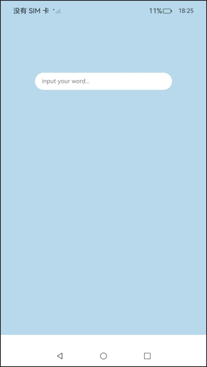
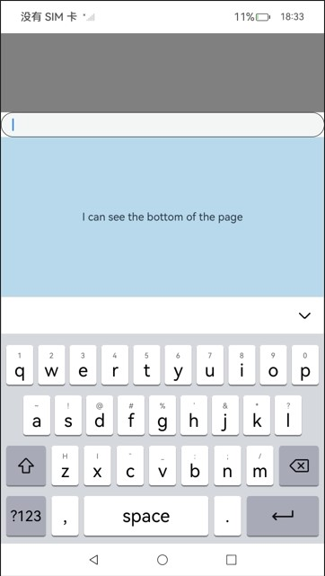
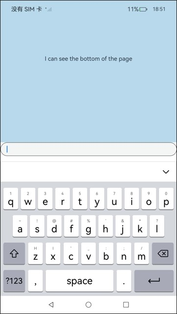
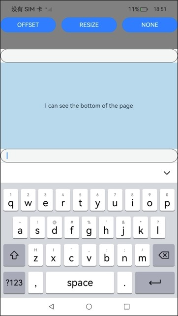
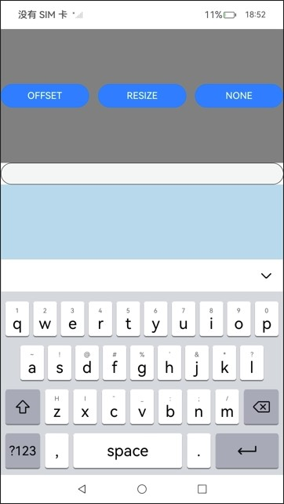
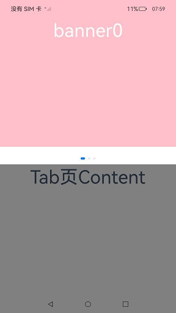
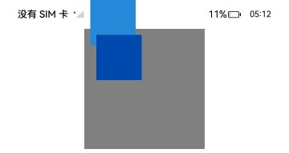
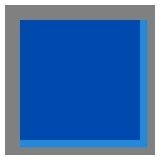
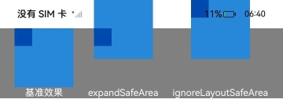

# 安全区域

安全区域是指页面的显示区域，默认情况下开发者开发的界面都布局在安全区域内，不与系统设置的避让区比如状态栏、导航栏区域重叠。提供属性方法允许开发者设置组件绘制内容突破安全区域的限制，通过[expandSafeArea](#expandsafearea)属性支持组件不改变布局情况下扩展其绘制区域至安全区外，通过设置[setKeyboardAvoidMode](#setkeyboardavoidmode11)来配置虚拟键盘弹出时页面的避让模式。页面中有标题栏等文字不希望和避让区重叠时，建议对组件设置expandSafeArea属性实现沉浸式效果，也可以直接通过窗口接口[setWindowLayoutFullScreen](../js-apis-window.md#setwindowlayoutfullscreen9)设置全屏沉浸式。

> **说明：**
>
> 从API Version 10开始支持。后续版本如有新增内容，则采用上角标单独标记该内容的起始版本。<br />
> 摄像头挖孔区域不属于避让区，页面默认不避让挖孔。<br />
> 从API Version 12开始，可在module.json5中添加以下配置项, 摄像头挖孔区域会视为避让区，实现页面默认避让挖孔：<br />
  "metadata": [<br />
    &nbsp;&nbsp;{<br />
    &nbsp;&nbsp;&nbsp;&nbsp;"name": "avoid_cutout",<br />
    &nbsp;&nbsp;&nbsp;&nbsp;"value": "true",<br />
    &nbsp;&nbsp;}<br />
  ],<br />
  

## expandSafeArea

expandSafeArea(types?: Array&lt;SafeAreaType&gt;, edges?: Array&lt;SafeAreaEdge&gt;)

控制组件扩展其安全区域。

**原子化服务API：** 从API version 11开始，该接口支持在原子化服务中使用。

**系统能力：** SystemCapability.ArkUI.ArkUI.Full

**参数：**

| 参数名 | 类型                                               | 必填 | 说明                                                         |
| ------ | -------------------------------------------------- | ---- | ------------------------------------------------------------ |
| types  | Array <[SafeAreaType](ts-types.md#safeareatype10)> | 否   | 配置扩展安全区域的类型。未添加[Metadata](../../apis-ability-kit/js-apis-bundleManager-metadata.md)配置项时，页面不避让挖孔, CUTOUT类型不生效。<br />默认值：[SafeAreaType.SYSTEM, SafeAreaType.CUTOUT, SafeAreaType.KEYBOARD] |
| edges  | Array <[SafeAreaEdge](ts-types.md#safeareaedge10)> | 否   | 配置扩展安全区域的方向。<br />默认值：[SafeAreaEdge.TOP, SafeAreaEdge.BOTTOM, SafeAreaEdge.START, SafeAreaEdge.END]<br />扩展至所有避让区域。 |

>  **说明：**
>
>  设置expandSafeArea属性进行组件绘制扩展时，建议组件尺寸不要设置固定宽高（百分比除外），当设置固定宽高时，扩展安全区域的方向只支持[SafeAreaEdge.TOP, SafeAreaEdge.START]，扩展后的组件尺寸保持不变。
>
>  安全区域不会限制内部组件的布局和大小，不会裁剪内部组件。
>
>  当父容器是滚动容器时，设置expandSafeArea属性不生效。
>
>  设置expandSafeArea()时，不传参，走默认值处理；设置expandSafeArea([],[])时，相当于入参是空数组，此时设置expandSafeArea属性不生效。
>   
>  组件设置expandSafeArea生效的条件为：  
>  1.type为SafeAreaType.KEYBOARD时默认生效，表现为组件不避让键盘。  
>  2.设置其他type，组件的边界与安全区域重合时组件能够延伸到安全区域下。例如：设备顶部状态栏高度100，那么组件在屏幕中的绝对位置需要为0 <= y <= 100。  
>   
>  组件延伸到避让区时，在避让区的事件如点击事件等可能会被系统拦截，优先给状态栏等系统组件响应。
>  
>  滚动类容器内的组件不建议设置expandSafeArea属性，如果设置，需要按照组件嵌套关系，将当前节点到滚动类祖先容器间所有直接节点设置expandSafeArea属性，否则expandSafeArea属性在滚动后可能会失效，写法参考[示例7](#示例7滚动类容器扩展安全区)。
> 
>  expandSafeArea属性仅作用于当前组件，不会向父组件或子组件传递，因此使用过程中，所有相关组件均需配置。
> 
>  同时设置expandSafeArea和position属性时，position属性会优先生效，expandSafeArea属性会后生效。对于未设置position、offset等绘制属性的组件，如果其边界未与避让区重叠，设置expandSafeArea属性将不生效，如弹窗和半模态组件。
> 
>  对于expandSafeArea属性无法生效的场景，若要将组件部署在避让区，需要手动调整组件的坐标。

## setKeyboardAvoidMode<sup>11+</sup>

setKeyboardAvoidMode(value: KeyboardAvoidMode): void

控制虚拟键盘抬起时页面的避让模式。

**原子化服务API：** 从API version 11开始，该接口支持在原子化服务中使用。

**系统能力：** SystemCapability.ArkUI.ArkUI.Full

**参数：**

| 参数名 | 类型                                                 | 必填 | 说明                                                         |
| ------ | ---------------------------------------------------- | ---- | ------------------------------------------------------------ |
| value  | [KeyboardAvoidMode](../js-apis-arkui-UIContext.md#keyboardavoidmode11) | 是   | 配置虚拟键盘抬起时页面的避让模式。<br />默认值：KeyboardAvoidMode.OFFSET，键盘抬起时默认避让模式为上抬。 |

>  **说明：**
>
>  KeyboardAvoidMode.RESIZE模式会压缩页面大小，页面中设置百分比宽高的组件会跟随页面压缩，而直接设置宽高的组件会按设置的固定大小布局。设置KeyboardAvoidMode的RESIZE模式时，expandSafeArea([SafeAreaType.KEYBOARD],[SafeAreaEdge.BOTTOM])不生效。
>
>  KeyboardAvoidMode.NONE模式配置页面不避让键盘，页面会被抬起的键盘遮盖。

## getKeyboardAvoidMode

getKeyboardAvoidMode(): KeyboardAvoidMode

返回虚拟键盘抬起时页面的避让模式。

**原子化服务API：** 从API version 11开始，该接口支持在原子化服务中使用。

**系统能力：** SystemCapability.ArkUI.ArkUI.Full

**返回值：** 

| 名称                                                 | 说明                               |
| ---------------------------------------------------- | ---------------------------------- |
| [KeyboardAvoidMode](../js-apis-arkui-UIContext.md#keyboardavoidmode11) | 返回虚拟键盘抬起时的页面避让模式。 |

## ignoreLayoutSafeArea<sup>20+</sup>

ignoreLayoutSafeArea(types?: Array&lt;LayoutSafeAreaType&gt;, edges?: Array&lt;LayoutSafeAreaEdge&gt;)

控制组件布局时延伸至安全区域。设置ignoreLayoutSafeArea属性可使组件的布局范围扩展至[组件级安全区（safeAreaPadding）](./ts-universal-attributes-size.md#safeareapadding14)和页面级安全区（状态栏、导航栏、挖孔区、软键盘）。依据safeAreaPadding功能，组件能够感知并利用向外累积的邻接可用安全区范围（详见[累计安全区延伸](./ts-universal-attributes-size.md#safeareapadding14)），通过ignoreLayoutSafeArea属性利用该范围进行布局。

**原子化服务API：** 从API version 20开始，该接口支持在原子化服务中使用。

**系统能力：** SystemCapability.ArkUI.ArkUI.Full

**参数：**

| 参数名 | 类型                                               | 必填 | 说明                                                         |
| ------ | -------------------------------------------------- | ---- | ------------------------------------------------------------ |
| types  | Array <[LayoutSafeAreaType](ts-types.md#layoutsafeareatype12)> | 否   | 配置扩展布局安全区域的种类。<br />默认值：[LayoutSafeAreaType.SYSTEM]<br />扩展至系统默认非安全区域。<br />非法值：按默认值处理。 |
| edges  | Array <[LayoutSafeAreaEdge](ts-types.md#layoutsafeareaedge12)> | 否   | 扩展布局安全区域的方向且支持[镜像能力](../../../ui/arkts-mirroring-display.md)。<br />默认值：[LayoutSafeAreaEdge.ALL]<br />扩展至所有方向。<br />非法值：按默认值处理。|

>  **说明：**
>
> 设置ignoreLayoutSafeArea([], [])时，相当于参数为空数组，此时设置ignoreLayoutSafeArea属性的效果等同于未生效。
>
> 对于自适应宽高（即设置了[width](./ts-universal-attributes-size.md#width15)属性或[height](./ts-universal-attributes-size.md#height15)属性为[LayoutPolicy.matchParent](ts-types.md#LayoutPolicy15)）的组件，ignoreLayoutSafeArea将使组件尺寸自适应地撑满父容器安全区；对于非自适应宽高的组件，ignoreLayoutSafeArea将使组件保持原有尺寸，基于扩展后的安全区域计算位置布局。
>
> 与[expandSafeArea](#expandsafearea)的区别在于：expandSafeArea仅扩展组件的渲染区域，后代组件不受当前组件expandSafeArea设置的影响；ignoreLayoutSafeArea扩展组件的布局区域，后代组件能够感知当前组件ignoreLayoutSafeArea设置的效果，即后代节点将基于当前组件经过ignoreLayoutSafeArea布局后的实际结果进行布局。具体对比可参考[示例10](#示例10expandsafearea与ignorelayoutsafearea的区别)。
>
> 组件使用ignoreLayoutSafeArea能力需依赖容器支持，当前支持子组件ignoreLayoutSafeArea的容器组件包括：[Flex](./ts-container-flex.md)、[Row](./ts-container-row.md)、[Column](./ts-container-column.md)、[Stack](./ts-container-stack.md)、[GridRow](./ts-container-gridrow.md)、[GridCol](./ts-container-gridcol.md)、[RowSplit](./ts-container-rowsplit.md)、[ColumnSplit](./ts-container-columnsplit.md)。

## 示例

### 示例1（实现沉浸式效果）

该示例通过设置expandSafeArea属性向顶部和底部扩展安全区实现沉浸式效果。

```ts
// xxx.ets
@Entry
@Component
struct SafeAreaExample1 {
  @State text: string = ''
  controller: TextInputController = new TextInputController()

  build() {
    Row() {
        Column()
          .height('100%').width('100%')
          .backgroundImage($r('app.media.bg')).backgroundImageSize(ImageSize.Cover)
          .expandSafeArea([SafeAreaType.SYSTEM], [SafeAreaEdge.TOP, SafeAreaEdge.BOTTOM])
    }.height('100%')
  }
}
```


### 示例2（同时设置固定宽高和expandSafeArea属性）

该示例展示了同时设置固定宽高和expandSafeArea属性的效果。

```ts
// xxx.ets
@Entry
@Component
struct SafeAreaExample2 {
  @State text: string = ''
  controller: TextInputController = new TextInputController()

  build() {
    Column() {
      TextInput({ text: this.text, placeholder: 'input your word...', controller: this.controller })
        .placeholderFont({ size: 14, weight: 400 })
        .width(320).height(40).offset({y: 120})
        .fontSize(14).fontColor(Color.Black)
        .backgroundColor(Color.White)
    }
    .height('780')
    .width('100%')
    .backgroundColor('rgb(179,217,235)')
    .expandSafeArea([SafeAreaType.SYSTEM], [SafeAreaEdge.TOP, SafeAreaEdge.BOTTOM])
  }
}
```

如下图：Column组件扩展至了顶部状态栏[SafeAreaEdge.TOP]，未扩展至底部导航条[SafeAreaEdge.BOTTOM]，扩展后的组件高度与设置的高度一致。




### 示例3（键盘避让时固定背景图位置）

该示例通过为背景图组件设置expandSafeArea属性，来实现拉起键盘进行避让时，背景图保持不动的效果。

```ts
// xxx.ets
@Entry
@Component
struct SafeAreaExample3 {
  @State text: string = ''
  controller: TextInputController = new TextInputController()

  build() {
    Row() {
      Stack() {
        Column()
          .height('100%').width('100%')
          .backgroundImage($r('app.media.bg')).backgroundImageSize(ImageSize.Cover)
          .expandSafeArea([SafeAreaType.KEYBOARD, SafeAreaType.SYSTEM])
        Column() {
          Button('Set caretPosition 1')
            .onClick(() => {
              this.controller.caretPosition(1)
            })
          TextInput({ text: this.text, placeholder: 'input your word...', controller: this.controller })
            .placeholderFont({ size: 14, weight: 400 })
            .width(320).height(40).offset({y: 120})
            .fontSize(14).fontColor(Color.Black)
            .backgroundColor(Color.White)
        }.width('100%').alignItems(HorizontalAlign.Center)
      }
    }.height('100%')
  }
}
```


### 示例4（设置键盘避让模式为压缩）

该示例通过调用setKeyboardAvoidMode设置键盘避让模式为RESIZE模式，实现键盘抬起时page的压缩效果。

```ts
// EntryAbility.ets
import { KeyboardAvoidMode } from '@kit.ArkUI';

onWindowStageCreate(windowStage: window.WindowStage) {
  // Main window is created, set main page for this ability
  hilog.info(0x0000, 'testTag', '%{public}s', 'Ability onWindowStageCreate');

  windowStage.loadContent('pages/Index', (err, data) => {
    let keyboardAvoidMode = windowStage.getMainWindowSync().getUIContext().getKeyboardAvoidMode();
    // 设置虚拟键盘抬起时压缩页面大小为减去键盘的高度
  windowStage.getMainWindowSync().getUIContext().setKeyboardAvoidMode(KeyboardAvoidMode.RESIZE);
    if (err.code) {
      hilog.error(0x0000, 'testTag', 'Failed to load the content. Cause: %{public}s', JSON.stringify(err) ?? '');
      return;
    }
    hilog.info(0x0000, 'testTag', 'Succeeded in loading the content. Data: %{public}s', JSON.stringify(data) ?? '');
  });
}
```

```ts
// xxx.ets
@Entry
@Component
struct KeyboardAvoidExample1 {
  build() {
    Column() {
      Row().height("30%").width("100%").backgroundColor(Color.Gray)
      TextArea().width("100%").borderWidth(1)
      Text("I can see the bottom of the page").width("100%").textAlign(TextAlign.Center).backgroundColor('rgb(179,217,235)').layoutWeight(1)
    }.width('100%').height("100%")
  }
}
```



### 示例5（设置键盘避让模式为上抬）

该示例通过调用setKeyboardAvoidMode设置键盘避让模式为OFFSET模式，实现键盘抬起时page的上抬效果。但当输入光标距离屏幕底部的高度大于键盘高度时，page不会抬起，如本例中所示。

```ts
// EntryAbility.ets
import { KeyboardAvoidMode } from '@kit.ArkUI';

onWindowStageCreate(windowStage: window.WindowStage) {
  // Main window is created, set main page for this ability
  hilog.info(0x0000, 'testTag', '%{public}s', 'Ability onWindowStageCreate');

  windowStage.loadContent('pages/Index', (err, data) => {
    let keyboardAvoidMode = windowStage.getMainWindowSync().getUIContext().getKeyboardAvoidMode();
    // 设置虚拟键盘抬起时把页面上抬直到露出光标
  windowStage.getMainWindowSync().getUIContext().setKeyboardAvoidMode(KeyboardAvoidMode.OFFSET);
    if (err.code) {
      hilog.error(0x0000, 'testTag', 'Failed to load the content. Cause: %{public}s', JSON.stringify(err) ?? '');
      return;
    }
    hilog.info(0x0000, 'testTag', 'Succeeded in loading the content. Data: %{public}s', JSON.stringify(data) ?? '');
  });
}
```

```ts
// xxx.ets
@Entry
@Component
struct KeyboardAvoidExample2 {
  build() {
    Column() {
      Row().height("30%").width("100%").backgroundColor(Color.Gray)
      TextArea().width("100%").borderWidth(1)
      Text("I can see the bottom of the page").width("100%").textAlign(TextAlign.Center).backgroundColor('rgb(179,217,235)').layoutWeight(1)
    }.width('100%').height("100%")
  }
}
```


### 示例6（切换避让模式）

该示例通过调用setKeyboardAvoidMode来实现OFFSET、RESIZE和NONE模式之间的切换，实现三种不同的键盘避让效果。

```ts
import { hilog } from '@kit.PerformanceAnalysisKit';
import { KeyboardAvoidMode } from '@kit.ArkUI';
@Entry
@Component

struct KeyboardAvoidExample3 {
  build() {
    Column() {
      Row({space:15}) {
        Button('OFFSET')
          .onClick(() => {
            this.getUIContext().setKeyboardAvoidMode(KeyboardAvoidMode.OFFSET);
            hilog.info(0x0000, 'keyboardAvoidMode: %{public}s', JSON.stringify(this.getUIContext().getKeyboardAvoidMode()));
          })
          .layoutWeight(1)
        Button('RESIZE')
          .onClick(() => {
            this.getUIContext().setKeyboardAvoidMode(KeyboardAvoidMode.RESIZE);
            hilog.info(0x0000, 'keyboardAvoidMode: %{public}s', JSON.stringify(this.getUIContext().getKeyboardAvoidMode()));
          })
          .layoutWeight(1)
        Button('NONE')
          .onClick(() => {
            this.getUIContext().setKeyboardAvoidMode(KeyboardAvoidMode.NONE);
            hilog.info(0x0000, 'keyboardAvoidMode: %{public}s', JSON.stringify(this.getUIContext().getKeyboardAvoidMode()));
          })
          .layoutWeight(1)
      }
      .height("30%")
      .width("100%")
      .backgroundColor(Color.Gray)

      TextArea()
        .width("100%")
        .borderWidth(1)
      
      Text("I can see the bottom of the page")
        .width("100%")
        .textAlign(TextAlign.Center)
        .backgroundColor('rgb(179,217,235)')
        .layoutWeight(1)
      
      TextArea()
        .width("100%")
        .borderWidth(1)
    }
    .width('100%')
    .height("100%")
  }
}
```
OFFSET模式



RESIZE模式



NONE模式



### 示例7（滚动类容器扩展安全区）

该示例通过在滚动类容器内调用expandSafeArea属性实现沉浸式效果。

```ts
class SwiperDataSource implements IDataSource {
  private list: Array<Color> = []
  constructor(list: Array<Color>) {
    this.list = list
  }
  totalCount(): number {
    return this.list.length
  }
  getData(index: number): Color {
    return this.list[index]
  }
  registerDataChangeListener(listener: DataChangeListener): void {
  }
  unregisterDataChangeListener(listener: DataChangeListener): void {
  }
}
@Entry
@Component
struct ExpandSafeAreaTest {
  private swiperController: SwiperController = new SwiperController()
  private swiperData: SwiperDataSource = new SwiperDataSource([])
  private list: Array<Color> = [
    Color.Pink,
    Color.Blue,
    Color.Green
  ]
  aboutToAppear(): void {
    this.swiperData = new SwiperDataSource(this.list)
  }
  build() {
    Scroll() {
      Column() {
        Swiper(this.swiperController) {
          LazyForEach(this.swiperData, (item: Color, index: number) => {
            Column() {
              Text('banner' + index).fontSize(50).fontColor(Color.White)
            }
            .expandSafeArea([SafeAreaType.SYSTEM], [SafeAreaEdge.TOP, SafeAreaEdge.BOTTOM])
            .width('100%')
            .height(400)
            .backgroundColor(item)
          })
        }
        .loop(true)
        .expandSafeArea([SafeAreaType.SYSTEM], [SafeAreaEdge.TOP, SafeAreaEdge.BOTTOM])
        .clip(false)
        Column(){
          Text("Tab页Content").fontSize(50)
        }.width("100%").height(1000)
        .backgroundColor(Color.Grey)
      }.expandSafeArea([SafeAreaType.SYSTEM], [SafeAreaEdge.TOP, SafeAreaEdge.BOTTOM])
    }
    .clip(false)
    .edgeEffect(EdgeEffect.None)
    .width("100%").height("100%")
  }
}
```


### 示例8（ignoreLayoutSafeArea延伸组件布局范围）

该示例利用ignoreLayoutSafeArea改变组件位置。相比未使用该属性，配置ignoreLayoutSafeArea后，Row组件基于Stack内容区、Stack组件级安全区、系统状态栏共同组成的范围，取其左上部分，作左上对齐。

```ts
import { LengthMetrics } from '@kit.ArkUI'

@Entry
@Component
struct IgnoreLayoutSafeAreaTest1 {
  build() {
    Column() {
      Stack() {
        Row()
          .backgroundColor('rgb(39, 135, 217)')
          .width(75)  // 固定宽度
          .height(75) // 固定高度
          .ignoreLayoutSafeArea([LayoutSafeAreaType.SYSTEM], [LayoutSafeAreaEdge.START, LayoutSafeAreaEdge.TOP])  // 设置布局区域延伸取左和上方向，至系统避让区SYSTEM
        
        Row()
          .backgroundColor('rgb(0, 74, 175)')
          .width(75)
          .height(75)

      }
      .width(200)
      .height(200)
      .backgroundColor(Color.Gray)
      .align(Alignment.TopStart)  // 子组件相对于Stack容器左上对齐
      .padding({
        left: 10  // 设置左侧10vp普通内边距
      })
      .safeAreaPadding(LengthMetrics.vp(10))  // 设置10vp安全区内边距（即组件级安全区）
    }
    .width("100%")
  }
}
```


### 示例9（ignoreLayoutSafeArea配合LayoutPolicy.matchParent延伸组件布局范围）

该示例利用ignoreLayoutSafeArea和LayoutPolicy.matchParent同时改变组件大小和位置。相比未使用该属性，配置ignoreLayoutSafeArea后，Row组件基于Stack内容区、Stack组件级安全区，取其右下部分并撑满可用空间。

```ts
import { LengthMetrics } from '@kit.ArkUI'

@Entry
@Component
struct IgnoreLayoutSafeAreaTest2 {
  build() {
    Column() {
      Stack() {
        Row()
          .backgroundColor('rgb(39, 135, 217)')
          .width(LayoutPolicy.matchParent)  // 自适应宽度
          .height(LayoutPolicy.matchParent) // 自适应高度
          .ignoreLayoutSafeArea([LayoutSafeAreaType.ALL], [LayoutSafeAreaEdge.END, LayoutSafeAreaEdge.BOTTOM])  // 设置布局区域延伸取右和下方向，至全部避让区ALL

        Row()
          .backgroundColor('rgb(0, 74, 175)')
          .width(LayoutPolicy.matchParent)
          .height(LayoutPolicy.matchParent)

      }
      .width(200)
      .height(200)
      .backgroundColor(Color.Gray)
      .align(Alignment.TopStart)  // 子组件相对于Stack容器左上对齐
      .padding(10) // 设置10vp普通内边距
      .safeAreaPadding(LengthMetrics.vp(10))  // 设置10vp安全区内边距（即组件级安全区）
    }
    .width("100%")
  }
}
```


### 示例10（expandSafeArea与ignoreLayoutSafeArea的区别）

该示例展示了容器分别设置了expandSafeArea和ignoreLayoutSafeArea的布局效果和各自对子组件布局效果的影响。两种设置下，容器都可见地进行了延伸，但前者的子组件不受延伸影响，后者的子组件因父容器的延伸改变了位置。

```ts
import { LengthMetrics } from '@kit.ArkUI'

@Entry
@Component
struct IgnoreLayoutSafeAreaTest2 {
  build() {
    Row(){
      Column(){
        Stack(){
          Stack(){

          }
          .width(30)
          .height(30)
          .backgroundColor('rgb(0, 74, 175)')
        }
        .width(100)
        .height(100)
        .backgroundColor('rgb(39, 135, 217)')
        .align(Alignment.TopStart)

        Text("基准效果").fontColor(Color.White)
      }

      Column(){
        Stack(){
          Stack(){

          }
          .width(30)
          .height(30)
          .backgroundColor('rgb(0, 74, 175)')
        }
        .width(100)
        .height(100)
        .backgroundColor('rgb(39, 135, 217)')
        .align(Alignment.TopStart)
        .expandSafeArea()

        Text("expandSafeArea").fontColor(Color.White)
      }

      Column(){
        Stack(){
          Stack(){

          }
          .width(30)
          .height(30)
          .backgroundColor('rgb(0, 74, 175)')
        }
        .width(100)
        .height(100)
        .backgroundColor('rgb(39, 135, 217)')
        .align(Alignment.TopStart)
        .ignoreLayoutSafeArea()

        Text("ignoreLayoutSafeArea").fontColor(Color.White)
      }
    }
    .width("100%")
    .backgroundColor(Color.Gray)
    .justifyContent(FlexAlign.SpaceEvenly)
  }
}
```
