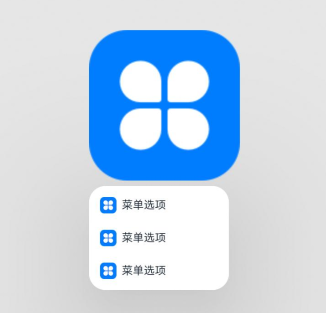

# 菜单控制

为组件绑定弹出式菜单，弹出式菜单以垂直列表形式显示菜单项，可通过长按、点击或鼠标右键触发。

>  **说明：**
>
>  - 从API Version 7开始支持。后续版本如有新增内容，则采用上角标单独标记该内容的起始版本。
>
>  - CustomBuilder里不支持再使用bindMenu、bindContextMenu弹出菜单。多级菜单可使用[Menu组件](ts-basic-components-menu.md)。
>
>  - 弹出菜单的文本内容不支持长按选中。

## bindMenu

bindMenu(content: Array<MenuElement&gt; | CustomBuilder, options?: MenuOptions)

给组件绑定菜单，点击后弹出菜单。弹出菜单项支持图标+文本排列和自定义两种功能。

**系统能力：** SystemCapability.ArkUI.ArkUI.Full

**参数：**

| 参数名  | 类型                                                         | 必填 | 说明                                         |
| ------- | ------------------------------------------------------------ | ---- | -------------------------------------------- |
| content | Array<[MenuElement](#menuelement)&gt;&nbsp;\|&nbsp;[CustomBuilder](ts-types.md#custombuilder8) | 是   | 配置菜单项图标和文本的数组，或者自定义组件。 |
| options | [MenuOptions](#menuoptions10)                                | 否   | 配置弹出菜单的参数。                         |

## bindMenu<sup>11+</sup>

bindMenu(isShow: boolean, content: Array<MenuElement&gt; | CustomBuilder, options?: MenuOptions)

给组件绑定菜单，点击后弹出菜单。弹出菜单项支持图标+文本排列和自定义两种功能。

**系统能力：** SystemCapability.ArkUI.ArkUI.Full

**参数：**

| 参数名               | 类型                                                         | 必填 | 说明                                                         |
| -------------------- | ------------------------------------------------------------ | ---- | ------------------------------------------------------------ |
| isShow<sup>11+</sup> | boolean                                                      | 是   | 支持开发者通过状态变量控制显隐，默认值为false，menu弹窗必须等待页面全部构建才能展示，因此不能在页面构建中设置为true，否则会导致显示位置及形状错误，当前不支持双向绑定。 |
| content              | Array<[MenuElement](#menuelement)&gt;&nbsp;\|&nbsp;[CustomBuilder](ts-types.md#custombuilder8) | 是   | 配置菜单项图标和文本的数组，或者自定义组件。                 |
| options              | [MenuOptions](#menuoptions10)                                | 否   | 配置弹出菜单的参数。                                         |
| transition | [TransitionEffect](ts-transition-animation-component.md#transitioneffect10对象说明)<sup>10+</sup> | 否   | 设置菜单显示和退出的过渡效果。说明：详细描述见[TransitionEffect](ts-transition-animation-component.md#transitioneffect10对象说明)<sup>10+</sup>对象说明。 |

## bindContextMenu<sup>8+</sup>

bindContextMenu(content: CustomBuilder, responseType: ResponseType, options?: ContextMenuOptions)

给组件绑定菜单，触发方式为长按或者右键点击，弹出菜单项需要自定义。

**系统能力：** SystemCapability.ArkUI.ArkUI.Full

**参数：**

| 参数名       | 类型                                               | 必填 | 说明                                         |
| ------------ | -------------------------------------------------- | ---- | -------------------------------------------- |
| content      | [CustomBuilder](ts-types.md#custombuilder8)        | 是   | 配置菜单项图标和文本的数组，或者自定义组件。 |
| responseType | [ResponseType](ts-appendix-enums.md#responsetype8) | 是   | 菜单弹出条件，长按或者右键点击。             |
| options      | [ContextMenuOptions](#contextmenuoptions10)        | 否   | 配置弹出菜单的参数。                         |

## bindContextMenu<sup>12+</sup>

bindContextMenu(isShown: boolean, content: CustomBuilder, options?: ContextMenuOptions)

给组件绑定菜单，触发方式为控制绑定的isShown。

isShown为true，弹出菜单。isShown为false，隐藏菜单。弹出菜单项需要自定义。

菜单弹出不跟随点击位置，只与placement设置有关。

**系统能力：** SystemCapability.ArkUI.ArkUI.Full

**参数：**

| 参数名       | 类型                                               | 必填 | 说明                                         |
| ------------ | -------------------------------------------------- | ---- | -------------------------------------------- |
| isShown | boolean | 是   | 支持开发者通过状态变量控制显隐，默认值为false。menu需要在页面全部构建完成后才能弹窗展示，如果在页面构建前或构建中设置为true，可能导致显示位置及形状错误、无法正常弹出显示等问题。当前不支持双向绑定。             |
| content      | [CustomBuilder](ts-types.md#custombuilder8)        | 是   | 配置菜单项图标和文本的数组，或者自定义组件。 |
| options      | [ContextMenuOptions](#contextmenuoptions10)                      | 否   | 配置弹出菜单的参数。                         |
| transition | [TransitionEffect](ts-transition-animation-component.md#transitioneffect10对象说明)<sup>10+</sup> | 否   | 设置菜单显示和退出的过渡效果。说明：详细描述见[TransitionEffect](ts-transition-animation-component.md#transitioneffect10对象说明)<sup>10+</sup>对象说明。 |

## MenuElement

| 名称                  | 类型                                   | 必填 | 描述                                                         |
| --------------------- | -------------------------------------- | ---- | ------------------------------------------------------------ |
| value                 | [ResourceStr](ts-types.md#resourcestr) | 是   | 菜单项文本。                                                 |
| icon<sup>10+</sup>    | [ResourceStr](ts-types.md#resourcestr) | 否   | 菜单项图标。                                                 |
| enabled<sup>11+</sup> | boolean                                | 否   | 菜单条目是否可进行交互。<br/>默认值：true, 菜单条目可以进行交互。 |
| action                | ()&nbsp;=&gt;&nbsp;void                | 是   | 点击菜单项的事件回调。                                       |

## MenuOptions<sup>10+</sup>

继承自[ContextMenuOptions](#contextmenuoptions10)。

| 名称                          | 类型                                   | 必填 | 描述                                                         |
| ----------------------------- | -------------------------------------- | ---- | ------------------------------------------------------------ |
| title                         | [ResourceStr](ts-types.md#resourcestr) | 否   | 菜单标题。<br>**说明：**<br/>仅在content设置为Array<[MenuElement](#menuelement)&gt; 时生效。 |
| showInSubWindow<sup>11+</sup> | boolean                                | 否   | 是否在子窗口显示菜单。<br/>默认值：2in1设备为true，其他设备为false。                     |

## ContextMenuOptions<sup>10+</sup>

| 名称                  | 类型                                                         | 必填 | 描述                                                         |
| --------------------- | ------------------------------------------------------------ | ---- | ------------------------------------------------------------ |
| offset                | [Position](ts-types.md#position8)                            | 否   | 菜单弹出位置的偏移量，不会导致菜单显示超出屏幕范围。<br/>**说明：**<br />菜单类型为相对⽗组件区域弹出时，⾃动根据菜单位置属性 (placement)将区域的宽或⾼计⼊偏移量中。<br/>当菜单相对父组件出现在上侧时（placement设置为Placement.TopLeft，Placement.Top，Placement.TopRight），x为正值，菜单相对组件向右进行偏移，y为正值，菜单相对组件向上进行偏移。<br/>当菜单相对父组件出现在下侧时（placement设置为Placement.BottomLeft，Placement.Bottom，Placement.BottomRight），x为正值，菜单相对组件向右进行偏移，y为正值，菜单相对组件向下进行偏移。<br/>当菜单相对父组件出现在左侧时（placement设置为Placement.LeftTop，Placement.Left，Placement.LeftBottom），x为正值，菜单相对组件向左进行偏移，y为正值，菜单相对组件向下进行偏移。<br/>当菜单相对父组件出现在右侧时（placement设置为Placement.RightTop，Placement.Right，Placement.RightBottom），x为正值，菜单相对组件向右进行偏移，y为正值，菜单相对组件向下进行偏移。<br/>如果菜单调整了显示位置（与placement初始值主方向不⼀致），则偏移值 (offset) 失效。 |
| placement             | [Placement](ts-appendix-enums.md#placement8)                 | 否   | 菜单组件优先显示的位置，当前位置显示不下时，会自动调整位置。<br/>**说明：**<br />placement值设置为undefined、null或没有设置此选项时，按未设置placement处理，当使用[bindContextMenu<sup>8+</sup>](#bindcontextmenu8)，菜单跟随点击位置弹出；当使用[bindContextMenu<sup>12+</sup>](#bindcontextmenu12)，按默认值：Placement.BottomLeft设置。 |
| enableArrow           | boolean                                                      | 否   | 是否显示箭头。如果菜单的大小和位置不足以放置箭头时，不会显示箭头。 <br/>默认值：false, 不显示箭头。<br/>**说明：**<br />enableArrow为true时，placement未设置或者值为非法值，默认在目标物上方显示，否则按照placement的位置优先显示。当前位置显示不下时，会自动调整位置，enableArrow为undefined时，不显示箭头。 |
| arrowOffset           | [Length](ts-types.md#length)                                 | 否   | 箭头在菜单处的偏移。箭头在菜单水平方向时，偏移量为箭头至最左侧的距离，默认居中。箭头在菜单竖直方向时，偏移量为箭头至最上侧的距离，默认居中。偏移量必须合法且转换为具体数值时大于0才会生效，另外该值生效时不会导致箭头超出菜单四周的安全距离。根据配置的placement来计算是在水平还是竖直方向上偏移。 |
| preview<sup>11+</sup> | [MenuPreviewMode](ts-appendix-enums.md#menupreviewmode11)\|&nbsp;[CustomBuilder](ts-types.md#custombuilder8) | 否   | 长按悬浮菜单或使用[bindContextMenu<sup>12+</sup>](#bindcontextmenu12)显示菜单的预览内容样式，可以为目标组件的截图，也可以为用户自定义的内容。<br/>默认值：MenuPreviewMode.NONE, 无预览内容。<br/>**说明：**<br />- 不支持responseType为ResponseType.RightClick时触发，如果responseType为ResponseType.RightClick，则不会显示预览内容。<br />- 当未设置preview参数或preview参数设置为MenuPreviewMode.NONE时，enableArrow参数生效。<br />- 当preview参数设置为MenuPreviewMode.IMAGE或CustomBuilder时，enableArrow为true时也不显示箭头。 |
| previewAnimationOptions<sup>11+</sup> | [ContextMenuAnimationOptions](#contextmenuanimationoptions11) | 否    | 控制长按预览显示动画开始倍率和结束倍率（相对预览原图比例）。<br/>默认值：{scale: [0.95, 1.1]}。<br/>**说明：**<br />-倍率设置参数小于等于0时，不生效。<br />-当前只在preview设置为MenuPreviewMode.IMAGE模式时生效。 |
| onAppear              | ()&nbsp;=&gt;&nbsp;void                                      | 否   | 菜单弹出时的事件回调。                                       |
| onDisappear           | ()&nbsp;=&gt;&nbsp;void                                      | 否   | 菜单消失时的事件回调。                                       |
| aboutToAppear              | ()&nbsp;=&gt;&nbsp;void                                      | 否   | 菜单显示动效前的事件回调。                                       |
| aboutToDisappear           | ()&nbsp;=&gt;&nbsp;void                                      | 否   | 菜单退出动效前的事件回调。                                       |
| backgroundColor<sup>11+</sup> | [ResourceColor](ts-types.md#resourcecolor)  | 否 | 弹窗背板颜色。<br/>默认值：Color.Transparent。 |
| backgroundBlurStyle<sup>11+</sup> | [BlurStyle](ts-appendix-enums.md#blurstyle9) | 否 | 弹窗背板模糊材质。<br/>默认值：BlurStyle.COMPONENT_ULTRA_THICK。 |

## ContextMenuAnimationOptions<sup>11+</sup>

| 名称  | 类型                                       | 必填 | 描述                                 |
| ----- | ------------------------------------------ | ---- | ------------------------------------ |
| scale | [AnimationRange](#animationrange11)\<number> | 否   | 动画开始和结束时相对预览原图缩放比例。 |

## AnimationRange<sup>11+</sup>

表示动画开始和结束时相对预览原图缩放比例。

系统能力：SystemCapability.ArkUI.ArkUI.Full

| 取值范围         | 说明                                                                           |
| ---------------- | ------------------------------------------------------------------------------ |
| [from: T, to: T] | from表示动画开始时相对预览原图缩放比例，to表示动画结束时相对预览原图缩放比例。 |

## 示例

### 示例1

普通菜单

```ts
// xxx.ets
@Entry
@Component
struct MenuExample {
  build() {
    Column() {
      Text('click for Menu')
    }
    .width('100%')
    .margin({ top: 5 })
    .bindMenu([
      {
        value: 'Menu1',
        action: () => {
          console.info('handle Menu1 select')
        }
      },
      {
        value: 'Menu2',
        action: () => {
          console.info('handle Menu2 select')
        }
      },
    ])
  }
}
```


### 示例2

自定义内容菜单

```ts
@Entry
@Component
struct MenuExample {
  @State listData: number[] = [0, 0, 0]

  @Builder MenuBuilder() {
    Flex({ direction: FlexDirection.Column, justifyContent: FlexAlign.Center, alignItems: ItemAlign.Center }) {
      ForEach(this.listData, (item:number, index) => {
        Column() {
          Row() {
            Image($r("app.media.icon")).width(20).height(20).margin({ right: 5 })
            Text(`Menu${index as number + 1}`).fontSize(20)
          }
          .width('100%')
          .height(30)
          .justifyContent(FlexAlign.Center)
          .align(Alignment.Center)
          .onClick(() => {
            console.info(`Menu${index as number + 1} Clicked!`)
          })

          if (index != this.listData.length - 1) {
            Divider().height(10).width('80%').color('#ccc')
          }
        }.padding(5).height(40)
      })
    }.width(100)
  }

  build() {
    Column() {
      Text('click for menu')
        .fontSize(20)
        .margin({ top: 20 })
        .bindMenu(this.MenuBuilder)
    }
    .height('100%')
    .width('100%')
    .backgroundColor('#f0f0f0')
  }
}
```


### 示例3

菜单(长按触发显示)

```ts
// xxx.ets
@Entry
@Component
struct ContextMenuExample {
  @Builder MenuBuilder() {
    Flex({ direction: FlexDirection.Column, justifyContent: FlexAlign.Center, alignItems: ItemAlign.Center }) {
      Text('Test menu item 1')
        .fontSize(20)
        .width(100)
        .height(50)
        .textAlign(TextAlign.Center)
      Divider().height(10)
      Text('Test menu item 2')
        .fontSize(20)
        .width(100)
        .height(50)
        .textAlign(TextAlign.Center)
    }.width(100)
  }

  build() {
    Column() {
      Text('LongPress for menu')
    }
    .width('100%')
    .margin({ top: 5 })
    .bindContextMenu(this.MenuBuilder, ResponseType.LongPress)
  }
}
```


### 示例4

指向性菜单(右键触发显示)

```ts
// xxx.ets
@Entry
@Component
struct DirectiveMenuExample {
  @Builder MenuBuilder() {
    Flex({ direction: FlexDirection.Column, alignItems: ItemAlign.Center, justifyContent: FlexAlign.Center }) {
      Text('Options')
      Divider().strokeWidth(2).margin(5).color('#F0F0F0')
      Text('Hide')
      Divider().strokeWidth(2).margin(5).color('#F0F0F0')
      Text('Exit')
    }
    .width(200)
  }

  build() {
    Flex({ direction: FlexDirection.Column, alignItems: ItemAlign.Center, justifyContent: FlexAlign.Center }) {
      Column() {
        Text("DirectiveMenuExample")
          .fontSize(20)
          .width('100%')
          .height("25%")
          .backgroundColor('#F0F0F0')
          .textAlign(TextAlign.Center)
          .bindContextMenu(this.MenuBuilder, ResponseType.RightClick, {
            enableArrow: true,
            placement: Placement.Bottom
          })
      }
    }
    .width('100%')
    .height('100%')
  }
}
```


### 示例5

长按悬浮菜单（预览内容为截图形式）

```ts
// xxx.ets
@Entry
@Component
struct Index {
  private iconStr: ResourceStr = $r("app.media.icon")

  @Builder
  MyMenu() {
    Menu() {
      MenuItem({ startIcon: this.iconStr, content: "菜单选项" })
      MenuItem({ startIcon: this.iconStr, content: "菜单选项" })
      MenuItem({ startIcon: this.iconStr, content: "菜单选项" })
    }
  }

  build() {
    Column({ space: 50 }) {
      Column() {
        Column() {
          Text('preview-image')
            .width(200)
            .height(100)
            .textAlign(TextAlign.Center)
            .margin(100)
            .fontSize(30)
            .bindContextMenu(this.MyMenu, ResponseType.LongPress,
              { preview: MenuPreviewMode.IMAGE,
                previewAnimationOptions: {scale: [0.8, 1.0]},
              })
            .backgroundColor("#ff3df2f5")
        }
      }.width('100%')
    }
  }
}
```


### 示例6

长按悬浮菜单（自定义预览内容）

```ts
// xxx.ets
@Entry
@Component
struct Index {
  private iconStr: ResourceStr = $r("app.media.icon")

  @Builder
  MyMenu() {
    Menu() {
      MenuItem({ startIcon: this.iconStr, content: "菜单选项" })
      MenuItem({ startIcon: this.iconStr, content: "菜单选项" })
      MenuItem({ startIcon: this.iconStr, content: "菜单选项" })
    }
  }

  @Builder
  MyPreview() {
    Column() {
      Image($r('app.media.icon'))
        .width(200)
        .height(200)
    }
  }

  build() {
    Column({ space: 50 }) {
      Column() {
        Column() {
          Text('preview-builder')
            .width(200)
            .height(100)
            .textAlign(TextAlign.Center)
            .margin(100)
            .fontSize(30)
            .bindContextMenu(this.MyMenu, ResponseType.LongPress,
              {
                preview: this.MyPreview
              })
        }
      }.width('100%')
    }
  }
}
```



### 示例7

通过绑定isShown控制菜单（自定义预览内容）

```ts
// xxx.ets
@Entry
@Component
struct Index {
  private iconStr: ResourceStr = $r("app.media.icon")
  @State isShown: boolean = false

  @Builder
  MyMenu() {
    Menu() {
      MenuItem({ startIcon: this.iconStr, content: "菜单选项" })
      MenuItem({ startIcon: this.iconStr, content: "菜单选项" })
      MenuItem({ startIcon: this.iconStr, content: "菜单选项" })
    }
  }

  @Builder
  MyPreview() {
    Column() {
      Image($r('app.media.icon'))
        .width(200)
        .height(200)
    }
  }

  build() {
    Column({ space: 50 }) {
      Column() {
        Column() {
          Text('preview-builder')
            .width(200)
            .height(100)
            .textAlign(TextAlign.Center)
            .margin(100)
            .fontSize(30)
            .bindContextMenu(this.isShown, this.MyMenu,
              {
                preview: this.MyPreview,
                onDisappear: ()=>{
                    this.isShown = false;
                }
              })
          Button('click')
            .onClick(()=>{
                this.isShown = true;
             })
        }
      }.width('100%')
    }
  }
}
```

### 示例8

通过transition自定义菜单和预览的显示/退出动效属性

```ts
// xxx.ets
@Entry
@Component
struct MenuExample {
  @Builder MenuBuilder() {
    Flex({ direction: FlexDirection.Column, justifyContent: FlexAlign.Center, alignItems: ItemAlign.Center }) {
      Text('Test menu item 1')
        .fontSize(12)
        .width(200)
        .height(30)
        .textAlign(TextAlign.Center)
      Divider().height(10)
      Text('Test menu item 2')
        .fontSize(12)
        .width(100)
        .height(30)
        .textAlign(TextAlign.Center)
    }.width(100)
  }
  @Builder
  MyPreview() {
    Column() {
      Image($r('app.media.icon'))
        .width(50)
        .height(50)
    }
  }
  @State isShow:boolean = false
  private iconStr: ResourceStr = $r("app.media.icon")

  @Builder
  MyMenu() {
    Menu() {
      MenuItem({ startIcon: this.iconStr, content: "菜单选项" })
      MenuItem({ startIcon: this.iconStr, content: "菜单选项" })
      MenuItem({ startIcon: this.iconStr, content: "菜单选项" })
    }
  }
  build() {
    Column() {
      Button('LongPress bindContextMenu')
        .margin({ top: 15 })
        .bindContextMenu(
          this.MenuBuilder,
          ResponseType.LongPress,{
          transition: TransitionEffect.OPACITY.animation({ duration: 4000, curve: Curve.Ease }).combine(
            TransitionEffect.rotate({ z: 1, angle: 180 })),
          preview: this.MyPreview,
          previewAnimationOptions: {
            scale: [0.8, 1.0],
            transition: TransitionEffect.OPACITY.animation({ duration: 4000, curve: Curve.Ease }).combine(
              TransitionEffect.rotate({ z: 1, angle: 180 }))
          }
        })
    }
    .width('100%')
    .margin({ top: 5 })
  }
}
```


