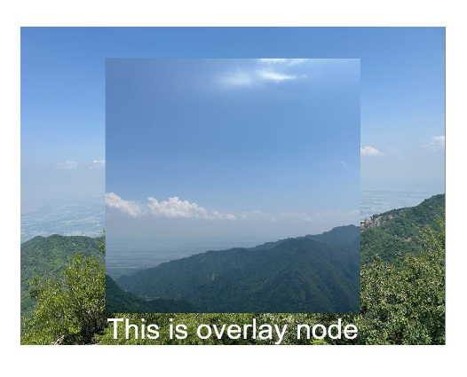

# 浮层

设置组件的遮罩文本。

>  **说明：**
>
>  从API Version 7开始支持。后续版本如有新增内容，则采用上角标单独标记该内容的起始版本。

## overlay

overlay(value: string | CustomBuilder, options?: { align?: Alignment; offset?: { x?: number; y?: number } })

在当前组件上，增加遮罩文本或者叠加自定义组件作为该组件的浮层。

**卡片能力：** 从API version 9开始，该接口支持在ArkTS卡片中使用。

**原子化服务API：** 从API version 11开始，该接口支持在原子化服务中使用。

**系统能力：** SystemCapability.ArkUI.ArkUI.Full

**参数：** 

| 参数名  | 类型                                                         | 必填 | 说明                                                         |
| ------- | ------------------------------------------------------------ | ---- | ------------------------------------------------------------ |
| value   | string&nbsp;\|&nbsp;[CustomBuilder](ts-types.md#custombuilder8)<sup>10+</sup> | 是   | 遮罩文本内容或自定义组件构造函数。<br/>**说明：**<br/>自定义组件作为浮层时，不支持键盘走焦到自定义组件中。 |
| options | &nbsp;{<br/>align?:&nbsp;[Alignment](ts-appendix-enums.md#alignment),&nbsp;<br/>offset?:&nbsp;{x?:&nbsp;number, y?:&nbsp;number}<br/>} | 否   | 浮层的定位。<br/>-&nbsp;align：设置浮层相对于组件的方位。<br/>-&nbsp;offset：设置浮层基于自身左上角的偏移量。浮层默认处于组件左上角。<br/>**说明：**<br/>两者都设置时效果重叠，浮层相对于组件方位定位后再基于当前位置的左上角进行偏移。 |

>  **说明：**
>
>  overlay节点不支持onAppear和onDisappear等和节点生命周期相关的事件。

## 示例

### 示例1

```ts
// xxx.ets
@Entry
@Component
struct OverlayExample {
  build() {
    Column() {
      Column() {
        Text('floating layer')
          .fontSize(12).fontColor(0xCCCCCC).maxLines(1)
        Column() {
          Image($r('app.media.img'))
            .width(240).height(240)
            .overlay("Winter is a beautiful season, especially when it snows.", {
              align: Alignment.Bottom,
              offset: { x: 0, y: -15 }
            })
        }.border({ color: Color.Black, width: 2 })
      }.width('100%')
    }.padding({ top: 20 })
  }
}
```


### 示例2

```ts
// xxx.ets
@Entry
@Component
struct OverlayExample {
  @Builder OverlayNode() {
    Column() {
      Image($r('app.media.img1'))
      Text("This is overlayNode").fontSize(20).fontColor(Color.White)
    }.width(180).height(180).alignItems(HorizontalAlign.Center)
  }

  build() {
    Column() {
      Image($r('app.media.img2'))
        .overlay(this.OverlayNode(), { align: Alignment.Center })
        .objectFit(ImageFit.Contain)
    }.width('100%')
    .border({ color: Color.Black, width: 2 }).padding(20)
  }
}
```

